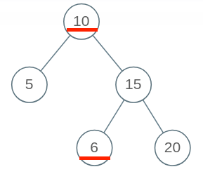
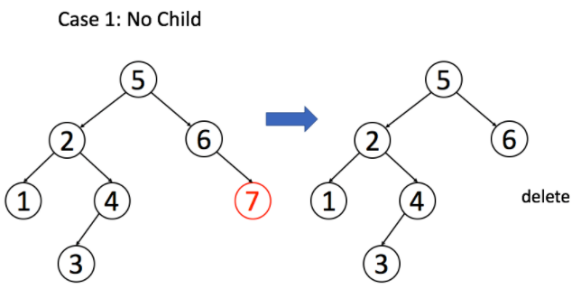
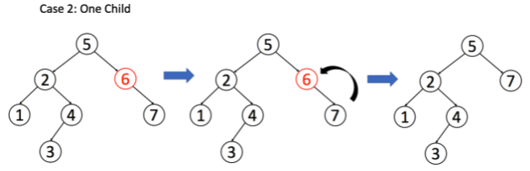
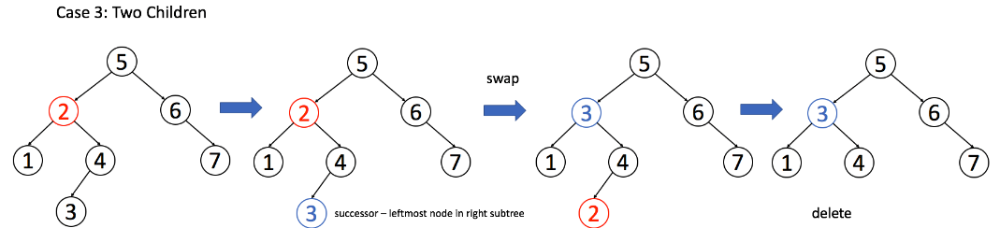

#  Binary Search Tree 二叉搜索树

------

- ## [LC98. 验证二叉搜索树的合法性](https://leetcode-cn.com/problems/validate-binary-search-tree/)

    一个二叉搜索树具有如下特征：

    节点的左子树只包含小于当前节点的数。
    节点的右子树只包含大于当前节点的数。
    所有左子树和右子树自身必须也是二叉搜索树。
    示例 1:

    输入:

    ```wiki
        2
       / \
      1   3
    ```

    输出: true
    示例 2:

    输入:

    ```wiki
        5
       / \
      1   4
         / \
        3   6
    ```

    输出: false
    解释: 输入为: [5,1,4,null,null,3,6]。
         根节点的值为 5 ，但是其右子节点值为 4 。

    示例 3:

    

    输出：false，6比10小。

    函数签名：

    ```java
    public boolean isValidBST(TreeNode root);
    ```

    ### <u>**思路**</u>

    ### [判断BST的合法性](https://labuladong.gitbook.io/algo/mu-lu-ye-1/mu-lu-ye-1/er-cha-sou-suo-shu-cao-zuo-ji-jin)

    ### <u>**Solution**</u>

    ```java
    public boolean isValidBST(TreeNode root) {
            return isValid(root, null, null);
        }
    
    /* 限定以 root 为根的子树节点必须满足 max.val > root.val > min.val */
    public boolean isValid(TreeNode root, TreeNode min, TreeNode max){
      	if(root==null) 
        		return true;
    
      	if(min!=null && root.val<=min.val)
      			return false;
      	if(max!=null && root.val>=max.val)
      			return false;
    
      // 限定左子树的最大值是 root.val，右子树的最小值是 root.val
      	return isValid(root.left, min, root)
        		&& isValid(root.right, root, max);
    }
    ```

    

- ##  [LC700. 二叉搜索树中的搜索](https://leetcode-cn.com/problems/search-in-a-binary-search-tree/)

    给定二叉搜索树（BST）的根节点和一个值。 你需要在BST中找到节点值等于给定值的节点。 返回以该节点为根的子树。 如果节点不存在，则返回 NULL。

    例如，

    给定二叉搜索树:

            4
           / \
          2   7
         / \
        1   3

    和 值: 2
    你应该返回如下子树:

          2     
         / \   
        1   3
    在上述示例中，如果要找的值是 5，但因为没有节点值为 5，我们应该返回 NULL。

    函数签名：

    ```java
    public TreeNode searchBST(TreeNode root, int val);
    ```

    

    ### <u>**思路**</u>

    ### [BST logn的遍历框架](https://labuladong.gitbook.io/algo/mu-lu-ye-1/mu-lu-ye-1/er-cha-sou-suo-shu-cao-zuo-ji-jin#zai-bst-zhong-sou-suo-yi-ge-shu): 类似二分查找

    ```java
    void BST(TreeNode root, int target) {
        if (root.val == target)
            // 找到目标，做点什么
        if (root.val < target) 
            BST(root.right, target);
        if (root.val > target)
            BST(root.left, target);
    }
    ```

    ### <u>**Solution**</u>

    ```java
    public TreeNode searchBST(TreeNode root, int val) {
            if (root==null)
                return null;
            if (val==root.val)
                return root;
                
            if (val<root.val) 
                return searchBST(root.left, val);
            else 
                return searchBST(root.right, val);
    }
    ```

- ## [LC701. 二叉搜索树中的插入操作](https://leetcode-cn.com/problems/insert-into-a-binary-search-tree/)

    给定二叉搜索树（BST）的根节点和要插入树中的值，将值插入二叉搜索树。 返回插入后二叉搜索树的根节点。 输入数据 保证 ，新值和原始二叉搜索树中的任意节点值都不同。

    注意，可能存在多种有效的插入方式，只要树在插入后仍保持为二叉搜索树即可。 你可以返回 任意有效的结果 。

     

    示例 1：

    


    输入：root = [4,2,7,1,3], val = 5
    输出：[4,2,7,1,3,5]
    解释：另一个满足题目要求可以通过的树是：

    示例 2：

    

    输入：root = [40,20,60,10,30,50,70], val = 25
    输出：[40,20,60,10,30,50,70,null,null,25]
    示例 3：

    输入：root = [4,2,7,1,3,null,null,null,null,null,null], val = 5
    输出：[4,2,7,1,3,5]

    提示：

    - 新值和原始二叉搜索树中的任意节点值都不同

    函数签名：

    ```java
    public TreeNode insertIntoBST(TreeNode root, int val);
    ```

    ### <u>**思路**</u>

    BST 中的遍历框架，就是**「找」**的问题。直接套框架，加上「改」的操作即可。**一旦涉及「改」，函数就要返回** **`TreeNode`** **类型，并且对递归调用的返回值进行接收**。

    ### <u>**Solution**</u>

    ```java
    public TreeNode insertIntoBST(TreeNode root, int val) {
      	if(root==null)
        		return new TreeNode(val);
    
      //if (root.val == val)
      //BST 中一般不会插入已存在元素
     	 if(val<root.val)
       		 root.left = insertIntoBST(root.left, val);
      	if(val>root.val)
       		 root.right = insertIntoBST(root.right, val);
      	return root;
    }
    ```

- ## [LC450. 删除二叉搜索树中的节点](https://leetcode-cn.com/problems/delete-node-in-a-bst/)

    给定一个二叉搜索树的根节点 root 和一个值 key，删除二叉搜索树中的 key 对应的节点，并保证二叉搜索树的性质不变。返回二叉搜索树（有可能被更新）的根节点的引用。

    一般来说，删除节点可分为两个步骤：

    首先找到需要删除的节点；
    如果找到了，删除它。
    说明： 要求算法时间复杂度为 O(h)，h 为树的高度。

    示例:

    ```wiki
    root = [5,3,6,2,4,null,7]
    key = 3
    
        5
       / \
      3   6
     / \   \
    2   4   7
    
    给定需要删除的节点值是 3，所以我们首先找到 3 这个节点，然后删除它。
    
    一个正确的答案是 [5,4,6,2,null,null,7], 如下图所示。
    
        5
       / \
      4   6
     /     \
    2       7
    
    另一个正确答案是 [5,2,6,null,4,null,7]。
    
        5
       / \
      2   6
       \   \
        4   7
    ```

    函数签名：

    ```java
    public TreeNode deleteNode(TreeNode root, int key);
    ```

    ### <u>**思路**</u>

    先找到要删的值，（找不到返回null）

    找到后，删除节点，有三种情况

    1、 `A` 恰好是末端节点，两个子节点都为空，那么它可以当场去世了。

    

    2、`A` 只有一个非空子节点，那么它要让这个孩子接替自己的位置。

    

    3、`A` 有两个子节点，`A` 必须找到**左子树中最大的那个节点**，或者**右子树中最小的那个节点**来接替自己。

    

    ### <u>**Solution**</u>

    ```java
    public TreeNode deleteNode(TreeNode root, int key) {
        if(root==null)
          	return null;
        if(key==root.val){
            //恰好是末端节点，两个子节点都为空，那么它可以当场去世了
            if(root.left==null && root.right==null)
              	return null;
            //只有一个非空子节点，那么它要让这个孩子接替自己的位置。
            else if(root.left==null)
              	return root.right;
            else if(root.right==null)
              	return root.left;
            //有两个子节点, 必须找到左子树中最大的那个节点，或者右子树中最小的那个节点 来接替自己。
            else {
                //情况三解法1: 左子树中最大的那个节点
                TreeNode maxInLeft = root.left;
                while(maxInLeft.right!=null)
                  	maxInLeft = maxInLeft.right;
                //交换root(要删的node)和maxInleft(替换的node)位置，使要删除的node的位置的情况变成情况1
                root.val = maxInLeft.val;
                //去maxInleft的位置删除node
                root.left = deleteNode(root.left, maxInLeft.val);
    
              /**
                        //情况三解法2: 左子树中最大的那个节点
                        TreeNode maxInRight = root.right;
                        while(maxInRight.left!=null)
                            maxInRight = maxInRight.left;
                        //交换root(要删的node)和maxInleft(替换的node)位置，使要删除的node的位置的情况变成情况1
                        root.val = maxInRight.val;
                        //去maxInleft的位置删除node
                        root.right = deleteNode(root.right, maxInRight.val);
                        */
          }
        } else if(key<root.val){
          	root.left = deleteNode(root.left, key);
        } else {
          	root.right = deleteNode(root.right, key);
        }
        return root;
    }
    ```

    

- ## [LC230. 二叉搜索树中第K小的元素](https://leetcode-cn.com/problems/kth-smallest-element-in-a-bst/)

    给定一个二叉搜索树的根节点 root ，和一个整数 k ，请你设计一个算法查找其中第 k 个最小元素（从 1 开始计数）。

     

    示例 1：

    

    输入：root = [3,1,4,null,2], k = 1
    输出：1
    示例 2：

    


    输入：root = [5,3,6,2,4,null,null,1], k = 3
    输出：3

    


    提示：

    树中的节点数为 n 。
    1 <= k <= n <= 104
    0 <= Node.val <= 104

    签名函数：

    ```java
    public int kthSmallest(TreeNode root, int k);
    ```

    

    ### <u>**思路**</u>

    BST的**中序遍历** (访问顺序**1left 2root 3right**) = **升序**遍历

    ### <u>**Solution**</u>

    ```Java
    int res = -1;
    int rank = 0;
    
    public int kthSmallest(TreeNode root, int k){
      	if (root==null)
        		return -1;
    
        kthSmallest(root.left, k);
    
        //中序遍历位置 
        rank++;
        if (rank==k) {
            res = root.val;
            //return可避免遍历兄弟右子树
            return res;
        }
    
        kthSmallest(root.right, k);
        return res;
    }
    ```

- ## [LC538==LC1038. 把二叉搜索树转换为累加树](https://leetcode-cn.com/problems/convert-bst-to-greater-tree/)

    给出二叉 搜索 树的根节点，该树的节点值各不相同，请你将其转换为累加树（Greater Sum Tree），使每个节点 node 的**新值**等于**原树中**<u>大于或等于 node.val 的值之和</u>。

    示例 1：

    

    输入：[4,1,6,0,2,5,7,null,null,null,3,null,null,null,8]
    输出：[30,36,21,36,35,26,15,null,null,null,33,null,null,null,8]

    函数签名：

    ```java
    public TreeNode bstToGst(TreeNode root);
    ```

    

    ### <u>**思路**</u>

    BST的**中序遍历** (访问顺序倒过来**1right 2root 3left**) = **降序**遍历

    ### <u>**Solution**</u>

    ```java
    int sum = 0;
    public TreeNode bstToGst(TreeNode root) {
        if (root==null)
          	return null;
    
        bstToGst(root.right);
    
        //中序遍历位置
        sum += root.val;
        root.val = sum;
    
        bstToGst(root.left);
        return root;
    }
    ```

- ## [LC96. 不同的二叉搜索树](https://leetcode-cn.com/problems/unique-binary-search-trees/)

    给你一个整数 `n` ，求恰由 `n` 个节点组成且节点值从 `1` 到 `n` 互不相同的 **二叉搜索树** 有多少种？返回满足题意的二叉搜索树的种数。

    示例1:

    

    ```
    输入：n = 3
    输出：5
    ```

    函数签名：

    ```java
    public int numTrees(int n)	
    ```

    ### <u>**思路**</u>

    如果固定 `3` 作为**根节点**，左子树节点就是 `{1,2}` 的组合，右子树就是 `{4,5}` 的组合。

    **左子树的组合数和右子树的组合数乘积**就是 `3` 作为根节点时的 BST 个数。

    其他数作为根节点的也是同样的套路。

    ### <u>**Solution**</u>

    ```java
    int[][] memo;
    public int numTrees(int n) {
      	// 备忘录的值初始化为 0
      	memo = new int[n+1][n+1];
      	return countNumTrees(1, n);
    }
    public int countNumTrees(int lo, int hi){
        //当 lo > hi 闭区间 [lo, hi] 肯定是个空区间，也就对应着空节点 null
      	//当n=5，以5为根结点时，极端情况是左子树：[12345]，右子树：[]
      	//所以要返回 1 而不能返回 0。
        if(lo>=hi)
        		return 1;
    
        if(memo[lo][hi]!=0)
        		return memo[lo][hi];
    
        int res = 0;
        for(int i=lo; i<=hi; i++){
            // i 的值作为根节点 root
            int left = countNumTrees(lo, i-1);
            int right = countNumTrees(i+1, hi);
            // 左右子树的组合数乘积是 BST 的总数
            res += left*right;
      	}
      	memo[lo][hi] = res; 
    
      	return memo[lo][hi];
    }
    ```

- ## [LC95. 不同的二叉搜索树 II](https://leetcode-cn.com/problems/unique-binary-search-trees-ii/)

    同上(LC96), 给你一个整数 `n` ，请你生成并返回所有由 `n` 个节点组成且节点值从 `1` 到 `n` 互不相同的不同 **二叉搜索树** 。可以按 **任意顺序** 返回答案。

    函数签名：

    ```java
    public List<TreeNode> generateTrees(int n);
    ```

    ### <u>**思路**</u>

    1、穷举 `root` 节点的所有可能。

    2、递归构造出左右子树的所有合法 BST。

    3、给 `root` 节点穷举所有左右子树的组合。

    ### <u>**Solution**</u>

    ```Java
    public List<TreeNode> generateTrees(int n) {
        // 构造闭区间 [1, n] 组成的 BST 
        return generateAllTrees(1, n);
    }
    
    /* 构造闭区间 [lo, hi] 组成的 BST */
    public List<TreeNode> generateAllTrees(int lo, int hi){
        List<TreeNode> res = new ArrayList<>();
        if(lo>hi){
            //我也不知道为什么..就是要加null
            res.add(null);
            return res;
        }
    
        // 1、穷举 root 节点的所有可能。
        for(int i=lo; i<=hi; i++){
            // 2、递归构造出左右子树的所有合法 BST。
            List<TreeNode> leftTrees = generateAllTrees(lo, i-1);
            List<TreeNode> rightTrees = generateAllTrees(i+1, hi);
            // 3、给 root 节点穷举所有左右子树的组合。
            for(TreeNode left: leftTrees){
                for(TreeNode right: rightTrees){
                    // i 作为根节点 root 的值
                    TreeNode root = new TreeNode(i);
                    root.left = left;
                    root.right = right;
                    res.add(root);
            		}
          	}
        }
        return res;
    }
    
    
    ```

    