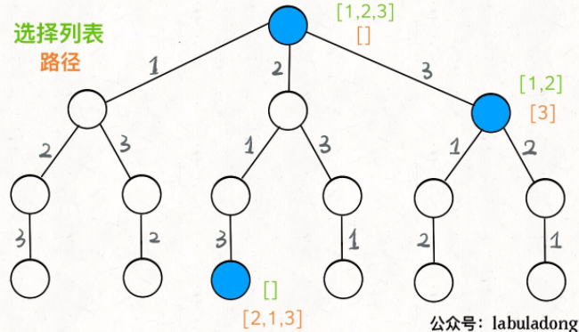

# DFS 回溯算法

------


- ## 回溯算法框架

    **解决一个回溯问题，实际上就是一个决策树的遍历过程**。你只需要思考 3 个问题：

    1、路径：也就是已经做出的选择。

    2、选择列表：也就是你当前可以做的选择。

    3、结束条件：也就是到达决策树底层，无法再做选择的条件。

    ```python
    result = []
    def backtrack(路径, 选择列表):
        if 满足结束条件:
            result.add(路径)
            return
    
        for 选择 in 选择列表:
            # 做选择（前序遍历位置！）
            将该选择从选择列表移除
            路径.add(选择)
            backtrack(路径, 选择列表)
            # 撤销选择（后序遍历位置！）
            路径.remove(选择)
            将该选择再加入选择列表
    ```

- ## [LC46. 全排列](https://leetcode-cn.com/problems/permutations/)

    给定一个不含重复数字的数组 nums ，返回其 所有可能的全排列 。你可以 按任意顺序 返回答案。

     

    示例 1：

    输入：nums = [1,2,3]
    输出：[[1,2,3],[1,3,2],[2,1,3],[2,3,1],[3,1,2],[3,2,1]]
    示例 2：

    输入：nums = [0,1]
    输出：[[0,1],[1,0]]
    示例 3：

    输入：nums = [1]
    输出：[[1]]

    **提示：**

    - `1 <= nums.length <= 6`
    - `-10 <= nums[i] <= 10`
    - `nums` 中的所有整数 **互不相同**

    函数签名：

    ```java
    public List<List<Integer>> permute(int[] nums);
    ```

    ### <u>**思路**</u>

    构造决策树，前序遍历位置做选择，后序遍历位置撤销选择

    

    ### <u>**Solution**</u>

    ```java
    		List<List<Integer>> res = new LinkedList<>();
        public List<List<Integer>> permute(int[] nums) {
            // 记录「路径」
            LinkedList<Integer> track = new LinkedList<>();
            dfsPermute(nums, track);
            return res;
        }
    
        // 路径：记录在 track 中
        // 选择列表：nums 中不存在于 track 的那些元素
        // 结束条件：nums 中的元素全都在 track 中出现
        public void dfsPermute(int[] nums, LinkedList<Integer> track){
            // 触发结束条件
            if(track.size()==nums.length){
                //复制LinkedList中的元素到新的LinkedList
                //！！如果直接add(track)会添加track的引用！！
                res.add(new LinkedList(track));
                return;
            }
    
            for(int i=0; i<nums.length; i++){
                // 排除不合法的选择
                if(track.contains(nums[i]))
                    continue;
                // 做选择
                track.add(nums[i]);
                // 进入下一层决策树
                dfsPermute(nums, track);
                // 取消选择
                track.removeLast();
            }
        }
    ```

    对链表使用 `contains` 方法需要 O(N) 的时间复杂度

    必须说明的是，不管怎么优化，都符合回溯框架，而且时间复杂度都不可能低于 O(N!)，因为穷举整棵决策树是无法避免的。**这也是回溯算法的一个特点，不像动态规划存在重叠子问题可以优化，回溯算法就是纯暴力穷举，复杂度一般都很高**。

- ## [LC51. N 皇后](https://leetcode-cn.com/problems/n-queens/)

    n 皇后问题 研究的是如何将 n 个皇后放置在 n×n 的棋盘上，并且使皇后彼此之间不能相互攻击（皇后彼此不能相互攻击，也就是说：任何两个皇后都不能处于同一条横行、纵行或斜线上）。

    给你一个整数 n ，返回所有不同的 n 皇后问题 的解决方案。

    每一种解法包含一个不同的 n 皇后问题 的棋子放置方案，该方案中 'Q' 和 '.' 分别代表了皇后和空位。

     

    示例 1：

    输入：n = 4

    

    输出：[[".Q..","...Q","Q...","..Q."],["..Q.","Q...","...Q",".Q.."]]
    解释：如上图所示，4 皇后问题存在两个不同的解法。
    示例 2：

    输入：n = 1
    输出：[["Q"]]


    提示：

    1 <= n <= 9
    函数签名：

    ```java
    public List<List<String>> solveNQueens(int n);
    ```

    ### <u>**Solution**</u>

    直接套框架

    ```java
    		List<List<String>> results = new LinkedList<>();
        public List<List<String>> solveNQueens(int n) {
            // '.' 表示空，'Q' 表示皇后，初始化空棋盘。
            char[][] board = new char[n][n];
            for (int i = 0; i < n; i++) {
                char[] row = new char[n];
                Arrays.fill(row, '.');
                board[i] = row;
            }
            //从第一行开始自上而下进行选择
            dfsSolveNQueens(board, 0);
            return results;
        }
    
        // 路径：board 中小于 row 的那些行都已经成功放置了皇后
        // 选择列表：第 row 行的所有列都是放置皇后的选择
        // 结束条件：row 超过 board 的最后一行
        public void dfsSolveNQueens(char[][] board, int row){
            int totalRow = board.length;
            // 触发结束条件: row的取值为[0,n-1],当row=n时，board[n]会报错
            if(row==totalRow){
                List<String> result = new LinkedList<>();
                //将结果逐行转化为List<String>并加入results
                for(int i=0; i<totalRow; i++){
                    String resRow = String.valueOf(board[i]);
                    result.add(resRow);
                }
                results.add(result);
                return; 
            }
    
            int totalCol = board[0].length;
            for(int col=0; col<totalCol; col++){
                //排除不合法选择
                if(!isValidNQueens(board, row, col))
                    continue;
                //做选择
                board[row][col] = 'Q';
                //进入下一层决策树
                dfsSolveNQueens(board, row+1);
                //撤销选择
                board[row][col] = '.';
            }
        }
        public boolean isValidNQueens(char[][] board, int row, int col){
            //因为是自上而下做选择，所以只需检查当前row上方是否有冲突
            //检查不同行 同列的位置是否有皇后
            for(int i=0; i<row; i++){
                if(board[i][col]=='Q')
                    return false;
            }
            //检查右上方的斜线是否有皇后
            for(int i=row-1, j=col+1; i>=0 && j<board[0].length; i--, j++){
                if(board[i][j]=='Q')
                    return false;
            }
            //检查左上方的斜线是否有皇后
            for(int i=row-1, j=col-1; i>=0&&j>=0; i--, j--){
                if(board[i][j]=='Q')
                    return false;
            }
    
            return true;
        }
    ```

- ## [LC37. 解数独](https://leetcode-cn.com/problems/sudoku-solver/)

    编写一个程序，通过填充空格来解决数独问题。

    数独的解法需 遵循如下规则：

    数字 1-9 在每一行只能出现一次。
    数字 1-9 在每一列只能出现一次。
    数字 1-9 在每一个以粗实线分隔的 3x3 宫内只能出现一次。（请参考示例图）
    数独部分空格内已填入了数字，空白格用 '.' 表示。

     

    示例：

    

    输入：board = [["5","3",".",".","7",".",".",".","."],

    ​						["6",".",".","1","9","5",".",".","."],

    ​						[".","9","8",".",".",".",".","6","."],

    ​						["8",".",".",".","6",".",".",".","3"],

    ​						["4",".",".","8",".","3",".",".","1"],

    ​						["7",".",".",".","2",".",".",".","6"],

    ​						[".","6",".",".",".",".","2","8","."],

    ​						[".",".",".","4","1","9",".",".","5"],

    ​						[".",".",".",".","8",".",".","7","9"]]
    输出：[["5","3","4","6","7","8","9","1","2"],

    ​			["6","7","2","1","9","5","3","4","8"],

    ​			["1","9","8","3","4","2","5","6","7"],

    ​			["8","5","9","7","6","1","4","2","3"],

    ​			["4","2","6","8","5","3","7","9","1"],

    ​			["7","1","3","9","2","4","8","5","6"],

    ​			["9","6","1","5","3","7","2","8","4"],

    ​			["2","8","7","4","1","9","6","3","5"],

    ​			["3","4","5","2","8","6","1","7","9"]]
    解释：输入的数独如上图所示，唯一有效的解决方案如下所示：

    


    提示：

    board.length == 9
    board[i].length == 9
    board[i][j] 是一位数字或者 '.'
    题目数据 保证 输入数独仅有一个解

    ### <u>**思路**</u>

    同一行内，row不变，col++：从1到9逐一试`board[row][col]`；

    **当** **`col`** **到达超过每一行的最后一个索引(`col==9`)时，转为增加** **`row`** **开始穷举下一行，并且在穷举之前添加一个判断(isValid())，跳过不满足条件的数字**

    什么时候结束递归？**显然** **`row == 9`** **的时候就说明穷举完了最后一行，完成了所有的穷举，就是 base case**。

    ### **<u>Solution</u>**

    ```java
    		public void solveSudoku(char[][] board) {
            dfsSolveSudoku(board, 0, 0);
        }
        public boolean dfsSolveSudoku(char[][] board, int row, int col){
            //穷举完了最后一行，完成了所有的穷举，就是 base case。
            if(row==9)
                return true;
            //穷举完最后一列，转为增加row开始穷举下一行row+1的第一列0
            if(col==9)
                return dfsSolveSudoku(board, row+1, 0);
            //如果这个位置题目有提供数字，则不做选择，转而判断下一个数字
            if(board[row][col]!='.')
                return dfsSolveSudoku(board, row, col+1);
            
            for(char num='1'; num<='9'; num++){
                // 如果遇到不合法的数字,就跳过
                if(!isValidSudoku(board, row, col, num))
                    continue;
                board[row][col] = num;
                // 如果找到一个可行解，立即结束
                if(dfsSolveSudoku(board, row, col+1))
                    return true;
                board[row][col] = '.';
            }
            //穷举完如果没找到可行解，则此题无解
            return false;
        }
        // 判断 board[i][j] 是否可以填入 n
        public boolean isValidSudoku(char[][]board, int row, int col, char num){
            for(int i=0; i<9; i++){
                //固定col，轮询row,找同一列中是否已经存在数num
                if(board[i][col]==num)
                    return false;
                //固定row，轮询col,找同一行中是否已经存在数num
                if(board[row][i]==num)
                    return false;
                // (n/3)返回n➗3后的整数部分
                // (n/3)*3返回0，3，6，9......
                //如果row=4，col=4， 当i=0时，下面方法判断board[3][3];
                //                  当i=1时，下面方法判断board[3][4];
                //                  当i=2时，下面方法判断board[3][5];
                //                  当i=3时，下面方法判断board[4][3];
                //                  当i=4时，下面方法判断board[4][4];
                //                  当i=1时，下面方法判断board[4][5]...
                // 判断 3 x 3 方框是否存在重复
                if(board[(row/3)*3 + i/3][(col/3)*3 + i%3]==num)
                    return false;
            }
            return true;
        }
    ```

    对于这种时间复杂度的计算，我们只能给出一个最坏情况，也就是 O(9^M)，其中 `M` 是棋盘中空着的格子数量。你想嘛，对每个空格子穷举 9 个数，结果就是指数级的。