[toc]

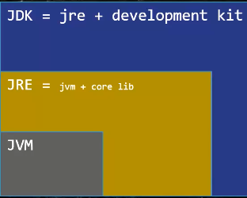

# 懒加载(懒初始化)

JVM, Java都是懒加载(懒初始化), 有需要的时候才加载并初始化. 比如

```java
MyClass myClass;//不加载,不初始化
MyClass myClass = new MyClass();//加载,初始化
```

# 类加载器ClassLoader

1BootStrap ClassLoader 2Extension ClassLoader 3Application ClassLoader 4Custom ClassLoader

这些ClassLoader的最终父类都是**ClassLoader类**

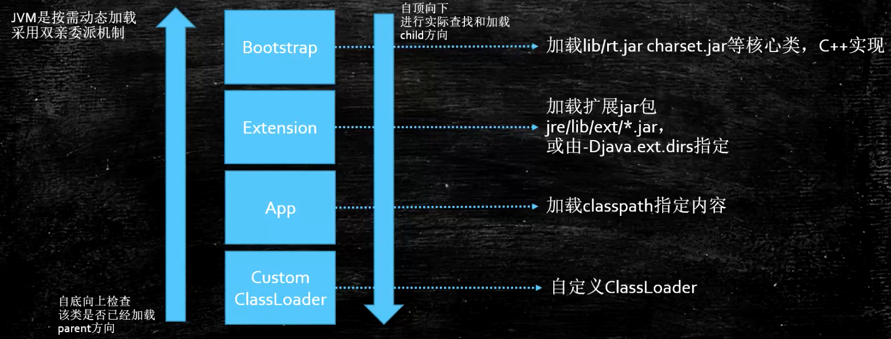

类加载器通过自己的loadClass()方法来加载类(不初始化), 方法是通过findClass()来查找要加载的class在不在自己这一级的类加载器的目录中

## **加载顺序**

加载一个Class类的顺序也是有优先级的，类加载器从最底层开始往上的顺序是这样的

1. BootStrap ClassLoader：rt.jar, 

    只要类.class.getClassLoader()输出**null**则代表是BootStrap加载的.例如sout(String.class.getClassLoader())会输出null

2. Extension ClassLoader: 加载扩展的jar包

3. App ClassLoader：指定的classpath下面的jar包

    自定义的class类 也是app load的

    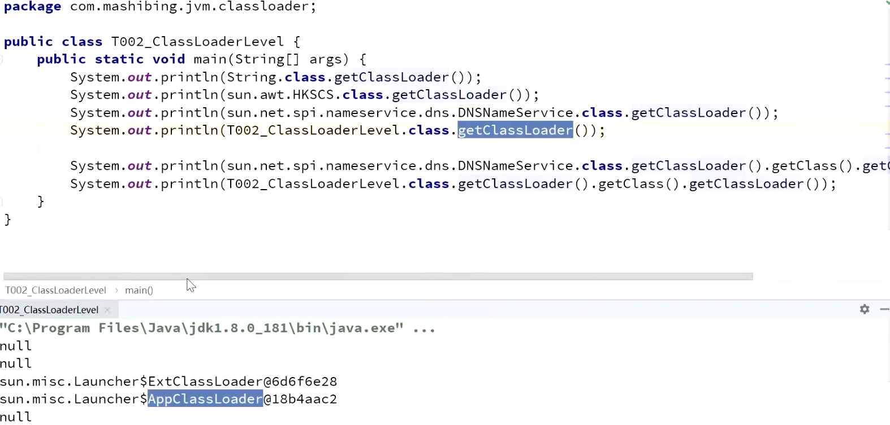

4. Custom ClassLoader：自定义的**类加载器**, (**不是自定义类的加载器!**)

    extends ClassLoader类, **重写findClass()**方法, 来找目录中的.class文件

    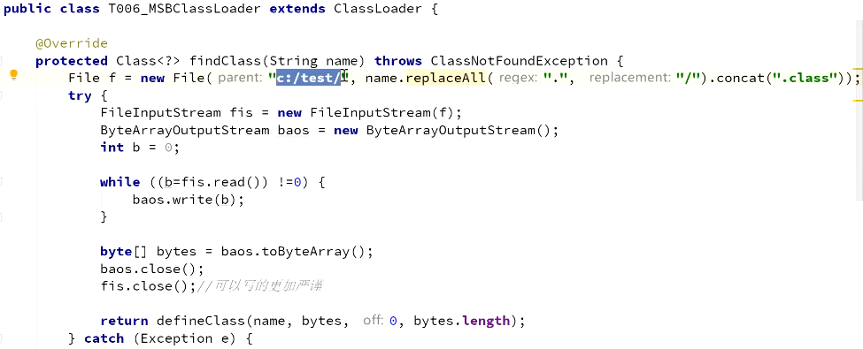

    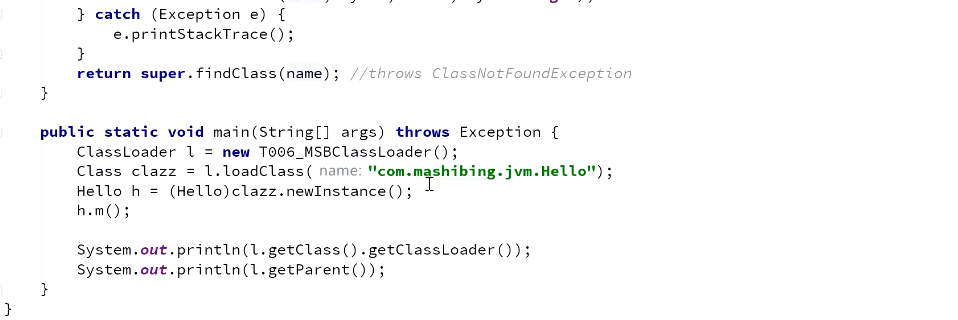

## **双亲委派机制**

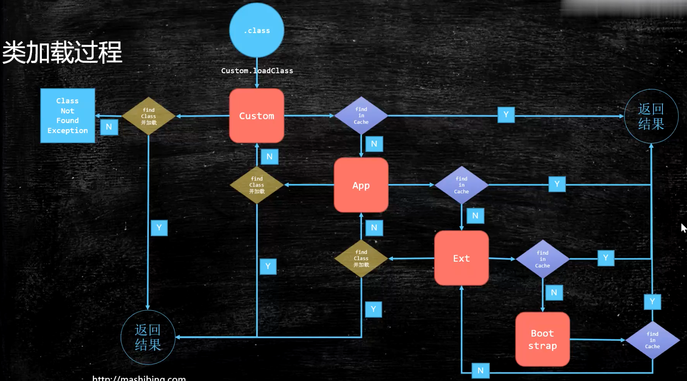

当一个类收到了加载请求时，它是不会先自己去尝试加载的，而是**委派给父类**去完成，比如我现在要new一个Person，这个Person是我们自定义的类，如果我们要加载它，就会先委派App ClassLoader -> 找其父类Extension ClassLoader -> 找其父类BootStrap ClassLoader,**只有当父类加载器都反馈自己无法完成这个请求（也就是父类加载器都没有找到加载所需的Class）时，子类加载器才会自行尝试加载**

为什么使用双亲委派机制? 加载位于rt.jar包中的类(比如String类)时不管是哪个加载器加载，最终都会委托到BootStrap ClassLoader进行加载，**这样保证了使用不同的类加载器得到的都是同一个结果, 比如自定义的java.lang.String就不会由App ClassLoader加载,只会用BootStrap ClassLoader加载保证了安全。**

其实这个也是一个隔离的作用，避免了我们的代码影响了JDK的代码，比如                               

```java
package java.lang;
public class String {
  	public String toString(){
      return "hello";
    }
  	public static void main(String[] args){
      String s = new String();
      s.toString();
    }
}
```

这种时候，我们的代码肯定会报错，因为在加载的时候其实是找到了**rt.jar中的String.class**，然后发现这也没有main方法

## 区别父加载器, 类加载器的加载器, 类加载器的父类加载器

父加载器 是第5行, 加载这个class的加载器

类加载器的加载器 是第6行代码, 所有类加载器都是由BootStrap加载来的, 所以输出null

类加载器的父类加载器 是第7行代码, app父类加载器是ext

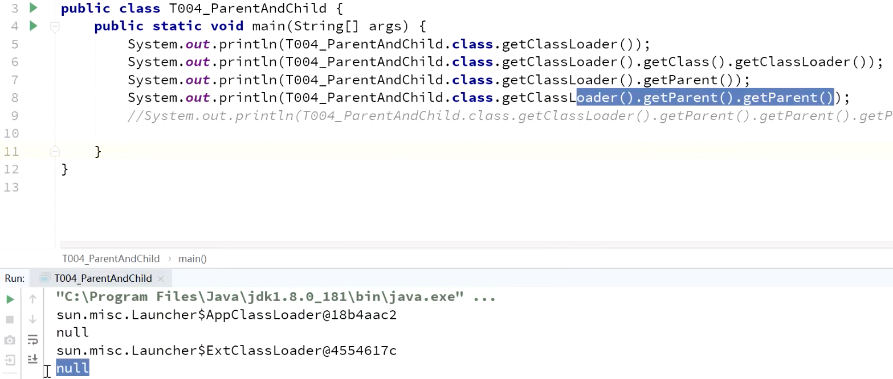

## 反射底层的原理就是通过类加载器动态加载class

反射中,通过ClassLoader类 来获取class对象(不初始化):

```java
Class clazz = ClassLoader.loadClass("cn.javaguide.TargetObject");
```

举个例子, 我们可用**自定义class**的**ClassLoader(即App ClassLoader)的loadClass()方法**来加载另一个自定义class(不初始化):

```java
Class clazz = myClass1.class.getClassLoader().loadClass(com.stiee.myClass2);
```


# Java内存区域

## 运行时数据区域

1.8之前


1.7: **字符串常量池**从方法区移到**堆**中, 这里**没有提到运行时常量池**,也就是说字符串常量池被单独拿到堆,**运行时常量池剩下的东西还在方法区**, 也就是 hotspot 中的**永久代** 。

1.8: hotspot **移除了永久代**用**元空间**(Metaspace)代替, 这时候**字符串常量池还在堆**, **运行时常量池还在方法区**, 只不过**方法区**的实现从**永久代**变成了**元空间**(Metaspace)


**线程私有的：**

- 程序计数器
- 虚拟机栈
- 本地方法栈

**线程共享的：**

- 堆
- 方法区
- 直接内存 (非运行时数据区的一部分)

### 线程私有的

#### 程序计数器

它的**生命周期**随着线程的创建而创建，随着线程的结束而死亡。

**程序计数器主要有两个作用：**

1. 字节码解释器通过改变程序计数器来依次读取指令，从而实现代码的流程控制，如：顺序执行、选择、循环、异常处理。
2. 在多线程的情况下，程序计数器用于记录当前线程执行的位置，从而当线程被切换回来的时候能够知道该线程上次运行到哪儿了。

**注意：程序计数器是唯一一个不会出现 `OutOfMemoryError` 的内存区域.**

#### Java 虚拟机栈

**它的生命周期和线程相同**

在线程创建时虚拟机栈会被创建，每个**java方法**在在执行的同时都会创建一个**栈帧**，用于存放**局部变量表，操作数栈，动态链接，方法出口**等信息。每一个**方法**从调用直至执行完成，都对应着一个**栈帧**在虚拟机栈中**入栈到出栈**的过程。

**每一次函数方法调用都会有一个对应的栈帧被压入 Java 栈，每一个函数调用结束后，都会有一个栈帧被弹出。**

Java 方法有两种返回方式：

1. return 语句。
2. 抛出异常。

不管哪种返回方式都会导致栈帧被弹出。

**局部变量表主要存放了编译期可知的各种数据类型**（boolean、byte、char、short、int、float、long、double）、**对象引用**（reference 类型，它不同于对象本身，可能是一个指向对象起始地址的引用指针，也可能是指向一个代表对象的句柄或其他与此对象相关的位置）。

**Java 虚拟机栈会出现两种错误：`StackOverFlowError` 和 `OutOfMemoryError`。**

- **`StackOverFlowError`：** 若 Java 虚拟机栈的内存大小**不允许**动态扩展，那么当线程请求栈的深度超过当前 Java 虚拟机栈的最大深度的时候，就抛出 StackOverFlowError 错误。

    - 比如一个方法执行100次

        ```java
        public class Test {
            public static void main(String[] args) {
                  method();
            }
        //递归调用导致 StackOverflowError
            public static void method(){
                method();
            }
        }
        ```

        

- **`OutOfMemoryError`：** Java 虚拟机栈的内存大小**可以**动态扩展， 如果虚拟机在动态扩展栈时无法申请到足够的内存空间，则抛出`OutOfMemoryError`异常。

    - 当Java 程序启动一个新线程时，若**没有足够的空间为该线程分配Java虚拟机栈**(一个线程Java栈的大小由-Xss设置决定)，JVM将抛出OutOfMemoryError异常。


#### 本地方法栈

和虚拟机栈所发挥的作用非常相似，区别是： **虚拟机栈为虚拟机执行 Java 方法 （也就是字节码）服务，而本地方法栈则为虚拟机使用到的 Native 方法服务。** 在 HotSpot 虚拟机中和 Java 虚拟机栈合二为一。

本地方法被执行的时候，在本地方法栈也会创建一个栈帧，用于存放该本地方法的局部变量表、操作数栈、动态链接、出口信息。

方法执行完毕后相应的栈帧也会出栈并释放内存空间，也会出现 `StackOverFlowError` 和 `OutOfMemoryError` 两种错误(原因同上)。

### 线程共享的

#### 堆

Java 虚拟机所管理的内存中最大的一块，Java 堆是所有线程共享的一块内存区域，在虚拟机启动时创建。**堆存放<u>对象实例</u>，几乎所有的对象实例以及数组都在这里分配内存。**

> 从 JDK 1.7 开始已经默认开启逃逸分析，如果某些方法中的**对象引用**没有被返回或者**未被外面使用（也就是未逃逸出去）**，那么对象可以直接在**栈**上**分配内存**, 减小**堆**内存的使用;
>
> 逃逸分析的优化:
>
> ```java
> StringBuilder sb = new StringBuilder("abc");
> 
> return sb;
> //可以改为：
> return sb.toString();
> ```
>
> 这是一种优化案例，把 StringBuilder 变量控制在了当前方法之内，没有逃出当前方法作用域。
>
> 通过[**逃逸分析**](http://mp.weixin.qq.com/s?__biz=MzI3ODcxMzQzMw==&mid=2247489776&idx=1&sn=74a93cea618aec7ff5af173f9b6a0626&chksm=eb539dc6dc2414d09a6277579edda97648ab42cce2da846746d7d85f65a3a250b412eb4a6d8b&scene=21#wechat_redirect)还能实现同步消除（synchronization elision），举个例子：
>
> ```java
> private void someMethod() {
>     Object lockObject = new Object();
>     synchronized (lockObject) {
>       System.out.println(lockObject.hashCode());
>     }
> }
> ```
>
> lockObject这个锁对象的生命期只在someMethod()方法中，并不存在多线程访问的问题，所以synchronized块并无意义，会被优化掉：
>
> ```java
> private void someMethod() {
>     Object lockObject = new Object();
>     System.out.println(lockObject.hashCode());
> }
> ```

Java 堆是垃圾收集器管理的主要区域，因此也被称作**GC 堆（Garbage Collected Heap）**。从垃圾回收的角度，由于现在收集器基本都采用分代垃圾收集算法，所以 Java 堆还可以细分为：**新生代,老年代**；新生代又可分为：Eden 区、From Survivor区、To Survivor 区。**进一步划分的目的是更好地回收内存，或者更快地分配内存。**

在 JDK 7 版本及 JDK 7 版本之前，堆内存被通常分为下面三部分：

1. 新生代内存(Young Generation)
2. 老生代(Old Generation)
3. 永生代(Permanent Generation)


JDK 8 版本之后方法区（HotSpot 的永久代）被彻底移除了（JDK1.7 就已经开始了），取而代之是**元空间**，元空间使用的是直接内存。


**上图所示的 Eden 区、两个 Survivor 区都属于新生代（为了区分，这两个 Survivor 区域按照顺序被命名为 from 和 to），中间一层属于老年代。**

大部分情况，对象都会首先在 Eden 区域分配，在一次新生代垃圾回收后，如果对象还存活，则会进入 s0 或者 s1，并且对象的年龄还会加 1(Eden 区->Survivor 区后对象的初始年龄变为 1)，当它的年龄增加到一定程度（默认为 15 岁），就会被晋升到老年代中。对象晋升到老年代的年龄阈值，可以通过参数 `-XX:MaxTenuringThreshold` 来设置。

> **🐛 修正（参见：[issue552](https://github.com/Snailclimb/JavaGuide/issues/552)）** ：“Hotspot 遍历所有对象时，按照年龄从小到大对其所占用的大小进行累积，当累积的某个年龄大小超过了 survivor 区的一半时，取这个年龄和 MaxTenuringThreshold 中更小的一个值，作为新的晋升年龄阈值”。
>
> **动态年龄计算的代码如下**
>
> ```java
> uint ageTable::compute_tenuring_threshold(size_t survivor_capacity) {
> 	//survivor_capacity是survivor空间的大小
>     size_t desired_survivor_size = (size_t)((((double) 					survivor_capacity)*TargetSurvivorRatio)/100);
>     size_t total = 0;
>     uint age = 1;
> while (age < table_size) {
>     total += sizes[age];//sizes数组是每个年龄段对象大小
>     if (total > desired_survivor_size) break;
>     		age++;
> }
> uint result = age < MaxTenuringThreshold ? age : MaxTenuringThreshold;
> 	...
> }
> ```
>
> 

堆这里最容易出现的就是 **OutOfMemoryError** 错误，并且出现这种错误之后的表现形式还会有几种，比如：

1. **`java.lang.OutOfMemoryError: GC Overhead Limit Exceeded`** ： 当 JVM 花太多时间执行垃圾回收并且只能回收很少的堆空间时，就会发生此错误。
2. **`java.lang.OutOfMemoryError: Java heap space`** :假如在创建新的对象时, 堆内存中的空间不足以存放新创建的对象, 就会引发此错误。(和配置的最大堆内存有关，且受制于物理内存大小。最大堆内存可通过`-Xmx`参数配置，若没有特别配置，将会使用默认值，详见：[Default Java 8 max heap size](https://stackoverflow.com/questions/28272923/default-xmxsize-in-java-8-max-heap-size))
3. ......

#### 方法区(永久代)

方法区与 Java 堆一样，是各个线程共享的内存区域，它用于存储已被虚拟机加载的**类信息、常量、静态变量、即时编译器编译后的代码**等数据。虽然 **Java 虚拟机规范把方法区描述为堆的一个逻辑部分**，但是它却有一个别名叫做 **Non-Heap（非堆）**，目的应该是与 Java 堆区分开来。

方法区无法满足内存分配需求时，会抛出 OutOfMemoryError 异常。

**方法区也被称为永久代**。很多人都会分不清方法区和永久代的关系，为此我也查阅了文献。

##### 2.5.1 方法区和永久代的关系

> 《Java 虚拟机规范》只是规定了有方法区这么个概念和它的作用，并没有规定如何去实现它。那么，在不同的 JVM 上方法区的实现肯定是不同的了。 **方法区和永久代的关系很像 Java 中接口和类的关系，类实现了接口，而永久代就是 HotSpot 虚拟机对虚拟机规范中方法区的一种实现方式。** 也就是说，永久代是 HotSpot 的概念，方法区是 Java 虚拟机规范中的定义，是一种规范，而永久代是一种实现，一个是标准一个是实现，其他的虚拟机实现并没有永久代这一说法。

##### 2.5.2 常用参数

JDK 1.8 之前永久代还没被彻底移除的时候通常通过下面这些参数来调节方法区大小

```
-XX:PermSize=N //方法区 (永久代) 初始大小
-XX:MaxPermSize=N //方法区 (永久代) 最大大小,超过这个值将会抛出 OutOfMemoryError 异常:java.lang.OutOfMemoryError: PermGen
```

相对而言，**垃圾收集行为在这个区域是比较少出现的**，但并非数据进入方法区后就“永久存在”了。

JDK 1.8 的时候，方法区（HotSpot 的永久代）被彻底移除了（JDK1.7 就已经开始了），取而代之是元空间，元空间使用的是直接内存。

下面是一些常用参数：

```
-XX:MetaspaceSize=N //设置 Metaspace 的初始（和最小大小）
-XX:MaxMetaspaceSize=N //设置 Metaspace 的最大大小
```

与永久代很大的不同就是，如果不指定大小的话，随着更多类的创建，**虚拟机会耗尽所有可用的系统内存。**

##### 2.5.3 为什么要将永久代 (PermGen) 替换为元空间 (MetaSpace) 呢?

下图来自《深入理解 Java 虚拟机》第 3 版 2.2.5

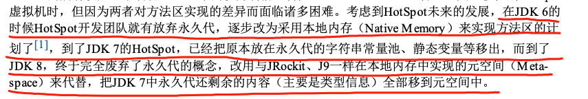

1. 整个永久代有一个 JVM 本身设置的固定大小上限，无法进行调整，而**元空间使用的是直接内存**，受本机可用内存的限制，虽然元空间仍旧可能溢出，但是比原来出现的几率会更小。

    > 当元空间溢出时会得到如下错误： `java.lang.OutOfMemoryError: MetaSpace`

你可以使用 `-XX：MaxMetaspaceSize` 标志设置最大元空间大小，默认值为 unlimited，这意味着它只受系统内存的限制。`-XX：MetaspaceSize` 调整标志定义元空间的初始大小如果未指定此标志，则 Metaspace 将根据运行时的应用程序需求动态地重新调整大小。

1. 元空间里面存放的是类的元数据，这样加载多少类的元数据就不由 `MaxPermSize` 控制了, 而由系统的实际可用空间来控制，这样能加载的类就更多了。
2. 在 JDK8，合并 HotSpot 和 JRockit 的代码时, JRockit 从来没有一个叫永久代的东西, 合并之后就没有必要额外的设置这么一个永久代的地方了。

#### 运行时常量池

运行时常量池是**方法区的一部分**。Class 文件中除了有类的版本、字段、方法、接口等描述信息外，还有**常量池表（用于存放编译期生成的各种字面量和符号引用）**

既然运行时常量池是方法区的一部分，自然受到方法区内存的限制，当常量池无法再申请到内存时会抛出 **OutOfMemoryError** 错误。


> **🐛 修正（参见：[issue747](https://github.com/Snailclimb/JavaGuide/issues/747)，[reference](https://blog.csdn.net/q5706503/article/details/84640762)）** ：
>
> 1. **JDK1.7 之前运行时常量池逻辑包含字符串常量池存放在方法区, 此时 hotspot 虚拟机对方法区的实现为永久代**
> 2. **JDK1.7 <u>字符串常量池</u>被从方法区拿到了堆中, 这里没有提到运行时常量池,也就是说字符串常量池被单独拿到堆,<u>运行时常量池剩下的东西还在方法区</u>, 也就是 hotspot 中的永久代 。**
> 3. **JDK1.8 hotspot 移除了永久代用元空间(Metaspace)取而代之, 这时候字符串常量池还在堆, 运行时常量池还在方法区, 只不过方法区的实现从永久代变成了元空间(Metaspace)**

相关问题：JVM 常量池中存储的是对象还是引用呢？： https://www.zhihu.com/question/57109429/answer/151717241 by RednaxelaFX

#### 直接内存

**直接内存并不是虚拟机运行时数据区的一部分，也不是虚拟机规范中定义的内存区域，但是这部分内存也被频繁地使用。而且也可能导致 OutOfMemoryError 错误出现。**

JDK1.4 中新加入的 **NIO(New Input/Output) 类**，引入了一种基于**通道（Channel）与缓存区（Buffer）的 I/O 方式，它可以直接使用 Native 函数库直接分配堆外内存，然后通过一个存储在 Java 堆中的 DirectByteBuffer 对象作为这块内存的引用进行操作。这样就能在一些场景中显著提高性能，因为避免了在 Java 堆和 Native 堆之间来回复制数据**。

**本机直接内存的分配不会受到 Java 堆的限制，但是，既然是内存就会受到本机总内存大小以及处理器寻址空间的限制。**

## 常量池和堆的思考

### [String s1 = new String("abc");这句话创建了几个字符串对象？](https://snailclimb.gitee.io/javaguide/#/docs/java/jvm/Java内存区域?id=_42-string-s1-new-stringquotabcquot这句话创建了几个字符串对象？)

**将创建 1 或 2 个字符串。如果池中已存在字符串常量“abc”，则只会在堆空间创建一个字符串常量“abc”。如果池中没有字符串常量“abc”，那么它将首先在池中创建，然后在堆空间中创建，因此将创建总共 2 个字符串对象。**

**验证：**

```java
String s1 = new String("abc");// 堆内存的地址值
String s2 = "abc";
System.out.println(s1 == s2);// 输出 false,因为一个是堆内存，一个是常量池的内存，故两者是不同的。
System.out.println(s1.equals(s2));// 输出 true
```

# HotSpot 虚拟机在Java堆中对象分配布局访问的过程

通过上面的介绍我们大概知道了虚拟机的内存情况，下面我们来详细的了解一下 HotSpot 虚拟机在 Java 堆中对象分配、布局和访问的全过程。

### 创建对象的例子: String s = new String("abc");

[先举个例子 5分30秒开始](https://www.bilibili.com/video/BV1AP4y1W7un?p=30):

```java
class C1 {
  	public static int count = 2;
  	public static C1 c1 = new C1();
  	private C1(){
      	count++;
    }
}
class C2 {
  	public static C2 c2 = new C2();
  	public static int count = 2;
  	private C2(){
      	count++;
    }
}
public class myClass{
  	public static void main(String[] args){
      	System.out.println(C1.count);//3
      	System.out.println(C2.count);//2
    }
}
```

C1中:

- **C1**, 刚被加载,没new的时候, count先被赋**初始化零值0**;
- **new C1()**, 的时候 **执行static方法**count被赋**初始值2**
- 然后**new C1()**调用Constructor C1()函数将count++, count被赋值**3**;
- 输出3

C2中:

- **C2 c2**, 刚创建, count被赋**初始化零值**0;
- **new C2()** 调用Constructor C2()函数将count++, count被赋值**1**;
- **执行static方法** count被赋**初始值2**;
- 输出2


### 对象的创建步骤

下图便是 Java 对象的创建过程，我建议最好是能默写出来，并且要掌握每一步在做什么。 

#### Step1:类加载检查

虚拟机遇到一条 **new** 指令时，首先将去检查这个指令的参数是否能在**常量池中定位到这个类的符号引用**，并且检查这个**符号引用**代表的**类**是否已被**加载、解析和初始化过**。如果没有，那必须先执行相应的类加载过程。

#### Step2:分配内存

在**类加载检查**通过后，接下来虚拟机将为新生对象**分配内存**。对象所需的内存大小在类加载完成后便可确定，为对象分配空间的任务等同于把一块确定大小的内存从 Java 堆中划分出来。**分配方式**有 **“指针碰撞”** 和 **“空闲列表”** 两种，**选择哪种分配方式由 Java 堆是否规整决定，而 Java 堆是否规整又由所采用的垃圾收集器是否带有压缩整理功能决定**。

**内存分配的两种方式：（补充内容，需要掌握）**

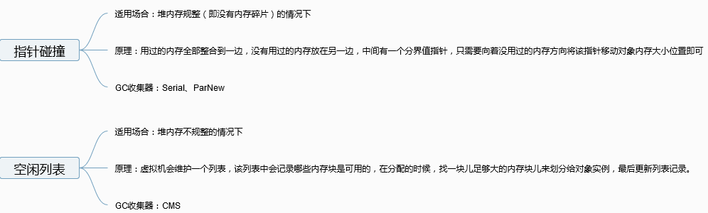

选择以上两种方式中的哪一种，取决于 Java 堆内存是否规整。而 Java 堆内存是否规整，取决于 GC 收集器的算法是"**标记-清除**"，还是"**标记-整理**"（也称作"标记-压缩"），值得注意的是，**复制算法内存也是规整的**

**内存分配并发问题（补充内容，需要掌握）**

在创建对象的时候有一个很重要的问题，就是线程安全，因为在实际开发过程中，创建对象是很频繁的事情，作为虚拟机来说，必须要保证线程是安全的，通常来讲，虚拟机采用两种方式来保证线程安全：

- **CAS+自旋：** CAS 是乐观锁的一种实现方式。所谓乐观锁就是，每次不加锁而是假设没有冲突而去完成某项操作，如果因为冲突失败就重试，直到成功为止。**虚拟机采用 CAS 配上失败重试的方式保证更新操作的原子性。**
- **TLAB：** 为每一个线程预先在 Eden 区分配一块儿内存，JVM 在给线程中的对象分配内存时，首先在 TLAB 分配，当对象大于 TLAB 中的剩余内存或 TLAB 的内存已用尽时，再采用上述的 CAS 进行内存分配

#### Step3:初始化零值

内存分配完成后，虚拟机需要将分配到的**内存空间都初始化为零值**（不包括对象头），这一步操作**保证了对象的实例字段在 Java 代码中可以不赋初始值就直接使用**，程序能访问到这些字段的数据类型所对应的零值。

#### Step4:设置对象头(mark word?)

初始化零值完成之后，**虚拟机要对对象进行必要的设置**，例如这个对象是**哪个类的实例、如何才能找到类的元数据信息、对象的哈希码、对象的 GC 分代年龄**等信息。 **这些信息存放在对象头中。** 另外，根据虚拟机当前运行状态的不同，如是否启用**偏向锁**等，对象头会有不同的设置方式。

#### Step5:执行 init 方法(初始化方法)

在上面工作都完成之后，从虚拟机的视角来看，一个新的对象已经产生了，但从 Java 程序的视角来看，对象创建才刚开始，`<init>` 方法还没有执行，所有的字段都还为零。所以一般来说，执行 new 指令之后会接着执行 `<init>` 方法，把对象按照程序员的意愿进行初始化，这样一个真正可用的对象才算完全产生出来。

### 3.2 对象的内存布局

在 Hotspot 虚拟机中，对象在内存中的布局可以分为 3 块区域：**对象头**、**实例数据**和**对齐填充**。

**Hotspot 虚拟机的对象头包括两部分信息**，**第一部分用于存储对象自身的运行时数据**（哈希码、GC 分代年龄、锁状态标志等等），**另一部分是类型指针**，即对象指向它的类元数据的指针，虚拟机通过这个指针来确定这个对象是那个类的实例。

**实例数据部分是对象真正存储的有效信息**，也是在程序中所定义的各种类型的字段内容。

**对齐填充部分不是必然存在的，也没有什么特别的含义，仅仅起占位作用。** 因为 Hotspot 虚拟机的自动内存管理系统要求对象起始地址必须是 8 字节的整数倍，换句话说就是对象的大小必须是 8 字节的整数倍。而对象头部分正好是 8 字节的倍数（1 倍或 2 倍），因此，当对象实例数据部分没有对齐时，就需要通过对齐填充来补全。

### 3.3 对象的访问定位

建立对象就是为了使用对象，我们的 Java 程序通过栈上的 reference 数据来操作堆上的具体对象。对象的访问方式由虚拟机实现而定，目前主流的访问方式有**① 使用句柄**和**② 直接指针**两种：

1. **句柄：** 如果使用句柄的话，那么 Java 堆中将会划分出一块内存来作为句柄池，reference 中存储的就是对象的句柄地址，而句柄中包含了对象实例数据与类型数据各自的具体地址信息；

    

2. **直接指针：** 如果使用直接指针访问，那么 Java 堆对象的布局中就必须考虑如何放置访问类型数据的相关信息，而 reference 中存储的直接就是对象的地址。


**这两种对象访问方式各有优势。使用句柄来访问的最大好处是 reference 中存储的是稳定的句柄地址，在对象被移动时只会改变句柄中的实例数据指针，而 reference 本身不需要修改。使用直接指针访问方式最大的好处就是速度快，它节省了一次指针定位的时间开销。**

# JVM垃圾回收

Java 的自动内存管理主要是针对对象内存的回收和对象内存的分配。同时，Java 自动内存管理最核心的功能是 **堆** 内存中对象的分配与回收。

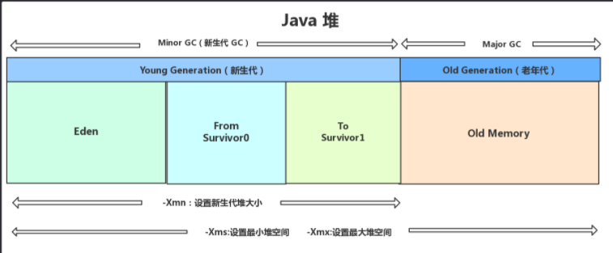

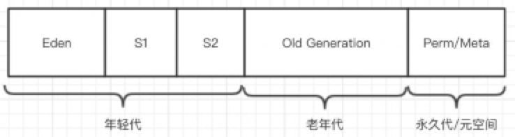

目前主流的垃圾收集器都会采用分代回收算法，因此需要将堆内存分为新生代和老年代，这样我们就可以根据各个年代的特点选择合适的垃圾收集算法。

## JVM内存分配及判定代

### 对象优先在 eden 区分配

大多数情况下，对象在新生代中 eden 区分配。

当 eden 区没有足够空间进行分配时，虚拟机将发起一次 Minor GC, GC 期间虚拟机又发现当前数组无法存入 Survivor 幸存者区空间，所以只好通过 **分配担保机制** 把新生代的对象提前转移到老年代中去，老年代上的空间足够存放 当前数组，所以不会出现 Full GC。执行 Minor GC 后，后面分配的对象如果能够存在 eden 区的话，还是会在 eden 区分配内存

### 大对象直接进入老年代

大对象就是需要大量连续内存空间的对象（比如：字符串、数组）。

**为什么要这样呢？**

为了避免为大对象分配内存时由于分配担保机制带来的复制而降低效率。

### 长期存活的对象将进入老年代

既然虚拟机采用了分代收集的思想来管理内存，那么内存回收时就必须能识别哪些对象应放在新生代，哪些对象应放在老年代中。为了做到这一点，虚拟机给每个对象一个对象年龄（Age）计数器。

**如果对象在 Eden 出生并经过第一次 Minor GC 后仍然能够存活，并且能被 Survivor 容纳的话，将被移动到 Survivor 空间中，并将对象年龄设为 1. 对象在 Survivor 中每熬过一次 MinorGC,年龄就增加 1 岁，当它的年龄增加到一定程度（默认为 15 岁），就会被晋升到老年代中。对象晋升到老年代的年龄阈值，可以通过参数 `-XX:MaxTenuringThreshold` 来设置。**

## 判断对象死亡的方法

### 引用类型(强软弱虚-强度逐渐减弱)

无论是通过**引用计数法**判断对象引用数量，还是通过**可达性分析法**判断对象的**引用链**是否可达，判定对象的存活都与“引用”有关。

#### **1．(不回收)强引用（StrongReference）**

以前我们使用的大部分引用实际上都是强引用，这是使用最普遍的引用。如果一个对象具有强引用，**垃圾回收器绝不会回收它**。

**当内存空间不足，Java 虚拟机宁愿抛出 OutOfMemoryError 错误，使程序异常终止，也不会靠随意回收具有强引用的对象来解决内存不足问题。**

#### **2．(空间够不收,不够收)软引用（SoftReference）**

**如果内存空间足够，垃圾回收器就不会回收它，如果内存空间不足了，就会回收这些对象的内存。**只要垃圾回收器没有回收它，该对象就可以被程序使用。软引用可用来实现**内存敏感的高速缓存**。

软引用可以和一个引用队列（ReferenceQueue）联合使用，如果软引用所引用的对象被垃圾回收，JAVA 虚拟机就会把这个软引用加入到与之关联的引用队列中。

#### **3．(收)弱引用（WeakReference）**

弱引用与软引用的区别在于：**只具有弱引用的对象拥有更短暂的生命周期**。在垃圾回收器线程扫描它所管辖的内存区域的过程中，一旦发现了只具有弱引用的对象，**不管当前内存空间足够与否，都会回收它的内存**。不过，由于垃圾回收器是一个优先级很低的线程， 因此不一定会很快发现那些只具有弱引用的对象。

弱引用可以和一个引用队列（ReferenceQueue）联合使用，**如果弱引用所引用的对象被垃圾回收，Java 虚拟机就会把这个弱引用加入到与之关联的引用队列中???**。

#### **4．(收)虚引用（PhantomReference）**

"虚引用"顾名思义，就是形同虚设，与其他几种引用都不同，虚引用并不会决定对象的生命周期。如果一个对象仅持有虚引用，那么它就和没有任何引用一样，**在任何时候都可能被垃圾回收。**

**虚引用主要用来跟踪<u>对象被垃圾回收的活动</u>**。

**虚引用与软引用和弱引用的一个区别在于：** **虚引用必须和引用队列（ReferenceQueue）联合使用。**当垃圾回收器准备回收一个对象时，如果发现它还有虚引用，就会在回收对象的内存之前，把这个**虚引用加入到与之关联的引用队列中**。**程序可以通过判断引用队列中是否已经加入了虚引用，来了解被引用的对象是否将要被垃圾回收。程序如果发现某个虚引用已经被加入到引用队列，那么就可以在所引用的对象的内存被回收之前采取必要的行动。**

特别注意，在程序设计中一般**很少使用弱引用与虚引用**，使用**软引用的情况较多**，这是因为**软引用可以加速 JVM 对垃圾内存的回收速度，可以维护系统的运行安全，防止内存溢出（OutOfMemory）等问题的产生**。

### 对象是否可用?引用计数法(循环引用问题)

给对象中添加一个引用计数器，每当有一个地方引用它，计数器就加 1；当引用失效，计数器就减 1；任何时候计数器为 0 的对象就是不可能再被使用的。

**这个方法实现简单，效率高，但是目前主流的虚拟机中并没有选择这个算法来管理内存，其最主要的原因是它很难解决对象之间相互<u>循环引用</u>的问题。** 

所谓对象之间的相互引用问题，如下面代码所示：除了对象 objA 和 objB 相互引用着对方之外，这两个对象之间再无任何引用。但是他们因为互相引用对方，导致它们的引用计数器都不为 0，于是引用计数算法无法通知 GC 回收器回收他们。

```java
public class ReferenceCountingGc {
    Object instance = null;
	public static void main(String[] args) {
		ReferenceCountingGc objA = new ReferenceCountingGc();
		ReferenceCountingGc objB = new ReferenceCountingGc();
		objA.instance = objB;
		objB.instance = objA;
		objA = null;
		objB = null;

	}
}
```

### 对象是否可用? 可达性分析算法

这个算法的基本思想就是通过一系列的称为 **“GC Roots”** 的对象作为起点，从这些节点开始向下搜索，节点所走过的路径称为引用链，当一个对象到 GC Roots 没有任何**引用链**相连的话，则证明此对象是**不可用**的。

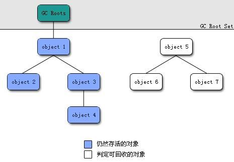

可作为 **GC Roots 的对象**包括下面几种:

- **虚拟机栈**(栈帧中的本地变量表)中引用的对象
- **本地方法栈**(Native 方法)中引用的对象
- **方法区**中**类静态属性**引用的对象
- **方法区**中**常量**引用的对象
- 所有**被同步锁持有**的对象

**GC Roots**是所有Java线程中处于**活跃状态**的**栈帧**, **静态引用**等指向**GC堆里的对象的引用**。换句话说，就是当前所有**正在被调用的方法**的**引用类型的参数/局部变量/临时值**。

### 如何判断一个常量是废弃常量？

运行时常量池(方法区的一部分)主要回收的是废弃的常量。那么，我们如何判断一个常量是废弃常量呢？

> 1. **JDK1.7 之前运行时常量池逻辑包含字符串常量池存放在方法区, 此时 hotspot 虚拟机对方法区的实现为永久代**
> 2. **JDK1.7 字符串常量池被从方法区拿到了堆中, 这里没有提到运行时常量池,也就是说字符串常量池被单独拿到堆,运行时常量池剩下的东西还在方法区, 也就是 hotspot 中的永久代** 。
> 3. **JDK1.8 hotspot 移除了永久代用元空间(Metaspace)取而代之, 这时候字符串常量池还在堆, 运行时常量池还在方法区, 只不过方法区的实现从永久代变成了元空间(Metaspace)**

假如在字符串常量池中存在字符串 "abc"，如果**当前没有任何 String 对象引用该字符串常量**的话，就说明常量 "abc" 就是废弃常量，如果这时发生内存回收的话而且有必要的话，"abc" 就会被系统清理出常量池了。

### 如何判断一个类是无用的类

**方法区**主要回收的是**无用的类**，如果类:

- **该类所有的实例都已经被回收，也就是 Java 堆中不存在该类的任何实例。**
- **加载该类的 `ClassLoader` 已经被回收。**
- **该类对应的 `java.lang.Class` 对象没有在任何地方被引用，无法在任何地方通过反射访问该类的方法。**

虚拟机可以对满足上述 3 个条件的无用类进行回收，这里说的仅仅是“可以”，而并不是和对象一样不使用了就会必然被回收。

### 如何判断是否回收该对象(两次标记对象)


即使在可达性分析法中不可达的对象，也并非是“非死不可”的，这时候它们暂时处于“缓刑阶段”，要真正宣告一个**对象死亡**，至少要经历**两次标记**过程；可达性分析法中**不可达的对象被第一次标记**并且看**此对象是否有必要执行 finalize 方法。当对象没有覆盖 finalize 方法，或 finalize 方法已经被虚拟机调用过时，虚拟机将这两种情况视为没有必要执行finalize方法。**

**被判定为需要执行的对象**将会被放在一个队列中进行**第二次标记**，除非这个对象与**引用链上的任何一个对象建立关联**，否则就会**被真的回收**。

## 垃圾回收算法

### 标记-清除

该算法分为“标记”和“清除”阶段：首先**标记出所有不需要回收的对象**，在标记完成后统一**回收所有没有被标记的对象**。它是最基础的收集算法，后续的算法都是对其不足进行改进得到。

**缺点**:

1. **效率问题**
2. **空间问题（标记清除后会产生大量不连续的碎片）**


### 标记-复制

为了解决效率问题，“标记-复制”收集算法出现了。它可以将内存分为大小相同的两块，每次使用其中的一块。当这一块的内存使用完后，就将还存活的对象复制到另一块去，然后再把使用的空间一次清理掉。这样就使每次的内存回收都是对内存区间的一半进行回收。


**优点**是不会有**空间碎片**，

**缺点**是每次只用得到一半内存。**在对象存活率较高的场景下**（比如老年代那样的环境），需要复制的东西太多，**效率会下降**。

### 标记-整理算法

根据老年代的特点提出的一种标记算法，标记过程仍然与“标记-清除”中的标记一样，但**后续步骤不是直接对可回收对象回收，而是让所有存活的对象向一端移动，然后直接清理掉端边界以外的内存。**


### 分代收集算法

当前虚拟机的垃圾收集都采用分代收集算法，这种算法没有什么新的思想，只是根据对象存活周期的不同将内存分为几块。一般将 java 堆分为新生代和老年代，这样我们就可以根据各个年代的特点选择合适的垃圾收集算法。

**比如在新生代中，每次收集都会有大量对象死去，所以可以选择”标记-复制“算法，只需要付出少量对象的复制成本就可以完成每次垃圾收集。而老年代的对象存活几率是比较高的，而且没有额外的空间对它进行分配担保，所以我们必须选择“标记-清除”或“标记-整理”算法进行垃圾收集。**

**延伸面试问题：** HotSpot 为什么要分为新生代和老年代？

根据上面的对分代收集算法的介绍回答。

## GC的分类

有人这么分:

1. 部分收集 (Partial GC)：
    - 新生代收集（Minor GC / Young GC）：只对新生代进行垃圾收集；
    - 老年代收集（Major GC / Old GC）：只对老年代进行垃圾收集。需要注意的是 Major GC 在有的语境中也用于指代整堆收集(Full GC)；
    - 混合收集（Mixed GC）：对整个新生代和部分老年代进行垃圾收集。

2. 整堆收集 (Full GC)：收集整个 Java 堆和方法区。

也有人这么分:

- 新生代GC（Minor GC）：指发生在新生代的垃圾收集动作，因为Java对象大多都具备朝生夕灭的特性，所以Minor GC非常频繁，一般回收速度也比较快。具体原理见上一篇文章。
- 老年代GC（Major GC / Full GC）：指发生在老年代的GC，出现了Major GC，经常会伴随至少一次的Minor GC（但非绝对的，在Parallel Scavenge收集器的收集策略里就有直接进行Major GC的策略选择过程）。Major GC的速度一般会比Minor GC慢10倍以上。

## [垃圾收集器](https://www.cnblogs.com/javastack/archive/2020/06/17/13152564.html)

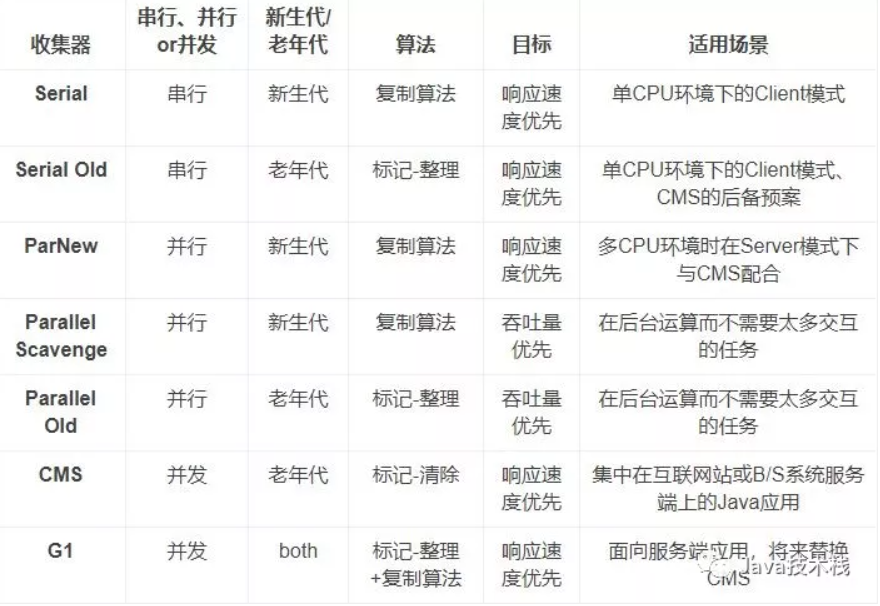

**如果说收集算法是内存回收的方法论，那么垃圾收集器就是内存回收的具体实现。**

**根据具体应用场景选择适合的垃圾收集器**。

### **并行和并发：**

- **并行（Parallel）** ：指**多条垃圾收集线程**并行工作，但此时**用户线程仍然处于等待状态**。
- **并发（Concurrent）**：指用户线程与垃圾收集线程同时执行（但不一定是并行，可能会**交替执行**），**用户程序在继续运行**，而垃圾收集器运行在另一个 CPU 上。

### 吞吐量（Throughput）

吞吐量就是CPU用于运行用户代码的时间与CPU总消耗时间的比值，即

吞吐量 = 运行用户代码时间 /（运行用户代码时间 + 垃圾收集时间）。

假设虚拟机总共运行了100分钟，其中垃圾收集花掉1分钟，那吞吐量就是99%。

### (新生代, 串行) Serial 收集器

**新生代**采用**标记-复制**算法

Serial（串行）收集器是最基本、历史最悠久的垃圾收集器了。大家看名字就知道这个收集器是一个单线程收集器了。它的 **“单线程”** 的意义不仅仅意味着它只会使用一条**垃圾收集线程**去完成垃圾收集工作，更重要的是它在进行垃圾收集工作的时候必须**暂停其他所有的工作线程**（ **"Stop The World"** ），直到它收集结束。


**优点**: **简单而高效（与其他收集器的单线程相比）**。Serial 收集器由于没有线程交互的开销，自然可以获得很高的单线程收集效率。

> Serial 收集器对于运行在 Client 模式下的虚拟机来说是个不错的选择。

**缺点**: **需要Stop the World**

### (新生代, 并行) ParNew 收集器

**新生代**采用**标记-复制**算法

**ParNew 收集器其实就是 Serial 收集器的<u>多线程</u>版本，除了使用多线程进行垃圾收集外，其余行为（控制参数、收集算法、回收策略等等）和 Serial 收集器完全一样。**

**ParNew工作时也必须Stop the World.** 图中的并发应该为并行.


>  它是许多运行在 Server 模式下的虚拟机的首要选择，除了 Serial 收集器外，只有它能与 CMS 收集器配合工作。

### (新生代, 并行) Parallel Scavenge 收集器

**新生代采用标记-复制算法**

Parallel Scavenge 几乎和 ParNew 一样。 **那么它有什么特别之处呢？**

```shell
-XX:+UseParallelGC

    使用 Parallel 收集器+ 老年代串行

-XX:+UseParallelOldGC

    使用 Parallel 收集器+ 老年代并行
```

**Parallel Scavenge 收集器关注点是吞吐量（高效率的利用 CPU）。CMS 等垃圾收集器的关注点更多的是用户线程的停顿时间（提高用户体验）。所谓吞吐量就是 CPU 中用于运行用户代码的时间与 CPU 总消耗时间的比值。** 

虚拟机会根据当前系统的运行情况收集**性能监控**信息，动态调整这些**参数**以提供**最合适的停顿时间**或者**最大的吞吐量**，这种方式称为**GC自适应的调节策略**（GC Ergonomics）。自适应调节策略也是Parallel Scavenge收集器与ParNew收集器的一个重要区别。

图中的并发应该为并行.


> Parallel Scavenge收集器无法与CMS收集器配合使用，所以在JDK 1.6推出Parallel Old之前，如果新生代选择Parallel Scavenge收集器，老年代只有Serial Old收集器能与之配合使用。

**这是 JDK1.8 默认收集器**

使用 java -XX:+PrintCommandLineFlags -version 命令查看

```
-XX:InitialHeapSize=262921408 -XX:MaxHeapSize=4206742528 -XX:+PrintCommandLineFlags -XX:+UseCompressedClassPointers -XX:+UseCompressedOops -XX:+UseParallelGC
java version "1.8.0_211"
Java(TM) SE Runtime Environment (build 1.8.0_211-b12)
Java HotSpot(TM) 64-Bit Server VM (build 25.211-b12, mixed mode)
```

JDK1.8 默认使用的是 Parallel Scavenge + Parallel Old，如果指定了-XX:+UseParallelGC 参数，则默认指定了-XX:+UseParallelOldGC，可以使用-XX:-UseParallelOldGC 来禁用该功能

### (老年代, 串行) Serial Old 收集器

**老年代**采用**标记-整理**算法。

**Serial 收集器的老年代版本**，它同样是一个单线程收集器。它主要有两大用途：一种用途是在 JDK1.5 以及以前的版本中与 Parallel Scavenge 收集器搭配使用，另一种用途是作为 CMS 收集器的后备方案, 在并发收集发生Concurrent Mode Failure时使用。

### (老年代, 并行) Parallel Old 收集器

**老年代**采用**标记-整理**算法。

**Parallel Scavenge 收集器的老年代版本**。使用多线程。

在**注重吞吐量以及 CPU 资源**的场合，都可以优先考虑 **Parallel Scavenge 收集器和 Parallel Old 收集器**。

### (老年代, 并发) CMS 收集器

CMS 收集器是通过 **“标记-清除”算法**实现的

**CMS（Concurrent Mark Sweep）收集器是一种以获取<u>最短回收停顿时间</u>为目标的收集器。它非常符合在注重用户体验的应用上使用。实现了让垃圾收集线程与用户线程（基本上）同时工作。**

CMS分为四个步骤：

- **初始标记：** **Stop The World**，标记下直接与 **GC Root 相连的对象**，速度很快 ；
- **并发标记：** **同时开启 GC 和用户线程**，用一个**闭包结构去记录可达对象**。但在这个阶段结束，这个闭包结构并**不能保证包含当前所有的可达对象**。因为**用户线程可能会不断的更新引用域**，所以 **GC 线程无法保证可达性分析的实时性**。所以这个算法里会**跟踪记录这些发生引用更新的地方**。
- **重新标记：**  **Stop The World**, 重新标记阶段就是为了**修正并发标记期间因为用户程序继续运行而导致标记产生变动的那一部分对象的标记记录**，这个阶段的停顿时间一般会**比初始标记阶段的时间稍长**，远远比并发标记阶段时间短
- **并发清除：** 开启用户线程，同时 **GC 线程开始对未标记的区域做清扫**。


由于整个过程中耗时最长的并发标记和并发清除过程收集器线程都可以与用户线程一起工作, 从总体上来说，CMS收集器的内存回收过程是与用户线程一起并发执行的。

**优点**：**并发收集、低停顿**。

**缺点**：

- 对**CPU资源非常敏感**. 其实，面向并发设计的程序都对CPU资源比较敏感。在并发阶段，它虽然不会导致用户线程**停顿**，但会因为占用CPU资源而导致**应用程序变慢**，总吞吐量会降低。
- 无法处理浮动垃圾（Floating Garbage） 可能出现“**Concurrent Mode Failure**”失败而**导致另一次Full GC**的产生。
- 由于CMS并发清理阶段**用户线程还在运行**着，伴随程序运行自然就还会有**新的垃圾不断产生**。这一部分垃圾就被称为“浮动垃圾”。浮动垃圾出现在标记过程之后，CMS无法再当次收集中处理掉它们，只好**留待下一次GC时再清理掉**。
- CMS收集器不能像其他收集器那样等到老年代几乎完全被填满了再进行收集，需要**预留一部分空间**提供**并发收集的程序使用**。
- **标记-清除**算法导致的**空间碎片**. 空间碎片过多时，将会给**大对象分配**带来很大麻烦，往往出现**老年代空间剩余，但无法找到足够大连续空间来分配当前对象**。

### (新老both, 并发) G1 收集器

**G1 (Garbage-First) 是一款面向服务器的垃圾收集器,主要针对配备多颗处理器及大容量内存的机器. 以极高概率满足 GC <u>停顿时间</u>要求的同时,还具备<u>高吞吐量</u>性能特征.**

G1使用**Region划分内存空间**以及**有优先级的区域回收**方式，保证了G1收集器在**有限的时间内**可以获取尽可能高的**收集效率**。它可以有计划地**避免在整个Java堆中进行全区域的垃圾收集**。G1跟踪各个**Region里面的垃圾堆积的价值大小**（回收所获得的**空间大小**以及回收**所需时间**的经验值），在后台维护一个**优先列表**，每次根据允许的**收集时间**，优先回收**价值最大的Region**。

#### **避免全堆扫描——Remembered Set**

G1把Java堆分为多个Region，就是“化整为零”。但是Region不可能是孤立的，**一个对象分配在某个Region中**，可以与**整个Java堆任意的对象发生引用关系**。在做**可达性分析确定对象是否存活**的时候，需要扫描整个Java堆才能保证准确性，这显然是对GC效率的极大伤害。

为了避免全堆扫描的发生，虚拟机为G1中**每个Region维护了一个与之对应的Remembered Set**。虚拟机发现**程序在对Reference类型的数据进行写操作时**，会产生一个**Write Barrier暂时中断写操作**, **检查Reference引用的对象**是否处于**不同的Region**之中（在分代的例子中就是检查是否**老年代中的对象引用了新生代中的对象**），如果是，便**通过CardTable把相关引用信息记录到被引用对象所属的Region的Remembered Set**之中。当进行内存回收时，在**GC根节点的枚举范围中加入Remembered Set**即可保证不对全堆扫描也不会有遗漏。

如果不计算维护Remembered Set的操作，G1收集器的运作大致可划分为以下几个步骤：

- **初始标记**（Initial Marking） 仅仅**标记GC Roots 能<u>直接</u>关联到的对象**，并且修改TAMS（Nest Top Mark Start）的值，让下一阶段用户程序并发运行时，能在正确的Region中创建对象，此阶段**需要停顿线程**，但耗时很短。
- **并发标记**（Concurrent Marking） 从**GC Root 开始对堆中对象进行<u>可达性分析</u>**，找到**存活对象**，此阶段**耗时较长**，但可**与用户程序并发执行**。
- **最终标记**（Final Marking） 最终标记阶段需要把**Remembered Set Logs**的数据合并到**Remembered Set**中，这阶段**需要停顿线程**，但是可**<u>并行</u>执行**。为了修正在**<u>并发标记期间</u>因用户程序继续运作而导致标记产生变动**的那一部分标记记录，虚拟机将这段时间的**对象变化记录在线程的Remembered Set Logs**里面.
- **筛选回收**（Live Data Counting and Evacuation） **首先对各个Region中的回收价值和成本进行排序，根据用户所期望的GC 停顿是时间来制定回收计划。**此阶段其实也可以做到**与用户程序一起并发执行**，但是因为**只回收一部分Region**，**时间是用户可控制的**，而且停顿用户线程将大幅度提高收集效率。

它具备以下特点：

- **并行与并发**：G1 能充分利用 CPU、多核环境下的硬件优势，使用多个 CPU（CPU 或者 CPU 核心）来**缩短 Stop-The-World 停顿时间**。部分其他收集器原本需要停顿 Java 线程执行的 GC 动作，G1 收集器仍然可以通过**并发的方式让 java 程序继续执行**。
- **分代收集**：虽然 G1 可以不需要其他收集器配合就能独立管理整个 GC 堆，但是还是保留了**分代**的概念。它将整个Java堆划分为多个大小相等的独立区域（**Region**），虽然还保留新生代和老年代的概念，但新生代和老年代不再是物理隔离的了，而都是一部分Region（不需要连续）的集合。
- **空间整合**：G1 从整体来看是基于“**标记-整理**”算法实现的收集器；从局部(两个Region之间)上来看是基于“**标记-复制**”算法实现的。
- **可预测的停顿**：G1 除了追求**低停顿**外，还能建立可预测的停顿时间模型，能让使用者明确指定在一个长度为 M 毫秒的时间片段内。

### 4.8 ZGC 收集器

与 CMS 中的 ParNew 和 G1 类似，ZGC 也采用标记-复制算法，不过 ZGC 对该算法做了重大改进。

在 ZGC 中出现 Stop The World 的情况会更少！