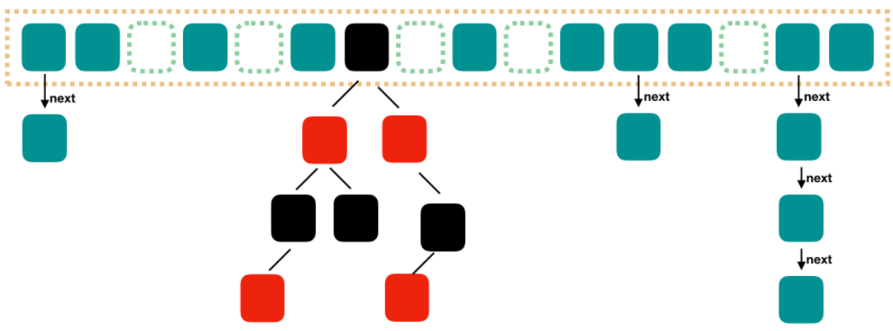

[toc]

# 集合


## List,Set,Map 三者的区别

- **`List`**(对付顺序的好帮手)： 存储的元素是**有序的、可重复的**。
- **`Set`**(注重独一无二的性质): 存储的元素是**无序的、不可重复的**。
- **`Map`**(用 Key 来搜索的专家): 使用键值对（key-value）存储，**Key 是无序的、不可重复的，value 是无序的、可重复的，每个键最多映射到一个值**。

# List - Collection子接口

实现类及底层实现：

- `Arraylist`： `Object[]`数组
- `LinkedList`： 双向链表(JDK1.6 之前为循环链表，JDK1.7 取消了循环)
- `Vector`：`Object[]`数组

## ArrayList

`ArrayList` 有序，底层是**数组**，相当于动态数组。与 Java 中的数组相比，它的**容量能动态增长**。在添加大量元素前，应用程序可以使用`ensureCapacity`操作来增加 `ArrayList` 实例的容量。这可以**减少扩容再分配的数量**。

`ArrayList`继承于 **`AbstractList`** ，实现了 **`List`**, **`RandomAccess`**, **`Cloneable`**, **`java.io.Serializable`** 这些接口。

```java
public class ArrayList<E> extends AbstractList<E>
        implements List<E>, RandomAccess, Cloneable, java.io.Serializable{

  }
```

- `RandomAccess` 是一个标志接口，表明实现这个这个接口的 List 集合是支持**快速随机访问**的：**可以通过元素的序号快速获取元素对象**；
- **`Cloneable` 接口** ，即覆盖了函数**`clone()`**，能被**克隆**。
- **`java.io.Serializable`**接口，这意味着`ArrayList`支持**序列化**，能通过序列化去**传输**。


### ArrayList扩容

#### 0. 类的主要属性

```java
/**
     * 默认初始容量大小
     */
    private static final int DEFAULT_CAPACITY = 10;
		
		/**
     * 保存ArrayList数据的数组
     */
    transient Object[] elementData; // non-private to simplify nested class access

    /**
     * ArrayList 所包含的元素个数
     */
    private int size;

    private static final Object[] DEFAULTCAPACITY_EMPTY_ELEMENTDATA = {};
```

#### 1. New ArrayList()<> 无参构造方法

**以无参数构造方法创建 `ArrayList` 时，实际上初始化赋值的是一个空数组。**

```java
		/**
     *默认构造函数，使用初始容量10构造一个空列表(无参数构造)
     */
    public ArrayList() {
        this.elementData = DEFAULTCAPACITY_EMPTY_ELEMENTDATA;
    }
```


#### 2. add(E e) 

**当真正对数组进行添加元素操作时，才真正分配容量。(即向数组中添加第一个元素时，数组容量扩为 10)**

```java
 		/**
     * 将指定的元素追加到此列表的末尾。
     */
    public boolean add(E e) {
   //添加元素之前，先调用ensureCapacityInternal方法
        ensureCapacityInternal(size + 1);  // Increments modCount!!
        //这里看到ArrayList添加元素的实质就相当于为数组赋值
        elementData[size++] = e;
        return true;
    }

```

#### 3. ensureCapacityInternal(int minCapacity)

**当 要 add 进第 1 个元素时，minCapacity 为 1，在 Math.max()方法比较后，minCapacity 为 10。**

```java
		//得到最小扩容量
    private void ensureCapacityInternal(int minCapacity) {
        if (elementData == DEFAULTCAPACITY_EMPTY_ELEMENTDATA) {
              // 获取默认的容量和传入参数的较大值
            minCapacity = Math.max(DEFAULT_CAPACITY, minCapacity);
        }

        ensureExplicitCapacity(minCapacity);
    }
```

#### 4. ensureExplicitCapacity(int minCapacity)

```java
		//判断是否需要扩容
    private void ensureExplicitCapacity(int minCapacity) {
        modCount++;

        // overflow-conscious code
        if (minCapacity - elementData.length > 0)
            //调用grow方法进行扩容，调用此方法代表已经开始扩容了
            grow(minCapacity);
    }
```

当我们要 add 进第 1 个元素到 ArrayList 时，elementData.length 为 0 （因为还是一个空的 list），因为执行了 `ensureCapacityInternal()` 方法 ，所以 minCapacity 此时为 10。此时，`minCapacity - elementData.length > 0`成立，所以会进入 `grow(minCapacity)` 方法。

- 当 add 第 2 个元素时，minCapacity 为 2，此时 e lementData.length(容量)在添加第一个元素后扩容成 10 了。此时，`minCapacity - elementData.length > 0` 不成立，所以不会进入 （执行）`grow(minCapacity)` 方法。
- 添加第 3、4···到第 10 个元素时，依然不会执行 grow 方法，数组容量都为 10。

直到添加第 11 个元素，minCapacity(为 11)比 elementData.length（为 10）要大。进入 grow 方法进行扩容。

> **注意** ：JDK11 移除了 `ensureCapacityInternal()` 和 `ensureExplicitCapacity()` 方法

#### 5. grow(int minCapacity) - 扩容的核心方法

```java
 /**
     * 要分配的最大数组大小
     */
    private static final int MAX_ARRAY_SIZE = Integer.MAX_VALUE - 8;

    /**
     * ArrayList扩容的核心方法。
     */
    private void grow(int minCapacity) {
        // oldCapacity为旧容量，newCapacity为新容量
        int oldCapacity = elementData.length;
        //将oldCapacity 右移一位，其效果相当于oldCapacity /2，
        //我们知道位运算的速度远远快于整除运算
        int newCapacity = oldCapacity + (oldCapacity >> 1);//new = old * 1.5
        //然后检查新容量是否大于最小需要容量，若还是小于最小需要容量，那么就把最小需要容量当作数组的新容量，
        if (newCapacity - minCapacity < 0)
            newCapacity = minCapacity;
       //如果新容量大于 MAX_ARRAY_SIZE,进入(执行) `hugeCapacity()` 方法来比较 minCapacity 和 MAX_ARRAY_SIZE，
       //如果minCapacity大于最大容量，则新容量则为`Integer.MAX_VALUE`，否则，新容量大小则为 MAX_ARRAY_SIZE 即为 `Integer.MAX_VALUE - 8`。
        if (newCapacity - MAX_ARRAY_SIZE > 0)
            newCapacity = hugeCapacity(minCapacity);
        // minCapacity is usually close to size, so this is a win:
        elementData = Arrays.copyOf(elementData, newCapacity);
    }
```

**int newCapacity = oldCapacity + (oldCapacity >> 1),所以 ArrayList 每次扩容之后容量都会变为原来的 1.5 倍左右（oldCapacity 为偶数就是 1.5 倍，否则是 1.5 倍左右）！** 奇偶不同，比如 ：10+10/2 = 15, 33+33/2=49。如果是奇数的话会丢掉小数.

> ">>"（移位运算符）：>>1 右移一位相当于除 2，右移 n 位相当于除以 2 的 n 次方。这里 oldCapacity 明显右移了 1 位所以相当于 oldCapacity /2。对于大数据的 2 进制运算,位移运算符比那些普通运算符的运算要快很多,因为程序仅仅移动一下而已,不去计算,这样提高了效率,节省了资源

**通过例子探究一下`grow()` 方法 ：**

- 当 add 第 1 个元素时，oldCapacity 为 0，经比较后第一个 if 判断成立，newCapacity = minCapacity(为 10)。但是第二个 if 判断不会成立，即 newCapacity 不比 MAX_ARRAY_SIZE 大，则不会进入 `hugeCapacity` 方法。数组容量为 10，add 方法中 return true,size 增为 1。
- 当 add 第 11 个元素进入 grow 方法时，newCapacity 为 15，比 minCapacity（为 11）大，第一个 if 判断不成立。新容量没有大于数组最大 size，不会进入 hugeCapacity 方法。数组容量扩为 15，add 方法中 return true,size 增为 11。
- 以此类推······

所以ArrayList的size一般为：0，10，15，22，33...?

#### 6. hugeCapacity(int minCapacity)

从上面 `grow()` 方法源码我们知道： 如果新容量大于 MAX_ARRAY_SIZE,进入(执行) `hugeCapacity()` 方法来比较 minCapacity 和 MAX_ARRAY_SIZE，如果 minCapacity 大于最大容量，则新容量则为`Integer.MAX_VALUE`，否则，新容量大小则为 MAX_ARRAY_SIZE 即为 `Integer.MAX_VALUE - 8`。

```java
    private static int hugeCapacity(int minCapacity) {
        if (minCapacity < 0) // overflow
            throw new OutOfMemoryError();
        //对minCapacity和MAX_ARRAY_SIZE进行比较
        //若minCapacity大，将Integer.MAX_VALUE作为新数组的大小
        //若MAX_ARRAY_SIZE大，将MAX_ARRAY_SIZE作为新数组的大小
        //MAX_ARRAY_SIZE = Integer.MAX_VALUE - 8;
        return (minCapacity > MAX_ARRAY_SIZE) ?
            Integer.MAX_VALUE :
            MAX_ARRAY_SIZE;
    }
```

#### 7. `Arrays.copyOf()`方法

 `copyOf()` 是系统自动在内部新建一个数组，并返回该数组。

```java
    public static int[] copyOf(int[] original, int newLength) {
    	// 申请一个新的数组
        int[] copy = new int[newLength];
	// 调用System.arraycopy,将源数组中的数据进行拷贝,并返回新的数组
        System.arraycopy(original, 0, copy, 0,
                         Math.min(original.length, newLength));
        return copy;
    }
```

`copyOf()`内部实际调用了 `System.arraycopy()` 方法

#### 8. `System.arraycopy()` 方法

```java
    // 我们发现 arraycopy 是一个 native 方法,接下来我们解释一下各个参数的具体意义
    /**
    *   复制数组
    * @param src 源数组
    * @param srcPos 源数组中的起始位置
    * @param dest 目标数组
    * @param destPos 目标数组中的起始位置
    * @param length 要复制的数组元素的数量
    */
    public static native void arraycopy(Object src,  int  srcPos,
                                        Object dest, int destPos,
                                        int length);
```

arraycopy()` 需要目标数组，将原数组拷贝到你自己定义的数组里或者原数组，而且可以选择拷贝的起点和长度以及放入新数组中的位置

### `ensureCapacity`方法 - 减少扩容重新分配的次数

这个方法 ArrayList 内部没有被调用过，所以很显然是提供给用户调用的，那么这个方法有什么作用呢？

```java
    /**
    如有必要，增加此 ArrayList 实例的容量，以确保它至少可以容纳由minimum capacity参数指定的元素数。
     *
     * @param   minCapacity   所需的最小容量
     */
    public void ensureCapacity(int minCapacity) {
        int minExpand = (elementData != DEFAULTCAPACITY_EMPTY_ELEMENTDATA)
            // any size if not default element table
            ? 0
            // larger than default for default empty table. It's already
            // supposed to be at default size.
            : DEFAULT_CAPACITY;

        if (minCapacity > minExpand) {
            ensureExplicitCapacity(minCapacity);
        }
    }
```

**最好在 add 大量元素之前用 `ensureCapacity` 方法，以减少增量重新分配的次数**

我们通过下面的代码实际测试以下这个方法的效果：

```java
public class EnsureCapacityTest {
	public static void main(String[] args) {
		ArrayList<Object> list = new ArrayList<Object>();
		final int N = 10000000;
		long startTime = System.currentTimeMillis();
		for (int i = 0; i < N; i++) {
			list.add(i);
		}
		long endTime = System.currentTimeMillis();
		System.out.println("使用ensureCapacity方法前："+(endTime - startTime));

	}
}
```

运行结果：

```java
使用ensureCapacity方法前：2158
public class EnsureCapacityTest {
    public static void main(String[] args) {
        ArrayList<Object> list = new ArrayList<Object>();
        final int N = 10000000;
        list = new ArrayList<Object>();
        long startTime1 = System.currentTimeMillis();
        list.ensureCapacity(N);
        for (int i = 0; i < N; i++) {
            list.add(i);
        }
        long endTime1 = System.currentTimeMillis();
        System.out.println("使用ensureCapacity方法后："+(endTime1 - startTime1));
    }
}
```

运行结果：

```
使用ensureCapacity方法后：1773
```

通过运行结果，我们可以看出向 ArrayList 添加大量元素之前最好先使用`ensureCapacity` 方法，**以减少增量重新分配的次数。**


### 附录：ArrayList 源码解读完整版

modCount是记录被改变的次数

```java
package java.util;

import java.util.function.Consumer;
import java.util.function.Predicate;
import java.util.function.UnaryOperator;


public class ArrayList<E> extends AbstractList<E>
        implements List<E>, RandomAccess, Cloneable, java.io.Serializable
{
    private static final long serialVersionUID = 8683452581122892189L;

    /**
     * 默认初始容量大小
     */
    private static final int DEFAULT_CAPACITY = 10;

    /**
     * 空数组（用于空实例）。
     */
    private static final Object[] EMPTY_ELEMENTDATA = {};

     //用于默认大小空实例的共享空数组实例。
      //我们把它从EMPTY_ELEMENTDATA数组中区分出来，以知道在添加第一个元素时容量需要增加多少。
    private static final Object[] DEFAULTCAPACITY_EMPTY_ELEMENTDATA = {};

    /**
     * 保存ArrayList数据的数组
     */
    transient Object[] elementData; // non-private to simplify nested class access

    /**
     * ArrayList 所包含的元素个数
     */
    private int size;

    /**
     * 带初始容量参数的构造函数（用户可以在创建ArrayList对象时自己指定集合的初始大小）
     */
    public ArrayList(int initialCapacity) {
        if (initialCapacity > 0) {
            //如果传入的参数大于0，创建initialCapacity大小的数组
            this.elementData = new Object[initialCapacity];
        } else if (initialCapacity == 0) {
            //如果传入的参数等于0，创建空数组
            this.elementData = EMPTY_ELEMENTDATA;
        } else {
            //其他情况，抛出异常
            throw new IllegalArgumentException("Illegal Capacity: "+
                                               initialCapacity);
        }
    }

    /**
     *默认无参构造函数
     *DEFAULTCAPACITY_EMPTY_ELEMENTDATA 为0.初始化为10，也就是说初始其实是空数组 当添加第一个元素的时候数组容量才变成10
     */
    public ArrayList() {
        this.elementData = DEFAULTCAPACITY_EMPTY_ELEMENTDATA;
    }

    /**
     * 构造一个包含指定集合的元素的列表，按照它们由集合的迭代器返回的顺序。
     */
    public ArrayList(Collection<? extends E> c) {
        //将指定集合转换为数组
        elementData = c.toArray();
        //如果elementData数组的长度不为0
        if ((size = elementData.length) != 0) {
            // 如果elementData不是Object类型数据（c.toArray可能返回的不是Object类型的数组所以加上下面的语句用于判断）
            if (elementData.getClass() != Object[].class)
                //将原来不是Object类型的elementData数组的内容，赋值给新的Object类型的elementData数组
                elementData = Arrays.copyOf(elementData, size, Object[].class);
        } else {
            // 其他情况，用空数组代替
            this.elementData = EMPTY_ELEMENTDATA;
        }
    }

    /**
     * 修改这个ArrayList实例的容量是列表的当前大小。 应用程序可以使用此操作来最小化ArrayList实例的存储。
     */
    public void trimToSize() {
        modCount++;
        if (size < elementData.length) {
            elementData = (size == 0)
              ? EMPTY_ELEMENTDATA
              : Arrays.copyOf(elementData, size);
        }
    }
//下面是ArrayList的扩容机制
//ArrayList的扩容机制提高了性能，如果每次只扩充一个，
//那么频繁的插入会导致频繁的拷贝，降低性能，而ArrayList的扩容机制避免了这种情况。
    /**
     * 如有必要，增加此ArrayList实例的容量，以确保它至少能容纳元素的数量
     * @param   minCapacity   所需的最小容量
     */
    public void ensureCapacity(int minCapacity) {
        //如果是true，minExpand的值为0，如果是false,minExpand的值为10
        int minExpand = (elementData != DEFAULTCAPACITY_EMPTY_ELEMENTDATA)
            // any size if not default element table
            ? 0
            // larger than default for default empty table. It's already
            // supposed to be at default size.
            : DEFAULT_CAPACITY;
        //如果最小容量大于已有的最大容量
        if (minCapacity > minExpand) {
            ensureExplicitCapacity(minCapacity);
        }
    }
   //得到最小扩容量
    private void ensureCapacityInternal(int minCapacity) {
        if (elementData == DEFAULTCAPACITY_EMPTY_ELEMENTDATA) {
              // 获取“默认的容量”和“传入参数”两者之间的最大值
            minCapacity = Math.max(DEFAULT_CAPACITY, minCapacity);
        }

        ensureExplicitCapacity(minCapacity);
    }
  //判断是否需要扩容
    private void ensureExplicitCapacity(int minCapacity) {
        modCount++;

        // overflow-conscious code
        if (minCapacity - elementData.length > 0)
            //调用grow方法进行扩容，调用此方法代表已经开始扩容了
            grow(minCapacity);
    }

    /**
     * 要分配的最大数组大小
     */
    private static final int MAX_ARRAY_SIZE = Integer.MAX_VALUE - 8;

    /**
     * ArrayList扩容的核心方法。
     */
    private void grow(int minCapacity) {
        // oldCapacity为旧容量，newCapacity为新容量
        int oldCapacity = elementData.length;
        //将oldCapacity 右移一位，其效果相当于oldCapacity /2，
        //我们知道位运算的速度远远快于整除运算，整句运算式的结果就是将新容量更新为旧容量的1.5倍，
        int newCapacity = oldCapacity + (oldCapacity >> 1);
        //然后检查新容量是否大于最小需要容量，若还是小于最小需要容量，那么就把最小需要容量当作数组的新容量，
        if (newCapacity - minCapacity < 0)
            newCapacity = minCapacity;
        //再检查新容量是否超出了ArrayList所定义的最大容量，
        //若超出了，则调用hugeCapacity()来比较minCapacity和 MAX_ARRAY_SIZE，
        //如果minCapacity大于MAX_ARRAY_SIZE，则新容量则为Interger.MAX_VALUE，否则，新容量大小则为 MAX_ARRAY_SIZE。
        if (newCapacity - MAX_ARRAY_SIZE > 0)
            newCapacity = hugeCapacity(minCapacity);
        // minCapacity is usually close to size, so this is a win:
        elementData = Arrays.copyOf(elementData, newCapacity);
    }
    //比较minCapacity和 MAX_ARRAY_SIZE
    private static int hugeCapacity(int minCapacity) {
        if (minCapacity < 0) // overflow
            throw new OutOfMemoryError();
        return (minCapacity > MAX_ARRAY_SIZE) ?
            Integer.MAX_VALUE :
            MAX_ARRAY_SIZE;
    }

    /**
     *返回此列表中的元素数。
     */
    public int size() {
        return size;
    }

    /**
     * 如果此列表不包含元素，则返回 true 。
     */
    public boolean isEmpty() {
        //注意=和==的区别
        return size == 0;
    }

    /**
     * 如果此列表包含指定的元素，则返回true 。
     */
    public boolean contains(Object o) {
        //indexOf()方法：返回此列表中指定元素的首次出现的索引，如果此列表不包含此元素，则为-1
        return indexOf(o) >= 0;
    }

    /**
     *返回此列表中指定元素的首次出现的索引，如果此列表不包含此元素，则为-1
     */
    public int indexOf(Object o) {
        if (o == null) {
            for (int i = 0; i < size; i++)
                if (elementData[i]==null)
                    return i;
        } else {
            for (int i = 0; i < size; i++)
                //equals()方法比较
                if (o.equals(elementData[i]))
                    return i;
        }
        return -1;
    }

    /**
     * 返回此列表中指定元素的最后一次出现的索引，如果此列表不包含元素，则返回-1。.
     */
    public int lastIndexOf(Object o) {
        if (o == null) {
            for (int i = size-1; i >= 0; i--)
                if (elementData[i]==null)
                    return i;
        } else {
            for (int i = size-1; i >= 0; i--)
                if (o.equals(elementData[i]))
                    return i;
        }
        return -1;
    }

    /**
     * 返回此ArrayList实例的浅拷贝。 （元素本身不被复制。）
     */
    public Object clone() {
        try {
            ArrayList<?> v = (ArrayList<?>) super.clone();
            //Arrays.copyOf功能是实现数组的复制，返回复制后的数组。参数是被复制的数组和复制的长度
            v.elementData = Arrays.copyOf(elementData, size);
            v.modCount = 0;
            return v;
        } catch (CloneNotSupportedException e) {
            // 这不应该发生，因为我们是可以克隆的
            throw new InternalError(e);
        }
    }

    /**
     *以正确的顺序（从第一个到最后一个元素）返回一个包含此列表中所有元素的数组。
     *返回的数组将是“安全的”，因为该列表不保留对它的引用。 （换句话说，这个方法必须分配一个新的数组）。
     *因此，调用者可以自由地修改返回的数组。 此方法充当基于阵列和基于集合的API之间的桥梁。
     */
    public Object[] toArray() {
        return Arrays.copyOf(elementData, size);
    }

    /**
     * 以正确的顺序返回一个包含此列表中所有元素的数组（从第一个到最后一个元素）;
     *返回的数组的运行时类型是指定数组的运行时类型。 如果列表适合指定的数组，则返回其中。
     *否则，将为指定数组的运行时类型和此列表的大小分配一个新数组。
     *如果列表适用于指定的数组，其余空间（即数组的列表数量多于此元素），则紧跟在集合结束后的数组中的元素设置为null 。
     *（这仅在调用者知道列表不包含任何空元素的情况下才能确定列表的长度。）
     */
    @SuppressWarnings("unchecked")
    public <T> T[] toArray(T[] a) {
        if (a.length < size)
            // 新建一个运行时类型的数组，但是ArrayList数组的内容
            return (T[]) Arrays.copyOf(elementData, size, a.getClass());
            //调用System提供的arraycopy()方法实现数组之间的复制
        System.arraycopy(elementData, 0, a, 0, size);
        if (a.length > size)
            a[size] = null;
        return a;
    }

    // Positional Access Operations

    @SuppressWarnings("unchecked")
    E elementData(int index) {
        return (E) elementData[index];
    }

    /**
     * 返回此列表中指定位置的元素。
     */
    public E get(int index) {
        rangeCheck(index);

        return elementData(index);
    }

    /**
     * 用指定的元素替换此列表中指定位置的元素。
     */
    public E set(int index, E element) {
        //对index进行界限检查
        rangeCheck(index);

        E oldValue = elementData(index);
        elementData[index] = element;
        //返回原来在这个位置的元素
        return oldValue;
    }

    /**
     * 将指定的元素追加到此列表的末尾。
     */
    public boolean add(E e) {
        ensureCapacityInternal(size + 1);  // Increments modCount!!
        //这里看到ArrayList添加元素的实质就相当于为数组赋值
        elementData[size++] = e;
        return true;
    }

    /**
     * 在此列表中的指定位置插入指定的元素。
     *先调用 rangeCheckForAdd 对index进行界限检查；然后调用 ensureCapacityInternal 方法保证capacity足够大；
     *再将从index开始之后的所有成员后移一个位置；将element插入index位置；最后size加1。
     */
    public void add(int index, E element) {
        rangeCheckForAdd(index);

        ensureCapacityInternal(size + 1);  // Increments modCount!!
        //arraycopy()这个实现数组之间复制的方法一定要看一下，下面就用到了arraycopy()方法实现数组自己复制自己
        System.arraycopy(elementData, index, elementData, index + 1,
                         size - index);
        elementData[index] = element;
        size++;
    }

    /**
     * 删除该列表中指定位置的元素。 将任何后续元素移动到左侧（从其索引中减去一个元素）。
     */
    public E remove(int index) {
        rangeCheck(index);

        modCount++;
        E oldValue = elementData(index);

        int numMoved = size - index - 1;
        if (numMoved > 0)
            System.arraycopy(elementData, index+1, elementData, index,
                             numMoved);
        elementData[--size] = null; // clear to let GC do its work
      //从列表中删除的元素
        return oldValue;
    }

    /**
     * 从列表中删除指定元素的第一个出现（如果存在）。 如果列表不包含该元素，则它不会更改。
     *返回true，如果此列表包含指定的元素
     */
    public boolean remove(Object o) {
        if (o == null) {
            for (int index = 0; index < size; index++)
                if (elementData[index] == null) {
                    fastRemove(index);
                    return true;
                }
        } else {
            for (int index = 0; index < size; index++)
                if (o.equals(elementData[index])) {
                    fastRemove(index);
                    return true;
                }
        }
        return false;
    }

    /*
     * Private remove method that skips bounds checking and does not
     * return the value removed.
     */
    private void fastRemove(int index) {
        modCount++;
        int numMoved = size - index - 1;
        if (numMoved > 0)
            System.arraycopy(elementData, index+1, elementData, index,
                             numMoved);
        elementData[--size] = null; // clear to let GC do its work
    }

    /**
     * 从列表中删除所有元素。
     */
    public void clear() {
        modCount++;

        // 把数组中所有的元素的值设为null
        for (int i = 0; i < size; i++)
            elementData[i] = null;

        size = 0;
    }

    /**
     * 按指定集合的Iterator返回的顺序将指定集合中的所有元素追加到此列表的末尾。
     */
    public boolean addAll(Collection<? extends E> c) {
        Object[] a = c.toArray();
        int numNew = a.length;
        ensureCapacityInternal(size + numNew);  // Increments modCount
        System.arraycopy(a, 0, elementData, size, numNew);
        size += numNew;
        return numNew != 0;
    }

    /**
     * 将指定集合中的所有元素插入到此列表中，从指定的位置开始。
     */
    public boolean addAll(int index, Collection<? extends E> c) {
        rangeCheckForAdd(index);

        Object[] a = c.toArray();
        int numNew = a.length;
        ensureCapacityInternal(size + numNew);  // Increments modCount

        int numMoved = size - index;
        if (numMoved > 0)
            System.arraycopy(elementData, index, elementData, index + numNew,
                             numMoved);

        System.arraycopy(a, 0, elementData, index, numNew);
        size += numNew;
        return numNew != 0;
    }

    /**
     * 从此列表中删除所有索引为fromIndex （含）和toIndex之间的元素。
     *将任何后续元素移动到左侧（减少其索引）。
     */
    protected void removeRange(int fromIndex, int toIndex) {
        modCount++;
        int numMoved = size - toIndex;
        System.arraycopy(elementData, toIndex, elementData, fromIndex,
                         numMoved);

        // clear to let GC do its work
        int newSize = size - (toIndex-fromIndex);
        for (int i = newSize; i < size; i++) {
            elementData[i] = null;
        }
        size = newSize;
    }

    /**
     * 检查给定的索引是否在范围内。
     */
    private void rangeCheck(int index) {
        if (index >= size)
            throw new IndexOutOfBoundsException(outOfBoundsMsg(index));
    }

    /**
     * add和addAll使用的rangeCheck的一个版本
     */
    private void rangeCheckForAdd(int index) {
        if (index > size || index < 0)
            throw new IndexOutOfBoundsException(outOfBoundsMsg(index));
    }

    /**
     * 返回IndexOutOfBoundsException细节信息
     */
    private String outOfBoundsMsg(int index) {
        return "Index: "+index+", Size: "+size;
    }

    /**
     * 从此列表中删除指定集合中包含的所有元素。
     */
    public boolean removeAll(Collection<?> c) {
        Objects.requireNonNull(c);
        //如果此列表被修改则返回true
        return batchRemove(c, false);
    }

    /**
     * 仅保留此列表中包含在指定集合中的元素。
     *换句话说，从此列表中删除其中不包含在指定集合中的所有元素。
     */
    public boolean retainAll(Collection<?> c) {
        Objects.requireNonNull(c);
        return batchRemove(c, true);
    }


    /**
     * 从列表中的指定位置开始，返回列表中的元素（按正确顺序）的列表迭代器。
     *指定的索引表示初始调用将返回的第一个元素为next 。 初始调用previous将返回指定索引减1的元素。
     *返回的列表迭代器是fail-fast 。
     */
    public ListIterator<E> listIterator(int index) {
        if (index < 0 || index > size)
            throw new IndexOutOfBoundsException("Index: "+index);
        return new ListItr(index);
    }

    /**
     *返回列表中的列表迭代器（按适当的顺序）。
     *返回的列表迭代器是fail-fast 。
     */
    public ListIterator<E> listIterator() {
        return new ListItr(0);
    }

    /**
     *以正确的顺序返回该列表中的元素的迭代器。
     *返回的迭代器是fail-fast 。
     */
    public Iterator<E> iterator() {
        return new Itr();
    }
```

## LinkedList

LinkedList是一个实现了List接口和Deque接口的双端链表。 LinkedList底层的链表结构使它支持高效的插入和删除操作，另外它实现了Deque接口，使得LinkedList类也具有队列的特性; LinkedList不是线程安全的。


### 类的属性

```java
transient int size = 0;

    /**
     * Pointer to first node.
     * Invariant: (first == null && last == null) ||
     *            (first.prev == null && first.item != null)
     */
    transient Node<E> first;

    /**
     * Pointer to last node.
     * Invariant: (first == null && last == null) ||
     *            (last.next == null && last.item != null)
     */
    transient Node<E> last;
```


### Node - LinkedList的内部私有类

就是一个双向链表。

```java
private static class Node<E> {
        E item;//节点值
        Node<E> next;//后继节点
        Node<E> prev;//前驱节点

        Node(Node<E> prev, E element, Node<E> next) {
            this.item = element;
            this.next = next;
            this.prev = prev;
        }
    }

```

### 构造方法

**空构造方法：**

```java
    public LinkedList() {
    }
```

**用已有的集合创建链表的构造方法：**

```java
    public LinkedList(Collection<? extends E> c) {
        this();
        addAll(c);//将集合插入到链表尾部
    }
```

### add方法

#### **add(E e)** 

将元素添加到链表**尾部**

```java
public boolean add(E e) {
        linkLast(e);//这里就只调用了这一个方法
        return true;
    }
   /**
     * 链接使e作为最后一个元素。
     */
    void linkLast(E e) {
        final Node<E> l = last;
        final Node<E> newNode = new Node<>(l, e, null);//Node prev, E element, Node next
        last = newNode;//新建节点
        if (l == null)//原last为null，即此LinkedList为空链表
            first = newNode;
        else
            l.next = newNode;//指向后继元素也就是指向下一个元素
        size++;
        modCount++;
    }
```

#### **add(int index,E e)**

在指定位置添加元素

```java
public void add(int index, E element) {
        checkPositionIndex(index); //检查索引是否处于[0-size]之间

        if (index == size)//添加在链表尾部
            linkLast(element);
        else//添加在链表中间
            linkBefore(element, node(index));
    }

 		private void checkPositionIndex(int index) {
        if (!isPositionIndex(index))
            throw new IndexOutOfBoundsException(outOfBoundsMsg(index));
    }
		private boolean isPositionIndex(int index) {
        return index >= 0 && index <= size;
    }

		Node<E> node(int index) {
        // assert isElementIndex(index);
				//做了一点优化，小于size/2就从头开始找，大于size/2就从尾开始找
        if (index < (size >> 1)) {
            Node<E> x = first;
            for (int i = 0; i < index; i++)
                x = x.next;
            return x;
        } else {
            Node<E> x = last;
            for (int i = size - 1; i > index; i--)
                x = x.prev;
            return x;
        }
    }

		/**
     * Inserts element e before non-null Node succ.
     */
    void linkBefore(E e, Node<E> succ) {
        // assert succ != null;
        final Node<E> pred = succ.prev;
        final Node<E> newNode = new Node<>(pred, e, succ);
        succ.prev = newNode;
        if (pred == null)
            first = newNode;
        else
            pred.next = newNode;
        size++;
        modCount++;
    }
```

linkBefore方法需要给定两个参数，一个插入节点的值，一个指定的node，所以我们又调用了Node(index)（做了一点优化，小于size/2就从头开始找，大于size/2就从尾开始找）去找到index对应的node

#### **addAll(Collection c )**

**将集合插入到链表尾部**

```java
public boolean addAll(Collection<? extends E> c) {
        return addAll(size, c);
    }
```

#### **addAll(int index, Collection c)：**

将集合从**指定位置**开始**插入**

```java
public boolean addAll(int index, Collection<? extends E> c) {
        //1:检查index范围是否在size之内
        checkPositionIndex(index);

        //2:toArray()方法把集合的数据存到对象数组中
        Object[] a = c.toArray();
        int numNew = a.length;
        if (numNew == 0)
            return false;

        //3：得到插入位置的前驱节点和后继节点
        Node<E> pred, succ;
        //如果插入位置为尾部，前驱节点为last，后继节点为null
        if (index == size) {
            succ = null;
            pred = last;
        }
        //否则，调用node()方法得到后继节点，再得到前驱节点
        else {
            succ = node(index);
            pred = succ.prev;
        }

        // 4：遍历数据将数据插入
        for (Object o : a) {
            @SuppressWarnings("unchecked") E e = (E) o;
            //创建新节点
            Node<E> newNode = new Node<>(pred, e, null);
            //如果插入位置在链表头部
            if (pred == null)
                first = newNode;
            else
                pred.next = newNode;
            pred = newNode;
        }

        //如果插入位置在尾部，重置last节点
        if (succ == null) {
            last = pred;
        }
        //否则，将插入的链表与先前链表连接起来
        else {
            pred.next = succ;
            succ.prev = pred;
        }

        size += numNew;
        modCount++;
        return true;
    }    
```

上面可以看出addAll方法通常包括下面四个步骤：

1. 检查index范围是否在size之内
2. toArray()方法把集合的数据存到对象数组中
3. 得到插入位置的前驱和后继节点
4. 遍历数据，将数据插入到指定位置

#### addFirst(E e)：

 将元素添加到链表头部

```java
 public void addFirst(E e) {
        linkFirst(e);
    }
private void linkFirst(E e) {
        final Node<E> f = first;
        final Node<E> newNode = new Node<>(null, e, f);//新建节点，以头节点为后继节点
        first = newNode;
        //如果链表为空，last节点也指向该节点
        if (f == null)
            last = newNode;
        //否则，将头节点的前驱指针指向新节点，也就是指向前一个元素
        else
            f.prev = newNode;
        size++;
        modCount++;
    }
```

#### **addLast(E e)：**

将元素添加到链表尾部，与 **add(E e)** 方法一样

```java
public void addLast(E e) {
        linkLast(e);
    }
```

#### offer(E e)

Queue的方法，添加元素至队尾

### 根据index获取对象的方法

#### **get(int index)：**

根据指定索引返回数据

```java
public E get(int index) {
        //检查index范围是否在size之内
        checkElementIndex(index);
        //调用Node(index)去找到index对应的node然后返回它的值
        return node(index).item;//item即为元素（Element）
    }
```

### **获取头节点（index=0）对象的方法: **

#### getFirst(), element(), peek(), peekFirst()

```java
public E getFirst() {
        final Node<E> f = first;
        if (f == null)
            throw new NoSuchElementException();
        return f.item;
    }
public E element() {
        return getFirst();
    }
public E peek() {
        final Node<E> f = first;
        return (f == null) ? null : f.item;
    }

public E peekFirst() {
        final Node<E> f = first;
        return (f == null) ? null : f.item;
     }
```

**区别：** getFirst(),element(),peek(),peekFirst() 这四个获取头结点方法的区别在于对链表为空时的处理，是抛出异常还是返回null

- **getFirst()** 和**element()** 方法将会在链表为空时，抛出异常

    element()方法的内部就是使用getFirst()实现的。它们会在链表为空时，抛出NoSuchElementException

- **peek()**和**peekFirst()**方法会在链表为空时返回null

    peek()和peekFirst()实现完全一样，返回null

#### poll()

poll()为Queue的方法，返回头节点，并从LinkedList中将头节点移除

### **获取尾节点（index=-1）对象的方法:** 

#### getLast(), peekLast()

```java
 public E getLast() {
        final Node<E> l = last;
        if (l == null)
            throw new NoSuchElementException();
        return l.item;
    }
 public E peekLast() {
        final Node<E> l = last;
        return (l == null) ? null : l.item;
    }
```

**两者区别：** **getLast()** 方法在链表为空时，会抛出**NoSuchElementException**，而**peekLast()** 则不会，只是会返回 **null**。

### 根据对象得到index的方法

#### **int indexOf(Object o)**

 从头遍历找

```java
public int indexOf(Object o) {
        int index = 0;
        if (o == null) {
            //从头遍历
            for (Node<E> x = first; x != null; x = x.next) {
                if (x.item == null)
                    return index;
                index++;
            }
        } else {
            //从头遍历
            for (Node<E> x = first; x != null; x = x.next) {
                if (o.equals(x.item))
                    return index;
                index++;
            }
        }
        return -1;
    }
```

#### **int lastIndexOf(Object o)：** 

从尾遍历找

```java
public int lastIndexOf(Object o) {
        int index = size;
        if (o == null) {
            //从尾遍历
            for (Node<E> x = last; x != null; x = x.prev) {
                index--;
                if (x.item == null)
                    return index;
            }
        } else {
            //从尾遍历
            for (Node<E> x = last; x != null; x = x.prev) {
                index--;
                if (o.equals(x.item))
                    return index;
            }
        }
        return -1;
    }
```

### 检查链表是否包含某对象的方法：

#### **contains(Object o)：** 返回对象第一次出现的索引

检查对象o是否存在于链表中，**

```java
 public boolean contains(Object o) {
        return indexOf(o) != -1;
    }
```

### 删除方法

#### **remove()** ,**removeFirst(), pop():** 删除头节点 全部抛异常

```java
public E pop() {
        return removeFirst();
    }
public E remove() {
        return removeFirst();
    }
public E removeFirst() {
        final Node<E> f = first;
        if (f == null)
            throw new NoSuchElementException();
        return unlinkFirst(f);
    }
    /**
     * Unlinks non-null first node f.
     */
private E unlinkFirst(Node<E> f) {
        // assert f == first && f != null;
        final E element = f.item;
        final Node<E> next = f.next;
        f.item = null;
        f.next = null; // help GC
        first = next;
        if (next == null)
            last = null;
        else
            next.prev = null;
        size--;
        modCount++;
        return element;
}
```

#### **removeLast(), pollLast():** 删除尾节点

```java
public E removeLast() {
        final Node<E> l = last;
        if (l == null)
            throw new NoSuchElementException();
        return unlinkLast(l);
    }
public E pollLast() {
        final Node<E> l = last;
        return (l == null) ? null : unlinkLast(l);
    }
		/**
     * Unlinks non-null last node l.
     */
private E unlinkLast(Node<E> l) {
        // assert l == last && l != null;
        final E element = l.item;
        final Node<E> prev = l.prev;
        l.item = null;
        l.prev = null; // help GC
        last = prev;
        if (prev == null)
            first = null;
        else
            prev.next = null;
        size--;
        modCount++;
        return element;
    }
```

**区别：** removeLast()在链表为空时将抛出NoSuchElementException，而pollLast()方法返回null。

#### **remove(Object o):** 删除指定对象（只会删除一个匹配的对象）

```java
public boolean remove(Object o) {
        //如果删除对象为null
        if (o == null) {
            //从头开始遍历
            for (Node<E> x = first; x != null; x = x.next) {
                //找到元素
                if (x.item == null) {
                   //从链表中移除找到的元素
                    unlink(x);
                    return true;
                }
            }
        } else {
            //从头开始遍历
            for (Node<E> x = first; x != null; x = x.next) {
                //找到元素
                if (o.equals(x.item)) {
                    //从链表中移除找到的元素
                    unlink(x);
                    return true;
                }
            }
        }
        return false;
    }
```

当删除指定对象时，只需调用remove(Object o)即可，不过该方法一次**只会删除一个匹配的对象**，如果删除了匹配对象，返回true，否则false。

unlink(Node x) 方法：

```java
E unlink(Node<E> x) {
        // assert x != null;
        final E element = x.item;
        final Node<E> next = x.next;//得到后继节点
        final Node<E> prev = x.prev;//得到前驱节点

        //删除前驱指针
        if (prev == null) {
            first = next;//如果删除的节点是头节点,令头节点指向该节点的后继节点
        } else {
            prev.next = next;//将前驱节点的后继节点指向后继节点
            x.prev = null;
        }

        //删除后继指针
        if (next == null) {
            last = prev;//如果删除的节点是尾节点,令尾节点指向该节点的前驱节点
        } else {
            next.prev = prev;
            x.next = null;
        }

        x.item = null;
        size--;
        modCount++;
        return element;
    }
```

#### **remove(int index)**：删除指定index的元素

```java
public E remove(int index) {
        //检查index范围
        checkElementIndex(index);
        //将节点删除
        return unlink(node(index));
    }
```

### LinkedList类常用方法测试

```java
package list;

import java.util.Iterator;
import java.util.LinkedList;

public class LinkedListDemo {
    public static void main(String[] srgs) {
        //创建存放int类型的linkedList
        LinkedList<Integer> linkedList = new LinkedList<>();
        /************************** linkedList的基本操作 ************************/
        linkedList.addFirst(0); // 添加元素到列表开头
        linkedList.add(1); // 在列表结尾添加元素
        linkedList.add(2, 2); // 在指定位置添加元素
        linkedList.addLast(3); // 添加元素到列表结尾
        
        System.out.println("LinkedList（直接输出的）: " + linkedList);

        System.out.println("getFirst()获得第一个元素: " + linkedList.getFirst()); // 返回此列表的第一个元素
        System.out.println("getLast()获得第最后一个元素: " + linkedList.getLast()); // 返回此列表的最后一个元素
        System.out.println("removeFirst()删除第一个元素并返回: " + linkedList.removeFirst()); // 移除并返回此列表的第一个元素
        System.out.println("removeLast()删除最后一个元素并返回: " + linkedList.removeLast()); // 移除并返回此列表的最后一个元素
        System.out.println("After remove:" + linkedList);
        System.out.println("contains()方法判断列表是否包含1这个元素:" + linkedList.contains(1)); // 判断此列表包含指定元素，如果是，则返回true
        System.out.println("该linkedList的大小 : " + linkedList.size()); // 返回此列表的元素个数

        /************************** 位置访问操作 ************************/
        System.out.println("-----------------------------------------");
        linkedList.set(1, 3); // 将此列表中指定位置的元素替换为指定的元素
        System.out.println("After set(1, 3):" + linkedList);
        System.out.println("get(1)获得指定位置（这里为1）的元素: " + linkedList.get(1)); // 返回此列表中指定位置处的元素

        /************************** Search操作 ************************/
        System.out.println("-----------------------------------------");
        linkedList.add(3);
        System.out.println("indexOf(3): " + linkedList.indexOf(3)); // 返回此列表中首次出现的指定元素的索引
        System.out.println("lastIndexOf(3): " + linkedList.lastIndexOf(3));// 返回此列表中最后出现的指定元素的索引

        /************************** Queue操作 ************************/
        System.out.println("-----------------------------------------");
        System.out.println("peek(): " + linkedList.peek()); // 获取但不移除此列表的头
        System.out.println("element(): " + linkedList.element()); // 获取但不移除此列表的头
        linkedList.poll(); // 获取并移除此列表的头
        System.out.println("After poll():" + linkedList);
        linkedList.remove();
        System.out.println("After remove():" + linkedList); // 获取并移除此列表的头
        linkedList.offer(4);
        System.out.println("After offer(4):" + linkedList); // 将指定元素添加到此列表的末尾

        /************************** Deque操作 ************************/
        System.out.println("-----------------------------------------");
        linkedList.offerFirst(2); // 在此列表的开头插入指定的元素
        System.out.println("After offerFirst(2):" + linkedList);
        linkedList.offerLast(5); // 在此列表末尾插入指定的元素
        System.out.println("After offerLast(5):" + linkedList);
        System.out.println("peekFirst(): " + linkedList.peekFirst()); // 获取但不移除此列表的第一个元素
        System.out.println("peekLast(): " + linkedList.peekLast()); // 获取但不移除此列表的第一个元素
        linkedList.pollFirst(); // 获取并移除此列表的第一个元素
        System.out.println("After pollFirst():" + linkedList);
        linkedList.pollLast(); // 获取并移除此列表的最后一个元素
        System.out.println("After pollLast():" + linkedList);
        linkedList.push(2); // 将元素推入此列表所表示的堆栈（插入到列表的头）
        System.out.println("After push(2):" + linkedList);
        linkedList.pop(); // 从此列表所表示的堆栈处弹出一个元素（获取并移除列表第一个元素）
        System.out.println("After pop():" + linkedList);
        linkedList.add(3);
        linkedList.removeFirstOccurrence(3); // 从此列表中移除第一次出现的指定元素（从头部到尾部遍历列表）
        System.out.println("After removeFirstOccurrence(3):" + linkedList);
        linkedList.removeLastOccurrence(3); // 从此列表中移除最后一次出现的指定元素（从尾部到头部遍历列表）
        System.out.println("After removeFirstOccurrence(3):" + linkedList);

        /************************** 遍历操作 ************************/
        System.out.println("-----------------------------------------");
        linkedList.clear();
        for (int i = 0; i < 100000; i++) {
            linkedList.add(i);
        }
        // 迭代器遍历
        long start = System.currentTimeMillis();
        Iterator<Integer> iterator = linkedList.iterator();
        while (iterator.hasNext()) {
            iterator.next();
        }
        long end = System.currentTimeMillis();
        System.out.println("Iterator：" + (end - start) + " ms");

        // 顺序遍历(随机遍历)
        start = System.currentTimeMillis();
        for (int i = 0; i < linkedList.size(); i++) {
            linkedList.get(i);
        }
        end = System.currentTimeMillis();
        System.out.println("for：" + (end - start) + " ms");

        // 另一种for循环遍历
        start = System.currentTimeMillis();
        for (Integer i : linkedList)
            ;
        end = System.currentTimeMillis();
        System.out.println("for2：" + (end - start) + " ms");

        // 通过pollFirst()或pollLast()来遍历LinkedList
        LinkedList<Integer> temp1 = new LinkedList<>();
        temp1.addAll(linkedList);
        start = System.currentTimeMillis();
        while (temp1.size() != 0) {
            temp1.pollFirst();
        }
        end = System.currentTimeMillis();
        System.out.println("pollFirst()或pollLast()：" + (end - start) + " ms");

        // 通过removeFirst()或removeLast()来遍历LinkedList
        LinkedList<Integer> temp2 = new LinkedList<>();
        temp2.addAll(linkedList);
        start = System.currentTimeMillis();
        while (temp2.size() != 0) {
            temp2.removeFirst();
        }
        end = System.currentTimeMillis();
        System.out.println("removeFirst()或removeLast()：" + (end - start) + " ms");
    }
}
```

## synchronizedList - 线程安全的LinkedList

LinkedList不是线程安全的，如果想使LinkedList变成线程安全的，可以调用静态类Collections类中的synchronizedList方法：

```java
List list=Collections.synchronizedList(new LinkedList(...));
```


## ArrayList 和 Vector 的区别?

1. ArrayList **线程不安全** `Vector`线程安全
2. ArrayList扩容时按照50%增加，Vector按照100%增加。
3. ArrayList的性能要高于Vector

## ArrayList 与 LinkedList 区别?

1. **是否保证线程安全：** `ArrayList` 和 `LinkedList` 都是**不同步**的，也就是**不保证线程安全**；
2. **底层数据结构：** `Arraylist` 底层使用的是 **`Object` 数组**；`LinkedList` 底层使用的是 **双向链表** 数据结构（JDK1.6 之前为循环链表，JDK1.7 取消了循环。注意**双向链表**和**双向循环链表**的区别）
3. LinkedList提供了List接口没有提供的方法，方便数据的**头尾操作**。
4. **插入和删除是否受元素位置的影响：**
    -  **`ArrayList` 采用<u>数组</u>存储，所以插入和删除元素的时间复杂度<u>受</u>元素位置的影响。** 比如：
        - 执行**`add(E e)`**方法的时候， `ArrayList` 会默认在将指定的元素追加到此列表的**末尾**，这种情况时间复杂度就是 **O(1)**；
        - 要在指定位置 i 插入和删除元素，执行**`add(int index, E element)`**，时间复杂度就为 **O(n-i)**。因为在进行上述操作的时候集合中第 i 和第 i 个元素之后的(n-i)个元素都要执行向后位/向前移一位的操作。
    -  **`LinkedList` 采用<u>链表</u>存储，所以插入和删除<u>不受</u>元素位置的影响**，但是
        - **对于`add(E e)`方法的插入，删除元素时间复杂度不受元素位置的影响，近似 O(1)**
        - **如果是要在指定位置`i`插入和删除元素的话（`(add(int index, E element)`） 时间复杂度近似为`o(n))`因为需要先移动到指定位置再插入。**
5. **是否支持快速随机访问：** `LinkedList` **不支持高效的随机元素访问**，而 `ArrayList` **支持**。快速随机访问就是通过元素的序号快速获取元素对象，即`**get(int index)**`方法。
6. **内存空间占用：** `ArrayList` 的空 间浪费主要体现在在 **list 列表的结尾会预留一定的容量空间**，而 `LinkedList` 的空间花费则体现在它的每一个元素都需要消耗比 `ArrayList` 更多的空间（因为要**多存放直接后继和直接前驱的索引**）。

# Set - Collection子接口

## 实现类：HashSet、LinkedHashSet 和 TreeSet

- `HashSet`（无序，唯一）: 基于 `HashMap` 实现的，底层采用 `HashMap` 来保存元素，线程不安全的，可以存储 null 值；
- `LinkedHashSet`：`LinkedHashSet` 是 `HashSet` 的子类，并且其内部是通过 `LinkedHashMap` 来实现的，能够按照添加的顺序遍历；有点类似于我们之前说的 `LinkedHashMap` 其内部是基于 `HashMap` 实现一样，不过还是有一点点区别的
- `TreeSet`（有序，唯一）： 红黑树(自平衡的排序二叉树)，能够按照添加元素的顺序进行遍历，排序的方式有自然排序和定制排序。

## 无序性

无序性不等于随机性 ，无序性是指存储的数据在底层数组中并非按照数组索引的顺序添加 ，而是根据数据的哈希值决定的。

## 不可重复性

不可重复性是指添加的元素按照 equals()判断时 ，返回 false，需要同时重写 equals()方法和 HashCode()方法。


# Queue - Collection子接口

## Queue

`Queue` 是单端队列，只能从一端插入元素，另一端删除元素，实现上一般遵循 **先进先出（FIFO）** 规则。

`Queue` 扩展了 `Collection` 的接口，根据 **因为容量问题而导致操作失败后处理方式的不同** 可以分为两类方法: 一种在操作失败后会抛出异常，另一种则会返回特殊值。

| `Queue` 接口 | 抛出异常  | 返回特殊值 |
| ------------ | --------- | ---------- |
| 插入队尾     | add(E e)  | offer(E e) |
| 删除队首     | remove()  | poll()     |
| 查询队首元素 | element() | peek()     |

### PriorityQueue

`PriorityQueue` 实现了 `Queue` 接口，区别在于元素出队顺序是与优先级相关的，即总是优先级最高的元素先出队。

这里列举其相关的一些要点：

- `PriorityQueue` 利用了**二叉堆**来实现的，底层使用**可变长的数组**来存储数据

- `PriorityQueue` 通过堆元素的上浮和下沉，实现了在 **O(logn)** 的时间复杂度内**插入**元素和**删除堆顶**元素；**获取堆顶**元素复杂度为**O(1)**，但是poll()之后**相当于删除了堆顶元素**，需要**O(logn)**的时间上浮或下沉(重排序)

- `PriorityQueue` 是非线程安全的，且不支持存储 `NULL` 和 `non-comparable` 的对象。

- `PriorityQueue` 默认是**小顶堆**，但可以接收一个 `Comparator` 作为构造参数，从而来自定义元素优先级的先后。

    ```java
    //pq降序方法1
    PriorityQueue<int[]> maxHeap = new PriorityQueue<int[]>((o1,o2)->o2[1]-o1[1]);
    //pq降序方法2
    PriorityQueue<Integer> maxHeap = new PriorityQueue<>(
        new Comparator<Integer>(){
          	public int compare(Integer o1, Integer o2){
            		return o2 - o1;//PQ默认为升序，最大堆需要降序
          	}
        });
    ```

    


## Deque - Queue的子接口

`Deque` 是双端队列，在队列的两端均可以插入或删除元素。

`Deque` 扩展了 `Queue` 的接口, 增加了在队首和队尾进行插入和删除的方法，同样根据失败后处理方式的不同分为两类：

| `Deque` 接口 | 抛出异常      | 返回特殊值      |
| ------------ | ------------- | --------------- |
| 插入队首     | addFirst(E e) | offerFirst(E e) |
| 插入队尾     | addLast(E e)  | offerLast(E e)  |
| 删除队首     | removeFirst() | pollFirst()     |
| 删除队尾     | removeLast()  | pollLast()      |
| 查询队首元素 | getFirst()    | peekFirst()     |
| 查询队尾元素 | getLast()     | peekLast()      |

事实上，`Deque` 还提供有 `push()` 和 `pop()` 等其他方法，可用于模拟栈。

### ArrayDeque 与 LinkedList 的区别(注意不是ArrayList)

`ArrayDeque` 和 `LinkedList` 都实现了 `Deque` 接口，两者都具有队列的功能，区别在于：

- `ArrayDeque` 是基于可变长的**数组和双指针**来实现，而 `LinkedList` 则通过**链表**来实现。
- `ArrayDeque` 不支持存储 **`NULL`** 数据，但 `LinkedList` 支持。
- `ArrayDeque` 插入时可能存在扩容过程, 不过均摊后的插入操作依然为 O(1)。虽然 `LinkedList` 不需要扩容，但是每次插入数据时均需要申请新的堆空间，均摊性能相比更慢。

从性能的角度上，选用 `ArrayDeque` 来实现队列要比 `LinkedList` 更好。此外，`ArrayDeque` 也可以用于实现栈。

# Map接口

实现类及底层实现：

- `HashMap`： 

    JDK1.8 之前 `HashMap` 由数组+链表组成(即**Node数组**)的，数组是 `HashMap` 的主体，链表则是主要为了解决哈希冲突而存在的（“拉链法”解决冲突）。

    JDK1.8 以后 `HashMap` 由数组+链表/红黑树组成，在解决哈希冲突时有了较大的变化，当链表长度大于阈值（默认为 8）（将链表转换成红黑树前会判断，如果当前数组的长度小于 64，那么会选择先进行数组扩容，而不是转换为红黑树）时，将链表转化为红黑树，以减少搜索时间

- `LinkedHashMap`： `LinkedHashMap` 继承自 `HashMap`，所以它的底层仍然是基于拉链式散列结构即由数组和链表或红黑树组成。另外，`LinkedHashMap` 在上面结构的基础上，增加了一条双向链表，使得上面的结构可以保持键值对的插入顺序。同时通过对链表进行相应的操作，实现了访问顺序相关逻辑。详细可以查看：[《LinkedHashMap 源码详细分析（JDK1.8）》](https://www.imooc.com/article/22931)

- `Hashtable`： 数组+链表组成的，数组是 `Hashtable` 的主体，链表则是主要为了解决哈希冲突而存在的

- `TreeMap`： 红黑树（自平衡的排序二叉树）

## HashMap的实现（1.8及之后）

`HashMap` 主要用来存放键值对，是非线程安全的，要保证线程安全的话用 `ConcurrentHashMap` 

`HashMap` 可以存储 null 的 key 和 value，但 null 作为key只能有一个，null 作为value可以有多个

`HashMap` 默认的初始化大小为 16。之后每次扩充，容量变为原来的 2 倍。并且， `HashMap` 总是使用 2 的幂作为哈希表的大小。

### 类的属性


```java
public class HashMap<K,V> extends AbstractMap<K,V> implements Map<K,V>, Cloneable, Serializable {
    // 序列号
    private static final long serialVersionUID = 362498820763181265L;
    // 默认的初始容量是16 将1左移4位，即二进制1变成二进制10000 = 2^4
    static final int DEFAULT_INITIAL_CAPACITY = 1 << 4;
    // 最大容量
    static final int MAXIMUM_CAPACITY = 1 << 30;
    // 默认的填充因子
    static final float DEFAULT_LOAD_FACTOR = 0.75f;
    // 当桶(bucket)上的结点数大于这个值时会转成红黑树(对应put方法)
    static final int TREEIFY_THRESHOLD = 8;
    // 当桶(bucket)上的结点数小于这个值时树转链表(对应remove方法)
    static final int UNTREEIFY_THRESHOLD = 6;
    // 桶中结构转化为红黑树对应的table的最小大小
    static final int MIN_TREEIFY_CAPACITY = 64;
    // 存储元素的链表数组，总是2的幂次倍
    transient Node<k,v>[] table;
    // 存放具体元素的集合
    transient Set<map.entry<k,v>> entrySet;
    // 存放元素的个数，注意这个不等于数组的长度。
    transient int size;
    // 每次扩容和更改map结构的计数器
    transient int modCount;
    // 临界值 当实际大小(capacity*loadFactor)超过临界值时，会进行扩容
    int threshold;
    // 加载因子
    final float loadFactor;
}
```

#### **loadFactor 加载因子**

- loadFactor 加载因子是控制数组存放数据的疏密程度，loadFactor 越趋近于 1，那么 数组中存放的数据(entry)也就越多，也就越密，也就是会让链表的长度增加；loadFactor 越小，也就是趋近于 0，数组中存放的数据(entry)也就越少，也就越稀疏。

- **loadFactor 太大导致查找元素效率低；太小导致数组的利用率低，存放的数据会很分散。loadFactor 的默认值为 0.75f 是官方给出的一个比较好的临界值**。

#### **threshold**

- **threshold = capacity \* loadFactor**，**当 Size>=threshold**的时候，那么就要考虑对数组**扩容**了，也就是说，这个的意思就是 **衡量数组是否需要扩增的一个标准**。

### **Node 链表节点类源码:**

Node自带链表属性；

HashMap的底层结构之一为**Node数组**（即**数组+链表**）

```java
// 继承自 Map.Entry<K,V>
static class Node<K,V> implements Map.Entry<K,V> {
       final int hash;// 哈希值，存放元素到hashmap中时用来与其他元素hash值比较
       final K key;//键
       V value;//值
       // 指向下一个节点
       Node<K,V> next;
       Node(int hash, K key, V value, Node<K,V> next) {
            this.hash = hash;
            this.key = key;
            this.value = value;
            this.next = next;
        }
        public final K getKey()        { return key; }
        public final V getValue()      { return value; }
        public final String toString() { return key + "=" + value; }
        // 重写hashCode()方法
        public final int hashCode() {
            return Objects.hashCode(key) ^ Objects.hashCode(value);
        }

        public final V setValue(V newValue) {
            V oldValue = value;
            value = newValue;
            return oldValue;
        }
        // 重写 equals() 方法
        public final boolean equals(Object o) {
            if (o == this)
                return true;
            if (o instanceof Map.Entry) {
                Map.Entry<?,?> e = (Map.Entry<?,?>)o;
                if (Objects.equals(key, e.getKey()) &&
                    Objects.equals(value, e.getValue()))
                    return true;
            }
            return false;
        }
}
```

### **TreeNode红黑树节点类源码:**

```java
static final class TreeNode<K,V> extends LinkedHashMap.Entry<K,V> {
        TreeNode<K,V> parent;  // 父
        TreeNode<K,V> left;    // 左
        TreeNode<K,V> right;   // 右
        TreeNode<K,V> prev;    // needed to unlink next upon deletion
        boolean red;           // 判断颜色
        TreeNode(int hash, K key, V val, Node<K,V> next) {
            super(hash, key, val, next);
        }
        // 返回根节点
        final TreeNode<K,V> root() {
            for (TreeNode<K,V> r = this, p;;) {
                if ((p = r.parent) == null)
                    return r;
                r = p;
       }
       ...
       ...
       ...
```

### 构造方法

HashMap 中有四个构造方法，它们分别如下：

```java
    // 默认构造函数。
    public HashMap() {
        this.loadFactor = DEFAULT_LOAD_FACTOR; // all other fields defaulted
     }

     // 包含另一个“Map”的构造函数
     public HashMap(Map<? extends K, ? extends V> m) {
         this.loadFactor = DEFAULT_LOAD_FACTOR;
         putMapEntries(m, false);//下面会分析到这个方法
     }

     // 指定“容量大小”的构造函数
     public HashMap(int initialCapacity) {
         this(initialCapacity, DEFAULT_LOAD_FACTOR);
     }

     // 指定“容量大小”和“加载因子”的构造函数
     public HashMap(int initialCapacity, float loadFactor) {
         if (initialCapacity < 0)
             throw new IllegalArgumentException("Illegal initial capacity: " + initialCapacity);
         if (initialCapacity > MAXIMUM_CAPACITY)
             initialCapacity = MAXIMUM_CAPACITY;
         if (loadFactor <= 0 || Float.isNaN(loadFactor))
             throw new IllegalArgumentException("Illegal load factor: " + loadFactor);
         this.loadFactor = loadFactor;
         this.threshold = tableSizeFor(initialCapacity);
     }
```

**putMapEntries 方法：**

```java
final void putMapEntries(Map<? extends K, ? extends V> m, boolean evict) {
    int s = m.size();
    if (s > 0) {
        // 判断table是否已经初始化
        if (table == null) { // pre-size
            // 未初始化，s为m的实际元素个数
            float ft = ((float)s / loadFactor) + 1.0F;
            int t = ((ft < (float)MAXIMUM_CAPACITY) ?
                    (int)ft : MAXIMUM_CAPACITY);
            // 计算得到的t大于阈值，则初始化阈值
            if (t > threshold)
                threshold = tableSizeFor(t);
        }
        // 已初始化，并且m元素个数大于阈值，进行扩容处理
        else if (s > threshold)
            resize();
        // 将m中的所有元素添加至HashMap中
        for (Map.Entry<? extends K, ? extends V> e : m.entrySet()) {
            K key = e.getKey();
            V value = e.getValue();
            putVal(hash(key), key, value, false, evict);
        }
    }
}
```

### hash方法

```java
    static final int hash(Object key) {
      int h;
      // key.hashCode()：返回散列值也就是hashcode
      // ^ ：按位异或
      // >>>:无符号右移，忽略符号位，空位都以0补齐
      return (key == null) ? 0 : (h = key.hashCode()) ^ (h >>> 16);
  }
```

### put 方法(触发扩容)

HashMap 只提供了 put 用于添加元素

putVal 方法只是给 put 方法调用的一个方法，并没有提供给用户使用。

```java
public V put(K key, V value) {
    return putVal(hash(key), key, value, false, true);
}
//三个东西，hashCode，hash，取模结果！
final V putVal(int hash, K key, V value, boolean onlyIfAbsent,
                   boolean evict) {
    Node<K,V>[] tab; 
  	Node<K,V> p; 
  	int n, i;
    // table未初始化或者长度为0，进行扩容
    if ((tab = table) == null || (n = tab.length) == 0)
        n = (tab = resize()).length;
    // (n - 1) & hash 确定元素存放在哪个桶中，桶为空，新生成结点放入桶中(此时，这个结点是放在数组中)
    //！相当于取模运算！！！！！
    if ((p = tab[i = (n - 1) & hash]) == null)//两个操作数中位都为1，结果才为1，否则结果为0
        tab[i] = newNode(hash, key, value, null);
    // 桶中已经存在元素
    else {
        Node<K,V> e; 
      	K k;
        // 比较桶中第一个元素(数组中的结点)的hash值相等，key相等
        if (p.hash == hash &&
            ((k = p.key) == key || (key != null && key.equals(k))))
                // 将第一个元素赋值给e，用e来记录
                e = p;
        // hash值不相等，即key不相等；（应该为hash值相等，key值不相等）
      	//为红黑树结点
        else if (p instanceof TreeNode)
            // 放入树中
            e = ((TreeNode<K,V>)p).putTreeVal(this, tab, hash, key, value);
        // 为链表结点
        else {
            // 在链表最末插入结点
            for (int binCount = 0; ; ++binCount) {
                // 到达链表的尾部
                if ((e = p.next) == null) {
                    // 在尾部插入新结点
                    p.next = newNode(hash, key, value, null);
                    // 结点数量达到阈值(默认为 8 )，执行 treeifyBin 方法
                    // 这个方法会根据 HashMap 数组来决定是否转换为红黑树。
                    // 只有当数组长度大于或者等于 64 的情况下，才会执行转换红黑树操作，以减少搜索时间。否则，就是只是对数组扩容。
                    if (binCount >= TREEIFY_THRESHOLD - 1) // -1 for 1st
                        treeifyBin(tab, hash);
                    // 跳出循环
                    break;
                }
                // 判断链表中结点的key值与插入的元素的key值是否相等
                if (e.hash == hash &&
                    ((k = e.key) == key || (key != null && key.equals(k))))
                    // 相等，跳出循环
                    break;
                // 用于遍历桶中的链表，与前面的e = p.next组合，可以遍历链表
                p = e;
            }
        }
        // 表示在桶中找到key值、hash值与插入元素相等的结点
        if (e != null) {
            // 记录e的value
            V oldValue = e.value;
            // onlyIfAbsent为false或者旧值为null
            if (!onlyIfAbsent || oldValue == null)
                //用新值替换旧值
                e.value = value;
            // 访问后回调
            afterNodeAccess(e);
            // 返回旧值
            return oldValue;
        }
    }
    // 结构性修改
    ++modCount;
    // 实际大小大于阈值则扩容
    if (++size > threshold)
        resize();
    // 插入后回调
    afterNodeInsertion(evict);
    return null;
}
```

### resize 方法(扩容核心方法)

进行扩容，会伴随着一次重新 hash 分配，并且会遍历 hash 表中所有的元素，是非常耗时的。在编写程序中，要尽量避免 resize。

```java
final Node<K,V>[] resize() {
    Node<K,V>[] oldTab = table;
    int oldCap = (oldTab == null) ? 0 : oldTab.length;
    int oldThr = threshold;
    int newCap, newThr = 0;
    if (oldCap > 0) {
        // 超过最大值就不再扩充了，就只好随你碰撞去吧
        if (oldCap >= MAXIMUM_CAPACITY) {
            threshold = Integer.MAX_VALUE;
            return oldTab;
        }
        // 没超过最大值，就扩充为原来的2倍
        else if ((newCap = oldCap << 1) < MAXIMUM_CAPACITY && oldCap >= DEFAULT_INITIAL_CAPACITY)
            newThr = oldThr << 1; // double threshold
    }
    else if (oldThr > 0) // initial capacity was placed in threshold
        newCap = oldThr;
    else {
        // signifies using defaults
        newCap = DEFAULT_INITIAL_CAPACITY;
        newThr = (int)(DEFAULT_LOAD_FACTOR * DEFAULT_INITIAL_CAPACITY);
    }
    // 计算新的resize上限
    if (newThr == 0) {
        float ft = (float)newCap * loadFactor;
        newThr = (newCap < MAXIMUM_CAPACITY && ft < (float)MAXIMUM_CAPACITY ? (int)ft : Integer.MAX_VALUE);
    }
    threshold = newThr;
    @SuppressWarnings({"rawtypes","unchecked"})
        Node<K,V>[] newTab = (Node<K,V>[])new Node[newCap];
    table = newTab;
    if (oldTab != null) {
        // 把每个bucket都移动到新的buckets中
        for (int j = 0; j < oldCap; ++j) {
            Node<K,V> e;
            if ((e = oldTab[j]) != null) {
                oldTab[j] = null;
                if (e.next == null)
                    newTab[e.hash & (newCap - 1)] = e;
                else if (e instanceof TreeNode)
                    ((TreeNode<K,V>)e).split(this, newTab, j, oldCap);
                else {
                    Node<K,V> loHead = null, loTail = null;
                    Node<K,V> hiHead = null, hiTail = null;
                    Node<K,V> next;
                    do {
                        next = e.next;
                        // 原索引
                        if ((e.hash & oldCap) == 0) {
                            if (loTail == null)
                                loHead = e;
                            else
                                loTail.next = e;
                            loTail = e;
                        }
                        // 原索引+oldCap
                        else {
                            if (hiTail == null)
                                hiHead = e;
                            else
                                hiTail.next = e;
                            hiTail = e;
                        }
                    } while ((e = next) != null);
                    // 原索引放到bucket里
                    if (loTail != null) {
                        loTail.next = null;
                        newTab[j] = loHead;
                    }
                    // 原索引+oldCap放到bucket里
                    if (hiTail != null) {
                        hiTail.next = null;
                        newTab[j + oldCap] = hiHead;
                    }
                }
            }
        }
    }
    return newTab;
}
```

### treeifyBin方法(数组链表转红黑树的核心方法)

```java
/**
     * Replaces all linked nodes in bin at index for given hash unless
     * table is too small, in which case resizes instead.
     */
    final void treeifyBin(Node<K,V>[] tab, int hash) {
        int n, index; Node<K,V> e;
        if (tab == null || (n = tab.length) < MIN_TREEIFY_CAPACITY)
            resize();
        else if ((e = tab[index = (n - 1) & hash]) != null) {
            TreeNode<K,V> hd = null, tl = null;
            do {
                TreeNode<K,V> p = replacementTreeNode(e, null);
                if (tl == null)
                    hd = p;
                else {
                    p.prev = tl;
                    tl.next = p;
                }
                tl = p;
            } while ((e = e.next) != null);
            if ((tab[index] = hd) != null)
                hd.treeify(tab);
        }
    }
```

**对 putVal 方法添加元素的分析如下：**

1. 如果定位到的数组位置没有元素 就直接插入。
2. 如果定位到的数组位置有元素就和要插入的 key 比较：
    - 如果 key 相同就直接**覆盖**
    - 如果 key 不相同，就判断 p 是否是一个**红黑树TreeNode节点**：
        - 如果是就调用`e = ((TreeNode<K,V>)p).putTreeVal(this, tab, hash, key, value)`将元素添加进入。
        - 如果不是就**遍历链表Node**插入(插入的是**链表尾部**)。

[](https://camo.githubusercontent.com/6e61b336220f0690540fad2acc0d8c19106a32b278768582cb3e973a25a061b6/68747470733a2f2f6d792d626c6f672d746f2d7573652e6f73732d636e2d6265696a696e672e616c6979756e63732e636f6d2f323031392d372f7075742545362539362542392545362542332539352e706e67)

说明:上图有两个小问题：

- 直接覆盖之后应该就会 return，不会有后续操作。参考 JDK8 HashMap.java 658 行（[issue#608](https://github.com/Snailclimb/JavaGuide/issues/608)）。
- 当链表长度大于阈值（默认为 8）并且 HashMap 数组长度超过 64 的时候才会执行链表转红黑树的操作，否则就只是对数组扩容。参考 HashMap 的 `treeifyBin()` 方法（[issue#1087](https://github.com/Snailclimb/JavaGuide/issues/1087)）。

**我们再来对比一下 JDK1.7 put 方法的代码**

**对于 put 方法的分析如下：**

- ① 如果定位到的数组位置没有元素 就直接插入。
- ② 如果定位到的数组位置有元素，遍历以这个元素为头结点的链表，依次和插入的 key 比较，如果 key 相同就直接覆盖，不同就采用头插法插入元素。

```java
public V put(K key, V value)
    if (table == EMPTY_TABLE) {
    inflateTable(threshold);
}
    if (key == null)
        return putForNullKey(value);
    int hash = hash(key);
    int i = indexFor(hash, table.length);
    for (Entry<K,V> e = table[i]; e != null; e = e.next) { // 先遍历
        Object k;
        if (e.hash == hash && ((k = e.key) == key || key.equals(k))) {
            V oldValue = e.value;
            e.value = value;
            e.recordAccess(this);
            return oldValue;
        }
    }

    modCount++;
    addEntry(hash, key, value, i);  // 再插入
    return null;
}
```

### HashMap 常用方法测试

```java
package map;

import java.util.Collection;
import java.util.HashMap;
import java.util.Set;

public class HashMapDemo {

    public static void main(String[] args) {
        HashMap<String, String> map = new HashMap<String, String>();
        // 键不能重复，值可以重复
        map.put("san", "张三");
        map.put("si", "李四");
        map.put("wu", "王五");
        map.put("wang", "老王");
        map.put("wang", "老王2");// 老王被覆盖
        map.put("lao", "老王");
        System.out.println("-------直接输出hashmap:-------");
        System.out.println(map);
        /**
         * 遍历HashMap
         */
        // 1.获取Map中的所有键
        System.out.println("-------foreach获取Map中所有的键:------");
        Set<String> keys = map.keySet();
        for (String key : keys) {
            System.out.print(key+"  ");
        }
        System.out.println();//换行
        // 2.获取Map中所有值
        System.out.println("-------foreach获取Map中所有的值:------");
        Collection<String> values = map.values();
        for (String value : values) {
            System.out.print(value+"  ");
        }
        System.out.println();//换行
        // 3.得到key的值的同时得到key所对应的值
        System.out.println("-------得到key的值的同时得到key所对应的值:-------");
        Set<String> keys2 = map.keySet();
        for (String key : keys2) {
            System.out.print(key + "：" + map.get(key)+"   ");

        }
        /**
         * 如果既要遍历key又要value，那么建议这种方式，因为如果先获取keySet然后再执行map.get(key)，map内部会执行两次遍历。
         * 一次是在获取keySet的时候，一次是在遍历所有key的时候。
         */
        // 当我调用put(key,value)方法的时候，首先会把key和value封装到
        // Entry这个静态内部类对象中，把Entry对象再添加到数组中，所以我们想获取
        // map中的所有键值对，我们只要获取数组中的所有Entry对象，接下来
        // 调用Entry对象中的getKey()和getValue()方法就能获取键值对了
        Set<java.util.Map.Entry<String, String>> entrys = map.entrySet();
        for (java.util.Map.Entry<String, String> entry : entrys) {
            System.out.println(entry.getKey() + "--" + entry.getValue());
        }

        /**
         * HashMap其他常用方法
         */
        System.out.println("after map.size()："+map.size());
        System.out.println("after map.isEmpty()："+map.isEmpty());
        System.out.println(map.remove("san"));
        System.out.println("after map.remove()："+map);
        System.out.println("after map.get(si)："+map.get("si"));
        System.out.println("after map.containsKey(si)："+map.containsKey("si"));
        System.out.println("after containsValue(李四)："+map.containsValue("李四"));
        System.out.println(map.replace("si", "李四2"));
        System.out.println("after map.replace(si, 李四2):"+map);
    }

}
```

## HashMap 的长度为什么是 2 的幂次方

为了能让 HashMap 存取高效，尽量较少碰撞，也就是要尽量把数据分配**均匀**。**Hash 值（散列值）**的范围值-2147483648 到 2147483647，前后加起来大概 40 亿的映射空间，只要哈希函数映射得比较均匀松散，一般应用是**很难出现碰撞**的。但问题是一个 40 亿长度的数组，内存是放不下的。

所以这个**散列值**是不能直接拿来用的。

用之前还要先做**对数组的长度取模运算**，得到的**余数**才能用来要存放的位置也就是对应的数组下标。

取模运算可以用**%取余**的操作来实现。但是，HashMap中数组下标的计算方法是 **`(n - 1) & hash`**，n 代表数组长度。**“取余(%)操作中如果除数是 2 的幂次则等价于与其除数减一的与(&)操作（也就是说 hash%length==hash&(length-1)的前提是 length 是 2 的 n 次方；）。”** 并且 **采用<u>二进制位操作 &</u>，相对于%能够提高运算效率，这就解释了 HashMap 的长度为什么是 2 的幂次方。**

## HashMap 多线程操作导致死循环问题

jdk 1.8 后解决了这个问题。但是1.8之前的多线程死循环问题：

主要原因在于**并发下的 Rehash 会造成元素之间会形成一个循环链表**。所以在调用**HashTable.get()**的时候出现死循环。

### 正常的ReHash的过程

- 我假设了我们的hash算法就是简单的用key mod 一下表的大小（也就是数组的长度）。

- 最上面的是old hash 表，其中的Hash表的size=2, 所以key = 3, 7, 5，在mod 2以后都冲突在table[1]这里了。

- 接下来的三个步骤是Hash表 resize成4，然后所有的<key,value> 重新rehash的过程


### 并发下的Rehash

**1）有两个线程：红色线程T1和蓝色线程T2。**

我们再回头看一下我们的 transfer代码中的这个细节：

```java
do {
    Entry<K,V> next = e.next; // <--假设线程一执行到这里就被调度挂起了
    int i = indexFor(e.hash, newCapacity);
    e.next = newTable[i];
    newTable[i] = e;
    e = next;
} while (e != null);
```

而线程T2执行完成了。于是我们有下面的这个样子。


注意，**因为T1的 e 指向了key(3)，而next指向了key(7)，其在T2 rehash后，指向了T2重组后的链表**。我们可以看到链表的顺序被反转后。

**2）T1被调度回来执行。**

- **先是执行 newTalbe[i] = e;**
- **然后是e = next，导致了e指向了key(7)（T1中的e指向3，next指向7）**
- **而下一次循环的next = e.next导致了next指向了key(3)（T2中的7.next == 3）**


**3）一切安好。**

T1接着工作，**把key(7)摘下来（头插），放到newTable[i]的第一个，然后把e和next往下移**。


**4）环形链接出现。**

**e.next = newTable[i] 导致 key(3).next 指向了 key(7)**

**注意：此时的key(7).next 已经指向了key(3)， 环形链表就这样出现了。**


**于是，当我们的线程一调用到，HashTable.get(11)时，悲剧就出现了——Infinite Loop。**

## HashMap的遍历方式

HashMap **遍历从大的方向来说，可分为以下 4 类**：

1. 迭代器（Iterator）方式遍历；
2. For Each 方式遍历；
3. Lambda 表达式遍历（JDK 1.8+）;

但每种类型下又有不同的实现方式，因此具体的遍历方式又可以分为以下 5 种：

1. 使用迭代器（Iterator）EntrySet 的方式进行遍历；
2. 使用迭代器（Iterator）KeySet 的方式进行遍历；
3. 使用 For Each EntrySet 的方式进行遍历；
4. 使用 For Each KeySet 的方式进行遍历；
5. 使用 Lambda 表达式的方式进行遍历；

```java
public class HashMapTest {
    public static void main(String[] args) {
        // 创建并赋值 HashMap
        Map<Integer, String> map = new HashMap();
        map.put(1, "Java");
        map.put(2, "JDK");
        map.put(3, "Spring Framework");
        map.put(4, "MyBatis framework");
        map.put(5, "Java中文社群");
        
    //迭代器 EntrySet
    public void entrySet() {
        // 遍历
        Iterator<Map.Entry<Integer, String>> iterator = map.entrySet().iterator();
        while (iterator.hasNext()) {
            Map.Entry<Integer, String> entry = iterator.next();
            Integer k = entry.getKey();
            String v = entry.getValue();
        }
    }
      
		//迭代器 KeySet
    public void keySet() {
        // 遍历
        Iterator<Integer> iterator = map.keySet().iterator();
        while (iterator.hasNext()) {
            Integer k = iterator.next();
            String v = map.get(k);
        }
    }
    
    //ForEach entrySet
    public void forEachEntrySet() {
        // 遍历
        for (Map.Entry<Integer, String> entry : map.entrySet()) {
            Integer k = entry.getKey();
            String v = entry.getValue();
        }
    }

    //ForEach keySet
    public void forEachKeySet() {
        // 遍历
        for (Integer key : map.keySet()) {
            Integer k = key;
            String v = map.get(k);
        }
    }

    //lambda
    public void lambda() {
        // 遍历
        map.forEach((key, value) -> {
            Integer k = key;
            String v = value;
        });
    }

    }
}
```

**`entrySet` 的性能比 `keySet` 的性能高出了一倍之多，因此我们应该尽量使用 `entrySet` 来实现 Map 集合的遍历**。

使用迭代器或是 `forEach` 循环 `EntrySet` 时，他们的性能都是相同的，因为他们最终生成的字节码基本都是一样的；同理 `KeySet` 的两种遍历方式也是类似的。

### 为什么EntrySet比KeySet快一倍

编译后的**javac字节码**：

```java
public static void entrySet() {
    Iterator var0 = map.entrySet().iterator();
    while(var0.hasNext()) {
        Entry var1 = (Entry)var0.next();
        System.out.println(var1.getKey());
        System.out.println((String)var1.getValue());//这里，直接获取value
    }
}
public static void keySet() {
    Iterator var0 = map.keySet().iterator();
    while(var0.hasNext()) {
        Integer var1 = (Integer)var0.next();
        System.out.println(var1);
        System.out.println((String)map.get(var1));//这里，又get了一遍，需遍历map集合
    }
} 

```

`EntrySet` 之所以比 `KeySet` 的性能高是因为，`KeySet` 在循环时使用了 `map.get(key)`，而 `map.get(key)` 相当于又遍历了一遍 Map 集合去查询 `key` 所对应的值。为什么要用“又”这个词？那是因为**在使用迭代器或者 for 循环时，其实已经遍历了一遍 Map 集合了，因此再使用 `map.get(key)` 查询时，相当于遍历了两遍**。

而 `EntrySet` 只遍历了一遍 Map 集合，之后通过代码“Entry<Integer, String> entry = iterator.next()”把对象的 `key` 和 `value` 值都放入到了 `Entry` 对象中，因此再获取 `key` 和 `value` 值时就无需再遍历 Map 集合，只需要从 `Entry` 对象中取值就可以了。

## HashMap 和 Hashtable 的区别

1. **线程是否安全：** `HashMap` 是**非线程安全**的，`Hashtable` 是**线程安全**的,因为 `Hashtable` 内部的方法基本都经过**`synchronized`** 修饰；

2. **效率：** HashTable内部的方法被synchronized修饰，效率慢；

3. **对 Null key 和 Null value 的支持：** `HashMap`  null 作为key只能有一个，null 作为value可以有多个；HashTable **不允许有 null 键和 null 值**，否则会抛出 `NullPointerException`。

4. **底层数据结构：** 

    - JDK1.8 以后的 `HashMap` 在解决哈希冲突时有了较大的变化，当链表长度大于阈值（默认为 8）（将链表转换成红黑树前会判断，如果当前数组的长度小于 64，那么会选择先进行数组扩容，而不是转换为红黑树）时，将链表转化为红黑树，以减少搜索时间。
    - Hashtable 底层是普通的Entry<K,V>[]数组+链表。

5. **初始容量大小和每次扩充容量大小的不同 ：** 

    - ① 创建时如果**不指定容量初始值**，**`Hashtable` 默认的初始大小为 11，之后每次扩充，容量变为原来的 2n+1**；`HashMap` 默认的初始化大小为 **16**，之后每次扩充，容量变为原来的 2 倍。

    - ② 创建时如果**指定了容量初始值**，那么 Hashtable 会直接使用你给定的大小，而 `HashMap` 会将其扩充为 2 的幂次方大小（`HashMap` 中的`tableSizeFor()`方法保证）

    下面这个方法保证了 `HashMap` 总是使用 2 的幂作为哈希表的大小。

    ```java
        /**
         * Returns a power of two size for the given target capacity.
         */
        static final int tableSizeFor(int cap) {
            int n = cap - 1;
            n |= n >>> 1;
            n |= n >>> 2;
            n |= n >>> 4;
            n |= n >>> 8;
            n |= n >>> 16;
            return (n < 0) ? 1 : (n >= MAXIMUM_CAPACITY) ? MAXIMUM_CAPACITY : n + 1;
        }
    ```

     n |= n >>> 1的解释：

    以65举例子，因为简单

    ```java
    n -= 1;``// n=1000000(二进制)
    ...//16、8无变化
    n|=n>>>4;//n=n|(n>>>4)=1000000|0000100=1000100
    n|=n>>>2;//n=n|(n>>>2)=1000100|0010001=1010101
    ...
    ```

    - 看出规律来了吧，右移多少位，就把最高位右边的第x位设置为1；
    - 第二次，就把两个为1的右边xx位再设置为1；
    - 第n次，就把上一步出现的1右边xxxx位置为1；//xxx随便写写，意会

    这样执行完，原来是1000000，变成了1111111，最后加1，就变成2的整数次方数了。

## HashMap 和 HashSet 区别

如果你看过 `HashSet` 源码的话就应该知道：`HashSet` 底层就是基于 `HashMap` 实现的。（`HashSet` 的源码非常非常少，因为除了 `clone()`、`writeObject()`、`readObject()`是 `HashSet` 自己不得不实现之外，其他方法都是直接调用 `HashMap` 中的方法。

| `HashMap`                              | `HashSet`                                                    |
| -------------------------------------- | ------------------------------------------------------------ |
| 实现了 `Map` 接口                      | 实现 `Set` 接口                                              |
| 存储Key Value                          | 仅存储Value                                                  |
| 调用 `put()`向 map 中添加元素          | 调用 `add()`方法向 `Set` 中添加元素                          |
| `HashMap` 使用键（Key）计算 `hashcode` | `HashSet` 使用**成员对象来计算 `hashcode` 值**，对于两个对象来说 `hashcode` 可能相同，所以`equals()`方法用来判断对象的相等性 |

## HashSet 如何检查重复

当对象加入`HashSet`时，先判断HashCode方法，后判断equals方法；若HashCode返回false则不再执行equals。

- 若没有发现hashcode值出现重复，则不执行equals，直接插入该位置

- 若两者 `hashcode` 值相同，**这时会调用`equals()`方法来检查 `hashcode` 相等的对象是否真的相同**。
    - 若两者euqals相同，`HashSet` 就会覆盖原值（尽管新值与原值equals相等）；
    - 若两者equals不同，为了解决冲突此时将多个不同对象以链式的方式保存在该位置（效率下降）

下面这段没有很懂什么意思。。。

> 在openjdk8中，`HashSet`的`add()`方法只是简单的调用了`HashMap`的`put()`方法，并且判断了一下返回值以确保是否有重复元素。直接看一下`HashSet`中的源码：
>
> ```java
> // Returns: true if this set did not already contain the specified element
> // 返回值：当set中没有包含add的元素时返回真
> public boolean add(E e) {
>         return map.put(e, PRESENT)==null;
> }
> ```
>
> 而在`HashMap`的`putVal()`方法中也能看到如下说明：
>
> ```java
> // Returns : previous value, or null if none
> // 返回值：如果插入位置没有元素返回null，否则返回上一个元素
> final V putVal(int hash, K key, V value, boolean onlyIfAbsent,
>                    boolean evict) {
> ...
> }
> ```
>
> 也就是说，在openjdk8中，**实际上无论`HashSet`中是否已经存在了某元素，`HashSet`都会直接插入，只是会在`add()`方法的返回值处告诉我们插入前是否存在相同元素。**

**`hashCode()`与 `equals()` 的相关规定：**

1. 如果两个对象相等，则 `hashcode` 一定也是相同的
2. 两个对象相等,对两个 `equals()` 方法返回 true
3. 两个对象有相同的 `hashcode` 值，它们也不一定是相等的
4. 综上，`equals()` 方法被覆盖过，则 `hashCode()` 方法也必须被覆盖
5. `hashCode()`的默认行为是对堆上的对象产生独特值。如果没有重写 `hashCode()`，则该 class 的两个对象无论如何都不会相等（即使这两个对象指向相同的数据）。

## ConcurrentHashMap的实现(1.7)

### 存储结构


一个ConcurrentHashMap维护一个Segment数组，一个Segment维护一个HashEntry数组。

Segment 的个数一旦**初始化就不能改变**，默认 Segment 的个数是 16 个，你也可以认为 ConcurrentHashMap 默认支持最多 **16 个线程并发**。

```java
 final Segment<K,V>[] segments;
```

Segment类似于HashMap，一个Segment维护着一个HashEntry数组

```java
 transient volatile HashEntry<K,V>[] table;
```

HashEntry是目前我们提到的最小的逻辑处理单元了。一个ConcurrentHashMap维护一个Segment数组，一个Segment维护一个HashEntry数组。

```java
 static final class HashEntry<K,V> {
        final int hash;
        final K key;
        volatile V value;
        volatile HashEntry<K,V> next;
        //其他省略
}    
```

我们说Segment类似哈希表，那么一些属性就跟我们之前提到的HashMap差不离，比如负载因子loadFactor，比如阈值threshold等等，看下Segment的构造方法

```java
Segment(float lf, int threshold, HashEntry<K,V>[] tab) {
            this.loadFactor = lf;//负载因子
            this.threshold = threshold;//阈值
            this.table = tab;//主干数组即HashEntry数组
        }
```

### 初始化

通过 ConcurrentHashMap 的无参构造探寻 ConcurrentHashMap 的初始化流程。

```java
    /**
     * Creates a new, empty map with a default initial capacity (16),
     * load factor (0.75) and concurrencyLevel (16).
     */
    public ConcurrentHashMap() {
        this(DEFAULT_INITIAL_CAPACITY, DEFAULT_LOAD_FACTOR, DEFAULT_CONCURRENCY_LEVEL);
    }
```

无参构造中调用了有参构造，传入了三个参数的默认值，他们的值是。

```java
    /**
     * 默认初始化容量
     */
    static final int DEFAULT_INITIAL_CAPACITY = 16;

    /**
     * 默认负载因子
     */
    static final float DEFAULT_LOAD_FACTOR = 0.75f;

    /**
     * 默认并发级别
     */
    static final int DEFAULT_CONCURRENCY_LEVEL = 16;
```

接着看下这个有参构造函数的内部实现逻辑。

```java
@SuppressWarnings("unchecked")
public ConcurrentHashMap(int initialCapacity,float loadFactor, int concurrencyLevel) {
    // 参数校验
    if (!(loadFactor > 0) || initialCapacity < 0 || concurrencyLevel <= 0)
        throw new IllegalArgumentException();
    // 校验并发级别大小，MAX_SEGMENTS 为1<<16=65536
    if (concurrencyLevel > MAX_SEGMENTS)
        concurrencyLevel = MAX_SEGMENTS;
    // 2的sshif次方等于ssize，例:ssize=16,sshift=4;ssize=32,sshif=5
    int sshift = 0;
  	//ssize 为segments数组长度，根据concurrentLevel计算得出
    int ssize = 1;
    // 这个循环可以找到 concurrencyLevel 之上最近的 2的次方值
    while (ssize < concurrencyLevel) {
        ++sshift;
        ssize <<= 1;
    }
  	//下面两个变量在定位segement时会用到
    // 记录段偏移量
    this.segmentShift = 32 - sshift;
    // 记录段掩码
    this.segmentMask = ssize - 1;
    // 设置容量
    if (initialCapacity > MAXIMUM_CAPACITY)
        initialCapacity = MAXIMUM_CAPACITY;
    // c = 容量 / ssize ，默认 16 / 16 = 1，这里是计算每个 Segment 中的HashEntry的数组长度
    int c = initialCapacity / ssize;
    if (c * ssize < initialCapacity)
        ++c;
    int cap = MIN_SEGMENT_TABLE_CAPACITY;
    //cap为2的n次方
    while (cap < c)
        cap <<= 1;
    // 创建 Segment 数组，初始化 segments[0]，其余的Segment延迟初始化
    Segment<K,V> s0 = new Segment<K,V>(loadFactor, (int)(cap * loadFactor),
                         (HashEntry<K,V>[])new HashEntry[cap]);
    Segment<K,V>[] ss = (Segment<K,V>[])new Segment[ssize];
    UNSAFE.putOrderedObject(ss, SBASE, s0); // ordered write of segments[0]
    this.segments = ss;
}
```

总结一下在 Java 7 中 ConcurrnetHashMap 的初始化逻辑。

1. 必要参数校验。
2. 校验并发级别 concurrencyLevel 大小，如果大于最大值，重置为最大值。无参构造**默认值是 16.**
3. 寻找并发级别 concurrencyLevel 之上最近的 **2 的幂次方**值，作为初始化容量大小，**默认是 16**。
4. 记录 segmentShift 偏移量，这个值为【容量 = 2 的N次方】中的 N，在后面 Put 时计算位置时会用到。**默认是 32 - sshift = 28**.
5. 记录 segmentMask，默认是 ssize - 1 = 16 -1 = 15.
6. **初始化 segments[0]**，**默认大小为 2**，**负载因子 0.75**，**扩容阀值是 2\*0.75=1.5**，插入第二个值时才会进行扩容。
7. **Segment数组的大小ssize是由concurrentLevel来决定的，但是却不一定等于concurrentLevel，ssize一定是大于或等于concurrentLevel的最小的2的次幂。主要是便于通过按位与的散列算法来定位Segment的index。**

### concurrentHashmap的 put方法

接着上面的初始化参数继续查看 put 方法源码。

```java

public V put(K key, V value) {
    Segment<K,V> s;
    if (value == null)//不允许key/value为空
        throw new NullPointerException();
	  //hash函数对key的hashCode重新散列，避免差劲的不合理的hashcode，保证散列均匀
    int hash = hash(key);
    // hash 值无符号右移segmentShift位（初始化时获得），然后与 segmentMask=15 做与运算
    // 其实也就是把高4位与segmentMask（1111）做与运算
    int j = (hash >>> segmentShift) & segmentMask;
    if ((s = (Segment<K,V>)UNSAFE.getObject          // nonvolatile; recheck
         (segments, (j << SSHIFT) + SBASE)) == null) //  in ensureSegment
        // 确保Segment已初始化，如果查找到的 Segment 为空，初始化
        s = ensureSegment(j);
  	//调用Segment的put方法
    return s.put(key, hash, value, false);
}


@SuppressWarnings("unchecked")
private Segment<K,V> ensureSegment(int k) {
    final Segment<K,V>[] ss = this.segments;
    long u = (k << SSHIFT) + SBASE; // raw offset
    Segment<K,V> seg;
    // 判断 u 位置的 Segment 是否为null
    if ((seg = (Segment<K,V>)UNSAFE.getObjectVolatile(ss, u)) == null) {
        Segment<K,V> proto = ss[0]; // use segment 0 as prototype
        // 获取0号 segment 里的 HashEntry<K,V> 初始化长度
        int cap = proto.table.length;
        // 获取0号 segment 里的 hash 表里的扩容负载因子，所有的 segment 的 loadFactor 是相同的
        float lf = proto.loadFactor;
        // 计算扩容阀值
        int threshold = (int)(cap * lf);
        // 创建一个 cap 容量的 HashEntry 数组
        HashEntry<K,V>[] tab = (HashEntry<K,V>[])new HashEntry[cap];
        if ((seg = (Segment<K,V>)UNSAFE.getObjectVolatile(ss, u)) == null) { // recheck
            // 再次检查 u 位置的 Segment 是否为null，因为这时可能有其他线程进行了操作
            Segment<K,V> s = new Segment<K,V>(lf, threshold, tab);
            // 自旋检查 u 位置的 Segment 是否为null
            while ((seg = (Segment<K,V>)UNSAFE.getObjectVolatile(ss, u))
                   == null) {
                // 使用CAS 赋值，只会成功一次
                if (UNSAFE.compareAndSwapObject(ss, u, null, seg = s))
                    break;
            }
        }
    }
    return seg;
}
```

上面的源码分析了 ConcurrentHashMap 在 put 一个数据时的处理流程，下面梳理下具体流程。

1. 计算要 put 的 key 的位置，获取指定位置的 Segment。

2. 如果指定位置的 Segment 为空，则初始化这个 Segment.

    **初始化 Segment 流程：**

    1. 检查计算得到的位置的 Segment 是否为null.
    2. 为 null 继续初始化，使用 Segment[0] 的容量和负载因子创建一个 HashEntry 数组。
    3. 再次检查计算得到的指定位置的 Segment 是否为null，防止其他线程进行了操作.
    4. 使用创建的 HashEntry 数组初始化这个 Segment.
    5. 自旋判断计算得到的指定位置的 Segment 是否为null，使用 CAS 在这个位置赋值为 Segment.

3. Segment.put 插入 key,value 值。

### Segement的put方法

上面探究了获取 Segment 段和初始化 Segment 段的操作。最后一行的 Segment 的 put 方法还没有查看，继续分析。

```java
final V put(K key, int hash, V value, boolean onlyIfAbsent) {
    // 获取 ReentrantLock 独占锁，获取不到，scanAndLockForPut 获取。
    HashEntry<K,V> node = tryLock() ? null : scanAndLockForPut(key, hash, value);//tryLock不成功时会遍历定位到的HashEnry位置的链表（遍历主要是为了使CPU缓存链表），若找不到，则创建HashEntry。tryLock一定次数后（MAX_SCAN_RETRIES变量决定），则lock。若遍历过程中，由于其他线程的操作导致链表头结点变化，则需要重新遍历。
    V oldValue;
    try {
        HashEntry<K,V>[] tab = table;
        // 计算要put的数据位置，即定位HashEntry
      	//这个hash值在定位Segment时和在Segment中定位HashEntry都会用到，只不过定位Segment时只用到高几位。
        int index = (tab.length - 1) & hash;
        // CAS 获取 index 坐标的值
        HashEntry<K,V> first = entryAt(tab, index);
        for (HashEntry<K,V> e = first;;) {
            if (e != null) {
                // 检查是否 key 已经存在，如果存在，则遍历链表寻找位置，找到后替换 value
                K k;
                if ((k = e.key) == key ||
                    (e.hash == hash && key.equals(k))) {
                    oldValue = e.value;
                    if (!onlyIfAbsent) {
                        e.value = value;
                        ++modCount;
                    }
                    break;
                }
                e = e.next;
            }
            else {
                // first 有值没说明 index 位置已经有值了，有冲突，链表头插法。
                if (node != null)
                    node.setNext(first);
                else
                    node = new HashEntry<K,V>(hash, key, value, first);
                int c = count + 1;
                // 容量大于扩容阀值，小于最大容量，需要扩容并rehash。扩容后的容量是当前容量的2倍。这样可以最大程度避免之前散列好的entry重新散列，扩容并rehash的这个过程是比较消耗资源的。
                if (c > threshold && tab.length < MAXIMUM_CAPACITY)
                    rehash(node);
                else
                    // index 位置赋值 node，node 可能是一个元素，也可能是一个链表的表头
                    setEntryAt(tab, index, node);
                ++modCount;
                count = c;
                oldValue = null;
                break;
            }
        }
    } finally {
        unlock();
    }
    return oldValue;
}
```

由于 Segment 继承了 ReentrantLock，所以 Segment 内部可以很方便的获取锁，put 流程就用到了这个功能。

1. tryLock() 获取锁，获取不到使用 **`scanAndLockForPut`** 方法继续获取。

2. 计算 put 的数据要放入的 index 位置，然后获取这个位置上的 HashEntry 。

3. 遍历 put 新元素，为什么要遍历？因为这里获取的 HashEntry 可能是一个空元素，也可能是链表已存在，所以要区别对待。

    如果这个位置上的 **HashEntry 不存在**：

    1. 如果当前容量大于扩容阀值，小于最大容量，**进行扩容**。
    2. 直接头插法插入。

    如果这个位置上的 **HashEntry 存在**：

    1. 判断链表当前元素 Key 和 hash 值是否和要 put 的 key 和 hash 值一致。一致则替换值
    2. 不一致，获取链表下一个节点，直到发现相同进行值替换，或者链表表里完毕没有相同的。
        1. 如果当前容量大于扩容阀值，小于最大容量，**进行扩容**。
        2. 直接链表头插法插入。

4. 如果要插入的位置之前已经存在，替换后返回旧值，否则返回 null.

### 自选获取锁的scanAndLockForPut方法

这里面的第一步中的 scanAndLockForPut 操作这里没有介绍，这个方法做的操作就是不断的自旋 `tryLock()` 获取锁。当自旋次数大于指定次数时，使用 `lock()` 阻塞获取锁。在自旋时顺表获取下 hash 位置的 HashEntry。

```java
private HashEntry<K,V> scanAndLockForPut(K key, int hash, V value) {
    HashEntry<K,V> first = entryForHash(this, hash);
    HashEntry<K,V> e = first;
    HashEntry<K,V> node = null;
    int retries = -1; // negative while locating node
    // 自旋获取锁
    while (!tryLock()) {
        HashEntry<K,V> f; // to recheck first below
        if (retries < 0) {
            if (e == null) {
                if (node == null) // speculatively create node
                    node = new HashEntry<K,V>(hash, key, value, null);
                retries = 0;
            }
            else if (key.equals(e.key))
                retries = 0;
            else
                e = e.next;
        }
        else if (++retries > MAX_SCAN_RETRIES) {
            // 自旋达到指定次数后，阻塞等到只到获取到锁
            lock();
            break;
        }
        else if ((retries & 1) == 0 &&
                 (f = entryForHash(this, hash)) != first) {
            e = first = f; // re-traverse if entry changed
            retries = -1;
        }
    }
    return node;
}
```

### 扩容 rehash

ConcurrentHashMap 的扩容只会扩容到原来的两倍。老数组里的数据移动到新的数组时，位置要么不变，要么变为 index+ oldSize，参数里的 node 会在扩容之后使用链表**头插法**插入到指定位置。

```java
private void rehash(HashEntry<K,V> node) {
    HashEntry<K,V>[] oldTable = table;
    // 老容量
    int oldCapacity = oldTable.length;
    // 新容量，扩大两倍
    int newCapacity = oldCapacity << 1;
    // 新的扩容阀值 
    threshold = (int)(newCapacity * loadFactor);
    // 创建新的数组
    HashEntry<K,V>[] newTable = (HashEntry<K,V>[]) new HashEntry[newCapacity];
    // 新的掩码，默认2扩容后是4，-1是3，二进制就是11。
    int sizeMask = newCapacity - 1;
    for (int i = 0; i < oldCapacity ; i++) {
        // 遍历老数组
        HashEntry<K,V> e = oldTable[i];
        if (e != null) {
            HashEntry<K,V> next = e.next;
            // 计算新的位置，新的位置只可能是不便或者是老的位置+老的容量。
            int idx = e.hash & sizeMask;
            if (next == null)   //  Single node on list
                // 如果当前位置还不是链表，只是一个元素，直接赋值
                newTable[idx] = e;
            else { // Reuse consecutive sequence at same slot
                // 如果是链表了
                HashEntry<K,V> lastRun = e;
                int lastIdx = idx;
                // 新的位置只可能是不便或者是老的位置+老的容量。
                // 遍历结束后，lastRun 后面的元素位置都是相同的
                for (HashEntry<K,V> last = next; last != null; last = last.next) {
                    int k = last.hash & sizeMask;
                    if (k != lastIdx) {
                        lastIdx = k;
                        lastRun = last;
                    }
                }
                // ，lastRun 后面的元素位置都是相同的，直接作为链表赋值到新位置。
                newTable[lastIdx] = lastRun;
                // Clone remaining nodes
                for (HashEntry<K,V> p = e; p != lastRun; p = p.next) {
                    // 遍历剩余元素，头插法到指定 k 位置。
                    V v = p.value;
                    int h = p.hash;
                    int k = h & sizeMask;
                    HashEntry<K,V> n = newTable[k];
                    newTable[k] = new HashEntry<K,V>(h, p.key, v, n);
                }
            }
        }
    }
    // 头插法插入新的节点
    int nodeIndex = node.hash & sizeMask; // add the new node
    node.setNext(newTable[nodeIndex]);
    newTable[nodeIndex] = node;
    table = newTable;
}
```

有些同学可能会对最后的两个 for 循环有疑惑，这里第一个 for 是为了寻找这样一个节点，这个节点后面的所有 next 节点的新位置都是相同的。然后把这个作为一个链表赋值到新位置。第二个 for 循环是为了把剩余的元素通过头插法插入到指定位置链表。这样实现的原因可能是基于概率统计，有深入研究的同学可以发表下意见。

### CCHMAP的get

1. 计算得到 key 的存放位置。
2. 遍历指定位置查找相同 key 的 value 值。

```java
public V get(Object key) {
    Segment<K,V> s; // manually integrate access methods to reduce overhead
    HashEntry<K,V>[] tab;
    int h = hash(key);
    long u = (((h >>> segmentShift) & segmentMask) << SSHIFT) + SBASE;
    // 计算得到 key 的存放位置
    if ((s = (Segment<K,V>)UNSAFE.getObjectVolatile(segments, u)) != null &&
        (tab = s.table) != null) {
        for (HashEntry<K,V> e = (HashEntry<K,V>) UNSAFE.getObjectVolatile
                 (tab, ((long)(((tab.length - 1) & h)) << TSHIFT) + TBASE);
             e != null; e = e.next) {
            // 如果是链表，遍历查找到相同 key 的 value。
            K k;
            if ((k = e.key) == key || (e.hash == h && key.equals(k)))
                return e.value;
        }
    }
    return null;
}
```

## ConcurrentHashMap的实现(1.8)

### 1. 存储结构


可以发现 Java8 的 ConcurrentHashMap 相对于 Java7 来说变化比较大，不再是之前的 **Segment 数组 + HashEntry 数组 + 链表**，而是 **Node 数组 + 链表 / 红黑树**。当冲突链表达到一定长度时，链表会转换成红黑树。

### 2. 初始化 initTable

```java
/**
 * Initializes table, using the size recorded in sizeCtl.
 */
private final Node<K,V>[] initTable() {
    Node<K,V>[] tab; int sc;
    while ((tab = table) == null || tab.length == 0) {
        //　如果 sizeCtl < 0 ,说明另外的线程执行CAS 成功，正在进行初始化。
        if ((sc = sizeCtl) < 0)
            // 让出 CPU 使用权
            Thread.yield(); // lost initialization race; just spin
        else if (U.compareAndSwapInt(this, SIZECTL, sc, -1)) {
            try {
                if ((tab = table) == null || tab.length == 0) {
                    int n = (sc > 0) ? sc : DEFAULT_CAPACITY;
                    @SuppressWarnings("unchecked")
                    Node<K,V>[] nt = (Node<K,V>[])new Node<?,?>[n];
                    table = tab = nt;
                    sc = n - (n >>> 2);
                }
            } finally {
                sizeCtl = sc;
            }
            break;
        }
    }
    return tab;
}
```

从源码中可以发现 ConcurrentHashMap 的初始化是通过**自旋和 CAS** 操作完成的。里面需要注意的是变量 **`sizeCtl`** ，它的值决定着当前的初始化状态。

1. -1 说明正在初始化
2. -N 说明有N-1个线程正在进行扩容
3. 表示 table 初始化大小，如果 table 没有初始化
4. 表示 table 容量，如果 table　已经初始化。

### 3. put

直接过一遍 put 源码。

```java
public V put(K key, V value) {
    return putVal(key, value, false);
}

/** Implementation for put and putIfAbsent */
final V putVal(K key, V value, boolean onlyIfAbsent) {
    // key 和 value 不能为空
    if (key == null || value == null) throw new NullPointerException();
    int hash = spread(key.hashCode());
    int binCount = 0;
    for (Node<K,V>[] tab = table;;) {
        // f = 目标位置元素
        Node<K,V> f; int n, i, fh;// fh 后面存放目标位置的元素 hash 值
        if (tab == null || (n = tab.length) == 0)
            // 数组桶为空，初始化数组桶（自旋+CAS)
            tab = initTable();
        else if ((f = tabAt(tab, i = (n - 1) & hash)) == null) {
            // 桶内为空，CAS 放入，不加锁，成功了就直接 break 跳出
            if (casTabAt(tab, i, null,new Node<K,V>(hash, key, value, null)))
                break;  // no lock when adding to empty bin
        }
        else if ((fh = f.hash) == MOVED)
            tab = helpTransfer(tab, f);
        else {
            V oldVal = null;
            // 使用 synchronized 加锁加入节点
            synchronized (f) {
                if (tabAt(tab, i) == f) {
                    // 说明是链表
                    if (fh >= 0) {
                        binCount = 1;
                        // 循环加入新的或者覆盖节点
                        for (Node<K,V> e = f;; ++binCount) {
                            K ek;
                            if (e.hash == hash &&
                                ((ek = e.key) == key ||
                                 (ek != null && key.equals(ek)))) {
                                oldVal = e.val;
                                if (!onlyIfAbsent)
                                    e.val = value;
                                break;
                            }
                            Node<K,V> pred = e;
                            if ((e = e.next) == null) {
                                pred.next = new Node<K,V>(hash, key,
                                                          value, null);
                                break;
                            }
                        }
                    }
                    else if (f instanceof TreeBin) {
                        // 红黑树
                        Node<K,V> p;
                        binCount = 2;
                        if ((p = ((TreeBin<K,V>)f).putTreeVal(hash, key,
                                                       value)) != null) {
                            oldVal = p.val;
                            if (!onlyIfAbsent)
                                p.val = value;
                        }
                    }
                }
            }
            if (binCount != 0) {
                if (binCount >= TREEIFY_THRESHOLD)
                    treeifyBin(tab, i);
                if (oldVal != null)
                    return oldVal;
                break;
            }
        }
    }
    addCount(1L, binCount);
    return null;
}
```

1. 根据 key 计算出 hashcode 。
2. 判断是否需要进行初始化。
3. 即为当前 key 定位出的 Node，如果为空表示当前位置可以写入数据，利用 CAS 尝试写入，失败则自旋保证成功。
4. 如果当前位置的 `hashcode == MOVED == -1`,则需要进行扩容。
5. 如果都不满足，则利用 synchronized 锁写入数据。
6. 如果数量大于 `TREEIFY_THRESHOLD` 则要转换为红黑树。

### 4. get

get 流程比较简单，直接过一遍源码。

```java
public V get(Object key) {
    Node<K,V>[] tab; Node<K,V> e, p; int n, eh; K ek;
    // key 所在的 hash 位置
    int h = spread(key.hashCode());
    if ((tab = table) != null && (n = tab.length) > 0 &&
        (e = tabAt(tab, (n - 1) & h)) != null) {
        // 如果指定位置元素存在，头结点hash值相同
        if ((eh = e.hash) == h) {
            if ((ek = e.key) == key || (ek != null && key.equals(ek)))
                // key hash 值相等，key值相同，直接返回元素 value
                return e.val;
        }
        else if (eh < 0)
            // 头结点hash值小于0，说明正在扩容或者是红黑树，find查找
            return (p = e.find(h, key)) != null ? p.val : null;
        while ((e = e.next) != null) {
            // 是链表，遍历查找
            if (e.hash == h &&
                ((ek = e.key) == key || (ek != null && key.equals(ek))))
                return e.val;
        }
    }
    return null;
}
```

总结一下 get 过程：

1. 根据 hash 值计算位置。
2. 查找到指定位置，如果头节点就是要找的，直接返回它的 value.
3. 如果头节点 hash 值小于 0 ，说明正在扩容或者是红黑树，查找之。
4. 如果是链表，遍历查找之。

总结：

总的来说 ConcurrentHashMap 在 Java8 中相对于 Java7 来说变化还是挺大的，

## CCHMap总结

Java7 中 ConcurrentHashMap 使用的分段锁，也就是每一个 Segment 上同时只有一个线程可以操作，每一个 Segment 都是一个类似 HashMap 数组的结构，它可以扩容，它的冲突会转化为链表。但是 Segment 的个数一但初始化就不能改变。

Java8 中的 ConcurrentHashMap 使用的 Synchronized 锁加 CAS 的机制。结构也由 Java7 中的 **Segment 数组 + HashEntry 数组 + 链表** 进化成了 **Node 数组 + 链表 / 红黑树**，Node 是类似于一个 HashEntry 的结构。它的冲突再达到一定大小时会转化成红黑树，在冲突小于一定数量时又退回链表。

有些同学可能对 Synchronized 的性能存在疑问，其实 Synchronized 锁自从引入锁升级策略后，性能不再是问题，有兴趣的同学可以自己了解下 Synchronized 的**锁升级**。

## **ConcurrentHashMap和HashTable实现线程安全的方式（重要）** 

> ConcurrentHashMap的底层实现和HashMap一样，差在锁上；

### Hashtable synchronized表级锁


**`Hashtable`(同一把锁)** :使用 **`synchronized`** 来保证线程安全，效率非常低下。当一个线程访问同步方法时，其他线程也访问同步方法，可能会进入**阻塞**或轮询状态，如使用 put 添加元素，另一个线程不能使用 put 添加元素，也不能使用 get，竞争会越来越激烈效率越低。

### ConcurrentHashMap JDK1.7 分段锁


**分段锁** 对整个桶数组进行了分割分段(`Segment`)，每一把锁只锁容器其中一部分数据，多线程访问容器里不同数据段的数据，就不会存在锁竞争，提高并发访问率。 

首先将数据分为一段一段的存储，然后给每一段数据配一把锁，当一个线程占用锁访问其中一个段数据时，其他段的数据也能被其他线程访问。

**`ConcurrentHashMap` 是由 `Segment` 数组结构和 `HashEntry` 数组结构组成**。

Segment 实现了 `ReentrantLock`,所以 `Segment` 是一种可重入锁，扮演锁的角色。`HashEntry` 用于存储键值对数据。

```java
static class Segment<K,V> extends ReentrantLock implements Serializable {
}
```

一个 `ConcurrentHashMap` 里包含一个 `Segment` 数组。`Segment` 的结构和 `HashMap` 类似，是一种数组和链表结构，一个 `Segment` 包含一个 `HashEntry` **数组**，每个 `HashEntry` 是一个链表结构的元素，每个 `Segment` 守护着一个 `HashEntry` **数组**里的元素，当对 `HashEntry` 数组的数据进行修改时，必须首先获得对应的 `Segment` 的锁。

### ConcurrentHashMap JDK1.8 synchronized+CAS锁



`ConcurrentHashMap` 取消了 `Segment` 分段锁，采用 CAS 和 `synchronized` 来保证并发安全。直接用 `Node` 数组+链表+红黑树的数据结构来实现。Java 8 在链表长度超过一定阈值（8）时将链表（寻址时间复杂度为 O(N)）转换为红黑树（寻址时间复杂度为 O(log(N))）

`synchronized` 只锁定当前链表或红黑二叉树的首节点，这样只要 hash 不冲突，就不会产生并发，效率又提升 N 倍。 


# Collections 工具类 

Collections 工具类，主要是对**Collection**以及其子接口**List**进行操作，常用方法:

1. 排序
2. 查找,替换操作
3. 同步控制(不推荐，需要线程安全的集合类型时请考虑使用 **JUC 包下的并发集合**)

## 排序操作

```java
void reverse(List list)//反转
void shuffle(List list)//随机排序
void sort(List list)//按自然排序的升序排序
void sort(List list, Comparator c)//定制排序，由Comparator控制排序逻辑
void swap(List list, int i , int j)//交换两个索引位置的元素
void rotate(List list, int distance)//旋转。当distance为正数时，将list后distance个元素整体移到前面。当distance为负数时，将 list的前distance个元素整体移到后面
```

## 查找,替换操作

```Java
int binarySearch(List list, Object key)//对List进行二分查找，返回索引，注意List必须是有序的
int max(Collection coll)//根据元素的自然顺序，返回最大的元素。 类比int min(Collection coll)
int max(Collection coll, Comparator c)//根据定制排序，返回最大元素，排序规则由Comparatator类控制。类比int min(Collection coll, Comparator c)
void fill(List list, Object obj)//用指定的元素代替指定list中的所有元素
int frequency(Collection c, Object o)//统计元素出现次数
int indexOfSubList(List list, List target)//统计target在list中第一次出现的索引，找不到则返回-1，类比int lastIndexOfSubList(List source, list target)
boolean replaceAll(List list, Object oldVal, Object newVal)//用新元素替换旧元素
```

## 同步控制

`Collections` 提供了多个`synchronizedXxx()`方法·，该方法可以将指定集合包装成线程同步的集合，从而解决多线程并发访问集合时的线程安全问题。

我们知道 `HashSet`，`TreeSet`，`ArrayList`,`LinkedList`,`HashMap`,`TreeMap` 都是线程不安全的。`Collections` 提供了多个静态方法可以把他们包装成线程同步的集合。

**最好不要用下面这些方法，效率非常低，需要线程安全的集合类型时请考虑使用 JUC 包下的并发集合。**

方法如下：

```java
synchronizedCollection(Collection<T>  c) //返回指定 collection 支持的同步（线程安全的）collection。
synchronizedList(List<T> list)//返回指定列表支持的同步（线程安全的）List。
synchronizedMap(Map<K,V> m) //返回由指定映射支持的同步（线程安全的）Map。
synchronizedSet(Set<T> s) //返回指定 set 支持的同步（线程安全的）set。
```

# Collection vs Collections

- **Collection**和Map一样是**接口**，包括了List 和 Set；

- **Collections**是**工具类**
    1. 提供很多**对集合的操作方式**，如，排序，二分查找，填充，最大，最小；
    2. 提供一系列返回**同步集合**的方式（本质是在集合的方法上面加上**同步锁synchronized**）。

# comparable 和 Comparator 的区别

- `comparable` 接口实际上是出自`java.lang`包 它有一个 `compareTo(Object obj)`方法用来排序
- `Comparator`接口实际上是出自 java.util 包它有一个`compare(Object obj1, Object obj2)`方法用来排序

一般我们需要对一个**集合**使用**自定义排序**时，我们就要重写`compareTo()`方法或`compare()`方法。

当我们需要对某一个集合实现**两种排序**方式，比如一个 song 对象中的歌名和歌手名分别采用一种排序方法的话，我们可以重写`compareTo()`方法和使用自制的`Comparator`方法或者以两个 Comparator 来实现歌名排序和歌星名排序，第二种代表我们只能使用两个参数版的 `Collections.sort()`.

## Comparator 定制compare方法来排序：

```java
        ArrayList<Integer> arrayList = new ArrayList<Integer>();
        arrayList.add(-1);
        arrayList.add(3);
        arrayList.add(3);
        arrayList.add(-5);
        arrayList.add(7);
        arrayList.add(4);
        arrayList.add(-9);
        arrayList.add(-7);
        System.out.println("原始数组:");
        System.out.println(arrayList);
        // void reverse(List list)：反转
        Collections.reverse(arrayList);
        System.out.println("Collections.reverse(arrayList):");
        System.out.println(arrayList);

        // void sort(List list),按自然排序的升序排序
        Collections.sort(arrayList);
        System.out.println("Collections.sort(arrayList):");
        System.out.println(arrayList);
        // 定制排序的用法
        Collections.sort(arrayList, new Comparator<Integer>() {

            @Override
            public int compare(Integer o1, Integer o2) {
                return o2.compareTo(o1);//像Integer类等都已经实现了Comparable接口，所以不需要另外实现了
            }
        });
        System.out.println("定制排序后：");
        System.out.println(arrayList);
```

Output:

```java
原始数组:
[-1, 3, 3, -5, 7, 4, -9, -7]
Collections.reverse(arrayList):
[-7, -9, 4, 7, -5, 3, 3, -1]
Collections.sort(arrayList):
[-9, -7, -5, -1, 3, 3, 4, 7]
定制排序后：
[7, 4, 3, 3, -1, -5, -7, -9]
```

## Comparable：重写 compareTo 方法来排序

实现按年龄来排序：

```java
// person对象没有实现Comparable接口，所以必须实现，这样才不会出错，才可以使treemap中的数据按顺序排列
// 前面一个例子的String类已经默认实现了Comparable接口，详细可以查看String类的API文档，另外其他
// 像Integer类等都已经实现了Comparable接口，所以不需要另外实现了
public  class Person implements Comparable<Person> {
    private String name;
    private int age;

    public Person(String name, int age) {
        super();
        this.name = name;
        this.age = age;
    }

    public String getName() {
        return name;
    }

    public void setName(String name) {
        this.name = name;
    }

    public int getAge() {
        return age;
    }

    public void setAge(int age) {
        this.age = age;
    }

    /**
     * T重写compareTo方法实现按年龄来排序
     */
    @Override
    public int compareTo(Person o) {
        if (this.age > o.getAge()) {
            return 1;
        }
        if (this.age < o.getAge()) {
            return -1;
        }
        return 0;
    }
}
    public static void main(String[] args) {
        TreeMap<Person, String> pdata = new TreeMap<Person, String>();
        pdata.put(new Person("张三", 30), "zhangsan");
        pdata.put(new Person("李四", 20), "lisi");
        pdata.put(new Person("王五", 10), "wangwu");
        pdata.put(new Person("小红", 5), "xiaohong");
        // 得到key的值的同时得到key所对应的值
        Set<Person> keys = pdata.keySet();
        for (Person key : keys) {
            System.out.println(key.getAge() + "-" + key.getName());

        }
    }
```

Output：

```java
5-小红
10-王五
20-李四
30-张三
```

- 2. 

