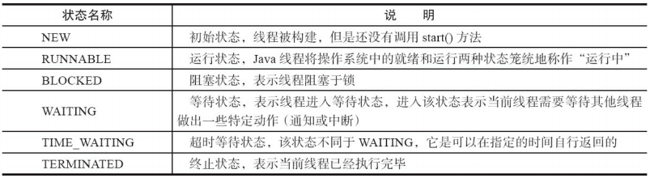

# 线程和进程

## 进程

进程是程序的一次执行过程，是系统运行程序的基本单位，因此进程是动态的。系统运行一个程序即是一个进程从创建，运行到消亡的过程。

在 Java 中，当我们启动 main 函数时其实就是启动了一个 JVM 的进程，而 main 函数所在的线程就是这个进程中的一个线程，也称主线程。

## 线程

线程与进程相似，但线程是一个比进程更小的执行单位。

Java 程序天生就是多线程程序，我们可以通过 JMX 来看一下一个普通的 Java 程序有哪些线程，代码如下。

```java
public class MultiThread {
    public static void main(String[] args) {
        // 获取 Java 线程管理 MXBean
        ThreadMXBean threadMXBean = ManagementFactory.getThreadMXBean();
        // 不需要获取同步的 monitor 和 synchronizer 信息，仅获取线程和线程堆栈信息
        ThreadInfo[] threadInfos = threadMXBean.dumpAllThreads(false, false);
        // 遍历线程信息，仅打印线程 ID 和线程名称信息
        for (ThreadInfo threadInfo : threadInfos) {
          	System.out.println("[" + threadInfo.getThreadId() + "] " + threadInfo.getThreadName());
        }
    }
}
```

上述程序输出如下（输出内容可能不同，不用太纠结下面每个线程的作用，只用知道 main 线程执行 main 方法即可）：

```java
[5] Attach Listener //添加事件
[4] Signal Dispatcher // 分发处理给 JVM 信号的线程
[3] Finalizer //调用对象 finalize 方法的线程
[2] Reference Handler //清除 reference 线程
[1] main //main 主线程,程序入口
```

从上面的输出内容可以看出：**一个 Java 程序的运行是 main 线程和多个其他线程同时运行**。

### 线程与进程的区别

一个进程在其执行的过程中可以产生多个线程。与进程不同的是同类的多个**线程共享进程**的**堆**和**方法区(JDK1.8 之后的元空间)**资源，但每个线程有自己的**程序计数器**、**虚拟机栈**和**本地方法栈**，**线程和进程最大的不同在于基本上各进程是独立的，而各线程则不一定，因为同一进程中的线程极有可能会相互影响。线程执行开销小，但不利于资源的管理和保护；而进程正相反。**

### 线程私有/共享的资源

#### 程序计数器为什么是线程私有的?

程序计数器私有主要是为了**线程切换后能恢复到正确的执行位置**。

- **程序计数器**：
    1. 字节码解释器通过改变程序计数器来依次读取指令，从而实现**代码的流程控制**，如：顺序执行、选择、循环、异常处理；
    2. 在多线程的情况下，**程序计数器用于记录当前线程执行的位置**，从而**当线程被切换回来的时候能够知道该线程上次运行到哪**儿了。

需要注意的是，如果执行的是 native 方法，那么程序计数器记录的是 undefined 地址，只有执行的是 Java 代码时程序计数器记录的才是下一条指令的地址。

#### 虚拟机栈和本地方法栈为什么是线程私有的?

为了**保证线程中的局部变量不被别的线程访问到**，虚拟机栈和本地方法栈是线程私有的。

- **虚拟机栈：** **每个 Java 方法**在执行的同时会创建一个**栈帧**用于存储**局部变量表、操作数栈、常量池引用**等信息。从**方法调用**直至执行完成的过程，就对应着一个栈帧在 Java 虚拟机栈中**入栈和出栈**的过程。
- **本地方法栈：** 和虚拟机栈所发挥的作用非常相似，区别是： **虚拟机栈为虚拟机执行 Java 方法 （也就是字节码）服务，而本地方法栈则为虚拟机使用到的 Native 方法服务。** 在 HotSpot 虚拟机中和 Java 虚拟机栈合二为一。

#### 堆和方法区为什么是线程共享的

**堆和方法区是所有线程共享的资源**，其中**堆**是**进程中**最大的一块**内存**，主要用于存放**新创建的对象** (几乎所有对象都在这里分配内存)，**方法区**主要用于存放**已被加载的类信息、常量、静态变量、即时编译器编译后的代码**等数据。

# 并发（多线程）

## 并发与并行的区别

- **并发：** 同一时间段，多个任务都在(**交替)执行** (单位时间内不一定同时执行)；
- **并行：** 单位时间内，多个任务**同时**执行。

## 为什么要使用多线程

先从总体上来说：

- **从计算机底层来说：** 线程可以比作是轻量级的进程，是程序执行的最小单位,**线程间的切换和调度的成本远远小于进程**。另外，多核 CPU 时代意味着多个线程可以**同时运行**，这减少了线程上下文切换的开销。
- **从当代互联网发展趋势来说：** 现在的系统动不动就要求百万级甚至千万级的并发量，而多线程并发编程正是开发高并发系统的基础，利用好多线程机制可以大大提高系统整体的并发能力以及性能。

再深入到计算机底层来探讨：

- **单核时代**： 在单核时代多线程主要是为了提高单进程利用 CPU 和 IO 系统的效率。 假设只运行了一个 Java 进程的情况，当我们请求 IO 的时候，如果 Java 进程中只有一个线程，此线程被 IO 阻塞则整个进程被阻塞。CPU 和 IO 设备只有一个在运行，那么可以简单地说系统整体效率只有 50%。**当使用多线程的时候，一个线程被 IO 阻塞，其他线程还可以继续使用 CPU**。从而提高了 Java 进程利用系统资源的整体效率。
- **多核时代**: 多核时代多线程主要是为了提高进程利用多核 CPU 的能力。举个例子：假如我们要计算一个复杂的任务，我们只用一个线程的话，不论系统有几个 CPU 核心，都只会有一个 CPU 核心被利用到。而创建多个线程，这些**线程可以被映射到底层多个 CPU 上执行**，在任务中的多个线程没有资源竞争的情况下，任务执行的效率会有显著性的提高，约等于（单核时执行时间/CPU 核心数）。

## 多线程带来的问题

**内存泄漏、死锁、线程不安全**等等。

## 线程的生命周期和状态?

### 状态

Java 线程在运行的**生命周期**中的指定时刻只可能处于下面 6 种不同状态的其中一个**状态**



### 生命周期

线程在生命周期中会在**不同状态之间切换**。Java 线程状态变迁如下图：


> 原图中 wait 到 runnable 状态的转换中，`join`实际上是`Thread`类的方法，但这里写成了`Object`

- 线程创建之后它将处于 **NEW（新建）** 状态，调用 `start()` 方法后开始运行，线程这时候处于 **READY（可运行）** 状态。可运行状态的线程获得了 CPU 时间片（timeslice）后就处于 **RUNNING（运行）** 状态；

> 在操作系统中层面线程有 READY 和 RUNNING 状态，而在 JVM 层面只能看到 RUNNABLE 状态，所以 Java 系统一般将这两个状态统称为 **RUNNABLE（运行中）** 状态 。JVM不区分这两种状态是因为现在的**时分**（time-sharing）**多任务**（multi-task）**操作系统**架构通常都是用所谓的“**时间分片**（time quantum or time slice）”方式进行**抢占式**（preemptive）轮转调度（round-robin式），一个线程一次最多只能在 CPU 上运行比如 10-20ms 的时间，时间片用后就要被切换下来放入调度队列的末尾等待再次调度。线程切换很快，这两种状态没有本质的区别。

- 当线程执行 `wait()`方法之后，线程进入 **WAITING（等待）** 状态。进入等待状态的线程需要依靠其他线程的**通知notify**才能够返回到运行状态；

- **TIME_WAITING(超时等待)** 状态相当于在等待状态的基础上增加了**超时限制**，比如通过 `sleep（long millis）`方法或 `wait（long millis）`方法可以将 Java 线程置于 TIMED WAITING 状态。当超时时间到达后 Java 线程将会返回到 RUNNABLE 状态。
- 当线程调用同步方法时，在**没有获取到锁**的情况下，线程将会进入到 **BLOCKED（阻塞）** 状态。

- 线程在执行 Runnable 的`run()`方法之后将会进入到 **TERMINATED（终止）** 状态。

### sleep() 方法和 wait() 方法区别和共同点

**共同点**：两者都可以**暂停线程的执行**。

**区别**：

- 两者最主要的区别在于：**`sleep()` 方法没有释放锁，而 `wait()` 方法释放了锁** 。
- `wait()` 通常被用于线程间交互/通信；`sleep() `通常被用于暂停执行。
- `wait()` 方法被调用后，**线程不会自动苏醒**(但也可以使用 `wait(long timeout)` **超时后线程会自动苏醒**)，需要**别的线程**调用**同一个对象上的 `notify() `或者 `notifyAll()` 方法**；`sleep() `方法执行完成后，线程会**自动苏醒**。或者。

### 调用 start() 方法时会执行 run() 方法，为什么不能直接调用 run() 方法？

**总结： 调用 `start()` 方法方可启动线程并使线程进入就绪状态，直接执行 `run()` 方法会当成一个main线程下的普通方法执行，不会以多线程的方式执行。**

new 一个 Thread，线程进入了新建NEW状态。调用 `start()`方法，会启动一个线程并使线程进入了就绪RUNNABLE状态，当分配到时间片后就可以开始运行了。 **`start()` 会执行线程的相应准备工作，然后自动执行 `run()` 方法的内容，这是真正的启动一个线程工作。** 但是，**直接执行 `run()` 方法，会把 `run()` 方法当成一个 main 线程下的普通方法去执行，并不会在某个线程中执行它，**所以这并不是多线程工作。

## 上下文切换

线程在执行过程中会有**自己的运行条件和状态**（也称上下文），比如上文所说到过的**程序计数器，栈信息**等。当出现如下情况的时候，**线程会从占用 CPU 状态中退出**。

- 主动让出 CPU，比如调用了 **`sleep()`, `wait()`** 等。
- **时间片用完**，因为操作系统要防止一个线程或者进程长时间占用CPU导致其他线程或者进程饿死。
- 调用了**阻塞类型的系统中断**，比如**请求 IO**，线程被阻塞。
- **被终止或结束运行**

这其中**前三种**都会发生**线程切换**，线程切换意味着需要**保存当前线程的上下文**，留待线程下次占用 CPU 的时候恢复现场。并加载下一个将要占用 CPU 的线程上下文。这就是所谓的 **上下文切换**。

**操作系统中每次上下文切换需要保存信息恢复信息，这将会占用 CPU，内存等系统资源进行处理，也就意味着效率会有一定损耗，如果频繁切换就会造成整体效率低下。**

## 线程死锁

线程死锁描述的是这样一种情况：多个线程同时被阻塞，它们中的一个或者全部都在等待某个资源被释放。由于线程被无限期地阻塞，因此程序不可能正常终止。

如下图所示，线程 A 持有资源 2，线程 B 持有资源 1，他们同时都想申请对方的资源，所以这两个线程就会互相等待而进入死锁状态。


```java
public class DeadLockDemo {
    private static Object resource1 = new Object();//资源 1
    private static Object resource2 = new Object();//资源 2

    public static void main(String[] args) {
        new Thread(() -> {
            synchronized (resource1) {
                System.out.println(Thread.currentThread() + "get resource1");
                try {
                    Thread.sleep(1000);
                } catch (InterruptedException e) {
                    e.printStackTrace();
                }
                System.out.println(Thread.currentThread() + "waiting get resource2");
                synchronized (resource2) {
                    System.out.println(Thread.currentThread() + "get resource2");
                }
            }
        }, "线程 1").start();

        new Thread(() -> {
            synchronized (resource2) {
                System.out.println(Thread.currentThread() + "get resource2");
                try {
                    Thread.sleep(1000);
                } catch (InterruptedException e) {
                    e.printStackTrace();
                }
                System.out.println(Thread.currentThread() + "waiting get resource1");
                synchronized (resource1) {
                    System.out.println(Thread.currentThread() + "get resource1");
                }
            }
        }, "线程 2").start();
    }
}
```

Output

```java
Thread[线程 1,5,main]get resource1
Thread[线程 2,5,main]get resource2
Thread[线程 1,5,main]waiting get resource2
Thread[线程 2,5,main]waiting get resource1
```

线程 A 通过 `synchronized (resource1)` 获得 `resource1` 的monitor锁，然后通过`Thread.sleep(1000);`让线程 A 休眠 1s 为的是让线程 B 得到执行然后获取到 resource2 的monitor锁。线程 A 和线程 B 休眠结束了都开始企图请求获取对方的资源，然后这两个线程就会陷入互相等待的状态，这也就产生了死锁。上面的例子符合产生死锁的四个必要条件:

1. **互斥条件**：该资源任意一个时刻只由一个线程占用。
2. **请求与保持条件**：一个进程因请求资源而阻塞时，对已获得的资源保持不放。
3. **不剥夺条件**: 线程已获得的资源在未使用完之前不能被其他线程强行剥夺，只有自己使用完毕后才释放资源。
4. **循环等待条件**: 若干进程之间形成一种头尾相接的循环等待资源关系。

## 避免线程死锁

**如何预防死锁？** 破坏死锁的产生的必要条件即可：

1. **破坏请求与保持条件** ：一次性申请所有的资源。
2. **破坏不剥夺条件** ：占用部分资源的线程进一步申请其他资源时，如果申请不到，可以主动释放它占有的资源。
3. **破坏循环等待条件** ：靠按序申请资源来预防。按某一顺序申请资源，释放资源则反序释放。破坏循环等待条件。

避免死锁就是在资源分配时，借助于算法（比如银行家算法）对资源分配进行计算评估，使其进入安全状态。

**安全状态**指的是系统能够按照某种**推进顺序**（P1、P2、P3.....Pn）来为每个**进程**分配所需资源，直到**满足每个进程对资源的最大需求**，使每个进程都可顺利完成。称<P1、P2、P3.....Pn>序列为安全序列。

### 上面死锁的一种解决方式：按顺序获取资源

我线程 2 的代码修改成下面这样(改变请求资源的顺序)就不会产生死锁了。

```java
        new Thread(() -> {
            synchronized (resource1) {//先请求r1
                System.out.println(Thread.currentThread() + "get resource1");
                try {
                    Thread.sleep(1000);
                } catch (InterruptedException e) {
                    e.printStackTrace();
                }
                System.out.println(Thread.currentThread() + "waiting get resource2");
                synchronized (resource2) {//再请求r2
                    System.out.println(Thread.currentThread() + "get resource2");
                }
            }
        }, "线程 2").start();
```

Output

```java
Thread[线程 1,5,main]get resource1
Thread[线程 1,5,main]waiting get resource2
Thread[线程 1,5,main]get resource2
Thread[线程 2,5,main]get resource1
Thread[线程 2,5,main]waiting get resource2
Thread[线程 2,5,main]get resource2

Process finished with exit code 0
```

我们分析一下上面的代码为什么避免了死锁的发生?

线程 1 首先获得到 resource1 的监视器锁,这时候线程 2 就获取不到了。然后线程 1 再去获取 resource2 的监视器锁，可以获取到。然后线程 1 释放了对 resource1、resource2 的监视器锁的占用，线程 2 获取到就可以执行了。这样就破坏了**破坏循环等待条件**，因此避免了死锁。

# synchronized 关键字


**`synchronized` 关键字解决的是多个线程之间<u>访问资源</u>的同步性，`synchronized`关键字可以保证被它修饰的<u>方法或者代码块</u>在任意时刻只能有一个线程执行。**

另外，在 Java 早期版本中，`synchronized` 属于 **重量级锁**，效率低下:

因为**监视器锁monitor**是依赖于底层的**操作系统的 `Mutex Lock`** 来实现的，Java 的线程是映射到操作系统的原生线程之上的。如果要**挂起或者唤醒一个线程**，都需要**操作系统帮忙完成**，需要从**用户态**转换到**内核态**，这个状态之间的转换需要相对比较长的时间，时间成本相对较高。

庆幸的是在 Java 6 之后 Java 官方对从 JVM 层面对 `synchronized` 较大优化，如**自旋锁、适应性自旋锁、锁消除、锁粗化、偏向锁、轻量级锁**等技术来减少锁操作的开销。

## synchronized 关键字的使用

### **1.修饰实例方法:** 

作用于当前**对象实例**加锁，进入同步代码前要获得 **当前对象实例的锁**

```java
synchronized void method() {
    //业务代码
}
```

### **2.修饰静态方法:** 

也就是给**当前类**加锁，会**作用于类的所有<u>对象实例</u>** ，进入同步代码前要获得 **当前 class 的锁**。因为静态成员不属于任何一个实例对象，是类成员（ *static 表明这是该类的一个静态资源，不管 new 了多少个对象，只有一份*）。所以，如果一个线程 A 调用一个**<u>实例对象</u>的非静态 `synchronized` 方法**，而线程 B 需要调用这个**<u>实例对象所属类</u>的静态 `synchronized` 方法**，是允许的，不会发生互斥现象，**因为访问静态 `synchronized` 方法占用的锁是当前<u>类</u>的锁，而访问<u>非</u>静态 `synchronized` 方法占用的锁是当前<u>实例对象锁</u>**。

```java
synchronized static void method() {
    //业务代码
}
```

### **3.修饰代码块** ：

指定加锁<u>对象</u>，对给定对象/类加锁。`synchronized(this|object)` 表示进入同步代码库前要获得**给定对象的锁**。`synchronized(类.class)` 表示进入同步代码前要获得 **当前 class 的锁**

```java
synchronized(this) {
    //业务代码
}
```

**总结：**

- `synchronized` 关键字加到 `static` 静态方法和 `synchronized(class)` 代码块上都是是给 <u>**Class 类**</u>上锁，而不是给<u>**实例对象**</u>上锁。
- `synchronized` 关键字加到**实例方法**上是给**对象实例**上锁。
- 尽量不要使用 `synchronized(String a)` 因为 JVM 中，字符串**常量池**具有**缓存**功能！

### 构造方法不可以使用 synchronized 关键字修饰

构造方法Constructor本身就属于**线程安全**的，不存在同步的构造方法一说。

##  synchronized 关键字的底层原理

synchronized 关键字底层原理属于 **JVM** 层面。

**两者的本质都是对对象监视器 monitor (即锁)的获取。**

- `synchronized` **同步语句块**的实现使用的是 **`monitorenter` 和 `monitorexit`** 指令：
    - `monitorenter` 指令指向同步代码块的**开始位置**，将锁的计数器从0加1；
    - `monitorexit` 指令则指明同步代码块的**结束位置**，将锁的计数器从n(不一定是1？)置回1。

- `synchronized` **修饰的方法**并没有 `monitorenter` 指令和 `monitorexit` 指令，取得代之的确实是 **`ACC_SYNCHRONIZED`** 标识，该标识**指明了该方法是一个同步方法**。

### synchronized 同步语句块的情况

```java
public class SynchronizedDemo {
    public void method() {
        synchronized (this) {
            System.out.println("synchronized 代码块");
        }
    }
}
```

通过 JDK 自带的 `javap` 命令查看 `SynchronizedDemo` 类的相关字节码信息：首先切换到类的对应目录执行 `javac SynchronizedDemo.java` 命令生成编译后的 .class 文件，然后执行`javap -c -s -v -l SynchronizedDemo.class`。


从上面我们可以看出：

**`synchronized` 同步语句块的实现使用的是 `monitorenter` 和 `monitorexit` 指令，其中 `monitorenter` 指令指向同步代码块的开始位置，`monitorexit` 指令则指明同步代码块的结束位置。**

当执行 `monitorenter` 指令时，线程试图获取锁也就是获取 **对象监视器 `monitor`** 的持有权。

> 在 Java 虚拟机(HotSpot)中，Monitor 是基于 C++实现的，由[ObjectMonitor](https://github.com/openjdk-mirror/jdk7u-hotspot/blob/50bdefc3afe944ca74c3093e7448d6b889cd20d1/src/share/vm/runtime/objectMonitor.cpp)实现的。每个对象中都内置了一个 `ObjectMonitor`对象。
>
> 另外，`wait/notify`等方法也依赖于`monitor`对象，这就是为什么只有在**同步的块或者方法中才能调用`wait/notify`**等方法，否则会抛出`java.lang.IllegalMonitorStateException`的异常的原因。

在执行`monitorenter`时，会**尝试获取对象的锁**，如果**锁的计数器为 0** 则表示锁可以被获取，获取后**将锁计数器设为 1 也就是加 1。**

在执行 `monitorexit` 指令后，**将锁计数器设为 0**，表明**锁被释放**。如果获取对象锁失败，那当前线程就要阻塞等待，直到锁被另外一个线程释放为止。

### synchronized 修饰方法的的情况

```java
public class SynchronizedDemo2 {
    public synchronized void method() {
        System.out.println("synchronized 方法");
    }
}
```


`synchronized` 修饰的方法并没有 `monitorenter` 指令和 `monitorexit` 指令，取得代之的确实是 `ACC_SYNCHRONIZED` 标识，该标识指明了该方法是一个同步方法。JVM 通过该 `ACC_SYNCHRONIZED` 访问标志来辨别一个方法是否声明为同步方法，从而执行相应的同步调用。

**不过两者的本质都是对对象监视器 monitor 的获取。**

##  JDK1.6 之后的 synchronized 关键字底层的优化

JDK1.6 对锁的实现引入了大量的优化，如**偏向锁、轻量级锁、自旋锁、适应性自旋锁、锁消除、锁粗化**等技术来减少锁操作的开销。

锁主要存在**四种状态**，依次是：**无锁、偏向锁、轻量级锁、重量级锁**，他们会随着竞争的激烈而逐渐升级。注意**锁只可以升级不可降级**，这种策略是为了提高获得锁和释放锁的效率。

关于这几种优化的详细信息可以查看下面这篇文章：[Java6 及以上版本对 synchronized 的优化](https://www.cnblogs.com/wuqinglong/p/9945618.html)


## sychronized例子：双重校验锁的单例模式

下面我以一个常见的面试题为例讲解一下 `synchronized` 关键字的具体使用。

面试中面试官经常会说：“单例模式了解吗？来给我手写一下！给我解释一下**双重检验锁方式**实现单例模式的原理呗！”

**双重校验锁实现对象单例（线程安全）**

**双重检验锁** 第二次判断目的在于有可能其他线程获取过锁，已经初始化该变量。

```java
public class Singleton {

    private volatile static Singleton uniqueInstance;

    private Singleton() {
    }

    public static Singleton getUniqueInstance() {
       //先判断对象是否已经实例过，没有实例化过才进入加锁代码
        if (uniqueInstance == null) {//双重检验锁第一次判断
            //类对象加锁
            synchronized (Singleton.class) {
                if (uniqueInstance == null) {//双重检验锁第二次判断
                    uniqueInstance = new Singleton();//分配内存空间，初始化，指向内存地址
                }
            }
        }
        return uniqueInstance;
    }
}
```

### 为什么是双重校验锁实现单例模式呢？

第一次校验：也就是第一个if（singleton==null），这个是为了代码提高代码执行效率，由于**单例模式只要一次创建实例即可**，所以当创建了一个实例之后，再次**调用getInstance方法就不必要进入同步代码块，不用竞争锁**，**直接返回前面创建的实例即可**。

第二次校验：也就是第二个if（singleton==null），这个校验是**防止二次创建实例**，假如有一种情况，当singleton还未被创建时，线程t1调用getInstance方法，由于第一次判断singleton==null，此时线程t1准备继续执行，但是由于资源被线程t2抢占了，此时t2页调用getInstance方法，同样的，由于singleton并没有实例化，t2同样可以通过第一个if，然后继续往下执行，同步代码块，第二个if也通过，然后t2线程创建了一个实例singleton。此时t2线程完成任务，资源又回到t1线程，t1此时也进入同步代码块，如果没有这个第二个if，那么，t1就也会创建一个singleton实例，那么，就会出现创建多个实例的情况，但是加上第二个if，就可以完全避免这个多线程导致多次创建实例的问题。

### 注意 `uniqueInstance` 采用 **`volatile`** 关键字修饰

防止**指令重排**导致一个**线程获得还没有初始化的实例**

 `uniqueInstance = new Singleton();` 这段代码其实是分为三步执行：

1. 为 `uniqueInstance` 分配内存空间
2. 初始化 `uniqueInstance`
3. 将 `uniqueInstance` 指向分配的内存地址

但是由于 JVM 具有指令重排的特性，执行顺序有可能变成 1->3->2。指令重排在单线程环境下不会出现问题，但是在多线程环境下**指令重排**会导致一个**线程获得还没有初始化的实例**。例如，线程 T1 执行了 1 和 3，此时 T2 调用 `getUniqueInstance`() 后发现 `uniqueInstance` 不为空，因此返回 `uniqueInstance`，但此时 `uniqueInstance` 还未被初始化。

使用 **`volatile` 可以禁止 JVM 的指令重排**，**Java线程内存模型确保所有线程看到这个变量的值是一致的**保证在多线程环境下也能正常运行。

# synchronized 和 ReentrantLock 的区别

## 两者都是可重入锁

**“可重入锁”** 指的是自己可以再次获取自己的内部锁。比如一个线程获得了某个对象的锁，此时这个对象锁还没有释放，当其再次想要获取这个对象的锁的时候还是可以获取的，如果不可锁重入的话，就会造成死锁。同一个线程每次获取锁，锁的计数器都自增 1，所以要等到锁的计数器下降为 0 时才能释放锁。

## synchronized 依赖于 JVM 而 ReentrantLock 依赖于 JDK

`synchronized` 是依赖于 JVM 实现的，前面我们也讲到了 虚拟机团队在 JDK1.6 为 `synchronized` 关键字进行了很多优化，但是这些优化都是在虚拟机层面实现的，并没有直接暴露给我们。

`ReentrantLock` 是 JDK 层面实现的（也就是 API 层面，需要 lock() 和 unlock() 方法配合 try/finally 语句块来完成），所以我们可以通过查看它的源代码，来看它是如何实现的。

## ReentrantLock 比 synchronized 增加了一些高级功能

相比`synchronized`，`ReentrantLock`增加了一些高级功能。主要来说主要有三点：

- **等待可中断** : `ReentrantLock`提供了一种能够**中断等待锁的线程**的机制，通过 `lock.lockInterruptibly()` 来实现这个机制。也就是说正在等待的线程可以选择放弃等待，改为处理其他事情。
- **可实现公平锁** : `ReentrantLock`可以指定是**公平锁还是非公平锁**。而`synchronized`只能是**非公平锁**。所谓的公平锁就是先等待的线程先获得锁。`ReentrantLock`默认情况是非公平的，可以通过 `ReentrantLock`类的`ReentrantLock(boolean fair)`构造方法来制定是否是公平的。
- **可实现选择性通知（锁可以绑定多个条件）**: 
    - `synchronized`关键字与`wait()`和`notify()`/`notifyAll()`方法相结合可以实现**等待/通知机制**。
    - `ReentrantLock`类当然也可以实现，但是需要借助于`Condition`接口与`newCondition()`方法。

> `Condition`是 JDK1.5 之后才有的，它具有很好的灵活性，比如可以实现多路通知功能也就是在一个`Lock`对象中可以创建多个`Condition`实例（即对象监视器），**线程对象可以注册在指定的`Condition`中，从而可以有选择性的进行线程通知，在调度线程上更加灵活。 在使用`notify()/notifyAll()`方法进行通知时，被通知的线程是由 JVM 选择的，用`ReentrantLock`类结合`Condition`实例可以实现“选择性通知”** ，这个功能非常重要，而且是 Condition 接口默认提供的。而`synchronized`关键字就相当于整个 Lock 对象中只有一个`Condition`实例，所有的线程都注册在它一个身上。如果执行`notifyAll()`方法的话就会通知所有处于等待状态的线程这样会造成很大的效率问题，而`Condition`实例的`signalAll()`方法 只会唤醒注册在该`Condition`实例中的所有等待线程。

