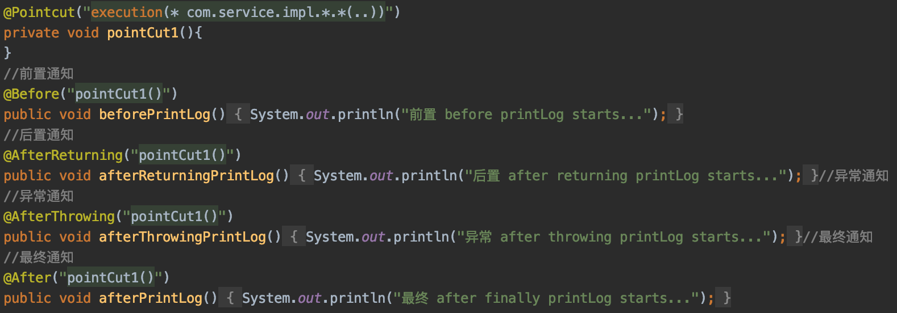
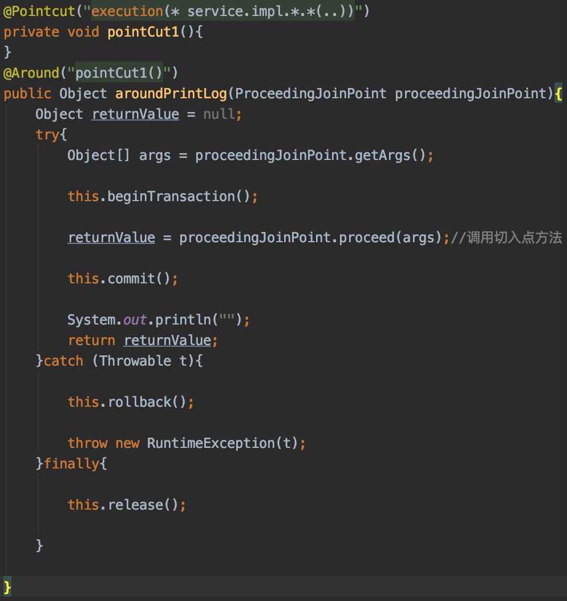
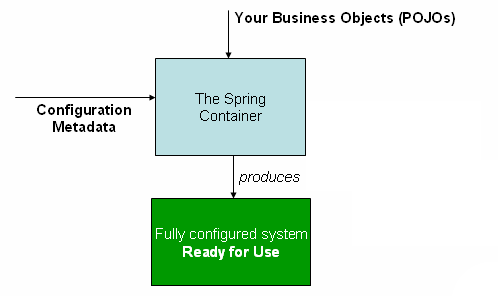
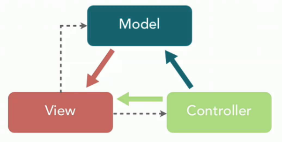
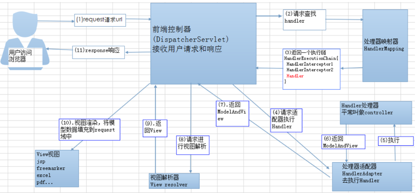
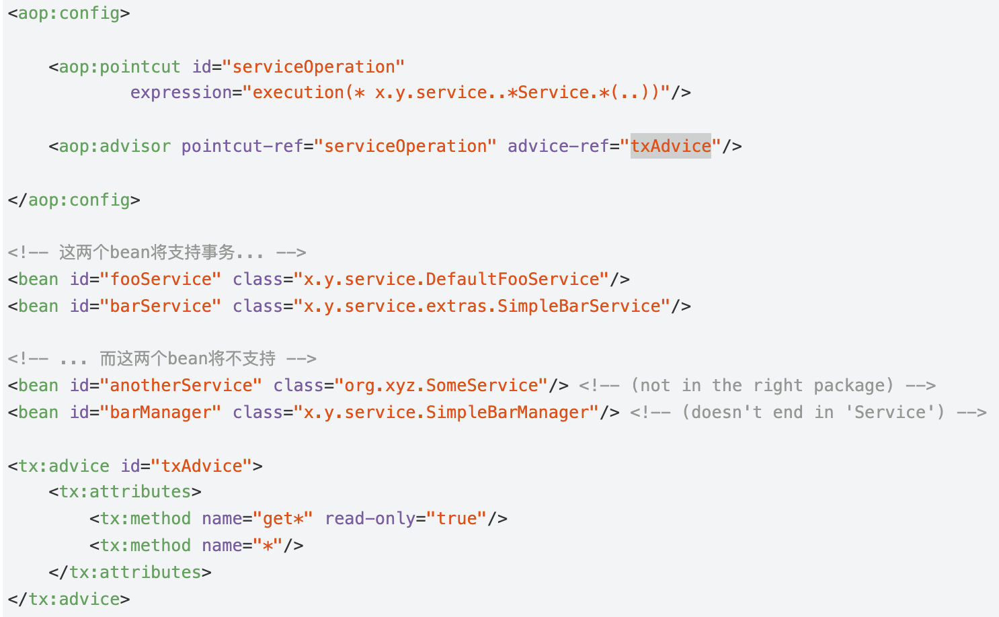

# Spring IOC & AOP

## 谈谈对 IoC 的了解

**IoC（Inverse of Control:控制反转）** 是一种设计思想，而不是一个具体的技术实现。

IoC 的思想就是将原本在程序中**手动创建对象的控制权**，交由 **Spring** 框架来**管理**, 使**对象之间**的**低耦合, 更方便管理资源**。

**为什么叫控制反转？**

- **控制** ：指的是**对象创建**（**实例化、管理**）的权力
- **反转** ：控制权交给**外部环境**（**Spring** 框架、**IoC 容器**）


将**对象之间的相互依赖关系**交给 **IoC** 容器来管理，并由 **IoC** 容器完成**对象的注入**。 IoC 容器就像是一个工厂一样，当我们需要创建一个对象的时候，只需要配置好**配置文件/注解**即可，完全不用考虑对象是如何被创建出来的。

在 Spring 中， IoC 容器是 Spring 用来实现 IoC 的载体， **IoC 容器实际上就是个 Map（key，value），Map 中存放的是各种对象。**

Spring 时代我们一般通过 XML 文件来配置 Bean，后来开发人员觉得 XML 文件来配置不太好，于是 SpringBoot 注解配置就慢慢开始流行起来。

> ioc例子: 上面的内容只是总结,这篇文章是举例讲解,讲得非常好!https://www.zhihu.com/question/23277575/answer/169698662

相关阅读：

- [IoC 源码阅读](https://javadoop.com/post/spring-ioc)

### 依赖注入

解决Spring中Bean之间的依赖的实现方式，在Spring的概念中就被称之为依赖注入（Dependency Injection，DI）。普遍认为的Spring依赖注入的实现方式有三种：构造方法注入、setter方法注入、注解注入。但，就我而言，我认为应该划分为两种形式——基于XML注入和基于注解注入，然后再细分为下面的形式：


## 谈谈对 AOP 的了解

AOP(Aspect-Oriented Programming:面向切面编程)能够将那些与**业务无关**，却为**业务模块所共同调用的逻辑或责任**（例如**事务管理、日志管理、性能检测**等）封装起来，便于减少系统的重复代码，**降低模块间的耦合度**，并有利于未来的**可拓展性**和**可维护性**。

> 下面我们先看一个 OOP 的例子。
>
> 例如：现有三个类，`Horse`、`Pig`、`Dog`，这三个类中都有 eat 和 run 两个方法。
>
> 通过 OOP 思想中的继承，我们可以提取出一个 Animal 的父类，然后将 eat 和 run 方法放入父类中，`Horse`、`Pig`、`Dog`通过继承`Animal`类即可自动获得 `eat()` 和 `run()` 方法。这样将会少些很多重复的代码。
>
> OOP 编程思想可以解决大部分的代码重复问题。但是有一些问题是处理不了的。比如在父类 Animal 中的多个方法的相同位置出现了重复的代码，OOP 就解决不了。
>
> ```java
> public class Animal {
> 
>     /** 身高 */
>     private String height;
> 
>     /** 体重 */
>     private double weight;
> 
>     public void eat() {
>         // 性能监控代码
>         long start = System.currentTimeMillis();
> 
>         // 业务逻辑代码
>         System.out.println("I can eat...");
> 
>         // 性能监控代码
>         System.out.println("执行时长：" + (System.currentTimeMillis() - start)/1000f + "s");
>     }
> 
>     public void run() {
>         // 性能监控代码
>         long start = System.currentTimeMillis();
> 
>         // 业务逻辑代码
>         System.out.println("I can run...");
> 
>         // 性能监控代码
>         System.out.println("执行时长：" + (System.currentTimeMillis() - start)/1000f + "s");
>     }
> }
> 
> ```
>
> 性能监控代码是重复的代码，一般统称为 横切逻辑代码。

> 例子：
>
> 使用@pointcut注解切入service的impl实现方法，为每个业务方法提供服务..
>
> 
>
> 或使用环绕通知
>
> 

Spring AOP 就是基于**动态代理**的，如果要代理的对象，实现了某个接口，那么 Spring AOP 会使用 **JDK Proxy**，去创建代理对象，而对于没有实现接口的对象，就无法使用 JDK Proxy 去进行代理了，这时候 Spring AOP 会使用 **Cglib** 生成一个被代理对象的子类来作为代理，如下图所示：


### 应用场景

1. Authentication **权限**
2. Caching 缓存
3. Context passing 内容传递
4. Error handling 错误处理
5. Lazy loading 懒加载
6. Debugging 调试
7. logging, tracing, profiling and monitoring 记录跟踪 优化 校准
8. Performance optimization 性能优化
9. Persistence 持久化
10. Resource pooling 资源池
11. Synchronization 同步
12. Transactions **事务**

### aop相关注解

`@Aspect`：声明被注解的类是一个切面 Bean。

`@Before`：前置通知，指在某个连接点之前执行的通知。

`@After`：后置通知，指某个连接点退出时执行的通知（不论正常返回还是异常退出）。

`@AfterReturning`：返回后通知，指某连接点正常完成之后执行的通知，返回值使用returning属性接收。

`@AfterThrowing`：异常通知，指方法抛出异常导致退出时执行的通知，和`@AfterReturning`只会有一个执行，异常使用throwing属性接收。

### aop 相关概念

1. 切面（aspect）:类是对物体特征的抽象，切面就是对横切关注点的抽象
2. 横切关注点： **对哪些方法进行拦截**，拦截后怎么处理，这些关注点称之为横切关注点。
3. 连接点（joinPoint）:被**拦截到的点**，因为 Spring 只支持**方法类型的连接点**，所以在 Spring中连接点指的就是被拦截到的方法，实际上连接点还可以是字段或者构造器。
4. 切入点（pointcut）:对连接点进行拦截的定义
5. **通知**（advice）:所谓通知指的就是指拦截到连接点之后要**执行的代码**， 通知分为**前置、后置、异常、最终、环绕**通知五类。
6. 目标对象： 代理的目标对象
7. 织入（weave）:将切面应用到目标对象并导致代理对象创建的过程
8. 引入（introduction）:在不修改代码的前提下，引入可以在运行期为类动态地添加一些方法或字段

### Spring AOP 和 AspectJ AOP 有什么区别？

**静态代理的代表为AspectJ**；而**动态代理则以Spring AOP为代表**。**Spring AOP 属于运行时增强，而 AspectJ 是编译时增强。** Spring AOP 基于**代理**(Proxying)，而 AspectJ 基于**字节码操作**(Bytecode Manipulation)。

Spring AOP 已经集成了 AspectJ ，AspectJ 应该算的上是 Java 生态系统中最完整的 AOP 框架了。AspectJ 相比于 Spring AOP 功能更加强大，但是 Spring AOP 相对来说更简单，

如果我们的切面比较少，那么两者性能差异不大。但是，当切面太多的话，最好选择 AspectJ ，它比 Spring AOP 快很多。

# Spring bean

简单来说，**bean 代指的就是那些被 IoC 容器所管理的对象**。

我们需要告诉 IoC 容器帮助我们管理哪些对象，这个是通过配置元数据来定义的。配置元数据可以是 XML 文件、注解或者 Java 配置类。

```java
<!-- Constructor-arg with 'value' attribute -->
<bean id="..." class="...">
   <constructor-arg value="..."/>
</bean>
```

下图简单地展示了 IoC 容器如何使用配置元数据来管理对象。



`org.springframework.beans`和 `org.springframework.context` 这两个包是 IoC 实现的基础，如果想要研究 IoC 相关的源码的话，可以去看看

## bean 的作用域有哪些?

Spring 中 Bean 的作用域通常有下面几种：

- **singleton** : 唯一 bean 实例，Spring 中的 bean 默认都是**单例**的，对单例设计模式的应用。
- **prototype** : 每次**请求**都会创建一个**新的 bean 实例**。
- **request** : 每一次 HTTP 请求都会产生一个新的 bean，该 bean 仅在当前 HTTP request 内有效。
- **session** : 每一次 HTTP 请求都会产生一个新的 bean，该 bean 仅在当前 HTTP session 内有效。
- **global-session** ： 全局 session 作用域，仅仅在基于 portlet 的 web 应用中才有意义，Spring5 已经没有了。Portlet 是能够生成语义代码(例如：HTML)片段的小型 Java Web 插件。它们基于 portlet 容器，可以像 servlet 一样处理 HTTP 请求。但是，与 servlet 不同，每个 portlet 都有不同的会话。

### **如何配置 bean 的作用域呢？**

xml 方式：

```java
<bean id="..." class="..." scope="singleton"></bean>
```

注解方式：

```java
@Bean
@Scope(value = ConfigurableBeanFactory.SCOPE_PROTOTYPE)
public Person personPrototype() {
    return new Person();
}
```

### 单例 bean 的线程安全问题了解吗？

单例 bean 存在线程问题，主要是因为当多个线程操作同一个对象的时候是存在资源竞争的。

线程不安全构成的三要素：

1，多线程环境

2，访问同一个资源

3，**资源具有状态性** 

那么Spring的bean模式是单例，而且后端的程序，天然就处于一个多线程的工作环境。1、2符合。
关键看第3点，我们的bean基本是无状态的，无状态的 Bean 不能保存数据，因此是线程安全的。所谓无状态就是**没有存储数据**，**即没有通过数据的状态来作为下一步操作的判断依据**。

所以存储数据是关键。存储数据发生在dao层调用jdbc建立与数据库的connection连接。比如某个service需要**两个不同的dao**操作，就需要**两个dao分别建立一个connection**；所以可以用**threadLocal**来在**同一个线程中存储connection的副本**来实现，使得两个dao层调用的是**同一个connection**。

常见的有两种解决办法：

1. **在 bean 中尽量避免定义可变的成员变量。**
2. **在类中定义一个 `ThreadLocal` 成员变量，将需要的可变成员变量保存在 `ThreadLocal` 中（推荐的一种方式）。**

不过，**大部分 bean 实际都是无状态（没有实例变量）的（比如 Dao、Service），这种情况下， bean 是线程安全的。**

## @Component 和 @Bean 的区别是什么？

1. **`@Component`** 注解作用于**类**，而**`@Bean`**注解作用于**方法**。
2. `@Component`通常是通过**类路径扫描**来**自动侦测**以及**自动装配到 Spring 容器**中（我们可以使用 `@ComponentScan` 注解定义要扫描的路径从中找出标识了需要装配的类自动装配到 Spring 的 bean 容器中）。`@Bean` 注解通常是在标有**该注解的方法**中**定义产生这个 bean**,`@Bean`告诉了 Spring 这是某个类的实例，当我需要用它的时候还给我。
3. `@Bean` 注解比 `@Component` 注解的自定义性更强，而且很多地方我们只能通过 `@Bean` 注解来注册 bean。比如当我们引用第三方库中的类需要装配到 `Spring`容器时，则只能通过 `@Bean`来实现。

`@Bean`注解使用示例：

```java
@Configuration
public class AppConfig {
    @Bean
    public TransferService transferService() {
        return new TransferServiceImpl();
    }

}
```

上面的代码相当于下面的 xml 配置

```java
<beans>
    <bean id="transferService" class="com.acme.TransferServiceImpl"/>
</beans>
```

下面这个例子是通过 `@Component` 无法实现的。

```java
@Bean
public OneService getService(status) {
    case (status)  {
        when 1:
                return new serviceImpl1();
        when 2:
                return new serviceImpl2();
        when 3:
                return new serviceImpl3();
    }
}
```

## 将一个类声明为 bean 的注解有哪些?

我们一般使用 **`@Autowired`** **注解自动装配 bean**，要想把**类标识成可用于 `@Autowired` 注解自动装配的 bean 的<u>类</u>**,采用以下注解可实现：

- `@Component` ：通用的注解，可标注任意类为 `Spring` 组件。如果一个 Bean 不知道属于哪个层，可以使用`@Component` 注解标注。
- `@Repository` : 对应持久层即 Dao 层，主要用于数据库相关操作。
- `@Service` : 对应服务层，主要涉及一些复杂的逻辑，需要用到 Dao 层。
- `@Controller` : 对应 Spring MVC 控制层，主要用户接受用户请求并调用 Service 层返回数据给前端页面。

## 找视频看看????bean 的生命周期?

> 下面的内容整理自：https://yemengying.com/2016/07/14/spring-bean-life-cycle/ ，除了这篇文章，再推荐一篇很不错的文章 ：https://www.cnblogs.com/zrtqsk/p/3735273.html 。

- Bean 容器找到配置文件中 Spring Bean 的定义。
- Bean 容器利用 Java Reflection API 创建一个 Bean 的实例。
- 如果涉及到一些属性值 利用 `set()`方法设置一些属性值。
- 如果 Bean 实现了 `BeanNameAware` 接口，调用 `setBeanName()`方法，传入 Bean 的名字。
- 如果 Bean 实现了 `BeanClassLoaderAware` 接口，调用 `setBeanClassLoader()`方法，传入 `ClassLoader`对象的实例。
- 如果 Bean 实现了 `BeanFactoryAware` 接口，调用 `setBeanClassLoader()`方法，传入 `ClassLoade` r 对象的实例。
- 与上面的类似，如果实现了其他 `*.Aware`接口，就调用相应的方法。
- 如果有和加载这个 Bean 的 Spring 容器相关的 `BeanPostProcessor` 对象，执行`postProcessBeforeInitialization()` 方法
- 如果 Bean 实现了`InitializingBean`接口，执行`afterPropertiesSet()`方法。
- 如果 Bean 在配置文件中的定义包含 init-method 属性，执行指定的方法。
- 如果有和加载这个 Bean 的 Spring 容器相关的 `BeanPostProcessor` 对象，执行`postProcessAfterInitialization()` 方法
- 当要销毁 Bean 的时候，如果 Bean 实现了 `DisposableBean` 接口，执行 `destroy()` 方法。
- 当要销毁 Bean 的时候，如果 Bean 在配置文件中的定义包含 destroy-method 属性，执行指定的方法。

图示：

[](https://camo.githubusercontent.com/70ba44111686c9f9a4fcac62d8ae01fd23e3e707d91fbce4af1205856dcd458f/68747470733a2f2f696d616765732e7869616f7a6875616e6c616e2e636f6d2f70686f746f2f323031392f32346263326261643363653238313434643630643965306132656466366337662e6a7067)

与之比较类似的中文版本:

[](https://camo.githubusercontent.com/9efd4a1a6c11ebb15c61a022e93bb20934a85a72d95194cf59402421c09191a9/68747470733a2f2f696d616765732e7869616f7a6875616e6c616e2e636f6d2f70686f746f2f323031392f62356432363435363536353761353339356332373831303831613734383365312e6a7067)

# Spring MVC

## 说说对 Spring MVC 了解?

MVC 是模型(Model)、视图(View)、控制器(Controller)的简写，其核心思想是通过将**业务逻辑、数据、显示**分离来组织代码。



想要真正理解 Spring MVC，我们先来看看 Model 1 和 Model 2 这两个没有 Spring MVC 的时代。

**Model 1 时代**

在 Model1 模式下，整个 Web 应用几乎全部用 JSP 页面组成，只用少量的 JavaBean 来处理数据库连接、访问等操作。

这个模式下 JSP 即是控制层（Controller）又是表现层（View）。显而易见，这种模式存在很多问题。比如控制逻辑和表现逻辑混杂在一起，导致代码重用率极低；再比如前端和后端相互依赖，难以进行测试维护并且开发效率极低。

[](https://camo.githubusercontent.com/c6d39ea1c5832c69d891f506460d1dea6fa13999c46b8953c1ffd094e1082a42/68747470733a2f2f67756964652d626c6f672d696d616765732e6f73732d636e2d7368656e7a68656e2e616c6979756e63732e636f6d2f6a6176612d67756964652d626c6f672f6d76632d6d6f6465312e706e67)

**Model 2 时代**

学过 Servlet 并做过相关 Demo 的朋友应该了解“Java Bean(Model)+ JSP（View）+Servlet（Controller） ”这种开发模式，这就是早期的 JavaWeb MVC 开发模式。

- Model:系统涉及的数据，也就是 dao 和 bean。
- View：展示模型中的数据，只是用来展示。
- Controller：处理用户请求都发送给 ，返回数据给 JSP 并展示给用户。

[](https://camo.githubusercontent.com/b36a90d56dae552146126cf76f8de218f5d545d9df9d65a7eb84283157f46475/68747470733a2f2f67756964652d626c6f672d696d616765732e6f73732d636e2d7368656e7a68656e2e616c6979756e63732e636f6d2f6a6176612d67756964652d626c6f672f6d76632d6d6f64656c322e706e67)

Model2 模式下还存在很多问题，Model2 的抽象和封装程度还远远不够，使用 Model2 进行开发时不可避免地会重复造轮子，这就大大降低了程序的可维护性和复用性。

于是，很多 JavaWeb 开发相关的 MVC 框架应运而生比如 Struts2，但是 Struts2 比较笨重。

**Spring MVC 时代**

随着 Spring 轻量级开发框架的流行，Spring 生态圈出现了 Spring MVC 框架， Spring MVC 是当前最优秀的 MVC 框架。相比于 Struts2 ， Spring MVC 使用更加简单和方便，开发效率更高，并且 Spring MVC 运行速度更快。

MVC 是一种设计模式,Spring MVC 是一款很优秀的 MVC 框架。Spring MVC 可以帮助我们进行更简洁的 Web 层的开发，并且它天生与 Spring 框架集成。Spring MVC 下我们一般把后端项目分为 Service 层（处理业务）、Dao 层（数据库操作）、Entity 层（实体类）、Controller 层(控制层，返回数据给前台页面)。

## SpringMVC 工作原理了解吗?

**Spring MVC 原理如下图所示：**



**流程说明（重要)：**

1. 客户端（浏览器）发送请求，直接请求到 `DispatcherServlet`。
2. `DispatcherServlet` 根据请求信息调用 `HandlerMapping`，解析请求对应的 `Handler`。
3. 解析到对应的 `Handler`（也就是我们平常说的 `Controller` 控制器）后，开始由 `HandlerAdapter` 适配器处理。
4. `HandlerAdapter` 会根据 `Handler`来调用真正的处理器开处理请求，并处理相应的业务逻辑。
5. 处理器处理完业务后，会返回一个 `ModelAndView` 对象，`Model` 是返回的数据对象，`View` 是个逻辑上的 `View`。
6. `ViewResolver` 会根据逻辑 `View` 查找实际的 `View`(.jsp)。
7. `DispaterServlet` 把返回的 `Model` 传给 `View`（视图渲染）。
8. 把 `View` 返回给请求者（浏览器）

# Spring 框架中用到了哪些设计模式？

关于下面一些设计模式的详细介绍，可以看笔主前段时间的原创文章[《面试官:“谈谈 Spring 中都用到了那些设计模式?”。》](https://mp.weixin.qq.com/s?__biz=Mzg2OTA0Njk0OA==&mid=2247485303&idx=1&sn=9e4626a1e3f001f9b0d84a6fa0cff04a&chksm=cea248bcf9d5c1aaf48b67cc52bac74eb29d6037848d6cf213b0e5466f2d1fda970db700ba41&token=255050878&lang=zh_CN#rd) 。

- **工厂设计模式** : Spring 使用工厂模式通过 `BeanFactory`、`ApplicationContext` 创建 bean 对象。
- **代理设计模式** : Spring AOP 功能的实现。
- **单例设计模式** : Spring 中的 Bean 默认都是单例的。
- **?模板方法模式** : Spring 中 `jdbcTemplate`、`hibernateTemplate` 等以 Template 结尾的对数据库操作的类，它们就使用到了模板模式。
- **?包装器设计模式** : 我们的项目需要连接多个数据库，而且不同的客户在每次访问中根据需要会去访问不同的数据库。这种模式让我们可以根据客户的需求能够动态切换不同的数据源。
- **?观察者模式:** Spring 事件驱动模型就是观察者模式很经典的一个应用。
- **适配器模式** : Spring AOP 的增强或通知(Advice)使用到了适配器模式、spring MVC 中也是用到了适配器模式适配`Controller`。
- ......

# Spring 事务

Spring/SpringBoot 模块下专门有一篇是讲 Spring 事务的，总结的非常详细，通俗易懂。

## Spring 管理事务的方式有几种？

- **编程式事务** ： 在代码中硬编码(不推荐使用) : 通过 `TransactionTemplate`或者 `TransactionManager` 手动管理事务，实际应用中很少使用，但是对于你理解 Spring 事务管理原理有帮助。
- **声明式事务** ： 在 XML 配置文件中配置或者直接基于注解（推荐使用） : 实际是通过 AOP 实现（基于`@Transactional` 的全注解方式使用最多）

## Spring 事务传播特性

### **事务传播行为是为了解决业务层方法之间互相调用的事务问题**。

**我们一般都是将事务的边界设置在Service**层，当我们调用Service层的一个方法的时，它能够保证这个方法中执行的所有的对数据库的更新操作保持在一个事务中, 在事务层里面调用的这些方法**要么全部成功，要么全部失败**。

**如果在Service层的这个方法中，还调用了本类的其他的Service方法，那么在调用其他的Service方法的时候，必须保证在方法里调用的这个方法与我本身的方法处在同一个事务中，否则无法保证事物的一致性。**

**事务的传播特性就是解决这个问题的**.

**当事务方法被另一个事务方法调用时，必须指定事务应该如何传播**。例如：方法可能继续在现有事务中运行，也可能开启一个新事务，并在自己的事务中运行。

正确的事务传播行为可能的值如下:

### **1.`TransactionDefinition.PROPAGATION_REQUIRED`**

使用的最多的一个事务传播行为，我们平时经常使用的`@Transactional`注解默认使用就是这个事务传播行为。**如果当前存在事务，则加入该事务；如果当前没有事务，则创建一个新的事务。**

### **`2.TransactionDefinition.PROPAGATION_REQUIRES_NEW`**

**创建一个新的事务，如果当前存在事务，则把当前事务挂起。**也就是说不管外部方法是否开启事务，`Propagation.REQUIRES_NEW`修饰的内部方法会**新开启自己的事务，且开启的事务相互独立，互不干扰。**

### **3.`TransactionDefinition.PROPAGATION_NESTED`**

**如果当前存在事务，则创建一个事务作为当前事务的嵌套事务来运行**；如果当前没有事务，则该取值等价于`TransactionDefinition.PROPAGATION_REQUIRED`。

### **4.`TransactionDefinition.PROPAGATION_MANDATORY`**

**如果当前存在事务，则加入该事务；如果当前没有事务，则抛出异常**。（mandatory：强制性）

这个使用的很少。

若是错误的配置以下 3 种事务传播行为，事务将不会发生回滚：

- **`TransactionDefinition.PROPAGATION_SUPPORTS`**: 如果当前存在事务，则加入该事务；如果当前没有事务，则以非事务的方式继续运行。
- **`TransactionDefinition.PROPAGATION_NOT_SUPPORTED`**: 以非事务方式运行，如果当前存在事务，则把当前事务挂起。
- **`TransactionDefinition.PROPAGATION_NEVER`**: 以非事务方式运行，如果当前存在事务，则抛出异常。

## Spring 事务中的隔离级别

和事务传播特性一样，为了方便使用，Spring 也相应地定义了一个枚举类：`Isolation`

```java
public enum Isolation {

    DEFAULT(TransactionDefinition.ISOLATION_DEFAULT),

    READ_UNCOMMITTED(TransactionDefinition.ISOLATION_READ_UNCOMMITTED),

    READ_COMMITTED(TransactionDefinition.ISOLATION_READ_COMMITTED),

    REPEATABLE_READ(TransactionDefinition.ISOLATION_REPEATABLE_READ),

    SERIALIZABLE(TransactionDefinition.ISOLATION_SERIALIZABLE);

    private final int value;

    Isolation(int value) {
        this.value = value;
    }

    public int value() {
        return this.value;
    }

}
```

下面我依次对每一种事务隔离级别进行介绍：

- **`TransactionDefinition.ISOLATION_DEFAULT`** :使用后端数据库默认的隔离级别，MySQL 默认采用的 **`REPEATABLE_READ` 隔离级别.**
- **`TransactionDefinition.ISOLATION_READ_UNCOMMITTED`** :**最低的隔离级别**，它允许**读取尚未提交的数据变更**，**可能会导致脏读、幻读或不可重复读**
- **`TransactionDefinition.ISOLATION_READ_COMMITTED`** : **允许读取并发事务已经提交的数据**，**可以防止脏读，但是幻读或不可重复读仍有可能发生**
- **`TransactionDefinition.ISOLATION_REPEATABLE_READ`** : **对同一字段的多次读取结果都是一致的，除非数据是被<u>本身事务</u>自己所修改**，**可以阻止脏读和不可重复读，但幻读仍有可能发生。**
- **`TransactionDefinition.ISOLATION_SERIALIZABLE`** : **最高的隔离级别**，完全服从 ACID 的隔离级别。**所有的事务依次逐个执行**，这样事务之间就完全不可能产生干扰，也就是说，**该级别可以防止脏读、不可重复读以及幻读**。但是这将**严重影响程序的性能**。通常情况下也不会用到该级别。

## @Transactional(rollbackFor = Exception.class)注解了解吗？

`Exception` 分为运行时异常 `RuntimeException` 和非运行时异常。在 `@Transactional` 注解中如果**不配置`rollbackFor`属性**, 那么事务只会在遇到**`RuntimeException`的时候才会回滚**，加上 `rollbackFor=Exception.class`,可以**让事务在遇到非运行时异常时也回滚**。

当 `@Transactional` 注解作用于类上时，该类的所有 public 方法将**都具有该类型的事务属性**，同时，我们也可以在方法级别使用该标注来覆盖类级别的定义。如果类或者方法加了这个注解，那么这个类里面的方法抛出异常，就会回滚，数据库里面的数据也会回滚。


# JPA

### 如何使用 JPA 在数据库中非持久化一个字段？

假如我们有下面一个类：

```java
@Entity(name="USER")
public class User {

    @Id
    @GeneratedValue(strategy = GenerationType.AUTO)
    @Column(name = "ID")
    private Long id;

    @Column(name="USER_NAME")
    private String userName;

    @Column(name="PASSWORD")
    private String password;

    private String secrect;

}
```

如果我们想让`secrect` 这个字段不被持久化，也就是**不被数据库存储**怎么办？我们可以采用下面几种方法：

```java
static String transient1; // not persistent because of static
final String transient2 = "Satish"; // not persistent because of final
transient String transient3; // not persistent because of transient
@Transient
String transient4; // not persistent because of @Transient
```

一般使用后面两种方式比较多，我个人使用注解的方式比较多。

# 面试高频问题

## 怎么解决循环依赖

https://blog.csdn.net/itmrchen/article/details/90201279

https://www.jianshu.com/p/8bb67ca11831

循环依赖分为三种, 其中只有单例模式的field属性(setter?)自动注入会解决循环依赖问题

**构造器循环依赖** (启动失败)

```java
@Service
public class A {  
    public A(B b) {  }
}

@Service
public class B {  
    public B(A a) {  }
}

```

**field属性注入循环依赖(默认单例singleton)**

单例Bean之间的循环依赖, 启动成功

```java
@Service
public class A1 {  
    @Autowired  
    private B1 b1;
}

@Service
public class B1 {  
    @Autowired  
    public A1 a1;
}

```

**field属性注入循环依赖（手动设置成prototype）**

prototype Bean之间的循环依赖 启动失败

```kotlin
@Service
@Scope("prototype")
public class A1 {  
    @Autowired  
    private B1 b1;
}

@Service
@Scope("prototype")
public class B1 {  
    @Autowired  
    public A1 a1;
}
```

### 单例Bean之间的循环依赖如何解决:

Spring中的bean创建, **先调用构造函数进行实例化，然后填充属性，再接着进行其他附加操作和初始化**，正是这样的生命周期，才有了Spring的解决循环依赖，这样的解决机制是根据Spring框架内定义的三级缓存来实现的，也就是说：**三级缓存解决了Bean之间的循环依赖。**

三级缓存，也就是三个Map集合类：

- singletonObjects：第一级缓存，里面放置的是**实例化好的单例对象**；
- earlySingletonObjects：第二级缓存，里面存放的是**提前曝光的单例对象**；
- singletonFactories：第三级缓存，里面存放的是**要被实例化的对象的对象工厂**。

所以**当一个Bean调用构造函数进行实例化**后，**即使属性还未填充**，就可以通过**三级缓存向外暴露依赖的引用值**（所以循环依赖问题的解决也是基于Java的引用传递）. 

**Spring默认的Bean Scope是单例的，而三级缓存中都包含singleton，可见是对于单例Bean之间的循环依赖的解决，Spring是通过三级缓存来实现的。**

但是**基于构造函数的注入**，如果有循环依赖，Spring是不能够解决的。

## 如何为服务层对象开启事务控制？

通过aop**配置切面**

****

## Spring使用声明式事务，最终也是通过执行JDBC事务来实现功能的，那么，一个事务方法，如何获知当前是否存在事务？

答案是[使用ThreadLocal](https://www.liaoxuefeng.com/wiki/1252599548343744/1306581251653666)。Spring总是把JDBC相关的Connection和TransactionStatus实例绑定到ThreadLocal。**如果一个事务方法从ThreadLocal未取到事务，那么它会打开一个新的JDBC连接，同时开启一个新的事务，否则，它就直接使用从ThreadLocal获取的JDBC连接以及TransactionStatus。**

因此，事务能正确传播的前提是，方法调用是在一个线程内才行。

