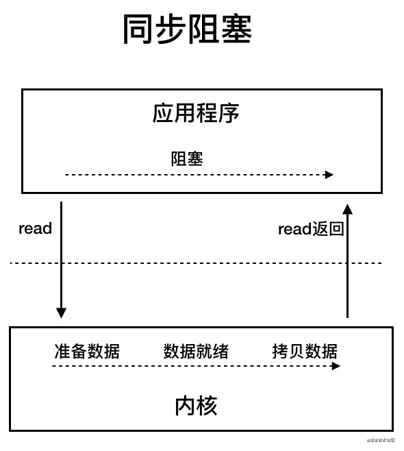

# Java基础

## 基本知识

### 为什么说 Java 语言“编译与解释并存”？

**编译型语言**是指编译器针对特定的操作系统将源代码**一次性翻译**成可被该平台执行的机器码；

**解释型语言**是指解释器对源程序**逐行解释**成特定平台的机器码并立即执行。

Java 语言既具有编译型语言的特征，也具有解释型语言的特征，因为 Java 程序要经过**先编译，后解释**两个步骤：

- 由 Java 编写的程序需要先经过**JDK中的javac**编译，生成**字节码**（`\*.class` 文件）；

- 这种字节码必须由 Java **解释器**来解释执行。因此，我们可以认为 Java 语言编译与解释并存。

### JVM JDK JRE

#### **JDK** 

Java Development Kit 缩写，包括 **JRE**+编译器（javac）+工具（如 javadoc 和 jdb）。能**创建**和**编译**程序。

#### **JRE** 

Java 运行时**环境**。它是运行**已编译** Java 程序所需的所有内容的集合，包括 **JVM** (Java 虚拟机)，Java 类库，java 命令和其他的一些基础构件。但是，**它不能用于创建新程序。**

#### **JVM (Java 虚拟机)**


是运行 Java **字节码**的虚拟机。JVM 有针对**不同系统**的特定实现（Windows，Linux，macOS），目的是使用相同的字节码，它们都会给出相同的结果。

##### **字节码**

在 Java 中，JVM 可以理解的代码就叫做字节码（即扩展名为 **.class** 的文件），它不面向任何特定的处理器，**只面向JVM**。Java 语言通过字节码的方式，在一定程度上**解决了传统解释型语言执行效率低的问题**，同时又保留了**解释型语言可移植的特点**。所以 Java 程序运行时比较**高效**。


**.class --> 机器码** 这一步JVM 类加载器首先加载字节码文件，然后通过解释器逐行解释执行，这种方式的执行速度会相对比较慢。而且，有些方法和代码块是经常需要被调用的(也就是所谓的热点代码)，所以后面引进了 **JIT 编译器**，而 JIT 属于**运行时编译**。当 JIT 编译器完成**第一次编译后**，其会将**字节码对应的机器码保存**下来，下次可以直接使用。而我们知道，**机器码的运行效率肯定是高于 Java 解释器的**。这也解释了我们为什么经常会说 **Java 是编译与解释共存的语言。**

### 字符型常量char vs 字符串常量String

1. **形式** : **字符常量char**是**单引号**引起的一个字符，**字符串常量String**是**双引号**引起的 0 个或若干个字符

2. **含义** : **字符常量char**相当于一个**整型值( ASCII 值)**,可以参加表达式运算; 字符串常量String代表一个**地址值**(该字符串在内存中存放位置)

3. **占内存大小** ： **字符常**量只占 **2 个字节**; 字符串常量占若干个字节 (**注意： char 在 Java 中占两个字节**),

    > 字符封装类 `Character` 有一个成员常量 `Character.SIZE` 值为 16,单位是`bits`,该值除以 8(`1byte=8bits`)后就可以得到 2 个字节

### 关键字（标识符的一种）

**标识符**：为程序、类、变量、方法等取的**名字**

**关键字**：被赋予特殊含义的**标识符**


### 自增自减运算符(a++ vs++a)

- 当 **b = ++a** 时，先自增（自己增加 1），再赋值（赋值给 b）；++a 输出的是 a+1 的值

- 当 **b = a++** 时，先赋值(赋值给 b)，再自增（自己增加 1）；a++输出的是 a 值。用一句口诀就是：“符号在前就先加/减，符号在后就后加/减”。

### continue、break、和 return 的区别是什么？

在循环结构中，当循环条件不满足或者循环次数达到要求时，循环会正常结束。但是，有时候可能需要在循环的过程中，当发生了某种条件之后 ，**提前终止循环**，这就需要用到下面几个关键词：

- **continue** ：指跳出当前的这一次循环，继续下一次循环。

- **break** ：指跳出整个循环体，继续执行循环下面的语句。

- **return** **value**; ：return 一个特定值，用于有返回值函数的方法

### **泛型？常用的通配符？**

泛型generics提供了编译时**类型安全检测**机制，该机制允许程序员在编译时检测到非法的类型。泛型的本质是参数化类型，也就是说所操作的数据类型被指定为一个参数。

**常用的通配符为： T，E，K，V，？**

- **？ 表示不确定的 java 类型**

- **`T<type>` 表示具体的一个 java 类型**

- **`K, V <key, value>` 分别代表 java 键值中的 Key Value**

- **E (element) 代表 Element**

#### 1、**泛型类**：

```java
//此处T可随便写为任意标识，常见的如T、E、K、V等形式的参数常用于表示泛型
//在实例化泛型类时，必须指定T的具体类型
public class Generic<T> {

    private T key;

    public Generic(T key) {
        this.key = key;
    }

    public T getKey() {
        return key;
    }
}
```

如何实例化泛型类：

```java
Generic<Integer> genericInteger = new Generic<Integer>(123456);                               
```

#### 2、**泛型接口：**

```java
public interface Generator<T> {
    public T method();
}
```

实现泛型接口，不指定类型：

```java
class GeneratorImpl<T> implements Generator<T>{
    @Override
    public T method() {
        return null;
    }
}
```

实现泛型接口，指定类型：

```java
class GeneratorImpl implements Generator<String>{
    @Override
    public String method() {
        return "hello";
    }
}
```

#### **3、泛型方法：**

```java
public static <E> void printArray(E[] inputArray) {
    for (E element : inputArray) {
        System.out.printf("%s ", element);
    }
    System.out.println();
}
```

使用：

```java
// 创建不同类型数组： Integer, Double 和 Character
Integer[] intArray = { 1, 2, 3 };
String[] stringArray = { "Hello", "World" };
printArray(intArray);
printArray(stringArray);
```

### 类型擦除

Java的泛型是**伪泛型**，这是因为Java在**编译期间**，所有的**泛型信息都会被擦掉** 。

### **== vs equals**

- **==** : 它的作用是判断两个对象的**地址**是不是相等。即判断两个对象是不是同一个对象。(**基本数据类型==比较的是值，引用数据类型==比较的是内存地址**)

- **equals()** : 它的作用也是判断两个对象是否相等，它**不能用于比较基本数据类型**的变量。

    equals()方法存在于Object类中，而Object类是所有类的直接或间接父类。

    `equals()` 方法存在两种使用情况：

    - **类没有覆盖 `equals()`方法** ：通过`equals()`比较该类的两个对象时，等价于通过“==”比较这两个对象的**内存地址**，使用的默认是 `Object`类`equals()`方法。

        ```java
        public boolean equals(Object obj) {
             return (this == obj);
        }
        ```

    - **类覆盖了 `equals()`方法** ：一般我们都覆盖 `equals()`方法来比较两个对象中的**属性**是否相等；若它们的属性相等，则返回 true(即，认为这两个对象相等)。

#### String中的equals()

- 当创建 `String` 类型的对象时，虚拟机会在常量池中查找有没有已经存在的值和要创建的值相同的对象，如果有就把它赋给当前引用。如果没有就在常量池中重新创建一个 `String` 对象。

- `String` 中的 `equals` 方法是被重写过的，因为 `Object` 的 `equals` 方法是比较的对象的**内存地址**，而 `String` 的 `equals` 方法比较的是**对象的值**。

    String类equals源码：

    ```java
    public boolean equals(Object anObject) {
        if (this == anObject) {
            return true;
        }
        if (anObject instanceof String) {
            String anotherString = (String)anObject;
            int n = value.length;
            if (n == anotherString.value.length) {
                char v1[] = value;
                char v2[] = anotherString.value;
                int i = 0;
                while (n-- != 0) {
                  	//!!!!比较的是String每个char的值
                    if (v1[i] != v2[i])
                        return false;
                    i++;
                }
                return true;
            }
        }
        return false;
    }
    ```

例子：

```java
public class test1 {
    public static void main(String[] args) {
      	System.out.println(42 == 42.0); // true
      
      	String a = new String("ab"); // a 为一个引用，指向堆中的某个地址
        String b = new String("ab"); // b为另一个引用,对象的内容一样
        System.out.println(a == b); // false，非同一对象
        System.out.println(a.equals(b)); // true
      
      	String aa = "ab"; // 放在常量池中
        String bb = "ab"; // 从常量池中查找
        System.out.println(aa==bb);// true
      	System.out.println(aa==a);// false，a指向堆的地址，aa指向常量池的地址
      	
      	String abab1 = "abab";
      	String abab2 = aa + bb;
      	System.out.println(abab1==abab2);//false，因为abab2相当于new了一下，有新地址
      	final String aaa = "ab";
      	final String bbb = "ab";
      	String abab3 = aaa+bbb;
	      System.out.println(abab1==abab3);//true，因为aaa、bbb被final修饰即为常量，编译器做常量相加会做优化所以为true
      	
        
    }
}
```

### **hashCode()与 equals()**

当你把对象加入 **HashSet** 时，HashSet 会先计算**对象的** **hashcode** 值来判断对象加入的位置，同时也会与其他**已经加入的对象的 hashcode** 值作**比较**。

- 如果没有相同的 hashcode，HashSet 会假设对象没有重复出现。

- 如果有相同 hashcode 值的对象，这时会调用 equals() 方法来检查 **hashcode 相等的对象**是否**对象本身的值也相同**：
    - 如果两者相同，HashSet 就不会让其加入操作成功（重复出现）；
    - 如果不同的话，就会重新散列到其他位置。

这样我们就**减少了 equals 的次数(只用==)，相应就大大提高了执行速度。**

### **为什么重写equals时必须重写hashCode方法**

> `hashCode()`的默认行为是对堆上的对象产生独特值。如果没有重写 `hashCode()`，则该 class 的**两个对象**无论如何都**不会相等**（即使这两个对象**指向相同的数据**）

如果两个对象相等，则 hashcode 一定也是相同的。

两个对象相等,对两个对象分别调用 equals 方法都返回 true。

但是，如果两个对象有相同的 hashcode 值，它们也不一定是相等的 。**因此，equals 方法被覆盖过，则 `hashCode` 方法也必须被覆盖。**

### 基本数据类型

#### 基本数据类型及对应的包装类型

| 基本类型  | 位数 | 字节 | 默认值  | 包装类型  |
| --------- | ---- | ---- | ------- | --------- |
| `int`     | 32   | 4    | 0       | Integer   |
| `short`   | 16   | 2    | 0       | Short     |
| `long`    | 64   | 8    | 0L      | Long      |
| `byte`    | 8    | 1    | 0       | Byte      |
| `char`    | 16   | 2    | 'u0000' | Character |
| `float`   | 32   | 4    | 0f      | Float     |
| `double`  | 64   | 8    | 0d      | Double    |
| `boolean` | 1    |      | false   | Boolean   |

另外，对于 `boolean`，官方文档未明确定义，它依赖于 JVM 厂商的具体实现。逻辑上理解是占用 1 位，但是实际中会考虑计算机高效存储因素。

**注意：**

1. Java 里使用 `long` 类型的数据一定要在数值后面加上 **L**，否则将作为整型解析。
2. `char a = 'h'`char :单引号，`String a = "hello"` :双引号;
3. 包装类型不赋值就是 `Null` ，而基本类型有默认值且不是 `Null`。

另外，这个问题建议还可以先从 JVM 层面来分析。

**基本数据类型**直接存放在 Java 虚拟机**栈**中的**局部变量表**中，而**包装类**型属于**对象**类型，我们知道对象实例都存在于**堆**中。相比于对象类型， 基本数据类型占用的空间非常小。

> 《深入理解 Java 虚拟机》 ：**局部变量**表主要存放了编译期可知的基本数据类型**（boolean、byte、char、short、int、float、long、double）**、**对象引用**（reference 类型，它不同于对象本身，可能是一个指向对象起始地址的引用指针，也可能是指向一个代表对象的句柄或其他与此对象相关的位置）。

### 自动装箱与拆箱

- **装箱**：将**基本类型**用它们对应的**引用类型**包装起来；
- **拆箱**：将包装类型转换为基本数据类型；

举例：

```java
Integer i = 10;  //装箱
int n = i;   //拆箱
```

装箱其实就是调用了 包装类的`valueOf()`方法，拆箱其实就是调用了 `xxxValue()`方法。

因此，

- `Integer i = 10` 等价于 `Integer i = Integer.valueOf(10)`
- `int n = i` 等价于 `int n = i.intValue()`;

### 常量池

两种浮点数类型的包装类 `Float`,`Double` 并没有实现常量池技术。

```JAVA
Float i11 = 333f;
Float i22 = 333f;
System.out.println(i11 == i22);// 输出 false

Double i3 = 1.2;
Double i4 = 1.2;
System.out.println(i3 == i4);// 输出 false
```

常量池技术：`Byte`,`Short`,`Integer`,`Long` 这 4 种包装类默认创建了数值 **[-128，127]** 的相应类型的**缓存数据**，`Character` 创建了数值在[0,127]范围的缓存数据，`Boolean` 直接返回 `True` Or `False`。

**Integer 缓存源码：**

```java
/**

*此方法将始终缓存-128 到 127（包括端点）范围内的值，并可以缓存此范围之外的其他值。

*/

public static Integer valueOf(int i) {
    if (i >= IntegerCache.low && i <= IntegerCache.high)
      return IntegerCache.cache[i + (-IntegerCache.low)];
    return new Integer(i);

}

private static class IntegerCache {
    static final int low = -128;
    static final int high;
    static final Integer cache[];
}
```

**`Boolean` 缓存源码：**

```java
public static Boolean valueOf(boolean b) {
    return (b ? TRUE : FALSE);
}
```

**如果未超出缓存范围，会直接使用常量池中的对象**

```java
Integer i1 = 33;
Integer i2 = 33;
System.out.println(i1==i2);// 输出 true
System.out.println(i1.equals(i2));//true
```

**new Integer会新开辟一块内存，而不是从常量池里拿**

```java
Integer i1 = 40;
Integer i2 = new Integer(40);
System.out.println(i1==i2);//false
System.out.println(i1.equals(i2));//true
```

`Integer i1=40` 这一行代码会发生**装箱**，也就是说这行代码等价于 `Integer i1=Integer.valueOf(40)` ，直接使用的是**常量池中的对象**；而`Integer i2 = new Integer(40)` 会开辟一块新内存，创建新的对象。

**如果超出缓存范围，会去创建新的对象，所以未超出缓存范围的包装类可以用==来比较值；超出缓存的包装类==比较的是内存地址**（对象引用？）

```java
Integer i3 = 128;
Integer i4 = 128;
System.out.println(i3==i4);//false
System.out.println(i3.equals(i4));//true
```

#### Integer和int的比较：

实际比较的是**数值**，Integer会做**拆箱**的动作，来跟基本数据类型做比较，此时跟是否在缓存范围内或是否new都没关系 

```Java
Integer i3 = 128;
int i4 = 128;
System.out.println(i3==i4);//true
System.out.println(i3.equals(i4));//true
```

记住：**所有整型包装类对象之间值的比较，全部使用 equals 方法比较**。

> 《阿里巴巴Java开发手册终极版v1.3.0》
>
> 【强制】所有的相同类型的**包装类**对象之间值的比较，全部使用 equals 方法比较。
>
> 说明:对于 Integer var = ? 在-128 至 127 范围内的赋值，Integer 对象是在IntegerCache.cache 产生，会复用已有对象，这个区间内的 Integer 值可以直接使用==进行判断，但是这个区间之外的所有数据，都会在堆上产生，并不会复用已有对象，这是一个大坑， 推荐使用 equals 方法进行判断。

### 在一个静态方法内调用一个非静态成员为什么是非法的?

这个需要结合 JVM 的相关知识，**静态方法是属于类的**，在类加载的时候就会分配内存，**可以通过类名直接访问**。而**非静态成员**属于**实例对象**，只有在**对象实例化之后才存在**，然后**通过类的实例对象去访问**。在类的非静态成员不存在的时候静态成员就已经存在了，此时调用在内存中还不存在的非静态成员，属于非法操作。

### 静态方法和实例方法有何不同？

1. **调用静态方法可以无需创建对象。**在外部调用**静态方法**时，可以使用"类名.方法名"的方式，也可以使用"对象名.方法名"的方式。而实例方法只有后面这种方式。
2. **静态方法**在访问本类的成员时，**只允许访问静态成员**（即静态成员变量和静态方法），而**不允许访问实例成员变量和实例方法**；**实例方法则无此限制**。

### 值传递

- 对于**基本类型**，方法中所有的参数的都是“值传递”，**就是传递的是原来值的副本，不是原来的参数**，因此，改变不会影响到原来的参数（即数值型或布尔型）。

    对于基本类型 num ，赋值运算符会直接**改变变量的值**，原来的值被覆盖掉。

- 对于**引用类型**，传入的是地址（reference）

    对于引用类型 String，赋值运算符会**改变引用中所保存的地址**，**原来的地址被覆盖掉**。但是**原来的对象不会被改变**（GC garbage collection）。

### **重载Overload vs 重写Override**

| 区别点     | 重载方法 | 重写方法                                                     |
| ---------- | -------- | ------------------------------------------------------------ |
| 发生范围   | 同一个类 | 子类                                                         |
| 参数列表   | 必须修改 | 一定不能修改                                                 |
| 返回类型   | 可修改   | 子类方法返回值类型应比父类方法返回值类型更小或相等           |
| 异常       | 可修改   | 子类方法声明抛出的异常类应比父类方法声明抛出的异常类更小或相等； |
| 访问修饰符 | 可修改   | 一定不能做更严格的限制（可以降低限制）                       |
| 发生阶段   | 编译期   | 运行期                                                       |

#### **重载Overload**

同一个**类**中多个**同名方法**根据**参数不同**来执行不同的逻辑处理，如：

```java
public double add(int a, int b);
public double add(int a, int b, int c);
```

返回类型不同，不构成重载，会直接**报错**：

```java
public double add(int a, int b);
public int add(int a, int b);
```

#### 重写Override

发生在**运行期**，是**子类对父类**的允许访问的**方法的实现过程进行重新编写**。

- **返回值类型、方法名、参数列表必须相同**，抛出的**异常范围小于等于父类**，**访问修饰符范围大于等于父类**。

- 如果父类方法**访问修饰符**为 private/final/static 则子类就**不能重写**该方法，但是被 static 修饰的方法能够被再次声明。

- **构造方法constructor无法被重写，只能重载**

综上：重写就是子类对父类方法的重新改造，外部样子不能改变，**内部逻辑可以改变**

### 深拷贝 vs 浅拷贝


1. **浅拷贝**：对**基本数据类型**进行**值传递**，对**引用数据类型**进行**引用传递**般的拷贝，此为浅拷贝。
2. **深拷贝**：对**基本数据类型**进行**值传递**，对**引用数据类型**，**创建一个新的对象，并复制其内容**，此为深拷贝。

**final**

final修饰**类**，表示**类**不可变，**不可继承**; 比如，String，不可变性

final修饰**方法**，表示该方法**不可重写**; 比如模板方法，可以固定我们的算法

final修饰**变量**，这个变量就是**常量**

注意：

修饰的是**基本数据类型**，这个**值**本身**不能修改**

修饰的是**引用类型**，引用的指向（**student，在jvm栈内存中）不能修改, 引用对象（student-age在jvm堆内存中）的内容**可以修改。比如下面的代码是可以的：

```java
final Student student = new Student(18, "Andy");
student.setAge(19);
```

### **接口和抽象类**

JDK1.8之前：

- 语法：
    - **抽象类**Abstract：方法可以有抽象的，也可以有非抽象（有具体实现）, 有构造器
    - **接口**Interface：方法都是**抽象**，属性都是**常量**，**默认有public static final**修饰

- 设计：
    - **抽象类**Abstract：同一类事物的抽取，比如针对Dao层操作的封装，如，BaseDao，UserDao；                       

    - **接口**Interface：通常更像是一种标准的制定，定制系统之间对接的标准，例如：

        1、单体项目，分层开发，做到**高内聚低耦合**。interface作为各层之间的纽带，在controller中注入IUserService，在Service注入IuserDao。**使用时只需向ioc注入实现类如IuserServiceImpl1？2？3…**

        2、分布式项目，面向服务的开发，抽取服务service，这个时候，就会产生服务的**提供者**和服务的**消费者**两个角色；这两个角色之间的纽带，依然是接口

JDK1.8之后：

接口里面可以有实现的方法，注意要在方法的声明上加上default或者static

### **多继承，多重继承，多实现**

多重继承：A extends B extends C（爷孙三代的关系）

多实现：Person **implements** IRunable,IEatable（符合多项国际化标准）

多继承：**接口**可以**多继承extends**，**类**只支持**单继承**

## 面向对象

**面向对象易维护、易复用、易扩展**

### 面向过程 vs 面向对象

面向过程：如何设计一个算法去实现需求----造轮子

面向对象：如何调用对象（框架）去实现需求----选轮子

因为面向对象有**封装**、**继承**、**多态**性的特性，所以可以设计出**低耦合**的系统，使系统更加灵活、更加易于维护。但是，**面向对象性能比面向过程低**。

### 面向对象三大特征

#### 封装

封装是指把一个对象的**状态信息**（也就是**属性**）**隐藏在对象内部**，不允许外部对象直接访问对象的内部信息。但是可以提供一些**可以被外界访问的方法(getter and setter)**来操作属性。

#### 继承 extends

不同类型的对象，相互之间经常有一定数量的**共同点**。**继承**是使用**已存在的类的定义作为基础建立新类**的技术，新类的定义可以增加新的数据或新的功能，也可以用父类的功能，但不能选择性地继承父类。通过使用继承，可以快速地创建新的类，可以提高**代码的重用**，程序的可维护性。

- **子类**拥有**父类对象所有的属性和方法**（包括私有属性和私有方法），但是父类中的私有属性和方法子类是**无法访问**的，**只是拥有**，但可以重写。
- 子类可以拥有**独有的属性和方法**，即子类可以对父类进行**扩展**。

#### 多态

多态，顾名思义，表示**一个对象**具有**多种状态**。具体表现为**父类的引用指向子类的实例**。


**多态的特点:**

- **对象类型**和**引用类型**之间具有**继承（类）/实现（接口）**的关系；
- **引用类型**变量发出的方法调用的到底是哪个类中的方法，必须在**程序运行期间**才能确定；
- 多态不能调用“**只在子类存在但在父类不存在**”的方法，**即work()方法**；
- 如果**子类重写了父类的方法**，**真正执行**的是**子类覆盖的方法**，如果子类没有覆盖父类的方法，执行的是父类的方法。

### 成员变量(Car类中的color)与局部变量(for循环中的i以及其他未声明的变量)的区别有哪些？

从语法形式上看:**成员变量是属于类**的，而**局部变量是在代码块或方法中定义**的变量或是方法的参数；**成员变量**可以被 **public,private,static 等修饰符所修饰**，**而局部变量不能被访问控制修饰符及 static** 所修饰；但是，**成员变量和局部变量都能被 final 所修饰**。

从变量在**内存**中的**存储方式**来看: 如果**成员变量是使用static修饰**的，那么这个**成员变量**是属于**类**的，如果**没有使用static修饰**，这个**成员变量**是属于**实例**的。而**成员变量的载体对象**存在于**堆内存**，**局部变量则存在于栈内存**。

从变量在**内存**中的**生存时间**上看:**成员变量是对象的一部分，它随着对象的创建而存在，而局部变量随着方法的调用而自动消失**。

**成员变量如果没有被赋初值: 则会以对应类型的默认值而赋值**（一种情况例外:被 final 修饰的成员变量也必须显式地赋值），**而局部变量则不会自动赋值**。

### **一个类的构造方法的作用是什么? 若一个类没有声明构造方法，该程序能正确执行吗? 为什么?**

**构造方法**主要作用是完成**对类对象的初始化工作**。

**构造方法**特性：

·   名字与类名相同。

·   没有返回值，但不能用 void 声明构造函数。

·   生成类的对象时自动执行，无需调用。

**可以执行**。因为一个类即使没有声明构造方法也会有**默认的不带参数的构造方法**。如果我们自己添加了类的构造方法（无论是否有参），Java 就不会再添加默认的无参数的构造方法了，这时候，就不能直接 new 一个对象而不传递参数了，所以我们一直在不知不觉地使用构造方法，这也是为什么我们在创建对象的时候后面要加一个**括号**（因为要调用无参的构造方法）。**如果我们重载了有参的构造方法，记得都要把无参的构造方法也写出来**（无论是否用到）

### **在 Java 中定义一个不做事且没有参数的构造方法的作用**

Java 程序在执行子类的构造方法之前，如果没有用 super()来调用父类特定的构造方法，则会调用父类中“没有参数的构造方法”。因此，**如果父类中只定义了有参数的构造方法，而在子类的构造方法中又没有用 super()来调用父类中特定的构造方法，则编译时将发生错误**，因为 Java 程序在父类中找不到没有参数的构造方法可供执行。解决办法是在父类里加上一个不做事且没有参数的构造方法。

### **String, StringBuffer, StringBuilder**

**String**的值是不可变的，这就导致每次对String的操作都会生成**新的String对象。**旧的被JVM的GC收回。

Buffer&Builder可对对象本身进行操作 (append(“???”),delete(“???”))

**StringBuffer** **线程安全**（同步访问），方法用**synchronized**修饰

**StringBuilder** 的方法**不是线程安全**的（不能同步访问）但**性能更高**，因为无同步控制synchronized。

#### Buffer和Builder涉及到的线程安全问题

- **在service层的某个方法内调用StringBuilder sb，每个线程调用一次这个方法会在jvm栈中增加一个栈帧，这个线程使用的方法的栈帧是线程独享的，也就是这个sb是线程独享的局部变量，相当于每个线程访问一个sb，<u>所以不存在线程安全问题</u>。**

- **当sb被声明为<u>全局变量</u>（而不是方法内的局部变量）时，会出现线程安全问题**

### Object 类的常见方法总结

Object 类是一个特殊的类，是所有类的父类。它主要提供了以下 11 个方法：

```java
public final native Class<?> getClass()//native方法，用于返回当前运行时对象的Class对象，使用了final关键字修饰，故不允许子类重写。

public native int hashCode() //native方法，用于返回对象的哈希码，主要使用在哈希表中，比如JDK中的HashMap。
public boolean equals(Object obj)//用于比较2个对象的内存地址是否相等，String类对该方法进行了重写用户比较字符串的值是否相等。

protected native Object clone() throws CloneNotSupportedException//naitive方法，用于创建并返回当前对象的一份拷贝。一般情况下，对于任何对象 x，表达式 x.clone() != x 为true，x.clone().getClass() == x.getClass() 为true。Object本身没有实现Cloneable接口，所以不重写clone方法并且进行调用的话会发生CloneNotSupportedException异常。

public String toString()//返回类的名字@实例的哈希码的16进制的字符串。建议Object所有的子类都重写这个方法。

public final native void notify()//native方法，并且不能重写。唤醒一个在此对象监视器上等待的线程(监视器相当于就是锁的概念)。如果有多个线程在等待只会任意唤醒一个。

public final native void notifyAll()//native方法，并且不能重写。跟notify一样，唯一的区别就是会唤醒在此对象监视器上等待的所有线程，而不是一个线程。

public final native void wait(long timeout) throws InterruptedException//native方法，并且不能重写。暂停线程的执行。注意：sleep方法没有释放锁，而wait方法释放了锁 。timeout是等待时间。

public final void wait(long timeout, int nanos) throws InterruptedException//多了nanos参数，这个参数表示额外时间（以毫微秒为单位，范围是 0-999999）。 所以超时的时间还需要加上nanos毫秒。

public final void wait() throws InterruptedException//跟之前的2个wait方法一样，只不过该方法一直等待，没有超时时间这个概念

protected void finalize() throws Throwable { }//实例被垃圾回收器回收的时候触发的操作
```

## 异常Execption

**保证健壮性（有异常程序会继续执行，不会崩溃）**


**Throwable** 类有两个重要的子类 **Exception**（**异常**）和 **Error**（**错误**）。**Exception** 能被程序本身处理(**try-catch**)， **Error** 是**无法处理**的(只能尽量避免)。

### **Error：jvm运行时报的错误**

- **StackOverflowError 栈内存溢出（如递归没写好，没有出口，每个方法占用一个栈针）**

- **OOM 堆内存溢出（如方法内创建对象，多了就内存溢出了）**

### **Exception：自定义 异常一般继承RunntimeException**

- **受检查异常/运行时异常（逻辑异常LogicException，代码写的不严谨，如数组越界ArrayIndexOutOfBound，空指针异常NullPointer）：**Java 代码在**编译过程**中，如果受检查异常没有被 catch/throw 处理的话，就没办法通过编译 。

    **为什么框架的异常体系最终都抛出runtimeException：因为框架定义了一系列规则，例如忘记加@Service，是框架语法内的逻辑错误**

- **不受检查异常/非运行时异常：Java 代码在编译过程中，不处理不受检查异常也可以正常通过编译。**例如：

    

### **Throwable** **类常用方法**

- public string **getMessage():**返回异常发生时的**简要描述**

- public string **toString**():返回异常发生时的**详细信息**

- public string getLocalizedMessage():返回异常对象的**本地化信息**。使用 Throwable 的子类覆盖这个方法，可以生成本地化信息。**如果子类没有覆盖该方法，则该方法返回的信息与getMessage() 返回的结果相同**

- public void **printStackTrace**():在控制台上打印 Throwable 对象**封装**的异常信息

### try-catch-finally

- **`try`块：** 用于**捕获异常**。其后可接零个或多个 `catch` 块，如果没有 `catch` 块，则必须跟一个 `finally` 块。
- **`catch`块：** 用于**处理** try 捕获到的**异常**。
- **`finally` 块：** 无论是否捕获或处理异常，`finally` 块里的语句都会被执行。**当在 `try` 块或 `catch` 块中遇到 `return` 语句时，`finally` 语句块将在方法返回之前被执行。**

**注意：** 当 **try** 语句和 **finally** 语句中**都有 return** 语句时，在方法返回之前，finally 语句的内容将被执行，并且 **finally 语句的返回值将会覆盖try里原始的返回值**。如下：

```java
		public static int f(int value) {
        try {
            return value * value;
        } finally {
            if (value == 2) {
                return 0;
            }
        }
    }

```

如果调用 `f(2)`，返回值将是 0，因为 finally 语句的返回值覆盖了 try 语句块的返回值。

当catch和finaly都有return，finally语句的返回值会覆盖catch中的返回值：

```java
		public static int f(int value) {
        try {
            int i = 1/0;
        } catch(Exception e){
          		return 1;
        } finally {
	            return 2;
        }
    }
```

返回2。

**在以下 3 种特殊情况下，`finally` 块不会被执行：**

- 在 `try` 或 `finally`块中用了 **`System.exit(int)`退出程序**。但是，如果 `System.exit(int)` 在**异常语句之后**，`finally` 还是会被执行
- 程序所在的**线程死亡**。
- **关闭 CPU**。

### Throw 和 throws

- Throw：作用于**方法内**，用于**主动抛出异常**

- Throws：作用于**方法声明**上，**声明该方法有可能会抛些某些异常**

## I/O 

### 有哪些常见的 IO 模型?

UNIX 系统下， IO 模型一共有 5 种： **同步阻塞 I/O**、**同步非阻塞 I/O**、**I/O 多路复用**、**信号驱动 I/O** 和**异步 I/O**。

这也是我们经常提到的 5 种 IO 模型。

### Java中的I/O模型

为了保证操作系统的稳定性和安全性，一个进程的地址空间划分为 **用户空间（User space）** 和 **内核空间（Kernel space ）** 。

像我们平常运行的应用程序都是运行在用户空间，只有内核空间才能进行系统态级别的资源有关的操作，比如如文件管理、进程通信、内存管理等等。也就是说，我们想要进行 IO 操作，一定是要依赖内核空间的能力。

并且，用户空间的程序不能直接访问内核空间。

当**用户应用程序**想要执行 IO 操作时，由于没有执行这些操作的权限，只能发起**系统调用**请求**操作系统的内核**帮忙完成。

当应用程序发起 I/O 调用后，会经历两个步骤：

1. 内核等待 I/O 设备准备好数据
2. 内核将数据从内核空间拷贝到用户空间。


#### BIO (Blocking I/O) 同步阻塞

**BIO 属于同步阻塞 IO 模型** 。

**同步阻塞** IO 模型中，**应用程序发起 read 调用后，会一直阻塞，直到在内核把数据拷贝到用户空间。**



在客户端连接数量不高的情况下，是没问题的。但是，当面对十万甚至百万级连接的时候，传统的 BIO 模型是无能为力的。因此，我们需要一种更高效的 I/O 处理模型来应对更高的并发量。

#### NIO (Non-blocking/New I/O) 多路复用模型

Java 中的 NIO 于 Java 1.4 中引入，对应 `java.nio` 包，提供了 `Channel` , `Selector`，`Buffer` 等抽象。NIO 中的 N 可以理解为 Non-blocking，不单纯是 New。它支持面向缓冲的，基于通道的 I/O 操作方法。 对于高负载、高并发的（网络）应用，应使用 NIO 。

Java 中的 NIO 可以看作是 **I/O 多路复用模型**（正确）。也有很多人认为，Java 中的 NIO 属于**同步非阻塞 IO 模型**（我认为是错误）。


**同步非阻塞** IO 模型中，**应用程序会一直发起 read 调用，等待数据从内核空间拷贝到用户空间的这段时间里，线程依然是阻塞的，直到在内核把数据拷贝到用户空间。**

相比于同步阻塞 IO 模型，同步非阻塞 IO 模型确实有了很大改进。通过轮询操作，避免了一直阻塞。

但是，这种 IO 模型同样存在问题：**应用程序不断进行 I/O 系统调用轮询数据是否已经准备好的过程是十分消耗 CPU 资源的。**

这个时候，**I/O 多路复用模型** 就上场了。


IO 多路复用模型中，线程首先发起 select 调用，询问内核数据是否准备就绪，等内核把数据准备好了，用户线程再发起 read 调用。read 调用的过程（数据从内核空间->用户空间）还是阻塞的。

> 目前支持 IO 多路复用的系统调用，有 select，epoll 等等。select 系统调用，是目前几乎在所有的操作系统上都有支持
>
> - **select 调用** ：内核提供的系统调用，它支持一次查询多个系统调用的可用状态。几乎所有的操作系统都支持。
> - **epoll 调用** ：linux 2.6 内核，属于 select 调用的增强版本，优化了 IO 的执行效率。

**IO 多路复用模型，通过减少无效的系统调用，减少了对 CPU 资源的消耗。**

Java 中的 NIO ，有一个非常重要的**选择器 ( Selector )** 的概念，也可以被称为 **多路复用器**。通过它，只需要一个线程便可以管理多个客户端连接。当客户端数据到了之后，才会为其服务。


#### AIO (Asynchronous I/O) 异步模型

AIO 也就是 NIO 2。Java 7 中引入了 NIO 的改进版 NIO 2,它是异步 IO 模型。

异步 IO 是基于事件和回调机制实现的，也就是应用操作之后会直接返回，不会堵塞在那里，当后台处理完成，操作系统会通知相应的线程进行后续的操作。


### 序列化 vs 反序列化（针对对象）

如果我们需要持久化 Java 对象比如将 Java 对象保存在文件中，或者在网络传输 Java 对象，这些场景都需要用到序列化。

**序列化** <---> **反序列化**： **数据结构或对象** <---> **二进制字节流**

### Java 序列化中如果有些字段不想进行序列化，怎么办？transient

对于不想进行序列化的变量，使用 `transient` 关键字修饰。

`transient` 关键字的作用是：阻止实例中那些用此关键字修饰的的变量序列化；当对象被反序列化时，被 `transient` 修饰的变量值不会被持久化和恢复。

关于 `transient` 还有几点注意：

- `transient` 只能修饰**变量**，不能修饰**类和方法**。
- `transient` 修饰的变量，在反序列化后变量值将会被置成**对应类型的默认值**。例如，如果是修饰 `int` 类型，那么反序列后结果就是 `0`。
- `static` 变量因为不属于任何对象(Object)，所以无论有没有 `transient` 关键字修饰，均不会被序列化。

### 获取用键盘输入常用的两种方法

方法 1：通过 `Scanner`

```java
Scanner input = new Scanner(System.in);
String s  = input.nextLine();
input.close();
```

方法 2：通过 `BufferedReader`

```java
BufferedReader input = new BufferedReader(new InputStreamReader(System.in));
String s = input.readLine();
```

### Java 中 IO 流分为几种?

- 按照流的流向分，可以分为**输入流**和**输出流**；
- 按照操作单元划分，可以划分为**字节流**和**字符流**；
- 按照流的角色划分为节点流和处理流。

Java Io 流共涉及 40 多个类，这些类看上去很杂乱，但实际上很有规则，而且彼此之间存在非常紧密的联系， Java I0 流的 40 多个类都是从如下 4 个抽象类基类中派生出来的。

- InputStream/Reader: 所有的输入流的基类，前者是字节输入流，后者是字符输入流。
- OutputStream/Writer: 所有输出流的基类，前者是字节输出流，后者是字符输出流。

按操作方式分类结构图：


### 既然有了字节流,为什么还要有字符流?

问题本质想问：**不管是文件读写还是网络发送接收，信息的最小存储单元都是字节，那为什么 I/O 流操作要分为字节流操作和字符流操作呢？**

回答：**字符流**是由 Java 虚拟机将**字节**转换得到的，问题就出在这个过程还算是非常**耗时**，并且，如果我们不知道编码类型就很容易出现**乱码**问题。所以， I/O 流就干脆提供了一个**直接操作字符的接口**，方便我们平时对字符进行流操作。如果**音频文件、图片等媒体文件**用**字节流**比较好，如果涉及到**字符**的话使用**字符流**比较好。

## 反射

JAVA 反射机制是在运行状态中，

对于任意一个**类**，都能够知道这个类的所有**属性和方法**；

对于任意一个**对象**，都能够调用它的任意一个**方法和属性**；

这种**动态获取的信息以及动态调用对象**的方法的功能称为 java 语言的反射机制。

例子：

- 我们在使用 JDBC 连接数据库时使用 Class.forName()通过反射加载数据库的驱动程序；

- Spring 框架的 IOC（动态加载管理 Bean）创建对象以及 AOP（动态代理）功能都和反射有联系；                         

- 动态配置实例的属性；

### 优缺点

**优点：** **运行期**类型的判断，**动态加载类**，提高代码**灵活度**。

**缺点：** 

- **性能瓶颈**：反射相当于一系列解释操作，通知 JVM 要做的事情，性能比直接的 java 代码要慢很多。

- **安全问题**，让我们可以动态操作改变类的属性同时也增加了类的安全隐患。比如可以无视泛型参数的安全检查（泛型参数的安全检查发生在编译时）

### 获取 Class 对象的四种方式

如果我们动态获取到这些信息，我们需要依靠 Class 对象。**Class 类对象将一个类的方法、变量**等信息告诉运行的程序。Java 提供了四种方式获取 Class 对象:

#### **1.知道具体类的情况下可以使用：**

```java
Class alunbarClass = TargetObject.class;
```

但是我们一般是不知道具体类的，基本都是通过遍历包下面的类来获取 Class 对象，通过此方式获取 Class 对象不会进行初始化

#### **2.通过 `Class.forName()`传入类的路径获取：**

```java
Class alunbarClass1 = Class.forName("cn.javaguide.TargetObject");
```

#### **3.(常用)通过对象实例`instance.getClass()`获取：**

```java
TargetObject o = new TargetObject();
Class alunbarClass2 = o.getClass();
```

#### **4.通过类加载器`xxxClassLoader.loadClass()`传入类路径获取:**

```java
Class clazz = ClassLoader.loadClass("cn.javaguide.TargetObject");
```

通过类加载器获取 Class 对象不会进行初始化，意味着**不进行**包括**初始化**等一些列步骤，**静态块和静态对象不会得到执行**

#### 完整案例：

1.创建一个我们要使用反射操作的类 `TargetObject`。

```java
package cn.javaguide;

public class TargetObject {
    private String value;

    public TargetObject() {
        value = "JavaGuide";
    }

    public void publicMethod(String s) {
        System.out.println("I love " + s);
    }

    private void privateMethod() {
        System.out.println("value is " + value);
    }
}
```

2.使用反射操作这个类的方法以及参数

```java
package cn.javaguide;

import java.lang.reflect.Field;
import java.lang.reflect.InvocationTargetException;
import java.lang.reflect.Method;

public class Main {
    public static void main(String[] args) throws ClassNotFoundException, NoSuchMethodException, IllegalAccessException, InstantiationException, InvocationTargetException, NoSuchFieldException {
        /**
         * 获取TargetObject类的Class对象并且创建TargetObject类实例
         */
        Class<?> tagetClass = Class.forName("cn.javaguide.TargetObject");
        TargetObject targetObject = (TargetObject) tagetClass.newInstance();
        /**
         * 获取所有类中所有定义的方法
         */
        Method[] methods = tagetClass.getDeclaredMethods();
        for (Method method : methods) {
            System.out.println(method.getName());//输出1 publicMethod 2 privateMethod
        }
        /**
         * 获取指定方法并调用
         */
        Method publicMethod = tagetClass.getDeclaredMethod("publicMethod", String.class);

        publicMethod.invoke(targetObject, "JavaGuide");//输出I love JavaGuide
        /**
         * 获取指定参数并对参数进行修改
         */
        Field field = tagetClass.getDeclaredField("value");
        //为了对类中的参数进行修改我们取消安全检查
        field.setAccessible(true);
        field.set(targetObject, "JavaGuide");
        /**
         * 调用 private 方法
         */
        Method privateMethod = tagetClass.getDeclaredMethod("privateMethod");
        //为了调用private方法我们取消安全检查
        privateMethod.setAccessible(true);
        privateMethod.invoke(targetObject);//输出value is JavaGuide
    }
}
```

### 动态代理

可以在运行期动态创建某个interface的实例。

我们仍然先定义了**接口**Hello，但是我们并**不**去编写**实现类**，而是直接通过JDK提供的一个Proxy.**newProxyInstance**()创建了一个Hello接口对象。这种没有实现类但是在运行期动态创建了一个接口对象的方式，我们称为动态代码。JDK提供的动态创建接口对象的方式，就叫动态代理。例如：


