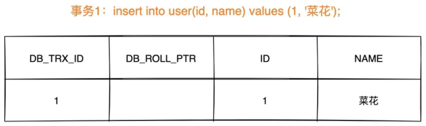

# MySQL

------

## 事务

数据库事务可以保证**多个对数据库的操作**（也就是 SQL 语句）构成一个**逻辑上的整体**。构成这个逻辑上的整体的这些数据库操作遵循：**要么全部执行成功, 要么全部不执行** 。

```sql
# 开启一个事务
START TRANSACTION;
# 多条 SQL 语句
SQL1,SQL2...
## 提交事务
COMMIT;
```

### 事务的ACID特性

- **原子性**（`Atomicity`） ： 事务是最小的执行单位，不允许分割。事务的原子性确保动作要么全部完成，要么完全不起作用；

- **一致性**（`Consistency`）： 执行事务前后，数据保持一致，例如转账业务中，无论事务是否成功，转账者和收款人的总额应该是不变的；

- **隔离性**（`Isolation`）： 并发访问数据库时，一个用户的事务不被其他事务所干扰，各并发事务之间数据库是独立的；

- **持久性**（`Durability`）： 一个事务被提交之后。它对数据库中数据的改变是持久的，即使数据库发生故障也不应该对其有任何影响。

### 并发事务带来的问题

**多个事务并发运行，操作同一的数据时**，可能会导致以下的问题：

- **脏读（Dirty read）:** **读到的数据已经被修改。**

    当一个事务正在访问数据并且对数据进行了**修改**，而这个**修改还没有提交到数据库中**，**这时另外一个事务也访问了这个数据**，然后使用了这个数据。因为这个数据是还没有提交的数据，那么**另外一个事务读到的这个数据是“脏数据”**

- **丢失修改（Lost to modify）:** **两个事务同时修改统一数据，先修改的会被后修改的覆盖，导致丢失**。

    指在一个事务读取一个数据时，另外一个事务也访问了该数据；**在第一个事务中修改了这个数据后，第二个事务也修改了这个数据**。这样**第一个事务内的修改结果就被丢失**，因此称为丢失修改。 

    例如：事务 1 读取某表中的数据 A=20，事务 2 也读取 A=20，事务 1 修改 A=A-1，事务 2 也修改 A=A-1，最终结果 A=19，事务 1 的修改被丢失。

- **不可重复读（Unrepeatable read）:** **在一个事务内两次次读同一数据，两次读的间隙数据被修改，两次读的结果不一样。**

    在一个事务内多次读同一数据，在这个事务还没有结束时，另一个事务也访问该数据。那么，在第一个事务中的两次读数据之间，由于第二个事务的修改导致第一个事务两次读取的数据可能不太一样。这就发生了在一个事务内两次读到的数据是不一样的情况，因此称为不可重复读。

- **幻读（Phantom read）:** 幻读与不可重复读类似。它发生在一个事务**T1读取了几行数据**，接着**另一个并发事务T2插入了一些数据时**。在随后的查询中，**T1就会发现多了一些原本不存在的记录**，称为幻读。

#### **不可重复读和幻读区别：**

不可重复读的重点是**数据的修改**，比如多次读取一条记录发现其中某些列的值被修改，幻读的重点在于**数据的新增或者删除**，比如多次读取一条记录发现记录增多或减少了。

### 事物的隔离级别

- **READ-UNCOMMITTED(读取未提交)：** 最低的隔离级别，允许读取**尚未提交**的数据变更。

    **可能会导致脏读、幻读或不可重复读**。

    %E5%AE%9E%E4%BE%8B.jpg)

- **READ-COMMITTED(读取已提交)：** 允许读取并发事务**已经提交**的数据。

    **可以阻止脏读，但是幻读或不可重复读仍有可能发生**。

    

- （MySQL默认）**REPEATABLE-READ(可重复读)：** 对同一字段的**多次读取结果都是一致**的，除非数据是被本身事务自己所修改。

    **可以阻止脏读和不可重复读，但幻读仍有可能发生**。

    

- **SERIALIZABLE(可串行化)：** 最高的隔离级别，完全服从 ACID 的隔离级别。

    所有的事务依次逐个执行，这样事务之间就完全不可能产生干扰，该级别可以防止脏读、不可重复读以及幻读**。

    

| 隔离级别         | 脏读 | 不可重复读 | 幻读 |
| ---------------- | ---- | ---------- | ---- |
| READ-UNCOMMITTED | √    | √          | √    |
| READ-COMMITTED   | ×    | √          | √    |
| REPEATABLE-READ  | ×    | ×          | √    |
| SERIALIZABLE     | ×    | ×          | ×    |

MySQL **InnoDB** 的 **REPEATABLE-READ（可重读）**并**不保证避免幻读**，需要**应用Next-Key Locks加锁读**来保证。

因为隔离级别越低，事务请求的锁越少，所以大部分数据库系统的隔离级别都是 **READ-COMMITTED(读取提交内容)** ，但是 InnoDB 存储引擎默认使用 **REPEATABLE-READ（可重读）** 并**不会有任何性能损失**。

InnoDB 存储引擎在 **分布式事务** 的情况下一般会用到 **SERIALIZABLE(可串行化)** 隔离级别。

## MVCC

### InnoDB对MVCC的实现

`MVCC` 的实现依赖于：**隐藏字段、Read View、undo log**。在内部实现中，`InnoDB` 通过数据行的 `DB_TRX_ID` 和 `Read View` 来判断数据的可见性，如不可见，则通过数据行的 `DB_ROLL_PTR` 找到 `undo log` 中的历史版本。每个事务读到的数据版本可能是不一样的，在同一个事务中，用户只能看到该事务创建 `Read View` 之前**已经提交的修改和该事务本身做的修改**

#### 隐藏字段

在内部，`InnoDB` 存储引擎为每行数据添加了三个 [隐藏字段](https://dev.mysql.com/doc/refman/5.7/en/innodb-multi-versioning.html)：

- `DB_TRX_ID（6字节）`：表示**最后一次插入或更新该行的事务id**。此外，`delete` 操作在内部被视为更新，只不过会在记录头 `Record header` 中的 `deleted_flag` 字段将其标记为已删除
- `DB_ROLL_PTR（7字节）` **回滚指针**，指向该行的 `undo log` 。如果该行未被更新，则为空
- `DB_ROW_ID（6字节）`：如果没有设置主键且该表没有唯一非空索引时，`InnoDB` 会使用**该id来生成聚簇索引**

#### ReadView

[`Read View`](https://github.com/facebook/mysql-8.0/blob/8.0/storage/innobase/include/read0types.h#L298) 主要是用来做可见性判断，里面保存了 “当前对本事务不可见的其他活跃事务”

主要有以下字段：

- `m_low_limit_id`：目前出现过的最大的事务ID+1，即**下一个将被分配的事务ID**。大于这个ID的数据版本均不可见
- `m_up_limit_id`：**活跃事务**列表 `m_ids` 中**最小的事务ID**，如果 `m_ids` 为空，则 `m_up_limit_id` 为 `m_low_limit_id`。小于这个ID的数据版本均可见
- `m_ids`：`Read View` **创建时**其他**未提交的活跃事务ID列表**。创建 `Read View `时，将当前未提交事务ID记录下来，后续即使它们修改了记录行的值，对于当前事务也是不可见的。`m_ids` 不包括当前事务自己和已提交的事务（正在内存中）
- `m_creator_trx_id`：创建该 `Read View` 的事务ID

#### undo-log

`undo log` 主要有两个**作用**：

- 当**事务回滚**时用于将数据**恢复到修改前**的样子
- 另一个作用是 `MVCC` ，当读取记录时，若该记录被其他事务占用或当前版本对该事务不可见，则可以通过 `undo log` 读取**之前的版本数据**，以此实现**非锁定读**

**在 `InnoDB` 存储引擎中 `undo log` 分为两种： `insert undo log` 和 `update undo log`：**

1. **`insert undo log`** ：指在 `insert` 操作中产生的 `undo log`。因为 `insert` 操作的记录只对事务本身可见，对其他事务不可见，故该 `undo log` 可以在**事务提交后直接删除**。不需要进行 `purge` 操作

    **`insert` 时的数据初始状态：**

    

2. **`update undo log`** ：`update` 或 `delete` 操作中产生的 `undo log`。该 `undo log`可能需要提供 `MVCC` 机制，因此**不能在事务提交时就进行删除**。不同事务或者相同事务的对同一记录行的修改，会使该记录行的 `undo log` 成为一条**链表**，**链首就是最新的记录，链尾就是最早的旧记录**。提交时放入 `undo log` 链表，等待 `purge线程` 进行最后的删除。

### 数据可见性算法

在 `InnoDB` 存储引擎中，创建一个新事务后，执行每个 `select` 语句前，都会创建一个快照（Read View），**快照中保存了当前数据库系统中正处于活跃（没有commit）的事务的ID号**。其实简单的说保存的是系统中当前不应该被本事务看到的其他事务ID列表（即m_ids）。当用户在这个事务中要读取某个记录行的时候，`InnoDB` 会将该记录行的 `DB_TRX_ID` 与 `Read View` 中的一些变量及当前事务ID进行比较，判断是否满足可见性条件

1. 如果记录 **DB_TRX_ID < m_up_limit_id**，那么表明**最新修改该行的事务**（DB_TRX_ID）**在当前事务创建快照之前就提交了**，所以该记录行的值对当前事务是**可见**的
2. 如果 **DB_TRX_ID >= m_low_limit_id**，那么表明**最新修改该行的事务**（DB_TRX_ID）**在当前事务创建快照之后才修改该行**，所以该记录行的值对当前事务**不可见**。跳到步骤5
3. **m_ids 为空**，则表明在当前事务创建快照之前，修改该行的事务就**已经提交**了，所以该记录行的值对当前事务是**可见**的
4. 如果 **m_up_limit_id <= DB_TRX_ID < m_up_limit_id**，表明最新修改该行的事务（DB_TRX_ID）在当前事务**创建快照的时候可能处于“活动状态”或者“已提交状态”**；所以就要**对活跃事务列表 m_ids 进行查找**（源码中是用的二分查找，因为是有序的）
    - 如果在活跃事务列表 m_ids 中**能找到 DB_TRX_ID**，表明：①在当前事务创建快照前，该记录行的值被事务ID为 DB_TRX_ID 的事务修改了，但**没有提交**；或者 ②在当前事务创建快照后，该记录行的值被事务ID为 DB_TRX_ID 的事务**修改**了。这些情况下，这个记录行的值对当前事务都是**不可见**的。跳到步骤5
    - 在活跃事务列表中**找不到**DB_TRX_ID，则表明“id为db_trx_id的事务”在修改“该记录行的值”后，在“当前事务”创建快照前就**已经提交**了，所以记录行对当前事务**可见**
5. 在该记录行的 DB_ROLL_PTR 指针所指向的 `undo log` 取出快照记录，用**快照记录的 DB_TRX_ID** 跳到步骤1**重新开始判断**，直到找到满足的**快照版本**或**返回空**

### 一致性非锁定读 - 读历史版本

 [**一致性非锁定读（Consistent Nonlocking Reads）** ](https://dev.mysql.com/doc/refman/5.7/en/innodb-consistent-read.html)的实现，通常做法是加一个**版本号**或者**时间戳**字段：

- **更新数据时，版本号 + 1或者更新时间戳**。

- **查询时**，将当前**可见的版本号**与对应记录的版本号进行比对，如果**可见的版本号大于记录的版本**，则表示该记录可见

在 `InnoDB` 存储引擎中，[多版本控制 (multi versioning)](https://dev.mysql.com/doc/refman/5.7/en/innodb-multi-versioning.html) 就是对**非锁定读**的实现。如果**读取的行**正在执行 `DELETE` 或 `UPDATE` 操作，这时**读取操作不会去等待行上锁的释放**。相反地，`InnoDB` 存储引擎会去**读取行的一个快照数据**，对于这种**读取历史数据**的方式，我们叫它**快照读 (snapshot read)**。

在 `Repeatable Read` 和 `Read Committed` 两个隔离级别下，如果执行普通的 `select` 语句（不包括 `select ... lock in share mode` ,` select ... for update`）会使用 `一致性非锁定读（MVCC）`。

### 锁定读（Locking Reads）- 读最新版本

如果执行的是下列语句，就是 [**锁定读（Locking Reads）**](https://dev.mysql.com/doc/refman/5.7/en/innodb-locking-reads.html)

- select ... lock in share mode
- select ... for update
- insert、update、delete 操作

在锁定读下，读取的是数据的**最新版本**，这种读也被称为 `当前读（current read）`。锁定读会对读取到的记录加锁：

- `select ... lock in share mode`：对记录加 `S` 锁，其它事务也可以加`S`锁，如果加 `x` 锁则会被阻塞
- `select ... for update`、`insert`、`update`、`delete `：对记录加 `X` 锁，且其它事务不能加任何锁

### RC和RR隔离级别下MVCC的差异

在事务隔离级别 `RC`read commit 和 `RR`repeatable read （InnoDB存储引擎的默认事务隔离级别）下，` InnoDB` 存储引擎使用 `MVCC`（非锁定一致性读），它们生成 `Read View` 的时机不同

- 在 **RC** 隔离级别下的 **每次select查询前**都生成一个`Read View` (m_ids列表)，导致**<u>不可重复读</u>**
- 在 **RR** 隔离级别下只在**事务开始后** **第一次select** 数据前生成一个`Read View`（m_ids列表），所以可以实现**可重复读**

### MVCC➕Next-key-Lock防止幻读

`InnoDB`存储引擎在 RR 级别下通过 `MVCC`和 `Next-key Lock` 来解决幻读问题：

1. **执行普通 `select`，此时会以 `MVCC` 快照读的方式读取数据**

在**快照读(一致性非锁定读)**的情况下，RR 隔离级别只会在事务开启后的第一次查询生成 `Read View` ，并使用至事务提交。所以在生成 `Read View` 之后其它事务所做的更新、插入记录版本对当前事务并不可见，实现了**可重复读和防止快照读下的 “幻读”**

2. **执行select...for update/lock in share mode、insert、update、delete等当前读**

在**当前读**下，读取的都是最新的数据，如果其它事务有插入新的记录，并且刚好在当前事务查询范围内，就会**产生幻读**！`InnoDB` 使用 **[Next-key Lock]**(https://dev.mysql.com/doc/refman/5.7/en/innodb-locking.html#innodb-next-key-locks) 来防止这种情况。当执行**当前读**时，会**锁定读取到的记录的同时，锁定它们的间隙**，防止其它事务在查询范围内插入数据。只要我不让你插入，就不会发生幻读。

## MyISAM 和 InnoDB 的区别

### **1. 表级锁/行级锁**

- **MyISAM** 只有**表级锁**(table-level locking)，一锁就是锁住了整张表

- **InnoDB** 支持**行级锁**(row-level locking)和**表级锁**，默认为行级锁。

    **InnoDB 存储引擎的锁的算法有三种：**

    - **Record lock**：**记录锁**，**单个行记录上的锁**
    - **Gap lock**：**间隙锁**，锁定一个**范围**，不包括**记录本身**
    - **Next-key lock**：Record+Gap **临键锁**，锁定一个**范围**，包含**记录本身**

#### **表级锁和行级锁对比：**

- **表级锁：** MySQL 中锁定 **粒度最大** 的一种锁，对当前操作的整张表加锁。

    **优点**：**实现**简单，**资源消耗**也比较少，**加锁快**，不会出现**死锁**。

    **缺点**：其锁定粒度最大，易触发**锁冲突**，**并发度最低**

- **行级锁：** MySQL 中锁定 **粒度最小** 的一种锁，只针对当前操作的行进行加锁。

    **优点**：行级锁能大大**减少数据库操作的冲突**；其加锁粒度最小，**并发度高**，

    **缺点**：**加锁的开销**大，**加锁慢**，**会出现死锁**。

### 2. 事务

- **MyISAM** 不提供事务支持。

- **InnoDB** 提供事务支持，具有提交(**commit**)和回滚(**rollback**)事务的能力。

### **3. 外键**

- **MyISAM** 不支持；
- **InnoDB** 支持。

🌈 拓展一下：

一般我们也是**不建议**在**数据库层面使用外键**的，应用层面可以解决。不过，这样会对数据的一致性造成威胁。具体要不要使用外键还是要根据你的项目来决定。

### **4. 数据库异常崩溃后的安全恢复**

- MyISAM 不支持；

- InnoDB 支持。

    使用 InnoDB 的数据库在异常崩溃后，数据库重新启动的时候会保证数据库恢复到崩溃前的状态。这个恢复的过程依赖于 `redo log` 。

    MySQL InnoDB 引擎使用 **redo log(重做日志)** 保证事务的**持久性D**，使用 **undo log(回滚日志)** 来保证事务的**原子性A**。

    MySQL InnoDB 引擎通过 **锁机制**、**MVCC** 等手段来保证**事务的隔离性I**（ 默认支持的隔离级别是 **`REPEATABLE-READ`** ）。

    保证了事务的持久性、原子性、隔离性之后，**一致性C**才能得到保障。

### **5. MVCC**

MVCC 可以看作是行级锁的一个升级，可以有效减少加锁操作，提供性能。

- **MyISAM** 不支持；
- **InnoDB** 支持。

### 关于 MyISAM 和 InnoDB 的选择问题

《MySQL 高性能》上面有一句话这样写到:

> 不要轻易相信“MyISAM 比 InnoDB 快”之类的经验之谈，这个结论往往不是绝对的。在很多我们已知场景中，InnoDB 的速度都可以让 MyISAM 望尘莫及，尤其是用到了**聚簇索引**，或者**需要访问的数据都可以放入内存**的应用。

**一般情况下选择 InnoDB** ，它保证了**可扩展能力和并发能力，事务支持，崩溃后的安全恢复问题的话**；

在某些**读密集**，不需考虑上述缺点的情况下，使用 **MyISAM 也是合适的**。

## 查询缓存（MySQL 8.0 版本后移除，因为这个功能不太实用）

执行查询语句的时候，会先查询缓存。

`my.cnf` 加入以下配置，重启 MySQL 开启查询缓存

```
query_cache_type=1
query_cache_size=600000
```

MySQL 执行以下命令也可以开启查询缓存

```
set global  query_cache_type=1;
set global  query_cache_size=600000;
```

如上，**开启查询缓存后在同样的查询条件以及数据情况下，会直接在缓存中返回结果**。这里的查询条件包括查询本身、当前要查询的数据库、客户端协议版本号等一些可能影响结果的信息。因此任何两个查询在任何字符上的不同都会导致缓存不命中。此外，如果查询中包含任何用户自定义函数、存储函数、用户变量、临时表、MySQL 库中的系统表，其查询结果也不会被缓存。

缓存建立之后，MySQL 的查询缓存系统会跟踪查询中涉及的每张表，如果这些表（数据或结构）发生变化，那么和这张表相关的所有缓存数据都将失效。

❕**缓存虽然能够提升数据库的查询性能，但是缓存同时也带来了额外的开销，每次查询后都要做一次缓存操作，失效后还要销毁。** 因此，开启查询缓存要谨慎，尤其对于写密集的应用来说更是如此。如果开启，要注意合理控制缓存空间大小，一般来说其大小设置为几十 MB 比较合适。此外，**还可以通过 sql_cache 和 sql_no_cache 来控制某个查询语句是否需要缓存：**

```
select sql_no_cache count(*) from usr;
```

## 其他

### 模糊查询

对于模糊查询阿里巴巴开发手册这样说到：

> 【强制】页面搜索**严禁左模糊或者全模糊**，如果需要请走搜索引擎来解决。
>
> 说明: **索引文件具有 B-Tree 的最左前缀匹配特性，如果左边的值未确定，那么无法使用此索引。**

### 外键和级联

对于外键和级联，阿里巴巴开发手册这样说到：

> 【强制】**不得使用外键与级联**，一切外键概念必须在**应用层解决**。
>
> 说明:以学生和成绩的关系为例，学生表中的 student_id 是主键，那么成绩表中的 student_id 则为外键。如果更新学生表中的 student_id，同时触发成绩表中的 student_id 更新，即为级联更新。

#### **外键与级联更新适用于单机低并发，不适合分布式、高并发集群**;

- **外键影响数据库的插入速度**；
- **级联更新是强阻塞，存在数据库更新风暴的风险**;。

#### 外键的缺点：

 1. **增加了复杂性：** a.每次做DELETE 或者UPDATE都必须考虑外键约束，会导致开发的时候很痛苦,测试数据极为不方便; b.外键的主从关系是定的，假如哪天需求有变化，数据库中的这个字段根本不需要和其他表有关联的话就会增加很多麻烦。
 3. 外键还会**因为需要请求对其他表内部加锁而容易出现死锁情况**；
 4. **对分库分表不友好** ：**分库分表**下外键是**无法生效**的。

#### 外键的优点：

1. 保证了数据库数据的**一致性和完整性**；
2. 级联操作方便，**减轻了程序代码量**；

### 关于@Transactional注解

对于`@Transactional`事务注解，阿里巴巴开发手册这样说到：

> 【参考】@Transactional事务不要滥用。事务会**影响数据库的QPS**，另外使用事务的地方需要考虑各方面的**回滚方案**，包括**缓存回滚、搜索引擎回滚、消息补偿、统计修正**等。