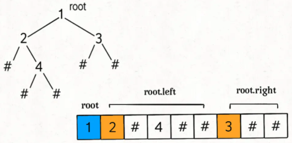
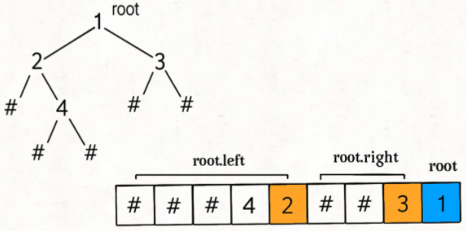
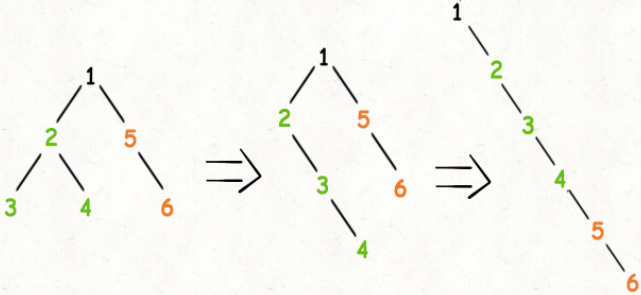
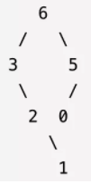
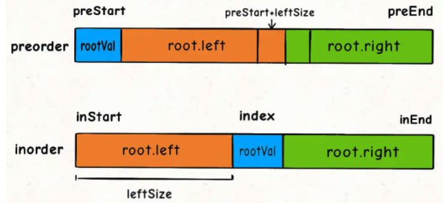
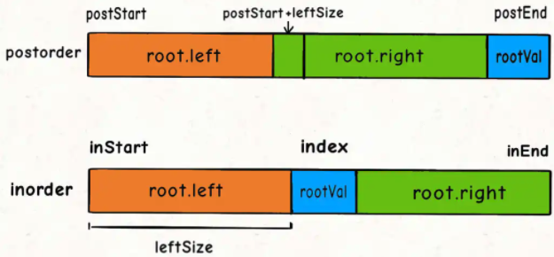

# Binary Tree 二叉树

------

- ## 基础二叉树算法

#### 二叉树节点总数

```java
public static int count(TreeNode root){
		if (root == null) 
      	return 0;
  	return 1 + count(root.left) + count(root.right);
}
```

#### 二叉树的遍历

```java
public ArrayList<Integer> preorderTraversalByRecursive (TreeNode root) {
    // write code here
    ArrayList<Integer> result = new ArrayList<Integer>();
    Traverse using one of the three below;
  	//preTra(root, result);
  	//inTra(root, result);
  	//postTra(root, result);
    return result;
}
```

1. ##### 前序遍历 preorder traverse(顺序：1root 2left 3right)

    

    ```java
    public void preTra (TreeNode node, ArrayList<Integer> res){
        if(node==null)
            return;
        res.add(node.val);
        preTra(node.left,res);
        preTra(node.right,res);
    }
    ```

    ##### 

2. ##### 中序遍历 inorder traverse (顺序：1left 2root 3right)

    ```java
    public void inTra(TreeNode node, ArrayList<Integer> res){
        if(node==null)
            return;
        inTra(node.left, res);
        res.add(node.val);
        inTra(node.right, res);
    }
    ```

    

3. ##### 后序遍历 postorder traverse (顺序：1left 2right 3root)

    

    ```java
    public void postTra(TreeNode node, ArrayList<Integer> res){
        if(node==null)
            return;
        postTra(node.left, res);
        postTra(node.right, res);
      	res.add(node.val);
    }
    ```

##### 

- ## [LC104.二叉树的最大深度](https://leetcode-cn.com/problems/maximum-depth-of-binary-tree/)

    ```wiki
    给定二叉树 [3,9,20,null,null,15,7]，
    		3
       / \
      9  20
        /  \
       15   7
    返回它的最大深度 3 
    ```

    ### <u>**Solution**</u>:

    ```java
    public static int maxDepth(TreeNode root){
      	if (root == null) 
          	return 0;
      	return Math.max(maxDepth(root.left), maxDepth(root.right)) + 1;
    }
    ```

- ##  [LC226.翻转二叉树](https://leetcode-cn.com/problems/invert-binary-tree/)

    ```wiki
    翻转一棵二叉树。
    
    示例：
    
    输入：
         4
       /   \
      2     7
     / \   / \
    1   3 6   9
    输出：
         4
       /   \
      7     2
     / \   / \
    9   6 3   1
    
    ```

    ### <u>**Solution:**</u>

    ```java
    public static TreeNode invertTree(TreeNode root) {
        if (root == null) 
          	return null;
      
    		//交换左右子节点
        TreeNode tmp = root.left;
        root.left = root.right;
        root.right = tmp;
    		//让左右子节点继续翻转他们的子节点
        invertTree(root.left);
        invertTree(root.right);
    
        return root;
        }
    ```

- ## [LC116.填充每个节点的下一个右侧节点指针](https://leetcode-cn.com/problems/populating-next-right-pointers-in-each-node/)

    给定一个 完美二叉树 ，其所有叶子节点都在同一层，每个父节点都有两个子节点。二叉树定义如下：

    ```java
    class Node {
        int val;
        Node *left;
        Node *right;
        Node *next;
    }
    ```

    填充它的每个 next 指针，让这个指针指向其下一个右侧节点。如果找不到下一个右侧节点，则将 next 指针设置为 NULL。

    初始状态下，所有 next 指针都被设置为 NULL。

    进阶：

    你只能使用常量级额外空间。
    使用递归解题也符合要求，本题中递归程序占用的栈空间不算做额外的空间复杂度。

    示例：

    输入：root = [1,2,3,4,5,6,7]
    输出：[1,#,2,3,#,4,5,6,7,#]
    解释：给定二叉树如图 A 所示，你的函数应该填充它的每个 next 指针，以指向其下一个右侧节点，如图 B 所示。序列化的输出按层序遍历排列，同一层节点由 next 指针连接，'#' 标志着每一层的结束。

    ### <u>**Solution**</u>:

    ```java
    public static Node connect(Node root) {
        if (root == null) 
          	return null;
        connectTwoNodes(root.left, root.right);
        return root;
        }
    public static void connectTwoNodes(Node leftNode, Node rightNode) {
        if (leftNode == null || rightNode == null) 
          	return;
    		//连接两个传入节点
        leftNode.next = rightNode;
    		//连接 两个传入节点 的 两个子节点
        connectTwoNodes(leftNode.left, leftNode.right);
        connectTwoNodes(rightNode.left, rightNode.right);
    		//连接跨越副节点的两个子节点
        connectTwoNodes(leftNode.right, rightNode.left);
    }
    ```

- ## [LC114. 二叉树展开为链表](https://leetcode-cn.com/problems/flatten-binary-tree-to-linked-list/)

    给你二叉树的根结点 root ，请你将它展开为一个单链表：

    展开后的单链表应该同样使用 TreeNode ，其中 right 子指针指向链表中下一个结点，而左子指针始终为 null 。
    展开后的单链表应该与二叉树 先序遍历 顺序相同。
    
    示例 1：
    
    输入：root = [1,2,5,3,4,null,6]
    输出：[1,null,2,null,3,null,4,null,5,null,6]
    
    示例 2：
    
    输入：root = []
    输出：[]
    
    示例 3：
    
    输入：root = [0]
    输出：[0]
    
    ### <u>**思路**</u>
    
    1、将 `root` 的左子树和右子树拉平
    
    2、将 `root` 的右子树接到左子树下方
    
    3、然后将整个左子树作为右子树
    
    
    
    ### <u>**Solution**</u>
    
    
    
    ```java
    public static void flatten(TreeNode root) {
        if (root == null) 
          	return;
        flatten(root.left);
        flatten(root.right);
    
        //记录原始的右子节点
        TreeNode originRight = root.right;
    
        //将左子树作为右子数，左子数置为空
        root.right = root.left;
        root.left = null;
    
        //将原先的右子树接到当前右子树末端
        while (root.right != null){
            root = root.right;
        }
        root.right = originRight;
    }
    ```

- ## [LC654. 最大二叉树](https://leetcode-cn.com/problems/maximum-binary-tree/)

    给定一个不含重复元素的整数数组 nums 。一个以此数组直接递归构建的 最大二叉树 定义如下：

    ​		1、二叉树的根是数组 nums 中的最大元素。
    ​		2、左子树是通过数组中 最大值左边部分 递归构造出的最大二叉树。
    ​		3、右子树是通过数组中 最大值右边部分 递归构造出的最大二叉树。

    返回有给定数组 nums 构建的 最大二叉树 。

    示例：

    输入：nums = [3,2,1,6,0,5]
    输出：[6,3,5,null,2,0,null,null,1]

    

    解释：递归调用如下所示：

    - [3,2,1,6,0,5] 中的最大值是 6 ，左边部分是 [3,2,1] ，右边部分是 [0,5] 。
        - [3,2,1] 中的最大值是 3 ，左边部分是 [] ，右边部分是 [2,1] 。
            - 空数组，无子节点。
            - [2,1] 中的最大值是 2 ，左边部分是 [] ，右边部分是 [1] 。
                - 空数组，无子节点。
                - 只有一个元素，所以子节点是一个值为 1 的节点。
        - [0,5] 中的最大值是 5 ，左边部分是 [0] ，右边部分是 [] 。
            - 只有一个元素，所以子节点是一个值为 0 的节点。
            - 空数组，无子节点。

    ### <u>**思路**</u>

    遍历数组找到最大值 `maxVal`及其索引，把根节点 `root` 做出来，然后对 `maxVal` 左边的数组和右边的数组 进行递归调用 构造 `root` 的左右子树。

    ```Java
    TreeNode constructMaximumBinaryTree(int[] nums) {
        // 找到数组中的最大值nums[maxValIdx]
        TreeNode root = new TreeNode(nums[maxValIdx]);
        // 递归调用构造左右子树
        root.left = constructMaximumBinaryTree(nums[0, maxValIdx-1]);
        root.right = constructMaximumBinaryTree(nums[maxValIdx+1, nums.length-1]);
        return root;
    }
    ```

    ### <u>**Solution**</u>

    ```java
    public TreeNode constructMaximumBinaryTree(int[] nums) {
            return build(nums, 0, nums.length-1); 
    }
    
    public TreeNode build(int[] nums, int lo, int hi ){
        if (!(lo <= hi)) 
          return null;
    
        //找到数组中的最大value及其index
        int maxVal = Integer.MIN_VALUE;
        int maxValIdx = -1;
        for (int i=lo; i<=hi; i++){
            if (nums[i]>maxVal){
              maxVal = nums[i];
              maxValIdx = i;
            }
        }
    
        //构造树的根
        TreeNode root = new TreeNode(maxVal);
        //define树的左子树
        root.left = build(nums, lo, maxValIdx-1);
        //define树的右子树
        root.right = build(nums, maxValIdx+1, hi);
    
        return root;
    }
    ```

    

- ## [105. 从前序与中序遍历序列构造二叉树](https://leetcode-cn.com/problems/construct-binary-tree-from-preorder-and-inorder-traversal/)

    根据一棵树的前序遍历与中序遍历构造二叉树。

    注意:
    你可以假设树中没有重复的元素。

    例如，给出

    前序遍历 preorder = [3,9,20,15,7]
    中序遍历 inorder = [9,3,15,20,7]
    返回如下的二叉树：

    ```wiki
     3
    / \
    9  20
    	/  \
     15   7
    ```

    函数签名：

    ```JAVA
    TreeNode buildTree(int[] inorder, int[] postorder)
    ```

    ### <u>**思路**</u>：递归construct root

    root值为preorder[0] = **inorder[rootValIdx]** (遍历inorder[]可找到root的值在inorder[]中的位置)

    root.left的元素总数：leftSize = rootValInIdx-inStart

    root.left 在preorder中的位置为preorder[preStart+1, preStart+1+leftSize-1]

    root.left 在inorder中的位置为inorder[inStart, rootValInIdx-1]

    root.right 在preorder中的位置为preorder[preStart+1+leftSize, preEnd ]

    root.right 在inorder中的位置为inorder[rootValInIdx+1, inEnd]

    

    ### <u>**Solution**</u>

    ```Java
    public TreeNode buildTree(int[] preorder, int[] inorder) {
            return build(preorder, 0, preorder.length-1,
                        inorder, 0, inorder.length-1);
    }
    
    public TreeNode build(int[] preorder, int preStart, int preEnd,
                          int[] inorder, int inStart, int inEnd){
        if (!(preStart <= preEnd))
          return null;
    
        //遍历inorder[] 找root的值在inorder中的位置
        int rootVal = preorder[preStart];
        int rootValInIdx = -1;
        for (int i=inStart; i<=inEnd; i++){
            if (inorder[i]==rootVal){
              rootValInIdx = i;
              break;
            }
        }
    
      //root.left的元素总数
      int leftSize = rootValInIdx - inStart;
    
      //构造左右子树
      TreeNode root = new TreeNode(rootVal);
      root.left = build(preorder, preStart+1, preStart+1+(leftSize-1),
                        inorder, inStart, rootValInIdx - 1);
      root.right = build(preorder, preStart+1+leftSize, preEnd,
                         inorder, rootValInIdx+1, inEnd);
    
      return root; 
    }
    ```

    

- ## [LC106. 从中序与后序遍历序列构造二叉树](https://leetcode-cn.com/problems/construct-binary-tree-from-inorder-and-postorder-traversal/)

    根据一棵树的中序遍历与后序遍历构造二叉树。

    注意:
    你可以假设树中没有重复的元素。

    例如，给出

    中序遍历 inorder = [9,3,15,20,7]
    后序遍历 postorder = [9,15,7,20,3]

    返回如下的二叉树：

    ```wiki
     3
    / \
    9  20
    	/  \
     15   7
    ```

    函数签名：

    ```JAVA
    TreeNode buildTree(int[] inorder, int[] postorder)
    ```

    

    ### <u>**思路**</u>

    

    ### <u>**Solution**</u>

    ```Java
    public TreeNode buildTree(int[] inorder, int[] postorder) {
      	return build(postorder, 0, postorder.length-1,
                        inorder, 0, inorder.length-1);
    }
    public TreeNode build(int[] postorder, int postStart, int postEnd,
                          int[] inorder, int inStart, int inEnd){
        if (!(postStart <= postEnd))
          return null;
    
        int rootVal = postorder[postEnd];
        int rootValInIdx = -1;
        for (int i=inStart; i<=inEnd; i++){
            if (inorder[i]==rootVal){
              rootValInIdx = i;
              break;
            }
        }
    
        int leftSize = rootValInIdx - inStart;
    
        TreeNode root = new TreeNode(rootVal);
        root.left = build(postorder, postStart, postStart+leftSize-1,
                          inorder, inStart, rootValInIdx-1);
        root.right = build(postorder, postStart+leftSize, postEnd-1,
                           inorder, rootValInIdx+1, inEnd);
        return root;
    }
    ```

- ## [LC652. 寻找重复的子树](https://leetcode-cn.com/problems/find-duplicate-subtrees/)

    给定一棵二叉树，返回所有重复的子树。对于同一类的重复子树，你只需要返回其中任意一棵的根结点即可。

    两棵树重复是指它们具有相同的结构以及相同的结点值。

    示例 1：

            1
           / \
          2   3
         /   / \
        4   2   4
           /
          4
    下面是两个重复的子树：

          2
         /
        4
    和

        4
    因此，你需要以列表的形式返回上述重复子树的根结点。

    函数签名如下：

    ```java
    List<TreeNode> findDuplicateSubtrees(TreeNode root);
    ```

    ### <u>**思路**</u>

    1、以我为根的这棵二叉树（子树）长啥样？

    2、以其他节点为根的子树都长啥样？

    3、对比子树们，并避免 重复添加 相同的子树 到结果List

    ### <u>**Solution**</u>

    ```java
    public List<TreeNode> findDuplicateSubtrees(TreeNode root) {
        //！！！注意list和hashmap的创建方式！
        List<TreeNode> res = new ArrayList<>();
        //存子树的样子及其出现频率
        Map<String, Integer> nodesFreq = new HashMap<>();
        postTraverse(root, res, nodesFreq);
        return res;
    }
    
    public String postTraverse(TreeNode root, List<TreeNode> res, Map<String, Integer> nodesFreq){
      	if (root == null)
          	return "#";
            
        String left = postTraverse(root.left, res, nodesFreq);
        String right = postTraverse(root.right, res, nodesFreq);
        String subtree = root.val + "," + left + ","+ right;
    
        //此子树未出现过
        if (nodesFreq.get(subtree)==null){
          	nodesFreq.put(subtree, 1);
          	return subtree;
        }
      
        Integer freq = nodesFreq.get(subtree);
        if (freq==1){
        		//此子树只出现过一次，添加到结果集
        		res.add(root);
        		//更新此子树的出现频率为2（相当于replace方法）
        		nodesFreq.put(subtree, freq+1);
        } else {
        		//此子树出现超过一次，不添加到结果集
        		nodesFreq.put(subtree, freq+1);
        }
      
        return subtree;
    }
    ```

    