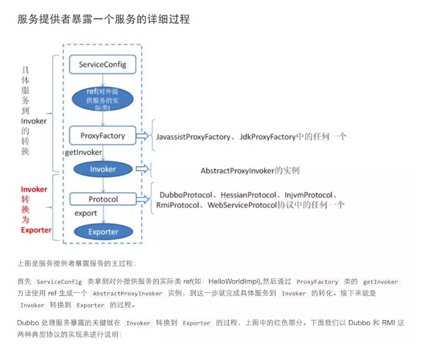
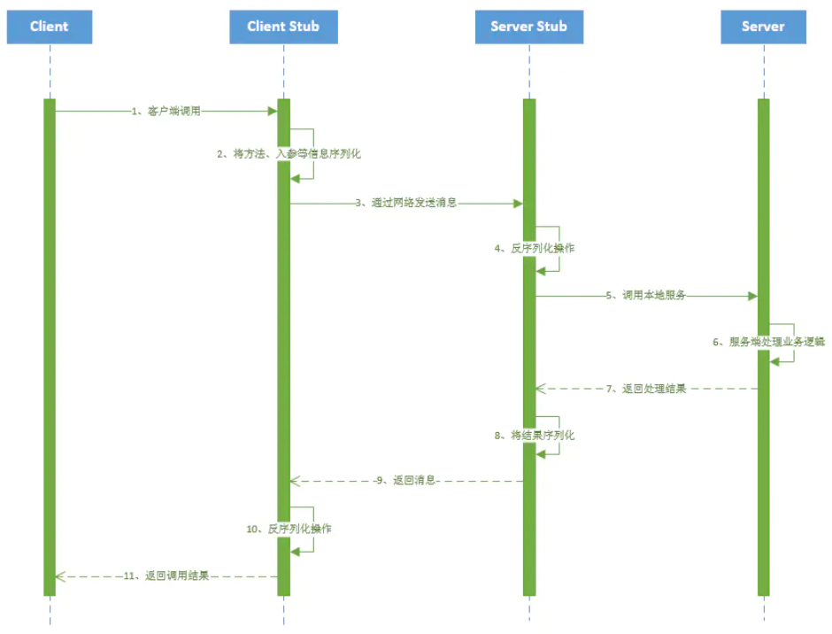
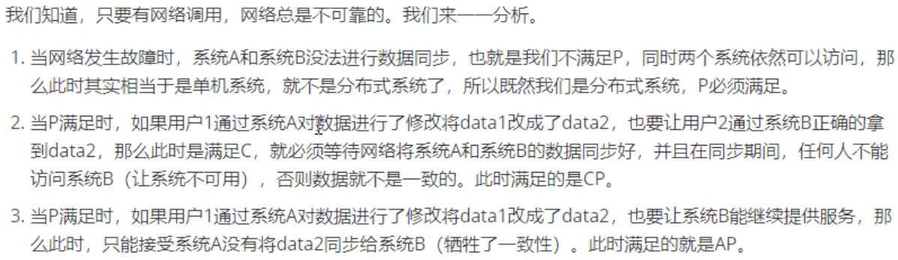
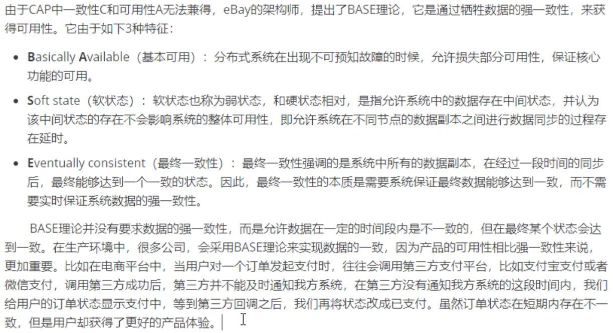
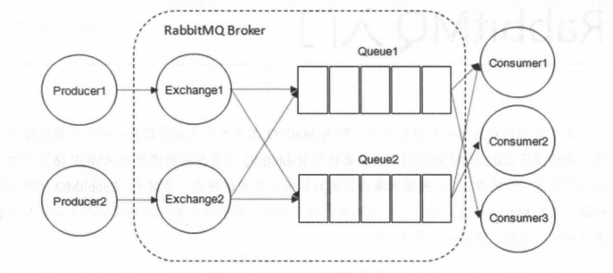
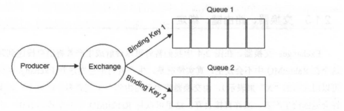
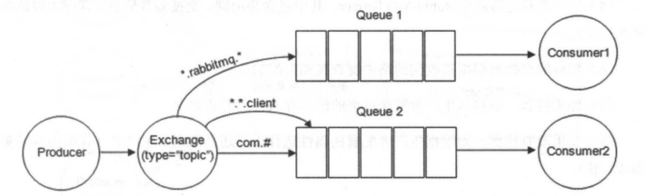

I hope I could code for fun, unfortunately I code to make a living -:) 

# Table of Contents

------

## 算法

要求我们的算法复杂度是 `O(NlogN)`，你想想怎么才能搞出一个对数级别的复杂度呢？

肯定得用到 [二分搜索]() 或者<u>二叉树</u>相关的数据结构，比如 `TreeMap`，`PriorityQueue` 之类的对吧。

再比如，有时候题目要求你的算法时间复杂度是 `O(MN)`，这可以联想到什么？

可以大胆猜测，常规解法是用 [回溯算法]() 暴力穷举，但是更好的解法是动态规划，而且是一个二维动态规划，需要一个 `M * N` 的二维 `dp` 数组，所以产生了这样一个时间复杂度。

### [排序&区间问题](./算法/排序&区间问题.md)

### [Binary Tree 二叉树算法](./算法/二叉树.md) 

### [Binary Search Tree 二叉搜索树](./二叉搜索树.md)

### [DFS 搜索回溯算法](./算法/DFS搜索回溯算法.md)

### [BFS 广度优先算法](./算法/BFS广度优先算法.md)

### [Binary Search二分查找](./算法/二分查找.md)

### [双指针](./算法/双指针.md)

子串匹配问题：子串一定是连续的

### [Dynamic Programming 动态规划](./算法/动态规划.md)

子序列问题：子序列不一定是连续的

### [分治](./算法/分治.md)

### [链表](./算法/链表.md)

### [数组](./算法/数组.md)

### [栈、队列、堆](./算法/栈队列堆.md)

### [缓存淘汰算法(LRU、LFU)](./算法/缓存淘汰算法.md)

### [位运算|数学|概率](./算法/位运算|数学|概率.md)

### [笔试题汇总](./算法/笔试题.md)

### [智力题场景题](./算法/智力题场景题.md)

## 计算机基础

### [Data Structure 数据结构面试/笔试题](./数据结构面试笔试题.md)

### [计算机网络](./计算机基础/计算机网络.md)

### [操作系统](./计算机基础/操作系统.md)


## 数据库

### [MySQL](./数据库/数据库(mysql).md)

### [Redis](./数据库./Redis.md)

## Java

### [基础](./Java/Java基础.md)

### [容器](./Java/Java容器.md)

### [并发](./Java/Java并发.md)

### [JVM](./Java/JVM.md)

### [Spring](./Java/Spring.md)

## 设计模式

代理模式！


## Others

1. 单引号代表char 双引号代表String！

2. 字符的ASCII可以用String.charAt()或者String.codePointAt()来计算；

3. Java的comparator中

    ```java
    @Override
     public int compare(A o1, A o2) {
         //升序
         //return o1.a - o2.a;
         //降序
         return o2.a - o1.a;
     }
    ```

    这里o1表示位于前面的对象，o2表示后面的对象

    - 返回-1（或负数），表示不需要交换01和02的位置，o1排在o2前面，asc
    - 返回1（或正数），表示需要交换01和02的位置，o1排在o2后面，desc

    为什么`return o2.a - o1.a;`就是降序了：

    首先o2是第二个元素，o1是第一个元素。无非就以下这些情况：
    ①： **`o2.a > o1.a`** : 那么此时**返回正数**，表示需要调整o1,o2的顺序，也就是需要把o2放到o1前面，这不就是降序了么。

    ②：**`o2.a < o1.a`** : 那么此时返回负数，表示不需要调整，也就是此时o1 比 o2大， 不还是降序么。

4. 当然，也可以用这种方法来**升序**，可以避免comparator中Integer边界值相减出bug的问题

    ```java
    //升序的情况下p1<p2（前面的小于后面的），但是这里！！！返回-1！！！
    Arrays.sort(points, (p1, p2) -> p1[1] < p2[1] ? -1 : 1);
    //pq降序
    PriorityQueue<int[]> maxHeap = new PriorityQueue<int[]>((o1,o2)->o2[1]-o1[1]);
    
    ```
    
    
    
5. **这里补充一点比较重要，但是容易被忽视掉的知识点：**

    - java 中的 `length`属性是针对数组说的,比如说你声明了一个数组,想知道这个数组的长度则用到了 length 这个属性.
    - java 中的 `length()` 方法是针对字符串说的,如果想看这个字符串的长度则用到 `length()` 这个方法.
    - java 中的 `size()` 方法是针对泛型集合说的,如果想看这个泛型有多少个元素,就调用此方法来查看!

6. 获取一个int的个位  十位 百位 千位

    ```java
    
        public static void takePlace(){
            int intNum = 2108;
            int thousand = intNum/1000;//千
            int hundred = intNum/100%10;//百
            int ten = intNum/10%10;//十
            int a= intNum%10;//个
        }
    ```

    

7. List转Array

    ```java
    //方法1,toArray()方法传入参数是泛型T, 但泛型必须是引用类型(Integer),不能是基本类型(int)
    String[] strs = list.toArray(new String[list.size()]);
    //方法2
    for(int i=0; i<list.size(); i++){
    		strs[i] = list.get(i);
    }
    ```

    

8. transient是为了让某对象不序列化, 比如LinkedList中的first节点和last节点

9. MESI协议

    https://blog.csdn.net/xiaowenmu1/article/details/89705740

10. PageHelper分页原理

    PageHelper.startPage(pageNum, pageSize);

    pageNum：页数（第几页）

    pageSize：每页的数据行数

    等于mysql> **SELECT \* \**FROM \*\*table LIMIT 5,10; // 检索记录行 6-15\*\**\***  

11. ###  RPC框架 vs http请求访问远程服务

     成熟的 RPC框架(Dubbo)还提供好了“**服务自动注册与发现**”、"智能**负载均衡**"、“可视化的**服务治理和运维**”、“运行期**流量调度**”等等功能，这些也算是选择 RPC 进行服务注册和发现的一方面原因吧！

     - http协议访问会将地址暴露给所有人, dubbo可以依赖注册中心治理服务并提供内部使用;

     - dubbo中 服务消费者，在消费时，去注册中心查询是否有机器提供对应的服务。例如调用orderService时，可以发现有192.168.1.1和192.168.1.2机器有提供对应的服务。消费者可以根据随机、轮训等规则选择调用哪个服务。在有服务上线或者下线时，注册中心可以对修改的信息进行通知。这样一套流程下来，就完美地实现的服务的动态部署，可以任意部署服务。nacos是目前来说很友好的一个注册中心，他提供了CP+AP。

     - 而http服务并不能提供这些信息, 需要手动维护

12. ### dubbo暴露服务

     https://www.cnblogs.com/xyj179/p/11490417.html

     

13. ### RPC框架的实现原理？

     dubbo https://www.iteye.com/blog/manzhizhen-2314514

     https://www.jianshu.com/p/78f72ccf0377

     主要有以下几个步骤：

     #### 1、建立通信

     首先要解决通讯的问题：即A机器想要调用B机器，首先得建立起通信连接。主要是通过在客户端和服务器之间建立TCP连接，远程过程调用的所有相关的数据都在这个连接里面进行传输交换。

     通常这个连接可以是按需连接（`需要调用的时候就先建立连接，调用结束后就立马断掉`），也可以是长连接（`客户端和服务器建立起连接之后保持长期持有，不管此时有无数据包的发送，可以配合心跳检测机制定期检测建立的连接是否存活有效`），多个远程过程调用共享同一个连接。

     #### 2、服务寻址

     解决寻址的问题：即A机器上的应用A要调用B机器上的应用B，那么此时对于A来说如何告知底层的RPC框架所要调用的服务具体在哪里呢？

     通常情况下我们需要提供B机器（主机名或IP地址）以及特定的端口，然后指定调用的方法或者函数的名称以及入参出参等信息，这样才能完成服务的一个调用。比如基于Web服务协议栈的RPC，就需要提供一个endpoint URI，或者是从UDDI服务上进行查找。如果是RMI调用的话，还需要一个RMI Registry来注册服务的地址。

     #### 3、网络传输

     ##### 3.1、序列化(如fastjson)

     当A机器上的应用发起一个RPC调用时，调用方法和其入参等信息需要通过底层的网络协议如TCP传输到B机器，由于网络协议是基于二进制的，所有我们传输的参数数据都需要先进行序列化（Serialize）或者编组（marshal）成二进制的形式才能在网络中进行传输。然后通过寻址操作和网络传输将序列化或者编组之后的二进制数据发送给B机器。

     ##### 3.2、反序列化

     当B机器接收到A机器的应用发来的请求之后，又需要对接收到的参数等信息进行反序列化操作（序列化的逆操作），即将二进制信息恢复为内存中的表达方式，然后再找到对应的方法（寻址的一部分）进行**本地调用（一般是通过生成代理Proxy去调用**, 通常会有**JDK动态代理、CGLIB动态代理**、Javassist生成字节码技术等），之后得到调用的返回值。

     > 其实就是代理类为被代理类预处理消息、过滤消息并在此之后将消息转发给被代理类，之后还能进行消息的后置处理。代理类和被代理类通常会存在关联关系(即上面提到的持有的被带离对象的引用)，代理类本身不实现服务，而是通过调用被代理类中的方法来提供服务。

     #### 4、server处理后返回结果给A

     B机器进行本地调用（通过代理Proxy）之后得到了返回值，此时还需要再把返回值发送回A机器，同样也需要经过序列化操作，然后再经过网络传输将二进制数据发送回A机器，而当A机器接收到这些返回值之后，则再次进行反序列化操作，恢复为内存中的表达方式，最后再交给A机器上的应用进行相关处理（一般是业务逻辑处理操作）。

     通常，经过以上四个步骤之后，一次完整的RPC调用算是完成了，另外可能因为网络抖动等原因需要重试等。

     

14. **CAP**

     - C一致性: 分布式系统中数据的一致性
     - A可用性: 分布式系统是否可用
     - P分区容错性: 分布式系统出现网络问题时的容错性

     CAP理论是指,在分布式(P)系统中不能同时保证C和A, 也就是要么AP(保证高可用,牺牲部分数据一致性), 要么CP(保证数据一致性, 牺牲可用性)

     

15. BASE指的是分布式系统: 

      不用保证强一致性, 只要做到最终一致性; 

      不用保证一直可用, 保证基本可用即可

      

     1. RAFT (CP)强一致性

      https://www.cnblogs.com/mindwind/p/5231986.html

      文章https://www.cnblogs.com/xybaby/p/10124083.html

      对应视频, 案例(总共七个,同个up主):https://www.bilibili.com/video/BV1wt4y1172s?spm_id_from=333.999.0.0

      raft将共识问题分解成两个相对独立的问题，leader election，log replication。流程是先选举出leader，然后leader负责复制、提交log（log中包含command）

       为了在任何异常情况下系统不出错，即满足safety属性，对leader election，log replication两个子问题有诸多约束

     leader election约束：

     - 同一任期内最多只能投一票，先来先得
     - 选举人必须比自己知道的更多（比较term，log index）

     log replication约束：

     - 一个log被复制到大多数节点，就是committed，保证不会回滚
     - leader一定包含最新的committed log，因此leader只会追加日志，不会删除覆盖日志
     - 不同节点，某个位置上日志相同，那么这个位置之前的所有日志一定是相同的
     - Raft never commits log entries from previous terms by counting replicas.

16. Nacos支持CP+AP模式，即Nacos可以根据配置识别为CP模式或AP模式，默认是AP模式。

     以下的client指服务的消费方

     如果注册Nacos的client节点注册时ephemeral=true，那么Nacos集群对这个client节点的效果就是AP，采用**distro**协议实现；

     而注册Nacos的client节点注册时ephemeral=false，那么Nacos集群对这个client节点的效果就是CP的，采用**raft**协议实现。

     根据client注册时的属性，AP，CP同时混合存在，只是对不同的client节点效果不同。Nacos可以很好的解决不同场景的业务需求。
     

17. nacos挂了怎么办

     只是无法获取最新的, 但是本地还有旧的

     使用本地缓存中的服务信息列表, 或者将服务信息持久化, 或者在本地写一份, 或者定期拷贝注册中心的信息?

     如果是单点的注册中心可以考虑采用集群来提高可用性

18. 幂等性

      **一、幂等性概念**
      在编程中.一个幂等操作的特点是其任意多次执行所产生的影响均与一次执行的影响相同。幂等函数，或幂等方法，是指可以使用相同参数重复执行，并能获得相同结果的函数。这些函数不会影响系统状态，也不用担心重复执行会对系统造成改变。例如，“getUsername()和setTrue()”函数就是一个幂等函数. 更复杂的操作幂等保证是利用唯一交易号(流水号)实现.

      我的理解：幂等就是一个操作，不论执行多少次，产生的效果和返回的结果都是一样的。

      **二、幂等性场景**
      1、查询操作：查询一次和查询多次，在数据不变的情况下，查询结果是一样的。select是天然的幂等操作；

      2、删除操作：删除操作也是幂等的，删除一次和多次删除都是把数据删除。(注意可能返回结果不一样，删除的数据不存在，返回0，删除的数据多条，返回结果多个) ；

      3、唯一索引：防止新增脏数据。比如：支付宝的资金账户，支付宝也有用户账户，每个用户只能有一个资金账户，怎么防止给用户创建资金账户多个，那么给资金账户表中的用户ID加唯一索引，所以一个用户新增成功一个资金账户记录。要点：唯一索引或唯一组合索引来防止新增数据存在脏数据（当表存在唯一索引，并发时新增报错时，再查询一次就可以了，数据应该已经存在了，返回结果即可）；

      4、token机制：防止页面重复提交。

      原理上通过session token来实现的(**也可以通过redis来实现**)。当客户端请求页面时，服务器会生成一个随机数Token，并且将Token放置到session当中，然后将Token发给客户端（一般通过构造hidden表单）。
      下次客户端提交请求时，Token会随着表单一起提交到服务器端。

      服务器端第一次验证相同过后，会将session中的Token值更新下，若用户重复提交，第二次的验证判断将失败，因为用户提交的表单中的Token没变，但服务器端session中Token已经改变了。

      5、悲观锁
      获取数据的时候加锁获取。select * from table_xxx where id='xxx' for update; 注意：id字段一定是主键或者唯一索引，不然是锁表，会死人的；悲观锁使用时一般伴随事务一起使用，数据锁定时间可能会很长，根据实际情况选用；

      6、乐观锁——乐观锁只是在更新数据那一刻锁表，其他时间不锁表，所以相对于悲观锁，效率更高。乐观锁的实现方式多种多样可以通过version或者其他状态条件：
      \1. 通过版本号实现update table_xxx set name=#name#,version=version+1 where version=#version#如下图(来自网上)；
      \2. 通过条件限制 update table_xxx set avai_amount=avai_amount-#subAmount# where avai_amount-#subAmount# >= 0要求：quality-#subQuality# >= ，这个情景适合不用版本号，只更新是做数据安全校验，适合库存模型，扣份额和回滚份额，性能更高；

      7、分布式锁

      如果是分布是系统，构建全局唯一索引比较困难，例如唯一性的字段没法确定，这时候可以引入分布式锁，通过第三方的系统(redis或zookeeper)，在业务系统插入数据或者更新数据，获取分布式锁，然后做操作，之后释放锁，这样其实是把多线程并发的锁的思路，引入多多个系统，也就是分布式系统中得解决思路。要点：某个长流程处理过程要求不能并发执行，可以在流程执行之前根据某个标志(用户ID+后缀等)获取分布式锁，其他流程执行时获取锁就会失败，也就是同一时间该流程只能有一个能执行成功，执行完成后，释放分布式锁(分布式锁要第三方系统提供)；

      8、select + insert
      并发不高的后台系统，或者一些任务JOB，为了支持幂等，支持重复执行，简单的处理方法是，先查询下一些关键数据，判断是否已经执行过，在进行业务处理，就可以了。注意：核心高并发流程不要用这种方法；

      9、状态机幂等
      在设计单据相关的业务，或者是任务相关的业务，肯定会涉及到状态机(状态变更图)，就是业务单据上面有个状态，状态在不同的情况下会发生变更，一般情况下存在有限状态机，这时候，如果状态机已经处于下一个状态，这时候来了一个上一个状态的变更，理论上是不能够变更的，这样的话，保证了有限状态机的幂等。注意：订单等单据类业务，存在很长的状态流转，一定要深刻理解状态机，对业务系统设计能力提高有很大帮助

      10、对外提供接口的api如何保证幂等
      如银联提供的付款接口：需要接入商户提交付款请求时附带：source来源，seq序列号；source+seq在数据库里面做唯一索引，防止多次付款(并发时，只能处理一个请求) 。
      重点：对外提供接口为了支持幂等调用，接口有两个字段必须传，一个是来源source，一个是来源方序列号seq，这个两个字段在提供方系统里面做联合唯一索引，这样当第三方调用时，先在本方系统里面查询一下，是否已经处理过，返回相应处理结果；没有处理过，进行相应处理，返回结果。注意，为了幂等友好，一定要先查询一下，是否处理过该笔业务，不查询直接插入业务系统，会报错，但实际已经处理了。

      **三、总结**
      幂等与你是不是分布式高并发还有JavaEE都没有关系。关键是你的操作是不是幂等的。一个幂等的操作典型如：把编号为5的记录的A字段设置为0这种操作不管执行多少次都是幂等的。一个非幂等的操作典型如：把编号为5的记录的A字段增加1这种操作显然就不是幂等的。要做到幂等性，从接口设计上来说不设计任何非幂等的操作即可。譬如说需求是：当用户点击赞同时，将答案的赞同数量+1。改为：当用户点击赞同时，确保答案赞同表中存在一条记录，用户、答案。赞同数量由答案赞同表统计出来。总之幂等性应该是合格程序员的一个基因，在设计系统时，是首要考虑的问题，尤其是在像支付宝，银行，互联网金融公司等涉及的都是钱的系统，既要高效，数据也要准确，所以不能出现多扣款，多打款等问题，这样会很难处理，用户体验也不好。

19. rabbitmq

     https://snailclimb.gitee.io/javaguide/#/docs/system-design/distributed-system/message-queue/RabbitMQ%E5%85%A5%E9%97%A8%E7%9C%8B%E8%BF%99%E4%B8%80%E7%AF%87%E5%B0%B1%E5%A4%9F%E4%BA%86

     RabbitMQ 整体上是一个生产者与消费者模型，主要负责接收、存储和转发消息。可以把消息传递的过程想象成：当你将一个包裹送到邮局，邮局会暂存并最终将邮件通过邮递员送到收件人的手上，RabbitMQ就好比由邮局、邮箱和邮递员组成的一个系统。从计算机术语层面来说，RabbitMQ 模型更像是一种交换机模型。

     下面再来看看图1—— RabbitMQ 的整体模型架构。

     

     RabbitMQ 中通过 **Binding(绑定)** 将 **Exchange(交换器)** 与 **Queue(消息队列)** 关联起来，在绑定的时候一般会指定一个 **BindingKey(绑定建)** ,这样 RabbitMQ 就知道如何正确将消息路由到队列了,如下图所示。一个绑定就是基于路由键将交换器和消息队列连接起来的路由规则，所以可以将交换器理解成一个由绑定构成的路由表。Exchange 和 Queue 的绑定可以是多对多的关系。

     Binding(绑定) 示意图：

     

     生产者将消息发送给交换器时，需要一个RoutingKey,当 BindingKey 和 RoutingKey 相匹配时，消息会被路由到对应的队列中。在绑定多个队列到同一个交换器的时候，这些绑定允许使用相同的 BindingKey。

     > BindingKey 并不是在所有的情况下都生效，它依赖于交换器类型，比如fanout类型的交换器就会无视，而是将消息路由到所有绑定到该交换器的队列中。

     RabbitMQ 常用的 Exchange Type 有 **fanout**、**direct**、**topic**、**headers** 这四种（AMQP规范里还提到两种 Exchange Type，分别为 system 与 自定义，这里不予以描述）。

     ##### [① fanout](https://snailclimb.gitee.io/javaguide/#/docs/system-design/distributed-system/message-queue/RabbitMQ入门看这一篇就够了?id=①-fanout)

     fanout 类型的Exchange路由规则非常简单，它会把所有发送到该Exchange的消息路由到所有与它绑定的Queue中，不需要做任何判断操作，所以 fanout 类型是所有的交换机类型里面速度最快的。fanout 类型常用来广播消息。

     ##### [② direct](https://snailclimb.gitee.io/javaguide/#/docs/system-design/distributed-system/message-queue/RabbitMQ入门看这一篇就够了?id=②-direct)

     direct 类型的Exchange路由规则也很简单，它会把消息路由到那些 Bindingkey 与 RoutingKey 完全匹配的 Queue 中。

     

     以上图为例，如果发送消息的时候设置路由键为“warning”,那么消息会路由到 Queue1 和 Queue2。如果在发送消息的时候设置路由键为"Info”或者"debug”，消息只会路由到Queue2。如果以其他的路由键发送消息，则消息不会路由到这两个队列中。

     direct 类型常用在处理有优先级的任务，根据任务的优先级把消息发送到对应的队列，这样可以指派更多的资源去处理高优先级的队列。

     ##### [③ topic](https://snailclimb.gitee.io/javaguide/#/docs/system-design/distributed-system/message-queue/RabbitMQ入门看这一篇就够了?id=③-topic)

     前面讲到direct类型的交换器路由规则是完全匹配 BindingKey 和 RoutingKey ，但是这种严格的匹配方式在很多情况下不能满足实际业务的需求。topic类型的交换器在匹配规则上进行了扩展，它与 direct 类型的交换器相似，也是将消息路由到 BindingKey 和 RoutingKey 相匹配的队列中，但这里的匹配规则有些不同，它约定：

     - RoutingKey 为一个点号“．”分隔的字符串（被点号“．”分隔开的每一段独立的字符串称为一个单词），如 “com.rabbitmq.client”、“java.util.concurrent”、“com.hidden.client”;
     - BindingKey 和 RoutingKey 一样也是点号“．”分隔的字符串；
     - BindingKey 中可以存在两种特殊字符串“*”和“#”，用于做模糊匹配，其中“*”用于匹配一个单词，“#”用于匹配多个单词(可以是零个)。

     

     以上图为例：

     - 路由键为 “com.rabbitmq.client” 的消息会同时路由到 Queue1 和 Queue2;
     - 路由键为 “com.hidden.client” 的消息只会路由到 Queue2 中；
     - 路由键为 “com.hidden.demo” 的消息只会路由到 Queue2 中；
     - 路由键为 “java.rabbitmq.demo” 的消息只会路由到 Queue1 中；
     - 路由键为 “java.util.concurrent” 的消息将会被丢弃或者返回给生产者（需要设置 mandatory 参数），因为它没有匹配任何路由键。

     ##### [④ headers(不推荐)](https://snailclimb.gitee.io/javaguide/#/docs/system-design/distributed-system/message-queue/RabbitMQ入门看这一篇就够了?id=④-headers不推荐)

     headers 类型的交换器不依赖于路由键的匹配规则来路由消息，而是根据发送的消息内容中的 headers 属性进行匹配。在绑定队列和交换器时指定一组键值对，当发送消息到交换器时，RabbitMQ会获取到该消息的 headers（也是一个键值对的形式)，对比其中的键值对是否完全匹配队列和交换器绑定时指定的键值对，如果完全匹配则消息会路由到该队列，否则不会路由到该队列。headers 类型的交换器性能会很差，而且也不实用，基本上不会看到它的存在。

20. rabbitmq顺序消费

     **出现顺序错乱的场景**

     
     一个queue，有多个consumer去消费，这样就会造成顺序的错误，consumer从MQ里面读取数据是有序的，但是每个consumer的执行时间是不固定的，无法保证先读到消息的consumer一定先完成操作，这样就会出现消息并没有按照顺序执行，造成数据顺序错误。

     **保证消息的消费顺序**

     

     拆分多个queue(这样做是为了不浪费消费者的数量)，每个queue一个consumer，就是多一些queue而已，确实是麻烦点；这样也会造成吞吐量下降，可以在消费者内部采用多线程的方式取消费。

21. 八股文学习

      JAVA方面首先得会基础(随便看什么书，培训班教程也可以)，并发的话如果只是应付面试极客时间有一个课程叫做JAVA并发(好像是这么个名字，忘了)，jvm就那本经典的深入理解JAVA虚拟机(重点是内存管理，垃圾回收，常用监测工具，类文件结构，类加载机制)，然后有时间可以看看effective JAVA这本书，可能要很多面试会用到的知识。最后知乎或者博客搜一搜hashMap,concurrenthashMap,ArrayList,LinkedList等到源码分析，有闲心可以自己写一个hashMap,Lru,Lfu(有些面试可能会让你写)

      JAVA框架没啥说的，我就学了spring和netty,我没看spring源码,主要是觉得它太重了不想学。学的时候主要注意一些设计思想和设计模式。推荐github JAVAguide项目，有这方面的内容。netty我是看的李林峰的Netty权威指南。

      中间件，mysql强烈推荐极客时间的mysql实战45讲。当然前提是自己先得有一些数据库的基本知识。redis我以前刚学看了黑马的redis教程，还行。然后如果要对其原理了解的话，还要redis设计与实现这本书，重点是看一下数据结构和对象这一章节。然后有个比较重要的问题是redis和mysql双写一致性问题。可以去知乎搜博客。以及用redis如何写分布式锁；redis如何实现简单消息队列，有什么缺陷。zookeeper如果你项目没用的话，看看网上的教程简单了解下就行了，然后知道怎么用它写分布式锁或者分布式id. 消息队列分理论和具体中间件选型，理论大致有：为什么用消息队列，消息队列的推拉模式 ，如何保证消息不丢，如何处理重复消息，如何处理消息堆积等。然后具体我学的是kafka,看了极客时间的有一个课程。

      计网和操作系统，如果是科班的强烈推荐公众号“小林code”里的操作系统和计网两本电子书，(小林code打钱)，真的是总结的很好。不是科班或者计网和操作系统学的不够好，那可以先买个考研的王道教程看一看重点章节。

      设计模式，我发现一个很好的网站学习设计模式，百度搜索“设计模式与重构”，应该能搜到，是个ui很好看的国外网站，每一种设计模式都有具体的情景，框架图，优缺点分析，然后有各种语言实现的小demo.不过设计模式不能单学理论，比如你学一个框架的时候，就要知道哪部分用了什么设计模式，为什么这么设计，比如netty的reactor和责任链，spring的动态代理等等。个人感觉单例模式比较容易问道，有5中不同特点的实现方法(JAVA)，可以知乎或者博客搜索学习。

      至于分布式嘛，其实比较玄学，对于本科生来说其实基本难有高并发的实战经验。要应付面试造火箭，那么总体来说就是掌握分布式基本理论（CAP,BASE等），分布式id，分布式事务、分布式锁、分布式算法(Raft)、分布式缓存。上述知识我一方面看的极客时间的分布式教程，一方面是积累的各种博客。然后，分布式架构相关的，可以从RPC入手，学习其核心原理、以及服务治理相关内容，我看了李林峰的分布式服务框架这本书以及极客时间的RPC相关的一门课程。

      分布式如果不准备停留在吹牛逼的层面，时间足够，那么推荐MIT的6.824，照着课程和论文手撸K-V数据库和RAFT协议，很有帮助。

      作者：scufish
      链接：https://leetcode-cn.com/circle/discuss/JlrHm3/
      来源：力扣（LeetCode）
      著作权归作者所有。商业转载请联系作者获得授权，非商业转载请注明出处。


With Respect to

剑指offer

剑指offer题解 Java版：https://github.com/CyC2018/CS-Notes/blob/master/notes/%E5%89%91%E6%8C%87%20Offer%20%E9%A2%98%E8%A7%A3%20-%20%E7%9B%AE%E5%BD%95.md

labuladong的算法小抄：https://labuladong.gitbook.io/algo/

JavaGuide：https://github.com/Snailclimb/JavaGuide

架构风清扬：https://www.bilibili.com/video/BV1k74118721
