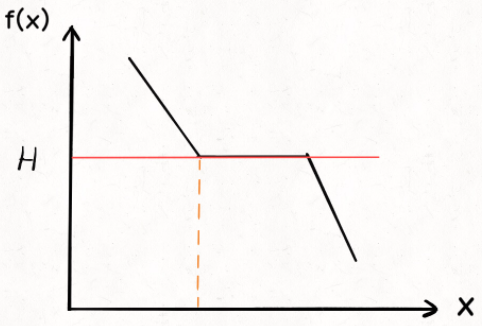

# Binary Search 二分查找

[toc]

------

## [LC704. 二分查找](https://leetcode-cn.com/problems/binary-search/)

给定一个 n 个元素有序的（升序）整型数组 nums 和一个目标值 target  ，写一个函数搜索 nums 中的 target，如果目标值存在返回下标，否则返回 -1。


示例 1:

输入: nums = [-1,0,3,5,9,12], target = 9
输出: 4
解释: 9 出现在 nums 中并且下标为 4
示例 2:

输入: nums = [-1,0,3,5,9,12], target = 2
输出: -1
解释: 2 不存在 nums 中因此返回 -1

函数签名：

```java
public int binarySearch(int[] nums, int target);
```

### <u>**Solution**</u>

```java
		public int binarySearch(int[] nums, int target) {
        int left = 0, right = nums.length-1;
        while(left<=right){//终止条件是 left == right + 1
            //计算 mid 时需要防止溢出，代码中 left + (right - left) / 2 就和 (left + right) / 2 的结果相同
            int mid = left + (right-left)/2;
            if(nums[mid]<target){
                left = mid + 1;
            }else if(nums[mid]>target){
                right = mid - 1;
            }else if(nums[mid]==target){
                return mid;
            }
        }
        return -1;
    }
```

## [LC34. 在排序数组中查找元素的第一个和最后一个位置](https://leetcode-cn.com/problems/find-first-and-last-position-of-element-in-sorted-array/)

给定一个按照升序排列的整数数组 nums，和一个目标值 target。找出给定目标值在数组中的开始位置和结束位置。

如果数组中不存在目标值 target，返回 [-1, -1]。

进阶：

你可以设计并实现时间复杂度为 O(log n) 的算法解决此问题吗？


示例 1：

输入：nums = [5,7,7,8,8,10], target = 8
输出：[3,4]
示例 2：

输入：nums = [5,7,7,8,8,10], target = 6
输出：[-1,-1]
示例 3：

输入：nums = [], target = 0
输出：[-1,-1]

函数签名：

```java
public int[] binarySearchRange(int[] nums, int target);
```

### <u>**思路**</u>

寻找这个值的**左边界**和**右边界**，详情：https://labuladong.gitbook.io/algo/mu-lu-ye-1/mu-lu-ye-3/er-fen-cha-zhao-xiang-jie

```java
		public int leftBound(int[] nums, int target){
        int left = 0, right = nums.length-1;
        while(left<=right){
            int mid = left + (right-left)/2;
            if(nums[mid]<target)
                left = mid + 1;
            else if(nums[mid]>target)
                right = mid -1;
            else if(nums[mid]==target)
                // 别返回，锁定左侧边界
                right = mid - 1;
                //如果此时mid为左边界，left会一直加1，直到left==right时，left+1 = 此时的mid
        }
        // 最后要检查 left 越界的情况
        if(left>=nums.length || nums[left]!=target)
            return -1;
        return left;
    }
    public int rightBound(int[] nums, int target){
        int left = 0, right = nums.length-1;
        while(left<=right){
            int mid = left + (right-left)/2;
            if(nums[mid]<target)
                left = mid + 1;
            else if(nums[mid]>target)
                right = mid -1;
            else if(nums[mid]==target)
                // 别返回，锁定右侧边界
                left = mid + 1;
                //如果此时mid为右边界，right会一直减1，直到right==left时，right-1 = 此时的mid
        }
        // 最后要检查 right 越界的情况
        if(right<0 || nums[right]!=target)
            return -1;
        return right;
    }
    public int[] binarySearchRange(int[] nums, int target) {
        int leftBound = leftBound(nums, target);
        int rightBound = rightBound(nums, target);
        return new int[]{leftBound, rightBound};
    }
```

## 二分搜索的套路框架

```java
// 函数 f 是关于自变量 x 的单调函数
int f(int x) {
    // ...
}

// 主函数，在 f(x) == target 的约束下求 x 的最值
int solution(int[] nums, int target) {
    if (nums.length == 0) return -1;
    // 问自己：自变量 x 的最小值是多少？
    int left = ...;
    // 问自己：自变量 x 的最大值是多少？
    int right = ... + 1;

    while (left < right) {
        int mid = left + (right - left) / 2;
        if (f(mid) == target) {
            // 问自己：题目是求左边界还是右边界？
            // ...
        } else if (f(mid) < target) {
            // 问自己：怎么让 f(x) 大一点？
            // ...
        } else if (f(mid) > target) {
            // 问自己：怎么让 f(x) 小一点？
            // ...
        }
    }
    return left;
}
```

## [LC875. 爱吃香蕉的珂珂](https://leetcode-cn.com/problems/koko-eating-bananas/)

珂珂喜欢吃香蕉。这里有 N 堆香蕉，第 i 堆中有 piles[i] 根香蕉。警卫已经离开了，将在 **H 小时后回来**。

珂珂可以决定她吃香蕉的速度 K （单位：根/小时）。每个小时，她将会选择一堆香蕉，从中吃掉 K 根。如果这堆香蕉少于 K 根，她将吃掉这堆的所有香蕉，然后这一小时内不会再吃更多的香蕉。  

珂珂喜欢慢慢吃，但仍然想在警卫回来前吃掉所有的香蕉。

返回她可以在 **H 小时内**吃掉所有香蕉的**最小速度 K**（K 为整数）。

 

示例 1：

输入: piles = [3,6,7,11], H = 8
输出: 4
示例 2：

输入: piles = [30,11,23,4,20], H = 5
输出: 30
示例 3：

输入: piles = [30,11,23,4,20], H = 6
输出: 23

函数签名：

​	

```java
public int minEatingSpeed(int[] piles, int h);
```

### <u>**思路**</u>

1、珂珂**吃香蕉的速度**就是自变量 `x`，最小值为`left`，最大值为`right`

珂珂吃香蕉的速度最小是多少？多大是多少？

显然，最小速度应该是 1，最大速度是 `piles` 数组中元素的最大值，因为每小时最多吃一堆香蕉，胃口再大也白搭嘛。

这里可以有两种选择，要么你用一个 for 循环去遍历 `piles` 数组，计算最大值，要么你看题目给的约束，`piles` 中的元素取值范围是多少，然后给 `right` 初始化一个取值范围之外的值。

我选择第二种，题目说了 `1 <= piles[i] <= 10^9`，那么我就可以确定二分搜索的区间边界：


```java
public int minEatingSpeed(int[] piles, int H) {
    int left = 1;
    // 注意，right 是开区间，所以再加一
    int right = 1000000000 + 1;
    // ...
}
```

2、在 `x` 上单调的函数关系 `f(x)` 是什么？

​		显然，吃香蕉的速度x越快，吃完所有香蕉堆所需的时间f(x)就越少，速度和时间就是一个单调函数关系。

```java
// 定义：速度为 x 时，需要 f(x) 小时吃完所有香蕉
// f(x) 随着 x 的增加单调递减
int f(int[] piles, int x) {
    int hours = 0;
    for (int i = 0; i < piles.length; i++) {
        hours += piles[i] / x;
        if (piles[i] % x > 0) {
            hours += 1;
        }
    }
    return hours;
}
```

3、`target` 就很明显了，吃香蕉的时间限制 `H` 自然就是 `target`，是对 `f(x)` 返回值的最大约束。

4、现在我们确定了自变量 `x` 是吃香蕉的速度，`f(x)` 是单调递减的函数，`target` 就是吃香蕉的时间限制 `H`，题目要我们计算最小速度，也就是 `x` **要尽可能小**：这就是搜索左侧边界的二分搜索嘛，只不过left和right的取值需要自行判断



### <u>**Solution**</u>

```java
		//f = timeForEatingOut
    // 定义：速度为 k 时，需要 f(x) 小时吃完所有香蕉
    // f(k) 随着 k 的增加单调递 减
    public int timeForEatingOut(int[] piles, int k){
        int hrs = 0;
        for(int i=0; i<piles.length; i++){
            hrs += piles[i]/k;
            if(piles[i]%k!=0)
                hrs+=1; 
        }
        return hrs;
    }
    public int minEatingSpeed(int[] piles, int h) {
        int left = 1;
        int right = 1000000000;//也可遍历piles找到最大值

        while(left<=right){
            int mid = left + (right-left)/2;
            //实际吃完的时间小于规定时间，说明k太大（吃的太快），k的值需要减小（右边界减小）
            if(timeForEatingOut(piles, mid)<h)
                right = mid - 1;
            //实际吃完的时间大于规定时间，说明k太小（吃的太慢），k的值需要增大（左边界加大）
            else if(timeForEatingOut(piles, mid)>h)
                left = mid + 1;
            //实际吃完的时间刚刚好，k的值可以继续减小（收缩右边界来搜索左侧边界）
            else if(timeForEatingOut(piles, mid)==h)
                right = mid -1;
        }
        return left;
    }
```

可以把minEatingSpeed函数中多余的 if 分支合并一下，最终代码如下

```java
    public int minEatingSpeed(int[] piles, int H) {
        int left = 1;
        int right = 1000000000 + 1;

        while (left < right) {
            int mid = left + (right - left) / 2;
            if (f(piles, mid) <= H) {
                right = mid;
            } else {
                left = mid + 1;
            }
        }
        return left;
    }
```

## [LC1011. 在 D 天内送达包裹的能力](https://leetcode-cn.com/problems/capacity-to-ship-packages-within-d-days/)

传送带上的包裹必须在 **D 天**内从一个港口运送到另一个港口。

传送带上的第 **i** 个包裹的**重量**为 **weights[i]**。每一天，我们都会按给出重量的顺序往传送带上装载包裹。我们装载的重量不会超过**船的最大运载重量**。

请注意，货物必须按照给定的顺序装运。

返回能在 D 天内将传送带上的所有包裹送达的**船的最低运载能力**。

 

示例 1：

输入：weights = [1,2,3,4,5,6,7,8,9,10], D = 5
输出：15
解释：
船舶最低载重 15 就能够在 5 天内送达所有包裹，如下所示：
第 1 天：1, 2, 3, 4, 5
第 2 天：6, 7
第 3 天：8
第 4 天：9
第 5 天：10

请注意，货物必须按照给定的顺序装运，因此使用载重能力为 14 的船舶并将包装分成 (2, 3, 4, 5), (1, 6, 7), (8), (9), (10) 是不允许的。 
示例 2：

输入：weights = [3,2,2,4,1,4], D = 3
输出：6
解释：
船舶最低载重 6 就能够在 3 天内送达所有包裹，如下所示：
第 1 天：3, 2
第 2 天：2, 4
第 3 天：1, 4
示例 3：

输入：weights = [1,2,3,1,1], D = 4
输出：3
解释：
第 1 天：1
第 2 天：2
第 3 天：3
第 4 天：1, 1

函数签名：

```java
public int shipWithinDays(int[] weights, int days);
```

### <u>**Solution**</u>

思路与LC875珂珂吃香蕉相同，写出运载能力x与需要天数f(x)的函数，之后二分查找去寻找x的最小值

```java
		//x为船的运载能力, 返回运送所有货物所需时间
    public int daysToShipAll(int[] weights, int x){
        int totalDays = 1, count = 0;
        for(int i=0; i<weights.length; i++){
            count += weights[i];
            if(count>x){
              	//今天的运力不足，放到明天运
                count = weights[i];
                totalDays += 1;
            }
        }
        return totalDays;
    }
    public int shipWithinDays(int[] weights, int days) {
        int left = -1;
        int right = 0;
        for(int weight: weights){
            //船的最小载重应该是 weights 数组中元素的最大值，因为每次至少得装一件货物走，不能说装不下嘛。
            left = Math.max(left, weight);
            //最大载重显然就是weights 数组所有元素之和，也就是一次把所有货物都装走。
            right += weight;
        }

        while(left<=right){
            int mid = left + (right-left)/2;
            // <时船的运力过大，要减小
            // =时可以继续减小船的运力 
            if(daysToShipAll(weights, mid)<=days)
                right = mid - 1;
            // >时船的运力不够，要增加
            else
                left = mid + 1;
        }
        return left;
    }
```

## [LC410. 分割数组的最大值](https://leetcode-cn.com/problems/split-array-largest-sum/)

给定一个非负整数数组 nums 和一个整数 m ，你需要将这个数组分成 m 个非空的**连续**子数组。

设计一个算法使得这 m 个**子数组**各自**和的最大值最小**，返回这个**最小的最大子数组和**。

 

示例 1：

输入：nums = [7,2,5,10,8], m = 2
输出：18
解释：
一共有四种方法将 nums 分割为 2 个子数组。 其中最好的方式是将其分为 [7,2,5] 和 [10,8] 。
因为此时这两个子数组各自的和的最大值为18，在所有情况中最小。
示例 2：

输入：nums = [1,2,3,4,5], m = 2
输出：9

[1,2,3], [4,5]

示例 3：

输入：nums = [1,4,4], m = 3
输出：4

函数签名：

```java
int splitArray(int[] nums, int m);
```

### <u>**思路**</u>

1、**限制一个最大子数组和** **`x`**，**`f(x)`**返回最大子数组和为 **`x`** **时，可以将** **`nums`** **分割成几个子数组**。f(x)会是关于x的**单调递减**函数。

2、f(x)<=m时，即可求得这个**最小的最大子数组和**。

3、可能存在多个 `x` 算出相同的`f(x)` ，**因为我们的算法会返回最小的那个** **`x`**，所以应该使用搜索**左侧边界**的二分查找算法。

4、x的**left**（最小值）为数组中**最大元素的值**，**right**（最大值）为数组中**所有元素和**

### **<u>Solution</u>**

```java
		//限制一个最大子数组和x，f(x)返回最大子数组和为 x 时，可以将 nums分割成几个子数组。
    //f(x)会是关于x的单调递减函数。
    public int numOfSplits(int[] nums, int x){
        int totalSplits = 1;
        int count = 0;
        for(int i=0; i<nums.length; i++){
            count += nums[i];
            if(count>x){
                totalSplits += 1;
                count = nums[i];
            }
        }
        return totalSplits;
    }
    public int splitArray(int[] nums, int m) {
        //left（最小值）为数组中最大元素的值，right（最大值）为数组中所有元素和
        int left = -1, right = -1;
        for(int i=0; i<nums.length; i++){
            left = Math.max(left, nums[i]);
            right += nums[i];
        }

        while(left<=right){
            int mid = left + (right-left)/2;
            // 如果最大子数组和是 max，
            // 至少可以把 nums 分割成 n 个子数组
            int fx = numOfSplits(nums, mid);
            if(fx<m)
                // fx小了，说明x大了，减小一些
                right = mid - 1;
            else if(fx>m)
                // fx大了，说明x小了，增大一些
                left = mid + 1;
            else if(fx==m)
                // 收缩右边界，达到搜索左边界的目的
                right = mid - 1;
        }
        return left;
    }
```

假设 `nums` 元素个数为 `N`，元素和为 `S`，则 `split` 函数的复杂度为 `O(N)`，二分查找的复杂度为 `O(logS)`，所以算法的总时间复杂度为 `O(N*logS)`。