# Dynamic Programming 动态规划

------

## 框架

求解动态规划的核心问题是**穷举**。动态规划的穷举有点特别，因为这类问题**存在「重叠子问题」**，如果暴力穷举的话效率会极其低下，所以需要「**备忘录**」或者「DP table」来**优化穷举过程**，避免不必要的计算。

而且，动态规划问题一定会**具备「最优子结构」**，才能通过子问题的最值得到原问题的最值。

另外，虽然动态规划的核心思想就是穷举求最值，但是问题可以千变万化，穷举所有可行解其实并不是一件容易的事，只有列出**正确的「状态转移方程」**，才能正确地穷举。

**明确 base case -> 明确「状态」-> 明确「选择」 -> 定义 dp 数组/函数的含义**。

```java
# 初始化 base case
dp[0][0][...] = base
# 进行状态转移
for 状态1 in 状态1的所有取值：
    for 状态2 in 状态2的所有取值：
        for ...
            dp[状态1][状态2][...] = 求最值(选择1，选择2...)
```

### [LC509. 斐波那契数](https://leetcode-cn.com/problems/fibonacci-number/)

斐波那契数，通常用 F(n) 表示，形成的序列称为 斐波那契数列 。该数列由 0 和 1 开始，后面的每一项数字都是前面两项数字的和。也就是：

F(0) = 0，F(1) = 1
F(n) = F(n - 1) + F(n - 2)，其中 n > 1
给你 n ，请计算 F(n) 。

示例 1：

输入：2
输出：1
解释：F(2) = F(1) + F(0) = 1 + 0 = 1
示例 2：

输入：3
输出：2
解释：F(3) = F(2) + F(1) = 1 + 1 = 2
示例 3：

输入：4
输出：3
解释：F(4) = F(3) + F(2) = 2 + 1 = 3

函数签名:

```java
public int fib(int n)
```

#### Solution1: 暴力递归

```java
public int fib(int n){
  	if(n==0)
      	return 0;
  	if(n==1)
      	return 1;
		return fib(n-1)+fib(n-2);
}
```

##### 问题：

**递归算法的时间复杂度怎么计算？就是用子问题个数乘以解决一个子问题需要的时间。**

首先计算子问题个数，即递归树中节点的总数。显然二叉树节点总数为指数级别，所以子问题个数为 O(2^n)。

然后计算解决一个子问题的时间，在本算法中，没有循环，只有 `f(n - 1) + f(n - 2)` 一个加法操作，时间为 O(1)。

所以，这个算法的时间复杂度为二者相乘，即 O(2^n)，指数级别，爆炸。

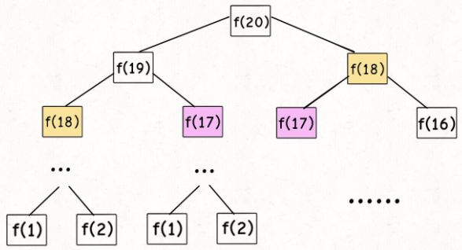

f(18)、f(17)...会被重复计算，这就是动态规划问题的第一个性质：**重叠子问题**。

#### Solution2: 自顶向下 - 带备忘录的递归解法 - 用备忘录解决重叠子问题

可以造一个「备忘录」，**每次遇到一个子问题先去「备忘录」里查一查**：

​		如果发现之前已经解决过这个问题了，直接把答案拿出来用，不要再耗时去计算了；

​		如果发现之前没解决过这个问题，就去算，算完记到备忘录里。

一般使用一个数组充当这个「备忘录」，当然你也可以使用哈希表（字典），思想都是一样的。

```java
public int fib(int n) {
        int[] memo = new int[n+1];
        return fibHelper(n, memo);
    }
    public int fibHelper(int n, int[] memo){
        if(n==0)
            return 0;
        if(n==1)
            return 1;
    
        if(memo[n]!=0)//结果已经计算过并存在备忘录中
            return memo[n];
        //不存在于备忘录中，算出结果，添加进去
        memo[n] = fibHelper(n-1, memo)+fibHelper(n-2, memo);
        return memo[n];
    } 
```

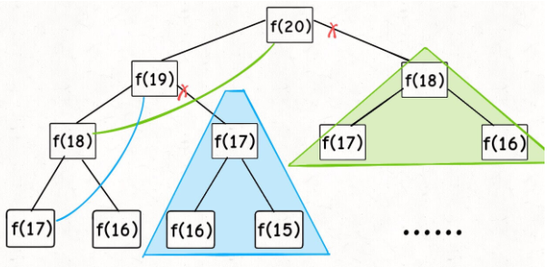

子问题个数，即图中节点的总数，由于本算法不存在冗余计算，子问题就是 `f(1)`, `f(2)`, `f(3)` ... `f(20)`，数量和输入规模 n = 20 成正比，所以子问题个数为 O(n)。

解决一个子问题的时间，同上，没有什么循环，时间为 O(1)。

所以，本算法的时间复杂度是 O(n)。比起暴力算法，是降维打击。

这种解法和迭代的动态规划已经差不多了，只不过这种方法叫做「自顶向下」，动态规划叫做「自底向上」。

啥叫「自顶向下」？注意我们刚才画的递归树（或者说图），是从上向下延伸，都是从一个规模较大的原问题比如说 `f(20)`，向下逐渐分解规模，直到 `f(1)` 和 `f(2)` 这两个 base case，然后逐层返回答案，这就叫「自顶向下」。

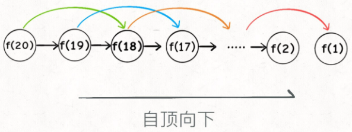

啥叫「自底向上」？反过来，我们直接从最底下，最简单，问题规模最小的 `f(1)` 和 `f(2)` 开始往上推，直到推到我们想要的答案 `f(20)`，这就是动态规划的思路，这也是为什么动态规划一般都脱离了递归，而是由循环迭代完成计算。


#### Solution3: 自底向上 - 带备忘录的迭代解法 - 用备忘录解决重叠子问题

这里，引出「**状态转移方程**」这个名词，实际上就是描述问题结构的数学形式：

​		**f(n) = 0 if n==0;** - base case 1

​		**f(n) = 1 if n==1;** - base case2

​		**f(n) = f(n-1) + f(n-2) if n>=2;** - 通用case

你把 `f(n)` 想做一个状态 `n`，这个状态 `n` 是由状态 `n - 1` 和状态 `n - 2` 相加转移而来，这就叫状态转移。

```java
public int fib(int n) {
        if(n==0)
            return 0;

        int[] dp = new int[n+1];
        //base case
        dp[0] = 0;
        dp[1] = 1;
        //状态转移方程
        for(int i=2; i<=n; i++){
            dp[i] = dp[i-1] + dp[i-2];
        }
        return dp[n];
    }
```

**动态规划问题最困难的就是写出这个暴力解，即状态转移方程**。

本算法的时间复杂度是 O(n)。

这个例子的最后，讲一个细节优化。细心的读者会发现，根据斐波那契数列的状态转移方程，当前状态只和**之前的两个状态**有关，其实并**不需要那么长的一个 DP table 来存储所有的状态**，只要用prev 和 curr来存储之前的两个状态就行了。所以，可以进一步优化，把空间复杂度降为 O(1)：

```java
 public int fib(int n) {
        if (n < 1) return 0;
        if (n == 2 || n == 1) 
            return 1;
        int prev = 1, curr = 1;
        for (int i = 3; i <= n; i++) {
            int sum = prev + curr;
            prev = curr;
            curr = sum;
        }
        return curr;
    }
```

这个技巧就是所谓的「**状态压缩**」，如果我们发现每次状态转移只需要 DP table 中的一部分，那么可以尝试用状态压缩来缩小 DP table 的大小，只记录必要的数据，上述例子就相当于把DP table 的大小从 `n` 缩小到 2。后续的动态规划章节中我们还会看到这样的例子，**一般来说是把一个二维的 DP table 压缩成一维**，即把空间复杂度从 O(n^2) 压缩到 O(n)。

### [LC322. 零钱兑换](https://leetcode-cn.com/problems/coin-change/)

给你一个整数数组 coins ，表示不同面额的硬币；以及一个整数 amount (>=0)，表示总金额。

计算并返回可以凑成总金额所需的 最少的硬币个数 。如果没有任何一种硬币组合能组成总金额，返回 -1 。

你可以认为每种硬币的数量是无限的。

示例 1：

输入：coins = [1, 2, 5], amount = 11
输出：3 
解释：11 = 5 + 5 + 1
示例 2：

输入：coins = [2], amount = 3
输出：-1
示例 3：

输入：coins = [1], amount = 0
输出：0
示例 4：

输入：coins = [1], amount = 1
输出：1
示例 5：

输入：coins = [1], amount = 2
输出：2

函数签名：

```java
public int coinChange(int[] coins, int amount);
```

1、**确定 base case**，这个很简单，显然目标金额 `amount` 为 0 时算法返回 0，因为不需要任何硬币就已经凑出目标金额了。

2、**确定「状态」，也就是原问题和子问题中会变化的变量**。由于硬币数量无限，硬币的面额也是题目给定的，只有目标金额会不断地向 base case 靠近，所以唯一的「状态」就是目标金额 `amount`。

3、**确定「选择」，也就是导致「状态」产生变化的行为**。目标金额为什么变化呢，因为你在选择硬币，你每选择一枚硬币，就相当于减少了目标金额。所以说所有硬币的面值，就是你的「选择」。

4、**明确** **`dp`** **数组的定义**。就本题来说，状态只有一个，即「目标金额」，题目要求我们计算凑出目标金额所需的最少硬币数量。所以我们可以这样定义 `dp` 函数：

`dp(n)` 的定义：**输入一个目标金额 `n`，返回凑出目标金额 `n` 的最少硬币数量。**

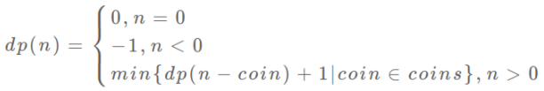

#### Solution1: 带备忘录的递归

```java
public int coinChange(int[] coins, int amount) {
        int[] dp = new int[amount+1];
        dpCoinChange(coins, amount, dp);
        return dp[amount];
        }
    public int dpCoinChange(int[] coins, int amount, int[] dp){
        //base case
        if(amount==0)
            return 0;
        if(amount<0)
            return -1;
        //查备忘录. 
        if(dp[amount]!=0)
            return dp[amount];
        //计算当前amount所需coin个数的最小值    
        int min = Integer.MAX_VALUE;
        for(int i=0; i<coins.length; i++){
            int subproblem = dpCoinChange(coins, amount-coins[i], dp);
            if(subproblem>=0)//subproblem有解
                if(1+subproblem<min)//+1是因为这次计算会消耗一枚硬币
                    min = 1+subproblem;
        }
        if(min!=Integer.MAX_VALUE)//min有被更新
            dp[amount] = min;
        else//min未被更新，无解
            dp[amount] = -1;
        return dp[amount];
    }
```

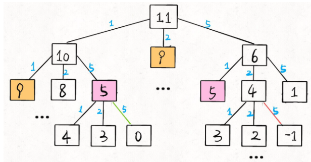

时间复杂度：O(Sn)，其中 S 是金额，n 是面额数。我们一共需要计算 S 个状态的答案，且每个状态 dp(S) 由于上面的记忆化的措施只计算了一次，而计算一个状态的答案需要枚举 n 个面额值，所以一共需要 O(Sn)的时间复杂度。
空间复杂度：O(S)，我们需要额外开一个长为 S 的数组来存储计算出来的答案 dp(S) 。

#### Solution2: dp 数组的迭代解法

```java
public int coinChange(int[] coins, int amount) {
        int[] dp = new int[amount+1];
        //base case
        dp[0] = 0;
        for(int i=1; i<=amount; i++){
            //初始化一个最大值（这里不能是Integer.MAX_VALUE是因为Integer.MAX_VALUE+1 == Integer.MIN_VALUE 
            dp[i] = amount+1;
        }
        // 外层 for 循环在遍历所有状态的所有取值
        for(int i=1; i<=amount; i++){
            // 内层 for 循环在求所有选择的最小值
            for(int c=0; c<coins.length; c++){
                // 子问题无解，跳过
                if(i-coins[c]<0)
                    continue;
                dp[i] = Math.min(dp[i], 1+dp[i-coins[c]]);
            }
        }
        if(dp[amount]<amount+1)
            return dp[amount];
        else
            return -1;
    }
```

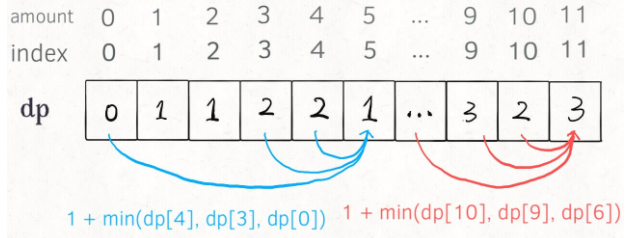

## 子序列问题

「子序列」和「子串」这两个名词的区别，子串一定是连续的，而子序列不一定是连续的。

### 套路模版

#### 1、**一维的 dp 数组**：例如**最长递增子序列**

```
int n = array.length;
int[] dp = new int[n];

for (int i = 1; i < n; i++) {
    for (int j = 0; j < i; j++) {
        dp[i] = 最值(dp[i], dp[j] + ...)
    }
}
```

举个我们写过的例子 [最长递增子序列](http://mp.weixin.qq.com/s?__biz=MzAxODQxMDM0Mw==&mid=2247484498&idx=1&sn=df58ef249c457dd50ea632f7c2e6e761&chksm=9bd7fa5aaca0734c29bcf7979146359f63f521e3060c2acbf57a4992c887aeebe2a9e4bd8a89&scene=21#wechat_redirect)，在这个思路中 dp 数组的定义是：

**在子数组`array[0..i]`中，以\**`array[i]`\**结尾的目标子序列（最长递增子序列）的长度是`dp[i]`**。

为啥最长递增子序列需要这种思路呢？前文说得很清楚了，因为这样符合归纳法，可以找到状态转移的关系，这里就不具体展开了。

#### 2、**二维的 dp 数组**：

```
int n = arr.length;
int[][] dp = new dp[n][n];

for (int i = 0; i < n; i++) {
    for (int j = 1; j < n; j++) {
        if (arr[i] == arr[j]) 
            dp[i][j] = dp[i][j] + ...
        else
            dp[i][j] = 最值(...)
    }
}
```

这种思路运用相对更多一些，尤其是涉及两个字符串/数组的子序列。本思路中 dp 数组含义又分为「只涉及一个字符串」和「涉及两个字符串」两种情况。

##### **2.1**、 **涉及两个字符串/数组时** - 例如**最长公共子序列**，**编辑距离**

dp 数组的含义如下：

**在子数组`arr1[0..i]`和子数组`arr2[0..j]`中，我们要求的子序列（最长公共子序列）长度为`dp[i][j]`**。

##### **2.2** **只涉及一个字符串/数组时** - 例如最长回文子序列

##### dp 数组的含义如下：

**在子数组`array[i..j]`中，我们要求的子序列（最长回文子序列）的长度为`dp[i][j]`**。

### [LC300. 最长递增子序列](https://leetcode-cn.com/problems/longest-increasing-subsequence/)

给你一个整数数组 `nums` ，找到其中最长严格**递增**子序列的长度。

子序列是由数组派生而来的序列，删除（或不删除）数组中的元素而不改变其余元素的顺序。例如，`[3,6,2,7]` 是数组 `[0,3,1,6,2,2,7]` 的子序列。

**示例 1：**

```
输入：nums = [10,9,2,5,3,7,101,18]
输出：4
解释：最长递增子序列是 [2,3,7,101]，[2,5,7,18], [2,3,7,18]...因此长度为 4 。
```

**示例 2：**

```
输入：nums = [0,1,0,3,2,3]
输出：4
```

**示例 3：**

```
输入：nums = [7,7,7,7,7,7,7]
输出：1
```

 函数签名：

```java
public int lengthOfLIS(int[] nums);
```

#### 思路

「子序列」和「子串」这两个名词的区别，**子串一定是连续的，而子序列不一定是连续的**。

**`dp[i]`** 表示以 **`nums[i]`** 这个数**结尾**的**最长递增子序列**的**长度**。

**base case**：`dp[i]` 初始值为 **1**，因为以 `nums[i]` 结尾的最长递增子序列起码要包含它自己。

根据这个定义，我们的最终结果（子序列的最大长度）应该是 **dp 数组中的最大值**。

根据 `dp` 数组的定义，运用数学归纳法的思想，设计算法逻辑进行状态转移。假设 `dp[0...i-1]` 都已知，想办法求出 `dp[i]`，一旦这一步完成，整个题目基本就解决了。

**假设我们已经知道了** **`dp[0..4]`** **的所有结果，我们如何通过这些已知结果推出** **`dp[5]`** **呢**？

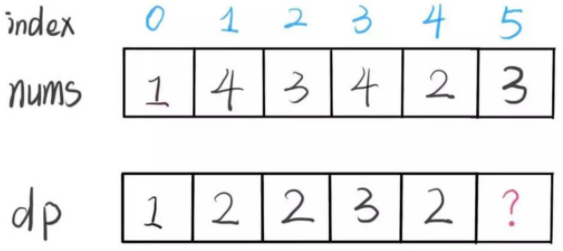

**`nums[5] = 3`**，既然是递增子序列，我们只要找到前面**结尾比 3 小的最长的子序列**，然后**把 3 接到最后**，就可以形成一个新的递增子序列，而且这个**新的子序列长度加一**。

```java
public int lengthOfLIS(int[] nums) {
        //dp[i]表示以nums[i]这个数结尾的最长递增子序列的长度
        int[] dp = new int[nums.length];
        //base case：dp[i] 初始值为 1，因为以nums[i]结尾的最长递增子序列起码要包含它自己。
        Arrays.fill(dp, 1);
        for(int i=0; i<nums.length; i++){
            for(int j=0; j<i; j++){
                if(nums[i]>nums[j])
                    dp[i] = Math.max(dp[i], dp[j]+1);
            }
        }
        //遍历dp数组找到最大值
        int max = 0;
        for(int i=0; i<dp.length; i++){
            max = Math.max(max, dp[i]);
        }
        return max;
    }
```

时间复杂度 O(N^2)

### [LC53. 最大连续子序和](https://leetcode-cn.com/problems/maximum-subarray/)

难度简单3477

给定一个整数数组 `nums` ，找到一个具有最大和的**连续子数组**（子数组最少包含一个元素），返回其最大和。

**示例 1：**

```
输入：nums = [-2,1,-3,4,-1,2,1,-5,4]
输出：6
解释：连续子数组 [4,-1,2,1] 的和最大，为 6 。
```

**示例 2：**

```
输入：nums = [1]
输出：1
```

**示例 3：**

```
输入：nums = [0]
输出：0
```

**示例 4：**

```
输入：nums = [-100000]
输出：-100000
```

#### 思路

**这道题还不能用滑动窗口算法，因为数组中的数字可以是负数**。

滑动窗口算法无非就是双指针形成的窗口扫描整个数组/子串，但关键是，你得清楚地知道什么时候应该移动右侧指针来扩大窗口，什么时候移动左侧指针来减小窗口。

而对于这道题目，你想想，当窗口扩大的时候可能遇到负数，窗口中的值也就可能增加也可能减少，这种情况下不知道什么时机去收缩左侧窗口，也就无法求出「最大子数组和」。

所以要用到**动态规划**。

首先定义 **`dp` 数组的含义：**以 **`nums[i]`** **为结尾的「最大子数组和」为** **`dp[i]`**。

依然使用数学归纳法来找**状态转移关系**：假设我们已经算出了 `dp[i-1]`，如何推导出 `dp[i]` 呢？

可以做到，`dp[i]` 有两种「选择」，要么**与前面的相邻子数组连接，形成一个和更大的子数组**；要么**不与前面的子数组连接，自成一派，自己作为一个子数组**。

最后的结果应该是 **dp 数组中的最大值**。

 **base case：因为状态转换涉及到dp[i-1]，所以要确定dp[0]。第一个元素前面没有子数组，dp[0]等于元素本身nums[0]。**

```java
public int maxSubArray(int[] nums) {
        //以nums[i]为结尾的「最大子数组和」为dp[i]
        int[] dp = new int[nums.length];
        //base case
        dp[0] = nums[0];
        //dp[i]由dp[i-1]转换而来，所以要从1开始遍历
        for(int i=1; i<nums.length; i++){
            dp[i] = Math.max(nums[i]+dp[i-1], nums[i]);
        }
        int max = Integer.MIN_VALUE;
        for(int i=0; i<dp.length; i++){
            max = Math.max(max, dp[i]);
        }
        return max;
    }
```

以上解法时间复杂度是 O(N)，空间复杂度也是 O(N)。

**注意到** **`dp[i]`** **仅仅和** **`dp[i-1]`** **的状态有关**，那么我们可以进行「状态压缩」，即用两个值记住dp[i]和dp[i-1]将**空间复杂度**降低到常数时间：

```java
public int maxSubArray(int[] nums) {
        //base case
        int dp0 = nums[0];//dp[0] = nums[0];
        int dp1 = 0;
        int max = dp0;//int max = Integer.MIN_VALUE;
        //dp[i]由dp[i-1]转换而来，所以要从1开始遍历
        for(int i=1; i<nums.length; i++){
            dp1 = Math.max(nums[i]+dp0, nums[i]);//dp[i] = Math.max(nums[i]+dp[i-1], nums[i]);
            dp0 = dp1;
            max = Math.max(max, dp1);//max = Math.max(max, dp[i]);
        }
        return max;
    }
```

### [LC354. 俄罗斯套娃信封问题](https://leetcode-cn.com/problems/russian-doll-envelopes/)

给你一个二维整数数组 `envelopes` ，其中 `envelopes[i] = [wi, hi]` ，表示第 `i` 个信封的宽度和高度。

当另一个信封的宽度和高度都比这个信封大的时候，这个信封就可以放进另一个信封里，如同俄罗斯套娃一样。

请计算 **最多能有多少个** 信封能组成一组“俄罗斯套娃”信封（即可以把一个信封放到另一个信封里面）。

**注意**：不允许旋转信封。

**示例 1：**

```
输入：envelopes = [[5,4],[6,4],[6,7],[2,3]]
输出：3
解释：最多信封的个数为 3, 组合为: [2,3] => [5,4] => [6,7]。
```

**示例 2：**

```
输入：envelopes = [[1,1],[1,1],[1,1]]
输出：1
```

函数签名：

```java
public int maxEnvelopes(int[][] envelopes);
```

#### 思路

这道题的解法是比较巧妙的：

**先对宽度** **`w`** **进行升序排序，如果遇到** **`w`** **相同的情况，则按照高度** **`h`** **降序排序。之后把所有的** **`h`** **作为一个数组，在这个数组上计算 最长子序列LIS 的长度就是答案。**

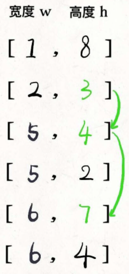

对于宽度 `w` **相同**的数对，要**对其高度 `h` 进行降序排序**。因为两个宽度相同的信封不能相互包含的，**降序排列h保证在 `w` 相同的数对中最多只选取一个**。

这个解法的关键在于**对二维数组进行排序**：

- **w不同：对比w，使w升序，即返回w1-w2;**
- **w相同：对比h，使h降序，即返回h2-h1；**

> Java的comparator中
>
> ```java
> @Override
>     public int compare(A o1, A o2) {
>         //升序
>         //return o1.a - o2.a;
>         //降序
>         return o2.a - o1.a;
>     }
> ```
>
> 这里o1表示位于**前面的对象**，o2表示**后面的对象**
>
> - 返回1（或正数），表示需要交换o1和o2的位置，o1排在o2后面，降序
> - 返回-1（或负数），表示不需要交换o1和o2的位置，o1排在o2前面，升序
>
> 为什么`return o2.a - o1.a;`就是降序了：
>
> 首先o2是第二个元素，o1是第一个元素。无非就以下这些情况：
>
> - **`o2.a > o1.a`** : 那么此时**返回正数**，表示需要调整o1,o2的顺序，也就是需要把o2放到o1前面，这不就是降序了么。
>
> - **`o2.a < o1.a`** : 那么此时**返回负数**，表示不需要调整，也就是此时o1 比 o2大， 不还是降序么。

#### Solution

```java
public int maxEnvelopes(int[][] envelopes) {
        // 按宽度升序排列，如果宽度一样，则按高度降序排列
        Arrays.sort(envelopes, new Comparator<int[]>(){
            public int compare(int[] o1, int[] o2){
                if(o1[0]!=o2[0])//[0]代表w，w不同，需要w升序
                    return o1[0]-o2[0];
                else //w相同，则需要h降序，也就是[1]
                    return o2[1]-o1[1];
            }
        });

        //对高度h的求最长子序列，也就是[?][1]
        int[] dp = new int[envelopes.length];
        Arrays.fill(dp, 1);
        for(int i=0; i<envelopes.length; i++){
            for(int j=0; j<i; j++){
                if(envelopes[i][1]>envelopes[j][1])
                    dp[i] = Math.max(dp[i], dp[j]+1);
            }
        }
        int max = 0;
        for(int i=0; i<dp.length; i++)
            max = Math.max(max, dp[i]);
        return max;
    }
```

时间复杂度为O(n^2)，其中 n 是数组envelopes 的长度，排序envelopes数组需要O(nlogn)，计算LIS需要O(n^2)，前者在渐近意义下小于后者，可以忽略。

空间复杂度：O(n)，即为dp数组需要的空间。

### [1143. 最长公共子序列](https://leetcode-cn.com/problems/longest-common-subsequence/)

给定两个字符串 `text1` 和 `text2`，返回这两个字符串的最长 **公共子序列** 的长度。如果不存在 **公共子序列** ，返回 `0` 。

一个字符串的 **子序列** 是指这样一个新的字符串：它是由原字符串在不改变字符的相对顺序的情况下删除某些字符（也可以不删除任何字符）后组成的新字符串。

- 例如，`"ace"` 是 `"abcde"` 的子序列，但 `"aec"` 不是 `"abcde"` 的子序列。

两个字符串的 **公共子序列** 是这两个字符串所共同拥有的子序列。

**示例 1：**

```
输入：text1 = "abcde", text2 = "ace" 
输出：3  
解释：最长公共子序列是 "ace" ，它的长度为 3 。
```

**示例 2：**

```
输入：text1 = "abc", text2 = "abc"
输出：3
解释：最长公共子序列是 "abc" ，它的长度为 3 。
```

**示例 3：**

```
输入：text1 = "abc", text2 = "def"
输出：0
解释：两个字符串没有公共子序列，返回 0 。
```

函数签名：

```java
public int longestCommonSubsequence(String text1, String text2);
```

#### 思路

这个**`dp`函数的定义**是：**`dp(s1, i, s2, j)`计算`s1[i..]`和`s2[j..]`的最长公共子序列长度**；

要求的**最长公共子序列**就是`dp(s1, 0, s2, 0)`；

 **base case** 就是`i == len(s1)`或`j == len(s2)`时，因为这时候`s1[i..]`或`s2[j..]`就相当于空串了，最长公共子序列的长度显然是 0；

备忘录数组的初始值应为-1或其他，代表**未计算**；（不能用0是因为最长公共子序列长度有可能为0）

**状态转移**：

- **`s1[i] == s2[j]`，说明这个字符一定在`lcs`中**，所以长度加一：**1 + dp(s1, i + 1, s2, j + 1)**

- **`s1[i] != s2[j]`意味着，`s1[i]`和`s2[j]`中至少有一个字符不在`lcs`中**，有三种情况：

    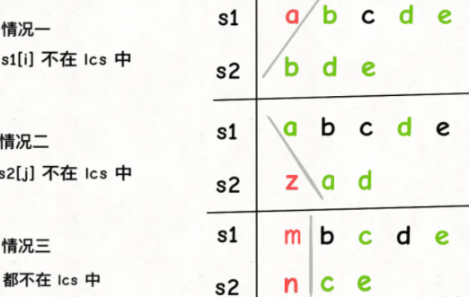

    情况三可以直接跳过，因为并不会使结果增大；

    所以，算出情况一和二取最大：**max(dp(s1,i+1,s2,j), dp(s1,i,s2,j+1))**

#### Solution1: 自顶向下 - 带备忘录的递归

```java
public int longestCommonSubsequence(String s1, String s2) {
        //定义：memo[i][j] s1[i..] 和 s2[j..] 的最长公共子序列长度
        int[][] memo = new int[s1.length()][s2.length()];
        // 备忘录值为 -1 代表未计算
        for(int i=0; i<s1.length(); i++){
            Arrays.fill(memo[i], -1);
        }
        return dpLCS(s1, 0, s2, 0, memo);
    }
    //定义：计算 s1[i..] 和 s2[j..] 的最长公共子序列长度
    public int dpLCS(String s1, int i, String s2, int j, int[][] memo){
        //base case: s[len, len-1]为空串
        if(i==s1.length() || j==s2.length())
            return 0;
        //查备忘录
        if(memo[i][j]!=-1)
            return memo[i][j];
        
        if(s1.charAt(i)==s2.charAt(j)){
            // s1[i] 和 s2[j] 必然在 lcs 中
            memo[i][j] = 1 + dpLCS(s1, i+1, s2, j+1, memo);
            return memo[i][j];
        } else {
            // s1[i] 和 s2[j] 至少有一个不在 lcs 中
            memo[i][j] = Math.max(dpLCS(s1, i+1, s2, j, memo),
            dpLCS(s1, i, s2, j+1, memo));
            return memo[i][j];
        }  
    }
```

时间复杂度：O(m∗n)。我们需要填充大小为 m∗n 的数组 memo。m 和 n 分别是 s1 和 s2 字符串的长度。

空间复杂度：O(m∗n)。使用了大小为 m∗n 的 memo 数组。

#### Solution2: 自底向上 - 带dp数组的迭代解法

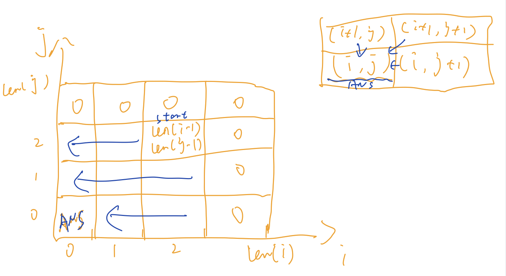

```java
public int longestCommonSubsequence(String s1, String s2) {
        //定义：dp[i][j] s1[i..] 和 s2[j..] 的最长公共子序列长度
        //base case: dp[len][len]中s1或s2的s[len, len-1]为空串，值为0
        int[][] dp = new int[s1.length()+1][s2.length()+1];
        
        for(int i=s1.length()-1; i>=0; i--){
            for(int j=s2.length()-1; j>=0; j--){
                if(s1.charAt(i)==s2.charAt(j)){
                    dp[i][j] = 1 + dp[i+1][j+1];
                } else {
                    dp[i][j] = Math.max(dp[i+1][j], dp[i][j+1]);
                }
            }
        }
        return dp[0][0];
    }
```

时间复杂度：O(m∗n)。我们需要填充大小为 m∗n 的数组 dp。m 和 n 分别是 s1 和 s2 字符串的长度。

空间复杂度：O(m∗n)。使用了大小为 m∗n 的 dp 数组。

### [LC583. 两个字符串的删除操作](https://leetcode-cn.com/problems/delete-operation-for-two-strings/)

给定两个单词 *word1* 和 *word2*，找到使得 *word1* 和 *word2* 相同所需的最小步数，每步可以删除任意一个字符串中的一个字符。

**示例：**

```
输入: "sea", "eat"
输出: 2
解释: 第一步将"sea"变为"ea"，第二步将"eat"变为"ea"
```

函数签名：

```java
public int minDistance(String s1, String s2);
```

#### 思路

删除的结果s1和s2的**最长公共子序列**；

#### Solution

```java
public int minDistance(String s1, String s2) {
        int lcs = lcs(s1, s2);
        return s1.length()-lcs + s2.length()-lcs;
    }
    public int lcs(String s1, String s2){
        int[][] dp = new int[s1.length()+1][s2.length()+1];
        for(int i=s1.length()-1; i>=0; i--){
            for(int j=s2.length()-1; j>=0; j--){
                if(s1.charAt(i)==s2.charAt(j)){
                    dp[i][j] = 1 + dp[i+1][j+1];
                } else {
                    dp[i][j] = Math.max(dp[i+1][j], dp[i][j+1]);
                }
            }
        }
        return dp[0][0];
    }
```

时间复杂度：O(m∗n)。我们需要填充大小为 m∗n 的数组 dp。m 和 n 分别是 s1 和 s2 字符串的长度。

空间复杂度：O(m∗n)。使用了大小为 m∗n 的 dp 数组。

### [LC712. 两个字符串的最小ASCII删除和](https://leetcode-cn.com/problems/minimum-ascii-delete-sum-for-two-strings/)

给定两个字符串`s1, s2`，找到使两个字符串相等所需删除字符的ASCII值的最小和。

**字符的ASCII可以用String.charAt()或者String.codePointAt()来计算；**

**示例 1:**

```
输入: s1 = "sea", s2 = "eat"
输出: 231
解释: 在 "sea" 中删除 "s" 并将 "s" 的值(115)加入总和。
在 "eat" 中删除 "t" 并将 116 加入总和。
结束时，两个字符串相等，115 + 116 = 231 就是符合条件的最小和。
```

**示例 2:**

```
输入: s1 = "delete", s2 = "leet"
输出: 403
解释: 在 "delete" 中删除 "dee" 字符串变成 "let"，
将 100[d]+101[e]+101[e] 加入总和。在 "leet" 中删除 "e" 将 101[e] 加入总和。
结束时，两个字符串都等于 "let"，结果即为 100+101+101+101 = 403 。
如果改为将两个字符串转换为 "lee" 或 "eet"，我们会得到 433 或 417 的结果，比答案更大。
```

函数签名:

```java
public int minimumDeleteSum(String s1, String s2);
```

#### 思路

不能直接复用**最长公共子序列**的函数了，但是可以依照之前的思路，**稍微修改 base case 和状态转移部分即可直接写出解法代码**：

**base case** 有一定区别，计算`lcs`长度时，如果一个字符串为空，那么`lcs`长度必然是 0；但是这道题**如果一个字符串为空，另一个字符串必然要被全部删除**，所以需要计算另一个字符串所有字符的 ASCII 码之和。因数组的定义为`dp[i][j]`返回的是s[i..]，所以计算和的时候可以用`dp[i][len(s2)] = dp[i+1][len(s2)]+当前字符的ASCII`，以此叠加来算和。

关于**状态转移**：

- `s1[i]`==`s2[j]`时不需要删除；
- `s1[i]`!=`s2[j]`时需要删除，计算两种情况(1⃣️删除s[i]; 2⃣️删除s[j])得到最优解

#### Solution

```java
public int minimumDeleteSum(String s1, String s2) {
        //dp[i][j]表示 s1[i..] 和 s2[j..] 删除成相同字符串，
        //初始化为0
        int[][] dp = new int[s1.length()+1][s2.length()+1];
        
        //base case：s2变成空串，s1剩下的要全部删除
        for(int i=s1.length()-1; i>=0; i--){
            //dp[s1.length()][s2.length()]==0
            dp[i][s2.length()] = dp[i+1][s2.length()] + s1.charAt(i);
        }
        //base case：s1变成空串，s2剩下的要全部删除
        for(int j=s2.length()-1; j>=0; j--){
            //dp[s1.length()][s2.length()]==0
            dp[s1.length()][j] = dp[s1.length()][j+1] + s2.charAt(j);
        }

        for(int i=s1.length()-1; i>=0; i--){
            for(int j=s2.length()-1; j>=0; j--){
                if(s1.charAt(i)==s2.charAt(j))
                    dp[i][j] = dp[i+1][j+1];
                else
                    dp[i][j] = Math.min(
                        s1.charAt(i) + dp[i+1][j],
                        s2.charAt(j) + dp[i][j+1]
                    );
            }
        }
        return dp[0][0];
    }
```

时间复杂度：O(m∗n)。我们需要填充大小为 m∗n 的数组 dp。m 和 n 分别是 s1 和 s2 字符串的长度。

空间复杂度：O(m∗n)。使用了大小为 m∗n 的 dp 数组。

### [LC72. 编辑距离](https://leetcode-cn.com/problems/edit-distance/)

给你两个单词 word1 和 word2，请你计算出将 word1 转换成 word2 所使用的最少操作数 。

你可以对一个单词进行如下三种操作：

- 插入一个字符
- 删除一个字符
- 替换一个字符

示例 1：输入：word1 = "horse", word2 = "ros"
输出：3
解释：
horse -> rorse (将 'h' 替换为 'r')
rorse -> rose (删除 'r')
rose -> ros (删除 'e')

示例 2：输入：word1 = "intention", word2 = "execution"
输出：5
解释：
intention -> inention (删除 't')
inention -> enention (将 'i' 替换为 'e')
enention -> exention (将 'n' 替换为 'x')
exention -> exection (将 'n' 替换为 'c')
exection -> execution (插入 'u')

函数签名：

```java
public int minDistance(String s1, String s2);
```

#### 思路：

**解决两个字符串的动态规划问题，一般都是用两个指针** **`i,j`** **分别指向两个字符串的最后，然后一步步往前走，缩小问题的规模**。


**base case** 是 `i` 走完 `s1` 或 `j` 走完 `s2`，可以直接返回另一个字符串剩下的长度。

对于**每对儿字符 `s1[i]` 和 `s2[j]`**，可以有四种操作：

```java
if s1[i] == s2[j]:
    啥都别做（skip）
    i, j 同时向前移动
else:
    三选一：
      插入（insert）
      删除（delete）
      替换（replace）
```

这个「三选一」到底该怎么选择呢？很简单，全试一遍，哪个操作最后得到的编辑距离最小，就选谁


#### Solution1: 暴力递归

```java
public int minDistance(String s1, String s2) {
        //以字符串最后一位的索引string.length()-1位起点
        return recurMinDistance(s1, s1.length()-1, s2, s2.length()-1);
    }
    //返回s1[0...i]和s2[0...j]的最小编辑距离
    public int recurMinDistance(String s1, int i, String s2, int j){
      	//base case: 其中一个str遍历结束时，需要的时间为插入另一个str剩下的char所需时间
        if(i<0) 
            return j+1;
        if(j<0)
            return i+1;
        
        if(s1.charAt(i)==s2.charAt(j)){
            //本来就相等，不需要任何操作
            //s1[0..i] 和 s2[0..j] 的最小编辑距离等于s1[0..i-1] 和 s2[0..j-1] 的最小编辑距离
            //也就是说 recurMinDistance(i, j) 等于 recurMinDistance(i-1, j-1)
            return recurMinDistance(s1, i-1, s2, j-1);
        }
        else {
            //插入：s[i]插入一个与s2[j]相同字符，那么s1[i+1]与s2[j]匹配成功；所以s1指针i不变，s2指针j前移一位继续跟i对比
            int min = recurMinDistance(s1, i, s2, j-1) + 1;//+1为插入的消耗
            //删除：s1[i]的指针删除，用下一位s1[i-1]继续与s2[j]匹配，所以s2指针j不变，s1指针i前移一位继续跟s2指针j对比
            min = Math.min(recurMinDistance(s1, i-1, s2, j)+1, min);//+1为删除的消耗
            //替换: 将s1[i]前面的某个字符替换到当前字符，那么这一位s1[i]=s2[j]通过了匹配; s1、s2指针i、j都前移一位继续对比
            min = Math.min(recurMinDistance(s1, i-1, s2, j-1)+1, min);//+1为替换的消耗
            return min;
        }
    }
```

#### Solution2: 带备忘录的递归

memo数组是一个二维数组，长这样：

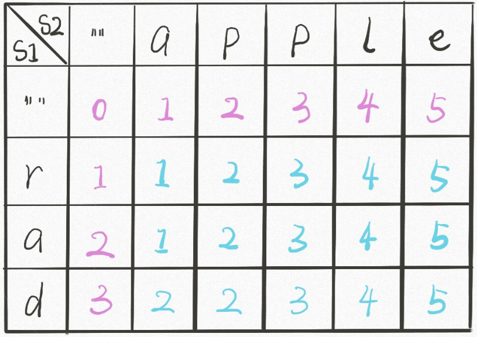

```java
		
public int minDistance(String s1, String s2) {
        //初始化备忘录，memo[i][j]记录s1[0...i]和s2[0...j]的最小编辑距离
        int[][] memo = new int[s1.length()][s2.length()];
        //以字符串最后一位的索引string.length()-1为起点
        return recurMinDistance(s1, s1.length()-1, s2, s2.length()-1, memo);
    }
    //返回s1[0...i]和s2[0...j]的最小编辑距离
    public int recurMinDistance(String s1, int i, String s2, int j, int[][] memo){
        if(i<0) 
            return j+1;
        if(j<0)
            return i+1;
        //查备忘录
        if(memo[i][j]!=0) 
            return memo[i][j];
        if(s1.charAt(i)==s2.charAt(j)){
            //更新备忘录
            memo[i][j] = recurMinDistance(s1, i-1, s2, j-1, memo);
            return memo[i][j];
        }
        else {
            int min = recurMinDistance(s1, i, s2, j-1, memo) + 1;
            min = Math.min(recurMinDistance(s1, i-1, s2, j, memo)+1, min);
            min = Math.min(recurMinDistance(s1, i-1, s2, j-1, memo)+1, min);
            //更新备忘录
            memo[i][j] = min;
            return memo[i][j];
        }
    }
```

#### Solution3: dp数组的迭代解法 

当i、j为0时，`memo[0][0] = min(dp(0,-1)+1,dp(-1,0)+1, dp(-1,-1)+1)`，<u>**递归的解法**</u>可以用base case直接返回值来处理`memo[0][-1]、memo[-1][0]、memo[-1][-1]`的情况，但**迭代**的解法中**数组的索引无法取到-1**，所以要将**整个数组向右平移一位**(idx = idx+1)。


`memo[..][0]` 和 `memo[0][..]` 对应 base case。

```java
public int minDistance(String s1, String s2) {
        //dp[i][j]存储的是s1[0...i-1]和s2[0...j-1]的最小编辑距离，
        int[][] dp = new int[s1.length()+1][s2.length()+1];
    
        //初始化base case
        for(int i=0; i<=s1.length(); i++){//!!!结束条件是i=s1.length()
            dp[i][0] = i;
        }
        for(int j=0; j<=s2.length(); j++){
            dp[0][j] = j;
        }

        //结束条件是i=s1.length()是因为数组长度为s1.length()+1, s1.length()就是数组最后一个元素的的索引
        for(int i=1; i<=s1.length(); i++){
            for(int j=1; j<=s2.length(); j++){
                //i-1才是char在str里的实际位置
                if(s1.charAt(i-1)==s2.charAt(j-1))
                    dp[i][j] = dp[i-1][j-1];
                else{
                    int min = dp[i][j-1]+1;
                    min = Math.min(dp[i-1][j]+1, min);
                    min = Math.min(dp[i-1][j-1]+1, min);
                    //更新备忘录
                    dp[i][j] = min;
                }
            }
        }
        //s1.length()就是数组最后一个元素的的索引
        return dp[s1.length()][s2.length()];
    }
```

#### 总结归纳：两个字符串的动态规划问题状态转移关系

处理两个字符串的动态规划问题，都是按本文的思路处理，建立 DP table。为什么呢，因为易于找出状态转移的关系，比如编辑距离的 DP table：

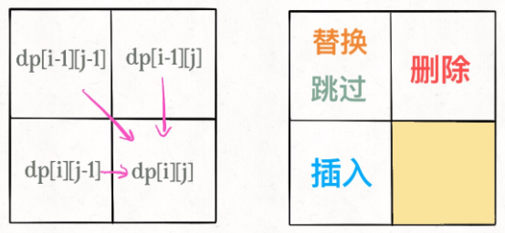

**正向遍历还是反向遍历？**

**1、遍历的过程中，所需的状态必须是已经计算出来的**。

**2、遍历的终点必须是存储结果的那个位置**。

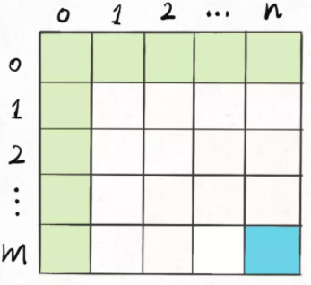

既然每个 `dp[i][j]` 只和它附近的三个状态有关，那么遍历方式是**从左上到右下**来遍历，所以是从i++而不是i--。

### [LC516. 最长回文子序列](https://leetcode-cn.com/problems/longest-palindromic-subsequence/)

给你一个字符串 `s` ，找出其中最长的回文子序列，并返回该序列的长度。

子序列定义为：不改变剩余字符顺序的情况下，删除某些字符或者不删除任何字符形成的一个序列。

回文：正着读和反着读的结果一样。

**示例 1：**

```
输入：s = "bbbab"
输出：4
解释：一个可能的最长回文子序列为 "bbbb" 。
```

**示例 2：**

```
输入：s = "cbbd"
输出：2
解释：一个可能的最长回文子序列为 "bb" 。
```

函数签名：

```java
public int longestPalindromeSubseq(String s);
```

#### 思路

对 dp 数组的定义是：**在子串`s[i..j]`中，最长回文子序列的长度为`dp[i][j]`**;

我们要求的最长回文子串就是**`dp[0][s.length-1]`**。

**找状态转移需要归纳思维，说白了就是如何从已知的结果推出未知的部分**具体来说，`dp[i][j]`如何从子问题`dp[i+1][j-1]`的结果（`s[i+1..j-1]`中最长回文子序列的长度）转换而来呢；

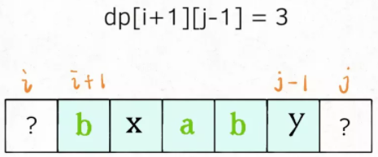

**这取决于`s[i]`和`s[j]`的字符**：

- **s[i]==s[j]**，那么它俩加上`s[i+1..j-1]`中的最长回文子序列就是`s[i..j]`的最长回文子序列：

    `dp[i][j] = dp[i+1][j-1] + 2`

    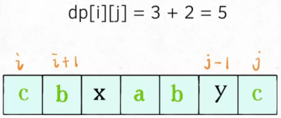

- **s[i]!=s[j]**，说明它俩**不可能同时**出现在`s[i..j]`的最长回文子序列中，那么把它俩**分别**加入`s[i+1..j-1]`中，看看哪个子串产生的回文子序列更长即可：

    `dp[i][j] = max(dp[i][j-1], dp[i+1][j])`

    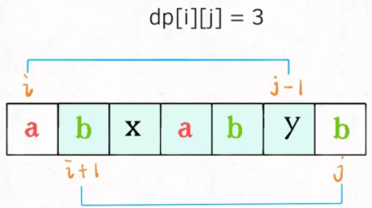

首先明确一下 **base case**，如果只有一个字符，显然最长回文子序列长度是 1，也就是`dp[i][j] = 1,(i == j)`。

因为**`i`肯定小于等于`j`**，所以对于那些`i > j`的位置，根本不存在什么子序列，应该初始化为 0。

另外，看看刚才写的状态转移方程，想求`dp[i][j]`需要知道`dp[i+1][j-1]`，`dp[i+1][j]`，`dp[i][j-1]`这三个位置；再看看我们确定的 base case，填入 dp 数组之后是这样：

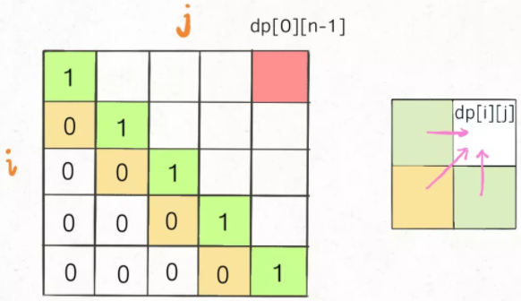

**为了保证每次计算`dp[i][j]`，左、下、左下三个方向的位置已经被计算出来，遍历方式可以是：

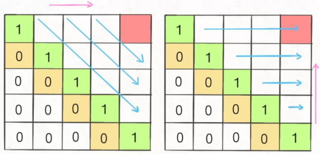

- **斜着遍历**：从`dp[0][1]`开始，斜着遍历（我不会。。。）
- **反着遍历**：从`dp[s.length-2][s.length-1]`开始，**i倒序遍历，j升序遍历**，**且j的起始位置都等于i+1**

#### Solution

```java
public int longestPalindromeSubseq(String s) {
        //在子串`s[i..j]`中，最长回文子序列的长度为`dp[i][j]
        //base case: 如果i>j,子串s[i,j]不存在, 初始化为0
        //至于i<j的部分也可以初始化为0，因为状态转移之后会给他们赋值
        int[][] dp = new int[s.length()][s.length()];
        //base case: 子串s[i,i]只包含一个字符，所以dp[i][i]等于1
        for(int i=0; i<s.length(); i++)
            dp[i][i] = 1;
        //反着遍历保证正确的状态转移: 从dp[s.length-2][s.length-1]开始，i倒序遍历，j升序遍历，且j的起始位置都等于i+1
        for(int i=s.length()-2; i>=0; i--){
            for(int j=i+1; j<s.length(); j++){
                //s[i]==s[j]，那么它俩加上s[i+1..j-1]中的最长回文子序列就是s[i..j]的最长回文子序列
                if(s.charAt(i)==s.charAt(j))
                    dp[i][j] = dp[i+1][j-1] + 2;
                //s[i]!=s[j]，说明它俩不可能同时出现在s[i..j]的最长回文子序列中，那么把它俩分别加入s[i+1..j-1]中，看看哪个子串产生的回文子序列更长即可：
                else
                    dp[i][j] = Math.max(dp[i][j-1], dp[i+1][j]);
            }
        }
        return dp[0][s.length()-1];
    }
```

时间复杂度：O(n^2)
空间复杂度：O(n^2)

## 背包问题

### [0-1背包问题](https://labuladong.gitbook.io/algo/mu-lu-ye-2/mu-lu-ye-2/bei-bao-wen-ti)

给你一个可装载重量为 `W` 的背包和 `N` 个物品，每个物品有重量和价值两个属性。其中第 `i` 个物品的重量为 `wt[i]`，价值为 `val[i]`，现在让你用这个背包装物品，最多能装的价值是多少？

举个简单的例子，输入如下：

```
N = 3, W = 4
wt = [2, 1, 3]
val = [4, 2, 3]
```

算法返回 6，选择前两件物品装进背包，总重量 3 小于 `W`，可以获得最大价值 6。

函数签名：

```java
int knapsack(int w, int n, int[] wt, int[] val);
```

#### 思路

**状态**：1⃣️可选的物品有哪些2⃣️背包的剩余容量

**选择**：是否把当前物品装入背包

`dp[i][w]` 的定义如下：对于**前** `i` 个物品，当前背包的容量为 `w`，可以装的最大价值是 `dp[i][w]`。

根据这个定义，我们想求的最终答案就是 `dp[N][W]`。

base case 就是 `dp[0][..] = dp[..][0] = 0`，因为**没有物品**或者** **的时候，能装的最大价值就是 0。

**状态转换**：

- **如果你没有把这第** **`i`** **个物品装入背包**，那么很显然，最大价值 `dp[i][w]` 应该等于 `dp[i-1][w]`，继承之前的结果。

- **如果你把这第** **`i`** **个物品装入了背包**，那么 `dp[i][w]` 应该等于 `dp[i-1][w - wt[i-1]] + val[i-1]`。

#### Solution

因为状态转移涉及到i-1，所以要用到**索引偏移**来保证**索引i-1**的合法

```java
int knapsack(int w, int n, int[] wt, int[] val){
		int[][] dp = new int[n+1][w+1];
  	
  	for(int i=1; i<=n; i++){
      	for(int j=1; j<=w; j++){
          	if(w-wt[i]<0)//背包容量不够了
              	dp[i][w] = dp[i-1][w]
             else {
               	dp[i][w] = Math.max(
                  	dp[i-1][w],//把第i个物品装入背包
                  	dp[i-1][w-wt[i-1]] + val[i-1]//不把第i个物品装入背包
                )；
             }
        }
    }
  	return dp[n][w];
}
```

首先，由于 `i` 是从 1 开始的，所以 `val` 和 `wt` 的索引是 `i-1` 时表示第 `i` 个物品的价值和重量。

而 `dp[i-1][w - wt[i-1]]` 也很好理解：你如果装了第 `i` 个物品，就要寻求剩余重量 `w - wt[i-1]` 限制下的最大价值，加上第 `i` 个物品的价值 `val[i-1]`。

### [LC416. 分割等和子集](https://leetcode-cn.com/problems/partition-equal-subset-sum/)

给你一个 **只包含正整数** 的 **非空** 数组 `nums` 。请你判断是否可以将这个数组分割成**两个子集**，使得两个子集的**元素和相等**。

**示例 1：**

```
输入：nums = [1,5,11,5]
输出：true
解释：数组可以分割成 [1, 5, 5] 和 [11] 。
```

**示例 2：**

```
输入：nums = [1,2,3,5]
输出：false
解释：数组不能分割成两个元素和相等的子集。
```

函数签名：

```java
public boolean canPartition(int[] nums);
```

#### 思路

先对集合求和，得出 `sum`，把问题转化为背包问题：

**给一个可装载重量为** **`sum / 2`** **的背包和** **`N`** **个物品，每个物品的重量为** **`nums[i]`**。现在让你装物品，是否存在一种装法，能够**恰好将背包装满(装到sum/2)**？**只要能装满一个背包，剩下元素和自然也是sum/2**。

**状态**：「背包的容量」和「可选择的物品」

**选择**：「装进背包」或者「不装进背包」。

**`dp`** **数组的定义**：`dp[i][j] = x` 表示，**对于前 `i` 个物品，当前背包的容量为 `j` 时，若 `x` 为 `true`，则说明可以恰好将背包装满，若 `x` 为 `false`，则说明不能恰好将背包装满。**

比如说，如果 `dp[4][9] = true`，其含义为：对于容量为 9 的背包，若只是用前 4 个物品，可以有一种方法把背包恰好装满。

或者说对于本题，含义是对于给定的集合中，若只对前 4 个数字进行选择，存在一个子集的和可以恰好凑出 9。

根据这个定义，**要求的**就是 **`dp[N][sum/2]`**

**base case** ： `dp[..][0] = true` 和 `dp[0][..] = false`，因为背包没有空间的时候，就相当于装满了；而当没有物品可选择的时候，肯定没办法装满背包。

**状态转移**：

- 如果不把 `nums[i]` 算入子集，**或者说你不把这第** **`i`** **个物品装入背包**，那么是否能够恰好装满背包，取决于上一个状态 `dp[i-1][j]`，继承之前的结果。

- 如果把 `nums[i]` 算入子集，**或者说你把这第** **`i`** **个物品装入了背包**，那么是否能够恰好装满背包，取决于状态 `dp[i-1][j-nums[i-1]]`。

**索引偏移**：

由于 `i` 是从 1 开始的，而数组索引是从 0 开始的，所以第 `i` 个物品的重量应该是 `nums[i-1]`；

`dp[i - 1][j-nums[i-1]]` ：你如果装了第 `i` 个物品，就要看背包的剩余重量 `j - nums[i-1]` 限制下是否能够被恰好装满。

如果 `j - nums[i-1]` 的重量可以被恰好装满，那么只要把第 `i` 个物品装进去，也可恰好装满 `j` 的重量；否则的话，重量 `j` 肯定是装不满的。

#### Solution

```java
public boolean canPartition(int[] nums) {
        int sum = 0;
        for(int i=0; i<nums.length; i++)
            sum += nums[i];
        if(sum%2!=0)// 和为奇数时，不可能划分成两个和相等的集合
            return false;
        //前i个数字，背包剩余容量为j时，将背包填满为true，反之
        //索引为0时为base case；
        boolean[][] dp = new boolean[nums.length+1][sum/2+1];
        //base case：j=0时，背包已填满，返回true；i=0时，没有物品可选，背包无法被填满，为初始值false
        for(int i=0; i<=nums.length; i++)
            dp[i][0] = true;
        
        //从1开始，因为0为base case
        for(int i=1; i<=nums.length; i++){
            for(int j=1; j<=sum/2; j++){
                if(j-nums[i-1]<0)
                    // 背包容量不足，不能装入第 i 个物品
                    dp[i][j] = dp[i-1][j];
                else
                    // 装入或不装入背包
                    dp[i][j] = dp[i-1][j] || dp[i-1][j-nums[i-1]];  
            }
        }
        return dp[nums.length][sum/2];
    }
```

时间复杂度 O(n*sum)，空间复杂度 O(n*sum)

#### *进行状态压缩(理解不了可忽略，没必要深挖)

再进一步，是否可以优化这个代码呢？**注意到** **`dp[i][j]`** **都是通过上一行** **`dp[i-1][..]`** **转移过来的**，之前的数据都不会再使用了。

所以，我们可以进行状态压缩，将二维 `dp` 数组压缩为一维，节约空间复杂度：

```c++
bool canPartition(vector<int>& nums) {
    int sum = 0, n = nums.size();
    for (int num : nums) sum += num;
    if (sum % 2 != 0) return false;
    sum = sum / 2;
    vector<bool> dp(sum + 1, false);
    // base case
    dp[0] = true;


    for (int i = 0; i < n; i++) 
        for (int j = sum; j >= 0; j--) 
            if (j - nums[i] >= 0) 
                dp[j] = dp[j] || dp[j - nums[i]];


    return dp[sum];
}
```

其实这段代码和之前的解法思路完全相同，只在一行 `dp` 数组上操作，`i` 每进行一轮迭代，`dp[j]` 其实就相当于 `dp[i-1][j]`，所以只需要一维数组就够用了。

**唯一需要注意的是** **`j`** **应该从后往前反向遍历，因为每个物品（或者说数字）只能用一次，以免之前的结果影响其他的结果**。

### [LC518. 零钱兑换 II](https://leetcode-cn.com/problems/coin-change-2/)

给你一个整数数组 `coins` 表示不同面额的硬币，另给一个整数 `amount` 表示总金额。

请你计算并返回可以凑成总金额的硬币**组合数**。如果任何硬币组合都无法凑出总金额，返回 `0` 。

假设每一种面额的硬币有无限个。 

**示例 1：**

```
输入：amount = 5, coins = [1, 2, 5]
输出：4
解释：有四种方式可以凑成总金额：
5=5
5=2+2+1
5=2+1+1+1
5=1+1+1+1+1
```

**示例 2：**

```
输入：amount = 3, coins = [2]
输出：0
解释：只用面额 2 的硬币不能凑成总金额 3 。
```

**示例 3：**

```
输入：amount = 10, coins = [10] 
输出：1
```

函数签名：

```java
public int change(int amount, int[] coins);
```

#### 思路

**把这个问题转化为背包问题的描述形式**：

有一个背包，最大容量为 `amount`，有一系列物品 `coins`，每个物品的重量为 `coins[i]`，**每个物品的数量无限**。请问有多少种方法，能够把背包恰好装满？

这个问题和我们前面讲过的两个背包问题，有一个最大的区别就是，**每个物品的数量是无限的**，这也就是传说中的「**完全背包问题**」，没啥高大上的，无非就是状态转移方程有一点变化而已。

**状态**:「背包的剩余容量」和「可选择的物品」；

**选择**：「装进背包」或者「不装进背包」。

**`dp[i][j]` 的定义**：**若只使用** **`coins`** **中的前** **`i`** **个硬币的面值，若想凑出金额** **`j`**，有 **`dp[i][j]`** **种凑法**。

**base case** ： `dp[0][..] = 0， dp[..][0] = 1`。因为如果**不使用任何硬币面值，就无法凑出任何金额**；如果凑出的**目标金额为 0**，那么“**无为而治**”就是唯一的一种凑法。

**状态转移**：用0枚coins[i]和用1枚coins[i] 的组合数的和 `dp[i - 1][j] + dp[i][j - coins[i-1]]`

- **如果你不把这第** **`i`** **个物品装入背包**，也就是说你不使用 `coins[i]` 这个面值的硬币，那么凑出面额 `j` 的方法数 `dp[i][j]` 应该等于 `dp[i-1][j]`，继承之前的结果。

- **如果你把这第** **`i`** **个物品装入了背包**，也就是说你使用 `coins[i]` 这个面值的硬币，那么 `dp[i][j]` 应该等于 **`dp[i][j-coins[i-1]]`。**

首先由于 `i` 是从 1 开始的，所以 `coins` 的索引是 `i-1` 时表示第 `i` 个硬币的面值。

注意，我们这个问题的特殊点在于物品的数量是无限的，所以这里和之前写的背包问题文章有所不同。

**如果是像前文用`dp[i-1][j-coins[i-1]]`, 代表着`dp[i][j]`的值只能从<u>不包含这枚coin的结果</u>中计算而来，这显然是不对的，因为我们可以用无数次这枚硬币，也就是`dp[i][j]`的值可以从<u>包含这枚硬币的结果</u>中计算而来。所以此处应为`dp[i][j-coins[i-1]]` 。**

**综上就是两种选择，而我们想求的** **`dp[i][j]`** **是「共有多少种凑法」，所以** **`dp[i][j]`** **的值应该是以上两种选择的结果之和**，即**用0枚coins[i]和用1枚coins[i] 的组合数的和 `dp[i - 1][j] + dp[i][j - coins[i-1]]`**

注意索引偏移问题，此处略。

#### Solution

```java
public int change(int amount, int[] coins) {
        //dp[i][j]表示用coins中的前i个硬币，想凑出金额j，有多少种方法
        int[][] dp = new int[coins.length+1][amount+1];
        //base case：amount为0时，无为之治，结果为1; i为0时, 无硬币可用，更不可能凑出某个数额，所以结果为0
        for(int i=0; i<=coins.length; i++)//从0开始因为dp[0][0]也应等于1，因为amount为0根本不需要coins，所以有无coins也不影响
            dp[i][0] = 1;
        
        for(int i=1; i<=coins.length; i++){
            for(int j=1; j<=amount; j++){
                if(j-coins[i-1]<0)//不把 coins[i] 这个面值装入背包
                    dp[i][j] = dp[i-1][j];
                else//把coins[i]这个面值装入背包
                    dp[i][j] = dp[i-1][j] + //用0枚coins[i]
                            dp[i][j-coins[i-1]];//用1枚coins[i]
            }
        }
        return dp[coins.length][amount];
    }
```

## 贪心

每一步都做出一个**局部最优**的选择，最终的结果就是**全局最优**。

### [LC435. 无重叠区间 - 尾部排序的区间问题](https://leetcode-cn.com/problems/non-overlapping-intervals/)

给定一个区间的集合，找到需要移除区间的最小数量，使剩余区间**互不重叠**。

**注意:**

1. 可以认为区间的终点总是大于它的起点。
2. 区间 [1,2] 和 [2,3] 的边界相互“接触”，但没有相互重叠。

**示例 1:**

```
输入: [ [1,2], [2,3], [3,4], [1,3] ]

输出: 1

解释: 移除 [1,3] 后，剩下的区间没有重叠。
```

**示例 2:**

```
输入: [ [1,2], [1,2], [1,2] ]

输出: 2

解释: 你需要移除两个 [1,2] 来使剩下的区间没有重叠。
```

**示例 3:**

```
输入: [ [1,2], [2,3] ]

输出: 0

解释: 你不需要移除任何区间，因为它们已经是无重叠的了。
```

函数签名：

```java
public int eraseOverlapIntervals(int[][] intervals);
```

#### 思路

求这些时间区间的最大不相交子集：

1. 从区间集合 `intvs` 中选择一个区间 `x`，这个 `x` 是在当前所有区间中**结束最早的**（`end` 最小）；
2. 把与 `x` 区间相交的区间从区间集合 `intvs` 中删除；
3. 找到第一个不相交的区间赋值给 x；
4. 重复步骤 2 3，直到 `intvs` 为空为止。之前选出的那些 `x` 就是最大不相交子集。


如何**判断相交**呢？按每个区间的 `end` 数值**升序**排序，**每次选end最小的区间，所有与 x 相交的区间必然会与 x 的 `end` 相交；**如果一个区间不想与 x 的 `end` 相交，它的 `start` 必须要大于（或等于）x 的 `end`：

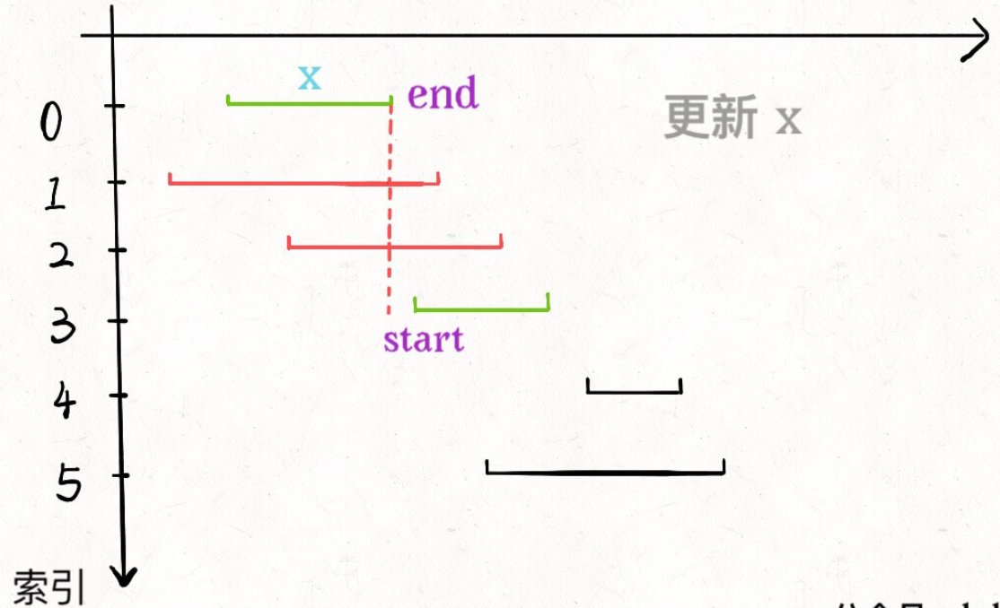

#### Solution

在实际的代码编写中，我们对按照右端点排好序的区间进行遍历，并且实时维护上一个选择区间的右端点 x_end。如果当前遍历到的区间 intervals[i] 与上一个区间不重合，即`intervals[i][0] ≥end`，那么我们就可以贪心地选择这个区间，并将 `intervals[i][1]`更新为 x_end.


```java
public int eraseOverlapIntervals(int[][] intervals) {
        Arrays.sort(intervals, new Comparator<int[]>(){
            public int compare(int[] o1, int[] o2){
                return o1[1] - o2[1];
            }
        });

        int eraseCount = 0;
        int x_end = intervals[0][1];
        for(int i=1; i<intervals.length; i++){
            if(intervals[i][0]>=x_end){
                x_end = intervals[i][1];
            } else {
                eraseCount++;
            }
        }
        return eraseCount;
    }
```

时间复杂度：O(nlogn)，其中 n 是区间的数量。我们需要 **O(nlogn)** 的时间对所有的区间按照右端点进行**升序排序**，并且需要 **O(n)**的时间进行**遍历**。

空间复杂度：O(logn)，即为排序需要使用的栈空间。

### [LC452. 用最少数量的箭引爆气球 - 尾部排序的区间问题](https://leetcode-cn.com/problems/minimum-number-of-arrows-to-burst-balloons/)

在二维空间中有许多球形的气球。对于每个气球，提供的输入是**水平方向**上，**气球直径的开始和结束坐标**。由于它是水平的，所以纵坐标并不重要，因此只要知道开始和结束的横坐标就足够了。开始坐标总是小于结束坐标。

一支弓箭可以沿着 x 轴从不同点完全垂直地射出。在坐标 x 处射出一支箭，若有一个气球的直径的开始和结束坐标为 `x``start`，`x``end`， 且满足  `xstart ≤ x ≤ x``end`，则该气球会被引爆。可以射出的弓箭的数量没有限制。 弓箭一旦被射出之后，可以无限地前进。我们想找到使得**所有气球全部被引爆，所需的弓箭的最小数量**。

给你一个数组 `points` ，其中 `points [i] = [xstart,xend]` ，返回引爆所有气球所必须射出的**最小弓箭数**。

**示例 1：**

```
输入：points = [[10,16],[2,8],[1,6],[7,12]]
输出：2
解释：对于该样例，x = 6 可以射爆 [2,8],[1,6] 两个气球，以及 x = 11 射爆另外两个气球
```

**示例 2：**

```
输入：points = [[1,2],[3,4],[5,6],[7,8]]
输出：4
```

**示例 3：**

```
输入：points = [[1,2],[2,3],[3,4],[4,5]]
输出：2
```

**示例 4：**

```
输入：points = [[1,2]]
输出：1
```

**示例 5：**

```
输入：points = [[2,3],[2,3]]
输出：1
```

函数签名：

```java
public int findMinArrowShots(int[][] points);
```

#### Solution

如果最多有 `n` 个相交的区间，那么就至少需要 `n` 个箭头穿透所有区间；

箭头如果碰到气球的边界气球也会爆炸，相当于区间的**边界触碰**也算相交。

```java
public int findMinArrowShots(int[][] points) {
        Arrays.sort(points, new Comparator<int[]>(){
            public int compare(int[] o1, int[] o2){
                return o1[1] < o2[1]?-1:1;//避免Integer相减超出边界值的情况
            }
        });

        int arrowCount = 1;
        int x_end = points[0][1];
        for(int i=1; i<points.length; i++){
            if(points[i][0]>x_end){
                arrowCount++;
                x_end = points[i][1];
            } 
        }
        return arrowCount;
    }
```

#### [1024. 视频拼接](https://leetcode-cn.com/problems/video-stitching/)

难度中等237收藏分享切换为英文接收动态反馈

你将会获得一系列视频片段，这些片段来自于一项持续时长为 `T` 秒的体育赛事。这些片段可能有所重叠，也可能长度不一。

视频片段 `clips[i]` 都用区间进行表示：开始于 `clips[i][0]` 并于 `clips[i][1]` 结束。我们甚至可以对这些片段自由地再剪辑，例如片段 `[0, 7]` 可以剪切成 `[0, 1] + [1, 3] + [3, 7]` 三部分。

我们需要将这些片段进行再剪辑，并将剪辑后的内容拼接成覆盖整个运动过程的片段（`[0, T]`）。返回所需片段的最小数目，如果无法完成该任务，则返回 `-1` 。

 

**示例 1：**

```
输入：clips = [[0,2],[4,6],[8,10],[1,9],[1,5],[5,9]], T = 10
输出：3
解释：
我们选中 [0,2], [8,10], [1,9] 这三个片段。
然后，按下面的方案重制比赛片段：
将 [1,9] 再剪辑为 [1,2] + [2,8] + [8,9] 。
现在我们手上有 [0,2] + [2,8] + [8,10]，而这些涵盖了整场比赛 [0, 10]。
```

**示例 2：**

```
输入：clips = [[0,1],[1,2]], T = 5
输出：-1
解释：
我们无法只用 [0,1] 和 [1,2] 覆盖 [0,5] 的整个过程。
```

**示例 3：**

```
输入：clips = [[0,1],[6,8],[0,2],[5,6],[0,4],[0,3],[6,7],[1,3],[4,7],[1,4],[2,5],[2,6],[3,4],[4,5],[5,7],[6,9]], T = 9
输出：3
解释： 
我们选取片段 [0,4], [4,7] 和 [6,9] 。
```

**示例 4：**

```
输入：clips = [[0,4],[2,8]], T = 5
输出：2
解释：
注意，你可能录制超过比赛结束时间的视频。
```

函数签名：

```java
public int videoStitching(int[][] clips, int time);
```

#### 思路

先按照**起点升序**排序，如果**起点相同**的话按照**终点降序**排序。

为什么这样排序呢，主要考虑到这道题的以下两个特点：

1、要用若干短视频凑出完成视频 `[0, T]`，**至少得有一个短视频的起点是 0**。

这个很好理解，如果没有一个短视频是从 0 开始的，那么区间 `[0, T]` 肯定是凑不出来的。

2、如果有几个短视频的起点都相同，那么一定应该选择那个**最长**（终点最大）**的视频**。

这一条就是贪心的策略，因为题目让我们计算最少需要的短视频个数，如果起点相同，那肯定是越长越好，不要白不要，多出来了大不了剪辑掉嘛。

具体地：

- 如果 `clips[0]` 是的起点是 0，那么 `clips[0]` 这个视频一定会被选择。

- 比较所有**起点小于等于** **`clips[0][1]`** 的区间，根据贪心策略，它们中**终点最大**的那个区间就是第二个会被选中的视频。

- 然后可以通过第二个视频区间贪心选择出第三个视频，以此类推，直到覆盖区间 `[0, T]`，或者无法覆盖返回 -1。

    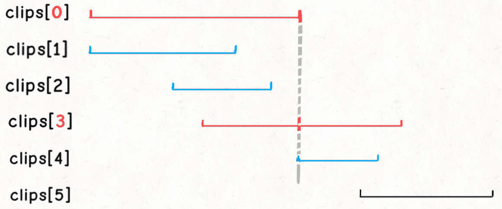

#### Solution

```java
public int videoStitching(int[][] clips, int time) {
        Arrays.sort(clips, new Comparator<int[]>(){
            public int compare(int[] o1, int[] o2){
                if(o1[0]==o2[0])
                    return o1[1]>o2[1] ? -1 : 1;
                else 
                    return o1[0]<o2[0] ? -1 : 1;
            }
        });

        int curEnd = 0;
        int nextEnd = 0;
        int res = 0;
        int i = 0;
        while(i<clips.length && clips[i][0]<=curEnd) {//作用1⃣️确保clips[0][0]=0来保证从0开始；作用2⃣️如果起点比上一个片段的终点大，那么将出现断层，比如[1,2],[4,5]
            while(i<clips.length && clips[i][0]<=curEnd){//比较所有起点小于等于clips[0][1]的区间，根据贪心策略，它们中终点最大的那个区间就是第二个会被选中的视频。
                nextEnd = Math.max(nextEnd, clips[i][1]);
                i++;
            }
            curEnd = nextEnd;
            res++;
            if(curEnd>=time)
                return res; 
        }
        return -1;
    }
```

虽然代码中有一个嵌套的 while 循环，但这个嵌套 while 循环的时间复杂度是 `O(N)`。因为当 `i` 递增到 `n` 时循环就会结束，所以这段代码只会执行 `O(N)` 次。

但是别忘了我们对 `clips` 数组进行了一次排序，消耗了 `O(NlogN)` 的时间，所以本算法的总时间复杂度是 `O(NlogN)`。

### [LC55. 跳跃游戏](https://leetcode-cn.com/problems/jump-game/)

给定一个非负整数数组 `nums` ，你最初位于数组的 **第一个下标** 。

数组中的每个元素代表你在该位置可以跳跃的**最大长度**。

判断你是否能够到达最后一个下标。

**示例 1：**

```
输入：nums = [2,3,1,1,4]
输出：true
解释：可以先跳 1 步，从下标 0 到达下标 1, 然后再从下标 1 跳 3 步到达最后一个下标。
```

**示例 2：**

```
输入：nums = [3,2,1,0,4]
输出：false
解释：无论怎样，总会到达下标为 3 的位置。但该下标的最大跳跃长度是 0 ， 所以永远不可能到达最后一个下标。
```

####  思路

每一步都计算一下从**当前位置最远**能够跳到哪里，然后和一个**全局最优的最远**位置 `farthest` 做对比，通过每一步的最优解，更新全局最优解，这就是贪心。

#### Solution

```java
public boolean canJump(int[] nums) {
        int farthest = 0;
        for(int i=0; i<nums.length; i++){
            if(farthest<i)
                return false;
            farthest = Math.max(farthest, i+nums[i]);
        }
        return true;
    }
```

### [LC45. 跳跃游戏 II](https://leetcode-cn.com/problems/jump-game-ii/)

给你一个非负整数数组 `nums` ，你最初位于数组的第一个位置。

数组中的每个元素代表你在该位置可以跳跃的最大长度。

你的目标是使用**最少的跳跃次数**到达数组的最后一个位置。

假设你总是可以到达数组的最后一个位置。

**示例 1:**

```
输入: nums = [2,3,1,1,4]
输出: 2
解释: 跳到最后一个位置的最小跳跃数是 2。
     从下标为 0 跳到下标为 1 的位置，跳 1 步，然后跳 3 步到达数组的最后一个位置。
```

**示例 2:**

```
输入: nums = [2,3,0,1,4]
输出: 2
解释：nums[0]跳一步到nums[1], nums[1]跳三步到最后一个位置
```

#### Solution1: 带备忘录的暴力递归

// 定义：从索引 p 跳到最后一格，至少需要 dp(nums, p) 步
int dp(int[] nums, int idx);

我们想求的结果就是 `dp(nums, 0)`，base case 就是当 `idx` 超过最后一格时，不需要跳跃：

状态就是当前所站立的索引 `idx`，选择就是可以跳出的步数。

```java
//memo[i]记录nums[i]跳到最后一格所需的最小跳跃次数
    int[] memo;
    public int jump(int[] nums) {
        memo = new int[nums.length];
        Arrays.fill(memo, nums.length);
        return dpJump(nums, 0); 
    }
    public int dpJump(int[] nums, int idx){
        if(idx>=nums.length-1)
            return 0;
        if(memo[idx]!=nums.length)
            return memo[idx];
        for(int i=nums[idx]; i>=1; i--){//i不能从0开始，因为i=0的时候会在dpJump(nums, idx+0)出现死循环
            memo[idx] = Math.min(memo[idx], dpJump(nums, idx+i)+1);
        }
        return memo[idx];
    } 
```

该算法的时间复杂度是 递归深度 × 每次递归需要的时间复杂度，即 O(N^2)，时间太慢了

#### Solution2: 贪心

**贪心算法比动态规划多了一个性质：贪心选择性质**。

真的需要「递归地」计算出每一个子问题的结果，然后求最值吗？**直观地想一想，似乎不需要递归，只需要判断哪一个选择最具有「潜力」即可**：每次在上次能跳到的范围（max_end）内选择一个能跳的最远的位置（也就是能跳到farthest位置的点）作为下次的起跳点 ！

​		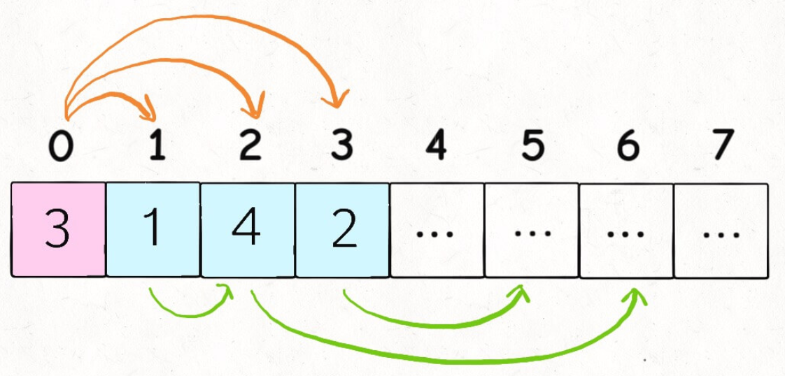

​		比如上图这种情况，我们站在索引 0 的位置，可以向前跳 1，2 或 3 步，你说应该选择跳多少呢？

​		**显然应该跳 2 步调到索引 2，因为** **`nums[2]`** **的可跳跃区域涵盖了索引区间** **`[3..6]`****，比其他的都大**。如果		想求最少的跳跃次数，那么往索引 2 跳必然是最优的选择。

在具体的实现中，我们维护当前能够到达的最大下标位置，记为边界max_end。我们从左到右遍历数组，**到达边界时，更新边界并将跳跃次数增加 1。**

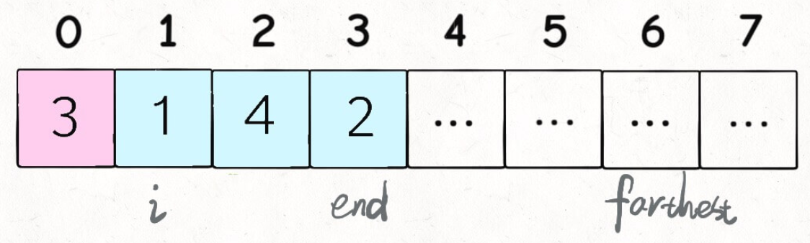

`i` 和 `max_end` 标记了可以选择的跳跃步数，`farthest` 标记了所有选择 `[i..end]` 中能够跳到的最远距离，`steps` 记录了跳跃次数。

**在遍历数组时，我们不访问最后一个元素，这是因为在访问最后一个元素之前，我们的边界max_end一定大于<u>等于</u>最后一个位置，否则就无法跳到最后一个位置了。<u>如果访问最后一个元素，在边界正好为最后一个位置的情况下，我们会增加一次「不必要的跳跃次数」</u>，因此我们不必访问最后一个元素。**

```java
public int jump(int[] nums) {
        int farthest = 0;
        int max_end = 0;
        int steps = 0;
        for(int i=0; i<nums.length-1; i++){
            farthest = Math.max(farthest, i+nums[i]);
            if(i==max_end){
                steps++;
                max_end = farthest;
            }
        }
        return steps;
    }
```

本算法的时间复杂度 O(N)，空间复杂度 O(1)

## 路径和

### [LC931. 下降路径最小和](https://leetcode-cn.com/problems/minimum-falling-path-sum/)

给你一个 n x n 的 方形 整数数组 matrix ，请你找出并返回通过 matrix 的下降路径 的 最小和 。

下降路径 可以从第一行中的任何元素开始，并从每一行中选择一个元素。在**下一行选择的元素和当前行所选元素最多相隔一列**（即位于正下方或者沿对角线向左或者向右的第一个元素）。具体来说，位置 (row, col) 的下一个元素应当是 (row + 1, col - 1)、(row + 1, col) 或者 (row + 1, col + 1) 。

示例 1：输入：matrix = [[2,1,3],[6,5,4],[7,8,9]]
输出：13
解释：下面是两条和最小的下降路径，用加粗标注：
[[2,**1**,3],      [[2,**1**,3],
 [6,**5**,4],       [6,5,**4**],
 [**7**,8,9]]       [7,**8**,9]]

示例 2：输入：matrix = [[-19,57],[-40,-5]]
输出：-59
解释：下面是一条和最小的下降路径，用加粗标注：
[[**-19**,57],
 [**-40**,-5]]

示例 3：输入：matrix = [[-48]]
输出：-48

函数签名：

```java
public int minFallingPathSum(int[][] matrix);
```

#### 思路：

这个 `dp` 函数的含义如下：

```java
int dp(int[][] matrix, int i, int j, int[] memo);
```

**从第一行（** `matrix[0][..]`**）向下落，落到位置** **`matrix[i][j]`** **的最小路径和为** **`dp(matrix, i, j)`**;

备忘录`memo[i][j]`记录的是**从第一行（** `matrix[0][..]`**）向下落，落到位置** **`matrix[i][j]`** **的最小路径和。

**最后一行的任意一列**都有可能落到，所以要**穷举**一下，看看落到哪一列才能得到最小的路径和。

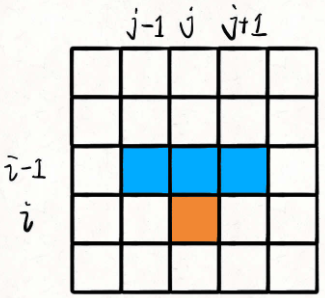

**对于 `matrix[i][j]`，只有可能从 `matrix[i-1][j], matrix[i-1][j-1], matrix[i-1][j+1]` 这三个位置转移过来。** **只要知道到达** **`(i-1, j), (i-1, j-1), (i-1, j+1)`** **这三个位置的最小路径和，加上** **`matrix[i][j]`** **的值，就能够计算出来到达位置** **`(i, j)`** **的最小路径和**

#### Solution1: 带备忘录的递归

```java
public int minFallingPathSum(int[][] matrix) {
        int[][] memo = new int[matrix.length][matrix[0].length];
        //初始化memo的每个元素为666666
        for(int i=0; i<memo.length; i++){
            Arrays.fill(memo[i],666666);
        }
        int res = Integer.MAX_VALUE;
        for(int j=0; j<matrix[0].length; j++){
            //终点可能在最后一行的某一列
            res = Math.min(res, dp(matrix, matrix[0].length-1, j, memo));
        }
        return res;
    }
    //从第一行（matrix[0][..]）向下落，落到位置matrix[i][j]的最小路径和为dp(matrix, i, j)。
    public int dp(int[][] matrix, int i, int j, int[][] memo){
        //列的边界
        if(j<0 || j>=matrix[0].length)
        return 999999;
        //查备忘录
        if(memo[i][j]!=666666)
            return memo[i][j];
        // base case
        if(i==0)
            return matrix[0][j];
        // 状态转移
        memo[i][j] = matrix[i][j] + 
        //返回三者中的最小值
        Math.min(
            Math.min(dp(matrix,i-1,j-1,memo)
                    ,dp(matrix,i-1,j,memo)),
            dp(matrix,i-1,j+1,memo)
        );

        return memo[i][j];
    }
```

**对于这个** **`dp`** **函数仔细探讨三个问题**：

**1、base case 为什么是 `i == 0`？**

i==0是第一行。

**2、备忘录 `memo` 的初始值为什么是 66666？其他值行不行？**

**这是由题目给出的数据范围决定的**。

备忘录 `memo` 数组的作用是什么？

就是**防止重复计算**，将 `dp(matrix, i, j)` 的计算结果存进 `memo[i][j]`，遇到重复计算可以直接返回。

那么，我们必须要知道 `memo[i][j]` **到底存储计算结果没有？**如果存结果了，就直接返回；没存，就去递归计算。

所以，`memo` 的**初始值**一定得是**特殊值**，和合法的答案有所区分。

我们回过头看看题目给出的数据范围：

> `matrix` 是 `n x n` 的二维数组，其中 `1 <= n <= 100`；对于二维数组中的元素，有 `-100 <= matrix[i][j] <= 100`。

假设 `matrix` 的大小是 100 x 100，所有元素都是 100，那么从第一行往下落，得到的路径和就是 100 x 100 = 10000，也就是最大的合法答案。

类似的，依然假设 `matrix` 的大小是 100 x 100，所有元素是 -100，那么从第一行往下落，就得到了最小的合法答案 -100 x 100 = -10000。

也就是说，这个问题的合法结果会落在区间 `[-10000, 10000]` 中。

所以，我们 `memo` 的初始值就要避开区间 `[-10000, 10000]`，换句话说，`memo` 的初始值只要在区间 `(-inf, -10001] U [10001, +inf)` 中就可以。

**3、对于索引的合法性检测，返回值为什么是 99999？其他的值行不行？**

`i - 1, j - 1, j + 1` 这几个运算可能会造成索引越界，对于索引越界的 `dp` 函数，应该返回一个不可能被取到的值。

因为我们调用的是 `min` 函数，最终返回的值是最小值，所以对于不合法的索引，只要 `dp` 函数返回一个永远不会被取到的最大值即可。

刚才说了，合法答案的区间是 `[-10000, 10000]`，所以我们的返回值只要大于 10000 就相当于一个永不会取到的最大值。

换句话说，只要返回区间 `[10001, +inf)` 中的一个值，就能保证不会被取到。


## 动态规划与回溯的对比

### [LC494. 目标和](https://leetcode-cn.com/problems/target-sum/)

给你一个整数数组 `nums` 和一个整数 `target` 。

向数组中的每个整数前添加 `'+'` 或 `'-'` ，然后串联起所有整数，可以构造一个 **表达式** ：

- 例如，`nums = [2, 1]` ，可以在 `2` 之前添加 `'+'` ，在 `1` 之前添加 `'-'` ，然后串联起来得到表达式 `"+2-1"` 。

返回可以通过上述方法构造的、运算结果等于 `target` 的**不同表达式的数目**。

**示例 1：**

```
输入：nums = [1,1,1,1,1], target = 3
输出：5
解释：一共有 5 种方法让最终目标和为 3 。
-1 + 1 + 1 + 1 + 1 = 3
+1 - 1 + 1 + 1 + 1 = 3
+1 + 1 - 1 + 1 + 1 = 3
+1 + 1 + 1 - 1 + 1 = 3
+1 + 1 + 1 + 1 - 1 = 3
```

**示例 2：**

```
输入：nums = [1], target = 1
输出：1
```

函数签名：

```java
public int findTargetSumWays(int[] nums, int target);
```

####  Solution1: 暴力回溯

**对于每个数字** **`nums[i]`****，我们可以选择给一个正号** **`+`** **或者一个负号** **`-`**，然后利用回溯模板穷举出来所有可能的结果，数一数到底有几种组合能够凑出 `target` 不就行了嘛？

```java
int count = 0;
    public int findTargetSumWays(int[] nums, int target) {
        backtrack(nums, 0, target);
        return count;
    }
    public void backtrack(int[] nums, int idx, int rest){
        //base case:最后一个元素做完选择，即最后一个元素的idx+1（也就是nums.length)
        if(idx==nums.length){
            if(rest==0){
                count++;
            }
            return;
        }
        //这里没写成for选择in选择列表的形式，因为只有两个选择；
        //也无需撤销选择，因为这里的选择并没有改变全局变量
        //当前元素选择+
        backtrack(nums, idx+1, rest-nums[idx]);
        //当前元素选择-
        backtrack(nums, idx+1, rest+nums[idx]);
    }
```

时间复杂度为 `O(2^N)`，`N` 为 `nums` 的大小。

那么，这个问题如何用动态规划思想进行优化呢？

#### Solution2: 用动态规划消除重叠子问题来优化

如何发现重叠子问题？看是否可能出现重复的「状态」。对于递归函数来说，函数参数中会变的参数就是「状态」，对于 `backtrack` 函数来说，会变的参数为 `idx` 和 `rest`。

因此我们可以用备忘录记录**状态(idx, rest)**和**结果**(当前状态下有**几种解**能使运算结果到目标值target)。

**这里用HashMap，以“idx，rest”的String为key，当前状态下解的个数为value建立备忘录。**

```java
HashMap<String,Integer> memo = new HashMap<>();
    public int findTargetSumWays(int[] nums, int target) {
        return dp(nums, 0, target);
    }
    public int dp(int[] nums, int idx, int rest){
        //base case:最后一个元素做完选择，即最后一个元素的idx+1（也就是nums.length)
        if(idx==nums.length){
            if(rest==0){
                return 1;
            }
            return 0;
        }
        
        String key = idx + "," + rest;//不能用单引号，因为单引号代表char
        //查备忘录
        if(memo.containsKey(key))
            return memo.get(key);//返回当前状态下的解的个数
        //备忘录中无，就计算
        memo.put(key,
        dp(nums, idx+1, rest-nums[idx]) +//当前元素选择+时的解的个数
        dp(nums, idx+1, rest+nums[idx]));//当前元素选择-时的解的个数
        return memo.get(key);
    }	
```

