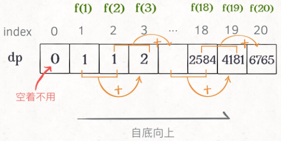

# Dynamic Programming 动态规划

------

## 框架

求解动态规划的核心问题是**穷举**。动态规划的穷举有点特别，因为这类问题**存在「重叠子问题」**，如果暴力穷举的话效率会极其低下，所以需要「**备忘录**」或者「DP table」来**优化穷举过程**，避免不必要的计算。

而且，动态规划问题一定会**具备「最优子结构」**，才能通过子问题的最值得到原问题的最值。

另外，虽然动态规划的核心思想就是穷举求最值，但是问题可以千变万化，穷举所有可行解其实并不是一件容易的事，只有列出**正确的「状态转移方程」**，才能正确地穷举。

**明确 base case -> 明确「状态」-> 明确「选择」 -> 定义 dp 数组/函数的含义**。

```java
# 初始化 base case
dp[0][0][...] = base
# 进行状态转移
for 状态1 in 状态1的所有取值：
    for 状态2 in 状态2的所有取值：
        for ...
            dp[状态1][状态2][...] = 求最值(选择1，选择2...)
```

### [LC509. 斐波那契数](https://leetcode-cn.com/problems/fibonacci-number/)

斐波那契数，通常用 F(n) 表示，形成的序列称为 斐波那契数列 。该数列由 0 和 1 开始，后面的每一项数字都是前面两项数字的和。也就是：

F(0) = 0，F(1) = 1
F(n) = F(n - 1) + F(n - 2)，其中 n > 1
给你 n ，请计算 F(n) 。

示例 1：

输入：2
输出：1
解释：F(2) = F(1) + F(0) = 1 + 0 = 1
示例 2：

输入：3
输出：2
解释：F(3) = F(2) + F(1) = 1 + 1 = 2
示例 3：

输入：4
输出：3
解释：F(4) = F(3) + F(2) = 2 + 1 = 3

函数签名:

```java
public int fib(int n)
```

#### Solution1: 暴力递归

```java
public int fib(int n){
  	if(n==0)
      	return 0;
  	if(n==1)
      	return 1;
		return fib(n-1)+fib(n-2);
}
```

##### 问题：

**递归算法的时间复杂度怎么计算？就是用子问题个数乘以解决一个子问题需要的时间。**

首先计算子问题个数，即递归树中节点的总数。显然二叉树节点总数为指数级别，所以子问题个数为 O(2^n)。

然后计算解决一个子问题的时间，在本算法中，没有循环，只有 `f(n - 1) + f(n - 2)` 一个加法操作，时间为 O(1)。

所以，这个算法的时间复杂度为二者相乘，即 O(2^n)，指数级别，爆炸。


f(18)、f(17)...会被重复计算，这就是动态规划问题的第一个性质：**重叠子问题**。

#### Solution2: 自顶向下 - 带备忘录的递归解法 - 用备忘录解决重叠子问题

可以造一个「备忘录」，**每次遇到一个子问题先去「备忘录」里查一查**：

​		如果发现之前已经解决过这个问题了，直接把答案拿出来用，不要再耗时去计算了；

​		如果发现之前没解决过这个问题，就去算，算完记到备忘录里。

一般使用一个数组充当这个「备忘录」，当然你也可以使用哈希表（字典），思想都是一样的。

```java
		public int fib(int n) {
        int[] memo = new int[n+1];
        return fibHelper(n, memo);
    }
    public int fibHelper(int n, int[] memo){
        if(n==0)
            return 0;
        if(n==1)
            return 1;
    
        if(memo[n]!=0)//结果已经计算过并存在备忘录中
            return memo[n];
        //不存在于备忘录中，算出结果，添加进去
        memo[n] = fibHelper(n-1, memo)+fibHelper(n-2, memo);
        return memo[n];
    } 
```


子问题个数，即图中节点的总数，由于本算法不存在冗余计算，子问题就是 `f(1)`, `f(2)`, `f(3)` ... `f(20)`，数量和输入规模 n = 20 成正比，所以子问题个数为 O(n)。

解决一个子问题的时间，同上，没有什么循环，时间为 O(1)。

所以，本算法的时间复杂度是 O(n)。比起暴力算法，是降维打击。

这种解法和迭代的动态规划已经差不多了，只不过这种方法叫做「自顶向下」，动态规划叫做「自底向上」。

啥叫「自顶向下」？注意我们刚才画的递归树（或者说图），是从上向下延伸，都是从一个规模较大的原问题比如说 `f(20)`，向下逐渐分解规模，直到 `f(1)` 和 `f(2)` 这两个 base case，然后逐层返回答案，这就叫「自顶向下」。


啥叫「自底向上」？反过来，我们直接从最底下，最简单，问题规模最小的 `f(1)` 和 `f(2)` 开始往上推，直到推到我们想要的答案 `f(20)`，这就是动态规划的思路，这也是为什么动态规划一般都脱离了递归，而是由循环迭代完成计算。



#### Solution3: 自底向上 - 带备忘录的迭代解法 - 用备忘录解决重叠子问题

这里，引出「**状态转移方程**」这个名词，实际上就是描述问题结构的数学形式：

​		**f(n) = 0 if n==0;** - base case 1

​		**f(n) = 1 if n==1;** - base case2

​		**f(n) = f(n-1) + f(n-2) if n>=2;** - 通用case

你把 `f(n)` 想做一个状态 `n`，这个状态 `n` 是由状态 `n - 1` 和状态 `n - 2` 相加转移而来，这就叫状态转移。

```java
		public int fib(int n) {
        if(n==0)
            return 0;

        int[] dp = new int[n+1];
        //base case
        dp[0] = 0;
        dp[1] = 1;
        //状态转移方程
        for(int i=2; i<=n; i++){
            dp[i] = dp[i-1] + dp[i-2];
        }
        return dp[n];
    }
```

**动态规划问题最困难的就是写出这个暴力解，即状态转移方程**。

本算法的时间复杂度是 O(n)。

这个例子的最后，讲一个细节优化。细心的读者会发现，根据斐波那契数列的状态转移方程，当前状态只和**之前的两个状态**有关，其实并**不需要那么长的一个 DP table 来存储所有的状态**，只要用prev 和 curr来存储之前的两个状态就行了。所以，可以进一步优化，把空间复杂度降为 O(1)：

```java
    public int fib(int n) {
        if (n < 1) return 0;
        if (n == 2 || n == 1) 
            return 1;
        int prev = 1, curr = 1;
        for (int i = 3; i <= n; i++) {
            int sum = prev + curr;
            prev = curr;
            curr = sum;
        }
        return curr;
    }
```

这个技巧就是所谓的「**状态压缩**」，如果我们发现每次状态转移只需要 DP table 中的一部分，那么可以尝试用状态压缩来缩小 DP table 的大小，只记录必要的数据，上述例子就相当于把DP table 的大小从 `n` 缩小到 2。后续的动态规划章节中我们还会看到这样的例子，**一般来说是把一个二维的 DP table 压缩成一维**，即把空间复杂度从 O(n^2) 压缩到 O(n)。

### [LC322. 零钱兑换](https://leetcode-cn.com/problems/coin-change/)

给你一个整数数组 coins ，表示不同面额的硬币；以及一个整数 amount (>=0)，表示总金额。

计算并返回可以凑成总金额所需的 最少的硬币个数 。如果没有任何一种硬币组合能组成总金额，返回 -1 。

你可以认为每种硬币的数量是无限的。

示例 1：

输入：coins = [1, 2, 5], amount = 11
输出：3 
解释：11 = 5 + 5 + 1
示例 2：

输入：coins = [2], amount = 3
输出：-1
示例 3：

输入：coins = [1], amount = 0
输出：0
示例 4：

输入：coins = [1], amount = 1
输出：1
示例 5：

输入：coins = [1], amount = 2
输出：2

函数签名：

```java
public int coinChange(int[] coins, int amount);
```

1、**确定 base case**，这个很简单，显然目标金额 `amount` 为 0 时算法返回 0，因为不需要任何硬币就已经凑出目标金额了。

2、**确定「状态」，也就是原问题和子问题中会变化的变量**。由于硬币数量无限，硬币的面额也是题目给定的，只有目标金额会不断地向 base case 靠近，所以唯一的「状态」就是目标金额 `amount`。

3、**确定「选择」，也就是导致「状态」产生变化的行为**。目标金额为什么变化呢，因为你在选择硬币，你每选择一枚硬币，就相当于减少了目标金额。所以说所有硬币的面值，就是你的「选择」。

4、**明确** **`dp`** **数组的定义**。就本题来说，状态只有一个，即「目标金额」，题目要求我们计算凑出目标金额所需的最少硬币数量。所以我们可以这样定义 `dp` 函数：

`dp(n)` 的定义：**输入一个目标金额 `n`，返回凑出目标金额 `n` 的最少硬币数量。**


#### Solution1: 带备忘录的递归

```java
		public int coinChange(int[] coins, int amount) {
        int[] dp = new int[amount+1];
        dpCoinChange(coins, amount, dp);
        return dp[amount];
        }
    public int dpCoinChange(int[] coins, int amount, int[] dp){
        //base case
        if(amount==0)
            return 0;
        if(amount<0)
            return -1;
        //查备忘录. 
        if(dp[amount]!=0)
            return dp[amount];
        //计算当前amount所需coin个数的最小值    
        int min = Integer.MAX_VALUE;
        for(int i=0; i<coins.length; i++){
            int subproblem = dpCoinChange(coins, amount-coins[i], dp);
            if(subproblem>=0)//subproblem有解
                if(1+subproblem<min)//+1是因为这次计算会消耗一枚硬币
                    min = 1+subproblem;
        }
        if(min!=Integer.MAX_VALUE)//min有被更新
            dp[amount] = min;
        else//min未被更新，无解
            dp[amount] = -1;
        return dp[amount];
    }
```


时间复杂度：O(Sn)，其中 S 是金额，n 是面额数。我们一共需要计算 S 个状态的答案，且每个状态 dp(S) 由于上面的记忆化的措施只计算了一次，而计算一个状态的答案需要枚举 n 个面额值，所以一共需要 O(Sn)的时间复杂度。
空间复杂度：O(S)，我们需要额外开一个长为 S 的数组来存储计算出来的答案 dp(S) 。

#### Solution2: dp 数组的迭代解法

```java
		public int coinChange(int[] coins, int amount) {
        int[] dp = new int[amount+1];
        //base case
        dp[0] = 0;
        for(int i=1; i<=amount; i++){
            //初始化一个最大值（这里不能是Integer.MAX_VALUE是因为Integer.MAX_VALUE+1 == Integer.MIN_VALUE 
            dp[i] = amount+1;
        }
        // 外层 for 循环在遍历所有状态的所有取值
        for(int i=1; i<=amount; i++){
            // 内层 for 循环在求所有选择的最小值
            for(int c=0; c<coins.length; c++){
                // 子问题无解，跳过
                if(i-coins[c]<0)
                    continue;
                dp[i] = Math.min(dp[i], 1+dp[i-coins[c]]);
            }
        }
        if(dp[amount]<amount+1)
            return dp[amount];
        else
            return -1;
    }
```

