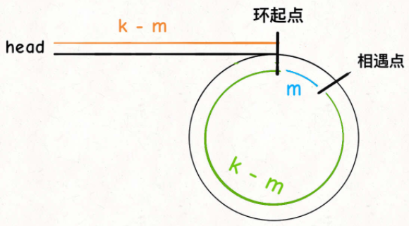
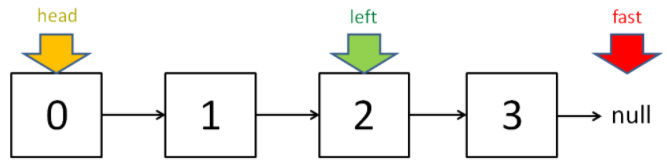

# 双指针

[toc]


------

## 快慢指针

### [LC141. 环形链表: 判断链表中是否有环](https://leetcode-cn.com/problems/linked-list-cycle/)

给定一个链表，判断链表中是否有环。

如果链表中有某个节点，可以通过连续跟踪 next 指针再次到达，则链表中存在环。 为了表示给定链表中的环，我们使用整数 pos 来表示链表尾连接到链表中的位置（索引从 0 开始）。 如果 pos 是 -1，则在该链表中没有环。注意：pos 不作为参数进行传递，仅仅是为了标识链表的实际情况。

如果链表中存在环，则返回 true 。 否则，返回 false 。


示例 1：


输入：head = [3,2,0,-4], pos = 1
输出：true
解释：链表中有一个环，其尾部连接到第二个节点。

示例 2：


输入：head = [1,2], pos = 0
输出：true
解释：链表中有一个环，其尾部连接到第一个节点。

示例 3：


输入：head = [1], pos = -1
输出：false
解释：链表中没有环。

提示：**pos可忽略，按照链表的特性去做题即可**

函数签名：

```java
public boolean hasCycle(ListNode head);
```


#### **思路**

用两个指针，一个跑得快，一个跑得慢。

​		如果不含有环，跑得快的那个指针最终会遇到 `null`，说明链表不含环；

​		如果含有环，快指针最终会超慢指针一圈，和慢指针相遇，说明链表含有环。

#### <u>**Solution**</u>

```java
		public boolean hasCycle(ListNode head) {
        ListNode slow = head, fast = head;
        //fast.next!=null是为了防止NullPointerException
      	//要确保fast、fast.next都不为null才能访问fast.next.next
        while(fast!=null && fast.next!=null){
            slow = slow.next;
            fast = fast.next.next;
            if(fast==slow)
                return true;
        }
        return false;
    }
```

### [LC142. 环形链表 II: 返回链表开始入环的第一个节点；如果链表无环，则返回 null](https://leetcode-cn.com/problems/linked-list-cycle-ii/)

函数签名：

```java
public ListNode detectCycle(ListNode head);
```

**`当快慢指针相遇时，让其中任一个指针指向头节点，然后让它俩以相同速度前进，再次相遇时所在的节点位置就是环开始的位置。`**下面的解释看不懂就记结论！

第一次相遇时，假设慢指针 `slow` 走了 `k` 步，那么快指针 `fast` 一定走了 `2k` 步。**这多走的** **`k`** **步其实就是** **`fast`** **指针在环里转圈圈，所以** **`k`** **的值就是环长度的「整数倍」**。

设相遇点距环的起点的距离为 `m`，那么环的起点距头结点 `head` 的距离为 `k - m`，也就是说如果从 `head` 前进 `k - m` 步就能到达环起点。

巧的是，如果从相遇点继续前进 `k - m` 步，也恰好到达环起点。你甭管 `fast` 在环里到底转了几圈，反正走 `k` 步可以到相遇点，那走 `k - m` 步一定就是走到环起点了：



所以，只要我们把快慢指针中的任一个重新指向 `head`，然后两个指针同速前进，`k - m` 步后就会相遇，相遇之处就是环的起点了。

#### <u>**Solution**</u>

```java
		public ListNode detectCycle(ListNode head) {
        ListNode slow = head, fast = head;
      	//fast.next!=null是为了防止NullPointerException
      	//要确保fast、fast.next都不为null才能访问fast.next.next
        while(fast!=null && fast.next!=null){
            slow = slow.next;
            fast = fast.next.next;
            if(fast==slow)
                break;
        }
        
        if(fast==null || fast.next==null)
        // fast 遇到空指针说明没有环
            return null;

        slow = head;
        while(slow!=fast){
            slow = slow.next;
            fast = fast.next;
        }
        return slow;
    }
```

### [LC876. 链表的中间结点](https://leetcode-cn.com/problems/middle-of-the-linked-list/)

给定一个头结点为 head 的非空单链表，返回链表的中间结点。

如果有两个中间结点，则返回**第二个中间结点**。

示例 1：

输入：[1,2,3,4,5]
输出：此列表中的结点 3 (序列化形式：[3,4,5])
返回的结点值为 3 。 (测评系统对该结点序列化表述是 [3,4,5])。
注意，我们返回了一个 ListNode 类型的对象 ans，这样：
ans.val = 3, ans.next.val = 4, ans.next.next.val = 5, 以及 ans.next.next.next = NULL.
示例 2：

输入：[1,2,3,4,5,6]
输出：此列表中的结点 4 (序列化形式：[4,5,6])
由于该列表有两个中间结点，值分别为 3 和 4，我们返回第二个结点。

函数签名：

```java
public ListNode middleNode(ListNode head);
```


#### <u>**Solution**</u>

如果链表无环（非空单链表即表示无环），则可用快慢指针的方法，快指针速度是慢指针的2倍；

快指针走完时，慢指针正好走到链表的中间位置（node总数为奇数）；

如果长度是偶数，`slow` 最终的位置是中间偏右，因为null也占一位，slow会多走一位



图中left即为slow

```java
		public ListNode middleNode(ListNode head) {
        ListNode fast, slow;
        fast = slow = head;
        while (fast != null && fast.next != null) {
            fast = fast.next.next;
            slow = slow.next;
        }
    // slow 就在中间位置
    return slow;
    }
```

### [LC19. 删除链表的倒数第 N 个结点](https://leetcode-cn.com/problems/remove-nth-node-from-end-of-list/)

给你一个链表，删除链表的倒数第 n 个结点，并且返回链表的头结点。

进阶：你能尝试使用一趟扫描实现吗？

 示例 1：


输入：head = [1,2,3,4,5], n = 2
输出：[1,2,3,5]

示例 2：

输入：head = [1], n = 1
输出：[]

示例 3：

输入：head = [1,2], n = 1
输出：[1]

函数签名：

```java
public ListNode removeNthFromEnd(ListNode head, int n);
```


#### 思路

让快指针先走 `n` 步：

如果n步后走到null，说明倒数第 n 个节点就是第一个节点；

如果n步后快指针没走到头，快慢指针开始同速前进。这样当快指针走到链表末尾 `null` 时，慢指针所在的位置就是倒数第 `n` 个链表节点（`n` 不会超过链表长度）。

#### Solution

```java
		public ListNode removeNthFromEnd(ListNode head, int n) {
        ListNode fast = head, slow = head;
        while(n>0){
            fast = fast.next;
            n--;
        }

        // 如果此时快指针走到头了，说明倒数第 n 个节点就是第一个节点
        if(fast==null)
            return head.next;
        
        // 让慢指针和快指针同步向前
        while(fast!=null && fast.next!=null){//fast.next!=null是为了防止slow多走一位
            slow = slow.next;
            fast = fast.next;
        }
        // slow.next 就是倒数第 n 个节点，删除它
        slow.next = slow.next.next;
        return head;
    }
```


## 左右指针

左右指针在数组中实际是指两个索引值，一般初始化为 `left = 0, right = nums.length - 1` 。

### [Binary Search二分查找](./binarySearch.md)

### [LC167. 两数之和 II - 输入有序数组](https://leetcode-cn.com/problems/two-sum-ii-input-array-is-sorted/)

给定一个已按照 升序排列  的整数数组 numbers ，请你从数组中找出两个数满足相加之和等于目标数 target 。

函数应该以长度为 2 的整数数组的形式返回这两个数的下标值。numbers 的下标 从 1 开始计数 ，所以答案数组应当满足 1 <= answer[0] < answer[1] <= numbers.length 。

你可以假设每个输入只对应唯一的答案，而且你不可以重复使用相同的元素。


示例 1：

输入：numbers = [2,7,11,15], target = 9
输出：[1,2]
解释：2 与 7 之和等于目标数 9 。因此 index1 = 1, index2 = 2 。
示例 2：

输入：numbers = [2,3,4], target = 6
输出：[1,3]
示例 3：

输入：numbers = [-1,0], target = -1
输出：[1,2]

函数签名：

```java
public int[] twoSum(int[] numbers, int target);
```


#### 思路

left在数组头，right在数组尾，向中间查找;

#### Solution

```java
		public int[] twoSum(int[] numbers, int target) {
        int left = 0, right = numbers.length-1;
        //left!=right因为要返回两个不同数
        while(left<right){
            int sum = numbers[left] + numbers[right];
            if(sum==target)
                // 题目要求的索引是从 1 开始的
                return new int[]{left+1, right+1};
            else if(sum>target)
                right = right - 1;// 让 sum 小一点
            else if(sum<target)
                left = left + 1;// 让 sum 大一点
        }
        return new int[]{-1,-1};
    }
```

### [LC344. 反转字符串](https://leetcode-cn.com/problems/reverse-string/)

编写一个函数，其作用是将输入的字符串反转过来。输入字符串以字符数组 char[] 的形式给出。

不要给另外的数组分配额外的空间，你必须**原地**修改输入数组、使用 O(1) 的额外空间解决这一问题。

你可以假设数组中的所有字符都是 ASCII 码表中的可打印字符。

 示例 1：

输入：["h","e","l","l","o"]
输出：["o","l","l","e","h"]

示例 2：

输入：["H","a","n","n","a","h"]
输出：["h","a","n","n","a","H"]

函数签名：

```java
public void reverseString(char[] s);
```

#### Solution

以mid为中轴，对换元素即可

```java
		public void reverseString(char[] s) {
        int left = 0, right = s.length - 1;
        while(left<right){
            char tmp = s[left];
            s[left] = s[right];
            s[right] = tmp;
            left++;
            right--;
        }
    }
```

### [LC870. 优势洗牌 aka田忌赛马](https://leetcode-cn.com/problems/advantage-shuffle/)

给定两个大小相等的数组 A 和 B，A 相对于 B 的优势可以用满足 A[i] > B[i] 的索引 i 的数目来描述。

返回 A 的任意排列，使其相对于 B 的优势最大化，**尽可能多的让** **`A[i] > B[i]`**。

示例 1：

输入：A = [2,7,11,15], B = [1,10,4,11]
输出：[2,11,7,15]

示例 2：

输入：A = [12,24,8,32], B = [13,25,32,11]
输出：[24,32,8,12]

函数签名：

```java
public int[] advantageCount(int[] nums1, int[] nums2);
```

#### Solution

将齐王和田忌的马按照战斗力排序，然后按照排名一一对比。如果田忌的马能赢，那就比赛，如果赢不了，那就换个垫底的来送人头，保存实力。

```java
		//PriorityQueue用法：
    //https://www.cnblogs.com/wei-jing/p/10806236.html
    //https://www.cnblogs.com/Elliott-Su-Faith-change-our-life/p/7472265.html
    // Comparator<int[]> cmp = new Comparator<int[]>() {
    //     public int compare(int[] num2IdxAndVal1, int[] num2IdxAndVal2) {
    //         //升序
    //         //return num2IdxAndVal1[1] - num2IdxAndVal2[1];
    //         //降序
    //         return num2IdxAndVal2[1] - num2IdxAndVal1[1];
    //     }
    // };
    public int[] advantageCount(int[] nums1, int[] nums2) {
        PriorityQueue<int[]> num2MaxPQ = new PriorityQueue<>(
            (int[] num2IdxAndVal1, int[] num2IdxAndVal2) -> { 
                //idxAndVal[0]是nums2的索引i
                //idxAndVal[1]是nums2[i]的值
                //这里是给PQ<int[]>按照idxAndVal[1]的值降序排序
                //此方法相当于上面注释掉的cmp方法
                return num2IdxAndVal2[1] - num2IdxAndVal1[1];
        }
        );
        //给nums2从大到小降序排序
        for(int i=0; i<nums2.length; i++)
            num2MaxPQ.offer(new int[]{i, nums2[i]});

        //给nums1从小到大升序排序
        Arrays.sort(nums1);
        //左边最小，右边最大
        int num1Left = 0, num1Right = nums1.length-1;
        int[] res = new int[nums1.length];
        while(!num2MaxPQ.isEmpty()){
            int[] num2IdxAndVal = num2MaxPQ.poll();
            //num2中最大值的索引
            int num2Idx = num2IdxAndVal[0];
            //num2中的最大值
            int num2Val = num2IdxAndVal[1];
            
            if(nums1[num1Right]>num2Val){
                //num1的最大值nums1[num1Right]能比过num2的最大值num2Val,就自己上
                res[num2Idx] = nums1[num1Right];
                num1Right--;
            } else {
                //num1的最大值nums1[num1Right]不能比过num2的最大值num2Val,就找最垃圾的混一下
                res[num2Idx] = nums1[num1Left];
                num1Left++;
            }
        }
        return res;
    }
```

## 滑动窗口（子字符串匹配问题）

「子序列」和「子串」这两个名词的区别，子串一定是连续的，而子序列不一定是连续的。

```java
/* 滑动窗口算法框架 */
void slidingWindow(string s, string t) {
    unordered_map<char, int> need, window;
    for (char c : t) need[c]++;

    int left = 0, right = 0;
    int valid = 0; 
    while (right < s.size()) {
        // c 是将移入窗口的字符
        char c = s[right];
        // 右移窗口
        right++;
        // 进行窗口内数据的一系列更新
        ...

        /*** debug 输出的位置 ***/
        printf("window: [%d, %d)\n", left, right);
        /********************/

        // 判断左侧窗口是否要收缩
        while (window needs shrink) {
            // d 是将移出窗口的字符
            char d = s[left];
            // 左移窗口
            left++;
            // 进行窗口内数据的一系列更新
            ...
        }
    }
}
```

这两个 `...` 处的操作分别是右移和左移窗口更新操作，它们操作是完全对称的。

1、我们在字符串 `S` 中使用双指针中的左右指针技巧，初始化 `left = right = 0`，把索引**左闭右开**区间 `[left, right)` 称为一个「窗口」。

2、重复的：

在**外循环中**：我们先不断地增加 `right` 指针扩大窗口 `[left, right)`，直到窗口中的字符串符合要求时（包含了 `T` 中的所有字符）进入**内循环**。

在**内循环中**：此时，我们停止增加 `right`，转而不断增加 `left` 指针缩小窗口 `[left, right)`，直到窗口中的字符串不再符合要求（不包含 `T` 中的所有字符了）。同时，每次增加 `left`，我们都要更新一轮结果，直到left那一位的char不在T中，但是要注意，left的前一位char必定在T中。

（当下n个外循环过去，right遇到与left前一位char相同的char时，再次开始内循环，移动left的指针）

3、重复第 2 步，  直到 `right` 到达字符串 `S` 的尽头。

### [LC76. 最小覆盖子串](https://leetcode-cn.com/problems/minimum-window-substring/)

给你一个字符串 s 、一个字符串 t 。返回 s 中涵盖 t 所有字符的**最小子串**。如果 s 中不存在涵盖 t 所有字符的子串，则返回空字符串 "" 。

注意：

对于 t 中重复字符，我们寻找的子字符串中该字符数量必须不少于 t 中该字符数量。
如果 s 中存在这样的子串，我们保证它是唯一的答案。


示例 1：

输入：s = "ADOBECODEBANC", t = "ABC"
输出："BANC"
示例 2：

输入：s = "a", t = "a"
输出："a"
示例 3:

输入: s = "a", t = "aa"
输出: ""
解释: t 中两个字符 'a' 均应包含在 s 的子串中，
因此没有符合条件的子字符串，返回空字符串。

函数签名：

```java
public String minWindow(String s, String t);
```


#### Solution

**套模板，只需要思考以下四个问题**：

1、当移动 `right` 扩大窗口，即加入字符时，应该更新哪些数据？

2、什么条件下，窗口应该暂停扩大，开始移动 `left` 缩小窗口？

3、当移动 `left` 缩小窗口，即移出字符时，应该更新哪些数据？

4、我们要的结果应该在扩大窗口时还是缩小窗口时进行更新？

如果一个字符进入窗口，应该增加 `window` 计数器；如果一个字符将移出窗口的时候，应该减少 `window` 计数器；当 `valid` 满足 `need` 时应该收缩窗口；应该在收缩窗口的时候更新最终结果。

```java
		public String minWindow(String s, String t) {
        Map<Character, Integer> need = new HashMap<>(), window = new HashMap<>();
        //找到需要的char及个数
        for(int i=0; i<t.length(); i++){
            char c = t.charAt(i);
            need.put(c, need.getOrDefault(c,0)+1);
        }
        //模版
        int valid = 0, left = 0, right = 0;
        //记录最小覆盖子串substring的起始索引及长度
        int start = 0, len = Integer.MAX_VALUE;
        
        while(right<s.length()){//这里str.length()是有括号的！
            // r 是将移入窗口的字符
            char r = s.charAt(right);
            if(need.containsKey(r)){
                window.put(r, window.getOrDefault(r,0)+1);
                // !!!这里和下面都有个坑，window.get(addChar)和need.get(addChar)返回的都是对象，最好用.equals()方法比较大小
                if(window.get(r).equals(need.get(r))){
                    valid++;
                }
            }
            //因为.substring()方法endIdx的char不包括在其中，所以要先+1；
            right++;
            // 判断左侧窗口是否要收缩
            while(valid==need.size()){
                // 在这里更新最小覆盖子串
                if((right-left)<len){
                    start = left;
                    len = right - left;
                }
                // l 是将移出窗口的字符
                char l = s.charAt(left);
                if(need.containsKey(l)){
                    if(window.get(l).equals(need.get(l))){
                        valid--;
                    }
                    //valid减完 再减window
                    window.put(l, window.get(l)-1);
                }
                left++;
            }
        }
        if(len!=Integer.MAX_VALUE)
            //.substring(beginIndex, endIndex)方法：
            //beginIndex -- 起始索引（包括）, 索引从 0 开始。
            //endIndex -- 结束索引（不包括）
            return s.substring(start,start+len);
        else 
            return "";
    }
```

需要注意的是，当我们发现某个字符在 `window` 的数量满足了 `need` 的需要，就要更新 `valid`，表示有一个字符已经满足要求。而且，你能发现，两次对窗口内数据的更新操作是完全对称的。

当 `valid == need.size()` 时，说明 `T` 中所有字符已经被覆盖，已经得到一个可行的覆盖子串，现在应该开始收缩窗口了，以便得到「最小覆盖子串」。

移动 `left` 收缩窗口时，窗口内的字符都是可行解，所以应该在收缩窗口的阶段进行最小覆盖子串的更新，以便从可行解中找到长度最短的最终结果。

### [LC567. 字符串的排列](https://leetcode-cn.com/problems/permutation-in-string/)

给定两个字符串 s1 和 s2，写一个函数来判断 s2 是否包含 s1 的排列。排列：abc有6种排列abc、acb、bac、bca、cab、cba。

换句话说，第一个字符串的排列之一是第二个字符串的 子串 。

示例 1：

输入: s1 = "ab" s2 = "eidbaooo"
输出: True
解释: s2 包含 s1 的排列之一 ("ba").
示例 2：

输入: s1= "ab" s2 = "eidboaoo"
输出: False

函数签名：

```java
public boolean checkInclusion(String s1, String s2);
```

#### Solution

因为是全排列都算，所以只需要判断

1、**s1**中**每个char**出现的**次数**是否等于**滑动窗口**中**同样的char出现的次数**

2、滑动窗口的size应该=s1.length()， 所以移动 `left` 缩小窗口的时机是窗口大小大于 `t.size()` 时

```java
		public boolean checkInclusion(String s1, String s2) {
        Map<Character, Integer> need = new HashMap<>(), window = new HashMap<>();
        for(int i=0; i<s1.length(); i++){
            char c = s1.charAt(i);
            need.put(c, need.getOrDefault(c,0)+1);
        }

        int left = 0, right = 0, valid = 0;

        while(right<s2.length()){
            char addToWindow = s2.charAt(right);
            if(need.containsKey(addToWindow)){
                window.put(addToWindow, window.getOrDefault(addToWindow,0)+1);
                if(window.get(addToWindow).equals(need.get(addToWindow))){
                    valid++;
                }
            }
            right++;
            while(right-left>=s1.length()){
                // 在这里判断是否找到了合法的子串
                if(valid==need.size())
                    return true;

                char removeFromWindow = s2.charAt(left);
                if(need.containsKey(removeFromWindow)){
                    if(window.get(removeFromWindow).equals(need.get(removeFromWindow))){
                        valid--;
                    }
                    window.put(removeFromWindow, window.get(removeFromWindow)-1);
                }
                left++;
            }
        }
        return false;
    }
```

### [LC438. 找到字符串中所有字母异位词](https://leetcode-cn.com/problems/find-all-anagrams-in-a-string/)

给定两个字符串 s 和 p，找到 s 中所有 p 的 异位词 的子串，返回这些子串的起始索引。不考虑答案输出的顺序。

异位词 指字母相同，但排列不同的字符串。

示例 1:

输入: s = "cbaebabacd", p = "abc"
输出: [0,6]
解释:
起始索引等于 0 的子串是 "cba", 它是 "abc" 的异位词。
起始索引等于 6 的子串是 "bac", 它是 "abc" 的异位词。
 示例 2:

输入: s = "abab", p = "ab"
输出: [0,1,2]
解释:
起始索引等于 0 的子串是 "ab", 它是 "ab" 的异位词。
起始索引等于 1 的子串是 "ba", 它是 "ab" 的异位词。
起始索引等于 2 的子串是 "ab", 它是 "ab" 的异位词。

函数签名：

```java
public List<Integer> findAnagrams(String s, String p);
```


#### Solution

与LC567一样（寻找字符串的排列），只是找到一个合法异位词（排列）之后将起始索引加入 `res` 即可。

```java
public List<Integer> findAnagrams(String s, String p) {
        List<Integer> res = new LinkedList<>();
        Map<Character, Integer> need = new HashMap<>(), window = new HashMap<>();
        for(int i=0; i<p.length(); i++){
            char c = p.charAt(i);
            need.put(c, need.getOrDefault(c,0)+1);
        }

        int left = 0, right = 0, valid = 0;

        while(right<s.length()){
            char addToWindow = s.charAt(right);
            if(need.containsKey(addToWindow)){
                window.put(addToWindow, window.getOrDefault(addToWindow,0)+1);
                if(window.get(addToWindow).equals(need.get(addToWindow))){
                    valid++;
                }
            }
            right++;
            while(right-left>=p.length()){
                // 在这里判断是否找到了合法的子串
                if(valid==need.size())
                    //return true;这里改成起始索引
                    res.add(left);
                char removeFromWindow = s.charAt(left);
                if(need.containsKey(removeFromWindow)){
                    if(window.get(removeFromWindow).equals(need.get(removeFromWindow))){
                        valid--;
                    }
                    window.put(removeFromWindow, window.get(removeFromWindow)-1);
                }
                left++;
            }
        }
        //return false;
        return res;
    }
```

### [LC3. 无重复字符的最长子串](https://leetcode-cn.com/problems/longest-substring-without-repeating-characters/)

给定一个字符串 s ，请你找出其中不含有重复字符的 最长子串 的长度。

 

示例 1:

输入: s = "abcabcbb"
输出: 3 
解释: 因为无重复字符的最长子串是 "abc"，所以其长度为 3。
示例 2:

输入: s = "bbbbb"
输出: 1
解释: 因为无重复字符的最长子串是 "b"，所以其长度为 1。
示例 3:

输入: s = "pwwkew"
输出: 3
解释: 因为无重复字符的最长子串是 "wke"，所以其长度为 3。
     请注意，你的答案必须是 子串 的长度，"pwke" 是一个子序列，不是子串。
示例 4:

输入: s = ""
输出: 0

函数签名：

```java
public int lengthOfLongestSubstring(String s);
```


#### Solution

这就是变简单了，连 `need` 和 `valid` 都不需要，而且更新窗口内数据也只需要简单的更新计数器 `window` 即可。

当 `window[c]` 值大于 1 时，说明窗口中存在重复字符，不符合条件，就该移动 `left` 缩小窗口了嘛。

唯一需要注意的是，在哪里更新结果 `res` 呢？我们要的是最长无重复子串，哪一个阶段可以保证窗口中的字符串是没有重复的呢？

这里和之前不一样，**要在收缩窗口完成后更新 `res`**：因为窗口收缩的 while 条件是存在重复元素，如果在收缩窗口的while里更新res， 那么本身不存在重复元素时就更新不了res。

```java
		public int lengthOfLongestSubstring(String s) {
        int length = 0;
        Map<Character, Integer> window = new HashMap<>();
        int left = 0, right = 0;
        while(right<s.length()){
            char addToWindow = s.charAt(right);
            window.put(addToWindow, window.getOrDefault(addToWindow,0)+1);
            right++;
            while(window.get(addToWindow)>1){
                char removeFromWindow = s.charAt(left);
                window.put(removeFromWindow, window.get(removeFromWindow)-1);
                left++;
            }
            //放在收缩窗口的循环外面，因为又可能不会收缩窗口
            length = Math.max(length, right-left);
        }
        return length;
    }
```

## 双指针相关高频面试题

### [LC5. 最长回文子串](https://leetcode-cn.com/problems/longest-palindromic-substring/)

给你一个字符串 s，找到 s 中最长的回文子串。

**回文串就是正着读和反着读都一样的字符串**。比如说字符串 `aba` 和 `abba` 都是回文串，因为它们对称，反过来还是和本身一样。反之，字符串 `abac` 就不是回文串。

示例 1：

输入：s = "babad"
输出："bab"
解释："aba" 同样是符合题意的答案。
示例 2：

输入：s = "cbbd"
输出："bb"
示例 3：

输入：s = "a"
输出："a"
示例 4：

输入：s = "ac"
输出："a"

函数签名：

```java
public String longestPalindrome(String s);
```


#### 思路

比如说字符串 `aba` 和 `abba` 都是回文串，因为它们对称，反过来还是和本身一样。反之，字符串 `abac` 就不是回文串。

**寻找回文串的问题核心思想是：从中间开始向两边扩散来判断回文串**。

可以看到回文串的的长度可能是奇数，也可能是偶数，这就添加了回文串问题的难度，解决该类问题的核心是**双指针**：奇数情况下两个指针的起始位置相同，偶数情况下两个指针的起始位置相差1。

```java
		public String longestPalindrome(String s) {
        String res = "";
        for(int i=0; i<s.length(); i++){
            //最小回文子串长度为奇数，存在中点
            String odd = palindrome(s, i, i);
            //最小回文子串长度为偶数，不存在中点
            String even = palindrome(s, i, i+1);
            //找到res, odd, even中最长的
            if(odd.length()>res.length())
                res = odd;
            if(even.length()>res.length())
                res = even;
        }
        return res;
    }
    public String palindrome(String s, int left, int right){
        // 防止索引越界
        while(left>=0 && right<s.length()){
            if(s.charAt(left)!=s.charAt(right))
                break;
            // 向两边展开
            left--;
            right++;
        }
        //left要加1是因为跳出循环时不满足s.charAt(left)!=s.charAt(right)
        //而前一个循环中满足s.charAt(left-1)==s.charAt(right-1)
        //right不用减1是因为Java的substring方法的endIdx是开区间（取不到s[endIdx]，要加一）
        return s.substring(left+1, right);// 返回以 s.charAt(left) 和 s.charAt(right) 为中心的最长回文串
    }
```

时间复杂度 O(N^2)，空间复杂度 O(1)。

值得一提的是，这个问题可以用动态规划方法解决，时间复杂度一样，但是空间复杂度至少要 O(N^2) 来存储 DP table。这道题是少有的动态规划非最优解法的问题。