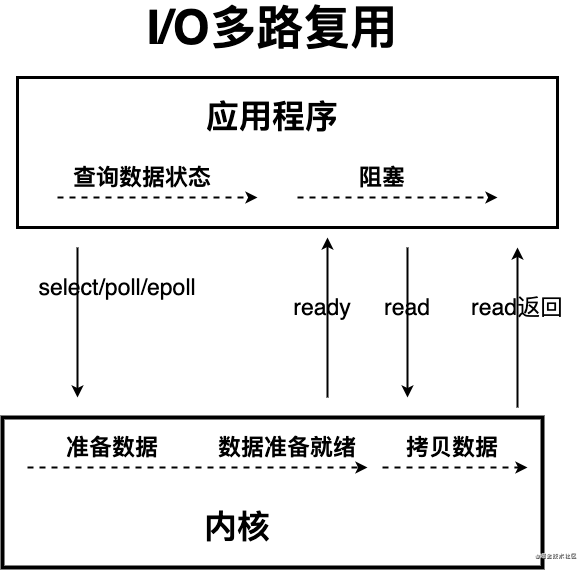
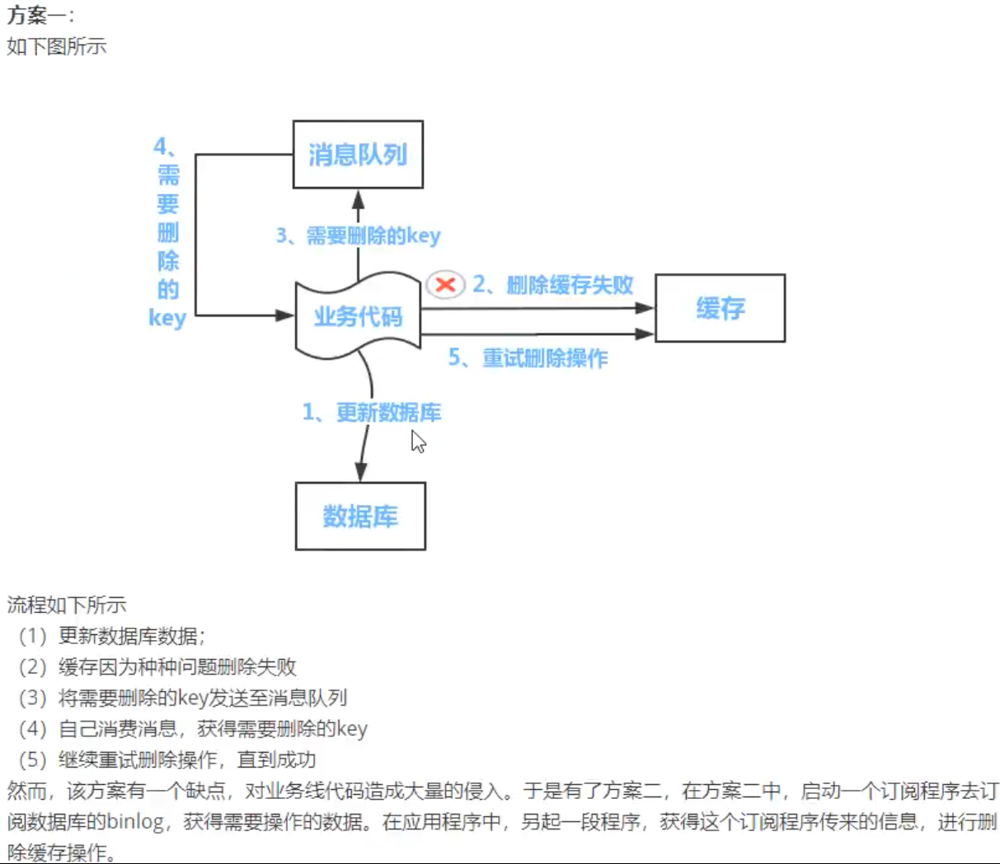

## 简单介绍一下 Redis 呗!

简单来说 **Redis 就是一个使用 C 语言开发的数据库**，不过与传统数据库不同的是 **Redis 的数据是存在内存中的** ，也就是它是内存数据库，所以读写速度非常快，因此 Redis 被广泛应用于缓存方向。

另外，**Redis 除了做缓存之外，也经常用来做分布式锁，甚至是消息队列。**

**Redis 提供了多种数据类型来支持不同的业务场景。Redis 还支持事务 、持久化、Lua 脚本、多种集群方案。**

## 缓存数据的处理流程是怎样的？

1. 如果用户请求的数据**在缓存中就直接返回**。
2. 缓存中不存在的话就看数据库中是否存在。
3. **数据库中存在的话就更新缓存中的数据**。
4. 数据库中不存在的话就返回空数据。

## 为什么要用 Redis/为什么要用缓存？

*简单，来说使用缓存主要是为了提升用户体验以及应对更多的用户。*

下面我们主要从“高性能”和“高并发”这两点来看待这个问题。


### **高性能** ：

假如用户第一次访问数据库中的某些数据的话，这个过程是比较慢，毕竟是从硬盘中读取的。但是，如果说，用户访问的数据属于高频数据并且不会经常改变的话，那么我们就可以很放心地将该用户访问的数据存在缓存中。

**这样有什么好处呢？** 那就是保证用户下一次再访问这些数据的时候就可以直接从缓存中获取了。操作缓存就是直接操作内存，所以速度相当快。

不过，要**保持数据库和缓存中的数据的一致性**。 如果数据库中的对应数据改变的之后，**同步改变缓存中相应的数据**即可！

### **高并发：**

一般像 MySQL 这类的数据库的 QPS 大概都在 1w 左右（4 核 8g） ，但是使用 Redis 缓存之后很容易达到 10w+，甚至最高能达到 30w+（就单机 redis 的情况，redis 集群的话会更高）。

> QPS（Query Per Second）：服务器每秒可以执行的查询次数；

由此可见，直接操作缓存能够承受的数据库请求数量是远远大于直接访问数据库的，所以我们可以考虑把数据库中的部分数据转移到缓存中去，这样用户的一部分请求会直接到缓存这里而不用经过数据库。进而，我们也就提高了系统整体的并发。

## Redis 除了做缓存，还能做什么？

- **分布式锁** ： 通过 Redis 来做分布式锁是一种比较常见的方式。通常情况下，我们都是基于 Redisson 来实现分布式锁。相关阅读：[《分布式锁中的王者方案 - Redisson》](https://mp.weixin.qq.com/s/CbnPRfvq4m1sqo2uKI6qQw)。
- **限流** ：一般是通过 Redis + Lua 脚本的方式来实现限流。相关阅读：[《我司用了 6 年的 Redis 分布式限流器，可以说是非常厉害了！》](https://mp.weixin.qq.com/s/kyFAWH3mVNJvurQDt4vchA)。
- **消息队列** ：Redis 自带的 list 数据结构可以作为一个简单的队列使用。Redis5.0 中增加的 Stream 类型的数据结构更加适合用来做消息队列。它比较类似于 Kafka，有主题和消费组的概念，支持消息持久化以及 ACK 机制。
- **复杂业务场景** ：通过 Redis 以及 Redis 扩展（比如 Redisson）提供的数据结构，我们可以很方便地完成很多复杂的业务场景比如通过 bitmap 统计活跃用户、通过 sorted set 维护排行榜。
- ......


## 单线程处理能力要比多线程差，但Redis 快的原因：

① 纯**内存访问**，Redis 将所有数据放在内存中。

② 非阻塞 IO，Redis 使用 epoll 作为 **IO 多路复用技术**的实现，再加上 Redis 本身的**事件处理模型**将 epoll 中的连接、读写、关闭都转换为时间，不在网络 IO 上浪费过多的时间。

单线程避免了线程切换和竞争产生的消耗。单线程的一个问题是对于每个命令的执行时间是有要求的，**如果某个命令执行时间过长会造成其他命令的阻塞，对于 Redis 这种高性能服务来说是致命的**，因此 Redis 是面向**快速执行场景**的数据库。

③ redis维护了一张全局hash表, 存取O(1)


(图中的entry是redis中的数据结构)


## Redis 常见数据结构以及使用场景分析

### string

1. **介绍** ：string 数据结构是简单的 **key-value** 类型。 Redis 并没有使用 C 的字符串表示，而是自己构建了一种 **简单动态字符串**（simple dynamic string，**SDS**）。Redis 的 SDS 不光可以**保存文本数据**还可以**保存二进制数据**，并且获取字符串长度复杂度为 O(1), 除此之外，Redis 的 SDS API 是安全的，不会造成缓冲区溢出。
2. **常用命令：** `set,get,strlen,exists,decr,incr,setex,setnx` 等等。

**普通字符串的基本操作：**

```shell
127.0.0.1:6379> set key value #设置 key-value 类型的值
OK
127.0.0.1:6379> get key # 根据 key 获得对应的 value
"value"
127.0.0.1:6379> exists key  # 判断某个 key 是否存在
(integer) 1
127.0.0.1:6379> strlen key # 返回 key 所储存的字符串值的长度。
(integer) 5
127.0.0.1:6379> del key # 删除某个 key 对应的值
(integer) 1
127.0.0.1:6379> get key
(nil)
```

**批量设置** :

```shell
127.0.0.1:6379> mset key1 value1 key2 value2 # 批量设置 key-value 类型的值
OK
127.0.0.1:6379> mget key1 key2 # 批量获取多个 key 对应的 value
1) "value1"
2) "value2"
```

**计数器（字符串的内容为整数的时候可以使用）：**

```shell
127.0.0.1:6379> set number 1
OK
127.0.0.1:6379> incr number # 将 key 中储存的数字值增一
(integer) 2
127.0.0.1:6379> get number
"2"
127.0.0.1:6379> decr number # 将 key 中储存的数字值减一
(integer) 1
127.0.0.1:6379> get number
"1"
```

**过期（默认为永不过期）**：

```shell
127.0.0.1:6379> expire key  60 # 数据在 60s 后过期
(integer) 1
127.0.0.1:6379> setex key 60 value # 数据在 60s 后过期 (setex:[set] + [ex]pire)
OK
127.0.0.1:6379> ttl key # 查看数据还有多久过期
(integer) 56
```

#### **string应用场景：** 

一般常用在需要**计数的场景，比如用户的访问次数、热点文章的点赞转发数量**等等。

### list

1. **介绍** ：**list** 即是 **链表**。链表是一种非常常见的数据结构，特点是易于数据元素的**插入和删除**并且可以**灵活调整链表长**度，但是链表的**随机访问困难**。Redis 的 list 的实现为一个 **双向链表**，即可以支持反向查找和遍历，更方便操作，不过带来了部分额外的内存开销。

2. **常用命令:** `rpush,lpop,lpush,rpop,lrange,llen` 等。

    

**通过 `rpush/lpop` 实现队列：**

```shell
127.0.0.1:6379> rpush myList value1 # 向 list 的头部（右边）添加元素, lpush为尾部(左边)添加元素
(integer) 1
127.0.0.1:6379> rpush myList value2 value3 # 向list的头部（最右边）添加多个元素
(integer) 3
127.0.0.1:6379> lpop myList # 将 list的尾部(最左边)元素取出
"value1"
127.0.0.1:6379> lrange myList 0 1 # 查看对应下标的list列表， 0 为 start,1为 end
1) "value2"
2) "value3"
127.0.0.1:6379> lrange myList 0 -1 # 查看列表中的所有元素，-1表示倒数第一
1) "value2"
2) "value3"
```

**通过 `rpush/rpop` 实现栈：**

```shell
127.0.0.1:6379> rpush myList2 value1 value2 value3
(integer) 3
127.0.0.1:6379> rpop myList2 # 将 list的头部(最右边)元素取出
"value3"
```

**通过 `lrange` 查看对应下标范围的列表元素：**

```shell
127.0.0.1:6379> rpush myList value1 value2 value3
(integer) 3
127.0.0.1:6379> lrange myList 0 1 # 查看对应下标的list列表， 0 为 start,1为 end
1) "value1"
2) "value2"
127.0.0.1:6379> lrange myList 0 -1 # 查看列表中的所有元素，-1表示倒数第一
1) "value1"
2) "value2"
3) "value3"
```

**通过 `llen` 查看链表长度：**

```shell
127.0.0.1:6379> llen myList
(integer) 3
```

#### list**应用场景:** 

**发布与订阅**或者说**消息队列**、**慢查询**。通过 `lrange` 命令，你可以基于 list 实现分页查询，性能非常高！

### hash

1. **介绍** ：hash 类似于 JDK1.8 **前**的 HashMap，内部实现也差不多(数组 + 链表)。不过，Redis 的 hash 做了更多优化。另外，hash 是一个 **string 类型**的 **field 和 value 的映射表**，**特别适合用于存储对象**，后续操作的时候，你可以直接仅仅修改这个对象中的**某个字段的值**。
2. **常用命令：** `hset,hmset,hexists,hget,hgetall,hkeys,hvals` 等。

下面我们简单看看它的使用！

```shell
127.0.0.1:6379> hmset userInfoKey name "guide" description "dev" age "24"
OK
127.0.0.1:6379> hexists userInfoKey name # 查看 key 对应的 value中指定的字段是否存在。
(integer) 1
127.0.0.1:6379> hget userInfoKey name # 获取存储在哈希表中指定字段的值。
"guide"
127.0.0.1:6379> hget userInfoKey age
"24"
127.0.0.1:6379> hgetall userInfoKey # 获取在哈希表中指定 key 的所有字段和值
1) "name"
2) "guide"
3) "description"
4) "dev"
5) "age"
6) "24"
127.0.0.1:6379> hkeys userInfoKey # 获取 key 列表
1) "name"
2) "description"
3) "age"
127.0.0.1:6379> hvals userInfoKey # 获取 value 列表
1) "guide"
2) "dev"
3) "24"
127.0.0.1:6379> hset userInfoKey name "GuideGeGe" # 修改某个字段对应的值
127.0.0.1:6379> hget userInfoKey name
"GuideGeGe"
```

#### **hash应用场景:**

 系统中对象数据的存储。  hash 数据结构来存储用户信息，商品信息等等。

### set

1. **介绍 ：** set 类似于 Java 中的 `HashSet` 。Redis 中的 set 类型是一种**无序集合**，集合中的元素没有先后顺序。set中**不存在重复数据**, set 提供了**判断某个成员是否在一个 set 集合内**的重要接口，这个也是 **list 所不能提供**的。可以基于 set 轻易实现**交集、并集、差集**的操作。
2. **常用命令：** `sadd,spop,smembers,sismember,scard,sinterstore,sunion` 等。

下面我们简单看看它的使用！

```shell
127.0.0.1:6379> sadd mySet value1 value2 # 添加元素进去
(integer) 2
127.0.0.1:6379> sadd mySet value1 # 不允许有重复元素
(integer) 0
127.0.0.1:6379> smembers mySet # 查看 set 中所有的元素
1) "value1"
2) "value2"
127.0.0.1:6379> scard mySet # 查看 set 的长度
(integer) 2
127.0.0.1:6379> sismember mySet value1 # 检查某个元素是否存在set 中，只能接收单个元素
(integer) 1
127.0.0.1:6379> sadd mySet2 value2 value3
(integer) 2
127.0.0.1:6379> sinterstore mySet3 mySet mySet2 # 获取 mySet 和 mySet2 的交集并存放在 mySet3 中
(integer) 1
127.0.0.1:6379> smembers mySet3
1) "value2"
```

#### **应用场景:** 

需要存放的数据**不能重复**以及需要获取多个数据源**交集和并集**等场景. 你可以将一个用户所有的关注人存在一个集合中，将其所有粉丝存在一个集合。Redis 可以非常方便的实现如**共同关注、共同粉丝、共同喜好**等功能。这个过程也就是求交集的过程。

### sorted set

1. **介绍：** 和 set 相比，sorted set 增加了一个**权重参数 score**，使得集合中的元素能够按 **权重score 进行有序排列**，还可以通过 score 的范围来获取元素的列表。有点像是 Java 中 HashMap 和 TreeSet 的结合体。
2. **常用命令：** `zadd,zcard,zscore,zrange,zrevrange,zrem` 等。

```shell
127.0.0.1:6379> zadd myZset 3.0 value1 # 添加元素到 sorted set 中 3.0 为权重
(integer) 1
127.0.0.1:6379> zadd myZset 2.0 value2 1.0 value3 # 一次添加多个元素
(integer) 2
127.0.0.1:6379> zcard myZset # 查看 sorted set 中的元素数量
(integer) 3
127.0.0.1:6379> zscore myZset value1 # 查看某个 value 的权重
"3"
127.0.0.1:6379> zrange  myZset 0 -1 # 顺序输出某个范围区间的元素，0 -1 表示输出所有元素
1) "value3"
2) "value2"
3) "value1"
127.0.0.1:6379> zrange  myZset 0 1 # 顺序输出某个范围区间的元素，0 为 start  1 为 stop
1) "value3"
2) "value2"
127.0.0.1:6379> zrevrange  myZset 0 1 # 逆序输出某个范围区间的元素，0 为 start  1 为 stop
1) "value1"
2) "value2"
```

#### **应用场景：** 

需要对数据根据某个**权重进行排序**的场景。比如在直播系统中，实时排行信息包含直播间在线用户列表，各种**礼物排行榜**，弹幕消息（可以理解为按消息维度的消息排行榜）等信息。

### bitmap

1. **介绍：** bitmap 存储的是**连续的二进制数字**（0 和 1），通过 bitmap, 只需要一个 bit 位来表示某个元素对应的值或者状态，key 就是对应元素本身 。我们知道 8 个 bit 可以组成一个 byte，所以 bitmap 本身会**极大的节省储存空间**。
2. **常用命令：** `setbit` 、`getbit` 、`bitcount`、`bitop`

```shell
# SETBIT 会返回之前位的值（默认是 0）这里会生成 7 个位
127.0.0.1:6379> setbit mykey 7 1
(integer) 0
127.0.0.1:6379> setbit mykey 7 0
(integer) 1
127.0.0.1:6379> getbit mykey 7
(integer) 0
127.0.0.1:6379> setbit mykey 6 1
(integer) 0
127.0.0.1:6379> setbit mykey 8 1
(integer) 0
# 通过 bitcount 统计被被设置为 1 的位的数量。
127.0.0.1:6379> bitcount mykey
(integer) 2
```

#### **应用场景：** 

适合需要保存**状态信息**（比如是否签到、是否登录...）并需要进一步对这些信息进行分析的场景。比如用户签到情况、活跃用户情况、用户行为统计（比如是否点赞过某个视频）。

**使用场景一：用户行为分析** 很多网站为了分析你的喜好，需要研究你点赞过的内容。

```shell
# 记录你喜欢过 001 号小姐姐
127.0.0.1:6379> setbit beauty_girl_001 uid 1
```

**使用场景二：统计活跃用户**

使用**时间作为 key**，然后**用户 ID 为 offset**，如果当日活跃过就设置为 1

那么我该如何计算某几天/月/年的活跃用户呢(暂且约定，统计时间内只要有一天在线就称为活跃)，有请下一个 redis 的命令

```shell
# 对一个或多个保存二进制位的字符串 key 进行位元操作，并将结果保存到 destkey 上。
# BITOP 命令支持 AND 、 OR 、 NOT 、 XOR 这四种操作中的任意一种参数(对应operation位置)
BITOP operation destkey key [key ...]
```

初始化数据：

```shell
127.0.0.1:6379> setbit 20210308 1 1
(integer) 0
127.0.0.1:6379> setbit 20210308 2 1
(integer) 0
127.0.0.1:6379> setbit 20210309 1 1
(integer) 0
```

统计 20210308~20210309 总活跃用户数: 1

```shell
127.0.0.1:6379> bitop and desk1 20210308 20210309 #求0308和0309的交集,设key为desk1
(integer) 1
127.0.0.1:6379> bitcount desk1
(integer) 1
```

统计 20210308~20210309 在线活跃用户数: 2

```shell
127.0.0.1:6379> bitop or desk2 20210308 20210309 #求0308和0309的并集,设key为desk2
(integer) 1
127.0.0.1:6379> bitcount desk2
(integer) 2
```

**使用场景三：用户在线状态**

对于获取或者统计用户在线状态，使用 bitmap 是一个节约空间且效率又高的一种方法。

只需要一个 key，然后用户 ID 为 offset，如果在线就设置为 1，不在线就设置为 0。

## Redis 单线程模型详解

**Redis 基于 Reactor 模式来设计开发了自己的一套高效的事件处理模型**. 这套事件处理模型对应的是 Redis 中的**文件事件处理器**（file event handler）。由于文件事件处理器（file event handler）是**单线程方式运行**的，所以我们一般都说 Redis 是**单线程模型**。

### **既然是单线程，那怎么监听大量的客户端连接呢？**

Redis 通过**epoll实现IO 多路复用程序** 来监听来自客户端的大量连接（或者说是**监听多个 socket**），它会将**感兴趣的事件及类型（读、写）**注册到**内核**中并**监听每个事件**是否发生。 **I/O 多路复用技术的使用让 Redis 不需要<u>额外创建多余的线程</u>来监听客户端的大量连接，降低了资源的消耗**（和 NIO 中的 `Selector` 组件很像）。

> 
>
> 
>
> IO 多路复用模型中，线程首先发起 select/poll/epoll 调用，询问内核数据是否准备就绪，等内核把数据准备好了，用户线程再发起 read 调用。read 调用的过程（数据从内核空间->用户空间）还是阻塞的。
>
> > 目前支持 IO 多路复用的系统调用，有 select，poll, epoll 等等。select 系统调用，是目前几乎在所有的操作系统上都有支持
> >
> > - **select 调用** ：内核提供的系统调用，它支持**一次查询多个系统调用的可用状态**。几乎所有的操作系统都支持。
> > - **epoll 调用** ：linux 2.6 内核，属于 select 调用的增强版本，优化了 IO 的执行效率。
>
> **IO 多路复用模型，通过减少无效的系统调用，减少了对 CPU 资源的消耗。**

另外， Redis 服务器是一个**事件驱动**程序，服务器需要处理两类事件：1. **文件事件**; 2. **时间事件**。

时间事件不需要多花时间了解，我们接触最多的还是 **文件事件**（客户端进行读取写入等操作，涉及一系列网络通信）。

> Redis 基于 Reactor 模式开发了自己的网络事件处理器：这个处理器被称为**文件事件处理器**（file event handler）。文件事件处理器使用 **I/O 多路复用**（multiplexing）程序来同时**监听多个套接字**，并根据套接字目前执行的任务来为套接字**关联不同的事件处理器**。
>
> 当**被监听的socket套接字**准备好执行连接**应答（accept）、读取（read）、写入（write）、关 闭（close）**等操作时，与**操作相对应的文件事件**就会产生，这时文件事件处理器就会调用套接字之前关联好的**事件处理器**来处理这些事件。
>
> **虽然文件事件处理器以单线程方式运行，但通过使用 epoll I/O 多路复用程序来监听多个套接字**，文件事件处理器既实现了高性能的网络通信模型，又可以很好地与 Redis 服务器中其他同样以单线程方式运行的模块进行对接，这保持了 Redis 内部单线程设计的简单性。

可以看出，文件事件处理器（file event handler）主要是包含 4 个部分：

- **多个 socket**（**客户端**连接）
- **IO 多路复用**程序（以此支持多个客户端连接）
- **文件事件分派器**（将 **socket 关联到相应的事件处理器**）
- **事件处理器**（**连接应答**处理器、**命令请求**处理器、**命令回复**处理器）


## Redis 没有使用多线程？为什么不使用多线程？

大体上来说，**Redis 6.0 之前主要还是单线程处理。**

**那，Redis6.0 之前 为什么不使用多线程？**

我觉得主要原因有下面 3 个：

1. **单线程编程容易并且更容易维护；**
2. **Redis 的性能瓶颈不在 CPU ，主要在内存和网络；**
3. **多线程就会存在死锁、线程上下文切换等问题，甚至会影响性能。**

### Redis6.0 之后为何引入了多线程？

**Redis6.0 引入多线程主要是为了提高网络 IO 读写性能**，因为这个算是 Redis 中的一个性能瓶颈（Redis 的瓶颈主要受限于内存和网络）。

虽然，Redis6.0 引入了多线程，但是 Redis 的多线程只是在网络数据的读写这类耗时操作上使用了，执行命令仍然是单线程顺序执行。因此，你也不需要担心线程安全问题。

Redis6.0 的多线程默认是禁用的，只使用主线程。如需开启需要修改 redis 配置文件 `redis.conf` ：

```
io-threads-do-reads yes
```

开启多线程后，还需要设置线程数，否则是不生效的。同样需要修改 redis 配置文件 `redis.conf` :

```
io-threads 4 #官网建议4核的机器建议设置为2或3个线程，8核的建议设置为6个线程
```

推荐阅读：

1. [Redis 6.0 新特性-多线程连环 13 问！](https://mp.weixin.qq.com/s/FZu3acwK6zrCBZQ_3HoUgw)
2. [为什么 Redis 选择单线程模型](https://draveness.me/whys-the-design-redis-single-thread/)

## 过期数据处理(内存淘汰机制)

### Redis 给缓存数据设置过期时间有啥用？

因为**内存是有限**的，如果缓存中的所有数据都是一直保存的话，分分钟直接 **Out of memory。**并且很多时候，我们的业务场景就是需要某个数据只在某一时间段内存在，比如我们的**短信验证码可能只在 1 分钟内有效**，**用户登录的 token 可能只在 1 天内有效。**如果使用传统的数据库来处理的话，一般都是自己判断过期，这样更麻烦并且性能要差很多。

Redis 自带了给缓存数据设置过期时间的功能，比如：

```java
127.0.0.1:6379> exp key 60 # 数据在 60s 后过期
(integer) 1
127.0.0.1:6379> setex key 60 value # 数据在 60s 后过期 (setex:[set] + [ex]pire)
OK
127.0.0.1:6379> ttl key # 查看数据还有多久过期
(integer) 56
```

注意：**Redis 中除了字符串类型有自己独有设置过期时间的命令 `setex` 外，其他方法都需要依靠 `expire` 命令来设置过期时间 。另外， `persist` 命令可以移除一个键的过期时间。 **

### Redis 是如何判断数据是否过期

Redis 通过一个叫做过期字典（可以看作是 hash 表）来保存数据过期的时间。过期字典的键指向 Redis 数据库中的某个 key(键)，过期字典的值是一个 long long 类型的整数，这个整数保存了 key 所指向的数据库键的过期时间（毫秒精度的 UNIX 时间戳）。


过期字典是存储在 redisDb 这个结构里的：

```cpp
typedef struct redisDb {
    ...

    dict *dict;     //数据库键空间,保存着数据库中所有键值对
    dict *expires   // 过期字典,保存着键的过期时间
    ...
} redisDb;
```

### 过期的数据的删除策略(内存淘汰机制)

> 相关问题：MySQL 里有 2000w 数据，Redis 中只存 20w 的数据，如何保证 Redis 中的数据都是热点数据?

如果假设你设置了一批 key 只能存活 1 分钟，那么 1 分钟后，Redis 是怎么对这批 key 进行删除的呢？

常用的过期数据的删除策略就两个（重要！自己造缓存轮子的时候需要格外考虑的东西）：

1. **惰性删除** ：只会在**取出 key 的时候**才对数据进行**过期检查**。这样对 CPU 最友好，但是可能会造成太多过期 key 没有被删除。
2. **定期删除** ： 每隔一段时间**抽取一批 key 执行删除过期 key 操作**。并且，Redis 底层会通过限制删除操作执行的时长和频率来减少删除操作对 CPU 时间的影响。

定期删除对内存更加友好，惰性删除对 CPU 更加友好。两者各有千秋，所以 Redis 采用的是 **定期删除+惰性/懒汉式删除** 。

但是，仅仅通过给 key 设置过期时间还是有问题的。因为还是可能存在定期删除和惰性删除漏掉了很多过期 key 的情况。这样就导致大量过期 key 堆积在内存里，然后就 Out of memory 了。

怎么解决这个问题呢？答案就是：**Redis 内存淘汰机制。**

Redis 提供 6 种数据淘汰策略：

1. **volatile-lru（least recently used）**：从已设置过期时间的数据集（server.db[i].expires）中挑选**最近最少使用的数据**淘汰
2. **volatile-ttl**：从已设置过期时间的数据集（server.db[i].expires）中挑选**将要过期的数据**淘汰
3. **volatile-random**：从已设置过期时间的数据集（server.db[i].expires）中**任意选择数据**淘汰
4. **allkeys-lru（least recently used）**：当**内存不足以容纳新写入数据时**，**在键空间中**，**移除最近最少使用的 key**（**这个是最常用的**）
5. **allkeys-random**：从数据集（server.db[i].dict）中**任意选择数据**淘汰
6. **no-eviction**：禁止写入, 驱逐新数据，也就是说当**内存不足以容纳新写入数据时，新写入操作会报错**。这个应该没人使用吧！

4.0 版本后增加以下两种：

1. **volatile-lfu（least frequently used）**：从已设置过期时间的数据集（server.db[i].expires）中挑选**最不经常使用的数据**淘汰
2. **allkeys-lfu（least frequently used）**：当**内存不足以容纳新写入数据时**，**在键空间中，移除最不经常使用**的 key

## Redis 持久化机制(怎么保证 Redis 挂掉之后再重启数据可以进行恢复)

很多时候我们需要持久化数据也就是**将内存中的数据写入到硬盘**里面，大部分原因是为了之后**重用数据**（比如**重启机器、机器故障之后恢复数据**），或者是为了**防止系统故障而将数据备份**到一个远程位置。

**Redis 的一种持久化方式叫快照（snapshotting，RDB），另一种方式是只追加文件（append-only file, AOF）**,AOF 文件的保存位置和 RDB 文件的位置相同，都是通过 dir 参数设置的，默认的文件名是 `appendonly.aof`。

### **快照（snapshotting）持久化（RDB）**

Redis 可以通过**创建快照**来获得**存储在内存里面的数据在某个时间点上的副本**。Redis 创建快照之后，可以**将快照复制到其他服务器**从而创建具有**相同数据的服务器副本**（**Redis 主从结构，主要用来提高 Redis 性能**），还可以将**快照留在本地**以便**重启服务器**的时候使用。

快照持久化是 Redis **默认采用的持久化方式**，在 Redis.conf 配置文件中默认有此下配置：x秒之后, 如果有y个key发生变化, 就自从触发快照的创建.

```shell
save 900 1           #在900秒(15分钟)之后，如果至少有1个key发生变化，Redis就会自动触发BGSAVE命令创建快照。

save 300 10          #在300秒(5分钟)之后，如果至少有10个key发生变化，Redis就会自动触发BGSAVE命令创建快照。

save 60 10000        #在60秒(1分钟)之后，如果至少有10000个key发生变化，Redis就会自动触发BGSAVE命令创建快照。
```

### **AOF（append-only file）持久化**

与快照持久化相比，AOF(append only file) 持久化的实时性更好，因此已成为主流的持久化方案。**默认情况下 Redis 没有开启 AOF**方式的持久化，可以通过 appendonly 参数开启：

```shell
appendonly yes
```

开启 AOF 持久化后**每执行一条会更改 Redis 中的数据的命令**，Redis 就会**将该命令写入到内存缓存** `server.aof_buf` 中，然后再根据 `appendfsync` 配置来决定**何时将其同步到硬盘中的 AOF 文件。**

在 Redis 的配置文件中存在**三种不同的 AOF 持久化方式**，它们分别是：

```shell
appendfsync always    #每次有数据修改发生时都会写入AOF文件,这样会严重降低Redis的速度
appendfsync everysec  #每秒钟同步一次，显示地将多个写命令同步到硬盘
appendfsync no        #让操作系统决定何时进行同步
```

为了兼顾数据和写入性能，用户可以考虑 `appendfsync everysec` 选项 ，让 Redis **每秒同步一次 AOF 文件**，Redis **性能几乎没受到任何影响**。而且这样即使出现系统崩溃，**用户最多只会丢失一秒之内产生的数据**。当硬盘忙于执行写入操作的时候，Redis 还会优雅的放慢自己的速度以便适应硬盘的最大写入速度。

### RDB和AOF的混合持久化

Redis 4.0 开始支持 RDB 和 AOF 的**混合持久化**（默认关闭，可以通过配置项 `aof-use-rdb-preamble` 开启）, 即**AOF 重写的时候就直接把 RDB 的内容写到 AOF 文件开头**。

这样做的好处是可以结合 RDB 和 AOF 的优点, **快速加载同时避免丢失过多的数据**。当然缺点也是有的， AOF 里面的 RDB 部分是压缩格式不再是 AOF 格式，**可读性较差**。

### **补充内容：AOF 重写**

AOF 重写可以产生一个**新的 AOF 文件**，和**原有的 AOF 文件**所保存的**数据库状态一样**，但**体积更小**。

AOF 重写是一个有歧义的名字，该功能是通过**读取数据库中的键值对**来实现的，**程序无须对现有 AOF 文件进行任何读入、分析或者写入操作**。

在执行 BGREWRITEAOF 命令时，Redis 服务器会维护一个 **AOF 重写缓冲区**，该缓冲区会在<u>**子进程创建新 AOF 文件期间**，**记录服务器执行的所有写命令**</u>。当**子进程完成创建新 AOF 文件**的工作**之后**，服务器会将**重写缓冲区中的所有内容追加到新 AOF 文件的末尾**，使得**新旧两个 AOF 文件所保存的数据库状态一致**。最后，服务器用新的 AOF 文件替换旧的 AOF 文件，以此来完成 AOF 文件重写操作。

## Redis 事务

Redis 的事务和我们平时理解的关系型数据库的事务不同。我们知道事务具有四大特性： **1. 原子性**，**2. 隔离性**，**3. 持久性**，**4. 一致性**。

1. **原子性（Atomicity）：** 事务是最小的执行单位，不允许分割。事务的原子性确保动作要么全部完成，要么完全不起作用；
2. **隔离性（Isolation）：** 并发访问数据库时，一个用户的事务不被其他事务所干扰，各并发事务之间数据库是独立的；
3. **持久性（Durability）：** 一个事务被提交之后。它对数据库中数据的改变是持久的，即使数据库发生故障也不应该对其有任何影响。
4. **一致性（Consistency）：** 执行事务前后，数据保持一致，多个事务对同一个数据读取的结果是相同的；

**Redis 是不支持 rollback 的，因而不满足<u>原子性</u>的（而且不满足<u>持久性</u>）。**

> Redis 官网也解释了自己为啥不支持回滚。简单来说就是 Redis 开发者们觉得没必要支持回滚，这样更简单便捷并且性能更好。Redis 开发者觉得即使命令执行错误也应该在开发过程中就被发现而不是生产过程中。

你可以将 Redis 中的事务就理解为 ：**Redis 事务提供了一种将<u>多个命令请求打包</u>的功能。然后，再按顺序执行打包的所有命令，并且不会被中途打断。**

Redis 可以通过 **`MULTI`，`EXEC`，`DISCARD` 和 `WATCH`** 等命令来实现事务(transaction)功能。

```shell
> MULTI
OK
> SET USER "Guide哥"
QUEUED
> GET USER
QUEUED
> EXEC
1) OK
2) "Guide哥"
```

**使用 [`MULTI`](https://redis.io/commands/multi) 命令后可以输入多个命令**。Redis 不会立即执行这些命令，而是将它们放到队列，**当调用了 [`EXEC`](https://redis.io/commands/exec) 命令将执行所有命令。**

这个过程是这样的：

1. **开始事务（`MULTI`）。**
2. **命令入队(批量操作 Redis 的命令，先进先出（FIFO）的顺序执行)。**
3. **执行事务(`EXEC`)。**

你也可以通过 **[`DISCARD`](https://redis.io/commands/discard) 命令取消一整个MULTI个事务**，它会清空事务队列中保存的所有命令。

```shell
> MULTI
OK
> SET USER "Guide哥"
QUEUED
> GET USER
QUEUED
> DISCARD
OK
```

**[`WATCH`](https://redis.io/commands/watch) 命令用于监听指定的键**，当调用 `EXEC` 命令执行事务时，如果一个被 **`WATCH` 命令监视的键被修改的话，整个事务都不会执行，直接返回失败**。

```shell
> WATCH USER
OK
> MULTI
> SET USER "Guide哥"
OK
> GET USER
Guide哥
> EXEC
ERR EXEC without MULTI
```

**相关 issue** :

- [issue452: 关于 Redis 事务不满足原子性的问题](https://github.com/Snailclimb/JavaGuide/issues/452) 。
- [Issue491:关于 redis 没有事务回滚？](https://github.com/Snailclimb/JavaGuide/issues/491)

## 缓存穿透

缓存穿透说简单点就是**大量请求的 key 根本不存在于缓存中**，导致**请求直接打到数据库上**，**根本没有经过缓存**这一层。举个例子：某个黑客故意制造我们缓存中不存在的 key 发起大量请求，导致大量请求落到数据库。

**解决办法**

最基本的就是首先做好**参数格式校验**，一些**不合法的参数请求直接抛出异常**信息返回给客户端。比如查询的数据库 id 的**格式校验**、传入的**邮箱格式**不对的时候直接返回错误消息给客户端等等。

### **1）缓存无效 key**

如果缓存和数据库都查不到某个 key 的数据就写一个到 Redis 中去并设置过期时间，具体命令如下： `SET key value EX 10086` 。这种方式可以解决请求的 **key 变化不频繁**的情况，如果黑客恶意攻击，**每次构建不同的请求 key，会导致 Redis 中缓存大量无效的 key** 。很明显，这种方案并不能从根本上解决此问题。如果非要用这种方式来解决穿透问题的话，尽量将无效的 key 的过期时间设置短一点比如 1 分钟。

另外，一般情况下我们是这样设计 key 的： `表名:列名:主键名:主键值` 。

如果用 Java 代码展示的话，差不多是下面这样的：

```java
public Object getObjectInclNullById(Integer id) {
    // 从缓存中获取数据
    Object cacheValue = cache.get(id);
    // 缓存为空
    if (cacheValue == null) {
        // 从数据库中获取
        Object storageValue = storage.get(key);
        // 缓存空对象
        cache.set(key, storageValue);
        // 如果存储数据为空，需要设置一个过期时间(300秒)
        if (storageValue == null) {
            // 必须设置过期时间，否则有被攻击的风险
            cache.expire(key, 60 * 5);
        }
        return storageValue;
    }
    return cacheValue;
}
```

### **2）布隆过滤器**


我们先来看一下，**当一个元素加入布隆过滤器中的时候，会进行哪些操作：**

1. 使用布隆过滤器中的n个哈希函数对元素值进行计算，得到n个哈希值（有几个哈希函数得到几个哈希值）。
2. 根据得到的哈希值，在<u>**位数组bitmap**</u>中把对应下标的值都置为 1。

我们再来看一下，**当我们需要判断一个元素是否存在于布隆过滤器的时候，会进行哪些操作：**

1. 对给定元素再次进行相同的哈希计算；
2. 得到值之后判断位数组中的每个元素是否都为 1，如果值都为 1，那么说明这个值在布隆过滤器中，如果存在一个值不为 1，说明该元素不在布隆过滤器中。

**优点**：优点很明显，二进制组成的数组，占用内存极少，并且插入和查询速度都足够快, 可以**确定不在BF的数据一定不存在**.

**缺点**：**随着数据的增加，误判率会增加**；另外还有一个重要缺点，**无法删除数据**。

**布隆过滤器说某个元素存在，小概率会误判。布隆过滤器说某个元素不在，那么这个元素一定不在。**

通过它我们可以非常方便地判断一个**给定数据是否存在于海量数据中**。我们需要的就是判断 **key 是否合法**，具体是这样做的：把**所有可能存在的请求的值都存放在布隆过滤器中**，当用户请求过来，先判断用户发来的**请求的值是否存在于布隆过滤器中**。不存在的话，直接返回请求参数错误信息给客户端，存在的话才会走下面的流程。

加入布隆过滤器之后的缓存处理流程图如下。


## **缓存击穿**

**存在某一个热点 key**，在缓存**过期的一瞬间**，同时有大量的请求打进来，由于此时**缓存过期**了，所以请求最终都会走到数据库.

### 1)  **加互斥锁**

在并发的多个请求中，只有第一个请求线程能拿到锁并执行数据库查询操作，其他的线程拿不到锁就阻塞等着，等到第一个线程将数据写入缓存后，直接走缓存。

关于互斥锁的选择，网上看到的大部分文章都是选择 Redis 分布式锁，因为这个可以保证只有一个请求会走到数据库，这是一种思路。

但是其实仔细想想的话，这边其实没有必要保证只有一个请求走到数据库，只要保证走到数据库的请求能大大降低即可，所以还有另一个思路是 JVM 锁。

JVM 锁保证了在**单台服务器上只有一个请求**走到数据库，通常来说已经足够保证数据库的压力大大降低，同时在性能上比分布式锁更好。

需要注意的是，无论是使用“分布式锁”，还是“JVM 锁”，加锁时要按 key 维度去加锁。

### 2)  **热点数据不过期**

直接将缓存设置为不过期，然后由定时任务去异步加载数据，更新缓存。

这种方式适用于比较极端的场景，例如流量特别特别大的场景，使用时需要考虑业务能接受数据不一致的时间，还有就是异常情况的处理，不要到时候缓存刷新不上，一直是脏数据，那就凉了。

## 缓存雪崩

缓存雪崩有点像升级版的缓存击穿, **缓存在同一时间<u>大面积的失效</u>，后面的请求都直接落到了数据库上，造成数据库短时间内承受大量请求。** 

举个例子：

- 系统的**缓存模块**出了问题比如宕机导致**不可用**。造成系统的**所有访问都要打到数据库**; 

- **有一些被大量访问数据（热点缓存）在某一时刻大面积失效，导致对应的请求直接落到了数据库上。** 

### **针对 Redis 服务不可用的情况如何解决：**

1. **采用 Redis 集群**，**避免单机出现问题**整个缓存服务都没办法使用。
2. 限流，避免同时处理大量的请求。

### **针对热点缓存失效的情况如何解决：**

1. **设置不同的失效时间**比如**随机设置缓存的失效时间**, 使得每个 key 的过期时间分布开来，不会集中在同一时刻失效。
2. **缓存永不失效,(不可取)**. **热点数据不过期**。该方式和缓存击穿一样，也是要着重考虑刷新的时间间隔和数据异常如何处理的情况。

3. **加互斥锁**。该方式和缓存击穿一样，按 key 维度加锁，对于同一个 key，只允许一个线程去计算，其他线程原地阻塞等待第一个线程的计算结果，然后直接走缓存即可。

## 如何保证缓存和数据库数据的一致性？

**读的话都是同样的策略** :

- 从 cache 中读取数据，读取到就直接返回
- cache中读取不到的话，就从 DB 中读取数据返回
- 再把数据放到 cache 中。

区别在**写入(修改数据)**时.

- **先更新数据库,再更新缓存**(不推荐)

    

- **先删缓存,再更新数据库**(不推荐)

    

    

    

- **先更新数据库,再删除缓存**(一般用这个)

    

    

    

    

    

###  **Cache Aside Pattern（旁路缓存模式）** (常用)

**写**：**更新 DB，然后直接删除 cache** 。

如果**更新数据库成功，而删除缓存这一步失败的情况的话**，简单说两个解决方案：

1. **缓存失效时间变短（不推荐，治标不治本）** ：我们让缓存数据的过期时间变短，这样的话缓存就会从数据库中加载数据。另外，这种解决办法对于**先操作缓存后操作数据库的场景不适用。**
2. **增加 cache 更新重试机制（常用）**： 如果 cache 服务当前不可用导致缓存删除失败的话，我们就隔一段时间进行重试，重试次数可以自己定。如果多次重试还是失败的话，我们可以把**当前更新失败的 key 存入队列中，等缓存服务可用之后，再将缓存中对应的 key 删除即可**。

**缺陷1：首次请求数据一定不在 cache 的问题**

解决办法：可以将热点数据可以提前放入cache 中。

**缺陷2：写操作比较频繁的话导致cache中的数据会被频繁被删除，这样会影响缓存命中率 。**

解决办法：

- 数据库和缓存数据强一致场景 ：更新DB的时候同样更新cache，不过我们需要加一个**锁/分布式锁**来保证更新cache的时候不存在线程安全问题。
- 可以短暂地允许数据库和缓存数据不一致的场景 ：更新DB的时候同样更新cache，但是给缓存加一个比较短的过期时间，这样的话就可以保证即使数据不一致的话影响也比较小。

### Read/Write Through Pattern（读写穿透）(少见)

Read/Write Through Pattern 中服务端把 cache 视为主要数据存储，从中读取数据并将数据写入其中。cache 服务负责将此数据读取和写入 DB，从而减轻了应用程序的职责。

这种缓存读写策略小伙伴们应该也发现了在平时在开发过程中非常少见。抛去性能方面的影响，大概率是因为我们经常使用的分布式缓存 Redis 并没有提供 cache 将数据写入DB的功能。

**写（Write Through）：**

- 先查 cache，cache 中不存在，直接更新 DB。
- cache 中存在，则先更新 cache，然后 cache 服务自己更新 DB（**同步更新 cache 和 DB**）。

### Write Behind Pattern（异步缓存写入）(少见)

Write Behind Pattern 和 Read/Write Through Pattern 很相似，两者都是由 cache 服务来负责 cache 和 DB 的读写。

但是，两个又有很大的不同：**Read/Write Through 是同步更新 cache 和 DB，而 Write Behind Caching 则是只更新缓存，不直接更新 DB，而是改为异步批量的方式来更新 DB。**

很明显，这种方式对数据一致性带来了更大的挑战，比如cache数据可能还没异步更新DB的话，cache服务可能就就挂掉了。

这种策略在我们平时开发过程中也非常非常少见，但是不代表它的应用场景少，比如消息队列中消息的异步写入磁盘、MySQL 的 InnoDB Buffer Pool 机制都用到了这种策略。

Write Behind Pattern 下 DB 的写性能非常高，非常适合一些数据经常变化又对数据一致性要求没那么高的场景，比如浏览量、点赞量。

## Redis集群策略(AP模式 先返回结果,再同步)

### **1.主从复制**

**主从复制初始化：**

- 从服务器连接主服务器，发送SYNC命令； 
- 主服务器接收到SYNC命名后，开始执行BGSAVE命令生成**RDB文件**并**使用缓冲区记录此后执行的所有写命令**； 
- 主服务器BGSAVE执行完后，**向**所有**从服务器发送快照文件**，并在发送期间**继续记录被执行的写命令(aof?)**； 
- **从**服务器收到快照文件后**丢弃所有旧数据**，**载入收到的快照**； 
- **主服务器快照发送完毕后**开始**向从服务器发送缓冲区中的写命令**； 
- 从服务器完成对快照的载入，开始接收命令请求，并**执行**来自主服务器缓冲区的**写命令**；（**从服务器初始化完成**）

**主服务器每执行一个写命令就会向从服务器发送相同的写命令，从服务器接收并执行收到的写命令（从服务器初始化完成后的操作）**

**优点：**

- 可以进行**读写分离**: 为了**分载Master**的**<u>读操作</u>压力**，Slave服务器可以为客户端提供**只读操作的服务**，**写服务仍然必须由Master来完成**
- **Slave同样可以接受其它Slaves的连接和同步请求**，这样可以有效的**分载Master的<u>同步</u>压力**。
- Master Server是以**非阻塞的方式为Slaves提供服务**。所以**在主从同步期间**，**客户端仍然可以提交查询或修改请求。**
- Slave Server同样是以**非阻塞的方式完成数据同步**。在同步期间，如果有客户端提交**查询**请求，Redis则返回**同步之前的数据**

**缺点：**

- Redis不具备**自动容错**和**恢复**功能，**主机从机的宕机都会导致前端部分读写请求失败**，需要等待机器重启或者手动切换前端的IP才能恢复。
- **主机宕机，宕机前有部分数据未能及时同步到从机，切换IP后还会引入数据不一致的问题，降低了系统的可用性。**
- Redis较难支持**在线扩容**，在集群容量达到上限时在线扩容会变得很复杂。

扩展: **树状主从**

一主多从的缺点是**主从同步**过程中**Master服务器推送压力大**, 可用此方案解决，主节点只推送一次数据到从节点B，再由从节点B推送到D,E，减轻主节点推送的压力。


### 2.**哨兵模式**

当**主服务器中断服务后**，可以将一个**从服务器升级为主服务器**，以便继续提供服务，但是这个过程需要人工手动来操作。 为此，Redis 2.8中提供了哨兵工具来实现**自动化的系统监控**和**故障恢复**功能:

- 监控主服务器和从服务器是否正常运行。 
- 主服务器出现故障时自动将从服务器转换为主服务器。

#### **哨兵的工作方式：**


- 每个**Sentinel（哨兵）进程**以每秒钟一次的频率向整个集群中的**Master主服务器，Slave从服务器以及其他Sentinel（哨兵）进程**发送一个 **PING 命令**。
- 如果一个实例（instance）距离最后一次有效回复 PING 命令的时间超过 **down-after-milliseconds** 选项所指定的值， 则**这个实例会被 Sentinel（哨兵）进程标记为主观下线（SDOWN）, **正在监视这个Master主服务器的所有 Sentinel（哨兵）进程要以每秒一次的频率确认Master主服务器的确进入了主观下线状态
- 当有**足够数量的 Sentinel（哨兵）进程**（大于等于配置文件指定的值）在指定的时间范围内确认Master主服务器进入了主观下线状态（SDOWN）， 则**Master主服务器会被标记为客观下线**（ODOWN）
- 在一般情况下， 每个 Sentinel（哨兵）进程会以每 **10 秒一次**的频率向集群中的所有Master主服务器、Slave从服务器发送 **INFO 命令**。
- 当Master主服务器被 Sentinel（哨兵）进程标记为**客观下线（ODOWN）时**，**Sentinel（哨兵）进程向下线的 Master主服务器的所有 Slave从服务器发送 INFO 命令的频率会从 10 秒一次改为每秒一次**。
- **若没有足够数量的 Sentinel（哨兵）进程同意 Master主服务器下线， Master主服务器的客观下线状态就会被移除。若 Master主服务器重新向 Sentinel（哨兵）进程发送 PING 命令返回有效回复，Master主服务器的主观下线状态就会被移除。**

#### 故障转移哨兵leader选举

如果主节点被判定为客观下线之后，就要**选取一个哨兵节点来完成后面的故障转移工作**，选举出一个leader的流程如下:

- 每一个哨兵节点都可以成为leader完成故障转移工作，这时它会向其他的哨兵发送 sentinel is-master-down-by-addr,请求当leader
- 收到请求的哨兵节点如果没有把自己那唯一一张票数投出去，则投给请求者同意请求者当选leader，否则拒绝
- 哨兵如果发现自己得到的票数大于等于max(quorums,哨兵数/2 +1 )，则它就成为了leader
- 如果这一轮没有选出leader，那么就开始下一轮的选举

#### 故障转移

作为**leader的哨兵节点**来完成后面的**故障转移**工作, 也就是在**从节点中选出一个节点来当新的主节点**，选择的流程如下：

- 过滤掉主观下线的节点 
- 选择**slave-priority最高**的节点，如果有则返回没有就继续选择
- 选择出**复制偏移量最大**的节点，因为复制偏移量越大则数据复制的越完整，如果有则返回没有就继续选择
- 选择**run_id最小**的节点

#### 哨兵模式**优点：**

- 哨兵模式是基于主从模式的，所有主从的优点，哨兵模式都具有。
- 主从可以自动切换，系统更健壮，可用性更高。

#### 哨兵模式**缺点：**

- Redis较难支持在线扩容，在集群容量达到上限时在线扩容会变得很复杂。

### **3.Redis-Cluster\**集群\****

redis的哨兵模式基本已经可以实现高可用，读写分离 ，但是在这种模式下每台**redis服务器都存储相同的数据**，很浪费内存，所以在redis3.0上加入了cluster模式，实现的redis的分布式存储，也就是说每台redis节点上存储不同的内容。

 Redis-Cluster采用**无中心结构**,它的特点如下：

- 所有的redis节点彼此互联(PING-PONG机制),内部使用二进制协议优化传输速度和带宽。
- **节点的fail是通过集群中超过半数的节点检测失效**时才生效。
- 客户端与redis节点直连,不需要中间代理层.客户端不需要连接集群所有节点,连接集群中任何一个可用节点即可。

**工作方式：**

redis-cluster把所有的物理节点映射到[0-16383]slot上（不一定是平均分配）,cluster 负责维护node<->slot<->value。
 5、Redis集群预分好16384个桶，当需要在 Redis 集群中放置一个 key-value 时，根据 CRC16(key) mod 16384的值，决定将一个key放到哪个桶中。

#### **a.redis cluster节点分配**

 现在我们是三个主节点分别是：A, B, C 三个节点，它们可以是一台机器上的三个端口，也可以是三台不同的服务器。那么，采用哈希槽 (hash slot)的方式来分配16384个slot 的话，它们三个节点分别承担的slot 区间是：

- 节点A覆盖0－5460;
- 节点B覆盖5461－10922;
- 节点C覆盖10923－16383.

**获取数据:**
如果存入一个值，按照redis cluster哈希槽的[算法](http://lib.csdn.net/base/datastructure)： CRC16('key')384 = 6782。 那么就会把这个key 的存储分配到 B 上了。同样，当我连接(A,B,C)任何一个节点想获取'key'这个key时，也会这样的算法，然后内部跳转到B节点上获取数据

**新增一个主节点:**
 新增一个节点D，redis cluster的这种做法是**从各个节点的<u>前面</u>各拿取一部分slot到D上**，大致就会变成这样：

- 节点A覆盖0－5460 -> 节点A覆盖1365-5460
- 节点B覆盖5461－10922 ->节点B覆盖6827-10922
- 节点C覆盖10923－16383 ->节点C覆盖12288-16383
- 节点D覆盖0-1364,5461-6826,10923-12287

同样删除一个节点也是类似，移动完成后就可以删除这个节点了。

#### **b.Redis Cluster主从模式**

 redis cluster 为了保证数据的高可用性，加入了主从模式，一个主节点对应一个或多个从节点，主节点提供数据存取，从节点则是从主节点拉取数据备份，当这个主节点挂掉后，就会有这个从节点选取一个来充当主节点，从而保证集群不会挂掉

上面那个例子里, 集群有ABC三个主节点, 如果这3个节点都没有加入从节点，如果B挂掉了，我们就无法访问整个集群了。A和C的slot也无法访问。

所以我们在集群建立的时候，一定要为每个主节点都添加了从节点, 比如像这样, 集群包含主节点A、B、C, 以及从节点A1、B1、C1, 那么即使B挂掉系统也可以继续正确工作。

B1节点替代了B节点，所以Redis集群将会选择B1节点作为新的主节点，集群将会继续正确地提供服务。 当B重新开启后，它就会变成B1的从节点。

不过需要注意，如果节点B和B1同时挂了，Redis集群就无法继续正确地提供服务了。

