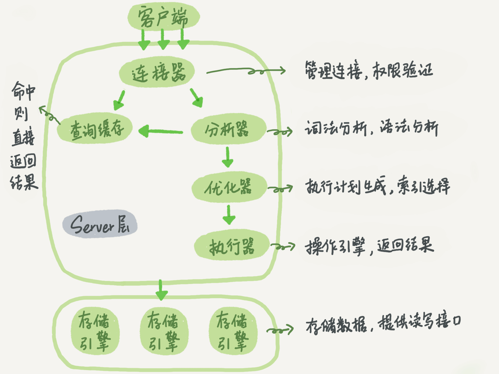
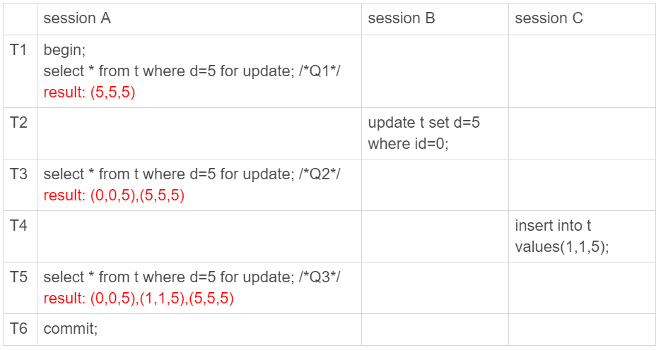
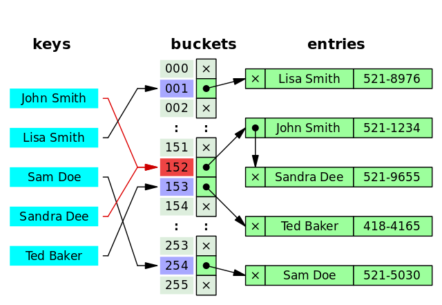
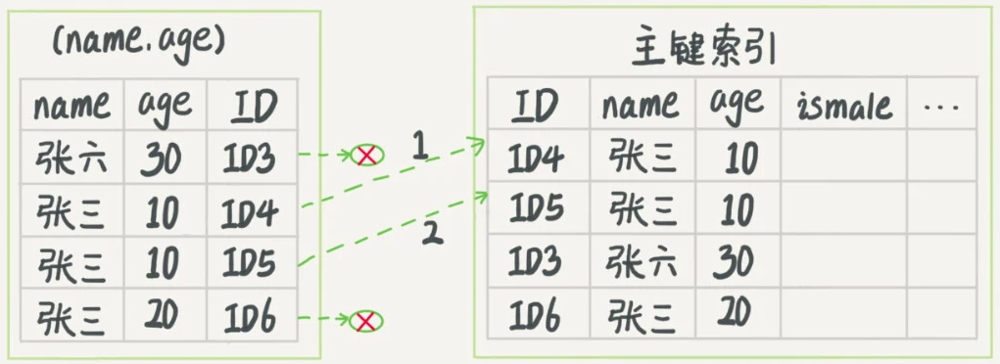

# 工作原理



**注意点**:

存储引擎包括InnoDb, MyISAM等

**查询缓存**的失效非常频繁，只要有对一个表的更新，这个表上所有的查询缓存都会被清空。因此很可能你费劲地把结果存起来，还没使用呢，就被一个更新全清空了。对于更新压力大的数据库来说，查询缓存的命中率会非常低。除非你的业务就是有一张静态表，很长时间才会更新一次。比如，一个系统配置表，那这张表上的查询才适合使用查询缓存。

# 可重复读的幻读问题

这种结果告诉我们其实在MySQL可重复读的隔离级别中并不是完全解决了幻读的问题，而是解决了本事务读数据情况下的幻读问题。而对于本事务的修改操作依旧存在幻读问题(**修改时会修改另一个事务添加的行,即幻读到另一个事务添加的行**)，就是说MVCC对于幻读的解决时不彻底的。

例如:

https://www.cnblogs.com/liyus/p/10556563.html

t中只有一条数据, id, c, d分别为(0,0,5)

| 事物 1                                                       | 事物 2                       |
| ------------------------------------------------------------ | ---------------------------- |
| begin                                                        | begin                        |
| select * from t;<br />返回(0,0,5)                            |                              |
|                                                              | insert into t values(2,2,5); |
|                                                              | commit                       |
| update t set c=100 where d=5;                                |                              |
| select * from t;<br />返回(0,100,5), (2,100,5); 正常只返回前者:-) |                              |
| commit                                                       |                              |

# MySQL

------

## 锁

### 行锁

MySQL的行锁是在引擎层由各个引擎自己实现的。但并不是所有的引擎都支持行锁，比如MyISAM引擎就不支持行锁。不支持行锁意味着并发控制只能使用表锁，对于这种引擎的表，同一张表上任何时刻只能有一个更新在执行，这就会影响到业务并发度。InnoDB是支持行锁的，这也是MyISAM被InnoDB替代的重要原因之一。

在下面的操作序列中，事务B的update语句执行时会是什么现象呢？假设字段id是表t的主键。


在下面的操作序列中，事务B的update语句执行时会是什么现象呢？假设字段id是表t的主键。事务B的update语句会被阻塞，直到事务A执行commit之后，事务B才能继续执行。

**在InnoDB事务中，行锁是在<u>需要的时候才加上</u>的，但并不是不需要了就立刻释放，而是要等到事务结束时才释放。这个就是两阶段锁协议。**所以，**如果你的事务中需要锁多个行，要把最可能造成锁冲突、最可能影响并发度的锁尽量往后放**。

> 顾客A要在影院B购买电影票。我们简化一点，这个业务需要涉及到以下操作：
>
> 1. 从顾客A账户余额中扣除电影票价；
> 2. 给影院B的账户余额增加这张电影票价；
> 3. 记录一条交易日志。
>
> 要完成这个交易，我们需要update两条记录，并insert一条记录。当然，为了保证交易的原子性，我们要把这三个操作放在一个事务中。那么，你会怎样安排这三个语句在事务中的顺序呢？
>
> 试想如果同时有另外一个顾客C要在影院B买票，那么这两个事务冲突的部分就是语句2了。因为它们要更新同一个影院账户的余额，需要修改同一行数据。
>
> 根据两阶段锁协议，不论你怎样安排语句顺序，所有的操作需要的行锁都是在事务提交的时候才释放的。所以，如果你把语句2安排在最后，比如按照3、1、2这样的顺序，那么影院账户余额这一行的锁时间就最少。这就最大程度地减少了事务之间的锁等待，提升了并发度。

### 排它锁/读锁/Exclusive

又称为X 锁。

### 共享锁/写锁/Shared

又称为S 锁

## 事务

数据库事务可以保证**多个对数据库的操作**（也就是 SQL 语句）构成一个**逻辑上的整体**。构成这个逻辑上的整体的这些数据库操作遵循：**要么全部执行成功, 要么全部不执行** 。

begin/start transaction 命令并不是一个事务的起点，在执行到它们之后的第一个操作InnoDB表的语句（第一个**快照读**语句），事务才真正启动。如果你想要马上启动一个事务，可以使用start transaction with consistent snapshot 这个命令。

```sql
# 开启一个事务
START TRANSACTION;
# 多条 SQL 语句
SQL1,SQL2...
## 提交事务
COMMIT;
```

### 事务的ACID特性

- **原子性**（`Atomicity`） ： 事务是最小的执行单位，不允许分割。事务的原子性确保动作要么全部完成，要么完全不起作用；

- **一致性**（`Consistency`）： 执行事务前后，数据保持一致，例如转账业务中，无论事务是否成功，转账者和收款人的总额应该是不变的；

- **隔离性**（`Isolation`）： 并发访问数据库时，一个用户的事务不被其他事务所干扰，各并发事务之间数据库是独立的；

- **持久性**（`Durability`）： 一个事务被提交之后。它对数据库中数据的改变是持久的，即使数据库发生故障也不应该对其有任何影响。

### 并发事务带来的问题

**多个事务并发运行，操作同一的数据时**，可能会导致以下的问题：

- **脏读（Dirty read）:** **读到的数据已经被修改。**

    当一个事务正在访问数据并且对数据进行了**修改**，而这个**修改还没有提交到数据库中**，**这时另外一个事务也访问了这个数据**，然后使用了这个数据。因为这个数据是还没有提交的数据，那么**另外一个事务读到的这个数据是“脏数据”**

- **丢失修改（Lost to modify）:** **两个事务同时修改统一数据，先修改的会被后修改的覆盖，导致丢失**。

    指在一个事务读取一个数据时，另外一个事务也访问了该数据；**在第一个事务中修改了这个数据后，第二个事务也修改了这个数据**。这样**第一个事务内的修改结果就被丢失**，因此称为丢失修改。 

    例如：事务 1 读取某表中的数据 A=20，事务 2 也读取 A=20，事务 1 修改 A=A-1，事务 2 也修改 A=A-1，最终结果 A=19，事务 1 的修改被丢失。

- **不可重复读（Unrepeatable read）:** **在一个事务内两次读同一数据，两次读的间隙数据被修改，两次读的结果不一样。**

    在一个事务内多次读同一数据，在这个事务还没有结束时，另一个事务也访问该数据。那么，在第一个事务中的两次读数据之间，由于第二个事务的修改导致第一个事务两次读取的数据可能不太一样。这就发生了在一个事务内两次读到的数据是不一样的情况，因此称为不可重复读。

- **幻读（Phantom read）:** 幻读与不可重复读类似。它发生在一个事务**T1读取了几行数据**，接着**另一个并发事务T2插入了一些数据时**。在随后的查询中，**T1就会发现多了一些原本不存在的记录**，称为幻读。

#### **不可重复读和幻读区别：**

不可重复读的重点是**数据的修改**，比如多次读取一条记录发现其中某些列的值被修改，幻读的重点在于**数据的新增或者删除**，比如多次读取一条记录发现记录增多或减少了。

### 术语

https://www.cnblogs.com/yousheng/p/12944218.html

#### 一致性读取 (consistent read)

- 事务在进行读操作时，使用的是事务开始时的行快照数据，这样就不用担心读到其他其他事务修改的数据。
- 在[可重复读]下，事务快照是基于第一次读操作的快照(通过undo log 回溯)
- 在[可提交读]下，每一次一致性读操作都会重置快照
- 优点：不上锁，允许其他事务进行修改

#### 半一致性读取 (semi-consistent read)

- 即UPDATE语句中的读/匹配操作，当UPDATE语句执行的时候，InnoDB会取最后一次提交到MySQL的数据来进行 Where 子句中的匹配。
    - 如果匹配上了（也就是要更新），那就重读该行并加锁（或等待加锁）
        - todo 为什么要重读该行不是很理解，直接用那条数据不就好了
- 仅用于[可提交读]隔离级别
- *个人理解其实就是一致性读取在[可提交读]隔离级别下 **UPDATE**的表现*

#### 锁定读 (locking read)

- 即加锁的查询语句
- E.g SELECT ... FOR UPDATE | SELECT ... FOR SHARE

#### 行锁 (record lock) :

即锁定索引记录的锁，即使没有索引也会找到对应行记录锁主键哦

#### 间隙锁 (gap lock) : 

锁在了两条索引记录之间的锁，或者(无穷小,某索引)/(某索引,无穷大)，他们锁住的是一个范围，且不同的间隙锁不互斥，他们排斥的只是在锁范围内的插入操作

- mark: R.C 隔离级别下是被禁用的

#### next-key lock : 

行锁和间隙锁的组合实现

### 事物的隔离(Isolation)级别

- 读未提交是指，一个事务还没提交时，它做的变更就能被别的事务看到。
- 读提交是指，一个事务提交之后，它做的变更才会被其他事务看到。
- 可重复读是指，一个事务执行过程中看到的数据，总是跟这个事务在启动时看到的数据是一致的。当然在可重复读隔离级别下，未提交变更对其他事务也是不可见的。
- 串行化，顾名思义是对于同一行记录，“写”会加“写锁”，“读”会加“读锁”。当出现读写锁冲突的时候，后访问的事务必须等前一个事务执行完成，才能继续执行。

在实现上，数据库里面会创建一个**视图read view**，访问的时候以视图的逻辑结果为准。在“可重复读”隔离级别下，这个视图是在事务启动时创建的，整个事务存在期间都用这个视图。在“读提交”隔离级别下，这个视图是在每个SQL语句开始执行的时候创建的。这里需要注意的是，“读未提交”隔离级别下直接返回记录上的最新值，没有视图概念；而“串行化”隔离级别下直接用加锁的方式来避免并行访问。


- 若隔离级别是“读未提交”， 则V1的值就是2。这时候事务B虽然还没有提交，但是结果已经被A看到了。因此，V2、V3也都是2。
- 若隔离级别是“读提交”，则V1是1; 事务B的更新在提交后才能被A看到,所以V2的值是2, V3的值也是2。
- 若隔离级别是“可重复读”，则V1、V2是1，V3是2。之所以V2还是1，遵循的就是这个要求：事务在执行期间看到的数据前后必须是一致的。
- 若隔离级别是“串行化”，则在事务B执行“将1改成2”的时候，会被锁住。直到事务A提交后，事务B才可以继续执行。所以从A的角度看， V1、V2值是1，V3的值是2。

- **READ-UNCOMMITTED(读取未提交)：** 最低的隔离级别，允许读取**尚未提交**的数据变更。

    **可能会导致脏读、幻读或不可重复读**。

    无锁策略.

    %E5%AE%9E%E4%BE%8B.jpg)

- **READ-COMMITTED(读取已提交)：** 允许读取并发事务**已经提交**的数据。

    **可以阻止脏读，但是幻读或不可重复读仍有可能发生**。

    读的都是最新版的快照, 所以会有**不可重复读**的问题

    对于Locking Reads、UPDATE、DELETE 语句，InnoDB的锁策略是只**锁索引记录**, 并没有用间隙锁来锁范围，所以会有**幻读**

    

- （MySQL默认）**REPEATABLE-READ(可重复读)：** 对同一字段的**多次读取结果都是一致**的，除非数据是**被本身事务自己所修改**。

    **可以阻止脏读和不可重复读，但幻读仍有可能发生**。

    普通的select采用一致性读取，同事务中的每次读取都取第一次读的快照。不会发生不可重复读. 

    对于 locking reads，UPDATE，DELETE ，其加锁策略取决于**是否是唯一索引唯一条件查询**

    - **唯一索引配合唯一查询条件**，引擎只**锁定那条索引**记录，**不锁间隙**
    - 其他场景，引擎使用**Gap Lock 或 Next-Record Lock的间隙锁锁定扫描的索引范围**，以阻止其他事务插入新行到该间隙

    

- **SERIALIZABLE(可串行化)：** 最高的隔离级别，完全服从 ACID 的隔离级别。

    所有的事务依次逐个执行，这样事务之间就完全不可能产生干扰，该级别可以**防止脏读、不可重复读以及幻读**。

    InnoDB 默默的把所有纯 SELECT 语句都转成了 SELECT ... FOR SHARE ，也就默认都加读锁, 使用了**一致性读和间隙锁**是不会产生的幻读问题的
    
    

| 隔离级别         | 脏读 | 不可重复读 | 幻读 |
| ---------------- | ---- | ---------- | ---- |
| READ-UNCOMMITTED | √    | √          | √    |
| READ-COMMITTED   | ×    | √          | √    |
| REPEATABLE-READ  | ×    | ×          | √    |
| SERIALIZABLE     | ×    | ×          | ×    |

MySQL **InnoDB** 的 **REPEATABLE-READ（可重读）**并**不保证避免幻读**，需要**应用Next-Key Locks加锁读**来保证。

因为隔离级别越低，事务请求的锁越少，所以大部分数据库系统的隔离级别都是 **READ-COMMITTED(读取提交内容)** ，但是 InnoDB 存储引擎默认使用 **REPEATABLE-READ（可重读）** 并**不会有任何性能损失**。

InnoDB 存储引擎在 **分布式事务** 的情况下一般会用到 **SERIALIZABLE(可串行化)** 隔离级别。

## 日志

它的关键点就是先写日志，再写磁盘

### Redo Log (InnoDB引擎日志) aka Write-Ahead Logging

当有一条记录需要更新的时候，**InnoDB引擎**就会先把记录写到redo log（粉板）里面，并更新内存，这个时候更新就算完成了。同时，InnoDB引擎会在适当的时候，将这个操作记录更新到磁盘里面，而这个更新往往是在系统比较空闲的时候做.

InnoDB的redo log是固定大小的，比如可以配置为一组4个文件, 从头开始写，写到末尾就又回到开头循环写，如下面这个图所示:

 

- **write pos是当前记录**的位置，一边写一边后移，写到第3号文件末尾后就回到0号文件开头。

- **checkpoint**是当前要**擦除**的位置，也是往后推移并且循环的，擦除记录前要**把记录更新到数据文件**。

write pos和checkpoint之间的是“粉板”上还空着的部分，可以用来**记录新的操作**。如果write pos追上checkpoint，表示“粉板”满了，这时候不能再执行新的更新，得停下来先擦掉一些记录，把checkpoint推进一下。

有了redo log，InnoDB就可以保证即使数据库发生异常重启，之前提交的记录都不会丢失，这个能力称为**crash-safe**。

### Bin Log (Server层日志) AKA 归档日志

只依靠binlog是没有crash-safe能力的，所以InnoDB使用另外一套日志系统——也就是redo log来实现crash-safe能力。

#### 全量备份和binlog的关系:

一周一全量备份的话，需要确保整个一周的binlog都完好无损，否则将无法恢复；而一天一备，只要保证这天的binlog都完好无损

### redolog vs binlog

1. redo log是**InnoDB引擎特有**的；binlog是**MySQL的Server**层实现的，**所有引擎都可以使用**。
2. redo log是**物理日志**，记录的是“**在某个数据页上做了什么修改**”；binlog是**逻辑日志**，记录的是这个**语句的原始逻辑**，比如“**给ID=2这一行的c字段加1** ”。
3. redo log是**循环**写的，**空间固定且会用完**；binlog是可以**追加写入**的。“追加写”是指binlog文件写到一定大小后会**切换到下一个**，并**不会覆盖以前的日志**。

例如更新语句: 

```mysql
mysql> update T set c=c+1 where ID=2;
```


1. 执行器先找引擎取ID=2这一行。ID是主键，引擎直接用树搜索找到这一行。如果ID=2这一行所在的数据页本来就在内存中，就直接返回给执行器；否则，需要先从磁盘读入内存，然后再返回。
2. 执行器拿到引擎给的行数据，把这个值加上1，比如原来是N，现在就是N+1，得到新的一行数据，再调用引擎接口写入这行新数据。
3. **引擎**将这行新数据更新到内存中，同时**将这个更新操作记录到redo log**里面，此时redo log处于**prepare**状态。然后告知执行器执行完成了，随时可以提交事务。
4. **执行器(server层)**生成这个操作的**binlog**，并把binlog写入磁盘。
5. **执行器**调用**引擎的提交事务接口**，**引擎**把刚刚写入的**redo log改成提交（commit）状态**，更新完成。

#### 两阶段提交

上面的例子中, redo log的写入拆成了两个步骤：**prepare**和**commit**，这就是"**两阶段提交**"。

为什么日志需要“两阶段提交”。这里不妨用反证法来进行解释: 

首先**恢复的数据应以引擎提交的事务(redo log)为准, 与server层(binlog)无关.**

由于redo log和binlog是两个独立的逻辑，如果不用两阶段提交，要么就是先写完redo log再写binlog，或者采用反过来的顺序。我们看看这两种方式会有什么问题:

1. **先写redo log后写binlog**。假设在redo log写完，binlog还没有写完的时候，MySQL进程异常重启。由于我们前面说过的，redo log写完之后(即**引擎已经提交事务)**，系统即使崩溃，仍然能够把数据恢复回来，所以**恢复后这一行c的值是1**。
    但是由于**binlog没写完就crash**了，这时候binlog里面就没有记录这个语句。因此，之后备份日志的时候，存起来的binlog里面就没有这条语句。
    然后你会发现，如果需要用这个binlog来恢复临时库的话，由于这个语句的binlog丢失，这个临时库就会少了这一次更新，恢复出来的这一行c的值就是**0**，与原库的值不同。
2. **先写binlog后写redo log**。如果在binlog写完之后crash，由于redo log还没写(即**引擎未提交事务**)，崩溃恢复以后这个事务无效，所以**恢复后这一行c的值是0**。但是binlog里面已经记录了“把c从0改成1”这个日志。所以，在之后用**binlog来恢复的时候就多了一个事务出来，恢复出来的这一行c的值就是1，与原库的值不同**。

**如果不使用“两阶段提交”，那么数据库的状态就有可能和用它的日志恢复出来的库的状态不一致。**

**redo log和binlog都可以用于表示事务的提交状态，而两阶段提交就是让这两个状态保持逻辑上的一致。**

> redo log用于保证crash-safe能力。innodb_flush_log_at_trx_commit这个参数设置成1的时候，表示每次事务的redo log都直接持久化到磁盘。这个参数我建议你设置成1，这样可以保证MySQL异常重启之后数据不丢失。
>
> sync_binlog这个参数设置成1的时候，表示每次事务的binlog都持久化到磁盘。这个参数我也建议你设置成1，这样可以保证MySQL异常重启之后binlog不丢失。

### 总结Redolog undolog binlog

http://xiaot123.com/mysqlbinlogredologundolog-lagwx

redo log 是物理日志，undo log 和 binlog 是逻辑日志

- binlog二进制日志是server层的无论MySQL用什么引擎，都会有的，主要是左主从复制，时间点恢复使用
    - binlog我们可以简单理解为：**存储着每条变更的SQL语句**
    - 可以通过binlog来对数据进行恢复
    - binlog 可以用于主从复制中，从库利用主库上的 binlog 进行重播，实现主从同步。用于数据库的基于时间点、位点等的还原操作。binlog 的模式分三种：Statement、Row、Mixed。
    - 事务**提交**的时候，一次性将事务中的 sql 语句（一个事务可能对应多个 sql 语句）按照一定的格式记录到 binlog 中. 这里与 redo log 很明显的差异就是 redo log 并不一定是在事务提交的时候才刷新到磁盘，而是在事务开始之后就开始逐步写入磁盘。binlog 的默认保存时间是由参数 expire_logs_days 配置的，对于非活动的日志文件，在生成时间超过 expire_logs_days 配置的天数之后，会被自动删除。
- redo log重做日志是InnoDB存储引擎层的，用来保证事务安全
    - **事务开始之后**，就开始产生 redo log 日志了，**在事务执行的过程中**，redo log 开始**逐步落盘**
    - 当对应事务的脏页写入到磁盘之后，redo log 的使命就完成了，它所占用的空间也就可以被覆盖了。
- undo log回滚日志保存了事务发生之前的数据的一个版本，可以用于回滚，同时可以提供多版本并发控制下的读（MVCC），也即非锁定读
    - **事务开始之前**，将当前事务版本生成 undo log，undo log 也会产生 redo log 来保证 undo log 的可靠性。
    - 当**事务提交之后**，undo log 并不能立马被删除，而是**放入待清理的链表**，当没有事务再需要用到这些回滚日志时，就是当系统里没有比这个回滚日志更早的read-view的时候, 回滚日志会被删除
    - 由 **purge 线程**判断是否有其它事务在使用 undo 段中表的上一个事务之前的版本信息，从而决定是否可以清理 undo log 的日志空间。

## MVCC(一致性读视图,用于支持RC和RR的实现)

解决读-写冲突的**无锁并发控制**，即读的时候写入，**读的内容是改写之前的那个版本**。

MVCC可以为数据库解决以下问题：

- 在并发读写数据库时，可以做到在读(select)操作时不用阻塞写操作，写操作也不用阻塞读操作，提高了数据库并发读写的性能
- 同时还可以解决脏读，幻读，不可重复读等事务隔离问题，但不能解决**更新丢失**问题

### InnoDB对MVCC的实现

`MVCC` 的实现依赖于：**隐藏字段、Read View、undo log**。在内部实现中，`InnoDB` 通过数据行的 `DB_TRX_ID` 和 `Read View` 来判断数据的可见性，如不可见，则通过数据行的 `DB_ROLL_PTR` 找到 `undo log` 中的历史版本。每个事务读到的数据版本可能是不一样的，在同一个事务中，用户只能看到该事务创建 `Read View` 之前**已经提交的修改和该事务本身做的修改**

#### 隐藏字段

在内部，`InnoDB` 存储引擎为每行数据添加了三个 [隐藏字段](https://dev.mysql.com/doc/refman/5.7/en/innodb-multi-versioning.html)：

- `DB_TRX_ID（6字节）`：表示**最后一次插入或更新该行的事务id**。此外，`delete` 操作在内部被视为更新，只不过会在记录头 `Record header` 中的 `deleted_flag` 字段将其标记为已删除
- `DB_ROLL_PTR（7字节）` **回滚指针**，指向该行的 `undo log` 。如果该行未被更新，则为空
- `DB_ROW_ID（6字节）`：如果没有设置主键且该表没有唯一非空索引时，`InnoDB` 会使用**该id来生成聚簇索引**

#### ReadView

[`Read View`](https://github.com/facebook/mysql-8.0/blob/8.0/storage/innobase/include/read0types.h#L298) 主要是用来做可见性判断，里面保存了 “当前对本事务不可见的其他活跃事务”

在实现上， InnoDB为每个事务构造了一个数组，用来保存这个事务启动瞬间，当前正在“活跃”的所有事务ID。“活跃”指的就是，启动了但还没提交。

数组里面事务ID的最小值记为低水位，当前系统里面已经创建过的事务ID的最大值加1记为高水位。

这个视图数组和高水位，就组成了当前事务的一致性视图（read-view）。


对于当前事务的启动瞬间来说，数据表中的一行记录的的row trx_id，有以下几种可能：

1. 如果落在绿色部分，表示这个版本是已提交的事务或者是当前事务自己生成的，这个数据是可见的；
2. 如果落在红色部分，表示这个版本是由将来启动的事务生成的，是肯定不可见的；
3. 如果落在黄色部分，那就包括两种情况
    a. 若 row trx_id在数组中，表示这个版本是由还没提交的事务生成的，不可见；
    b. 若 row trx_id不在数组中，表示这个版本是已经提交了的事务生成的，可见。

主要有以下字段：

- `m_low_limit_id`：目前出现过的最大的事务ID+1，即**下一个将被分配的事务ID**。大于这个ID的数据版本均不可见
- `m_up_limit_id`：**活跃事务**列表 `m_ids` 中**最小的事务ID**，如果 `m_ids` 为空，则 `m_up_limit_id` 为 `m_low_limit_id`。小于这个ID的数据版本均可见
- `m_ids`：`Read View` **创建时**其他**未提交的活跃事务ID列表**。创建 `Read View `时，将当前未提交事务ID记录下来，后续即使它们修改了记录行的值，对于当前事务也是不可见的。`m_ids` 不包括当前事务自己和已提交的事务（正在内存中）
- `m_creator_trx_id`：创建该 `Read View` 的事务ID

#### undo-log

**在 `InnoDB` 存储引擎中 `undo log` 分为两种： `insert undo log` 和 `update undo log`：**

1. **`insert undo log`** ：指在 `insert` 操作中产生的 `undo log`。因为 `insert` 操作的记录只对事务本身可见，对其他事务不可见，故该 `undo log` 可以在**事务提交后直接删除**。不需要进行 `purge` 操作

    **`insert` 时的数据初始状态：**

    

2. **`update undo log`** ：`update` 或 `delete` 操作中产生的 `undo log`。该 `undo log`可能需要提供 `MVCC` 机制，因此**不能在事务提交时就进行删除**。不同事务或者相同事务的对同一记录行的修改，会使该记录行的 `undo log` 成为一条**链表**，**链首就是最新的记录，链尾就是最早的旧记录**。提交时放入 `undo log` 链表，等待 `purge线程` 进行最后的删除。

`undo log` 主要有两个**作用**：

- 当**事务回滚**时用于将数据**恢复到修改前**的样子
- 另一个作用是 `MVCC` ，当读取记录时，若该记录被其他事务占用或当前版本对该事务不可见，则可以通过 **`undo log`** 读取**之前的版本数据**，以此实现**非锁定读**

### 数据可见性算法

在 `InnoDB` 存储引擎中，创建一个新事务后，执行每个 `select` 语句前，都会创建一个快照（Read View），**快照中保存了当前数据库系统中正处于活跃（没有commit）的事务的ID号**。其实简单的说保存的是系统中当前不应该被本事务看到的其他事务ID列表（即m_ids）。当用户在这个事务中要读取某个记录行的时候，`InnoDB` 会将该记录行的 `DB_TRX_ID` 与 `Read View` 中的一些变量及当前事务ID进行比较，判断是否满足可见性条件

1. 如果记录 **DB_TRX_ID < m_up_limit_id**，那么表明**最新修改该行的事务**（DB_TRX_ID）**在当前事务创建快照之前就提交了**，所以该记录行的值对当前事务是**可见**的
2. 如果 **DB_TRX_ID >= m_low_limit_id**，那么表明**最新修改该行的事务**（DB_TRX_ID）**在当前事务创建快照之后才修改该行**，所以该记录行的值对当前事务**不可见**。跳到步骤5
3. **m_ids 为空**，则表明在当前事务创建快照之前，修改该行的事务就**已经提交**了，所以该记录行的值对当前事务是**可见**的
4. 如果 **m_up_limit_id <= DB_TRX_ID < m_up_limit_id**，表明最新修改该行的事务（DB_TRX_ID）在当前事务**创建快照的时候可能处于“活动状态”或者“已提交状态”**；所以就要**对活跃事务列表 m_ids 进行查找**（源码中是用的二分查找，因为是有序的）
    - 如果在活跃事务列表 m_ids 中**能找到 DB_TRX_ID**，表明：①在当前事务创建快照前，该记录行的值被事务ID为 DB_TRX_ID 的事务修改了，但**没有提交**；或者 ②在当前事务创建快照后，该记录行的值被事务ID为 DB_TRX_ID 的事务**修改**了。这些情况下，这个记录行的值对当前事务都是**不可见**的。跳到步骤5
    - 在活跃事务列表中**找不到**DB_TRX_ID，则表明“id为db_trx_id的事务”在修改“该记录行的值”后，在“当前事务”创建快照前就**已经提交**了，所以记录行对当前事务**可见**
5. 在该记录行的 DB_ROLL_PTR 指针所指向的 `undo log` 取出快照记录，用**快照记录的 DB_TRX_ID** 跳到步骤1**重新开始判断**，直到找到满足的**快照版本**或**返回空**

### RC和RR隔离级别下MVCC的差异

在事务隔离级别 `RC`read commit 和 `RR`repeatable read 下，` InnoDB` 存储引擎使用 `MVCC`（非锁定一致性读），它们生成 `Read View` 的时机不同

- 在 **RC** 隔离级别下的 **每次select查询前**都生成一个`Read View` (m_ids列表)，导致**<u>不可重复读</u>**

- 在 **RR** 隔离级别下只在**事务开始后** **第一次select** 数据**前**生成一个`Read View`（m_ids列表），所以可以实现**可重复读**

    可重复读的核心就是一致性读（consistent read）；而事务更新数据的时候，只能用**当前读**。如果当前的记录的行锁被其他事务占用的话，就需要进入锁等待。

### 例子:


在这个例子中，事务C没有显式地使用begin/commit，表示这个update语句本身就是一个事务，语句完成的时候会自动提交。事务B在更新了行之后查询; 事务A在一个只读事务中查询，并且时间顺序上是在事务B的查询之后。

begin/start transaction 命令并不是一个事务的起点，在执行到它们之后的第一个操作InnoDB表的语句（第一个快照读语句），事务才真正启动。如果你想要**马上启动一个事务**，即马上获取read view, 可以使用**start transaction with consistent snapshot** 这个命令。这里事务A, B都在一开始就获得了read view.

**问题: **

1. **事务B查到的k的值是?**

2. **事务A查到的k的值是?**

#### 事务A为什么返回k=1

**<u>因为事务A做的是查询操作, 早先获取的Read view中看不到事务B, C的更新.</u>**

这里，我们不妨做如下假设：

1. 事务A开始前，系统里面只有一个活跃事务ID是99；
2. 事务A、B、C的版本号分别是100、101、102，且当前系统里只有这四个事务；
3. 三个事务开始前，(1,1）这一行数据的row trx_id是90。

这样，事务A的视图数组就是[99,100], 事务B的视图数组是[99,100,101], 事务C的视图数组是[99,100,101,102]。

为了简化分析，我先把其他干扰语句去掉，只画出跟事务A查询逻辑有关的操作：


从图中可以看到，第一个有效更新是事务C，把数据从(1,1)改成了(1,2)。这时候，这个数据的最新版本的row trx_id是102，而90这个版本已经成为了历史版本。

第二个有效更新是事务B，把数据从(1,2)改成了(1,3)。这时候，这个数据的最新版本（即row trx_id）是101，而102又成为了历史版本。

你可能注意到了，在事务A查询的时候，其实事务B还没有提交，但是它生成的(1,3)这个版本已经变成当前版本了。但这个版本对事务A必须是不可见的，否则就变成脏读了。

好，现在事务A要来读数据了，它的视图数组是[99,100]。当然了，读数据都是从当前版本读起的。所以，事务A查询语句的读数据流程是这样的：

- 找到(1,3)的时候，判断出row trx_id=101，比高水位大，处于红色区域，不可见；
- 接着，找到上一个历史版本，一看row trx_id=102，比高水位大，处于红色区域，不可见；
- 再往前找，终于找到了（1,1)，它的row trx_id=90，比低水位小，处于绿色区域，可见。

这样执行下来，虽然期间这一行数据被修改过，但是事务A不论在什么时候查询，看到这行数据的结果都是一致的，所以我们称之为一致性读。

所以,一个数据版本，对于一个事务视图来说，除了自己的更新总是可见以外，有三种情况：

1. 版本未提交，不可见；
2. 版本已提交，但是是在视图创建后提交的，不可见；
3. 版本已提交，而且是在视图创建前提交的，可见。

现在，我们用这个规则来判断图4中的查询结果，事务A的查询语句的视图数组是在事务A启动的时候生成的，这时候：

- (1,3)还没提交，属于情况1，不可见；
- (1,2)虽然提交了，但是是在视图数组创建之后提交的，属于情况2，不可见；
- (1,1)是在视图数组创建之前提交的，可见。

#### 事务B为什么返回k=3

update语句**更新数据**都是先读后写的，而这个读，只能读当前的值，称为**当前读(锁定读)**。如果当前的记录的行锁被其他事务占用的话，就需要进入锁等待。


事务B的视图数组是先生成的，之后事务C才提交，不是应该看不见(1,2)吗，怎么能算出(1,3)来？

是的，如果事务B在更新之前查询一次数据，这个查询返回的k的值确实是1。

但是，当它要去更新数据的时候，就不能再在历史版本上更新了，否则事务C的更新就丢失了。因此，事务B此时的set k=k+1是在（1,2）的基础上进行的操作。

所以，这里就用到了这样一条规则：**更新数据都是先读后写的，而这个读，只能读当前的值，称为“当前读”（current read）。**

因此，在更新的时候，当前读拿到的数据是(1,2)，更新后生成了新版本的数据(1,3)，这个新版本的row trx_id是101。

所以，在执行事务B查询语句的时候，一看自己的版本号是101，最新数据的版本号也是101，是自己的更新，可以直接使用，所以查询得到的k的值是3。

这里我们提到了一个概念，叫作当前读。其实，除了update语句外，select语句如果加锁，也是当前读。

所以，如果把事务A的查询语句select * from t where id=1修改一下，加上lock in share mode 或 for update，也都可以读到版本号是101的数据，返回的k的值是3。下面这两个select语句，就是分别加了读锁（S锁，共享锁）和写锁（X锁，排他锁）。

```mysql
mysql> select k from t where id=1 lock in share mode;
mysql> select k from t where id=1 for update;
```

#### 假设事务C不是马上提交的，而是变成了下面的事务C’，会怎么样呢？


事务C’的不同是，更新后并没有马上提交，在它提交前，事务B的更新语句先发起了。前面说过了，虽然事务C’还没提交，但是(1,2)这个版本也已经生成了，并且是当前的最新版本。那么，事务B的更新语句会怎么处理呢？

这时候，我们在上一篇文章中提到的“两阶段锁协议”就要上场了。**事务C’没提交，也就是说(1,2)这个版本上的写锁还没释放。而事务B是当前读，必须要读最新版本，而且必须加锁，因此就被锁住了，必须等到事务C’释放这个锁，才能继续它的当前读。****所以B读到的k还是=3?**


#### 在RC下，事务A和事务B的查询语句查到的k，分别应该是多少呢？

这里需要说明一下，“start transaction with consistent snapshot; ”的意思是从这个语句开始，创建一个持续整个事务的一致性快照。所以，在读提交隔离级别下，这个用法就没意义了，等效于普通的start transaction。

下面是读提交时的状态图，可以看到这两个查询语句的创建视图数组的时机发生了变化，就是图中的read view框。（注意：这里，我们用的还是事务C的逻辑直接提交，而不是事务C’）


这时，事务A的查询语句的视图数组是在执行这个语句的时候创建的，时序上(1,2)、(1,3)的生成时间都在创建这个视图数组的时刻之前。但是，在这个时刻：

- (1,3)还没提交，属于情况1，不可见；
- (1,2)提交了，属于情况3，可见。

所以，这时候事务A查询语句返回的是k=2。

显然地，事务B查询结果k=3。

## 快照读与锁定读

**在 `Repeatable Read` 和 `Read Committed` 两个隔离级别下，如果执行普通的 `select` 语句会使用 `一致性非锁定读（MVCC）`。**

**使用 `select ... lock in share mode` ,` select ... for update`会使用锁定读**


### 一致性读(快照读, 非锁定) - 读历史版本

 [**一致性非锁定读（Consistent Nonlocking Reads）** ](https://dev.mysql.com/doc/refman/5.7/en/innodb-consistent-read.html)的实现，通常做法是加一个**版本号**或者**时间戳**字段：

- **更新数据时，版本号 + 1或者更新时间戳**。

- **查询时**，将当前**可见的版本号**与对应记录的版本号进行比对，如果**可见的版本号大于记录的版本**，则表示该记录可见

在 `InnoDB` 存储引擎中，[多版本控制 (multi versioning)](https://dev.mysql.com/doc/refman/5.7/en/innodb-multi-versioning.html) 就是对**一致性读(非锁定)**的实现。如果**读取的行**正在执行 `DELETE` 或 `UPDATE` 操作，这时**读取操作不会去等待行上锁的释放**。相反地，`InnoDB` 存储引擎会去**读取行的一个快照数据**，对于这种**读取历史数据**的方式，我们叫它**快照读 (snapshot read)**。

### 锁定读(当前读)- 读最新版本

如果执行的是下列语句，就是 [**锁定读（Locking Reads）**](https://dev.mysql.com/doc/refman/5.7/en/innodb-locking-reads.html)

- select ... lock in share mode
- select ... for update
- insert、update、delete 操作

在锁定读下，读取的是数据的**最新版本**，这种读也被称为 `当前读（current read）`。锁定读会对读取到的记录加锁：

- `select ... lock in share mode`：对记录加 `S` 锁，其它事务也可以加`S`锁，如果加 `x` 锁则会被阻塞
- `select ... for update`、`insert`、`update`、`delete `：对记录加 `X` 锁，且其它事务不能加任何锁

### RR中MVCC➕Next-key-Lock防止幻读

`InnoDB`存储引擎在 RR 级别下通过 `MVCC`和 `Next-key Lock` 来解决幻读问题：

1. **执行普通 `select`，此时会以 `MVCC` <u>快照读</u>的方式读取数据**

在**快照读(一致性非锁定读)**的情况下，RR 隔离级别只会在事务开启后的第一次查询生成 `Read View` ，并使用至事务提交。所以在生成 `Read View` 之后其它事务所做的更新、插入记录版本对当前事务并不可见，实现了**可重复读和<u>防止快照读下的 “幻读”</u>**

2. **执行select...for update/lock in share mode、insert、update、delete等当前读**

<u>**在可重复读隔离级别下，普通的查询是快照读，是不会看到别的事务插入的数据的。因此，幻读在“当前读”下才会出现。**</u>

在**当前读**下，读取的都是最新的数据，如果其它事务有插入新的记录，并且刚好在当前事务查询范围内，就会**产生幻读**！

(**串行化级别下?** )`InnoDB` 使用 **Next-key Lock** 来防止这种情况。当执行**当前读**时，会**锁定读取到的记录的同时，锁定它们的间隙**，防止其它事务在查询范围内插入数据。只要我不让你插入，就不会发生幻读。

## 幻读

先从一个加**行锁**的问题说起:

```mysql
CREATE TABLE `t` (
  `id` int(11) NOT NULL,
  `c` int(11) DEFAULT NULL,
  `d` int(11) DEFAULT NULL,
  PRIMARY KEY (`id`),
  KEY `c` (`c`)
) ENGINE=InnoDB;

insert into t values(0,0,0),(5,5,5),
(10,10,10),(15,15,15),(20,20,20),(25,25,25);
```

这个表除了主键id外，还有一个索引c，初始化语句在表中插入了6行数据。

下面的语句序列，是**怎么加锁的，加的锁又是什么时候释放的呢**？

```mysql
begin;
select * from t where d=5 for update;
commit;
```

比较好理解的是，这个语句会命中d=5的这一行，对应的主键id=5，因此在**select 语句执行完成后，id=5这一行会加一个写锁**，而且由于**两阶段锁协议**，这个写锁会在执行**commit语句的时候释放**。

由于字段d上没有索引，因此这条查询语句会做全表扫描。那么，其他被扫描到的，但是**不满足条件的5行记录上**，会不会被**加锁**呢？不会, 语句执行完成后，**InnoDB就会把不满足条件的行行锁去掉。**

当然了，c=5这一行的行锁，还是会等到commit的时候才释放的。

### 如果只在id=5这一行加锁，而其他行的不加锁的话(也不加间隙锁)，会怎么样



**需要注意, session B, C没有显式地使用begin/commit，表示这个update/insert语句本身就是一个事务，执行语句完成的时候会自动提交。**

可以看到，session A里执行了三次查询，分别是Q1、Q2和Q3。它们的SQL语句相同，都是select * from t where d=5 for update。这个语句的意思你应该很清楚了，查所有d=5的行，而且使用的是当前读，并且加上写锁。现在，我们来看一下这三条SQL语句，分别会返回什么结果。

1. Q1只返回id=5这一行；
2. 在T2时刻，session B把id=0这一行的d值改成了5，因此T3时刻Q2查出来的是id=0和id=5这两行；
3. 在T4时刻，session C又插入一行（1,1,5），因此T5时刻Q3查出来的是id=0、id=1和id=5的这三行。

其中，**Q3读到id=1这一行的现象，被称为“幻读”**。也就是说，幻读指的是一个事务在前后两次查询同一个范围的时候，后一次查询看到了前一次查询没有看到的行。

而**Q2读到id=0的这行不是幻读**(**也不是可重复读**). 因为上面session B的**修改**结果(不是添加)，是被session A之后的select语句用“**当前读**”看到，不能称为幻读。幻读仅专指“新插入的行”。

这里，我需要对“幻读”做一个说明：在可重复读隔离级别下，**普通的查询是快照读，是不会看到别的事务插入的数据的。**因此，**幻读**在“**当前读**”下才会出现。

### 幻读有什么问题？

#### **语义上**

session A在T1时刻就声明了，“我要把所有d=5的行锁住，不准别的事务进行读写操作”。而实际上，这个语义被破坏了。

如果现在这样看感觉还不明显的话，我再往session B和session C里面分别加一条SQL语句，你再看看会出现什么现象。


session B的第二条语句update t set c=5 where id=0，语义是“我把id=0、d=5这一行的c值，改成了5”。

由于在T1时刻，**session A 还只是给id=5这一行加了行锁， 并没有给id=0这行加上锁**。因此，session B在T2时刻，是可以执行这两条update语句的。这样，就**破坏了 session A 里Q1语句要锁住<u>所有d=5的行</u>的加锁声明**。

session C也是一样的道理，对id=1这一行的修改，也是破坏了Q1的加锁声明。

#### 数据一致性的问题

我们知道，锁的设计是为了保证数据的一致性。而这个一致性，不止是数据库内部数据状态在此刻的一致性，还包含了数据和日志在逻辑上的一致性。

为了说明这个问题，我给session A在T1时刻再加一个更新语句，即：update t set d=100 where d=5。


update的加锁语义和select ...for update 是一致的，所以这时候加上这条update语句也很合理。session A声明说“要给d=5的语句加上锁”，就是为了要更新数据，新加的这条update语句就是把它认为加上了锁的这一行的d值修改成了100。

现在，我们来分析一下图3执行完成后，数据库里会是什么结果。

1. **经过T1时刻，id=5这一行变成 (5,5,100)，当然这个结果最终是在T6时刻正式提交的;**
2. **经过T2时刻，id=0这一行变成(0,5,5);**
3. **经过T4时刻，表里面多了一行(1,5,5);**
4. 其他行跟这个执行序列无关，保持不变。

这样看，这些数据也没啥问题，但是我们再来看看这时候binlog里面的内容。

1. **T2时刻，B事务提交，写入了两条语句, id为0的行d为5；**
2. **T4时刻，C事务提交，写入了两条语句, id为1的行d为5；**
3. **T6时刻，A事务提交，写入了update t set d=100 where d=5 这条语句。(即会改变B中id=0和C中id=1的d值)**

我统一放到一起的话，就是这样的：

```mysql
update t set d=5 where id=0; /*(0,0,5)*/
update t set c=5 where id=0; /*(0,5,5)*/

insert into t values(1,1,5); /*(1,1,5)*/
update t set c=5 where id=1; /*(1,5,5)*/

update t set d=100 where d=5;/*所有d=5的行，d改成100*/
```

好，你应该看出问题了。这个语句序列，不论是拿到备库去执行，还是以后用binlog来克隆一个库，这三行的结果，都变成了 **(0,5,100)、(1,5,100)和(5,5,100)。而实际上执行完sql语句应该只有id为5的行的d为100, 其余为5.**

也就是说，**id=0和id=1这两行，发生了数据不一致**。这个问题很严重，是不行的。

## 索引

**索引**是一种用于**快速查询**和**检索数据**的数据结构。常见的索引结构有: **B 树， B+树和 Hash。**

索引的作用就相当于目录的作用。打个比方: 我们在查字典的时候，如果没有目录，那我们就只能一页一页的去找我们需要查的那个字，速度很慢。如果有目录了，我们只需要先去目录里查找字的位置，然后直接翻到那一页就行了。

### 索引的优缺点

**优点** ：

- 使用索引可以加快**数据的检索速度**（**减少检索的数据量**）
- 通过创建唯一性索引，可以保证数据库表中每一行数据的**唯一性**。

**缺点** ：

- **创建和维护索引**需要**耗费许多时间**。当对表中的数据进行增删改的时候，如果数据有索引，那么**索引也需要动态的修改**，会降低 SQL 执行效率。
- 索引需要使用**物理文件存储**，也会**耗费一定空间**。

**使用索引一定能提高查询性能吗?**

大多数情况下，索引查询都是比全表扫描要快的。但是如果数据库的**数据量不大**，那么使用索引也不一定能够带来很大提升。

### 索引的底层数据结构

#### Hash表 ❌

哈希表是**键值对**的集合，通过键(key)即可快速取出对应的值(value)，因此哈希表可以快速检索数据, **接近 O(1)**。

```python
hash = hashfunc(key)//算出hash值
index = hash % array_size//对hash值取余算出index索引？
```


但是！哈希算法有个 **Hash 冲突** 问题，也就是说多个**不同的 key 最后得到的 index 相同**。通常情况下，我们常用的解决办法是 **链地址法**，**将哈希冲突数据存放在链表中**。

> 就比如 JDK1.8 之前 `HashMap` 就是通过链地址法来解决哈希冲突的。不过，JDK1.8 以后`HashMap`为了减少链表过长的时候搜索时间过长引入了**红黑树**。



#### Hash缺点

既然哈希表这么快，**为什么MySQL 没有使用其作为索引的数据结构呢？**

**1.Hash 冲突问题**：耗费额外资源

**2.Hash 索引不支持顺序和范围查询**

试想一种情况:

```sql
SELECT * FROM tb1 WHERE id < 500;Copy to clipboardErrorCopied
```

Hash 索引是根据 hash 算法来定位的，难不成还要把 1 - 499 的数据，每个都进行一次 hash 计算来定位吗?这就是 Hash 最大的缺点了。

所以可以用B数来进行范围查询。

#### B树 & B+树 ✔️

B 树和 B+树中的 B 是 `Balanced` （平衡）的意思。B 树也称 B-树,全称为 **多路平衡查找树** ，B+ 树是 B 树的一种变体。

目前大部分数据库系统及文件系统都采用 B-Tree 或其变种 B+Tree 作为索引结构。

##### **B 树& B+树两者有何异同呢？**

- **B 树**的所有节点**既存放键(key) 也存放 数据(data)**，而 **B+树**只有**叶子节点存放 key 和 data**，**其他内节点只存放 key**。
- **B 树**的**叶子节点都是独立的**; **B+树**的**叶子节点**有一条**引用链指向与它相邻的叶子节点**。
- **B 树**的检索的过程相当于**对范围内的每个节点**的关键字(key?)做**二分查找**，可能还没有到达叶子节点，检索就结束了。而 **B+树**的检索效率就很稳定了，任何查找都是从**根节点到叶子节点**的过程，**叶子节点的顺序检索**很明显。
- B+树中 当我们在使用**范围查找**的时候 只要找到那个边界值就可以通过指针去查找其他所需要的数据就不用再从根结点开始遍历 减少了所消耗的时间 增加了效率


### 索引类型

#### 主键索引(Primary Key)

数据表的**主键**PK使用的就是主键索引。

在 MySQL 的 InnoDB 的表中，当没有显式的指定表的主键时，InnoDB 会自动先检查表中是否有唯一索引的字段，如果有，则选择该字段为默认的主键，否则 InnoDB 将会自动创建一个 6Byte 的自增主键。

#### 二级索引(辅助索引)

**二级索引又称为辅助索引，**二级索引属于**非聚集索引**, **是因为<u>二级索引的叶子节点存储的数据是主键</u>。也就是说，通过二级索引，可以定位主键的位置。**


**唯一索引，普通索引，前缀索引, 全文索引**等索引属于二级索引。

1. **唯一索引(Unique Key)** ：唯一索引也是一种约束。唯一索引的属性列**不能出现重复的数据**，但是允许数据为 NULL，一张表允许创建多个唯一索引。 建立唯一索引的目的大部分时候都是为了**该属性列的数据的唯一性，而不是为了查询效率**。
2. **普通索引(Index)** ：普通索引的唯一作用就是为了**快速查询数据**，一张表允许创建多个普通索引，并允许数据重复和 NULL。
3. **前缀索引(Prefix)** ：前缀索引只适用于**字符串**类型的数据。前缀索引是对**文本的前几个字符创建索引**，**相比普通索引建立的数据更小**， 因为只取前几个字符。
4. **全文索引(Full Text)** ：全文索引主要是为了**检索大文本数据中的关键字**的信息，是目前搜索引擎数据库使用的一种技术。Mysql5.6 之前只有 MYISAM 引擎支持全文索引，5.6 之后 InnoDB 也支持了全文索引。

#### **基于主键索引和普通索引(辅助索引)的查询有什么区别？**

- 如果语句是select * from T where ID=500，即主键查询方式，则只需要搜索ID这棵B+树；
- 如果语句是select * from T where k=5，即普通索引查询方式，则需要先搜索k索引树，得到ID的值为500，再到ID索引树搜索一次。这个过程称为回表。

也就是说，基于非主键索引的查询需要多扫描一棵索引树

#### 前缀索引选择的影响

比如，这两个在email字段上创建索引的语句：

```mysql
mysql> alter table SUser add index index1(email);
或
mysql> alter table SUser add index index2(email(6));
```

第一个语句创建的index1索引里面，包含了每个记录的整个字符串；而第二个语句创建的index2索引里面，对于每个记录都是只取前6个字节。


从图中你可以看到，由于**email(6)**这个索引结构中每个邮箱字段都只取前6个字节（即：zhangs），所以**占用的空间会更小，这就是使用前缀索引的优势。**

但，这同时带来的损失是，可能会增加额外的记录扫描次数。

接下来，我们再看看下面这个语句，在这两个索引定义下分别是怎么执行的。

```mysql
select id,name,email from SUser where email='zhangssxyz@xxx.com';
```

**如果使用的是index1**（即email整个字符串的索引结构），执行顺序是这样的：

1. 从index1索引树找到满足索引值是’zhangssxyz@xxx.com’的这条记录，取得ID2的值；
2. 到主键上查到主键值是ID2的行，判断email的值是正确的，将这行记录加入结果集；
3. 取index1索引树上刚刚查到的位置的下一条记录，发现已经不满足email='zhangssxyz@xxx.com’的条件了，循环结束。

这个过程中，**只需要回主键索引取一次数据，所以系统认为只扫描了一行。**

**如果使用的是index2**（即email(6)索引结构），执行顺序是这样的：

1. 从index2索引树找到满足索引值是’zhangs’的记录，找到的第一个是ID1；
2. 到主键上查到主键值是ID1的行，判断出email的值不是’zhangssxyz@xxx.com’，这行记录丢弃；
3. 取index2上刚刚查到的位置的下一条记录，发现仍然是’zhangs’，取出ID2，再到ID索引上取整行然后判断，这次值对了，将这行记录加入结果集；
4. 重复上一步，直到在idxe2上取到的值不是’zhangs’时，循环结束。

在这个过程中，**要回主键索引取4次数据，也就是扫描了4行。**

通过这个对比，你很容易就可以发现，**使用前缀索引后，可能会导致查询语句读数据的次数变多。**

但是，对于这个查询语句来说，如果你定义的index2不是email(6)而是email(7），也就是说取email字段的前7个字节来构建索引的话，即满足前缀’zhangss’的记录只有一个，也能够直接查到ID2，只扫描一行就结束了。

也就是说**使用前缀索引，定义好长度，就可以做到既节省空间，又不用额外增加太多的查询成本。**

#### **当要给字符串创建前缀索引时，有什么方法能够确定我应该使用多长的前缀呢？**

实际上，我们在建立索引时关注的是区分度，**区分度越高越好**。因为区分度越高，意味着重复的键值越少。因此，我们可以通过统计索引上有多少个不同的值来判断要使用多长的前缀。

> 首先，你可以使用下面这个语句，算出这个列上有多少个不同的值：
>
> ```mysql
> mysql> select count(distinct email) as L from SUser;
> ```
>
> 然后，依次选取不同长度的前缀来看这个值，比如我们要看一下4~7个字节的前缀索引，可以用这个语句：
>
> ```mysql
> mysql> select 
>   count(distinct left(email,4)）as L4,
>   count(distinct left(email,5)）as L5,
>   count(distinct left(email,6)）as L6,
>   count(distinct left(email,7)）as L7,
> from SUser;
> ```
>
> 当然，使用前缀索引很可能会损失区分度，所以你需要预先设定一个可以接受的损失比例，比如5%。然后，在返回的L4~L7中，找出不小于 L * 95%的值，假设这里L6、L7都满足，你就可以选择前缀长度为6。

#### 遇到前缀的区分度不够好的情况时，我们要怎么办呢？

比如，我们国家的身份证号，一共18位，其中前6位是地址码，所以同一个县的人的身份证号前6位一般会是相同的。

假设你维护的数据库是一个市的公民信息系统，这时候如果对身份证号做长度为6的前缀索引的话，这个索引的区分度就非常低了。

按照我们前面说的方法，可能你需要创建长度为12以上的前缀索引，才能够满足区分度要求。

但是，索引选取的越长，占用的磁盘空间就越大，相同的数据页能放下的索引值就越少，搜索的效率也就会越低。

那么，如果我们能够确定业务需求里面只有按照身份证进行等值查询的需求，还有没有别的处理方法呢？这种方法，既可以占用更小的空间，也能达到相同的查询效率。

答案是，有的。

**第一种方式是使用倒序存储。**如果你存储身份证号的时候把它倒过来存，每次查询的时候，你可以这么写：

```mysql
mysql> select field_list from t where id_card = reverse('input_id_card_string');
```

由于身份证号的最后6位没有地址码这样的重复逻辑，所以最后这6位很可能就提供了足够的区分度。当然了，实践中你不要忘记使用count(distinct)方法去做个验证。

**第二种方式是使用hash字段。**你可以在表上再创建一个整数字段，来保存身份证的校验码，同时在这个字段上创建索引。

```mysql
mysql> alter table t add id_card_crc int unsigned, add index(id_card_crc);
```

然后每次插入新记录的时候，都同时用crc32()这个函数得到校验码填到这个新字段。由于校验码可能存在冲突，也就是说两个不同的身份证号通过crc32()函数得到的结果可能是相同的，所以你的查询语句where部分要判断id_card的值是否精确相同。

```mysql
mysql> select field_list from t where id_card_crc=crc32('input_id_card_string') and id_card='input_id_card_string'
```

这样，索引的长度变成了4个字节，比原来小了很多。

我们再一起看看**使用倒序存储和使用hash字段这两种方法的异同点。**

首先，它们的相同点是，都不支持范围查询。倒序存储的字段上创建的索引是按照倒序字符串的方式排序的，已经没有办法利用索引方式查出身份证号码在[ID_X, ID_Y]的所有市民了。同样地，hash字段的方式也只能支持等值查询。

它们的区别，主要体现在以下三个方面：

1. 从占用的额外空间来看，倒序存储方式在主键索引上，不会消耗额外的存储空间，而hash字段方法需要增加一个字段。当然，倒序存储方式使用4个字节的前缀长度应该是不够的，如果再长一点，这个消耗跟额外这个hash字段也差不多抵消了。
2. 在CPU消耗方面，倒序方式每次写和读的时候，都需要额外调用一次reverse函数，而hash字段的方式需要额外调用一次crc32()函数。如果只从这两个函数的计算复杂度来看的话，reverse函数额外消耗的CPU资源会更小些。
3. 从查询效率上看，使用hash字段方式的查询性能相对更稳定一些。**因为crc32算出来的值虽然有冲突的概率，但是概率非常小，可以认为每次查询的平均扫描行数接近1**。而倒序存储方式毕竟还是用的前缀索引的方式，也就是说还是会增加扫描行数。

### 聚集索引与非聚集索引


#### 聚集索引（InnoDB）

聚集索引即**索引结构和数据一起存放**的索引。**主键索引属于聚集索引**。

> 在 Mysql 中，InnoDB 引擎的表的 `.ibd`文件就包含了该表的索引和数据，对于 InnoDB 引擎表来说，该表的索引(B+树)的每个非叶子节点存储索引，叶子节点存储索引和索引对应的数据。

辅助索引需要两次查询，先查询到主键，然后再通过主键查询到数据。因此，主键不应该过大，因为主键太大，其他索引也都会很大。

##### 聚集索引的优点

- 聚集索引的**查询速度非常快**，因为整个 B+树本身就是一颗**多叉平衡树**，**叶子节点也都是有序的**，定位到索引的节点，就相当于定位到了数据。

##### 聚集索引的缺点

- **依赖于有序的数据** ：因为 B+树是多路平衡树，如果索引的数据不是有序的，那么就需要在插入时排序；如果数据是整型还好，否则类似于字符串或 UUID 这种又长又难比较的数据，插入或查找的速度肯定比较慢。
- **更新代价大** ： 如果对索引列的数据被修改时，那么对应的索引也将会被修改， 而且聚集索引的叶子节点还存放着数据，修改代价肯定是较大的， 所以对于主键索引来说，主键一般都是不可被修改的。

#### 非聚集索引（MYISAM）

非聚集索引即**索引结构和数据分开存放**的索引。

**二级索引属于非聚集索引。**

> MYISAM 引擎的表的.MYI 文件包含了表的索引， 该表的索引(B+树)的每个**非叶子节点存储索引， 叶子节点存储索引和索引对应数据的指针**，指向.MYD 文件的数据。
>
> **非聚集索引的叶子节点并不一定存放数据的指针， 因为二级索引的叶子节点就存放的是主键，根据主键再回表查数据。**

##### 优点

- **更新代价比聚集索引要小** 。非聚集索引的更新代价就没有聚集索引那么大了，因为其叶子节点是不存放数据的

##### 缺点

1. 跟聚集索引一样，非聚集索引也**依赖于有序的数据**
2. **可能会二次查询(回表)** :这应该是非聚集索引最大的缺点了。 当查到索引对应的指针或主键后，可能**还需要根据指针或主键再到数据文件或表中查询。**

#### 非聚集索引不一定回表查询。

> 试想一种情况，用户准备使用 SQL 查询用户名，而用户名字段正好建立了索引。

```sql
 SELECT name FROM table WHERE name='guang19';
```

> 那么这个索引的 key 本身就是 name，查到对应的 name 直接返回就行了，无需回表查询。

### 覆盖索引

```sql
select ID from T where k between 3 and 5//id为主键,k为普通索引
```

这时只需要查ID的值，而ID的值已经在k索引树上了，因此可以直接提供查询结果，不需要回表。也就是说，在这个查询里面，索引k已经“覆盖了”我们的查询需求，我们称为覆盖索引。

**覆盖索引即需要查询的字段正好是索引的字段，那么直接根据该索引，就可以查到数据了， 而无需回表查询。**

> 虽然 MYISAM 的主键索引确实需要回表， 因为它的主键索引的叶子节点存放的是指针。但是如果 SQL 查的就是主键呢?

### 前缀索引对覆盖索引的影响

你先来看看这个SQL语句：

```mysql
select id,email from SUser where email='zhangssxyz@xxx.com';
```

与前面例子中的SQL语句

```mysql
select id,name,email from SUser where email='zhangssxyz@xxx.com';
```

相比，这个语句只要求返回id和email字段。

所以，如果使用index1（即email整个字符串的索引结构）的话，可以利用覆盖索引，从index1查到结果后直接就返回了，不需要回到ID索引再去查一次。而如果使用index2（即email(6)索引结构）的话，就不得不回到ID索引再去判断email字段的值。

即使你将index2的定义修改为email(18)的前缀索引，这时候虽然index2已经包含了所有的信息，但InnoDB还是要回到id索引再查一下，因为系统并不确定前缀索引的定义是否截断了完整信息。

也就是说，**使用前缀索引就用不上覆盖索引对查询性能的优化了**.

### 创建索引的注意事项

#### **1.选择<u>合适的字段</u>创建索引：**

- **不为 NULL 的字段** ：索引字段的数据应该尽量不为 NULL，因为对于数据为 NULL 的字段，数据库较难优化。如果字段频繁被查询，但又避免不了为 NULL，建议使用 0,1,true,false 这样语义较为清晰的短值或短字符作为替代。
- **被频繁查询的字段** ：我们创建索引的字段应该是查询操作非常频繁的字段。
- **被作为条件查询的字段** ：被作为 WHERE 条件查询的字段，应该被考虑建立索引。
- **频繁需要排序的字段** ：索引已经排序，这样查询可以利用索引的排序，加快排序查询时间。
- **被经常频繁用于连接的字段** ：经常用于连接的字段可能是一些外键列，对于外键列并不一定要建立外键，只是说该列涉及到表与表的关系。对于频繁被连接查询的字段，可以考虑建立索引，提高多表连接查询的效率。

#### **2.被频繁<u>更新</u>的字段应该慎重建立索引。**

虽然索引能带来查询上的效率，但是维护索引的成本也是不小的。 如果一个字段不被经常查询，反而被经常修改，那么就更不应该在这种字段上建立索引了。

#### **3.尽可能的考虑建立<u>联合索引</u>而不是单列索引。**

因为索引是需要占用磁盘空间的，可以简单理解为**每个索引都对应着一颗 B+树**。如果一个表的字段过多，索引过多，那么当这个表的数据达到一个体量后，索引占用的空间也是很多的，且修改索引时，耗费的时间也是较多的。如果是**联合索引，多个字段在一个索引上，那么将会节约很大磁盘空间，且修改数据的操作效率也会提升**。

#### **4.注意避免<u>冗余索引</u>**

冗余索引指的是**索引的功能相同**，**能够命中索引(a, b)就肯定能命中索引(a)** ，**那么索引(a)就是冗余索引**。如（name,city ）和（name ）这两个索引就是冗余索引，能够命中前者的查询肯定是能够命中后者的 在大多数情况下，都应该尽量扩展已有的索引而不是创建新索引。

#### **5.考虑在<u>字符串</u>类型的字段上使用<u>前缀索引</u>代替普通索引。**

前缀索引仅限于字符串类型，较普通索引会占用更小的空间，所以可以考虑使用前缀索引带替普通索引。

### 使用索引的一些建议

- 对于中到大型表索引都是非常有效的，但是**特大型表的话维护开销会很大，不适合建索引**
- **避免 where 子句中对字段施加函数，这会造成无法命中索引**。
- 在使用 InnoDB 时使用**与业务无关的自增主键作为主键**，即使用**逻辑主键**，而**不要使用业务主键**。
- **删除长期未使用的索引**，不用的索引的存在会造成不必要的性能损耗 。MySQL 5.7 可以通过查询 sys 库的 schema_unused_indexes 视图来查询哪些索引从未被使用
- 在使用 **limit offset 查询缓慢时**，可以借助**索引**来提高性能

### MySQL 如何为表字段添加索引？

1.添加 PRIMARY KEY（主键索引）

```sql
ALTER TABLE `table_name` ADD PRIMARY KEY ( `column` )
```

2.添加 UNIQUE(唯一索引)

```sql
ALTER TABLE `table_name` ADD UNIQUE ( `column` )
```

3.添加 INDEX(普通索引)

```sql
ALTER TABLE `table_name` ADD INDEX index_name ( `column` )
```

4.添加 FULLTEXT(全文索引)

```sql
ALTER TABLE `table_name` ADD FULLTEXT ( `column`)
```

5.添加多列索引

```sql
ALTER TABLE `table_name` ADD INDEX index_name ( `column1`, `column2`, `column3` )
```

### 索引相关问题

#### 为什么要重建索引

索引可能因为删除，或者页分裂等原因，导致数据页有空洞，重建索引的过程会创建一个新的索引，把数据按顺序插入，这样页面的利用率最高，也就是索引更紧凑、更省空间。

#### 哪些场景下应该使用自增主键，而哪些场景下不应该。

- 自增主键的插入数据模式，正符合了我们前面提到的递增插入的场景。每次**插入一条新记录**，都是**追加操作**，都不涉及到挪动其他记录，也**不会触发叶子节点的分裂**。而有业务逻辑的字段做主键，则往往不容易保证有序插入，这样写数据成本相对较高。

    除了考虑性能外，我们还可以从**存储空间**的角度来看。假设你的表中确实有一个唯一字段，比如字符串类型的身份证号，那应该用身份证号做主键，还是用自增字段做主键呢？由于每个**非主键索引的叶子节点上都是主键的值**。如果用身份证号做主键，那么每个二级索引的叶子节点占用约20个字节，而如果用整型做主键，则只要4个字节，如果是长整型（bigint）则是8个字节。

    **显然，主键长度越小，<u>普通索引的叶子节点</u>就越小，普通索引占用的空间也就越小。**

    所以，从性能和存储空间方面考量，自增主键往往是更合理的选择。

- 有没有什么场景适合用业务字段直接做主键的呢？还是有的。比如，有些业务的场景需求是这样的：

    1. 只有一个索引；
    2. 该索引必须是唯一索引。

    你一定看出来了，这就是典型的KV场景。

    由于没有其他索引，所以也就不用考虑其他索引的叶子节点大小的问题。

    这时候我们就要优先考虑上一段提到的“尽量使用主键查询”原则，直接将这个索引设置为主键，可以避免每次查询需要搜索两棵树。

#### 在下面这个表T中，如果我执行 select * from T where k between 3 and 5，需要执行几次树的搜索操作，会扫描多少行？

```mysql
mysql> create table T (
ID int primary key,
k int NOT NULL DEFAULT 0, 
s varchar(16) NOT NULL DEFAULT '',
index k(k))
engine=InnoDB;

insert into T values(100,1, 'aa'),(200,2,'bb'),(300,3,'cc'),(500,5,'ee'),(600,6,'ff'),(700,7,'gg');
```


这条SQL查询语句的执行流程：

1. 在k索引树上找到k=3的记录，取得 ID = 300；
2. 再到ID索引树查到ID=300对应的R3；
3. 在k索引树取下一个值k=5，取得ID=500；
4. 再回到ID索引树查到ID=500对应的R4；
5. 在k索引树取下一个值k=6，不满足条件，循环结束。

在这个过程中，**回到主键索引树搜索的过程，我们称为回表**。可以看到，这个查询过程读了k索引树的3条记录（步骤1、3和5），回表了两次（步骤2和4）。

> 需要注意的是，在引擎内部使用覆盖索引在索引k上其实读了三个记录，R3~R5（对应的索引k上的记录项），但是对于MySQL的Server层来说，它就是找引擎拿到了两条记录，因此MySQL认为扫描行数是2。

再假设，执行查询的语句是 select id from T where k=5。这个查询语句在索引树上查找的过程，先是通过B+树从树根开始，按层搜索到叶子节点，也就是图中右下角的这个数据页，然后可以认为数据页内部通过二分法来定位记录。

- 对于普通索引来说，查找到满足条件的第一个记录(5,500)后，需要查找下一个记录，**直到碰到第一个不满足k=5条件的记录**。
- 对于唯一索引来说，由于索引定义了唯一性，查找到第一个满足条件的记录后，就会**停止继续检索**。

那么，这个不同带来的性能差距会有多少呢？答案是，微乎其微。

#### **在一个市民信息表上，是否有必要将身份证号和名字建立联合索引？**

身份证号是市民的唯一标识。也就是说，如果有根据身份证号查询市民信息的需求，我们只要在身份证号字段上建立索引就够了。而再建立一个（身份证号、姓名）的联合索引，是不是浪费空间？

如果现在有一个高频请求，要**根据市民的身份证号查询他的姓名**，这个联合索引就有意义了。它可以在这个高频请求上用到**覆盖索引，不再需要回表查整行记录，减少语句的执行时间**。

当然，索引字段的维护总是有代价的。因此，在建立冗余索引来支持覆盖索引时就需要权衡考虑了。

#### 最左前缀

可以利用索引来加速检索。这个最左前缀可以是**联合索引的最左N个字段**，也可以是**字符串索引(前缀索引)的最左M个字符**。

#### **在建立联合索引的时候，如何安排索引内的字段顺序?**

这里我们的评估标准是，索引的复用能力。因为可以支持最左前缀，所以当已经有了(a,b)这个联合索引后，一般就不需要单独在a上建立索引了。因此，**第一原则是，如果通过调整顺序，可以少维护一个索引，那么这个顺序往往就是需要优先考虑采用的。**

那么，如果既有联合查询，又有基于a、b各自的查询呢？查询条件里面只有b的语句，是无法使用(a,b)这个联合索引的，这时候你不得不维护另外一个索引，也就是说你需要同时维护(a,b)、(b) 这两个索引。

#### 索引下推

我们还是以市民表的**联合索引（name, age）**为例。如果现在有一个需求：检索出表中“名字第一个字是张，而且年龄是10岁的所有男孩”。那么，SQL语句是这么写的：

```
mysql> select * from tuser where name like '张%' and age=10 and ismale=1;
```

你已经知道了前缀索引规则，所以这个语句在搜索索引树的时候，只能用 “张”，找到第一个满足条件的记录ID3。当然，这还不错，总比全表扫描要好。然后判断其他条件是否满足。

- 在MySQL 5.6之前，只能从ID3开始一个个回表。到主键索引上找出数据行，再对比字段值。

    

    ​	这个过程InnoDB并不会去看age的值，只是按顺序把“name第一个字是’张’”的记录一条条取出来回表。因此，需要回表4次。

- MySQL 5.6 引入的索引下推优化（index condition pushdown)， 可以在索引遍历过程中，对索引中包含的字段先做判断，直接过滤掉不满足条件的记录，减少回表次数。

    

    InnoDB在(name,age)索引内部就判断了age是否等于10，对于不等于10的记录，直接判断并跳过。在我们的这个例子中，只需要对ID4、ID5这两条记录回表取数据判断，就只需要回表2次。


## MyISAM 和 InnoDB 的区别

### **1. 表级锁/行级锁**

- **MyISAM** 只有**表级锁**(table-level locking)，一锁就是锁住了整张表

- **InnoDB** 支持**行级锁**(row-level locking)和**表级锁**，默认为行级锁。

    **InnoDB 存储引擎的锁的算法有三种：**

    - **Record lock**：**记录锁**，**单个行记录上的锁**
    - **Gap lock**：**间隙锁**，锁定一个**范围**，不包括**记录本身**
    - **Next-key lock**：Record+Gap **临键锁**，锁定一个**范围**，包含**记录本身**

#### **表级锁和行级锁对比：**

- **表级锁：** MySQL 中锁定 **粒度最大** 的一种锁，对当前操作的整张表加锁。

    **优点**：**实现**简单，**资源消耗**也比较少，**加锁快**，不会出现**死锁**。

    **缺点**：其锁定粒度最大，易触发**锁冲突**，**并发度最低**

- **行级锁：** MySQL 中锁定 **粒度最小** 的一种锁，只针对当前操作的行进行加锁。

    **优点**：行级锁能大大**减少数据库操作的冲突**；其加锁粒度最小，**并发度高**，

    **缺点**：**加锁的开销**大，**加锁慢**，**会出现死锁**。

### 2. 事务

- **MyISAM** 不提供事务支持。
- **InnoDB** 提供事务支持，具有提交(**commit**)和回滚(**rollback**)事务的能力。

### 3. **聚集索引vs**非聚集索引

InnoDB是**聚集索引**，使用B+树作为索引结构，数据文件是和（主键）索引**绑**在一起的（表数据文件本身就是按B+树组织的一个索引结构），必须要有主键，通过主键索引效率很高。但是辅助索引需要两次查询，先查询到主键，然后再通过主键查询到数据。因此，主键不应该过大，因为主键太大，其他索引也都会很大。

MyISAM是**非聚集索引**，**也是使用B+树作为索引结构**，索引和数据文件是**分离**的，索引保存的是数据文件的**指针**。主键索引和辅助索引是独立的。

### **4. 外键**

- **MyISAM** 不支持；
- **InnoDB** 支持。

🌈 拓展一下：

一般我们也是**不建议**在**数据库层面使用外键**的，应用层面可以解决。不过，这样会对数据的一致性造成威胁。具体要不要使用外键还是要根据你的项目来决定。

### **5. 数据库异常崩溃后的安全恢复**

- MyISAM 不支持；

- InnoDB 支持。

    使用 InnoDB 的数据库在异常崩溃后，数据库重新启动的时候会保证数据库恢复到崩溃前的状态。这个恢复的过程依赖于 `redo log` 。

    MySQL InnoDB 引擎使用 **redo log(重做日志)** 保证事务的**持久性D**，使用 **undo log(回滚日志)** 来保证事务的**原子性A**。

    MySQL InnoDB 引擎通过 **锁机制**、**MVCC** 等手段来保证**事务的隔离性I**（ 默认支持的隔离级别是 **`REPEATABLE-READ`** ）。

    保证了事务的持久性、原子性、隔离性之后，**一致性C**才能得到保障。

### **6. MVCC**

MVCC 可以看作是行级锁的一个升级，可以有效减少加锁操作，提供性能。

- **MyISAM** 不支持；
- **InnoDB** 支持。

### 7. B+Tree索引的实现方式

**MyISAM** 引擎中，**索引文件和数据文件是分离的**，B+Tree **叶节点的 data 域**存放的是**数据记录的地址**。在索引检索的时候，首先按照 B+Tree 搜索算法搜索索引，如果指定的 Key 存在，则取出其 data 域的值，然后**以 data 域的值为地址读取相应的数据记录**。这被称为“**非聚簇索引**”。

**InnoDB** 引擎中，其**数据文件本身就是索引文件**，其表数据文件本身就是按 B+Tree 组织的一个索引结构，**树的叶节点 data 域保存了完整的数据记录**。这个索引的 key 是数据表的**主键**，因此 InnoDB 表数据文件本身就是**主键索引**。这被称为“**聚簇索引**（或聚集索引）”，而其余的索引都作为**辅助索引**，辅助索引的 data 域存储相应记录**主键的值而不是地址**，这也是和 MyISAM 不同的地方。在根据主索引搜索时，直接找到 key 所在的节点即可取出数据；在根据辅助索引查找时，则需要**先取出主键的值，再走一遍主索引**。 因此，在设计表的时候，不建议使用过长的字段作为主键，也不建议使用非单调的字段作为主键，这样会造成主索引频繁分裂。

### 关于 MyISAM 和 InnoDB 的选择问题

《MySQL 高性能》上面有一句话这样写到:

> 不要轻易相信“MyISAM 比 InnoDB 快”之类的经验之谈，这个结论往往不是绝对的。在很多我们已知场景中，InnoDB 的速度都可以让 MyISAM 望尘莫及，尤其是用到了**聚簇索引**，或者**需要访问的数据都可以放入内存**的应用。

**一般情况下选择 InnoDB** ，它保证了**可扩展能力和并发能力，事务支持，崩溃后的安全恢复问题的话**；

在某些**读密集**，不需考虑上述缺点的情况下，使用 **MyISAM 也是合适的**。

## 查询缓存（MySQL 8.0 版本后移除，因为这个功能不太实用）

执行查询语句的时候，会先查询缓存。

`my.cnf` 加入以下配置，重启 MySQL 开启查询缓存

```sql
query_cache_type=1
query_cache_size=600000
```

MySQL 执行以下命令也可以开启查询缓存

```sql
set global  query_cache_type=1;
set global  query_cache_size=600000;
```

如上，**开启查询缓存后在同样的查询条件以及数据情况下，会直接在缓存中返回结果**。这里的查询条件包括查询本身、当前要查询的数据库、客户端协议版本号等一些可能影响结果的信息。因此任何两个查询在任何字符上的不同都会导致缓存不命中。此外，如果查询中包含任何用户自定义函数、存储函数、用户变量、临时表、MySQL 库中的系统表，其查询结果也不会被缓存。

缓存建立之后，MySQL 的查询缓存系统会跟踪查询中涉及的每张表，如果这些表（数据或结构）发生变化，那么和这张表相关的所有缓存数据都将失效。

❕**缓存虽然能够提升数据库的查询性能，但是缓存同时也带来了额外的开销，每次查询后都要做一次缓存操作，失效后还要销毁。** 因此，开启查询缓存要谨慎，尤其对于写密集的应用来说更是如此。如果开启，要注意合理控制缓存空间大小，一般来说其大小设置为几十 MB 比较合适。此外，**还可以通过 sql_cache 和 sql_no_cache 来控制某个查询语句是否需要缓存：**

```sql
select sql_no_cache count(*) from usr;
```

## 其他

### Innodb引擎如何保证ACID

使用 InnoDB 的数据库在异常崩溃后，数据库重新启动的时候会保证数据库恢复到崩溃前的状态。这个恢复的过程依赖于 `redo log` 。

MySQL InnoDB 引擎使用 **redo log(重做日志)** 保证事务的**持久性D**;

使用 **undo log(回滚日志)** 来保证事务的**原子性A**;

MySQL InnoDB 引擎通过 **锁机制**、**MVCC** 等手段来保证**事务的隔离性I**（ 默认支持的隔离级别是 **`REPEATABLE-READ`** ）;

保证了事务的持久性、原子性、隔离性之后，**一致性C**才能得到保障。

### 案例题1:

如果你在维护一个学校的学生信息数据库，学生登录名的统一格式是”学号@gmail.com", 而学号的规则是：十五位的数字，其中前三位是所在城市编号、第四到第六位是学校编号、第七位到第十位是入学年份、最后五位是顺序编号。

系统登录的时候都需要学生输入登录名和密码，验证正确后才能继续使用系统。就只考虑登录验证这个行为的话，你会怎么设计这个登录名的索引呢？

**解答**:

由于这个学号的规则，无论是正向还是反向的前缀索引，重复度都比较高。因为维护的只是一个学校的，因此前面6位（其中，前三位是所在城市编号、第四到第六位是学校编号）其实是固定的，邮箱后缀都是@gamil.com，因此可以只存入学年份加顺序编号，它们的长度是9位。

而其实在此基础上，可以用数字类型来存这9位数字。比如201100001，这样只需要占4个字节。其实这个就是一种hash，只是它用了最简单的转换规则：字符串转数字的规则，而刚好我们设定的这个背景，可以保证这个转换后结果的唯一性。


### 最左匹配原则

MySQL 建立多列索引（联合索引）有最左匹配的原则，即最左优先：
如果有一个 2 列的索引 (a, b)，则已经对 (a)、(a, b) 上建立了索引；
如果有一个 3 列索引 (a, b, c)，则已经对 (a)、(a, b)、(a, b, c) 上建立了索引；

1、如果建的索引顺序是 (a, b)。而查询的语句是 where b = 1 AND a = ‘陈哈哈’; 为什么还能利用到索引？

  理论上索引对顺序是敏感的，但是由于 MySQL 的查询优化器会自动调整 where 子句的条件顺序以使用适合的索引，所以 MySQL 不存在 where 子句的顺序问题而造成索引失效。当然了，SQL书写的好习惯要保持，这也能让其他同事更好地理解你的SQL。

2、还有一个特殊情况说明下，下面这种类型的SQL， a 与 b 会走索引，c不会走。

```java
select * from LOL where a = 2 and b > 1000  and c='JJJ疾风剑豪';
```

  对于上面这种类型的sql语句；mysql会一直向右匹配直到遇到范围查询(>、<、between、like)就停止匹配（包括like '陈%'这种）。在a、b走完索引后，c已经是无序了，所以c就没法走索引，优化器会认为还不如全表扫描c字段来的快。所以只使用了(a,b)两个索引，影响了执行效率。

  其实，这种场景可以通过修改索引顺序为 abc_index:(a,c,b)，就可以使三个索引字段都用到索引，建议小伙伴们不要有问题就想着新增索引哦，浪费资源还增加服务器压力。

  综上，如果通过调整顺序，就可以解决问题或少维护一个索引，那么这个顺序往往就是我们DBA人员需要优先考虑采用的。


### 模糊查询

对于模糊查询阿里巴巴开发手册这样说到：

> 【强制】页面搜索**严禁左模糊或者全模糊**，如果需要请走搜索引擎来解决。
>
> 说明: **索引文件具有 B-Tree 的最左前缀匹配特性，如果左边的值未确定，那么无法使用此索引。**

### 外键和级联

对于外键和级联，阿里巴巴开发手册这样说到：

> 【强制】**不得使用外键与级联**更新，一切外键概念必须在**应用层解决**。
>
> 说明:以学生和成绩的关系为例，学生表中的 student_id 是主键，那么成绩表中的 student_id 则为外键。如果更新学生表中的 student_id，同时触发成绩表中的 student_id 更新，即为**级联更新**。

#### **外键与级联更新适用于单机低并发，不适合分布式、高并发集群**;

- **外键影响数据库的插入速度**；
- **级联更新是强阻塞，存在数据库更新风暴的风险**;。

#### 外键的缺点：

 1. **增加了复杂性：** a.每次做DELETE 或者UPDATE都必须考虑外键约束，会导致开发的时候很痛苦,测试数据极为不方便; b.外键的主从关系是定的，假如哪天需求有变化，数据库中的这个字段根本不需要和其他表有关联的话就会增加很多麻烦。
 3. 外键还会**因为需要请求对其他表内部加锁而容易出现死锁情况**；
 4. **对分库分表不友好** ：**分库分表**下外键是**无法生效**的。

#### 外键的优点：

1. 保证了数据库数据的**一致性和完整性**；
2. 级联操作方便，**减轻了程序代码量**；

### 关于@Transactional注解

对于`@Transactional`事务注解，阿里巴巴开发手册这样说到：

> 【参考】@Transactional事务不要滥用。事务会**影响数据库的QPS**，另外使用事务的地方需要考虑各方面的**回滚方案**，包括**缓存回滚、搜索引擎回滚、消息补偿、统计修正**等。

###  Where，Group by，Having

o  where 子句用来筛选 FROM 子句中指定的操作所产生的行。

o  group by 子句用来分组 where 子句的输出。

o  having 子句用来从分组的结果中筛选行。

###  [红黑树](https://www.nowcoder.com/jump/super-jump/word?word=红黑树)的五个特性记得吗？

### mysql索引为什么使用B+树不使用B树 为什么我不使用[红黑树](https://www.nowcoder.com/jump/super-jump/word?word=红黑树)？

# mysql45讲

## 1

今天我给你介绍了MySQL的逻辑架构，希望你对一个SQL语句完整执行流程的各个阶段有了一个初步的印象。由于篇幅的限制，我只是用一个查询的例子将各个环节过了一遍。

## 2

今天，我介绍了MySQL里面最重要的两个日志，即物理日志redo log和逻辑日志binlog。

redo log用于保证crash-safe能力。innodb_flush_log_at_trx_commit这个参数设置成1的时候，表示每次事务的redo log都直接持久化到磁盘。这个参数我建议你设置成1，这样可以保证MySQL异常重启之后数据不丢失。

sync_binlog这个参数设置成1的时候，表示每次事务的binlog都持久化到磁盘。这个参数我也建议你设置成1，这样可以保证MySQL异常重启之后binlog不丢失。

我还跟你介绍了与MySQL日志系统密切相关的“两阶段提交”。两阶段提交是跨系统维持数据逻辑一致性时常用的一个方案，即使你不做数据库内核开发，日常开发中也有可能会用到。

## 3

我介绍了MySQL的事务隔离级别的现象和实现，根据实现原理分析了长事务存在的风险，以及如何用正确的方式避免长事务。希望我举的例子能够帮助你理解事务，并更好地使用MySQL的事务特性。

## 4

今天，我跟你分析了数据库引擎可用的数据结构，介绍了InnoDB采用的B+树结构，以及为什么InnoDB要这么选择。B+树能够很好地配合磁盘的读写特性，减少单次查询的磁盘访问次数。

由于InnoDB是索引组织表，一般情况下我会建议你创建一个自增主键，这样非主键索引占用的空间最小。但事无绝对，我也跟你讨论了使用业务逻辑字段做主键的应用场景。

## 5

今天这篇文章，我和你继续讨论了数据库索引的概念，包括了覆盖索引、前缀索引、索引下推。你可以看到，在满足语句需求的情况下， 尽量少地访问资源是数据库设计的重要原则之一。我们在使用数据库的时候，尤其是在设计表结构时，也要以减少资源消耗作为目标。

## 6

今天，我跟你介绍了MySQL的全局锁和表级锁。

全局锁主要用在逻辑备份过程中。对于全部是InnoDB引擎的库，我建议你选择使用–single-transaction参数，对应用会更友好。

表锁一般是在数据库引擎不支持行锁的时候才会被用到的。如果你发现你的应用程序里有lock tables这样的语句，你需要追查一下，比较可能的情况是：

- 要么是你的系统现在还在用MyISAM这类不支持事务的引擎，那要安排升级换引擎；
- 要么是你的引擎升级了，但是代码还没升级。我见过这样的情况，最后业务开发就是把lock tables 和 unlock tables 改成 begin 和 commit，问题就解决了。

MDL会直到事务提交才释放，在做表结构变更的时候，你一定要小心不要导致锁住线上查询和更新。

## 7

今天，我和你介绍了MySQL的行锁，涉及了两阶段锁协议、死锁和死锁检测这两大部分内容。

其中，我以两阶段协议为起点，和你一起讨论了在开发的时候如何安排正确的事务语句。这里的原则/我给你的建议是：如果你的事务中需要锁多个行，要把最可能造成锁冲突、最可能影响并发度的锁的申请时机尽量往后放。

但是，调整语句顺序并不能完全避免死锁。所以我们引入了死锁和死锁检测的概念，以及提供了三个方案，来减少死锁对数据库的影响。减少死锁的主要方向，就是控制访问相同资源的并发事务量。

## 8

InnoDB的行数据有多个版本，每个数据版本有自己的row trx_id，每个事务或者语句有自己的一致性视图。普通查询语句是一致性读，一致性读会根据row trx_id和一致性视图确定数据版本的可见性。

- 对于可重复读，查询只承认在事务启动前就已经提交完成的数据；
- 对于读提交，查询只承认在语句启动前就已经提交完成的数据；

而当前读，总是读取已经提交完成的最新版本。

你也可以想一下，为什么表结构不支持“可重复读”？这是因为表结构没有对应的行数据，也没有row trx_id，因此只能遵循当前读的逻辑。

当然，MySQL 8.0已经可以把表结构放在InnoDB字典里了，也许以后会支持表结构的可重复读。

## 9(没那么有用?)

今天，我从普通索引和唯一索引的选择开始，和你分享了数据的查询和更新过程，然后说明了change buffer的机制以及应用场景，最后讲到了索引选择的实践。

由于唯一索引用不上change buffer的优化机制，因此如果业务可以接受，从性能角度出发我建议你优先考虑非唯一索引。

## 10(我觉得无用)

今天我们一起聊了聊索引统计的更新机制，并提到了优化器存在选错索引的可能性。

对于由于索引统计信息不准确导致的问题，你可以用analyze table来解决。

而对于其他优化器误判的情况，你可以在应用端用force index来强行指定索引，也可以通过修改语句来引导优化器，还可以通过增加或者删除索引来绕过这个问题。

## 11

在今天这篇文章中，我跟你聊了聊字符串字段创建索引的场景。我们来回顾一下，你可以使用的方式有：

1. 直接创建完整索引，这样可能比较占用空间；
2. 创建前缀索引，节省空间，但会增加查询扫描次数，并且不能使用覆盖索引；
3. 倒序存储，再创建前缀索引，用于绕过字符串本身前缀的区分度不够的问题；
4. 创建hash字段索引，查询性能稳定，有额外的存储和计算消耗，跟第三种方式一样，都不支持范围扫描。

在实际应用中，你要根据业务字段的特点选择使用哪种方式。