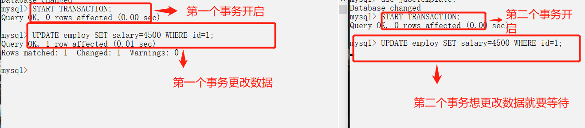

# MySQL

------

## 事务

数据库事务可以保证**多个对数据库的操作**（也就是 SQL 语句）构成一个**逻辑上的整体**。构成这个逻辑上的整体的这些数据库操作遵循：**要么全部执行成功, 要么全部不执行** 。

```sql
# 开启一个事务
START TRANSACTION;
# 多条 SQL 语句
SQL1,SQL2...
## 提交事务
COMMIT;
```

### 事务的ACID特性

- **原子性**（`Atomicity`） ： 事务是最小的执行单位，不允许分割。事务的原子性确保动作要么全部完成，要么完全不起作用；

- **一致性**（`Consistency`）： 执行事务前后，数据保持一致，例如转账业务中，无论事务是否成功，转账者和收款人的总额应该是不变的；

- **隔离性**（`Isolation`）： 并发访问数据库时，一个用户的事务不被其他事务所干扰，各并发事务之间数据库是独立的；

- **持久性**（`Durability`）： 一个事务被提交之后。它对数据库中数据的改变是持久的，即使数据库发生故障也不应该对其有任何影响。

### 并发事务带来的问题

**多个事务并发运行，操作同一的数据时**，可能会导致以下的问题：

- **脏读（Dirty read）:** **读到的数据已经被修改。**

    当一个事务正在访问数据并且对数据进行了**修改**，而这个**修改还没有提交到数据库中**，**这时另外一个事务也访问了这个数据**，然后使用了这个数据。因为这个数据是还没有提交的数据，那么**另外一个事务读到的这个数据是“脏数据”**

- **丢失修改（Lost to modify）:** **两个事务同时修改统一数据，先修改的会被后修改的覆盖，导致丢失**。

    指在一个事务读取一个数据时，另外一个事务也访问了该数据；**在第一个事务中修改了这个数据后，第二个事务也修改了这个数据**。这样**第一个事务内的修改结果就被丢失**，因此称为丢失修改。 

    例如：事务 1 读取某表中的数据 A=20，事务 2 也读取 A=20，事务 1 修改 A=A-1，事务 2 也修改 A=A-1，最终结果 A=19，事务 1 的修改被丢失。

- **不可重复读（Unrepeatable read）:** **在一个事务内两次读同一数据，两次读的间隙数据被修改，两次读的结果不一样。**

    在一个事务内多次读同一数据，在这个事务还没有结束时，另一个事务也访问该数据。那么，在第一个事务中的两次读数据之间，由于第二个事务的修改导致第一个事务两次读取的数据可能不太一样。这就发生了在一个事务内两次读到的数据是不一样的情况，因此称为不可重复读。

- **幻读（Phantom read）:** 幻读与不可重复读类似。它发生在一个事务**T1读取了几行数据**，接着**另一个并发事务T2插入了一些数据时**。在随后的查询中，**T1就会发现多了一些原本不存在的记录**，称为幻读。

#### **不可重复读和幻读区别：**

不可重复读的重点是**数据的修改**，比如多次读取一条记录发现其中某些列的值被修改，幻读的重点在于**数据的新增或者删除**，比如多次读取一条记录发现记录增多或减少了。

### 术语

https://www.cnblogs.com/yousheng/p/12944218.html

#### 一致性读取 (consistent read)

- 事务在进行读操作时，使用的是事务开始时的行快照数据，这样就不用担心读到其他其他事务修改的数据。
- 在[可重复读]下，事务快照是基于第一次读操作的快照(通过undo log 回溯)
- 在[可提交读]下，每一次一致性读操作都会重置快照
- 优点：不上锁，允许其他事务进行修改

#### 半一致性读取 (semi-consistent read)

- 即UPDATE语句中的读/匹配操作，当UPDATE语句执行的时候，InnoDB会取最后一次提交到MySQL的数据来进行 Where 子句中的匹配。
    - 如果匹配上了（也就是要更新），那就重读该行并加锁（或等待加锁）
        - todo 为什么要重读该行不是很理解，直接用那条数据不就好了
- 仅用于[可提交读]隔离级别
- *个人理解其实就是一致性读取在[可提交读]隔离级别下 **UPDATE**的表现*

#### 锁定读 (locking read)

- 即加锁的查询语句
- E.g SELECT ... FOR UPDATE | SELECT ... FOR SHARE

#### 行锁 (record lock) :

即锁定索引记录的锁，即使没有索引也会找到对应行记录锁主键哦

#### 间隙锁 (gap lock) : 

锁在了两条索引记录之间的锁，或者(无穷小,某索引)/(某索引,无穷大)，他们锁住的是一个范围，且不同的间隙锁不互斥，他们排斥的只是在锁范围内的插入操作

- mark: R.C 隔离级别下是被禁用的

#### next-key lock : 

行锁和间隙锁的组合实现

### 事物的隔离(Isolation)级别

- **READ-UNCOMMITTED(读取未提交)：** 最低的隔离级别，允许读取**尚未提交**的数据变更。

    **可能会导致脏读、幻读或不可重复读**。

    无锁策略.

    %E5%AE%9E%E4%BE%8B.jpg)

- **READ-COMMITTED(读取已提交)：** 允许读取并发事务**已经提交**的数据。

    **可以阻止脏读，但是幻读或不可重复读仍有可能发生**。

    读的都是最新版的快照, 所以会有**不可重复读**的问题

    对于Locking Reads、UPDATE、DELETE 语句，InnoDB的锁策略是只**锁索引记录**, 并没有用间隙锁来锁范围，所以会有**幻读**

    

- （MySQL默认）**REPEATABLE-READ(可重复读)：** 对同一字段的**多次读取结果都是一致**的，除非数据是**被本身事务自己所修改**。

    **可以阻止脏读和不可重复读，但幻读仍有可能发生**。

    采用一致性读取，同事务中的每次读取都取第一次读的快照。不会发生不可重复读. 

    对于 locking reads，UPDATE，DELETE ，其加锁策略取决于**是否是唯一索引 ****唯一条件查询**

    - **唯一索引配合唯一查询条件**，引擎只**锁定那条索引**记录，**不锁间隙**
    - 其他场景，引擎使用**Gap Lock 或 Next-Record Lock的间隙锁锁定扫描的索引范围**，以阻止其他事务插入新行到该间隙

    

- **SERIALIZABLE(可串行化)：** 最高的隔离级别，完全服从 ACID 的隔离级别。

    所有的事务依次逐个执行，这样事务之间就完全不可能产生干扰，该级别可以**防止脏读、不可重复读以及幻读**。

    InnoDB 默默的把所有纯 SELECT 语句都转成了 SELECT ... FOR SHARE ，也就默认都加读锁, 使用了**一致性读和间隙锁**是不会产生的幻读问题的
    
    

| 隔离级别         | 脏读 | 不可重复读 | 幻读 |
| ---------------- | ---- | ---------- | ---- |
| READ-UNCOMMITTED | √    | √          | √    |
| READ-COMMITTED   | ×    | √          | √    |
| REPEATABLE-READ  | ×    | ×          | √    |
| SERIALIZABLE     | ×    | ×          | ×    |

MySQL **InnoDB** 的 **REPEATABLE-READ（可重读）**并**不保证避免幻读**，需要**应用Next-Key Locks加锁读**来保证。

因为隔离级别越低，事务请求的锁越少，所以大部分数据库系统的隔离级别都是 **READ-COMMITTED(读取提交内容)** ，但是 InnoDB 存储引擎默认使用 **REPEATABLE-READ（可重读）** 并**不会有任何性能损失**。

InnoDB 存储引擎在 **分布式事务** 的情况下一般会用到 **SERIALIZABLE(可串行化)** 隔离级别。

## Redolog undolog binlog

http://xiaot123.com/mysqlbinlogredologundolog-lagwx

redo log 是物理日志，undo log 和 binlog 是逻辑日志

- binlog二进制日志是server层的无论MySQL用什么引擎，都会有的，主要是左主从复制，时间点恢复使用
    - binlog我们可以简单理解为：存储着每条变更的SQL语句
    - 可以通过binlog来对数据进行恢复
    - binlog 可以用于主从复制中，从库利用主库上的 binlog 进行重播，实现主从同步。用于数据库的基于时间点、位点等的还原操作。binlog 的模式分三种：Statement、Row、Mixed。
    - 事务**提交**的时候，一次性将事务中的 sql 语句（一个事务可能对应多个 sql 语句）按照一定的格式记录到 binlog 中. 这里与 redo log 很明显的差异就是 redo log 并不一定是在事务提交的时候才刷新到磁盘，而是在事务开始之后就开始逐步写入磁盘。binlog 的默认保存时间是由参数 expire_logs_days 配置的，对于非活动的日志文件，在生成时间超过 expire_logs_days 配置的天数之后，会被自动删除。
- redo log重做日志是InnoDB存储引擎层的，用来保证事务安全
    - **事务开始之后**，就开始产生 redo log 日志了，**在事务执行的过程中**，redo log 开始**逐步落盘**
    - 当对应事务的脏页写入到磁盘之后，redo log 的使命就完成了，它所占用的空间也就可以被覆盖了。
- undo log回滚日志保存了事务发生之前的数据的一个版本，可以用于回滚，同时可以提供多版本并发控制下的读（MVCC），也即非锁定读
    - **事务开始之前**，将当前事务版本生成 undo log，undo log 也会产生 redo log 来保证 undo log 的可靠性。
    - 当**事务提交之后**，undo log 并不能立马被删除，而是**放入待清理的链表**，
    - 由 **purge 线程**判断是否有其它事务在使用 undo 段中表的上一个事务之前的版本信息，从而决定是否可以清理 undo log 的日志空间。

## MVCC

解决读-写冲突的**无锁并发控制**，即读的时候写入，**读的内容是改写之前的那个版本**。

MVCC可以为数据库解决以下问题：

- 在并发读写数据库时，可以做到在读(select)操作时不用阻塞写操作，写操作也不用阻塞读操作，提高了数据库并发读写的性能

- 同时还可以解决脏读，幻读，不可重复读等事务隔离问题，但不能解决**更新丢失**问题

### InnoDB对MVCC的实现

`MVCC` 的实现依赖于：**隐藏字段、Read View、undo log**。在内部实现中，`InnoDB` 通过数据行的 `DB_TRX_ID` 和 `Read View` 来判断数据的可见性，如不可见，则通过数据行的 `DB_ROLL_PTR` 找到 `undo log` 中的历史版本。每个事务读到的数据版本可能是不一样的，在同一个事务中，用户只能看到该事务创建 `Read View` 之前**已经提交的修改和该事务本身做的修改**

#### 隐藏字段

在内部，`InnoDB` 存储引擎为每行数据添加了三个 [隐藏字段](https://dev.mysql.com/doc/refman/5.7/en/innodb-multi-versioning.html)：

- `DB_TRX_ID（6字节）`：表示**最后一次插入或更新该行的事务id**。此外，`delete` 操作在内部被视为更新，只不过会在记录头 `Record header` 中的 `deleted_flag` 字段将其标记为已删除
- `DB_ROLL_PTR（7字节）` **回滚指针**，指向该行的 `undo log` 。如果该行未被更新，则为空
- `DB_ROW_ID（6字节）`：如果没有设置主键且该表没有唯一非空索引时，`InnoDB` 会使用**该id来生成聚簇索引**

#### ReadView

[`Read View`](https://github.com/facebook/mysql-8.0/blob/8.0/storage/innobase/include/read0types.h#L298) 主要是用来做可见性判断，里面保存了 “当前对本事务不可见的其他活跃事务”

主要有以下字段：

- `m_low_limit_id`：目前出现过的最大的事务ID+1，即**下一个将被分配的事务ID**。大于这个ID的数据版本均不可见
- `m_up_limit_id`：**活跃事务**列表 `m_ids` 中**最小的事务ID**，如果 `m_ids` 为空，则 `m_up_limit_id` 为 `m_low_limit_id`。小于这个ID的数据版本均可见
- `m_ids`：`Read View` **创建时**其他**未提交的活跃事务ID列表**。创建 `Read View `时，将当前未提交事务ID记录下来，后续即使它们修改了记录行的值，对于当前事务也是不可见的。`m_ids` 不包括当前事务自己和已提交的事务（正在内存中）
- `m_creator_trx_id`：创建该 `Read View` 的事务ID

#### undo-log

**在 `InnoDB` 存储引擎中 `undo log` 分为两种： `insert undo log` 和 `update undo log`：**

1. **`insert undo log`** ：指在 `insert` 操作中产生的 `undo log`。因为 `insert` 操作的记录只对事务本身可见，对其他事务不可见，故该 `undo log` 可以在**事务提交后直接删除**。不需要进行 `purge` 操作

    **`insert` 时的数据初始状态：**

    

2. **`update undo log`** ：`update` 或 `delete` 操作中产生的 `undo log`。该 `undo log`可能需要提供 `MVCC` 机制，因此**不能在事务提交时就进行删除**。不同事务或者相同事务的对同一记录行的修改，会使该记录行的 `undo log` 成为一条**链表**，**链首就是最新的记录，链尾就是最早的旧记录**。提交时放入 `undo log` 链表，等待 `purge线程` 进行最后的删除。

`undo log` 主要有两个**作用**：

- 当**事务回滚**时用于将数据**恢复到修改前**的样子
- 另一个作用是 `MVCC` ，当读取记录时，若该记录被其他事务占用或当前版本对该事务不可见，则可以通过 `undo log` 读取**之前的版本数据**，以此实现**非锁定读**

### 数据可见性算法

在 `InnoDB` 存储引擎中，创建一个新事务后，执行每个 `select` 语句前，都会创建一个快照（Read View），**快照中保存了当前数据库系统中正处于活跃（没有commit）的事务的ID号**。其实简单的说保存的是系统中当前不应该被本事务看到的其他事务ID列表（即m_ids）。当用户在这个事务中要读取某个记录行的时候，`InnoDB` 会将该记录行的 `DB_TRX_ID` 与 `Read View` 中的一些变量及当前事务ID进行比较，判断是否满足可见性条件

1. 如果记录 **DB_TRX_ID < m_up_limit_id**，那么表明**最新修改该行的事务**（DB_TRX_ID）**在当前事务创建快照之前就提交了**，所以该记录行的值对当前事务是**可见**的
2. 如果 **DB_TRX_ID >= m_low_limit_id**，那么表明**最新修改该行的事务**（DB_TRX_ID）**在当前事务创建快照之后才修改该行**，所以该记录行的值对当前事务**不可见**。跳到步骤5
3. **m_ids 为空**，则表明在当前事务创建快照之前，修改该行的事务就**已经提交**了，所以该记录行的值对当前事务是**可见**的
4. 如果 **m_up_limit_id <= DB_TRX_ID < m_up_limit_id**，表明最新修改该行的事务（DB_TRX_ID）在当前事务**创建快照的时候可能处于“活动状态”或者“已提交状态”**；所以就要**对活跃事务列表 m_ids 进行查找**（源码中是用的二分查找，因为是有序的）
    - 如果在活跃事务列表 m_ids 中**能找到 DB_TRX_ID**，表明：①在当前事务创建快照前，该记录行的值被事务ID为 DB_TRX_ID 的事务修改了，但**没有提交**；或者 ②在当前事务创建快照后，该记录行的值被事务ID为 DB_TRX_ID 的事务**修改**了。这些情况下，这个记录行的值对当前事务都是**不可见**的。跳到步骤5
    - 在活跃事务列表中**找不到**DB_TRX_ID，则表明“id为db_trx_id的事务”在修改“该记录行的值”后，在“当前事务”创建快照前就**已经提交**了，所以记录行对当前事务**可见**
5. 在该记录行的 DB_ROLL_PTR 指针所指向的 `undo log` 取出快照记录，用**快照记录的 DB_TRX_ID** 跳到步骤1**重新开始判断**，直到找到满足的**快照版本**或**返回空**

### 一致性非锁定读 - 读历史版本

 [**一致性非锁定读（Consistent Nonlocking Reads）** ](https://dev.mysql.com/doc/refman/5.7/en/innodb-consistent-read.html)的实现，通常做法是加一个**版本号**或者**时间戳**字段：

- **更新数据时，版本号 + 1或者更新时间戳**。

- **查询时**，将当前**可见的版本号**与对应记录的版本号进行比对，如果**可见的版本号大于记录的版本**，则表示该记录可见

在 `InnoDB` 存储引擎中，[多版本控制 (multi versioning)](https://dev.mysql.com/doc/refman/5.7/en/innodb-multi-versioning.html) 就是对**非锁定读**的实现。如果**读取的行**正在执行 `DELETE` 或 `UPDATE` 操作，这时**读取操作不会去等待行上锁的释放**。相反地，`InnoDB` 存储引擎会去**读取行的一个快照数据**，对于这种**读取历史数据**的方式，我们叫它**快照读 (snapshot read)**。

在 `Repeatable Read` 和 `Read Committed` 两个隔离级别下，如果执行普通的 `select` 语句（不包括 `select ... lock in share mode` ,` select ... for update`）会使用 `一致性非锁定读（MVCC）`。

### 锁定读（Locking Reads）- 读最新版本

如果执行的是下列语句，就是 [**锁定读（Locking Reads）**](https://dev.mysql.com/doc/refman/5.7/en/innodb-locking-reads.html)

- select ... lock in share mode
- select ... for update
- insert、update、delete 操作

在锁定读下，读取的是数据的**最新版本**，这种读也被称为 `当前读（current read）`。锁定读会对读取到的记录加锁：

- `select ... lock in share mode`：对记录加 `S` 锁，其它事务也可以加`S`锁，如果加 `x` 锁则会被阻塞
- `select ... for update`、`insert`、`update`、`delete `：对记录加 `X` 锁，且其它事务不能加任何锁

### RC和RR隔离级别下MVCC的差异

在事务隔离级别 `RC`read commit 和 `RR`repeatable read （InnoDB存储引擎的默认事务隔离级别）下，` InnoDB` 存储引擎使用 `MVCC`（非锁定一致性读），它们生成 `Read View` 的时机不同

- 在 **RC** 隔离级别下的 **每次select查询前**都生成一个`Read View` (m_ids列表)，导致**<u>不可重复读</u>**
- 在 **RR** 隔离级别下只在**事务开始后** **第一次select** 数据**前**生成一个`Read View`（m_ids列表），所以可以实现**可重复读**

### MVCC➕Next-key-Lock防止幻读

`InnoDB`存储引擎在 RR 级别下通过 `MVCC`和 `Next-key Lock` 来解决幻读问题：

1. **执行普通 `select`，此时会以 `MVCC` 快照读的方式读取数据**

在**快照读(一致性非锁定读)**的情况下，RR 隔离级别只会在事务开启后的第一次查询生成 `Read View` ，并使用至事务提交。所以在生成 `Read View` 之后其它事务所做的更新、插入记录版本对当前事务并不可见，实现了**可重复读和防止快照读下的 “幻读”**

2. **执行select...for update/lock in share mode、insert、update、delete等当前读**

在**当前读**下，读取的都是最新的数据，如果其它事务有插入新的记录，并且刚好在当前事务查询范围内，就会**产生幻读**！`InnoDB` 使用 **[Next-key Lock]**(https://dev.mysql.com/doc/refman/5.7/en/innodb-locking.html#innodb-next-key-locks) 来防止这种情况。当执行**当前读**时，会**锁定读取到的记录的同时，锁定它们的间隙**，防止其它事务在查询范围内插入数据。只要我不让你插入，就不会发生幻读。

## 索引

**索引**是一种用于**快速查询**和**检索数据**的数据结构。常见的索引结构有: **B 树， B+树和 Hash。**

索引的作用就相当于目录的作用。打个比方: 我们在查字典的时候，如果没有目录，那我们就只能一页一页的去找我们需要查的那个字，速度很慢。如果有目录了，我们只需要先去目录里查找字的位置，然后直接翻到那一页就行了。

### 索引的优缺点

**优点** ：

- 使用索引可以加快**数据的检索速度**（**减少检索的数据量**）
- 通过创建唯一性索引，可以保证数据库表中每一行数据的**唯一性**。

**缺点** ：

- **创建和维护索引**需要**耗费许多时间**。当对表中的数据进行增删改的时候，如果数据有索引，那么**索引也需要动态的修改**，会降低 SQL 执行效率。
- 索引需要使用**物理文件存储**，也会**耗费一定空间**。

**使用索引一定能提高查询性能吗?**

大多数情况下，索引查询都是比全表扫描要快的。但是如果数据库的**数据量不大**，那么使用索引也不一定能够带来很大提升。

### 索引的底层数据结构

#### Hash表 ❌

哈希表是**键值对**的集合，通过键(key)即可快速取出对应的值(value)，因此哈希表可以快速检索数据, **接近 O(1)**。

```python
hash = hashfunc(key)//算出hash值
index = hash % array_size//对hash值取余算出index索引？
```


但是！哈希算法有个 **Hash 冲突** 问题，也就是说多个**不同的 key 最后得到的 index 相同**。通常情况下，我们常用的解决办法是 **链地址法**，**将哈希冲突数据存放在链表中**。

> 就比如 JDK1.8 之前 `HashMap` 就是通过链地址法来解决哈希冲突的。不过，JDK1.8 以后`HashMap`为了减少链表过长的时候搜索时间过长引入了**红黑树**。


#### Hash缺点

既然哈希表这么快，**为什么MySQL 没有使用其作为索引的数据结构呢？**

**1.Hash 冲突问题**：耗费额外资源

**2.Hash 索引不支持顺序和范围查询**

试想一种情况:

```sql
SELECT * FROM tb1 WHERE id < 500;Copy to clipboardErrorCopied
```

Hash 索引是根据 hash 算法来定位的，难不成还要把 1 - 499 的数据，每个都进行一次 hash 计算来定位吗?这就是 Hash 最大的缺点了。

所以可以用B数来进行范围查询。

#### B树 & B+树 ✔️

B 树和 B+树中的 B 是 `Balanced` （平衡）的意思。B 树也称 B-树,全称为 **多路平衡查找树** ，B+ 树是 B 树的一种变体。

目前大部分数据库系统及文件系统都采用 B-Tree 或其变种 B+Tree 作为索引结构。

##### **B 树& B+树两者有何异同呢？**

- **B 树**的所有节点**既存放键(key) 也存放 数据(data)**，而 **B+树**只有**叶子节点存放 key 和 data**，**其他内节点只存放 key**。
- **B 树**的**叶子节点都是独立的**; **B+树**的**叶子节点**有一条**引用链指向与它相邻的叶子节点**。
- **B 树**的检索的过程相当于**对范围内的每个节点**的关键字(key?)做**二分查找**，可能还没有到达叶子节点，检索就结束了。而 **B+树**的检索效率就很稳定了，任何查找都是从**根节点到叶子节点**的过程，**叶子节点的顺序检索**很明显。
- B+树中 当我们在使用**范围查找**的时候 只要找到那个边界值就可以通过指针去查找其他所需要的数据就不用再从根结点开始遍历 减少了所消耗的时间 增加了效率


### 索引类型

#### 主键索引(Primary Key)

数据表的**主键**PK使用的就是主键索引。

在 MySQL 的 InnoDB 的表中，当没有显示的指定表的主键时，InnoDB 会自动先检查表中是否有唯一索引的字段，如果有，则选择该字段为默认的主键，否则 InnoDB 将会自动创建一个 6Byte 的自增主键。

#### 二级索引(辅助索引)

**二级索引又称为辅助索引，**二级索引属于**非聚集索引**, **是因为<u>二级索引的叶子节点存储的数据是主键</u>。也就是说，通过二级索引，可以定位主键的位置。**


**唯一索引，普通索引，前缀索引, 全文索引**等索引属于二级索引。

1. **唯一索引(Unique Key)** ：唯一索引也是一种约束。唯一索引的属性列**不能出现重复的数据**，但是允许数据为 NULL，一张表允许创建多个唯一索引。 建立唯一索引的目的大部分时候都是为了**该属性列的数据的唯一性，而不是为了查询效率**。
2. **普通索引(Index)** ：普通索引的唯一作用就是为了**快速查询数据**，一张表允许创建多个普通索引，并允许数据重复和 NULL。
3. **前缀索引(Prefix)** ：前缀索引只适用于**字符串**类型的数据。前缀索引是对**文本的前几个字符创建索引**，**相比普通索引建立的数据更小**， 因为只取前几个字符。
4. **全文索引(Full Text)** ：全文索引主要是为了**检索大文本数据中的关键字**的信息，是目前搜索引擎数据库使用的一种技术。Mysql5.6 之前只有 MYISAM 引擎支持全文索引，5.6 之后 InnoDB 也支持了全文索引。

### 聚集索引与非聚集索引


#### 聚集索引（InnoDB）

聚集索引即**索引结构和数据一起存放**的索引。**主键索引属于聚集索引**。

> 在 Mysql 中，InnoDB 引擎的表的 `.ibd`文件就包含了该表的索引和数据，对于 InnoDB 引擎表来说，该表的索引(B+树)的每个非叶子节点存储索引，叶子节点存储索引和索引对应的数据。

辅助索引需要两次查询，先查询到主键，然后再通过主键查询到数据。因此，主键不应该过大，因为主键太大，其他索引也都会很大。

##### 聚集索引的优点

- 聚集索引的**查询速度非常快**，因为整个 B+树本身就是一颗**多叉平衡树**，**叶子节点也都是有序的**，定位到索引的节点，就相当于定位到了数据。

##### 聚集索引的缺点

- **依赖于有序的数据** ：因为 B+树是多路平衡树，如果索引的数据不是有序的，那么就需要在插入时排序；如果数据是整型还好，否则类似于字符串或 UUID 这种又长又难比较的数据，插入或查找的速度肯定比较慢。
- **更新代价大** ： 如果对索引列的数据被修改时，那么对应的索引也将会被修改， 而且聚集索引的叶子节点还存放着数据，修改代价肯定是较大的， 所以对于主键索引来说，主键一般都是不可被修改的。

#### 非聚集索引（MYISAM）

非聚集索引即**索引结构和数据分开存放**的索引。

**二级索引属于非聚集索引。**

> MYISAM 引擎的表的.MYI 文件包含了表的索引， 该表的索引(B+树)的每个**非叶子节点存储索引， 叶子节点存储索引和索引对应数据的指针**，指向.MYD 文件的数据。
>
> **非聚集索引的叶子节点并不一定存放数据的指针， 因为二级索引的叶子节点就存放的是主键，根据主键再回表查数据。**

##### 优点

- **更新代价比聚集索引要小** 。非聚集索引的更新代价就没有聚集索引那么大了，因为其叶子节点是不存放数据的

##### 缺点

1. 跟聚集索引一样，非聚集索引也**依赖于有序的数据**
2. **可能会二次查询(回表)** :这应该是非聚集索引最大的缺点了。 当查到索引对应的指针或主键后，可能**还需要根据指针或主键再到数据文件或表中查询。**

#### 覆盖索引不用回表

**覆盖索引即需要查询的字段正好是索引的字段，那么直接根据该索引，就可以查到数据了， 而无需回表查询。**

**虽然 MYISAM 的主键索引确实需要回表， 因为它的主键索引的叶子节点存放的是指针。但是如果 SQL 查的就是主键呢?**

```sql
SELECT id FROM table WHERE id=1;
```

主键索引本身的 key 就是主键，查到返回就行了。这种情况就称之为覆盖索引了。

#### 非聚集索引不一定回表查询。

> 试想一种情况，用户准备使用 SQL 查询用户名，而用户名字段正好建立了索引。

```sql
 SELECT name FROM table WHERE name='guang19';
```

> 那么这个索引的 key 本身就是 name，查到对应的 name 直接返回就行了，无需回表查询。

### 创建索引的注意事项

#### **1.选择<u>合适的字段</u>创建索引：**

- **不为 NULL 的字段** ：索引字段的数据应该尽量不为 NULL，因为对于数据为 NULL 的字段，数据库较难优化。如果字段频繁被查询，但又避免不了为 NULL，建议使用 0,1,true,false 这样语义较为清晰的短值或短字符作为替代。
- **被频繁查询的字段** ：我们创建索引的字段应该是查询操作非常频繁的字段。
- **被作为条件查询的字段** ：被作为 WHERE 条件查询的字段，应该被考虑建立索引。
- **频繁需要排序的字段** ：索引已经排序，这样查询可以利用索引的排序，加快排序查询时间。
- **被经常频繁用于连接的字段** ：经常用于连接的字段可能是一些外键列，对于外键列并不一定要建立外键，只是说该列涉及到表与表的关系。对于频繁被连接查询的字段，可以考虑建立索引，提高多表连接查询的效率。

#### **2.被频繁<u>更新</u>的字段应该慎重建立索引。**

虽然索引能带来查询上的效率，但是维护索引的成本也是不小的。 如果一个字段不被经常查询，反而被经常修改，那么就更不应该在这种字段上建立索引了。

#### **3.尽可能的考虑建立<u>联合索引</u>而不是单列索引。**

因为索引是需要占用磁盘空间的，可以简单理解为**每个索引都对应着一颗 B+树**。如果一个表的字段过多，索引过多，那么当这个表的数据达到一个体量后，索引占用的空间也是很多的，且修改索引时，耗费的时间也是较多的。如果是**联合索引，多个字段在一个索引上，那么将会节约很大磁盘空间，且修改数据的操作效率也会提升**。

#### **4.注意避免<u>冗余索引</u>**

冗余索引指的是**索引的功能相同**，**能够命中索引(a, b)就肯定能命中索引(a)** ，**那么索引(a)就是冗余索引**。如（name,city ）和（name ）这两个索引就是冗余索引，能够命中前者的查询肯定是能够命中后者的 在大多数情况下，都应该尽量扩展已有的索引而不是创建新索引。

#### **5.考虑在<u>字符串</u>类型的字段上使用<u>前缀索引</u>代替普通索引。**

前缀索引仅限于字符串类型，较普通索引会占用更小的空间，所以可以考虑使用前缀索引带替普通索引。

### 使用索引的一些建议

- 对于中到大型表索引都是非常有效的，但是**特大型表的话维护开销会很大，不适合建索引**
- **避免 where 子句中对字段施加函数，这会造成无法命中索引**。
- 在使用 InnoDB 时使用**与业务无关的自增主键作为主键**，即使用**逻辑主键**，而**不要使用业务主键**。
- **删除长期未使用的索引**，不用的索引的存在会造成不必要的性能损耗 。MySQL 5.7 可以通过查询 sys 库的 schema_unused_indexes 视图来查询哪些索引从未被使用
- 在使用 **limit offset 查询缓慢时**，可以借助**索引**来提高性能

### MySQL 如何为表字段添加索引？

1.添加 PRIMARY KEY（主键索引）

```sql
ALTER TABLE `table_name` ADD PRIMARY KEY ( `column` )
```

2.添加 UNIQUE(唯一索引)

```sql
ALTER TABLE `table_name` ADD UNIQUE ( `column` )
```

3.添加 INDEX(普通索引)

```sql
ALTER TABLE `table_name` ADD INDEX index_name ( `column` )
```

4.添加 FULLTEXT(全文索引)

```sql
ALTER TABLE `table_name` ADD FULLTEXT ( `column`)
```

5.添加多列索引

```sql
ALTER TABLE `table_name` ADD INDEX index_name ( `column1`, `column2`, `column3` )
```

## MyISAM 和 InnoDB 的区别

### **1. 表级锁/行级锁**

- **MyISAM** 只有**表级锁**(table-level locking)，一锁就是锁住了整张表

- **InnoDB** 支持**行级锁**(row-level locking)和**表级锁**，默认为行级锁。

    **InnoDB 存储引擎的锁的算法有三种：**

    - **Record lock**：**记录锁**，**单个行记录上的锁**
    - **Gap lock**：**间隙锁**，锁定一个**范围**，不包括**记录本身**
    - **Next-key lock**：Record+Gap **临键锁**，锁定一个**范围**，包含**记录本身**

#### **表级锁和行级锁对比：**

- **表级锁：** MySQL 中锁定 **粒度最大** 的一种锁，对当前操作的整张表加锁。

    **优点**：**实现**简单，**资源消耗**也比较少，**加锁快**，不会出现**死锁**。

    **缺点**：其锁定粒度最大，易触发**锁冲突**，**并发度最低**

- **行级锁：** MySQL 中锁定 **粒度最小** 的一种锁，只针对当前操作的行进行加锁。

    **优点**：行级锁能大大**减少数据库操作的冲突**；其加锁粒度最小，**并发度高**，

    **缺点**：**加锁的开销**大，**加锁慢**，**会出现死锁**。

### 2. 事务

- **MyISAM** 不提供事务支持。
- **InnoDB** 提供事务支持，具有提交(**commit**)和回滚(**rollback**)事务的能力。

### 3. **聚集索引vs**非聚集索引

InnoDB是**聚集索引**，使用B+树作为索引结构，数据文件是和（主键）索引**绑**在一起的（表数据文件本身就是按B+树组织的一个索引结构），必须要有主键，通过主键索引效率很高。但是辅助索引需要两次查询，先查询到主键，然后再通过主键查询到数据。因此，主键不应该过大，因为主键太大，其他索引也都会很大。

MyISAM是**非聚集索引**，也是使用B+树作为索引结构，索引和数据文件是**分离**的，索引保存的是数据文件的**指针**。主键索引和辅助索引是独立的。

### **4. 外键**

- **MyISAM** 不支持；
- **InnoDB** 支持。

🌈 拓展一下：

一般我们也是**不建议**在**数据库层面使用外键**的，应用层面可以解决。不过，这样会对数据的一致性造成威胁。具体要不要使用外键还是要根据你的项目来决定。

### **5. 数据库异常崩溃后的安全恢复**

- MyISAM 不支持；

- InnoDB 支持。

    使用 InnoDB 的数据库在异常崩溃后，数据库重新启动的时候会保证数据库恢复到崩溃前的状态。这个恢复的过程依赖于 `redo log` 。

    MySQL InnoDB 引擎使用 **redo log(重做日志)** 保证事务的**持久性D**，使用 **undo log(回滚日志)** 来保证事务的**原子性A**。

    MySQL InnoDB 引擎通过 **锁机制**、**MVCC** 等手段来保证**事务的隔离性I**（ 默认支持的隔离级别是 **`REPEATABLE-READ`** ）。

    保证了事务的持久性、原子性、隔离性之后，**一致性C**才能得到保障。

### **6. MVCC**

MVCC 可以看作是行级锁的一个升级，可以有效减少加锁操作，提供性能。

- **MyISAM** 不支持；
- **InnoDB** 支持。

### 7. B+Tree索引的实现方式

**MyISAM** 引擎中，**索引文件和数据文件是分离的**，B+Tree **叶节点的 data 域**存放的是**数据记录的地址**。在索引检索的时候，首先按照 B+Tree 搜索算法搜索索引，如果指定的 Key 存在，则取出其 data 域的值，然后**以 data 域的值为地址读取相应的数据记录**。这被称为“**非聚簇索引**”。

**InnoDB** 引擎中，其**数据文件本身就是索引文件**，其表数据文件本身就是按 B+Tree 组织的一个索引结构，**树的叶节点 data 域保存了完整的数据记录**。这个索引的 key 是数据表的**主键**，因此 InnoDB 表数据文件本身就是**主键索引**。这被称为“**聚簇索引**（或聚集索引）”，而其余的索引都作为**辅助索引**，辅助索引的 data 域存储相应记录**主键的值而不是地址**，这也是和 MyISAM 不同的地方。在根据主索引搜索时，直接找到 key 所在的节点即可取出数据；在根据辅助索引查找时，则需要**先取出主键的值，再走一遍主索引**。 因此，在设计表的时候，不建议使用过长的字段作为主键，也不建议使用非单调的字段作为主键，这样会造成主索引频繁分裂。

### 关于 MyISAM 和 InnoDB 的选择问题

《MySQL 高性能》上面有一句话这样写到:

> 不要轻易相信“MyISAM 比 InnoDB 快”之类的经验之谈，这个结论往往不是绝对的。在很多我们已知场景中，InnoDB 的速度都可以让 MyISAM 望尘莫及，尤其是用到了**聚簇索引**，或者**需要访问的数据都可以放入内存**的应用。

**一般情况下选择 InnoDB** ，它保证了**可扩展能力和并发能力，事务支持，崩溃后的安全恢复问题的话**；

在某些**读密集**，不需考虑上述缺点的情况下，使用 **MyISAM 也是合适的**。

## 查询缓存（MySQL 8.0 版本后移除，因为这个功能不太实用）

执行查询语句的时候，会先查询缓存。

`my.cnf` 加入以下配置，重启 MySQL 开启查询缓存

```sql
query_cache_type=1
query_cache_size=600000
```

MySQL 执行以下命令也可以开启查询缓存

```sql
set global  query_cache_type=1;
set global  query_cache_size=600000;
```

如上，**开启查询缓存后在同样的查询条件以及数据情况下，会直接在缓存中返回结果**。这里的查询条件包括查询本身、当前要查询的数据库、客户端协议版本号等一些可能影响结果的信息。因此任何两个查询在任何字符上的不同都会导致缓存不命中。此外，如果查询中包含任何用户自定义函数、存储函数、用户变量、临时表、MySQL 库中的系统表，其查询结果也不会被缓存。

缓存建立之后，MySQL 的查询缓存系统会跟踪查询中涉及的每张表，如果这些表（数据或结构）发生变化，那么和这张表相关的所有缓存数据都将失效。

❕**缓存虽然能够提升数据库的查询性能，但是缓存同时也带来了额外的开销，每次查询后都要做一次缓存操作，失效后还要销毁。** 因此，开启查询缓存要谨慎，尤其对于写密集的应用来说更是如此。如果开启，要注意合理控制缓存空间大小，一般来说其大小设置为几十 MB 比较合适。此外，**还可以通过 sql_cache 和 sql_no_cache 来控制某个查询语句是否需要缓存：**

```sql
select sql_no_cache count(*) from usr;
```

## 其他

### 最左匹配原则

MySQL 建立多列索引（联合索引）有最左匹配的原则，即最左优先：
如果有一个 2 列的索引 (a, b)，则已经对 (a)、(a, b) 上建立了索引；
如果有一个 3 列索引 (a, b, c)，则已经对 (a)、(a, b)、(a, b, c) 上建立了索引；

1、如果建的索引顺序是 (a, b)。而查询的语句是 where b = 1 AND a = ‘陈哈哈’; 为什么还能利用到索引？

  理论上索引对顺序是敏感的，但是由于 MySQL 的查询优化器会自动调整 where 子句的条件顺序以使用适合的索引，所以 MySQL 不存在 where 子句的顺序问题而造成索引失效。当然了，SQL书写的好习惯要保持，这也能让其他同事更好地理解你的SQL。

2、还有一个特殊情况说明下，下面这种类型的SQL， a 与 b 会走索引，c不会走。

```java
select * from LOL where a = 2 and b > 1000  and c='JJJ疾风剑豪';
```

  对于上面这种类型的sql语句；mysql会一直向右匹配直到遇到范围查询(>、<、between、like)就停止匹配（包括like '陈%'这种）。在a、b走完索引后，c已经是无序了，所以c就没法走索引，优化器会认为还不如全表扫描c字段来的快。所以只使用了(a,b)两个索引，影响了执行效率。

  其实，这种场景可以通过修改索引顺序为 abc_index:(a,c,b)，就可以使三个索引字段都用到索引，建议小伙伴们不要有问题就想着新增索引哦，浪费资源还增加服务器压力。

  综上，如果通过调整顺序，就可以解决问题或少维护一个索引，那么这个顺序往往就是我们DBA人员需要优先考虑采用的。


### 模糊查询

对于模糊查询阿里巴巴开发手册这样说到：

> 【强制】页面搜索**严禁左模糊或者全模糊**，如果需要请走搜索引擎来解决。
>
> 说明: **索引文件具有 B-Tree 的最左前缀匹配特性，如果左边的值未确定，那么无法使用此索引。**

### 外键和级联

对于外键和级联，阿里巴巴开发手册这样说到：

> 【强制】**不得使用外键与级联**，一切外键概念必须在**应用层解决**。
>
> 说明:以学生和成绩的关系为例，学生表中的 student_id 是主键，那么成绩表中的 student_id 则为外键。如果更新学生表中的 student_id，同时触发成绩表中的 student_id 更新，即为级联更新。

#### **外键与级联更新适用于单机低并发，不适合分布式、高并发集群**;

- **外键影响数据库的插入速度**；
- **级联更新是强阻塞，存在数据库更新风暴的风险**;。

#### 外键的缺点：

 1. **增加了复杂性：** a.每次做DELETE 或者UPDATE都必须考虑外键约束，会导致开发的时候很痛苦,测试数据极为不方便; b.外键的主从关系是定的，假如哪天需求有变化，数据库中的这个字段根本不需要和其他表有关联的话就会增加很多麻烦。
 3. 外键还会**因为需要请求对其他表内部加锁而容易出现死锁情况**；
 4. **对分库分表不友好** ：**分库分表**下外键是**无法生效**的。

#### 外键的优点：

1. 保证了数据库数据的**一致性和完整性**；
2. 级联操作方便，**减轻了程序代码量**；

### 关于@Transactional注解

对于`@Transactional`事务注解，阿里巴巴开发手册这样说到：

> 【参考】@Transactional事务不要滥用。事务会**影响数据库的QPS**，另外使用事务的地方需要考虑各方面的**回滚方案**，包括**缓存回滚、搜索引擎回滚、消息补偿、统计修正**等。

###  Where，Group by，Having

o  where 子句用来筛选 FROM 子句中指定的操作所产生的行。

o  group by 子句用来分组 where 子句的输出。

o  having 子句用来从分组的结果中筛选行。

###  [红黑树](https://www.nowcoder.com/jump/super-jump/word?word=红黑树)的五个特性记得吗？

### mysql索引为什么使用B+树不使用B树 为什么我不使用[红黑树](https://www.nowcoder.com/jump/super-jump/word?word=红黑树)？