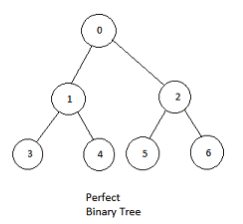
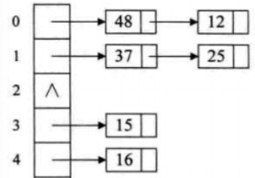
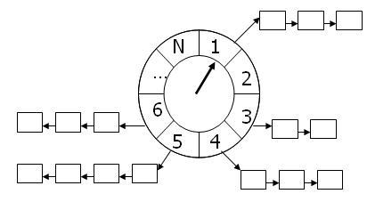
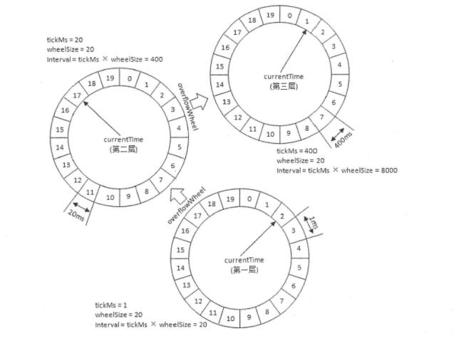

# 数据结构笔试题

[toc]

------

## 二叉树

### 224个叶子节点的完全二叉树, 最多有几个结点？

448.

二叉树具有性质：

1、度为0的结点个数=度为2的结点个数+1，即n0=n2+1（其中n0表示度为0的结点个数，n2表示度为2的结点个数）。注 ：二叉树的度代表某个结点的孩子或者说直接后继的个数。 

比如上图，度为0的节点：0、1、2，度为2的节点：3、4、5、6

所以n2=n0-1=223

2、完全二叉树中度为1的结点个数要么0个，要么1个。 本题求最多，所以n1=1

3、二叉树结点个数n=n0+n1+n2=224+1+223=448

## 栈

## 哈希表（散列表、hashtable）

### [哈希表（散列表）解决冲突的方式](https://www.cnblogs.com/cing/p/8821389.html)

**1.** **开放定址法**

开放定址法就是一旦发生冲突，就去寻找下一个空的散列地址，只要散列表足够大，空的散列地址总能找到，并将记录存入。

**缺点：**

①存储记录的数目不能超过桶数组的长度，如果超过就需要**扩容**，而扩容会导致某次操作的时间成本飙升，这在实时或者交互式应用中可能会是一个严重的缺陷

②使用探测序列，有可能其计算的时间成本过高，导致哈希表的处理性能降低

③由于记录是存放在桶数组中的，而桶数组必然存在空槽，所以当记录本身尺寸（size）很大并且记录总数规模很大时，空槽占用的空间会导致明显的内存浪费

④**不能直接删除a**，而是**设置删除标记**，这就需要额外的空间和操作。比如需要删除记录a，记录b是在a之后插入桶数组的，本应插入a的位置，但是和记录a有冲突，只能通过探测序列再次跳转找到的地址。所以如果直接删除a，a的位置变为空槽，而空槽是查询记录b失败的终止条件，这样会导致记录b在a的位置重新插入数据前不可见。

**2.** **再散列函数法**

Hi=RHi(key), i=1,2,…,k RHi均是**不同的散列函数**（比如除留余数、折叠、平方取中），在key相同产生地址冲突时就换用**另一个散列函数**计算散列地址，**直到碰撞不再发生**。

**优点**：不易产生“聚集”。

**缺点**：增加了计算时间。

**3.** **拉链法（链地址法）**

将所有key相同的记录存储在一个**单链表**中，称这种表为**同义词子表**，在散列表中只存储所有同义词子表的**头指针**。

**优点：**

①对于记录总数频繁可变的情况，处理的比较好（也就是避免了动态调整的开销）

②由于记录存储在结点中，而结点是动态分配，不会造成内存的浪费，所以尤其适合那种记录本身尺寸（size）很大的情况，因为此时指针的开销可以忽略不计了

③删除记录时，比较方便，直接通过指针操作即可

**缺点：**

①存储的记录是随机分布在内存中的，这样在查询记录时，相比结构紧凑的数据类型（比如数组），哈希表的跳转访问会带来额外的时间开销

②如果所有的 key-value 对是可以提前预知，并之后不会发生变化时（即不允许插入和删除），可以人为创建一个不会产生冲突的完美哈希函数（perfect hash function），此时封闭散列的性能将远高于开放散列

总结：

元素少，用开放定址，冲突少，速度快；元素多，用拉链法。

**4.** **公共溢出区法**

在查找时，对给定关键字通过散列函数计算出散列地址（哈希值）后，先与**基本表**的相应位置进行比对，如果相等，则查找成功；如果不相等，则到溢出区表进行**顺序查找**。如果相对于基本表而言，在有**冲突的数据很少**的情况下，公共溢出区的结构对查找性能来说还是非常**高**的。

## 时间轮-环形队列

1. ### 现在有一百万条定时任务，是一个二元组<key，value>，key代表触发的时间，value代表任务。将这一百万条定时任务插入一个调度系统，设计这个调度系统的存储结构，保证两点：插入的速度快，同时保证调度系统可以实现秒级的任务调度

时间轮算法，时间轮是一个环形队列，按照时间的单位区分，我们假设1秒，每个单位里面，是一个链表，用来存储定时任务。

可能你会问，一个环形队列里面的元素，毕竟是优先的，如果超过了长度，我们该怎么办呢？我们可以联想到我们家里的水表，是不是也有很多个轮子，每一个轮子的单位不一样！同样，时间轮也是如此，我们可以用多级时间轮进行优化，就跟我们的时钟或者水表一样，这一层的走了一圈，下一层的才走了一格。

那么，这个算法的 时间复杂度怎么计算呢？插入的时候，我们从最低层开始查找，找到在哪一层，然后直接插入对应的刻度。假如我们的时间轮有5层，那么我们最多查找5次。查询的时候，我们每一秒都是推动时间轮的滚动，每次都是直接取队首的元素，相当于算法时间复杂度为O(1)。当转了一圈的时候，把下一层的下一格再推下来。这样子，我们一个元素，最多会从第5层，逐渐插到第1层，综合下来一个元素最多会被插入5次，在算法时间复杂度评估的时候，我们通常会忽略常数，最终算法时间复杂度为O(1)。
