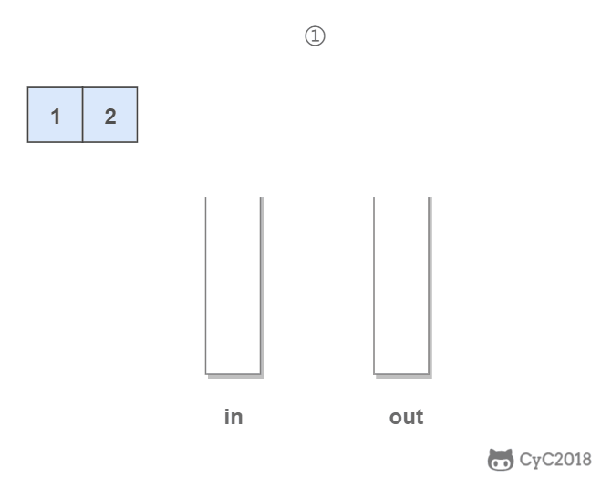

# 栈

## [剑指 Offer 09. 用两个栈实现队列](https://leetcode-cn.com/problems/yong-liang-ge-zhan-shi-xian-dui-lie-lcof/)

用两个栈实现一个队列。队列的声明如下，请实现它的两个函数 `appendTail` 和 `deleteHead` ，分别完成在队列尾部插入整数和在队列头部删除整数的功能。(若队列中没有元素，`deleteHead` 操作返回 -1 ) 

**示例 1：**

```
输入：
["CQueue","appendTail","deleteHead","deleteHead"]
[[],[3],[],[]]
输出：[null,null,3,-1]
```

**示例 2：**

```
输入：
["CQueue","deleteHead","appendTail","appendTail","deleteHead","deleteHead"]
[[],[],[5],[2],[],[]]
输出：[null,-1,null,null,5,2]
```

函数签名：

```java
class CQueue {

    public CQueue() {

    }
    
    public void appendTail(int value) {

    }
    
    public int deleteHead() {
        
    }
}

/**
 * Your CQueue object will be instantiated and called as such:
 * CQueue obj = new CQueue();
 * obj.appendTail(value);
 * int param_2 = obj.deleteHead();
 */
```

### 思路：

用两个栈来实现一个队列，完成队列的 Push 和 Pop 操作。

in 栈用来处理入栈（push）操作，out 栈用来处理出栈（pop）操作。一个元素进入 in 栈之后，出栈的顺序被反转。当元素要出栈时，需要先进入 out 栈，此时元素出栈顺序再一次被反转，因此出栈顺序就和最开始入栈顺序是相同的，先进入的元素先退出，这就是队列的顺序。



### Solution

```java
class CQueue {
    
    Stack<Integer> in;
    Stack<Integer> out;

    public CQueue() {
        in = new Stack<>();
        out = new Stack<>();
    }
    
    public void appendTail(int value) {//push()，或queue.offer()
        in.push(value);
    }
    
    public int deleteHead() {//pop(), 或queue.poll()
        if(out.isEmpty()){//out为空时才能把in里的元素装入，不然访问顺序会出错
            while(!in.isEmpty()){
                out.push(in.pop());
            }
        }

        if(out.isEmpty())
            return -1;
        
        return out.pop();
    }
}
```

## [剑指 Offer 30. 包含min函数的栈](https://leetcode-cn.com/problems/bao-han-minhan-shu-de-zhan-lcof/)

定义栈的数据结构，请在该类型中实现一个能够得到栈的最小元素的 min 函数在该栈中，调用 min、push 及 pop 的时间复杂度都是 O(1)。

**示例:**

```
MinStack minStack = new MinStack();
minStack.push(-2);
minStack.push(0);
minStack.push(-3);
minStack.min();   --> 返回 -3.
minStack.pop();
minStack.top();      --> 返回 0.
minStack.min();   --> 返回 -2.
```

函数签名：

```java
class MinStack {

    /** initialize your data structure here. */
    public MinStack() {

    }
    
    public void push(int x) {

    }
    
    public void pop() {

    }
    
    public int top() {

    }
    
    public int min() {

    }
}

/**
 * Your MinStack object will be instantiated and called as such:
 * MinStack obj = new MinStack();
 * obj.push(x);
 * obj.pop();
 * int param_3 = obj.top();
 * int param_4 = obj.min();
 */
```

**pop和top的区别为：pop时元素出栈，top时元素不出栈**

### 思路

普通栈的 push() 和 pop() 函数的复杂度为 O(1)；而获取栈最小值 min() 函数需要遍历整个栈，复杂度为 O(N)。

本题难点： 将 min() 函数复杂度降为 O(1)，可通过建立辅助栈实现；

使用一个额外的 B，栈顶元素为当前栈中最小的值。

- push(x) 函数： 重点为保持栈 B 的元素是 非严格降序 的。

    1. 将 x 压入栈 A （即 A.add(x) ）；
    2. 若 ① 栈 B 为空 或 ② x 小于等于 栈 B 的栈顶元素，则将 x 压入栈 B （即 B.add(x) ）。
- pop() 函数： 重点为保持栈 A,B 的 元素一致性 。
    1. 执行栈 A 出栈（即 A.pop() ），将出栈元素记为 y ；
    2. 若 y 等于栈 B 的栈顶元素，则执行栈 B 出栈（即 B.pop() ）??????????会出bug吧？
- top() 函数： 直接返回栈 A 的栈顶元素即可，即返回 A.peek() 。

- min() 函数： 直接返回栈 B 的栈顶元素即可，即返回 B.peek() 。


### Solution

A=dataStack, B=minStack;

```java
class MinStack {

    Stack<Integer> dataStack;
    Stack<Integer> minStack;

    /** initialize your data structure here. */
    public MinStack() {
        dataStack = new Stack<>();
        minStack = new Stack<>();
    }
    
    public void push(int x) {
        dataStack.push(x);
        if(minStack.isEmpty() || x<=minStack.peek())//<=避免了重复最小值被弹出
            minStack.push(x);
    }
    
    public void pop() {
        if(dataStack.pop().equals(minStack.peek()))//如果用==将会无法通过 Integer的equals重写过，比较的是内部value的值， ==如果在[-128,127]会被cache缓存,超过这个范围则比较的是对象是否相同
            minStack.pop();
    }
    
    public int top() {
        return dataStack.peek();
    }
    
    public int min() {
        return minStack.peek();
    }
}
```

时间复杂度：全部为O(1)

## [剑指 Offer 31. 栈的压入、弹出序列](https://leetcode-cn.com/problems/zhan-de-ya-ru-dan-chu-xu-lie-lcof/)

输入两个整数序列，第一个序列表示栈的压入顺序，请判断第二个序列是否为该栈的弹出顺序。假设压入栈的所有数字均不相等。例如，序列 {1,2,3,4,5} 是某栈的压栈序列，序列 {4,5,3,2,1} 是该压栈序列对应的一个弹出序列，但 {4,3,5,1,2} 就不可能是该压栈序列的弹出序列。

`pushed` 是 `popped` 的排列。

**示例 1：**

```
输入：pushed = [1,2,3,4,5], popped = [4,5,3,2,1]
输出：true
解释：我们可以按以下顺序执行：
push(1), push(2), push(3), push(4), pop() -> 4,
push(5), pop() -> 5, pop() -> 3, pop() -> 2, pop() -> 1
```

**示例 2：**

```
输入：pushed = [1,2,3,4,5], popped = [4,3,5,1,2]
输出：false
解释：1 不能在 2 之前弹出。
```

函数签名：

```java
public boolean validateStackSequences(int[] pushed, int[] popped)；
```

### 思路

考虑借用一个辅助栈 stack ，模拟 压入 / 弹出操作的排列。根据是否模拟成功，即可得到结果。

- 入栈操作： 按照压栈序列的顺序执行。
- 出栈操作： 每次入栈后，循环判断 “栈顶元素 == 弹出序列的当前元素” 是否成立，将符合弹出序列顺序的栈顶元素全部弹出。

### Solution

```java
public boolean validateStackSequences(int[] pushed, int[] popped) {
        Stack<Integer> stack = new Stack<>();
        int popIdx = 0;
        for(int i=0; i<pushed.length; i++){
            stack.push(pushed[i]);
            while(!stack.isEmpty() && stack.peek()==popped[popIdx]){//popped是pushed的排列，所以不用判断popIdx<popped.length
                stack.pop();
                popIdx++;
            }
        }
        if(stack.isEmpty())
            return true;
        
        return false;
    }
```

时间复杂度 O(N) ： 其中 N 为列表 pushed 的长度；每个元素最多入栈与出栈一次，即最多共 2N 次出入栈操作。
空间复杂度 O(N)： 辅助栈 stack 最多同时存储 N 个元素。

# 堆

大顶堆的堆顶的关键字肯定是所有关键字中最大的，小顶堆的堆顶的关键字是所有关键字中最小的

## [剑指 Offer 40. 最小的k个数](https://leetcode-cn.com/problems/zui-xiao-de-kge-shu-lcof/)

输入整数数组 `arr` ，找出其中最小的 `k` 个数。例如，输入4、5、1、6、2、7、3、8这8个数字，则最小的4个数字是1、2、3、4。

**示例 1：**

```
输入：arr = [3,2,1], k = 2
输出：[1,2] 或者 [2,1]
```

**示例 2：**

```
输入：arr = [0,1,2,1], k = 1
输出：[0]
```

**限制：**

- `0 <= k <= arr.length <= 10000`
- `0 <= arr[i] <= 10000`

### 思路：维护一个大小为 K 的最小堆

- 特别适合处理海量数据

维护一个大小为 K 的最小堆过程如下：使用大顶堆。在添加一个元素之后，如果堆的size大于 K，那么将大顶堆的堆顶元素去除，也就是将当前堆中值最大的元素去除，从而使得留在堆中的元素都比被去除的元素来得小。

Java 的 PriorityQueue 实现了堆的能力，PriorityQueue 默认是小顶堆，可以在在初始化时使用 Lambda 表达式 (o1, o2) -> o2 - o1 来实现大顶堆。其它语言也有类似的堆数据结构。

### Solution：维护一个大小为 K 的最小堆

```java
public int[] getLeastNumbers(int[] arr, int k) {
        PriorityQueue<Integer> maxHeap = new PriorityQueue<>(
            new Comparator<Integer>(){
                public int compare(Integer o1, Integer o2){
                    return o2 - o1;//PQ默认为升序，最大堆需要降序
                }
            });
        for(int i=0; i<arr.length; i++){
            maxHeap.offer(arr[i]);
            if(maxHeap.size()>k)
                maxHeap.poll();//移除堆顶
        }
        
        int[] res = new int[k];
        for(int i=0; i<k; i++){
            res[i] = maxHeap.poll();
        }
        return res;
    }
```

时间复杂度：O(Nlogn)， 其中 N 是数组 arr 的长度。由于最小堆实时维护前 K 小值，所以插入删除都是O(logk) 的时间复杂度，最坏情况下数组里 n 个数都会插入，所以一共需要 O(nlogn) 的时间复杂度。

空间复杂度：O(K)，因为大根堆里最多 k 个数。

### 思路：快排思想

- 只有当允许修改数组元素时才可以使用
- 算法的结果无法保证最小的k个数是有序的

快速排序的 partition() 方法，会返回一个整数 j 使得 a[l..j-1] 小于等于 a[j]，且 a[j+1..h] 大于等于 a[j]，此时 a[j] 就是数组的第 j 大元素。可以利用这个特性找出数组的第 K 个元素，这种找第 K 个元素的算法称为快速选择算法。

### Solution：快排思想

```java
public int[] getLeastNumbers(int[] arr, int k) {
        if(k==0)
            return new int[0];

        int l = 0, r = arr.length-1;
        while(l<r){
            int j = partition(arr, l, r);
            if(j==k-1)
                break;//第k小的树作为pivot，左边都小于k，右边都大于k，但是都是无序的
            else if(j>k-1)
                r = j - 1;
            else//if(j<k-1)
                l = j + 1;
        }

        int[] res = new int[k];
        for(int i=0; i<k; i++){
            res[i] = arr[i];
        }
        return res;

    }
    //返回pivot的索引使得数组左边小于pivot，右边大于pivot
    public int partition(int[] arr, int l, int r){
        int pivot = arr[l];
        int i = l+1, j = r;
        while(true){
            // i向右找到第一个大于 pivot 的元素位置
            while(i<=j && arr[i]<=pivot)
                i++;
            // j向左找到第一个小于 pivot 的元素位置
            while(i<=j && arr[j]>=pivot)
                j--;
            
            if(i>=j)
                break;
            swap(arr, i, j);
        }
        swap(arr, l, j);//跟j换的原因是j是从右向左的元素中第一个小于pivot的
        return j;
    }
    public void swap(int[] arr, int i, int j){
        int tmp = arr[i];
        arr[i] = arr[j];
        arr[j] = tmp;
    }
```

复杂度：O(N) + O(1)