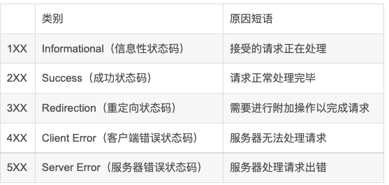
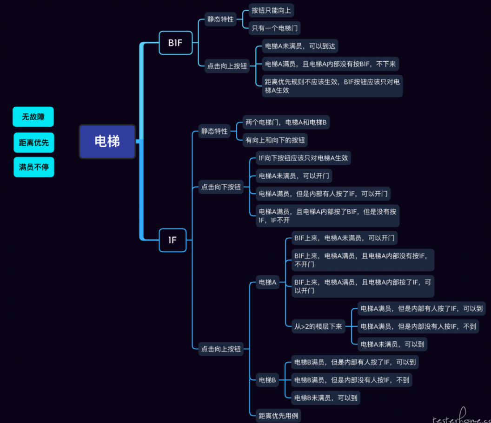

# 如何区分前后端bug

前端无数据展示，直接查看调用接口，看接口返回状态，状态正常返回数据符合预期结果，确定为前端bug。前端有数据返回但接口无数据返回，确定为后端bug

状态异常根据返回的状态码区分是哪端的bug

1.500后端接口异常，一般是后端bug

2.502/504一般为服务器异常，所以既不是前端也不是后端，是服务器出问题了

3.404有可能是服务器异常，也有可能是后端异常，首先排查url地址是否正确，再排查服务其运行是否正常，如果以上都正常，则大概率为后端bug

4.400一般为前端bug

5.前端有数据但不符合预期结果，查看调用接口返回数据，对照api文档验证对应字段的值是否正确，如果正确，确定为前端bug，如果不符合，排查数据库对应字段是否与后端返回数据一致，例：前端要求传0作为无效参数，前端传null就是前端bug，前端可能说后端可以banull处理为0，技术上也没问题，但是不符合规定

## 1XX：通知

1XX系列响应代码仅在与HTTP服务器沟通时使用。

- 100("Continue")
    重要程度：中等，但（写操作时）很少用。

这是对HTTP LBYL（look-before-you-leap）请求的一个可能的响应。该响应代码表明：客户端应重新发送初始请求，并在请求中附上第一次请求时未提供的（可能很大或者包含敏感信息的）表示。客户端这次发送的请求不会被拒绝。对LBYL请求的另一个可能的响应是417("Expectation Failed")。

请求报头：要做一个LBYL请求，客户端必须把Expect请求报头设为字符串"100-continue"。除此以外，客户端还需要设置其他一些报头，服务器将根据这些报头决定是响应100还是417。

- 101("Switching Protocols")
    重要程度：非常低。

当客户端通过在请求里使用Upgrade报头，以通知服务器它想改用除HTTP协议之外的其他协议时，客户端将获得此响应代码。101响应代码表示“行，我现在改用另一个协议了”。通常HTTP客户端会在收到服务器发来的101响应后关闭与服务器的TCP连接。101响应代码意味着，该客户端不再是一个HTTP客户端，而将成为另一种客户端。
尽管可以通过Upgrade报头从HTTP切换到HTTPS，或者从HTTP1.1切换到某个未来的版本，但实际使用Upgrade报头的情况比较少。Upgrade报头也可用于HTTP切换到一个完全不同的协议（如IRC）上，但那需要在Web服务器切换为一个IRC服务器的同时，Web客户端切换为一个IRC的客户端，因为服务器将立刻在同一个TCP连接上开始使用新的协议。

请求报头：客户端把Upgrade报头设置为一组希望使用的协议。
响应报头：如果服务器同意切换协议，它就返回一个Upgrade报头，说明它将切换到那个协议，并附上一个空白行。服务器不用关闭TCP链接，而是直接在该TCP连接上开始使用新的协议。

## 2XX: 成功

2XX系列响应代码表明操作成功了。

- 200("OK")
    重要程度：非常高。

一般来说，这是客户端希望看到的响应代码。它表示服务器成功执行了客户端所请求的动作，并且在2XX系列里没有其他更适合的响应代码了。

实体主体：对于GET请求，服务器应返回客户端所请求资源的一个表示。对于其他请求，服务器应返回当前所选资源的一个表示，或者刚刚执行的动作的一个描述。

-201("Created")
重要程度：高。

当服务器依照客户端的请求创建了一个新资源时，发送此响应代码。

响应报头：Location报头应包含指向新创建资源的规范URI。
实体主体：应该给出新创建资源的描述与链接。若已经在Location报头里给出了新资源的URI，那么可以用新资源的一个表示作为实体主体。

-202("Accepted")
重要程度：中等。

客户端的请求无法或将不被实时处理。请求稍后会被处理。请求看上去是合法的，但在实际处理它时有出现问题的可能。
若一个请求触发了一个异步操作，或者一个需要现实世界参与的动作，或者一个需要很长时间才能完成且没必要让Web客户端一直等待的动作时，这个相应代码是一个合适的选择。

响应报头：应该把未处理完的请求暴露为一个资源，以便客户端稍后查询其状态。Location报头可以包含指向该资源的URI。
实体主体：若无法让客户端稍后查询请求的状态，那么至少应该提供一个关于何时能处理该请求的估计。

- 203("Non-Authoritative Information")
    重要程度：非常低。

这个响应代码跟200一样，只不过服务器想让客户端知道，有些响应报头并非来自该服务器--他们可能是从客户端先前发送的一个请求里复制的，或者从第三方得到的。

响应报头：客户端应明白某些报头可能是不准确的，某些响应报头可能不是服务器自己生成的，所以服务器也不知道其含义。

- 204("No Content")
    重要程度：高。

若服务器拒绝对PUT、POST或者DELETE请求返回任何状态信息或表示，那么通常采用此响应代码。服务器也可以对GET请求返回此响应代码，这表明“客户端请求的资源存在，但其表示是空的”。注意与304("Not Modified")的区别。204常常用在Ajax应用里。服务器通过这个响应代码告诉客户端：客户端的输入已被接受，但客户端不应该改变任何UI元素。

实体主体：不允许。

- 205("Reset Content")
    重要程度：低。

它与204类似，但与204不同的是，它表明客户端应重置数据源的视图或数据结构。假如你在浏览器里提交一个HTML表单，并得到响应代码204，那么表单里的各个字段值不变，可以继续修改它们；但假如得到的响应代码205，那么表单里的各个字段将被重置为它们的初始值。从数据录入方面讲：204适合对单条记录做一系列编辑，而205适于连续输入一组记录。

- 206("Partial Content")
    重要程度：对于支持部分GET（partial GET）的服务而言“非常高”，其他情况下“低”。

它跟200类似，但它用于对部分GET请求（即使用Range请求报头的GET请求）的响应。部分GET请求常用于大型二进制文件的断点续传。

请求报头：客户端为Range请求报头设置一个值。
响应报头：需要提供Date报头。ETag报头与Content-Location报头的值应该跟正常GET请求相同。

若实体主体是单个字节范围（byte range），那么HTTP响应里必须包含一个Content-Range报头，以说明本响应返回的是表示的哪个部分，若实体主体是一个多部分实体（multipart entity）（即该实体主体由多个字节范围构成），那么每一个部分都要有自己的Content-Range报头。
实体主体：不是整个表示，而是一个或者多个字节范围。

## 3XX 重定向

3XX系列响应代码表明：客户端需要做些额外工作才能得到所需要的资源。它们通常用于GET请求。他们通常告诉客户端需要向另一个URI发送GET请求，才能得到所需的表示。那个URI就包含在Location响应报头里。

- 300("Multiple Choices")
    重要程度：低。

若被请求的资源在服务器端存在多个表示，而服务器不知道客户端想要的是哪一个表示时，发送这个响应代码。或者当客户端没有使用Accept-*报头来指定一个表示，或者客户端所请求的表示不存在时，也发送这个响应代码。在这种情况下，一种选择是，服务器返回一个首选表示，并把响应代码设置为200，不过它也可以返回一个包含该资源各个表示的URI列表，并把响应代码设为300。

响应报头：如果服务器有首选表示，那么它可以在Location响应报头中给出这个首选表示的URI。跟其他3XX响应代码一样，客户端可以自动跟随Location中的URI。
实体主体：一个包含该资源各个表示的URI的列表。可以在表示中提供一些信息，以便用户作出选择。

- 301("Moved Permanently")
    重要程度：中等。

服务器知道客户端试图访问的是哪个资源，但它不喜欢客户端用当前URI来请求该资源。它希望客户端记住另一个URI，并在今后的请求中使用那个新的URI。你可以通过这个响应代码来防止由于URI变更而导致老URI失效。

响应报头：服务器应当把规范URI放在Location响应报头里。
实体主体：服务器可以发送一个包含新URI的信息，不过这不是必需的。

- 302("Found")
    重要程度：应该了解，特别市编写客户端时。但我不推荐使用它。

这个响应代码市造成大多数重定向方面的混乱的最根本原因。它应该是像307那样被处理。实际上，在HTTP 1.0中，响应代码302的名称是”Moved Temporarily”，不幸的是，在实际生活中，绝大多数客户端拿它像303一样处理。它的不同之处在于当服务器为客户端的PUT，POST或者DELETE请求返回302响应代码时，客户端要怎么做。
为了消除这一混淆，在HTTP 1.1中，该响应代码被重命名为"Found"，并新加了一个响应代码307。这个响应代码目前仍在广泛使用，但它的含义市混淆的，所以我建议你的服务发送307或者303，而不要发送302.除非你知道正在与一个不能理解303或307的HTTP 1.0客户端交互。

响应报头：把客户端应重新请求的那个URI放在Location报头里。
实体主体：一个包含指向新URI的链接的超文本文档（就像301一样）。

- 303("See Other")
    重要程度：高。

请求已经被处理，但服务器不是直接返回一个响应文档，而是返回一个响应文档的URI。该响应文档可能是一个静态的状态信息，也可能是一个更有趣的资源。对于后一种情况，303是一种令服务器可以“发送一个资源的表示，而不强迫客户端下载其所有数据”的方式。客户端可以向Location报头里的URI发送GET请求，但它不是必须这么做。
303响应代码是一种规范化资源URI的好办法。一个资源可以有多个URIs，但每个资源的规范URI只有一个，该资源的所有其他URIs都通过303指向该资源的规范URI，例如：303可以把一个对http://www.example.com/software/current.tar.gz的请求重定向到http://www.example.com/software/1.0.2.tar.gz。

响应报头：Location报头里包含资源的URI。
实体主体：一个包含指向新URI的链接的超文本文档。

- 304("Not Modified")
    重要程度：高。

这个响应代码跟204("No Content")类似：响应实体主体都必须为空。但204用于没有主体数据的情况，而304用于有主体数据，但客户端已拥有该数据，没必要重复发送的情况。这个响应代码可用于条件HTTP请求（conditional HTTP request).如果客户端在发送GET请求时附上了一个值为Sunday的If-Modified-Since报头，而客户端所请求的表示在服务器端自星期日（Sunday）以来一直没有改变过，那么服务器可以返回一个304响应。服务器也可以返回一个200响应，但由于客户端已拥有该表示，因此重复发送该表示只会白白浪费宽带。

响应报头：需要提供Date报头。Etag与Content-Location报头的值，应该跟返回200响应时的一样。若Expires, Cache-Control及Vary报头的值自上次发送以来已经改变，那么就要提供这些报头。
实体主体：不允许。

- 305("Use Proxy")
    重要程度：低。

这个响应代码用于告诉客户端它需要再发一次请求，但这次要通过一个HTTP代理发送，而不是直接发送给服务器。这个响应代码使用的不多，因为服务器很少在意客户端是否使用某一特定代理。这个代码主要用于基于代理的镜像站点。现在，镜像站点（如http://www.example.com.mysite.com/）包含跟原始站点（如 http://www.example.com/）一样的内容，但具有不同的URI，原始站点可以通过307把客户端重新定向到镜像站点上。假如有基于代理的镜像站点，那么你可以通过把 http://proxy.mysite.com/设为代理，使用跟原始URI（http://www.example.com/）一样的URI来访问镜像站点。这里，原始站点example.com可以通过305把客户端路由到一个地理上接近客户端的镜像代理。web浏览器一般不能正确处理这个响应代码，这是导致305响应代码用的不多的另一个原因。

响应报头：Location报头里包含代理的URI。

- 306 未使用
    重要程度：无

306 响应代码没有在HTTP标准中定义过。

- 307("Temporary Redirect")
    重要程度：高。

请求还没有被处理，因为所请求的资源不在本地：它在另一个URI处。客户端应该向那个URI重新发送请求。就GET请求来说，它只是请求得到一个表示，该响应代码跟303没有区别。当服务器希望把客户端重新定向到一个镜像站点时，可以用307来响应GET请求。但对于POST，PUT及DELETE请求，它们希望服务器执行一些操作，307和303有显著区别。对POST，PUT或者DELETE请求响应303表明：操作已经成功执行，但响应实体将不随本响应一起返回，若客户端想要获取响应实体主体，它需要向另一个URI发送GET请求。而307表明：服务器尚未执行操作，客户端需要向Location报头里的那个URI重新提交整个请求。

响应报头： 把客户端应重新请求的那个URI放在Location报头里。
实体主体：一个包含指向新URI的链接的超文本文档。

## 4XX：客户端错误

这些响应代码表明客户端出现错误。不是认证信息有问题，就是表示格式或HTTP库本身有问题。客户端需要自行改正。

- 400("Bad Request")
    重要程度：高。

这是一个通用的客户端错误状态，当其他4XX响应代码不适用时，就采用400。此响应代码通常用于“服务器收到客户端通过PUT或者POST请求提交的表示，表示的格式正确，但服务器不懂它什么意思”的情况。

实体主体：可以包含一个错误的描述文档。

- 401("Unauthorized")
    重要程度：高。

客户端试图对一个受保护的资源进行操作，却又没有提供正确的认证证书。客户端提供了错误的证书，或者根本没有提供证书。这里的证书（credential）可以是一个用户名/密码，也可以市一个API key，或者一个认证令牌。客户端常常通过向一个URI发送请求，并查看收到401响应，以获知应该发送哪种证书，以及证书的格式。如果服务器不想让未授权的用户获知某个资源的存在，那么它可以谎报一个404而不是401。这样做的缺点是：客户端需要事先知道服务器接受哪种认证--这将导致HTTP摘要认证无法工作。

响应报头：WWW-Authenticate报头描述服务器将接受哪种认证。
实体主体：一个错误的描述文档。假如最终用户可通过“在网站上注册”的方式得到证书，那么应提供一个指向该注册页面的链接。

- 402("Payment Required")
    重要程度：无。

除了它的名字外，HTTP标准没有对该响应的其他方面作任何定义。因为目前还没有用于HTTP的微支付系统，所以它被留作将来使用。尽管如此，若存在一个用于HTTP的微支付系统，那么这些系统将首先出现在web服务领域。如果想按请求向用户收费，而且你与用户之间的关系允许这么做的话，那么或许用得上这个响应代码。
注：该书印于2008年

- 403("Forbidden")
    重要程度：中等。

客户端请求的结构正确，但是服务器不想处理它。这跟证书不正确的情况不同--若证书不正确，应该发送响应代码401。该响应代码常用于一个资源只允许在特定时间段内访问，
或者允许特定IP地址的用户访问的情况。403暗示了所请求的资源确实存在。跟401一样，若服务器不想透露此信息，它可以谎报一个404。既然客户端请求的结构正确，那为什么还要把本响应代码放在4XX系列（客户端错误），而不是5XX系列（服务端错误）呢？因为服务器不是根据请求的结构，而是根据请求的其他方面（比如说发出请求的时间）作出的决定的。

实体主体：一个描述拒绝原因的文档（可选）。

- 404("Not Found")
    重要程度：高。

这也许是最广为人知的HTTP响应代码了。404表明服务器无法把客户端请求的URI转换为一个资源。相比之下，410更有用一些。web服务可以通过404响应告诉客户端所请求的URI是空的，然后客户端就可以通过向该URI发送PUT请求来创建一个新资源了。但是404也有可能是用来掩饰403或者401.

- 405("Method Not Allowd")
    重要程度：中等。

客户端试图使用一个本资源不支持的HTTP方法。例如：一个资源只支持GET方法，但是客户端使用PUT方法访问。

响应报头：Allow报头列出本资源支持哪些HTTP方法，例如：Allow：GET，POST

- 406("Not Acceptable")
    重要程度：中等。

当客户端对表示有太多要求，以至于服务器无法提供满足要求的表示，服务器可以发送这个响应代码。例如：客户端通过Accept头指定媒体类型为application/json+hic，但是服务器只支持application/json。服务器的另一个选择是：忽略客户端挑剔的要求，返回首选表示，并把响应代码设为200。

实体主体：一个可选表示的链接列表。

- 407("Proxy Authentication Required")
    重要程度：低。

只有HTTP代理会发送这个响应代码。它跟401类似，唯一区别在于：这里不是无权访问web服务，而是无权访问代理。跟401一样，可能是因为客户端没有提供证书，也可能是客户端提供的证书不正确或不充分。

请求报头：客户端通过使用Proxy-Authorization报头（而不是Authorization）把证书提供给代理。格式跟Authrization一样。
响应报头：代理通过Proxy-Authenticate报头（而不是WWW-Authenticate）告诉客户端它接受哪种认证。格式跟WWW-Authenticate一样。

- 408("Reqeust Timeout")
    重要程度：低。

假如HTTP客户端与服务器建立链接后，却不发送任何请求（或从不发送表明请求结束的空白行），那么服务器最终应该发送一个408响应代码，并关闭此连接。

- 409("Conflict")
    重要程度：高。

此响应代码表明：你请求的操作会导致服务器的资源处于一种不可能或不一致的状态。例如你试图修改某个用户的用户名，而修改后的用户名与其他存在的用户名冲突了。

响应报头：若冲突是因为某个其他资源的存在而引起的，那么应该在Location报头里给出那个资源的URI。
实体主体：一个描述冲突的文档，以便客户端可以解决冲突。

- 410("Gone")
    重要程度：中等。

这个响应代码跟404类似，但它提供的有用信息更多一些。这个响应代码用于服务器知道被请求的URI过去曾指向一个资源，但该资源现在不存在了的情况。服务器不知道
该资源的新URI，服务器要是知道该URI的话，它就发送响应代码301.410和310一样，都有暗示客户端不应该再请求该URI的意思，不同之处在于：410只是指出该资源不存在，但没有给出该资源的新URI。RFC2616建议“为短期的推广服务，以及属于个人但不继续在服务端运行的资源”采用410.

- 411("Length Required")
    重要程度：低到中等。

若HTTP请求包含表示，它应该把Content-Length请求报头的值设为该表示的长度（以字节为单位）。对客户端而言，有时这不太方便（例如，当表示是来自其他来源的字节流时）。
所以HTTP并不要求客户端在每个请求中都提供Content-Length报头。但HTTP服务器可以要求客户端必须设置该报头。服务器可以中断任何没有提供Content-Length报头的请求，并要求客户端重新提交包含Content-Length报头的请求。这个响应代码就是用于中断未提供Content-Lenght报头的请求的。假如客户端提供错误的长度，或发送超过长度的表示，服务器可以中断请求并关闭链接，并返回响应代码413。

- 412("Precondition Failed")
    重要程度：中等。

客户端在请求报头里指定一些前提条件，并要求服务器只有在满足一定条件的情况下才能处理本请求。若服务器不满足这些条件，就返回此响应代码。If-Unmodified-Since是一个常见的前提条件。客户端可以通过PUT请求来修改一个资源，但它要求，仅在自客户端最后一次获取该资源后该资源未被别人修改过才能执行修改操作。若没有这一前提条件，客户端可能会无意识地覆盖别人做的修改，或者导致409的产生。

请求报头：若客户但设置了If-Match，If-None-Match或If-Unmodified-Since报头，那就有可能得到这个响应代码。If-None-Match稍微特别一些。若客户端在发送GET或HEAD请求时指定了If-None-Match，并且服务器不满足该前提条件的话，那么响应代码不是412而是304，这是实现条件HTTP GET的基础。若客户端在发送PUT，POST或DELETE请求时指定了If-None-Match,并且服务器不满足该前提条件的话，那么响应代码是412.另外，若客户端指定了If-Match或If-Unmodified-Since(无论采用什么HTTP方法)，而服务器不满足该前提条件的话，响应代码也是412。

- 413("Request Entity Too Large")
    重要程度：低到中等。

这个响应代码跟411类似，服务器可以用它来中断客户端的请求并关闭连接，而不需要等待请求完成。411用于客户端未指定长度的情况，而413用于客户端发送的表示太大，以至于服务器无法处理。客户端可以先做一个LBYL（look-before-you-leap）请求，以免请求被413中断。若LBYL请求获得响应代码为100，客户端再提交完整的表示。

响应报头：如果因为服务器方面临时遇到问题（比如资源不足），而不是因为客户端方面的问题而导致中断请求的话，服务器可以把Retry-After报头的值设为一个日期或一个间隔时间，以秒为单位，以便客户端可以过段时间重试。

- 414("Request-URI Too Long")
    重要程度：低。

HTTP标准并没有对URI长度作出官方限制，但大部分现有的web服务器都对URI长度有一个上限，而web服务可能也一样。导致URI超长的最常见的原因是：表示数据明明是该放在实体主体里的，但客户端却把它放在了URI里。深度嵌套的数据结构也有可能引起URI过长。

- 415("Unsupported Media Type")
    重要程度：中等。

当客户端在发送表示时采用了一种服务器无法理解的媒体类型，服务器发送此响应代码。比如说，服务器期望的是XML格式，而客户端发送的确实JSON格式。
如果客户端采用的媒体类型正确，但格式有问题，这时最好返回更通用的400。

- 416("Requestd Range Not Satisfiable")
    重要程度：低。

当客户端所请求的字节范围超出表示的实际大小时，服务器发送此响应代码。例如：你请求一个表示的1-100字节，但该表示总共只用99字节大小。

请求报头：仅当原始请求里包含Range报头时，才有可能收到此响应代码。若原始请求提供的是If-Range报头，则不会收到此响应代码。
响应报头：服务器应当通过Content-Range报头告诉客户端表示的实际大小。

- 417("Expectation Failed")
    重要程度：中等。

此响应代码跟100正好相反。当你用LBYL请求来考察服务器是否会接受你的表示时，如果服务器确认会接受你的表示，那么你将获得响应代码100，否则你将获得417。

## 5XX 服务端错误

这些响应代码表明服务器端出现错误。一般来说，这些代码意味着服务器处于不能执行客户端请求的状态，此时客户端应稍后重试。有时，服务器能够估计客户端应在多久之后重试。并把该信息放在Retry-After响应报头里。

5XX系列响应代码在数量上不如4XX系列多，这不是因为服务器错误的几率小，而是因为没有必要如此详细--对于服务器方面的问题，客户端是无能为力的。

- 500("Internal Server Error")
    重要程度：高。

这是一个通用的服务器错误响应。对于大多数web框架，如果在执行请求处理代码时遇到了异常，它们就发送此响应代码。

- 501("Not Implemented")
    重要程度：低。

客户端试图使用一个服务器不支持的HTTP特性。
最常见的例子是：客户端试图做一个采用了拓展HTTP方法的请求，而普通web服务器不支持此请求。它跟响应代码405比较相似，405表明客户端所用的方法是一个可识别的方法，但该资源不支持，而501表明服务器根本不能识别该方法。

- 502("Bad Gateway")
    重要程度：低。

只有HTTP代理会发送这个响应代码。它表明代理方面出现问题，或者代理与上行服务器之间出现问题，而不是上行服务器本身有问题。若代理根本无法访问上行服务器，响应代码将是504。

- 503("Service Unavailable")
    重要程度：中等到高。

此响应代码表明HTTP服务器正常，只是下层web服务服务不能正常工作。最可能的原因是资源不足：服务器突然收到太多请求，以至于无法全部处理。由于此问题多半由客户端反复发送请求造成，因此HTTP服务器可以选择拒绝接受客户端请求而不是接受它，并发送503响应代码。

响应报头：服务器可以通过Retry-After报头告知客户端何时可以重试。

- 504("Gateway Timeout")
    重要程度：低。

跟502类似，只有HTTP代理会发送此响应代码。此响应代码表明代理无法连接上行服务器。

- 505("HTTP Version Not Supported")
    重要程度： 非常低。

# 黑盒白盒

## 黑盒测试：

也称**功能测试**或**数据驱动测试**，它是在已知产品所应具有的功能，通过测试来检测每个功能是否都能正常使用，在测试时，把程序看作一个**不能打开的黑盒子**，在完全**不考虑程序内部结构和内部特性**的情况下，测试者在程序接口进行测试，它只检查程序**功能是否按照需求规格说明书的规定**正常使用，程序是否能**正确地接收输入数锯并产生正确的输出信息**，并且**保持外部信息（如数据库或文件）的完整性**。

“黑盒”法着眼于程序外部结构、不考虑内部逻辑结构、针对软件界面和软件功能进行测试。“黑盒”法是**穷举输入测试**，只有把所有可能的输入都作为测试情况使用，才能以这种方法查出程序中所有的错误。实际上测试情况有无穷多个，因此**不仅要测试所有合法的输入，还要对不合法但是可能的输入进行测试**。

### 1.等价类划分法

等价类划分是将系统的**输入域划分为若干部分**，然后从每个部分选取少量代表性数据进行测试。等价类可以划分为有效等价类和无效等价类，设计测试用例的时候要考虑这两种等价类。

### 2.边界值分析法

边界值分析法是对等价类划分的一种**补充**，因为大多数错误都在输入输出的边界上。边界值分析就是假定大多数错误出现在输入条件的边界上，如果边界附件取值不会导致程序出错，那么其他取值出错的可能性也就很小。

边界值分析法是通过**优先选择不同等价类间的边界值**覆盖有效等价类和无效等价类来更有效的进行测试，因此该方法要和等价类划分法结合使用。

### 3.正交试验法

正交是从大量的试验点中挑选出适量的、有代表性的点。正交试验设计是研究多因素多水平的一种设计方法，他是一种基于正交表的高效率、快速、经济的试验设计方法。

### 4.状态迁移法

状态迁移法是对一个状态在给定的条件内能够产生需要的状态变化，有没有出现不可达的状态和非法的状态，状态迁移法是设计足够的用例达到对系统状态的覆盖、状态、条件组合、状态迁移路径的覆盖。

### 5.流程分析法

流程分析法主要针对测试场景类型属于流程测试场景的测试项下的测试子项进行设计，这是从白盒测试中路径覆盖分析法借鉴过来的一种很重要的方法。

### 6.输入域测试法

输入域测试法是针对输入会有各种各样的输入值的一个测试，主要考虑 极端测试、中间范围测试，特殊值测试 。

### 7.输出域分析法

输出域分析法是对输出域进行等价类和边界值分析，确定是要覆盖的输出域样点，反推得到应该输入的输入值，从而构造出测试用例，他的目的是为了达到输出域的等价类和边界值覆盖。

### 8.判定表分析法

判定表是分析和表达多种输入条件下系统执行不同动作的工具，他可以把复杂的逻辑关系和多种条件组合的情况表达的即具体又明确；

### 9.因果图法

因果图是用于描述系统输入输出之间的因果关系、约束关系。因果图的绘制过程是对被测系统的外部特征的建模过程，根据输入输出间的因果图可以得到判定表，从而规划出测试用例。

### 10.错误猜测法

错误猜测法主要是针对系统对于错误操作时对于操作的处理法的猜测法，从而设计测试用例

### 11.异常分析法

异常分析法是针对系统有可能存在的异常操作，软硬件缺陷引起的故障进行分析，分析发生错误时系统对于错误的处理能力和恢复能力依此设计测试用例。

## 白盒测试：

也称为**结构测试**或**逻辑驱动测试**，是针对被测单元**内部是如何进行工作**的测试。白盒测试法**检查程序内部逻辑结构**，对所有的**逻辑路径**进行测试，是一种**穷举路径**的测试方法，但即使每条路径都测试过了，但仍然有可能存在错误。因为：穷举路径测试无法检查出**程序本身是否违反了设计规范**，即**程序是否是一个错误的程序**；穷举路径测试不可能检查出程序因为**遗漏路径而出错**；穷举路径测试发现不了一些与**数据相关的错误**。

白盒测试需要遵循的原则有：1. 保证一个模块中的**所有独立路径**至少被测试一次；2. 所有**逻辑值均需要测试真（true）和假（false）**两种情况；3. 检查程序的**内部数据结构**，保证其结构的有效性；4. **在上下边界及可操作范围内运行所有循环**。

常用白盒测试方法：

### **1 静态测试**

**不用运行程序**的测试，包括**代码检查**、**静态结构分析**、**代码质量度量**、**文档测试**等等，它可以由人工进行，充分发挥人的逻辑思维优势，也可以借助软件工具（Fxcop）自动进行。

### **2 动态测试**

**需要执行代码**，**通过运行程序找到问题**，包括**功能确认、接口测试、覆盖率分析、性能分析、内存分析**等。

白盒测试中的**逻辑覆盖**包括**语句覆盖、判定覆盖、条件覆盖、判定/条件覆盖、条件组合覆盖和路径覆盖**。六种覆盖标准发现错误的能力呈由弱到强的变化：

​		1.语句覆盖每条语句至少执行一次。

​		2.判定覆盖每个判定的每个分支至少执行一次。

​		3.条件覆盖每个判定的每个条件应取到各种可能的值。

​		4.判定/条件覆盖同时满足判定覆盖条件覆盖。

​		5.条件组合覆盖每个判定中各条件的每一种组合至少出现一次。

​		6.路径覆盖使程序中每一条可能的路径至少执行一次。

# Bug的严重性和优先级

Bug的priority（）和severity（）是两个重要属性，通常测试人员在提交bug的时候，只定义severity，而将priority交给leader定义，通常bug管理中，severity分为四个等级blocker、critical、major、minor/trivial，而priority分为五个等级immediate、urgent、high、normal、low。

### Severity：

1、blocker：即系统无法执行，崩溃，或严重资源不足，应用模块无法启动或异常退出，无法测试，造成系统不稳定。常见的有严重花屏、内存泄漏、用户数据丢失或破坏、系统崩溃/死机/冻结、模块无法启动或异常退出、严重的数值计算错误、功能设计与需求严重不符、其它导致无法测试的错误， 如服务器500错误。

2、critical：即映像系统功能或操作，主要功能存在严重缺陷，但不会映像到系统稳定性。常见的有：功能未实现，功能错误、系统刷新错误、数据通讯错误、轻微的数值计算错误、影响功能及界面的错误字或拼写错误。

3、major：即界面、性能缺陷、兼容性，常见的有：操作界面错误，边界条件错误，提示信息错误，长时间操作无进度提示，系统未优化，兼容性问题。

4、minor/trivial：即易用性及建议性问题。

### Priority

1、immediate：即马上解决，

2、urgent：急需解决

3、high：高度重视，有时间要马上解决

4、low：在系统发布前解决，或确认可以不用解决。

# 测试的类型

### 1、单元测试

完成最小的软件设计单元（模块）的验证工作，目标是确保模块被正确的编码，使用**过程设计描述作为指南**，对重要的**控制路径进**行测试以发现模块内的错误，通常情况下是**白盒**的，对**代码风格和规则、程序设计和结构、业务逻辑**等进行**静态测试**，及早的发现和解决不易显现的错误。

### 2、集成测试

通过测试发现与**模块接口有关的问题**。目标是把**通过了单元测试的模块**拿来，构造一个在设计中所描述的程序结构，应当**避免一次性的集成**（除非软件规模很小），而采用**增量集成**。

**自顶向下集成**：模块集成的顺序是首**先集成主模块**，然后按照**控制层次结构向下进行集成**，隶属于主模块的模块按照**深度优先**或**广度优先**的方式集成到整个结构中去。

**自底向上集成**：从**原子模块**开始来进行构造和测试，因为模块是自底向上集成的，进行时要求**所有隶属于某个给顶层次的模块**总是存在的，也不再有使用稳定测试桩的必要。

### 3、系统测试(最重要)

是基于**系统整体需求说明书**的**黑盒**类测试，应覆盖系统所有联合的部件。系统测试是针对**整个产品系统进行的测试**，目的是验证系统是否满足了需求规格的定义，找出与需求规格不相符合或与之矛盾的地方。系统测试的对象不仅仅包括**需要测试的产品系统的软件**，还要**包含软件所<u>依赖</u>的硬件、外设甚至包括某些数据、某些支持软件及其接口**等。因此，必须将系统中的软件与各种依赖的资源结合起来，在系统实际运行环境下来进行测试。

### 4、回归测试

回归测试是指在**发生修改之后重新测试先前的测试用例**以保证修改的正确性。理论上，软件产生**新版本，都需要进行回归测试**，验证**以前发现和修复的错误是否在新软件版本上再次出现**。根据修复好了的缺陷再重新进行测试。一般指对某已知修正的缺陷再次围绕它原来出现时的步骤重新测试。

### 5、验收测试

验收测试是指系统开发生命周期方法论的一个阶段，这时相关的用户或独立测试人员根据**测试计划和结果对系统进行测试和接收**。它让系统用户决定是否接收系统。它是一项确定产品是否能够满足合同或用户所规定需求的测试。验收测试包括Alpha测试和Beta测试。

#### Alpha测试

是由**用户在开发者的场所**来进行的，在一个受控的环境中进行。

#### Beta测试

由软件的**最终用户**在一个或多个用户场所来进行的，**开发者通常不在现场**，用户记录测试中遇到的问题并报告给开发者，开发者对系统进行最后的修改，并开始准备发布最终的软件。

### 请回答集成测试和系统测试的区别，以及它们的应用场景主要是什么？

区别：

1、**<u>计划</u>和用例编制的先后顺序**：从V模型来讲，在需求阶段就要制定系统测试计划和用例，HLD的时候做集成测试计划和用例，有些公司的具体实践不一样，但是顺序肯定是**先做系统测试计划用例，再做集成**。

2、用例的粒度：**系统测试用例**相对很**接近用户接受测试用例**，**集成测试用例**比系统测试用例**更详细**，而且对于**接口部分要重点写**，毕竟要集成各个模块或者子系统。

3、**<u>执行</u>测试的顺序**：**先执行集成测试，待集成测试出的问题修复之后，再做系统测试**。

应用场景：

集成测试：完成单元测试后，各模块联调测试；集中在各模块的接口是否一致、各模块间的数据流和控制流是否按照设计实现其功能、以及结果的正确性验证等等；可以是整个产品的集成测试，也可以是大模块的集成测试；集成测试主要是针对程序内部结构进行测试，特别是对程序之间的接口进行测试。集成测试对测试人员的编写脚本能力要求比较高。测试方法一般选用黑盒测试和白盒测试相结合。

系统测试：针对整个产品的全面测试，既包含各模块的验证性测试（验证前两个阶段测试的正确性）和功能性（产品提交个用户的功能）测试，又包括对整个产品的健壮性、安全性、可维护性及各种性能参数的测试。系统测试测试软件《需求规格说明书》中提到的功能是否有遗漏，是否正确的实现。做系统测试要严格按照《需求规格说明书》，以它为标准。测试方法一般都使用黑盒测试法。

# app性能测试的指标

### 1、内存：

内存消耗测试节点的设计目标是为了让应用不占用过多的系统资源，且及时释放内存，保障整个系统的稳定性。当然关于内存测试，在这里我们需要引入几个概念：空闲状态、中等规格、满规格。

空闲状态指打开应用后，点击home键让应用后台运行，此时应用处于的状态叫做空闲；中等规格和满规格指的是对应用的操作时间的间隔长短不一，中等规格时间较长，满规格时间较短。

内存测试中存在很多测试子项，清单如下：

●空闲状态下的应用内存消耗；

●中等规格状态下的应用内存消耗；

●满规格状态下的应用内存消耗；

●应用内存峰值；

●应用内存泄露；

●应用是否常驻内存；

●压力测试后的内存使用。

### 2、CPU：

使用Android提供的view plaincopy在CODE上查看代码片派生到我的代码片

adbshell dumpsys CPUinfo |grep packagename >/address/CPU.txt来获取；

使用top命令view plaincopy在CODE上查看代码片派生到我的代码片

adbshell top |grep packagename>/address/CPU.txt来获取。

### 3、流量：

网络流量测试是针对大部分应用而言的，可能还有部分应用会关注网速、弱网之类的测试。

流量测试包括以下测试项：

应用首次启动流量提示；

应用后台连续运行2小时的流量值；

应用高负荷运行的流量峰值。

### 4、电量：

●测试手机安装目标APK前后待机功耗无明显差异；

●常见使用场景中能够正常进入待机，待机电流在正常范围内；

●长时间连续使用应用无异常耗电现象。

### 5、启动速度：

第一类：首次启动--应用首次启动所花费的时间；

第二类：非首次启动--应用非首次启动所花费的时间；

第三类：应用界面切换--应用界面内切换所花费的时间。

### 6、滑动速度、界面切换速度

### 7、与服务器交互的网络速度

# 请你说一说bug的周期，以及描述一下不同类别的bug

### 参考回答：

### 1、New:（新的）

当某个“bug”被第一次发现的时候，测试人员需要与项目负责人沟通以确认发现的的确是一个bug，如果被确认是一个bug，就将其记录下来，并将bug的状态设为New

### 2、Assigned（已指派的）

当一个bug被指认为New之后，将其反馈给开发人员，开发人员将确认这是否是一个bug，如果是，开发组的负责人就将这个bug指定给某位开发人员处理，并将bug的状态设定为“Assigned”

### 3、Open（打开的）

一旦开发人员开始处理bug的时候，他（她）就将这个bug的状态设置为“Open”，这表示开发人员正在处理这个“bug”

### 4、Fixed（已修复的）

当开发人员进行处理（并认为已经解决）之后，他就可以将这个bug的状态设置为“Fixed”并将其提交给开发组的负责人，然后开发组的负责人将这个bug返还给测试组

### 5、Pending Reset（待在测试的）

当bug被返还到测试组后，我们将bug的状态设置为Pending Reset”

### 6、Reset(再测试)

测试组的负责人将bug指定给某位测试人员进行再测试，并将bug的状态设置为“Reset”

### 7、Closed（已关闭的）

如果测试人员经过再次测试之后确认bug 已经被解决之后，就将bug的状态设置为“Closed”

### 8、Reopen（再次打开的）

如果经过再次测试发现bug（指bug本身而不是包括因修复而引发的新bug）仍然存在的话，测试人员将bug再次传递给开发组，并将bug的状态设置为“Reopen”

### 9、Pending Reject（拒绝中）

如果测试人员传递到开发组的bug被开发人员认为是正常行为而不是bug时，这种情况下开发人员可以拒绝，并将bug的状态设置为“Pending Reject”

### 10、Rejected(被拒绝的)

测试组的负责人接到上述bug的时候，如果他（她）发现这是产品说明书中定义的正常行为或者经过与开发人员的讨论之后认为这并不能算作bug的时候，开发组负责人就将这个bug的状态设置为“Rejected”

### 11、Postponed（延期）

有些时候，对于一些特殊的bug的测试需要搁置一段时间，事实上有很多原因可能导致这种情况的发生，比如无效的测试数据，一些特殊的无效的功能等等，在这种情况下，bug的状态就被设置为“Postponed“

不同类别的bug：

Bug类型

•  代码错误

•  界面优化

•  设计缺陷

•  配置相关

•  安装部署

•  安全相关

•  性能问题

•  标准规范

•  测试脚本

•  其他

# 请你说一说PC网络故障，以及如何排除障碍

### (1)首先是排除接触故障，

即确保你的网线是可以正常使用的。然后禁用网卡后再启用，排除偶然故障。打开网络和共享中心窗口，单击窗口左上侧“更改适配器设置”右击其中的“本地连接“或”无线网络连接”，单击快捷菜单中的“禁用”命令，即可禁用所选网络。接下来重启网络，只需右击后单击启用即可。

### (2)使用ipconfig查看计算机的上网参数

​		1、单击“开始|所有程序|附件|命令提示符“，打开命令提示符窗口

​		2、输入ipconfig，按Enter确认，可以看到机器的配置信息，输入ipconfig/all,可以看到IP地址和网卡物理地址		等相关网络详细信息。

### (3)使用ping命令测试网络的连通性，定位故障范围

在命令提示符窗口中输入”ping 127.0.0.1“，数据显示本机分别发送和接受了4个数据包，丢包率为零，可以判断本机网络协议工作正常，如显示”请求超时“，则表明本机网卡的安装或TCP/IP协议有问题，接下来就应该检查网卡和TCP/IP协议，卸载后重装即可。

### (4)ping本机IP

在确认127.0.0.1地址能被ping通的情况下，继续使用ping命令测试本机的IP地址能否被ping通，如不能，说明本机的网卡驱动程序不正确，或者网卡与网线之间连接有故障，也有可能是本地的路由表面收到了破坏，此时应检查本机网卡的状态是否为已连接，网络参数是否设置正确，如果正确可是不能ping通，就应该重新安装网卡驱动程序。丢失率为零，可以判断网卡安装配置没有问题，工作正常。

### (5)ping网关

网关地址能被ping通的话，表明本机网络连接以及正常，如果命令不成功，可能是网关设备自身存在问题，也可能是本机上网参数设置有误，检查网络参数。

# web测试和app测试的不同点

### 系统架构方面：

web项目，一般都是b/s架构，基于浏览器的

app项目，则是c/s的，必须要有客户端，用户需要安装客户端。

web测试只要更新了服务器端，客户端就会同步会更新。

App项目则需要客户端和服务器都更新。

### 性能方面:

web页面主要会关注响应时间

app则还需要额外关心流量、电量、CPU、GPU、Memory这些。

它们服务端的性能没区别，都是一台服务器。

### 兼容方面：

web是基于浏览器的，所以更倾向于浏览器和电脑硬件，电脑系统的方向的兼容

app测试则要看分辨率，屏幕尺寸，还要看设备系统。

web测试是基于浏览器的所以不必考虑安装卸载。

而app是客户端的，则必须测试安装、更新、卸载。除了常规的安装、更新、卸载还要考虑到异常场景。包括安装时的中断、弱网、安装后删除安装文件 。

此外APP还有一些专项测试：如网络、适配性。

# 测试用例:

 首先说明的是，遇到这样的测试题目，首先应该反问面试官，需求是什么样的，比如是测什么样的杯子。

​    因为设计测试用例的规则应该是根据需求分析文档设计用例，客户需求什么，就测试什么。但是在没有需求分析文档的前提下， 来设计测试用例，可以考查一个测试人员的基本功，比如考虑问题是否全面，设计测试用例的方法是否合理等。一般是根据自己的日常经验和测试的思维来设计测试用例。在设计测试用例时一般从以下几个方面进行分析：功能测试，性能测试，界面测试，安全性测试，兼容性测试，可用性测试，可靠性测试，本地化/国际化测试。

## 电梯

   **需求测试：**查看电梯使用说明书，安全说明书等。

   **功能测试：**

   1、上升键和下降键，电梯的楼层按钮是否正常；

   2、 开关键是否正常，报警装置是否安装，报警电话是否可用；

   3、通风状况如何，是否有手机信号；

   4、在电梯上升过程中的测试，比如电梯在1楼，有人按了18楼，在上升到5楼的时候，有人按了10楼，电梯会不会停；

   5、在电梯下降过程中的测试，比如电梯下降到10层时显示满员，若有人在5楼等待，此时还会不会停。

   **压力测试：**

​    看电梯的最大承重重量，在电梯超重时，报警装置是否启用，在一定时间内让电梯连续的上升和下降，看在最大负载条件下平稳运行的时间。

   **界面测试：**

   查看电梯的外观，电梯的按钮是否好用(开和关按钮设计的图标不容易区分)，电梯的说明书是否有错别字。

   **可用性测试：**

   电梯的按钮是否符合人的使用习惯。

   **用户文档：**

   使用手册是否对电梯的使用，限制等有描述。

## 电梯进阶-两台电梯联动

除上述功能外，与另外一部电梯是否协作良好:

已知：

1. 有两部电梯（电梯 A、电梯 B），共用同一套控制按钮（上、下）
2. 电梯 A 可用楼层：B1F ~ 9F， 电梯 B 可用楼层：1F ~ 9F

附加条件：

1. 距离优先：距离操作楼层更近的电梯会更先收到指令
2. 满员不停：电梯满员时，操作的楼层不会停靠
3. 无故障：不考虑电梯发生故障的场景

问题：
现在测试者分别站在 1F、B1F，按动按钮来控制电梯，根据以上条件，分析测试场景。

## **杯子**

   **需求测试：**查看杯子的使用说明书，安全说明书等。

   **功能测试：**

   1、杯子能否装水；

   2、可以装多少L的水；

   3、杯子是否可以放冰箱；

   4、水可不可以被喝到。

   **安全性测试：**

   1、杯子有没有毒和细菌；

   2、杯子从高处坠落，是否已破；

   3、杯子是否有缺口，容易滑倒嘴巴；

   4、将杯子放入微波炉中，是否爆炸或融化；

   **性能测试：**

  1、看杯子能够容纳的最大体积和最高温度；

   2、将杯子盛上水，经过24小时后查看杯子的泄露情况和时间(可分别使用水和汽油做测试)；

   3、将杯子装上填充物，看不会摔破的最高度；

   4、用根针并在针上面不断加重量，看压强多大时会穿透； 

   **可用性测试：**杯子是否好拿，是否烫手，是否防滑，是否方便饮用。

   **兼容性测试：**除了装水，是否还可以装其它的液体，比如果汁，汽油等。

   **界面测试：**查看杯子的外观：杯子是什么材质的，颜色，外形，重量，图案是否合理，是否有异味。

  **用户文档：**使用手册是否对杯子的用法、限制、使用条件等有详细描述。

## 笔

  1、需求测试：查看使用说明书。

  2、功能测试：能不能写字 。

  3、界面测试：查看笔的外观 。
  4、可靠性：笔从不同高度落下摔坏的程度。 

  5、安全性：笔有没有毒或细菌 。
  6、可移植性：笔在不同的纸质、温度等环境下是否可以使用。 

  7、兼容性：笔是否可以装不同颜色、大小的笔芯 。

  8、易用性：是否方便使用、方便携带 。
  9、压力测试：给笔不断的增加重力，观察压力多大时压坏。 
  10、震动测试：笔在包装时，各面震动，检查是否能应对恶劣的公路、铁路、航空运输。

  11、跌落测试：笔包装时，在多高的情况下摔不坏。

## 桌子

  需求测试：查看桌子相关的使用说明书。

  功能测试：桌子是办公用的还是防治东西用的，桌子的面积大小是否适合；

  界面测试：桌子的桌面是否平滑，有没有凹凸不平的地方；

  安全性测试：桌子的支撑点是否可靠；将桌子推倒后，它的损坏情况；

  压力测试：桌子可以承受的重量；

  可用性测试：桌子是否好移动；它的重量是否合适；

## 洗衣机

  需求测试：查看洗衣机的使用说明书。

  功能测试：洗衣机是否正常的洗衣服；

  安全性测试：洗衣机是否漏电；

  兼容性测试：除了洗衣服是否还可以洗其它的；

  性能测试：使用时电量如何，是否满足客户需求；加到一定量的衣服后，过一段时间，看洗衣机是否正常洗；通过逐步增加系统负  载，最终确定在什么负载条件下系统性能将处于崩溃状态，以此获得系统能提供的最大服务

  界面测试：洗衣机的外观是否符合用户的需求；

  可用性测试：洗衣机的操作是否简单已操作；

