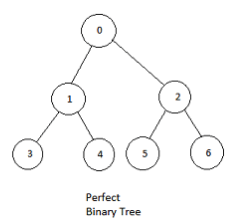
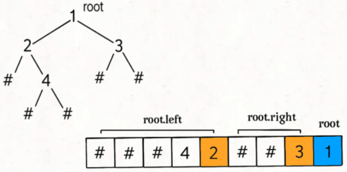
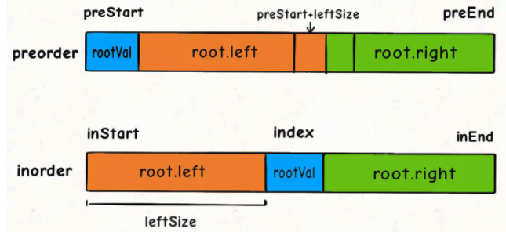

# Binary Tree 二叉树

[toc]

------

## 基础二叉树算法

#### 普通二叉树的节点总数 O(N)

```java
public static int count(TreeNode root){
		if (root == null) 
      	return 0;
  	return 1 + count(root.left) + count(root.right);
}
```

#### 满二叉树的节点总数O(logN)



```java
public int countNodes(TreeNode root) {
  	if(root==null){
      return 0;
    }
    int h = 1;
    // 计算树的高度
    while (root.left != null) {//满二叉树，只要计算left即可
        root = root.left;
        h++;
    }
    // 节点总数就是 2^h - 1
    return (int)Math.pow(2, h) - 1;
}
```

## [LC222. 完全二叉树的节点个数](https://leetcode-cn.com/problems/count-complete-tree-nodes/) O(logN*logN)

完全二叉树 的定义如下：在完全二叉树中，除了**最底层节点可能没填满**外，其余每层节点数都达到最大值，并且最下面一层的节点都集中在该层最左边的若干位置。若最底层为第 h 层，则该层包含 1~ 2h 个节点。

示例 1：


输入：root = [1,2,3,4,5,6]
输出：6
示例 2：

输入：root = []
输出：0
示例 3：

输入：root = [1]
输出：1

函数签名：

```java
public int countNodes(TreeNode root)
```

### <u>**思路**</u>


结合**满二叉树**和**普通二叉树**的节点数计算方法，递归的：

1、root的左右子树中一定会有一棵满二叉树，先用满二叉树的方法计算

2、后用普通二叉树的方法计算完全二叉树（下一个递归中root的左右子树也一定会有一颗满二叉树）

### <u>**Solution**</u>

```java
		public int countNodes(TreeNode root) {
        if(root==null)
            return 0;

        //root的左右子树一定会有一棵满二叉树
        //满二叉树的节点计算方法
        TreeNode l = root;
        TreeNode r = root;
        int hl = 1;
        int hr = 1;
        while(l.left!=null){
            l = l.left;
            hl += 1;
        }
        while(r.right!=null){
            r = r.right;
            hr += 1;
        }
        if(hl==hr){
            //满二叉树的节点总数就是 2^h - 1
            //Math.pow返回double类型
            return (int)Math.pow(2, hl) - 1;
        }

        //普通二叉树的节点计算方法
        //这两个递归只有一个会真的递归下去，另一个一定会触发 hl == hr (因为是满二叉树)而立即返回，不会递归下去。
        return 1 + countNodes(root.left) + countNodes(root.right);
    }
```

由于完全二叉树的性质，其子树一定有一棵是满的，所以一定会触发 `hl == hr`，只消耗 O(logN) 的复杂度而不会继续递归。

综上，算法的递归深度就是树的高度 O(logN)，每次递归所花费的时间就是 while 循环，需要 O(logN)，所以总体的时间复杂度是 O(logN*logN)。

## 二叉树的遍历

```java
public ArrayList<Integer> preorderTraversalByRecursive (TreeNode root) {
    // write code here
    ArrayList<Integer> result = new ArrayList<Integer>();
    Traverse using one of the three below;
  	//preTra(root, result);
  	//inTra(root, result);
  	//postTra(root, result);
    return result;
}
```

### 前序遍历 preorder traverse(顺序：1root 2left 3right)

前序遍历可以实现**二叉树的序列化与反序列化**（LC297）


递归

```java
public void preTra (TreeNode node, ArrayList<Integer> res){
    if(node==null)
        return;
    res.add(node.val);
    preTra(node.left,res);
    preTra(node.right,res);
}
```

迭代

```java
public void inTra(TreeNode node, ArrayList<Integer> res){
    Stack<TreeNode> stack=new Stack<TreeNode>();
    stack.push(root);
    while(!stack.isEmpty()){
        TreeNode temp=stack.pop();
        res.add(temp.val);
      	//栈先进后出，先右再左
        if(temp.right!=null){
          	stack.push(temp.right);
        }
        if(temp.left!=null){
          	stack.push(temp.left);
        }
    }
}
```


### 中序遍历 inorder traverse (顺序：1left 2root 3right)

递归

```java
public void inTra(TreeNode node, ArrayList<Integer> res){
    if(node==null)
        return;
    inTra(node.left, res);
    res.add(node.val);
    inTra(node.right, res);
}
```

迭代

```java
public void inTra(TreeNode node, ArrayList<Integer> res){
    Stack<TreeNode> stack = new Stack<TreeNode>();	 
    while(!stack.isEmpty() || root!=null){
        while(root!=null){
            stack.push(root);
            root=root.left;
        }
        if(!stack.isEmpty()){
            root=stack.pop();
            res.add(root.val);
            root=root.right;
        }
    }
}
```


### 后序遍历 postorder traverse (顺序：1left 2right 3root)

**如果当前节点要做的事情需要通过左右子树的计算结果推导出来，就要用到后序遍历**。



递归

```java
public void postTra(TreeNode node, ArrayList<Integer> res){
    if(node==null)
        return;
    postTra(node.left, res);
    postTra(node.right, res);
  	res.add(node.val);
}
```

迭代

```java
public void postorder(TreeNode root, ArrayList<Integer> list) {
    Stack<TreeNode> stack = new Stack<>();
    stack.push(root);
    while (!stack.isEmpty()) {
        TreeNode curr = stack.pop();
        list.add(0, curr.val);//前序遍历加到队尾,后序遍历加至队首
        if(curr.left != null) {//前序遍历先加right, 后序遍历先加left
          stack.push(curr.left);
        }
        if(curr.right != null) {
           stack.push(curr.right);
        }
    }
}
```


### [层序遍历level order traverse剑指 Offer 32 - I. 从上到下打印二叉树](https://leetcode-cn.com/problems/cong-shang-dao-xia-da-yin-er-cha-shu-lcof/)

从上到下打印出二叉树的每个节点，同一层的节点按照从左到右的顺序打印。

例如:
给定二叉树: `[3,9,20,null,null,15,7]`,

```
    3
   / \
  9  20
    /  \
   15   7
```

返回：

```
[3,9,20,15,7]
```

 函数签名

```java
public int[] levelOrder(TreeNode root);
```

#### Solution

借助队列，通过BFS来实现：

- 特例处理： 当树的根节点为空，则直接返回空列表 [] ；
- 初始化： 打印结果列表 res = [] ，包含根节点的队列 **queue = [root]** ；
- BFS 循环： 当队列 queue 为空时跳出；
    - 出队： 队首元素出队，记为 node；
    - 打印： 将 node.val 添加至列表 tmp 尾部；
    - 添加子节点： 若 node 的左（右）子节点不为空，则将左（右）子节点加入队列 queue ；
- 返回值： 返回打印结果列表 res 即可。

```java
public int[] levelOrder(TreeNode root) {
        ArrayList<Integer> res = new ArrayList<>();
        Queue<TreeNode> queue = new LinkedList<>();
        if(root!=null)
            queue.add(root);
        else
            return new int[0];

        while(!queue.isEmpty()){
            TreeNode node = queue.poll();
            res.add(node.val);
            if(node.left!=null)
                queue.add(node.left);
            if(node.right!=null)
                queue.add(node.right);
        }

        int[] ret = new int[res.size()];
        for(int i=0; i<ret.length; i++)
            ret[i] = res.get(i);
        return ret;
    }
```

时间复杂度 O(N) ： N 为二叉树的节点数量，即 BFS 需循环 N 次。
空间复杂度 O(N) ： 最差情况下，即当树为平衡二叉树时，最多有 N/2 个树节点同时在 queue 中，使用 O(N) 大小的额外空间。

### [层序遍历level order traverse剑指 Offer 32 - II. 从上到下打印二叉树 II](https://leetcode-cn.com/problems/cong-shang-dao-xia-da-yin-er-cha-shu-ii-lcof/solution/mian-shi-ti-32-ii-cong-shang-dao-xia-da-yin-er-c-5/) 额外要求 **每一层打印到一行** 


从上到下按层打印二叉树，同一层的节点按从左到右的顺序打印，每一层打印到一行。

例如:
给定二叉树: `[3,9,20,null,null,15,7]`,

```
    3
   / \
  9  20
    /  \
   15   7
```

返回其层次遍历结果：

```
[
  [3],
  [9,20],
  [15,7]
]
```

函数签名：

```java
public List<List<Integer>> levelOrder(TreeNode root);	
```

#### Solution

比上一题多的就是，每一层都需将queue中的元素全部poll出去(poll的元素个数应该为上一层queue的size)

```java
public List<List<Integer>> levelOrder(TreeNode root) {
        List<List<Integer>> res = new ArrayList<>();
        Queue<TreeNode> queue = new LinkedList<>();
        if(root!=null)
            queue.add(root);
        while(queue.size()>0){
            List<Integer> subRes = new ArrayList<>();
            for(int i=queue.size(); i>0; i--){//i为上一层的元素总数
                TreeNode node = queue.poll();
                subRes.add(node.val);
                if(node.left!=null)
                    queue.add(node.left);
                if(node.right!=null)
                    queue.add(node.right);
            }
            res.add(subRes);
        }
        return res;
    }
```

时间复杂度 O(N) ： N 为二叉树的节点数量，即 BFS 需循环 N 次。
空间复杂度 O(N) ： 最差情况下，即当树为平衡二叉树时，最多有 N/2 个树节点同时在 queue 中，使用 O(N) 大小的额外空间。

### [剑指 Offer 32 - III. 从上到下打印二叉树 III 额外要求打印顺序交替变化](https://leetcode-cn.com/problems/cong-shang-dao-xia-da-yin-er-cha-shu-iii-lcof/)

请实现一个函数按照之字形顺序打印二叉树，即第一行按照从左到右的顺序打印，第二层按照从右到左的顺序打印，第三行再按照从左到右的顺序打印，其他行以此类推。

例如:
给定二叉树: `[3,9,20,null,null,15,7]`,

```
    3
   / \
  9  20
    /  \
   15   7
```

返回其层次遍历结果：

```
[
  [3],
  [20,9],
  [15,7]
]
```

函数签名

```java
public List<List<Integer>> levelOrder(TreeNode root);
```

#### Solution

subRes使用双端队列(LinkedList)，当res的size为偶数时，这一层的元素顺序插入subRes，即addLast()；反之亦然

```java
public List<List<Integer>> levelOrder(TreeNode root) {
        List<List<Integer>> res = new ArrayList<>();
        Queue<TreeNode> queue = new LinkedList<>();
        if(root!=null)
            queue.add(root);
        while(queue.size()>0){
            //这里前面的类型如果为List，则无法使用addLast方法；
            //如果为Deque，可以使用addLast方法，但无法加入res
            LinkedList<Integer> subRes = new LinkedList<>();
            if(res.size()%2==0){
                for(int i=queue.size(); i>0; i--){//i为上一层的元素总数
                TreeNode node = queue.poll();
                subRes.addLast(node.val);//加至队尾
                if(node.left!=null)
                    queue.add(node.left);
                if(node.right!=null)
                    queue.add(node.right);
                }
            } else {
                for(int i=queue.size(); i>0; i--){//i为上一层的元素总数
                TreeNode node = queue.poll();
                subRes.addFirst(node.val);//加至队首
                if(node.left!=null)
                    queue.add(node.left);
                if(node.right!=null)
                    queue.add(node.right);
                }
            }
            res.add(subRes);
        }
        return res;
    }
```

时间复杂度 O(N) ： N 为二叉树的节点数量，即 BFS 需循环 N 次。
空间复杂度 O(N) ： 最差情况下，即当树为平衡二叉树时，最多有 N/2 个树节点同时在 deque(双端列表LinkedList) 中，使用 O(N) 大小的额外空间。

## [LC297. 二叉树的序列化与反序列化(包含null值)](https://leetcode-cn.com/problems/serialize-and-deserialize-binary-tree/)

序列化是将一个数据结构或者对象转换为连续的比特位的操作，进而可以将转换后的数据存储在一个文件或者内存中，同时也可以通过网络传输到另一个计算机环境，采取相反方式重构得到原数据。

请设计一个算法来实现二叉树的序列化与反序列化。这里不限定你的序列 / 反序列化算法执行逻辑，你只需要保证一个二叉树可以被序列化为一个字符串并且将这个字符串反序列化为原始的树结构。

函数签名：

```java
		// 把一棵二叉树序列化成字符串
    public String serialize(TreeNode root) {}

    // 把字符串反序列化成二叉树
    public TreeNode deserialize(String data) {}
```


### <u>**思路**</u>

通过前序遍历与后序遍历实现，必须记录空指针信息

详情：

https://labuladong.gitbook.io/algo/mu-lu-ye-1/mu-lu-ye-1/er-cha-shu-de-xu-lie-hua

我的做法是通过后序遍历实现：


### <u>**Solution**</u>

```java
		//后序遍历实现

    // Encodes a tree to a single string.
    StringBuilder sb = new StringBuilder();
    public String serialize(TreeNode root) {
        serializeTraverse(root);
        return sb.toString();
    }
    public void serializeTraverse(TreeNode root){
        if(root==null){
            sb.append("#").append(",");
            return;
        }
        //后序遍历
        serializeTraverse(root.left);
        serializeTraverse(root.right);
        sb.append(root.val).append(",");
        return;
    }

    // Decodes your encoded data to tree.
    public TreeNode deserialize(String data) {
        //这里也可用ArrayList，因为两种List在列表末尾增加一个元素所花的开销都是固定的
        //用LinkedList是因为它有removeLast()方法，ArrayList则需要remove(nodes.size())
        LinkedList<Integer> nodes = new LinkedList<>();
        for(String val: data.split(",")){
            if(val.equals("#")){
                //Null的情况
                nodes.addLast(Integer.MIN_VALUE);
            } else{
                nodes.addLast(Integer.parseInt(val));
            }  
        }
        return deserializeBuild(nodes);
    }
    public TreeNode deserializeBuild(LinkedList<Integer> nodes){
        if(nodes.isEmpty())
            return null;
        // 列表最右侧是根节点
        Integer val = nodes.removeLast();
        if(val==Integer.MIN_VALUE)
            return null;
        TreeNode root = new TreeNode(val);
      	//这里是先right再left，因为后序遍历是从后往前的顺序
        root.right = deserializeBuild(nodes);
        root.left = deserializeBuild(nodes);
        return root;
    }
```

## [LC105. 从前序与中序遍历序列构造二叉树(不包含null值)](https://leetcode-cn.com/problems/construct-binary-tree-from-preorder-and-inorder-traversal/)

根据一棵树的前序遍历与中序遍历构造二叉树。

注意:
你可以假设树中没有重复的元素。

例如，给出

前序遍历 preorder = [3,9,20,15,7]
中序遍历 inorder = [9,3,15,20,7]
返回如下的二叉树：

```wiki
 3
/ \
9  20
	/  \
 15   7
```

函数签名：

```JAVA
TreeNode buildTree(int[] inorder, int[] postorder)
```

### <u>**思路**</u>：递归construct root

root值为preorder[preStart] = **inorder[i]** (遍历inorder[]可找到root的值在inorder[]中的位置i)

root.left的元素总数：leftSize = i-inStart

root.left 在preorder中的位置为preorder[preStart+1, preStart+leftSize]

root.left 在inorder中的位置为inorder[inStart, inStart+leftSize-1]

root.right 在preorder中的位置为preorder[preStart+1+leftSize, preEnd ]

root.right 在inorder中的位置为inorder[inStart+leftSize+1, inEnd]



### <u>**Solution**</u>

```Java
public TreeNode buildTree(int[] preorder, int[] inorder) {
         return build(preorder, 0, preorder.length-1,
                    inorder, 0, inorder.length-1);
    }
    public TreeNode build(int[] preorder, int preStart, int preEnd,
                        int[] inorder, int inStart, int inEnd){
        //base case
        if(!(preStart<=preEnd) || !(inStart<=inEnd))
            return null;

        int leftSize = 0; //root.left的元素总数
        //遍历inorder[]，找root的值在inorder中的位置来确定左子树的长度leftSize
        for(int i=inStart; i<=inEnd; i++){
            if(inorder[i]==preorder[preStart]){//root的值为preOrder[start]
                leftSize = i-inStart;//左子树的元素个数，比如[0,1,2] 2为root的值，左子树元素个数就是2
                break;
            }
        }

        //构造左右子树
        TreeNode root = new TreeNode(preorder[preStart]);
        root.left = build(preorder, preStart+1, preStart+leftSize,
                        inorder, inStart, inStart+leftSize-1);
        root.right = build(preorder, preStart+leftSize+1, preEnd,
                        inorder, inStart+leftSize+1, inEnd);
        return root;
    }
```


## [LC106. 从中序与后序遍历序列构造二叉树(不包含null值)](https://leetcode-cn.com/problems/construct-binary-tree-from-inorder-and-postorder-traversal/)

根据一棵树的中序遍历与后序遍历构造二叉树。

注意:
你可以假设树中没有重复的元素。

例如，给出

中序遍历 inorder = [9,3,15,20,7]
后序遍历 postorder = [9,15,7,20,3]

返回如下的二叉树：

```wiki
 3
/ \
9  20
	/  \
 15   7
```

函数签名：

```JAVA
TreeNode buildTree(int[] inorder, int[] postorder)
```


### <u>**思路**</u>


### <u>**Solution**</u>

```Java
public TreeNode buildTree(int[] inorder, int[] postorder) {
  	return build(postorder, 0, postorder.length-1,
                    inorder, 0, inorder.length-1);
}
public TreeNode build(int[] postorder, int postStart, int postEnd,
                      int[] inorder, int inStart, int inEnd){
    if (!(postStart <= postEnd))
      return null;

    int rootVal = postorder[postEnd];
    int rootValInIdx = -1;
    for (int i=inStart; i<=inEnd; i++){
        if (inorder[i]==rootVal){
          rootValInIdx = i;
          break;
        }
    }

    int leftSize = rootValInIdx - inStart;

    TreeNode root = new TreeNode(rootVal);
    root.left = build(postorder, postStart, postStart+leftSize-1,
                      inorder, inStart, rootValInIdx-1);
    root.right = build(postorder, postStart+leftSize, postEnd-1,
                       inorder, rootValInIdx+1, inEnd);
    return root;
}
```

## [LC111. 二叉树的最小深度](https://leetcode-cn.com/problems/minimum-depth-of-binary-tree/)

给定一个二叉树，找出其最小深度。

最小深度是从根节点到最近叶子节点的最短路径上的节点数量。

**说明：**叶子节点是指没有子节点的节点。 

**示例 1：**


```
输入：root = [3,9,20,null,null,15,7]
输出：2
```

**示例 2：**

```
输入：root = [2,null,3,null,4,null,5,null,6]
输出：5
```

函数签名：

```Java
public int minDepth(TreeNode root);
```

### Solution：DFS

base case是当前节点为null 返回0

结束条件是当前节点是叶子结点，即**`root.left==null && root.right==null`**，返回1

左右子树都不为null则递归计算深度并取最小的；

左右子树有一个为null则取非null的子树深度

```java
public int minDepth(TreeNode root) {
        if(root==null)//没有深度，basecase，0
            return 0;
        //结束条件，叶子结点的左子树右子树都为空
        if(root.left==null && root.right==null)
            return 1;
        //左右子树都不为null则递归计算深度并取最小的
        if(root.right!=null && root.left!=null)
            return 1+Math.min(minDepth(root.left), minDepth(root.right));
        //左右子树有一个为null则取非null的子树深度
        return root.left==null? 1+minDepth(root.right): 1+minDepth(root.left);
    }
```

### Solution：BFS

结束条件：当前节点是叶子结点，即root.left==null&&root.right==null

```java
public int minDepth(TreeNode root) {
        if(root==null) return 0;
        //visited可省略，因为二叉树无法走回头路，只有left和right
        Queue<TreeNode> q = new LinkedList<>();
        q.offer(root);
        int depth = 1;//本身root也算深度1

        while(!q.isEmpty()){
            //将queue中的所有元素拿出来，他们都属于这一步可以到达的范围
            int size = q.size();
            for(int i=0; i<size; i++){//这里不能用!q.isEmpty()，因为q会扩大
                TreeNode curr = q.poll();
                //判断是否结束
                if(curr.left==null && curr.right==null){
                    return depth;
                }
                //下一步的可选路径加入queue
                if(curr.left!=null){
                    q.offer(curr.left);
                }
                if(curr.right!=null){
                    q.offer(curr.right);
                }
            }
            depth++;
        }
        return depth;
    }
```

### DFS vs BFS

BFS 的逻辑，`depth` 每增加一次，队列中的所有节点都向前迈一步，这保证了第一次到达终点的时候，走的步数是最少的。

DFS 不能找最短路径吗？其实也是可以的，但是时间复杂度相对高很多。你想啊，DFS 实际上是靠递归的堆栈记录走过的路径，你要找到最短路径，肯定得把二叉树中所有树杈都探索完才能对比出最短的路径有多长对不对？而 BFS 借助队列做到一次一步「齐头并进」，是可以在不遍历完整棵树的条件下找到最短距离的。

BFS 可以找到最短距离，但是空间复杂度高，而 DFS 的空间复杂度较低。

还是拿刚才我们处理二叉树问题的例子，假设给你的这个二叉树是满二叉树，节点数为 `N`，对于 DFS 算法来说，空间复杂度无非就是递归堆栈，最坏情况下顶多就是树的高度，也就是 `O(logN)`。

但是你想想 BFS 算法，队列中每次都会储存着二叉树一层的节点，这样的话最坏情况下空间复杂度应该是树的最底层节点的数量，也就是 `N/2`，用 Big O 表示的话也就是 `O(N)`。

## [LC104.二叉树的最大深度](https://leetcode-cn.com/problems/maximum-depth-of-binary-tree/)

```wiki
给定二叉树 [3,9,20,null,null,15,7]，
		3
   / \
  9  20
    /  \
   15   7
返回它的最大深度 3 
```

### <u>**Solution**</u>:

```java
public static int maxDepth(TreeNode root){
  	if (root == null) 
      	return 0;
  	return Math.max(maxDepth(root.left), maxDepth(root.right)) + 1;
}
```

## [剑指 Offer 55 - II. 平衡二叉树](https://leetcode-cn.com/problems/ping-heng-er-cha-shu-lcof/)

输入一棵二叉树的根节点，判断该树是不是平衡二叉树。如果某二叉树中任意节点的左右子树的深度相差不超过1，那么它就是一棵平衡二叉树。

**示例 1:**

给定二叉树 `[3,9,20,null,null,15,7]`

```
    3
   / \
  9  20
    /  \
   15   7
```

返回 `true` 。

**示例 2:**

给定二叉树 `[1,2,2,3,3,null,null,4,4]`

```
       1
      / \
     2   2
    / \
   3   3
  / \
 4   4
```

返回 `false` 。

函数签名

```java
public boolean isBalanced(TreeNode root);
```

### Solution

后序遍历判断

```java
public boolean isBalanced(TreeNode root) {
        return height(root)!=-100;//-100表示不平衡
    }
    private int height(TreeNode root){
        if(root==null) return 0;

        int leftHeight = height(root.left);
        int rightHeight = height(root.right);
        //后序遍历位置
        if(leftHeight==-100 || rightHeight==-100 ||
            Math.abs(leftHeight-rightHeight)>1)
            return -100;//左或右子树不平衡，或左右子树高度相差超过1；
        return 1+Math.max(leftHeight, rightHeight);
    }
```


##  [LC226.翻转二叉树](https://leetcode-cn.com/problems/invert-binary-tree/)

```wiki
翻转一棵二叉树。

示例：

输入：
     4
   /   \
  2     7
 / \   / \
1   3 6   9
输出：
     4
   /   \
  7     2
 / \   / \
9   6 3   1

```

### <u>**Solution:**</u>

```java
public static TreeNode invertTree(TreeNode root) {
    if (root == null) 
      	return null;
  
		//交换左右子节点
    TreeNode tmp = root.left;
    root.left = root.right;
    root.right = tmp;
		//让左右子节点继续翻转他们的子节点
    invertTree(root.left);
    invertTree(root.right);

    return root;
    }
```

## [剑指 Offer 28. 对称的二叉树](https://leetcode-cn.com/problems/dui-cheng-de-er-cha-shu-lcof/)

请实现一个函数，用来判断一棵二叉树是不是对称的。如果一棵二叉树和它的镜像一样，那么它是对称的。

例如，二叉树 [1,2,2,3,4,4,3] 是对称的。

```
			 1  
		  / \ 
		2     2 
	 / \   / \
	3   4 4   3
```

但是下面这个 [1,2,2,null,3,null,3] 则不是镜像对称的:

```
  			1  
  		 / \
      2   2 
      \    \ 
       3    3 
```

**示例 1：**

```
输入：root = [1,2,2,3,4,4,3]
输出：true
```

**示例 2：**

```
输入：root = [1,2,2,null,3,null,3]
输出：false
```

函数签名：

```java
public boolean isSymmetric(TreeNode root);
```

### 思路

对称二叉树定义： 对于树中 任意两个对称节点 L 和 R ，一定有：

- L.val = R.val ：即此两对称节点值相等；
- L.left.val = R.right.val：即 L 的 左子节点 和 R 的 右子节点 对称；
- L.right.val = R.left.val：即 L 的 右子节点 和 R 的 左子节点 对称。

### Solution

```java
public boolean isSymmetric(TreeNode root) {
        if(root==null)
            return true;
        return isSymmetric(root.left, root.right);
    }
    public boolean isSymmetric(TreeNode l, TreeNode r){
        //base case
        if(l==null && r==null)
            return true;

        if(l==null || r==null)
            return false;

        if(l.val==r.val)
            return isSymmetric(l.left, r.right) && isSymmetric(l.right, r.left);//!!!!!
        else 
            return false;
    }
```

## [剑指 Offer 34. 二叉树中和为某一值的路径](https://leetcode-cn.com/problems/er-cha-shu-zhong-he-wei-mou-yi-zhi-de-lu-jing-lcof/)

输入一棵二叉树和一个整数，打印出二叉树中节点值的和为输入整数的所有**路径**。

**路径：从树的<u>根节点</u>开始往下一直到<u>叶子节点</u>所经过的节点形成一条路径。**

**示例:**
给定如下二叉树，以及目标和 `target = 22`，

```
              5
             / \
            4   8
           /   / \
          11  13  4
         /  \    / \
        7    2  5   1
```

返回:

```
[
   [5,4,11,2],
   [5,8,4,5]
]
```

 函数签名：

```java
public List<List<Integer>> pathSum(TreeNode root, int target);
```

### Solution：递归回溯（类似前序遍历？）

```java
List<List<Integer>> res = new ArrayList<>();
    public List<List<Integer>> pathSum(TreeNode root, int target) {
        backtrack(root, target, new ArrayList<>());
        return res;
    }
    public void backtrack(TreeNode root, int target, List<Integer> path){
        //base case 叶子结点
        if(root==null)
            return;

        path.add(root.val);//做选择
        target -= root.val;

        if(target==0 && root.left==null && root.right==null)
            res.add(new ArrayList(path));//不能return，如果提前return会导致后面的remove没有执行，影响回溯
        
        backtrack(root.left, target, path);
        backtrack(root.right, target, path);
        path.remove(path.size()-1);//撤销选择
    }
```

时间复杂度 O(N) ： N 为二叉树的节点数，先序遍历需要遍历所有节点。
空间复杂度 O(N) ： 最差情况下，即树退化为链表时，path 存储所有树节点，使用 O(N) 额外空间。

## [LC116.填充每个节点的下一个右侧节点指针](https://leetcode-cn.com/problems/populating-next-right-pointers-in-each-node/)

给定一个 **<u>完美二叉树</u>** ，其所有叶子节点都在同一层，每个父节点都有两个子节点。二叉树定义如下：

```java
class Node {
    int val;
    Node *left;
    Node *right;
    Node *next;
}
```

填充它的每个 next 指针，让这个指针指向其下一个右侧节点。如果找不到下一个右侧节点，则将 next 指针设置为 NULL。

初始状态下，所有 next 指针都被设置为 NULL。

进阶：

你只能使用常量级额外空间。
使用递归解题也符合要求，本题中递归程序占用的栈空间不算做额外的空间复杂度。

示例：

输入：root = [1,2,3,4,5,6,7]
输出：[1,#,2,3,#,4,5,6,7,#]
解释：给定二叉树如图 A 所示，你的函数应该填充它的每个 next 指针，以指向其下一个右侧节点，如图 B 所示。序列化的输出按层序遍历排列，同一层节点由 next 指针连接，'#' 标志着每一层的结束。

### <u>**Solution**</u>:

```java
public static Node connect(Node root) {
    if (root == null) 
      	return null;
    connectTwoNodes(root.left, root.right);
    return root;
    }
public static void connectTwoNodes(Node leftNode, Node rightNode) {
    if (leftNode == null || rightNode == null) 
      	return;
		//连接两个传入节点
    leftNode.next = rightNode;
		//连接 两个传入节点 的 两个子节点
    connectTwoNodes(leftNode.left, leftNode.right);
    connectTwoNodes(rightNode.left, rightNode.right);
		//连接跨越父节点的两个子节点: 2->3, 5->6
    connectTwoNodes(leftNode.right, rightNode.left);
}
```

## [LC114. 二叉树展开为链表](https://leetcode-cn.com/problems/flatten-binary-tree-to-linked-list/)

给你二叉树的根结点 root ，请你将它展开为一个单链表：

展开后的单链表应该同样使用 TreeNode ，其中 right 子指针指向链表中下一个结点，而左子指针始终为 null 。
展开后的单链表应该与二叉树 先序遍历 顺序相同。

示例 1：

输入：root = [1,2,5,3,4,null,6]
输出：[1,null,2,null,3,null,4,null,5,null,6]

示例 2：

输入：root = []
输出：[]

示例 3：

输入：root = [0]
输出：[0]

### <u>**思路**</u>

1、将 `root` 的左子树和右子树拉平

2、将 `root` 的右子树接到左子树下方

3、然后将整个左子树作为右子树


### <u>**Solution**</u>

```java
public static void flatten(TreeNode root) {
    if (root == null) 
      	return;
    flatten(root.left);
    flatten(root.right);

    //记录原始的右子节点
    TreeNode originRight = root.right;

    //将左子树作为右子数，左子树置为空
    root.right = root.left;
    root.left = null;

    //将原先的右子树接到当前右子树末端
    while (root.right != null){
        root = root.right;
    }
    root.right = originRight;
}
```
## [LC654. 最大二叉树](https://leetcode-cn.com/problems/maximum-binary-tree/)

给定一个不含重复元素的整数数组 nums 。一个以此数组直接递归构建的 最大二叉树 定义如下：

​		1、二叉树的根是数组 nums 中的最大元素。
​		2、左子树是通过数组中 最大值左边部分 递归构造出的最大二叉树。
​		3、右子树是通过数组中 最大值右边部分 递归构造出的最大二叉树。

返回有给定数组 nums 构建的 最大二叉树 。

示例：

输入：nums = [3,2,1,6,0,5]
输出：[6,3,5,null,2,0,null,null,1]


解释：递归调用如下所示：

- [3,2,1,6,0,5] 中的最大值是 6 ，左边部分是 [3,2,1] ，右边部分是 [0,5] 。
    - [3,2,1] 中的最大值是 3 ，左边部分是 [] ，右边部分是 [2,1] 。
        - 空数组，无子节点。
        - [2,1] 中的最大值是 2 ，左边部分是 [] ，右边部分是 [1] 。
            - 空数组，无子节点。
            - 只有一个元素，所以子节点是一个值为 1 的节点。
    - [0,5] 中的最大值是 5 ，左边部分是 [0] ，右边部分是 [] 。
        - 只有一个元素，所以子节点是一个值为 0 的节点。
        - 空数组，无子节点。

### <u>**思路**</u>

遍历数组找到最大值 `maxVal`及其索引，把根节点 `root` 做出来，然后对 `maxVal` 左边的数组和右边的数组 进行递归调用 构造 `root` 的左右子树。

```Java
TreeNode constructMaximumBinaryTree(int[] nums) {
    // 找到数组中的最大值nums[maxValIdx]
    TreeNode root = new TreeNode(nums[maxValIdx]);
    // 递归调用构造左右子树
    root.left = constructMaximumBinaryTree(nums[0, maxValIdx-1]);
    root.right = constructMaximumBinaryTree(nums[maxValIdx+1, nums.length-1]);
    return root;
}
```

### <u>**Solution**</u>

```java
public TreeNode constructMaximumBinaryTree(int[] nums) {
        return build(nums, 0, nums.length-1); 
}

public TreeNode build(int[] nums, int lo, int hi ){
    if (!(lo <= hi)) 
      return null;

    //找到数组中的最大value及其index
    int maxVal = Integer.MIN_VALUE;
    int maxValIdx = -1;
    for (int i=lo; i<=hi; i++){
        if (nums[i]>maxVal){
          maxVal = nums[i];
          maxValIdx = i;
        }
    }

    //构造树的根
    TreeNode root = new TreeNode(maxVal);
    //define树的左子树
    root.left = build(nums, lo, maxValIdx-1);
    //define树的右子树
    root.right = build(nums, maxValIdx+1, hi);

    return root;
}
```

## [**牛客JZ57，LC285(锁了)** **二叉树的下一个结点**](https://www.nowcoder.com/practice/9023a0c988684a53960365b889ceaf5e?tpId=13&tqId=11210&tPage=1&rp=1&ru=/ta/coding-interviews&qru=/ta/coding-interviews/question-ranking&from=cyc_github)

### 题目描述

给定一个二叉树其中的一个结点，请找出**中序遍历顺序的下一个结点**并且返回。注意，树中的结点不仅包含左右子结点，同时包含**指向父结点的next指针。**

示例:

输入:{8,6,10,5,7,9,11},8

返回:9

解析:这个组装传入的子树根节点，其实就是整颗树，中序遍历{5,6,7,8,9,10,11}，根节点8的下一个节点就是9，应该返回{9,10,11}，后台只打印子树的下一个节点，所以只会打印9，如下图，其实都有指向左右孩子的指针，还有指向父节点的指针，下图没有画出来


输入描述：

输入分为2段，第一段是整体的二叉树，第二段是给定二叉树节点的值，后台会将这2个参数组装为一个二叉树局部的子树传入到函数GetNext里面，用户得到的输入只有一个子树根节点

返回值描述：

返回传入的子树根节点的下一个节点，后台会打印输出这个节点

示例1

输入：

```
{8,6,10,5,7,9,11},8
```

返回值：

```
9
```

示例2

输入：

```
{8,6,10,5,7,9,11},6
```

返回值：

```
7
```

示例3

输入：

```
{1,2,#,#,3,#,4},4
```

返回值：

```
1
```

示例4

输入：

```
{5},5
```

返回值：

```
"null"
```

说明：

```
不存在，后台打印"null" 
```

函数签名：

```java
public TreeLinkNode GetNext(TreeLinkNode pNode);
```


### 思路

中序遍历的过程：先遍历树的左子树，再遍历根节点，最后再遍历右子树。


所以中序遍历的下一个节点（后继）应为：

- **节点的右子树不为空，那么该节点的下一个节点是右子树的最左节点；**

    

- **节点的右子树为空，向上找第一个 <u>左链接</u>指向的树 包含该节点 的 祖先节点。**

    

### Solution

```java
public TreeLinkNode GetNext(TreeLinkNode pNode) {
        if(pNode.right!=null){
            TreeLinkNode right = pNode.right;
            while(right.left!=null)
                right = right.left;
            return right;
        } else {
            while(pNode.next!=null){
                TreeLinkNode parent = pNode.next;//pNode的父节点
                if(pNode==parent.left)
                    return parent;
                pNode = parent;
            }
        }
        return null;
    }
```

## [剑指 Offer 26. 树的子结构](https://leetcode-cn.com/problems/shu-de-zi-jie-gou-lcof/)

输入两棵二叉树A和B，判断B是不是A的子结构。(约定空树不是任意一个树的子结构)

B是A的子结构， 即 A中有出现和B相同的结构和节点值。

例如:
给定的树 A:

```java
		3  
   / \  
  4   5
 / \ 
1   2
```

给定的树 B：

```java
		4  
	/ 
1
```


返回 true，因为 B 与 A 的一个子树拥有相同的结构和节点值。

**示例 1：**

```
输入：A = [1,2,3], B = [3,1]
输出：false
```

**示例 2：**

```
输入：A = [3,4,5,1,2], B = [4,1]
输出：true
```

函数签名：

```java
public boolean isSubStructure(TreeNode A, TreeNode B);
```

### 思路

若树 B 是树 A 的子结构，则子**结构的根节点**可能为树 A 的任意一个节点，所以要**先序遍历**A的每个节点，并判断以A的子节点为root的树是否与树B结构相同：

- 如果A、B的值相等，递归比较各自的左右子树是否相等
- 如果B为null，不管A是否为null, 则B已经没有子树，返回true
- 如果B不为null，A为null，则A已没有子树，但B有，返回false

### Solution

```java
public boolean isSubStructure(TreeNode A, TreeNode B) {
        if(A==null || B==null)
            return false;
        return isTheSameTree(A, B) ||
            isSubStructure(A.left, B) || isSubStructure(A.right, B);
    }

    public boolean isTheSameTree(TreeNode A, TreeNode B){
        if(B==null)
            return true;
        else if(A==null)//B不为null，A为null
            return false;
        
        //A、B都不为null
        if(A.val == B.val)
            return isTheSameTree(A.left, B.left) && isTheSameTree(A.right, B.right);
        else
            return false;
    }
```


## [LC652. 寻找重复的子树](https://leetcode-cn.com/problems/find-duplicate-subtrees/)

给定一棵二叉树，返回所有**重复的子树**。对于同一类的重复子树，你只需要返回其中任意一棵的根结点即可。

**两棵树重复**是指它们具有**相同的结构以及相同的结点值**。

示例 1：

```
    1
   / \
  2   3
 /   / \
4   2   4
   /
  4
```
下面是两个重复的子树：

```
  2
 /
4
```
和

```
4
```
因此，你需要以列表的形式返回上述重复子树的根结点。

函数签名如下：

```java
List<TreeNode> findDuplicateSubtrees(TreeNode root);
```

### <u>**思路**</u>

1、以我为根的这棵二叉树（子树）长啥样？

2、以其他节点为根的子树都长啥样？

3、对比子树们，并避免 重复添加 相同的子树 到结果List

### <u>**Solution**</u>

后序遍历找到root中每个节点的序列化,记录相同序列化的频次,为1时加入结果集,其他>1,<1时不加入结果集

```java
public List<TreeNode> findDuplicateSubtrees(TreeNode root) {
    //！！！注意list和hashmap的创建方式！
    List<TreeNode> res = new ArrayList<>();
    //存子树的样子及其出现频率
    Map<String, Integer> nodesFreq = new HashMap<>();
    postTraverse(root, res, nodesFreq);
    return res;
}

public String postTraverse(TreeNode root, List<TreeNode> res, Map<String, Integer> nodesFreq){
  	if (root == null)
      	return "#";
        
    String left = postTraverse(root.left, res, nodesFreq);
    String right = postTraverse(root.right, res, nodesFreq);
  	//后序遍历位置
    String subtree = root.val + "," + left + ","+ right;

    //此子树未出现过
    if (nodesFreq.get(subtree)==null){
      	nodesFreq.put(subtree, 1);
      	return subtree;
    }
  
    Integer freq = nodesFreq.get(subtree);
    if (freq==1){
    		//此子树只出现过一次，添加到结果集
    		res.add(root);
    		//更新此子树的出现频率为2（相当于replace方法）
    		nodesFreq.put(subtree, freq+1);
    } else {
    		//此子树出现超过一次，不添加到结果集
    		nodesFreq.put(subtree, freq+1);
    }
  
    return subtree;
}
```

## [LC236. 二叉树的最近公共祖先](https://leetcode-cn.com/problems/lowest-common-ancestor-of-a-binary-tree/)

给定一个二叉树, 找到该树中两个指定节点的最近公共祖先。

百度百科中**最近公共祖先**的定义为：“对于有根树 T 的两个节点 p、q，最近公共祖先表示为一个节点 x，满足 x 是 p、q 的祖先且 x 的深度尽可能大（一个节点也可以是它自己的祖先）。”


root = [3,5,1,6,2,0,8,null,null,7,4] 

示例 1：

输入： p = 5, q = 1
输出：3
解释：节点 5 和节点 1 的最近公共祖先是节点 3 。
示例 2：

输入：p = 5, q = 4
输出：5
解释：节点 5 和节点 4 的最近公共祖先是节点 5 。因为根据定义最近公共祖先节点可以为节点本身。

函数签名：

```java
public TreeNode lowestCommonAncestor(TreeNode root, TreeNode p, TreeNode q);
```

### <u>**思路**</u>

要先确定子树中是否含有p、q，再判断root是否含有p、q

很明显是自下而上的遍历过程：**`后序遍历`**

 **`base case: 判断root的状态`**

​	情况1，如果`root`为空，肯定得返回`null`；

​	情况2，如果`root`本身就是`p`或者`q`：

​		 - 比如说`root`就是`p`节点吧，如果`q`存在于以`root`为根的树中，显然`root`就是最近公共祖先；

​		 - 即使`q`不存在于以`root`为根的树中，也应该返回`root`节点(q)本身。

**`返回值:左右子树的情况`**

​	情况 1，如果`p`和`q`都**在**以`root`为根的树中，返回**root**

​	情况 2，如果`p`和`q`都**不在**以`root`为根的树中，返回**null**

​	情况 3，如果`p`和`q`只有一个存在于`root`为根的树中，函数返回该**非null**节点。

### <u>Solution</u>

```java
		public TreeNode lowestCommonAncestor(TreeNode root, TreeNode p, TreeNode q) {
        if(root==null)
            return null;
        //即使其中一点不存在于以`root`为根的树中，也应该返回`root`节点本身。
        if(root==p || root==q)
            return root;
        
        TreeNode left = lowestCommonAncestor(root.left, p, q);
        TreeNode right = lowestCommonAncestor(root.right, p, q);

        //后序遍历位置
        //情况 1，如果`p`和`q`都**在**以`root`为根的树中，返回**root**
        if(left!=null && right!=null)
            return root;
        //情况 2，如果`p`和`q`都**不在**以`root`为根的树中，返回**null**
        if(left==null && right==null)
            return null;
        //情况 3，返回不为空的那个子树
        return left!=null? left: right;
    }
```

