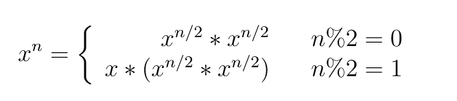
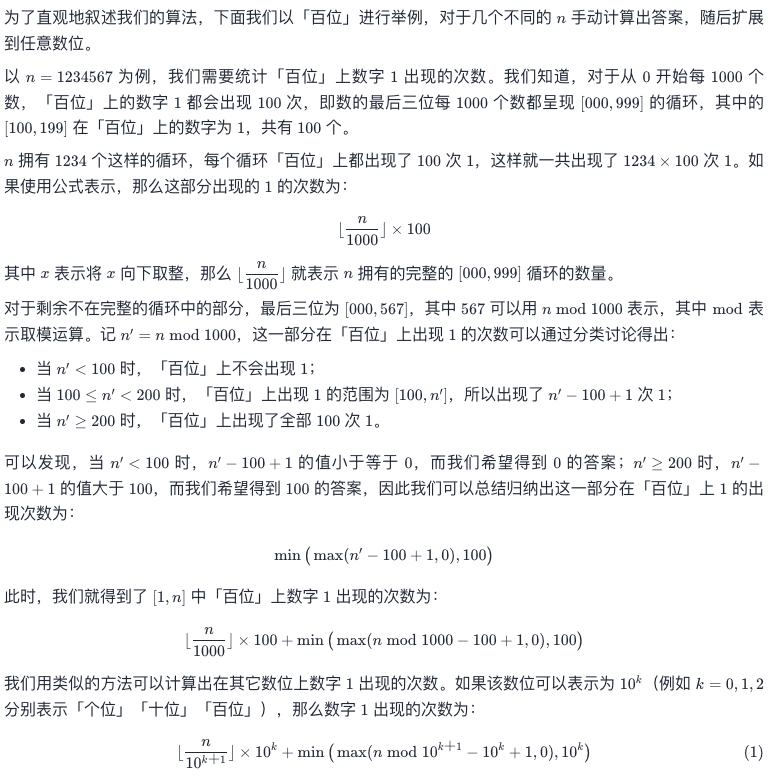

[toc]

# 分治思想

分治算法的基本思想是将一个规模为N的问题分解为K个规模较小的子问题，这些子问题相互独立且与原问题性质相同。求出子问题的解，就可得到原问题的解。

## [剑指 Offer 16. 数值的整数次方](https://leetcode-cn.com/problems/shu-zhi-de-zheng-shu-ci-fang-lcof/)

实现 [pow(*x*, *n*)](https://www.cplusplus.com/reference/valarray/pow/) ，即计算 x 的 n 次幂函数（即，xn）。不得使用库函数，同时不需要考虑大数问题。

**示例 1：**

```
输入：x = 2.00000, n = 10
输出：1024.00000
```

**示例 2：**

```
输入：x = 2.10000, n = 3
输出：9.26100
```

**示例 3：**

```
输入：x = 2.00000, n = -2
输出：0.25000
解释：2-2 = 1/22 = 1/4 = 0.25
```

 

**提示：**

- `-100.0 < x < 100.0`
- `-231 <= n <= 231-1`
- `-104 <= xn <= 104`

### Solution

```
最直观的解法是将 x 重复乘 n 次，x*x*x...*x，那么时间复杂度为 O(N)。因为乘法是可交换的，所以可以将上述操作拆开成两半 (x*x..*x)* (x*x..*x)，两半的计算是一样的，因此只需要计算一次。而且对于新拆开的计算，又可以继续拆开。这就是分治思想，将原问题的规模拆成多个规模较小的子问题，最后子问题的解合并起来。

本题中子问题是 x^(n/2)，在将子问题合并时将子问题的解乘于自身相乘即可。但如果 n 不为偶数，那么拆成两半还会剩下一个 x，在将子问题合并时还需要需要多乘于一个 x。
```



当n为负数时，可以计算|n|次方的结果res，返回1/res。

需要注意数组越界问题，int范围[-2147483648,2147483647]，int无法存储-2147483648的绝对值，用long存储，防止int越界。当计算n/2时转换回int

```java
public double myPow(double x, int n) {
        if(n==0) return 1;
        if(n==1) return x;
        boolean isNeg = false;
        //int范围[-2147483648,2147483647] 用long防止int越界
        long posN = n;
        if(posN<0){
            isNeg = true;
            posN = -posN;
        }
        
        double res = myPow(x,(int)(posN/2));
        res = res*res;
        if((int)(posN%2)==1)
            res = res * x;
        return isNeg? 1/res : res;
    }
```

每次递归 n 都减小一半，因此整个算法的时间复杂度从O(N)下降为 O(logN)。

## [剑指 Offer 43. 1～n 整数中 1 出现的次数](https://leetcode-cn.com/problems/1nzheng-shu-zhong-1chu-xian-de-ci-shu-lcof/)

输入一个整数 `n` ，求1～n这n个整数的十进制表示中1出现的次数。

例如，输入12，1～12这些整数中包含1 的数字有1、10、11和12，1一共出现了5次。

**示例 1：**

```
输入：n = 12
输出：5
```

**示例 2：**

```
输入：n = 13
输出：6
```

**限制：**

- `1 <= n < 2^31`

函数签名

```java
public int countDigitOne(int n);
```

### 思路



### Solution

```java
public int countDigitOne(int n) {
        long mulk = 1;//最后一个mulk为2^31*10会超过int的范围
        int ans = 0;
        while(n>=mulk){
            ans += 
                mulk * (n/(mulk*10)) +
                Math.min( 
                    Math.max(n%(mulk*10)-mulk+1, 0),
                    mulk
                );
                
            mulk *= 10; 
        }
        return ans;
    }
```

