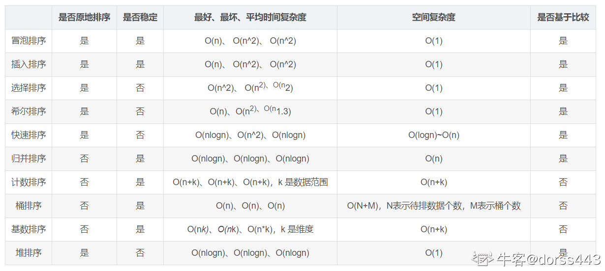
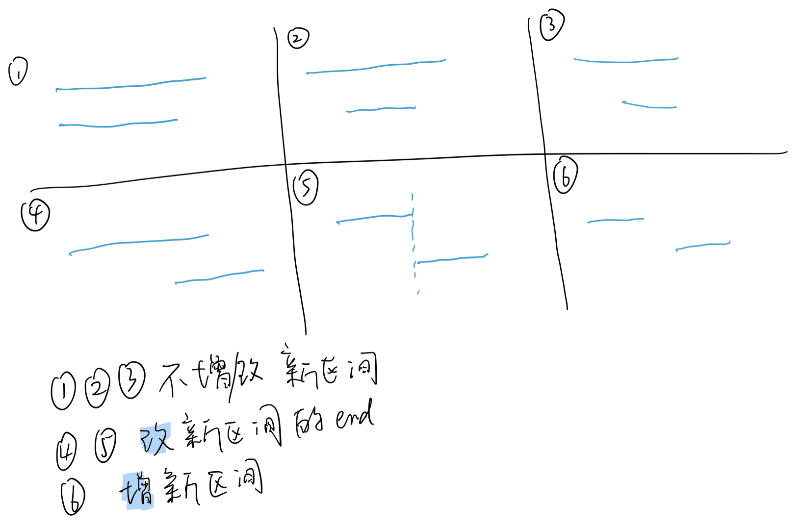

[toc]

# 排序



## 快速排序

1. 选择第一个数作为pivot，比pivot小的放左边，比pivot大的放右边。
2. 在左边的数里取第一个作为pivot..
   在右边的数里取第一个作为pivot..


```java
public static int[] quickSort(int[] arr, int left, int right) {
  	if (left < right) {
        //获取中轴元素所处的位置
        //            System.out.println("Pivot:"+arr[left]);
        int mid = partition(arr, left, right);
        //            System.out.println(Arrays.toString(arr));
        //进行分割
        arr = quickSort(arr, left, mid - 1);
        arr = quickSort(arr, mid + 1, right);
    }
    return arr;
}

private static int partition(int[] arr, int left, int right) {
    //选取中轴元素
    int pivot = arr[left];
    int i = left + 1;
    int j = right;
    while (true) {
        // i向右找到第一个大于 pivot 的元素位置
        while (i <= j && arr[i] <= pivot) i++;
        // j向左找到第一个小于 pivot 的元素位置
        while (i <= j && arr[j] >= pivot ) j--;
      	if (i >= j)
        		break;
      	//交换两个元素的位置, 使得左边的元素不大于pivot, 右边的元素不小于pivot
        int temp = arr[i];
        arr[i] = arr[j];
        arr[j] = temp;
    }
    arr[left] = arr[j];//跟j换的原因是j是从右向左的元素中第一个小于pivot的
    // 使中轴元素处于有序的位置
    arr[j] = pivot;
    return j;
}
```

时间复杂度：O(nlogn)
空间复杂度：O(logn)
非稳定排序
原地排序

## 归并排序

1. 通过递归的方式将大的数组一直分割，直到数组的大小为1，
2. 之后再把两个数组大小为1的合并成一个大小为2的，再把两个大小为2的合并成4的.....
    直到全部小的数组合并起来。

递归实现

```java
public static int[] recurMergeSort(int[] arr, int left, int right){

    if(left >= right)
     	 return arr;

    int mid = (right+left)/2;
    arr = recurMergeSort(arr, left, mid);
    arr = recurMergeSort(arr, mid+1, right);
    recurMerge(arr, left, mid, right);

    return arr;
}
public static void recurMerge(int[] arr, int left, int mid, int right){
  //+1是因为？？
    int[] temp = new int[right-left+1];
    int array1start = left;
    int array2start = mid+1;
    int i = 0;
    while(array1start<=mid && array2start<=right){
        if(arr[array1start]<arr[array2start]){
          	//i++和array1start++：先赋值，再+1
          	temp[i++] = arr[array1start++];
        } else{
          	temp[i++] = arr[array2start++];
        }
      }
    while(array1start<=mid) temp[i++]=arr[array1start++];
    while(array2start<=mid) temp[i++]=arr[array2start++];

    for(int a=0; a<i; a++){
      	arr[left++] = temp[a];
    }
}
```

迭代实现

```java
public static int[] iterMergeSort(int[] a) {
    // 子数组的大小分别为1，2，4，8...
    // 刚开始合并的数组大小是1，接着是2，接着4....
    for (int i = 1; i < a.length; i += i) {
        //进行数组进行划分
        int left = 0;
        int mid = left + i - 1;
        int right = mid + i;
        //进行合并，对数组大小为 i 的数组进行两两合并
        while (right < a.length) {
            // 合并函数和递归式的合并函数一样
            iterMerge(a, left, mid, right);
            left = right + 1;
            mid = left + i - 1;
            right = mid + i;
        }
        // 还有一些被遗漏的数组没合并，千万别忘了
        // 因为不可能每个字数组的大小都刚好为 i
        if (left < a.length && mid < a.length) {
            iterMerge(a, left, mid, a.length - 1);
        }
        System.out.println(Arrays.toString(a));

    }
    return a;
}

// 合并函数，把两个有序的数组合并起来
// arr[left..mif]表示一个数组，arr[mid+1 .. right]表示一个数组
private static void iterMerge(int[] a, int left, int mid, int right) {
    //先用一个临时数组把他们合并汇总起来
    int[] temp = new int[right - left + 1];
    int i = left;
    int j = mid + 1;
    int k = 0;
    while (i <= mid && j <= right) {
        if (a[i] < a[j]) {
            temp[k++] = a[i++];
        } else {
            temp[k++] = a[j++];
        }
    }
    while(i <= mid)
        temp[k++] = a[i++];
    while(j <= right)
        temp[k++] = a[j++];
    // 把临时数组复制到原数组
    for (i = 0; i < k; i++) {
        a[left++] = temp[i];
    }

```

时间复杂度：O(nlogn)

空间复杂度：O(1)

非稳定排序

原地排序

## 

# 区间问题

## [LC56. 合并区间 - 排序区间问题，非dp](https://leetcode-cn.com/problems/merge-intervals/)

以数组 `intervals` 表示若干个区间的集合，其中单个区间为 `intervals[i] = [starti, endi]` 。请你合并所有重叠的区间，并返回一个不重叠的区间数组，该数组需恰好覆盖输入中的所有区间。

 **示例 1：**

```
输入：intervals = [[1,3],[2,6],[8,10],[15,18]]
输出：[[1,6],[8,10],[15,18]]
解释：区间 [1,3] 和 [2,6] 重叠, 将它们合并为 [1,6].
```

**示例 2：**

```
输入：intervals = [[1,4],[4,5]]
输出：[[1,5]]
解释：区间 [1,4] 和 [4,5] 可被视为重叠区间。
```

**提示：**

- `1 <= intervals.length <= 104`
- `intervals[i].length == 2`
- `0 <= starti <= endi <= 104`

### Solution

按照区间开始值升序排序之后，可能的情况有：



- 当新区间的start小于等于旧区间的end时(情况12345) 需要合并，合并后的区间start不变，end取较大的那个(123取旧区间的end, 345取新区间的end)

- 当新区间的start大于旧区间的end时(情况6)，无需合并，直接添加整个新区间

```java
public int[][] merge(int[][] intervals) {
        Arrays.sort(intervals, (o1,o2)-> o1[0]!=o2[0]? o1[0]-o2[0]:o2[1]-o1[1]);
        int[][] res = new int[intervals.length][2];
        int idx = 0;
        res[0] = intervals[0];
        for(int i=1; i<intervals.length; i++){
            //改新区间的end
            if(intervals[i][0]<=res[idx][1] && intervals[i][1]>res[idx][1]){
                res[idx][1] = intervals[i][1];
            } else if(intervals[i][0]>res[idx][1]){//增加新区间
                res[idx+1] = intervals[i];
                idx++;
            }
        }
        //copyOf(int[] original, int newLength)
        return Arrays.copyOf(res,idx+1);
    }
```

## [LC57. 插入区间 - 非dp](https://leetcode-cn.com/problems/insert-interval/)

给你一个 **无重叠的** *，*按照区间起始端点排序的区间列表。

在列表中插入一个新的区间，你需要确保列表中的区间仍然有序且不重叠（如果有必要的话，可以合并区间）。

**示例 1：**

```
输入：intervals = [[1,3],[6,9]], newInterval = [2,5]
输出：[[1,5],[6,9]] 这里13和25合并成15
```

**示例 2：**

```
输入：intervals = [[1,2],[3,5],[6,7],[8,10],[12,16]], newInterval = [4,8]
输出：[[1,2],[3,10],[12,16]]
解释：这是因为新的区间 [4,8] 与 [3,5],[6,7],[8,10] 重叠。
```

提示：

0 <= intervals.length <= 104
intervals[i].length == 2
0 <= intervals[i][0] <= intervals[i][1] <= 105
intervals 根据 intervals[i][0] 按 升序 排列
newInterval.length == 2
0 <= newInterval[0] <= newInterval[1] <= 105

### Solution

区间已经按照起始端点升序排列，因此我们直接遍历区间列表，寻找新区间的插入位置即可。具体步骤如下：

1. 首先将新区间左边且相离的区间加入结果集；

    遍历时，如果当前区间的结束位置小于新区间的开始位置，说明当前区间在新区间的左边且相离）；

2. 接着判断当前区间是否与新区间重叠，重叠的话就进行合并，直到遍历到当前区间在新区间的右边且相离，将最终合并后的新区间加入结果集；

    遍历时，当前区间的开始位置大于新区间的结束位置时跳出循环（**反向推断判断条件**）

3. 最后将新区间右边且相离的区间加入结果集。

```java
public int[][] insert(int[][] intervals, int[] newInterval) {
        int[][] res = new int[intervals.length+1][2];
        int i = 0,idx = 0;
        //将新区间 左边且相离 的区间加入结果集
        while(i<intervals.length && newInterval[0] > intervals[i][1]){
            res[idx] = intervals[i];
            i++;
            idx++;
        }
        //重叠的话就进行合并，直到遍历到当前区间在新区间的右边且相离
        //即当前区间的start大于新区间的end的时候跳出循环（反向推断判断条件）
        while(i<intervals.length && newInterval[1] >= intervals[i][0]){
            newInterval[0] = Math.min(newInterval[0], intervals[i][0]);
            newInterval[1] = Math.max(newInterval[1], intervals[i][1]);
            i++;
        }
        res[idx] = newInterval;
        idx++;
        //将新区间 右边且相离 的区间加入结果集
        while(i<intervals.length){
            res[idx] = intervals[i];
            i++;
            idx++;
        }
        return Arrays.copyOf(res, idx);
    }
```

## 见贪心dp - LC435. 无重叠区间 - 尾部排序的区间问题

## 见贪心dp - LC452. 用最少数量的箭引爆气球 - 尾部排序的区间问题

## 见贪心dp - LC1024. 视频拼接

#### 