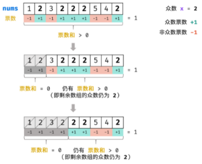
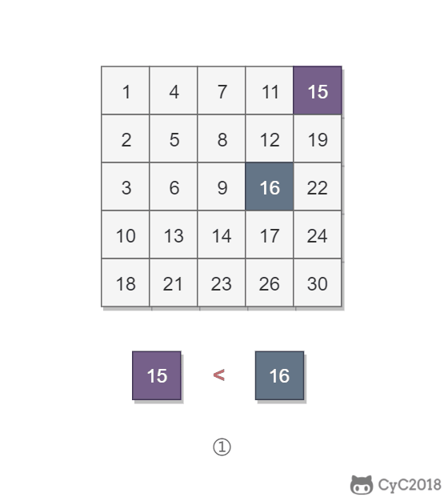
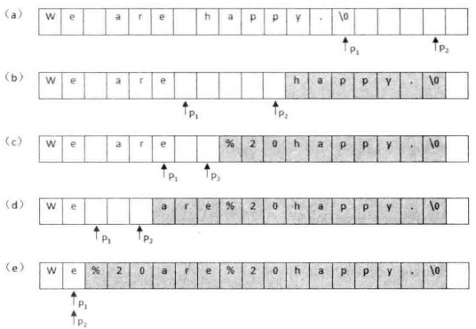

[toc]

## [剑指 Offer 62. 圆圈中最后剩下的数字](https://leetcode-cn.com/problems/yuan-quan-zhong-zui-hou-sheng-xia-de-shu-zi-lcof/)

0,1,···,n-1这n个数字排成一个圆圈，从数字0开始，每次从这个圆圈里删除第m个数字（删除后从下一个数字开始计数）。求出这个圆圈里剩下的最后一个数字。

例如，0、1、2、3、4这5个数字组成一个圆圈，从数字0开始每次删除第3个数字，则删除的前4个数字依次是2、0、4、1，因此最后剩下的数字是3。

**示例 1：**

```
输入: n = 5, m = 3
输出: 3
```

**示例 2：**

```
输入: n = 10, m = 17
输出: 2
```

 

**限制：**

- `1 <= n <= 10^5`
- `1 <= m <= 10^6`

函数签名

```java
public int lastRemaining(int n, int m);
```

### Solution：用数组模拟环状链表

当前索引为idx，下一次要删除的元素索引为位置为(idx+m-1), 

> 比如当起索引为0, 下一次要删除第3个数，应删除索引2

由于索引到末尾会返回开头，所以要取模，即下一次要删除的元素索引为(idx+m-1)%n;

用List方法里的remove方法之后，索引会前移（O(n)），乘上要删除的n次，时间复杂度为O(n^2)

```java
public int lastRemaining(int n, int m) {
        ArrayList<Integer> list = new ArrayList<>();
        for(int i=0; i<=n-1; i++){
            list.add(i);
        }

        int idx = 0;
        while(n>1){
            idx = (idx+m-1)%n;
            list.remove(idx);//后面的元素会前移
            n--;
        }
        return list.get(0);
    }
```

> LinkedList 会超时，我猜是因为 LinkedList 虽然删除指定节点的时间复杂度是 O(1)O(1) 的，但是在 remove 时间复杂度仍然是 O(n)O(n) 的，因为需要从头遍历到需要删除的位置。那 ArrayList 呢？索引到需要删除的位置，时间复杂度是 O(1)O(1)，删除元素时间复杂度是 O(n)O(n)（因为后续元素需要向前移位）， remove 整体时间复杂度是 O(n)O(n) 的。看起来LinkedList 和 ArrayList 单次删除操作的时间复杂度是一样的 ？所累哇多卡纳！ArrayList 的 remove 操作在后续移位的时候，其实是**内存连续空间的拷贝**！所以相比于LinkedList大量非连续性地址访问，ArrayList的性能是很 OK 的！

### Solution(最佳)：数学+递归

圆圈长度为 n 的解可以看成长度为 n-1 的解再加上报数的长度 m。因为是圆圈，所以最后需要对 n 取余。

```java
public int lastRemaining(int n, int m) {
        if(n==1) return 0;
        int last = lastRemaining(n-1,m);
        return (last+m)%n;
    }
```

### Solution：迭代

```java
public int lastRemaining(int n, int m) {
        int x = 0;
        for (int i = 2; i <= n; i++) {
            x = (x + m) % i;
        }
        return x;
    }
```


## [剑指 Offer 39. 数组中出现次数超过一半的数字](https://leetcode-cn.com/problems/shu-zu-zhong-chu-xian-ci-shu-chao-guo-yi-ban-de-shu-zi-lcof/)

数组中有一个数字出现的次数超过数组长度的一半，及众数，请找出这个数字。

你可以假设数组是非空的，并且给定的数组总是存在多数元素。

**示例 1:**

```
输入: [1, 2, 3, 2, 2, 2, 5, 4, 2]
输出: 2
```

**限制：**

```
1 <= 数组长度 <= 50000
```

函数签名

```java
public int majorityElement(int[] nums);
```

### 思路

1. 哈希表

    遍历数组 `nums` ，用 HashMap 统计各数字的数量，即可找出 众数 。

    时间和空间复杂度均为 O(N) 。

2. 摩尔投票

    vote为0的时候假设当前数字为众数，碰到相同的+1，不同的-1，直到vote为0，再把当前数字设为重数..

    因为众数的数量>数组长度的一半，所以如果存在众数，最后vote一定>=1;

    

    - **时间复杂度 O(N)：** N为数组 `nums` 长度。
    - **空间复杂度 O(1) ：** `votes` 变量使用常数大小的额外空间。

### Solution：摩尔投票

```java
public int majorityElement(int[] nums) {
        int num = nums[0];
        int vote = 0;
        for(int i=0; i<nums.length; i++){
            if(vote==0)
                num = nums[i];//num初始化

            if(num == nums[i])
                vote++;
            if(num != nums[i])
                vote--;
        }
				//验证是否存在众数
        int count = 0;
        for(int i=0; i<nums.length; i++){
            if(nums[i]==num)
                count++;
        }

        return count>nums.length/2? num: 0;
    }
```


## [剑指 Offer 03. 数组中重复的数字](https://leetcode-cn.com/problems/shu-zu-zhong-zhong-fu-de-shu-zi-lcof/)

找出数组中重复的数字。

在一个长度为 n 的数组 nums 里的所有数字都在 0～n-1 的范围内。数组中某些数字是重复的，但不知道有几个数字重复了，也不知道每个数字重复了几次。请找出数组中任意一个重复的数字。

**示例 1：**

```
输入：
[2, 3, 1, 0, 2, 5, 3]
输出：2 或 3 
```

 函数签名：

```java
public int findRepeatNumber(int[] nums);
```

### 思路：哈希表（Set）

初始化一个HashSet，把数组里的数字依次加入HashSet，如果当前数字在HashSet里，说明重复，返回那个数字

### Solution：哈希表（Set）

```Java
public int findRepeatNumber(int[] nums) {
        Set<Integer> tmp = new HashSet<>();
        for(int i=0; i<nums.length; i++){
            if(!tmp.contains(nums[i]))
                tmp.add(nums[i]);
            else 
                return nums[i];
        }
        return -1;
    }
```

时间复杂度 O(N) ： 遍历数组使用 O(N) ，HashSet 添加与查找元素皆为 O(1) 。
空间复杂度 O(N) ： HashSet 占用 O(N) 大小的额外空间。

### 思路：原地交换

题目中：**nums 里的所有数字都在 0～n-1 的范围内**

说明**索引和值**是**一对多**的关系，将值为 i 的元素调整到第 i 个位置上，如果第 i 位置上已经有一个值为 i 的元素，就可以知道 i 值重复。

### Solution：原地交换

```java
public int findRepeatNumber(int[] nums) {
        for(int i=0; i<nums.length; i++){
            while(nums[i]!=i){//通过交换去找此索引的值
                if(nums[i]==nums[nums[i]])//如果目标位置已经有值，说明重复
                    return nums[i];
                //交换nums[i]和nums[nums[i]]
                int tmp = nums[i];
                nums[i] = nums[nums[i]];
                nums[tmp] = tmp;
            }
        }
        return -1;
    }
```

## [剑指 Offer 04. 二维数组中的查找](https://leetcode-cn.com/problems/er-wei-shu-zu-zhong-de-cha-zhao-lcof/)

在一个 n * m 的二维数组中，**每一行**都按照从**左到右递增**的顺序排序，**每一列**都按照**从上到下递增**的顺序排序。请完成一个高效的函数，输入这样的一个二维数组和一个整数，判断数组中是否含有该整数。

**示例:**

现有矩阵 matrix 如下：

```
[
  [1,   4,  7, 11, 15],
  [2,   5,  8, 12, 19],
  [3,   6,  9, 16, 22],
  [10, 13, 14, 17, 24],
  [18, 21, 23, 26, 30]
]
```

给定 target = `5`，返回 `true`。

给定 target = `20`，返回 `false`。

### 思路：

类似二分查找，该二维数组中的一个数，有：

1. 小于它的数一定在其左边，大于它的数一定在其下边
2. 小于它的数一定在其上边，大于它的数一定在其右边

选择1的话，从右上角开始查找，如图：



选择2的话从左下角开始查找。

> 由于网上的解答大部分是选择1&右上角开始，所以我就要跟他们不一样，从左下角开始，哼

### Solution：从左下角开始

```java
public boolean findNumberIn2DArray(int[][] matrix, int target) {
        int i = matrix.length-1, j = 0;
        while(i>=0 && j<matrix[0].length){
            if(matrix[i][j]==target)
                return true;
                
            if(matrix[i][j]<target)
                j++;
            else //(matrix[i][j]>target)
                i--;
        }
        return false;
    }
```

时间复杂度 O(M + N)，空间复杂度 O(1)。其中 M 为行数，N 为 列数。

## [剑指 Offer 05. 替换空格](https://leetcode-cn.com/problems/ti-huan-kong-ge-lcof/)

请实现一个函数，把字符串 `s` 中的每个空格替换成"%20"。

**示例 1：**

```
输入：s = "We are happy."
输出："We%20are%20happy."
```

函数签名：

```java
public String replaceSpace(String s);
```

### 思路

一个比较差的思路是：**每次发现空格，都将空格后面的字符后移2位；时间复杂度O(n^2);**

较好的思路是：



- 遍历一遍字符串，找到空格的个数n，在字符串尾部填充两个任意字符，使得字符串的长度等于替换之后的长度。

- 令 P1 指向字符串原来的末尾位置，P2 指向字符串现在的末尾位置。P1 和 P2 从后向前遍历：

    当P1遍历到非空格时，就填充上 P1 指向字符的值；

    当 P1 遍历到一个空格时，就需要令 P2 指向的位置依次填充 02%（注意是逆序的）；

    （从后向前遍是为了在改变 P2 所指向的内容时，不会影响到 P1 遍历原来字符串的内容。）

- 当 P2 遇到 P1 时（P2 <= P1），或者遍历结束（P1 < 0），退出。

```java
public String replaceSpace(String s) {
        StringBuilder sb = new StringBuilder(s);
        int p1 = sb.length()-1;
        for(int i=0; i<sb.length(); i++){
            if(sb.charAt(i)==' ')
                sb.append("%%");//两个空格
        }
        int p2 = sb.length()-1;
        while(p2>p1){
            if(sb.charAt(p1)!=' '){
                sb.setCharAt(p2, sb.charAt(p1));
                p2--;
            }
                
            else{
                sb.setCharAt(p2, '0');
                sb.setCharAt(p2-1, '2');
                sb.setCharAt(p2-2, '%');
                p2 -= 3;
            }
            p1--;
        }
        return sb.toString();
    }
```

## [剑指 Offer 29. 顺时针打印矩阵](https://leetcode-cn.com/problems/shun-shi-zhen-da-yin-ju-zhen-lcof/)

输入一个矩阵，按照从外向里以顺时针的顺序依次打印出每一个数字。

**示例 1：**

```
输入：matrix = [[1,2,3],[4,5,6],[7,8,9]]
输出：[1,2,3,6,9,8,7,4,5]
```

**示例 2：**

```
输入：matrix = [[1,2,3,4],[5,6,7,8],[9,10,11,12]]
输出：[1,2,3,4,8,12,11,10,9,5,6,7]
```

**限制：**

- `0 <= matrix.length <= 100`
- `0 <= matrix[i].length <= 100`

函数签名：

```java
public int[] spiralOrder(int[][] matrix);
```

### 思路

一层一层从外到里打印，观察可知每一层打印都有相同的处理步骤，唯一不同的是上下左右的边界不同了。因此使用四个变量 r1, r2, c1, c2 分别存储上下左右边界值，从而定义当前最外层。

打印当前最外层的顺序：从左到右打印最上一行->从上到下打印最右一行->从右到左打印最下一行->从下到上打印最左一行。

应当注意只有在 r1 != r2 时才打印最下一行，也就是在当前最外层的行数大于 1 时才打印最下一行，这是因为当前最外层只有一行时，继续打印最下一行，会导致重复打印；打印最左一行也要做同样处理。

### Solution

一定要画图！


```java
public int[] spiralOrder(int[][] matrix) {
        if(matrix.length==0 || matrix[0].length==0)
            return new int[0];
        int ii = 0, ij = matrix[0].length-1;//横向（行）的头ii和尾ij
        int ji = 0, jj = matrix.length-1;//纵向（列）的头ji和尾jj
        int[] res = new int[matrix.length*matrix[0].length];
        int resIdx = 0;
        while(ii<=ij && ji<=jj){
            for(int i=ii; i<=ij; i++)//左上往右打印
                res[resIdx++] = matrix[ji][i];
            for(int j=ji+1; j<=jj; j++)//右上往下打印
                res[resIdx++] = matrix[j][ij];
            if(ji!=jj){//避免重复打印
                for(int i=ij-1; i>=ii; i--)//右下往左打印
                    res[resIdx++] = matrix[jj][i];
            }
            if(ii!=ij){//避免重复打印
                for(int j=jj-1; j>=ji+1; j--)//左下往上打印
                    res[resIdx++] = matrix[j][ii];
            }   
            ii++;ij--;ji++;jj--;
        }
        return res;
    }
```

## [剑指 Offer 50. 第一个只出现一次的字符](https://leetcode-cn.com/problems/di-yi-ge-zhi-chu-xian-yi-ci-de-zi-fu-lcof/)

难度简单121

在字符串 s 中找出第一个只出现一次的字符。如果没有，返回一个单空格。 s 只包含小写字母。

**示例:**

```
s = "abaccdeff"
返回 "b"

s = "" 
返回 " "
```

 函数签名：

```java
public char firstUniqChar(String s);
```

### 思路

只包含小写字母，ASCII编码只有128位，可以拿int[128]通过一次遍历字符串记录每个字符出现的次数；

再次遍历字符串找出现次数等于1的字符。

PS：也可以通过LinkedHashMap记录字符出现的频次，根据LinkedHashMap的有序性得出第一个只出现一次的字符；

### Solution:

```java
public char firstUniqChar(String s) {
        int[] tmp = new int[128];
        for(int i=0; i<s.length(); i++){
            tmp[s.charAt(i)]++;
        }
        for(int i=0; i<s.length(); i++){
            if(tmp[s.charAt(i)]==1)
                return s.charAt(i);
        }
        return ' ';
    }
```

时间复杂度O(n)

空间复杂度O(1)

