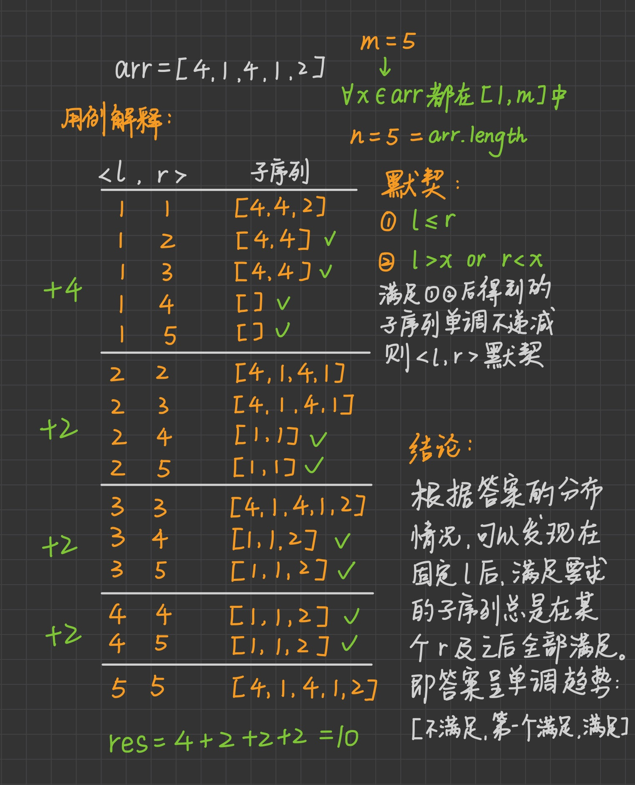
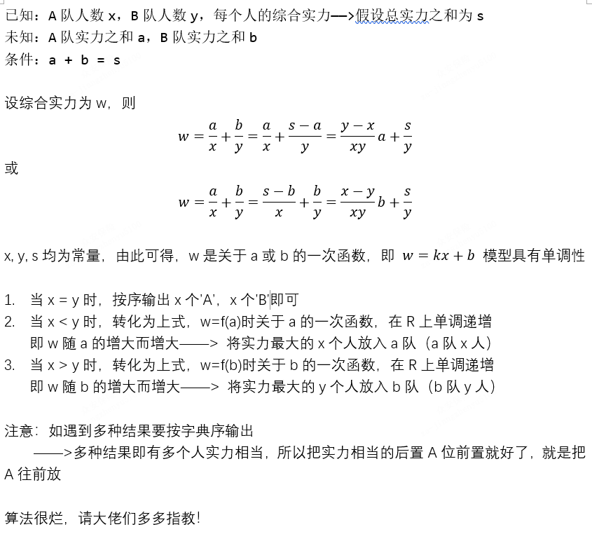

# 百度

## [21年秋招 选角色](https://www.nowcoder.com/questionTerminal/3bb34509886441bba290bcc99d76b58d)

牛牛任职于一家演艺公司，这一天，他率领着一共 n\mathit nn 个小伙伴去某知名剧组面试，在戏中，往往以戏份多少来定义角色的重要性。

 现在，这n 个小伙伴对自己都有一个定位，想要拿一个多少戏份的角色。假设将戏份多少量化，以 1～100 来衡量，那么也就是说，每个人在心中都有一个指标，自己签订的合约角色戏份绝对不能少于这个指标。

 在 n 个小伙伴都进入剧组面试之后，牛牛得到该剧组剩余 m个角色的戏份值，现在，牛牛想提前知道，对于每个人而言，一共有多少个角色是满足要求的。

##### **输入描述:**

```latex
本题为多组测试数据，第一行输入一个正整数 T(1 ≤ T ≤ 1000)\mathit T(\text 1\ \leq\ \mathit T\ \leq\ \text {1000})T(1 ≤ T ≤ 1000)，代表测试数据组数。

对于每组测试数据，第二行输入两个正整数 n, m(1 ≤ n, m ≤ 1000)\mathit n,\ \mathit m(\text 1\ \leq\ \mathit n,\ \mathit m\ \leq\ \text {1000})n, m(1 ≤ n, m ≤ 1000)，代表小伙伴数量以及剧组中角色数量。
第三行输入 n\mathit nn 个正整数 a1, a2, ..., an(1 ≤ ai ≤ 100)\mathit a_\text 1,\ \mathit a_\text 2,\ ...,\ \mathit a_\mathit n(\text 1\ \leq\ \mathit a_\mathit i\ \leq\ \text {100})a1, a2, ..., an(1 ≤ ai ≤ 100)，代表每个人心中想要找的角色在戏中最少要拥有的戏份值。
第四行输入 m\mathit mm 个正整数，b1, b2, ..., bm(1 ≤ bi ≤ 100)\mathit b_\text 1,\ \mathit b_\text 2,\ ...,\ \mathit b_\mathit m(\text 1\ \leq\ \mathit b_\mathit i\ \leq\ \text {100})b1, b2, ..., bm(1 ≤ bi ≤ 100)，代表剧组剩余的每个角色的戏份值。
```

##### **输出描述:**

```
对于每组测试数据，在一行内输出 n\mathit nn 个整数，依次代表每个小伙伴可以在剧组剩余角色中找到几个满足要求的。
```

示例1

输入

```
1
3 6
33 66 99
3 6 9 30 60 90
```

输出

```
2 1 0
```

### Solution1: 二分查找

```Java
import java.util.*;
import java.io.*;
public class Main{
    public static void main(String[] args){
        Scanner sc = new Scanner(System.in);
        int numOfQ = sc.nextInt();
        //System.out.println(numOfQ);
        for(int count=0; count<numOfQ; count++){
            int numOfPerson = sc.nextInt();
            int numOfPlay = sc.nextInt();
            sc.nextLine();//下一行
            //System.out.println(numOfPerson + " "+numOfPlay);
            //String转Int[]
            int[] arrPerson=Arrays.stream(sc.nextLine().split(" ")).mapToInt(Integer::parseInt).toArray();
            //int[] arrPerson = new int[numOfPerson];
            //for(int i=0; i<numOfPerson; i++){
            //    arrPerson[i] = sc.nextInt();
                //System.out.print(arrPerson[i]+" ");
            //}
            //System.out.println();
            int[] movies=Arrays.stream(sc.nextLine().split(" ")).mapToInt(Integer::parseInt).toArray();
            //int[] movies = new int[numOfPlay];
            //for(int i=0; i<numOfPlay; i++){
            //    movies[i] = sc.nextInt();
                //System.out.print(score+" ");
            //}
            
            int[] result = new int[numOfPerson];
            Arrays.sort(movies);//sort之后二分查找
            for(int i=0; i<numOfPerson; i++){
                int l=0, r=movies.length-1;
                while(l<=r){
                    int mid = l+(r-l)/2;
                    if(movies[mid]<arrPerson[i])
                        l = mid+1;
                    if(movies[mid]>=arrPerson[i])
                        r = mid-1;
                }
                result[i] = movies.length-l;
            }
            //System.out.println();
            StringBuilder sb = new StringBuilder("");
            for(int i=0; i<numOfPerson; i++){
                sb.append(result[i]+" ");
            }
            sb.deleteCharAt(sb.length()-1);
            System.out.println(sb.toString());
        }
    }
}
```

### Solution2: 统计每个戏份的数量

```java
import java.util.*;
import java.io.*;
public class Main{
    public static void main(String[] args){
        Scanner sc = new Scanner(System.in);
        int numOfQ = sc.nextInt();
        //System.out.println(numOfQ);
        for(int j=0; j<numOfQ; j++){
            int numOfPerson = sc.nextInt();
            int numOfPlay = sc.nextInt();
            sc.nextLine();
            int[] arrPerson=Arrays.stream(sc.nextLine().split(" ")).mapToInt(Integer::parseInt).toArray();
            int[] movies=Arrays.stream(sc.nextLine().split(" ")).mapToInt(Integer::parseInt).toArray();
            int[] buckets= new int[100];
            for (int value: movies){
                for(int index=0; index<value; index++){
                    buckets[index]+=1;
                }
            }
            int[] result = new int[numOfPerson];
            for(int i=0; i<numOfPerson; i++){
                int valueExpected = arrPerson[i];
                result[i] = buckets[valueExpected-1];
            }
            //System.out.println();
            StringBuilder sb = new StringBuilder("");
            for(int i=0; i<numOfPerson; i++){
                sb.append(result[i]+" ");
            }
            sb.deleteCharAt(sb.length()-1);
            System.out.println(sb.toString());
        }
    }
}
```

# 字节

## [ZJ21 特征提取](https://www.nowcoder.com/practice/5afcf93c419a4aa793e9b325d01957e2?tpId=137&&tqId=33898&rp=1&ru=/ta/exam-bytedance&qru=/ta/exam-bytedance/question-ranking)

描述

​    小明是一名算法工程师，同时也是一名铲屎官。某天，他突发奇想，想从猫咪的视频里挖掘一些猫咪的运动信息。为了提取运动信息，他需要从视频的每一帧提取“猫咪特征”。一个猫咪特征是一个两维的vector<x, y>。如果x_1=x_2 and y_1=y_2，那么这俩是同一个特征。

​    因此，如果喵咪特征连续一致，可以认为喵咪在运动。也就是说，如果特征<a, b>在持续帧里出现，那么它将构成特征运动。比如，特征<a, b>在第2/3/4/7/8帧出现，那么该特征将形成两个特征运动2-3-4 和7-8。

现在，给定每一帧的特征，特征的数量可能不一样。小明期望能找到最长的特征运动。

输入描述：

第一行包含一个正整数N，代表测试用例的个数。

每个测试用例的第一行包含一个正整数M，代表视频的帧数。

接下来的M行，每行代表一帧。其中，第一个数字是该帧的特征个数，接下来的数字是在特征的取值；比如样例输入第三行里，2代表该帧有两个猫咪特征，<1，1>和<2，2>
所有用例的输入特征总数和<100000

N满足1≤N≤100000，M满足1≤M≤10000，一帧的特征个数满足 ≤ 10000。
特征取值均为非负整数。

输出描述：

对每一个测试用例，输出特征运动的长度作为一行

示例1

输入：

```
1
8
2 1 1 2 2
2 1 1 1 4
2 1 1 2 2
2 2 2 1 4
0
0
1 1 1
1 1 1
```

复制

输出：

```
3
```

复制

说明：

```
特征<1,1>在连续的帧中连续出现3次，相比其他特征连续出现的次数大，所以输出3
```

备注：

```
如没有长度大于2的特征运动，返回1
```

### Solution

```java
import java.util.*;

public class Main {
    public static void main(String[] args) {
        Scanner in = new Scanner(System.in);
        int num = in.nextInt();
        //num组测试用例
        for(int i=0; i<num; i++){
            int max = 1;
            //记录上一行键值对的 map
            Map<String, Integer> last = new HashMap<>();
            //记录本行键值对的 map
            Map<String, Integer> temp = new HashMap<>();
            //每组测试用例总帧数
            int len = in.nextInt();
            for(int j=0; j<len; j++){
                int vec = in.nextInt();
                temp.clear();
                //每一帧的vec数
                for(int k=0; k<vec; k++){
                    String key = in.nextInt() + " " + in.nextInt();
                    temp.put(key, 1);
                }
                Set<String> lastKey = last.keySet();
                for(String key: lastKey){
                    if(temp.containsKey(key)){
                        //把上一层的有效的轨迹加到这一层
                        temp.put(key, last.get(key)+temp.get(key));
                        max = Math.max(max, temp.get(key));
                    }
                }
                last.clear();
                last.putAll(temp);
            }
            System.out.println(max);
        }
    }
}
```


## [ZJ25 头条校招](https://www.nowcoder.com/practice/57cf0b1050834901933e9b48daafbb9a?tpId=137&&tqId=34094&rp=1&ru=/ta/exam-bytedance&qru=/ta/exam-bytedance/question-ranking)

头条的2017校招开始了！为了这次校招，我们组织了一个规模宏大的出题团队，每个出题人都出了一些有趣的题目，而我们现在想把这些题目组合成若干场考试出来，在选题之前，我们对题目进行了盲审，并定出了每道题的难度系统。一场考试包含3道开放性题目，假设他们的难度从小到大分别为a,b,c，我们希望这3道题能满足下列条件：
a<=b<=c
b-a<=10
c-b<=10
所有出题人一共出了n道开放性题目。现在我们想把这n道题分布到若干场考试中（1场或多场，每道题都必须使用且只能用一次），然而由于上述条件的限制，可能有一些考试没法凑够3道题，因此出题人就需要多出一些适当难度的题目来让每场考试都达到要求，然而我们出题已经出得很累了，你能计算出我们最少还需要再出几道题吗？

输入描述：

输入的第一行包含一个整数n，表示目前已经出好的题目数量。
第二行给出每道题目的难度系数d1,d2,...,dn。
数据范围
对于30%的数据，1 ≤ n,di ≤ 5;
对于100%的数据，1 ≤ n ≤ 10^5,1 ≤ di ≤ 100。
在样例中，一种可行的方案是添加2个难度分别为20和50的题目，这样可以组合成两场考试：（20 20 23）和（35,40,50）。

输出描述：

输出只包括一行，即所求的答案。

示例1

输入：

```
4  
20 35 23 40
```

输出：

```
2
```

### Solution

```java
import java.io.BufferedInputStream;
import java.util.*;

public class Main {
    public static void main(String[] args) {
        Scanner sc = new Scanner(new BufferedInputStream(System.in));
        while(sc.hasNext()){
            sc.nextInt();
            //跳到下一行
            sc.nextLine();
            //String转Int[]
            int[] arr=Arrays.stream(sc.nextLine().split(" ")).mapToInt(Integer::parseInt).toArray();
            Arrays.sort(arr);
            int i = 0;
            int ans = 0;
            while(i<arr.length){
                if(arr.length-i==1){//剩一题
                    ans += 2;
                    i += 1;
                } else if(arr.length-i==2){//剩两题
                    if(arr[i+1]-arr[i]<=20){//[1,8]、[1,21]都只要补一题[1,11,21]
                        ans += 1;
                    } else if(arr[i+1]-arr[i]>20){//[1, 22]需补四个拼配成[1,2,3]和[22,23,24]
                        ans += 4;
                    }
                    i += 2;
                } else {//剩大于等于三题
                    if(arr[i+1]-arr[i]<=10 && arr[i+2]-arr[i+1]<=10){//[1, 11, 21]满足
                        i += 3;
                    } else if(arr[i+1]-arr[i]<=10 && arr[i+2]-arr[i+1]>10){//[1,11,22]在11和22中间加一题，指针移到22
                        ans += 1;
                        i += 2;
                    } else {//[1,13,15]在1和13中间加入两个新题，指针移到13，使得arr剩下[13,15]，进入下一步判断（因为1 13 15 必须要加三个新题才能满足，所以这里只需要判断1和13的关系
                        ans += 2;
                        i += 1;
                    }
                }
            }
            System.out.println(ans);
        }
    }
}

```

# 美团

## [meituan-001. 小美的用户名](https://leetcode-cn.com/problems/BaR9fy/)

小美是美团的前端工程师，为了防止系统被恶意攻击，小美必须要在用户输入用户名之前做一个合法性检查，一个合法的用户名必须满足以下几个要求：

1. 用户名的首字符必须是大写或者小写字母。
2. 用户名只能包含大小写字母，数字。
3. 用户名需要包含至少一个字母和一个数字。
    如果用户名合法，请输出 "Accept"，反之输出 "Wrong"。

**格式：**

```
输入：
- 输入第一行包含一个正整数 T，表示需要检验的用户名数量。
- 接下来有 T 行，每行一个字符串 s，表示输入的用户名。
输出：
- 对于每一个输入的用户名 s，请输出一行，即按题目要求输出一个字符串。
```

**示例：**

```
输入：
     5
     Ooook
     Hhhh666
     ABCD
     Meituan
     6666
输出：
     Wrong
     Accept
     Wrong
     Wrong
     Wrong
```

**提示：**

- `1 <= T <= 100`
- s 的长度不超过 20

### Solution

```java
import java.io.*;
import java.util.*;

public class Solution {
    public static void main(String[] args) {
        Scanner sc = new Scanner(new BufferedInputStream(System.in));
        int total = sc.nextInt();
        sc.nextLine();
        for(int i=0; i<total; i++){
            String s = sc.nextLine();
            if(isValid(s))
                System.out.println("Accept");
            else
                System.out.println("Wrong");
        }
        
    }
    private static boolean isValid(String s){
        if (s.length() <= 2) {
			return false;
		}
        //首字符
        if(!(('A'<=s.charAt(0) && s.charAt(0)<='Z')||
            ('a'<=s.charAt(0) && s.charAt(0)<='z'))){
            return false;
        }
        boolean hasLetter = false, hasNum = false;
        for(int j=0; j<s.length(); j++){
            if(('A'<=s.charAt(j) && s.charAt(j)<='Z') ||
                ('a'<=s.charAt(j) && s.charAt(j)<='z')){
                hasLetter = true;
            } else if('0'<=s.charAt(j) && s.charAt(j)<='9'){
                hasNum = true;
            } else {
                return false;
            }
        }
        return hasLetter && hasNum;
    }
}

```

## [meituan-002. 小美的仓库整理](https://leetcode-cn.com/problems/TJZLyC/)

小美是美团仓库的管理员，她会根据单据的要求按顺序取出仓库中的货物，每取出一件货物后会把剩余货物重新堆放，使得自己方便查找。已知货物入库的时候是按顺序堆放在一起的。如果小美取出其中一件货物，则会把货物所在的一堆物品以取出的货物为界分成两堆，这样可以保证货物局部的顺序不变。
已知货物最初是按 1~n 的顺序堆放的，每件货物的重量为 w[i] ,小美会根据单据依次不放回的取出货物。请问根据上述操作，小美每取出一件货物之后，重量和最大的一堆货物重量是多少？

**格式：**

```
输入：
- 输入第一行包含一个正整数 n ，表示货物的数量。
- 输入第二行包含 n 个正整数，表示 1~n 号货物的重量 w[i] 。
- 输入第三行有 n 个数，表示小美按顺序取出的货物的编号，也就是一个 1~n 的全排列。
输出：
- 输出包含 n 行，每行一个整数，表示每取出一件货物以后，对于重量和最大的一堆货物，其重量和为多少。
```

**示例：**

```
输入：
     5
     3 2 4 4 5 
     4 3 5 2 1
输出：
     9
     5
     5
     3
     0
解释：
原本的状态是 {{3,2,4,4,5}} ，取出 4 号货物后，得到 {{3,2,4},{5}} ，第一堆货物的和是 9 ，然后取出 3 号货物得到 {{3,2}{5}} ，此时第一堆和第二堆的和都是 5 ，以此类推。
```

**提示：**

- `1 <= n,m <= 50000`
- `1 <= w[i] <= 100`

### Solution

```java
import java.io.*;
import java.util.*;

public class Solution{
    public static void main(String[] args){
        Scanner sc = new Scanner(new BufferedInputStream(System.in));
        int n = sc.nextInt();
        sc.nextLine();
        int[] weights = Arrays.stream(sc.nextLine().split(" ")).mapToInt(Integer::parseInt).toArray();
        int[] removeIdx = Arrays.stream(sc.nextLine().split(" ")).mapToInt(Integer::parseInt).toArray();
        
        int[] prefixSum = new int[n+1];//前缀和数组，如果货物重量为[3,2,4,4,5]，则前缀和数组为[0,3,5,9,13,18]
        for(int i=1; i<n+1; i++){
            prefixSum[i] = prefixSum[i-1]+weights[i-1];
        }
    
        int[][] boundary = new int[n][2];//货物所属堆的左右边界
        for(int i=0; i<n; i++){
            boundary[i] = new int[]{-1,-1};
        }

        int[] res = new int[n];
        int max = 0;
        for(int i=n-1; i>=0; i--){
            res[i] = max;//因为是倒序，所以倒数第一次移除完的结果应为0；倒数第二次移除完的结果应为最后一个数的值

            int x = removeIdx[i] - 1;//索引从1开始
            int weight = weights[x];
            int left = x, right = x;//左边界和右边界,如果左右无连通区域则区间为[x,x],所以初始化为x
            //每次将货物的左右两块区域连成一块
            if(x+1<=n-1 && boundary[x+1][1]!=-1){//更新当前货物的右边界
                weight += prefixSum[boundary[x+1][1]+1] - prefixSum[boundary[x+1][0]];
                right = boundary[x+1][1];
            }
            if(x-1>=0 && boundary[x-1][0]!=-1){//更新当前货物的左边界
                weight += prefixSum[boundary[x-1][1]+1] - prefixSum[boundary[x-1][0]];
                left = boundary[x-1][0];
            }
            max = Math.max(max, weight);
            
            //更新两端点的左右区间
            boundary[left][0] = left;
            boundary[left][1] = right;
            boundary[right][0] = left;
            boundary[right][1] = right;
        }
        for(int i=0; i<n; i++)
            System.out.println(res[i]);
    }
}


```

## [meituan-003. 小美的跑腿代购](https://leetcode-cn.com/problems/GXV5dX/)

小美的一个兼职是美团的一名跑腿代购员，她有 n 个订单可以接，订单编号是 1~n ，但是因为订单的时效性，他只能选择其中 m 个订单接取，精明的小美当然希望自己总的获利是最大的，已知，一份订单会提供以下信息，跑腿价格 v ，商品重量 w kg，商品每重 1kg ，代购费用要加 2 元，而一份订单可以赚到的钱是跑腿价格和重量加价之和。小美可是开兰博基尼送货的人，所以自然不会在意自己会累这种事情。请问小美应该选择哪些订单，使得自己获得的钱最多。
请你按照选择的订单编号的从小到大顺序，如果存在多种方案，输出订单编号字典序较小的方案。

**格式：**

```
输入：
- 输入第一行包含两个正整数 n，m，表示订单的数量和小美可以接的订单数量。
- 接下来有 n 行，第 i 行表示 i-1 号订单的信息。每行有两个正整数 v 和 w  ，表示一个订单的跑腿价格和商品重量。
输出：
- 输出包含 m 个 1~n 之间的正整数，中间用空格隔开，表示选择的订单编号。
```

**示例：**

```
输入：
     5 2
     5 10
     8 9
     1 4
     7 9
     6 10
输出：2 5
```

**提示：**

- `1 <= n, m <= 10000`
- `1 <= v, w <= 1000`

### Solution

TopK问题，求最大，维护一个size为n的最大堆；

因为是按订单编号从小到大排序，所以要存订单编号和收益，那么就会用到数组来储存： int[0]收益earn，int[1] 订单编号；

存的时候按照收益降序，收益相同则编号升序

最后输出之前按照订单编号重新排序O(nlogn)

```java
import java.io.*;
import java.util.*;

public class Solution{
    public static void main(String args[]){
        Scanner sc = new Scanner(new BufferedInputStream(System.in));
        String[] nm = sc.nextLine().split(" ");
        int n = Integer.parseInt(nm[0]);
        int m = Integer.parseInt(nm[1]);
        //存的时候按照收益降序，收益相同则编号升序
        PriorityQueue<int[]> maxHeap = new PriorityQueue<>((o1, o2) -> o1[0]!=o2[0]? o2[0]-o1[0] : o1[1]-o2[1]);
        for(int i=1; i<n+1; i++){
            String[] vw = sc.nextLine().split(" ");
            int earn = Integer.parseInt(vw[0]) + 2*Integer.parseInt(vw[1]);
            int[] tmp = new int[]{earn, i};
            maxHeap.offer(tmp);
        }

        int[] res = new int[m];
        for(int i=0; i<m; i++){//取出头m个
            res[i] = maxHeap.poll()[1];
        }
        Arrays.sort(res);//按编号降序
        for(int i=0; i<m; i++){
            System.out.print(res[i]+" ");
        }
    }
}
```

时间复杂度O(nlogn)

空间复杂度O(n)

## [meituan-004. 小团的复制粘贴](https://leetcode-cn.com/problems/TOVGD1/)

小团是一个莫得感情的 CtrlCV 大师，他有一个下标从 1 开始的序列 A 和一个初始全部为 -1 序列 B ，两个序列的长度都是 n 。他会进行若干次操作，每一次操作，他都会选择 A 序列中一段连续区间，将其粘贴到 B 序列中的某一个连续的位置，在这个过程中他也会查询 B 序列中某一个位置上的值。
我们用如下的方式表示他的粘贴操作和查询操作：
粘贴操作：1 k x y，表示把 A 序列中从下标 x 位置开始的连续 k 个元素粘贴到 B 序列中从下标 y 开始的连续 k 个位置上。原始序列中的元素被覆盖。（数据保证不会出现粘贴后 k 个元素超出 B 序列原有长度的情况）
查询操作：2 x，表示询问B序列下标 x 处的值是多少。

**格式：**

```
输入：
- 输入第一行包含一个正整数 n ，表示序列 A 和序列 B 的长度。
- 输入第二行包含 n 个正整数，表示序列 A 中的 n 个元素，第 i 个数字表示下标为 i 的位置上的元素，每一个元素保证在 10^9 以内。
- 输入第三行是一个操作数 m ，表示进行的操作数量。
- 接下来 m 行，每行第一个数字为 1 或 2 ，具体操作细节详见题面。
输出：
- 对于每一个操作 2 输出一行，每行仅包含一个正整数，表示针对某一个询问的答案。
```

**示例 1：**

```
输入：
     5
     1 2 3 4 5 
     5
     2 1
     2 5
     1 2 3 4
     2 3
     2 5
输出：
     -1
     -1
     -1
     4
```

**示例 2：**

```
输入：
     5
     1 2 3 4 5 
     9
     1 2 3 4
     2 3
     2 5
     1 2 2 3
     2 1
     2 2
     2 3
     2 4
     2 5
输出：
     -1
     4
     -1
     -1
     2
     3
     4
```

### Solution

模拟即可

```java
import java.io.*;
import java.util.*;

public class Solution{
    public static void main(String args[]){
        Scanner sc = new Scanner(new BufferedInputStream(System.in));
        int n = sc.nextInt();
        sc.nextLine();
        String[] aStr = sc.nextLine().split(" ");
        int[] a = new int[200005], b = new int[200005];//题目超出范围了，不然这里的200005应为n+1
        for(int i=1; i<n+1; i++){
            a[i] = Integer.parseInt(aStr[i-1]);
            b[i] = -1;  
        }
        int num = sc.nextInt();
        for(int i=0; i<num; i++){
            if(sc.nextInt()==1){
                int k = sc.nextInt();
                int x = sc.nextInt();
                int y = sc.nextInt();
                paste(a, b, k, x, y);
            } else {
                int x = sc.nextInt();
                System.out.println(get(b, x));
            }
        }
        //System.out.print(a[i]+" ");
    }
    private static void paste(int[] a, int[] b, int k, int x, int y){
        for(int i=0; i<k; i++){
            b[y+i] = a[x+i];
        }
    } 
    private static int get(int[] b, int x){
        return b[x];
    }
}
```

## [meituan-005. 小美的区域会议](https://leetcode-cn.com/problems/Uo7Dr5/)

小美是美团总部的高管，她想要召集一些美团的区域负责人来开会，已知美团的业务区域划分可以用一棵树来表示，树上有 n 个节点，每个节点分别代表美团的一个业务区域，每一个区域有一个负责人，这个负责人的级别为 A[i]
已知小美召集人员开会必须满足以下几个条件：
1.小美召集的负责人所在的区域必须构成一个非空的连通的图，即选取树上的一个连通子图。
2.这些负责人中，级别最高的和级别最低的相差不超过 k 。
请问小美有多少种召集负责人的方式，当且仅当选取的集合不同时我们就认为两种方式不同。由于方案数可能非常大，所以请对 10^9+7 取模。

**格式：**

```
输入：
- 输入第一行包含两个整数 n 和 k ，表示区域的数量，和不能超过的级别。
- 接下来有 n-1 行，每行有两个正整数 a 和 b ，表示 a 号区域和 b 号区域有一条边。
- 最后一行有 n 个整数，第 i 个整数表示 i 号区域负责人的级别。
输出：
- 输出仅包含一个整数，表示可以选择的方案数对 10^9+7 取模之后的结果。
```

**示例：**

```
输入：
     5 1
     1 2
     2 3
     3 4
     4 5
     2 2 2 2 2
输出：15
解释：显然一个区域的方案有 {1}，{2}，{3}，{4}，{5}，两个区域的方案有 4 个，三个区域的方案有 3 个，四个区域的方案有 2 个，五个区域的方案有 1 个，共 15 个。
```

**提示：**

- `1 <= n, k <= 2000`
- `1 <= a, b <= n`

### Solution

n只有2000这么大，因此我们可以枚举每一个点必选的情况下所能组成的子集数量，为了避免重复，寻找子集时只统计不大于当前点i的level的所有点。

但是我们还面临一个问题：如果一个合法方案有多个最小点权的点，则以上方法会重复统计。因此定义一个序关系（注：在单调栈相关的一些题目里也见过这种技巧，我把它叫做”非对称定义“。）：当level[s] == level[i]，只有编号小于i的那些点s对应的子树才能被选择。在此定义下，某个合法方案只会被编号最大的那个点权最小的点统计。

```java
import java.io.*;
import java.util.*;
public class Solution {
    public static void main(String[] args) {
        Scanner sc = new Scanner(new BufferedInputStream(System.in));
        String[] nk = sc.nextLine().split(" ");
        int n = Integer.parseInt(nk[0]), k = Integer.parseInt(nk[1]);
        
        List<List<Integer>> connect = new ArrayList<>();//构建连接关系,索引从1开始
        for(int i=0; i<n+1; i++){
            connect.add(new ArrayList<>());
        }
        for(int i=0; i<n-1; i++){
            String[] ab = sc.nextLine().split(" ");
            int a = Integer.parseInt(ab[0]), b = Integer.parseInt(ab[1]);
            connect.get(a).add(b);
            connect.get(b).add(a);
        }
        
        String[] levelStr = sc.nextLine().split(" ");
        int[] level = new int[n+1];//记录级别,索引从1开始
        for(int i=1; i<n+1; i++){
            level[i] = Integer.parseInt(levelStr[i-1]);
        }
        long ans=0;
        for(int i=1; i<n+1; i++){//从小到大遍历，每次只包含比当前索引大的区域组成子集
            boolean[] visited = new boolean[n+1];
            ans = (ans+dfs(connect,level,visited,k,i,i))%1000000007;//初始为(i,i)仅包含i一个点，后面去i的子集里寻找
        }
        System.out.println(ans);
    }
    public static long dfs(List<List<Integer>> connect, int[] level, boolean[] visited, int k, int sub, int i){
        visited[sub] = true;
        long ans = 1;
        for(int s: connect.get(sub)){//去与i有连接的区域里找
            if(visited[s]) continue;
            //为了避免重复：
            //1寻找子集时只统计不大于当前点i的level的所有点
            //2某个合法方案只会被编号最大的那个点权最小的点统计：当level[s] == level[i]，只有编号小于i的那些点s对应的子树才能被选择
            if((level[i]>level[s] && level[i]-level[s]<=k) || (level[i]==level[s] && i>s))
                //假如现在有连接1-2，2-3，2-4，1-5，5-6，5-7现在遍历1，那么
                //(1,1)，有1
                //  (2,1)，有12 
                //     (3,1)，有123 
                //     (4,1)，有124 
                //  (5,1)，有15
                //      (6,1)，有156
                //      (7,1)，有157
                //但是还有...
                //1234，1236，1237，1246，1247...
                //12345，12346...
                //123456...
                //1234567
                //所以是乘
                ans = ans*(1+dfs(connect, level, visited, k, s, i))%1000000007;
        }
        return ans;
    }

}
```

## [meituan-006. 小团的神秘暗号](https://leetcode-cn.com/problems/z3XKBp/)

小团深谙保密工作的重要性，因此在某些明文的传输中会使用一种加密策略，小团如果需要传输一个字符串 S ，则他会为这个字符串添加一个头部字符串和一个尾部字符串。头部字符串满足至少包含一个 “MT” 子序列，且以 T 结尾。尾部字符串需要满足至少包含一个 “MT” 子序列，且以 M 开头。例如 AAAMT 和 MAAAT 都是一个合法的头部字符串，而 MTAAA 就不是合法的头部字符串。很显然这样的头尾字符串并不一定是唯一的，因此我们还有一个约束，就是 S 是满足头尾字符串合法的情况下的最长的字符串。
很显然这样的加密策略是支持解码的，给出一个加密后的字符串，请你找出中间被加密的字符串 S 。

**格式：**

```
输入：
- 输入第一行是一个正整数 n ，表示加密后的字符串总长度。
- 输入第二行是一个长度为 n 的仅由大写字母组成的字符串 T 。
输出：
- 输出仅包含一个字符串 S 。
```

**示例：**

```
输入：
     10
     MMATSATMMT
输出：SATM
```

**提示：**

- `1 <= n <= 100000`

### Solution

双指针，匹配，O(N)

```java
import java.util.*;
import java.io.*;

public class Solution{
    public static void main(String[] args){
        Scanner sc = new Scanner(new BufferedInputStream(System.in));
        int n = sc.nextInt();
        sc.nextLine();
        String t = sc.nextLine();
        int l=0, r=t.length()-1;
        boolean startM = false, startT = false;
        boolean endT = false, endM = false;
        while(!(startM && startT && endM && endT) && l<=r){
            if(!startM && t.charAt(l)=='M'){
                startM = true;
                l++;
            } else if(startM && !startT && t.charAt(l)=='T'){
                startT = true;
                l++;
            } else if(!(startM && startT)){
                l++;
            }
            
            if(!endT && t.charAt(r)=='T'){
                endT = true;
                r--;
            } else if(endT && !endM && t.charAt(r)=='M'){
                endM = true;
                r--;
            } else if(!(endT && endM)) {
                r--;
            }
        }
        System.out.println(t.substring(l, r+1));
    }
}
```

## [meituan-007. 小团的选调计划](https://leetcode-cn.com/problems/SDRaNt/)

美团打算选调 n 名业务骨干到 n 个不同的业务区域，本着能者优先的原则，公司将这 n 个人按照业务能力从高到底编号为 1~n 。编号靠前的人具有优先选择的权力，每一个人都会填写一个意向，这个意向是一个 1~n 的排列，表示一个人希望的去的业务区域顺序，如果有两个人同时希望去某一个业务区域则优先满足编号小的人，每个人最终只能去一个业务区域。
例如 3 个人的意向顺序都是 1 2 3 ，则第一个人去 1 号区域，第二个人由于 1 号区域被选择了，所以只能选择 2 号区域，同理第三个人只能选择 3 号区域。
最终请你输出每个人最终去的区域。

**格式：**

```
输入：
- 输入第一行是一个正整数 n ，表示业务骨干和业务区域数量。
- 接下来有 n 行，每行 n 个整数，即一个 1~n 的排列，第 i 行表示 i-1 号业务骨干的意向顺序。
输出：
- 输出包含 n 个正整数，第 i 个正整数表示第 i 号业务骨干最终去的业务区域编号。
```

**示例：**

```
输入：
     5
     1 5 3 4 2 
     2 3 5 4 1 
     5 4 1 2 3 
     1 2 5 4 3 
     1 4 5 2 3
输出：1 2 5 4 3
```

**提示：**

- `n ≤ 300`

### Solution

按人的顺序，看按照意向的顺序看当前坑是否已被占

```java
import java.io.*;
import java.util.*;

public class Solution{
    public static void main(String[] args){
        Scanner sc = new Scanner(new BufferedInputStream(System.in));
        int n = sc.nextInt();
        sc.nextLine();
        boolean[] areas = new boolean[n];
        int[] res = new int[n];
        
        for(int i=0; i<n; i++){//每个人
            String[] intent = sc.nextLine().split(" ");
            for(int j=0; j<n; j++){//对于每个意向
                int area = Integer.parseInt(intent[j]);
                if(!areas[area-1]){//没被占就占用该区域
                    res[i] = area;
                    areas[area-1] = true;
                    break;
                }
            }
        }
        for(int i=0; i<n; i++){
            System.out.print(res[i]+" ");
        }
    }
}
```

## [meituan-008. 小团无路可逃](https://leetcode-cn.com/problems/vSYUMc/)

难度中等2收藏分享切换为英文接收动态反馈

小团惹小美生气了，小美要去找小团“讲道理”。小团望风而逃，他们住的地方可以抽象成一棵有n个结点的树，小美位于 x 位置，小团位于 y 位置。小团和小美每个单位时间内都可以选择不动或者向相邻的位置转移，很显然最终小团会无路可逃，只能延缓一下被“讲道理”的时间，请问最多经过多少个单位时间后，小团会被追上。

**格式：**

```
输入：
- 输入第一行包含三个整数 n，x，y，分别表示树上的结点数量，小美所在的位置和小团所在的位置。
- 接下来有 n-1 行，每行两个整数 u，v，表示 u 号位置和 v 号位置之间有一条边，即 u 号位置和 v 号位置彼此相邻。
输出：
- 输出仅包含一个整数，表示小美追上小团所需的时间。
```

**示例：**

```
输入：
     5 1 2
     2 1
     3 1
     4 2
     5 3
输出：2
```

### Solution

通过两次 BFS，分别得到**他们距离所有点的最短距离**，只要是**小团先到的点**，都可以用来统计小美到达所花费的时间，取最大值即可。（小美先到的点就没有计算的必要，因为是求最大值）

```java
import java.io.*;
import java.util.*;

public class Solution{
    private static List<List<Integer>> connections = new ArrayList<>();

    public static void main(String[] args){
        Scanner sc = new Scanner(new BufferedInputStream(System.in));
        String[] nxy = sc.nextLine().split(" ");
        int n = Integer.parseInt(nxy[0]);
        int x = Integer.parseInt(nxy[1]);
        int y = Integer.parseInt(nxy[2]);
        for(int i=0; i<n+1; i++){
            connections.add(new ArrayList<>());
        }
        for(int i=0; i<n-1; i++){
            String[] uv = sc.nextLine().split(" ");
            int u = Integer.parseInt(uv[0]);
            int v = Integer.parseInt(uv[1]);
            connections.get(u).add(v);
            connections.get(v).add(u);
        }

        Map<Integer, Integer> disX = new HashMap<>();
        Map<Integer, Integer> disY = new HashMap<>();
        
        bfs(x, disX, new boolean[n+1]);
        bfs(y, disY, new boolean[n+1]);
        
        int max = Integer.MIN_VALUE;
        for(Map.Entry<Integer, Integer> e: disX.entrySet()){
            int node = e.getKey();
            int dis = e.getValue();
            if(dis>disY.get(node))
                max = Math.max(max, dis);
        }
        System.out.println(max);

    }
    private static void bfs(int x, Map<Integer, Integer> disX, boolean[] visited){
        Queue<Integer> q = new LinkedList<>();
        q.offer(x);
        int step = 0;

        while(!q.isEmpty()){
            int size = q.size();
            for(int i=0; i<size; i++){
                int curr = q.poll();
                disX.put(curr, step);
                visited[curr] = true;
                for(int next: connections.get(curr)){
                    if(!visited[next]){
                        q.offer(next);
                    }
                }
            }
            step++;
        }
    }
}
```

## [meituan-009. 小团的装饰物](https://leetcode-cn.com/problems/0VvYxa/)

小团正在装饰自己的书桌，他的书桌上从左到右有 m 个空位需要放上装饰物。商店中每个整数价格的装饰物恰好有一种，且每种装饰物的数量无限多。
小团去商店的时候，想到了一个购买方案，他要让右边的装饰物价格是左边的倍数。用数学语言来说，假设小团的 m 个装饰物价格为 a[1], a[2], ..., a[m] ，那么对于任意的 1≤i≤j≤m ，a[j] 是 a[i] 的倍数。
小团是一个节约的人，他希望最贵的装饰物不超过 n 元。现在，请你计算小团有多少种购买的方案？

**格式：**

```
输入：
- 输入包含两个数，n 和 m 。
输出：
- 输出一个数，结果对 998244353 取模，表示购买的方案数。
```

**示例：**

```
输入：4 2
输出：8
解释：[1,1][1,2][1,3][1,4][2,2][2,4][3,3][4,4] 共 8 种。
```

## Solution

带备忘录的动态规划：

对于满足题目条件的物品 x, y, z, 当我们遍历到z时, 只需满足 z 是 y 的倍数即可, 由于 y 是 x 的倍数, 则 z 一定是 x 的倍数

知道这些之后就可以进行枚举了

- memo：记录 **当前位置的索引** 和 **前一个位置的物品价值**
- 状态转移：**当前物品价值**是由**前一个物品价值**计算来的
- base case：当前位置索引==m，返回1，因为没有下一个物品了

注意应该从 **索引0，前一个位置价值1** 作为起始点，以此保证**第一个物品的价值**（由前面一个位置，即索引0的价值推算得到）的范围为[1...n]

```java
import java.io.*;
import java.util.*;

public class Solution{
    public static int n;
    public static int m;
    public static int mod = 998244353;
    public static void main(String[] args){
        Scanner sc = new Scanner(new BufferedInputStream(System.in));
        n = sc.nextInt();
        m = sc.nextInt();
        //备忘录记录当前位置的索引和前一个位置的物品价值
        //要让第二个位置是[2,1],[2,2]...[2,n]，那么
        //第一个位置应该是[1,1],[1,2]...[1,n]，所以索引应该由0开始，prePrice从1开始
        int[][] memo = new int[m+1][n+1];
        //从索引0开始是因为计算索引1(真正算的第一个值)的时候currPrice的范围是[1...n]
        System.out.println(dfs(memo, 0, 1) % mod);
    }
    private static int dfs(int[][] memo, int currIdx, int prePrice){
        if(currIdx==m) return 1;
        if(memo[currIdx][prePrice]!=0) return memo[currIdx][prePrice];

        int count = 0;
        for(int currPrice=prePrice; currPrice<=n; currPrice+=prePrice){
            count = (count+dfs(memo, currIdx+1, currPrice)) % mod;
        }
        memo[currIdx][prePrice] = count;
        return count;
    }
}
```

## [meituan-010. 小团的默契游戏](https://leetcode-cn.com/problems/yqj8Su/)

小团从某不知名论坛上突然得到了一个测试默契度的游戏，想和小美玩一次来检验两人的默契程度。游戏规则十分简单，首先给出一个长度为 n 的序列，最大值不超过 m 。
小团和小美各自选择一个 [1,m] 之间的整数，设小美选择的是 l ，小团选择的是 r ，我们认为两个人是默契的需要满足以下条件:

1. l 小于等于 r 。
2. 对于序列中的元素 x ，如果 0<x<l ，或 r<x<m+1 ,则 x 按其顺序保留下来，要求保留下来的子序列单调不下降。

小团为了表现出与小美最大的默契，因此事先做了功课，他想知道能够使得两人默契的二元组 <l,r> 一共有多少种。
我们称一个序列 A 为单调不下降的，当且仅当对于任意的 i>j ，满足 A[i]>=A[j] 。

**格式：**

```
输入：
- 输入第一行包含两个正整数 m 和 n ，表示序列元素的最大值和序列的长度。
- 输入第二行包含 n 个正整数，表示该序列。
输出：
- 输出仅包含一个整数，表示能使得两人默契的二元组数量。
```

**示例：**

```
输入：
     5 5
     4 1 4 1 2
输出：10
```

**提示：**

- `1 <= n, m <= 100000`

### Solution



```java
import java.io.*;
import java.util.*;

public class Solution{
    public static void main(String[] args){
        Scanner sc = new Scanner(new BufferedInputStream(System.in));
        String[] mn = sc.nextLine().split(" ");
        int m = Integer.parseInt(mn[0]);
        int n = Integer.parseInt(mn[1]);
        String[] aStr = sc.nextLine().split(" ");
        int[] a = new int[n];
        for(int i=0; i<n; i++){
            a[i] = Integer.parseInt(aStr[i]);
        }

        int count = 0;
        for(int l=1; l<=m; l++){
            //如果<l,r>满足，那么<l,r+1>也满足->r单调递增->二分寻找当前l下最小的默契的r
            int left = l;//
            int right = m;//
            int res = -1;
            while(left<=right){
                int mid = left + (right-left)/2;
                if(check(a, l, mid)){//已经默契了，将r调小一些
                    right = mid - 1;
                    res = mid;//记录当前l下，最小的默契的r
                }
                else //不默契，将r调大一些
                    left = mid + 1;
            }
            if(res!=-1)
                count += m-res+1;
        }
        System.out.println(count);
    }
    private static boolean check(int[] a, int l, int r){
        int pre = -1;

        for(int i=0; i<a.length; i++){//遍历序列，指判断符合要求的x是否满足单调性
            if(a[i]<l || a[i]>r){//符合条件，加入子序列
                if(a[i]>=pre){//单调不下降
                    pre = a[i];
                    continue;
                } else {//a[i]<pre，下降了，没默契
                    return false;
                }
            } else //不符合条件，不加入子序列
                continue;
        }
        return true;
    }
}
```

## [meituan-011. 搭配出售](https://leetcode-cn.com/problems/0JzXQB/)

难度中等0

服装店新进了 a 条领带，b 条裤子，c 个帽子，d 件衬衫，现在要把这些搭配起来售卖。有三种搭配方式，一条领带和一件衬衫，一条裤子和一件衬衫，一个帽子和一件衬衫。卖出一套领带加衬衫可以得到 e 元，卖出一套裤子加衬衫可以得到 f 元，卖出一套帽子加衬衫可以得到 g 元。现在你需要输出最大获利。

**格式：**

```
输入：
- 一行 7 个整数分别表示 a, b, c, d, e, f, g 。
输出：
- 最大获利。
```

**示例：**

```
输入：2 3 4 5 6 7 8
输出：39
解释：4 个帽子加 4 件衬衫获利 32 元，1 条裤子加 1 件衬衫获利 
```

### Solution

贪心

套餐中衬衫是必须要卖的，贪心地从价格大到小卖套餐即可

```java
import java.io.*;
import java.util.*;

public class Solution{
    public static void main(String[] args){
        Scanner sc = new Scanner(System.in);
        String[] strs = sc.nextLine().split(" ");
        int[] sell = new int[4];
        for(int i=0; i<4; i++){
            sell[i] = Integer.parseInt(strs[i]);
        }
        PriorityQueue<int[]> maxHeap = new PriorityQueue<int[]>((o1,o2)->o2[1]-o1[1]);
        for(int i=4; i<7; i++){
            maxHeap.offer(new int[]{i-4, Integer.parseInt(strs[i])});
        }
        
        long ans=0;
        while(!maxHeap.isEmpty()){
            int[] pkgAndGain = maxHeap.poll();
            if(pkgAndGain[0]==0){
                while(sell[0]>0 && sell[3]>0){
                    ans += pkgAndGain[1];
                    sell[0]--;
                    sell[3]--;
                }
            }
            if(pkgAndGain[0]==1){
                while(sell[1]>0 && sell[3]>0){
                    ans += pkgAndGain[1];
                    sell[1]--;
                    sell[3]--;
                }
            }
            if(pkgAndGain[0]==2){
                while(sell[2]>0 && sell[3]>0){
                    ans += pkgAndGain[1];
                    sell[2]--;
                    sell[3]--;
                }
            }
        }
        System.out.println(ans);
    }
}
```

#### [meituan-012. 小美的书架](https://leetcode-cn.com/problems/FvoBGh/)

难度中等0

小美的书架上有很多书。小美是个爱读书的新时代好青年。
小团虽然也喜欢看书，但小团大多数时候都更喜欢来小美家蹭书读。
这就导致小美的书架上很多书都会被小团借走。
小美很烦这一点，就想出了一个招数，小美的书架是一行一行的，他会对一些行加锁，这样小团就借不走了。
现在小团想要借书，请你帮忙看看小团能不能借到书，如果可以借到的话在哪一行书架上有这本书。
为了简单起见，每本书将用一个正整数进行编号，小美的书架一共有 N 行。

**格式：**

```
输入：
- 第一行两个正整数 M，N，Q，表示小美书架有 N 行编号 1 到 N ，书本编号从 1 到 M ，接下来有 Q 个操作
- 接下来 Q 行，每行是下列操作中的一种：
  1. x y : x 是书本的编号，y 是书架的行编号，代表小美将编号为 x 的书本放置到 y 行上。若该书本在小团手上则放置无效，若原来该书在书架上且原行上锁则放置无效，若该书被放置到一个锁了的行上则放置无效。
  2. y : y 是书架的行编号，代表小美将行编号为 y 的书架加锁，对已经上锁的书架行该操作无效。
  3. y : y 是书架的行编号，代表小美将行编号为 y 的书架锁去掉，对无锁的书架行该操作无效。
  4. x : x 是书本的编号，代表小团想借编号为 x 的书本，对该操作若可以借到输出一行正整数在哪一行，借不到输出一行 -1
  5. x : x 是书本的编号，代表小团还回来编号为 x 的书本。若该书本不在小团手上该操作无效。
输出：
- 对于每个操作 4 ，若可以借到输出一行正整数在哪一行，借不到输出一行 -1 。
```

**示例：**

```
输入：
     5 5 10
     1 1 4
     1 2 3
     1 3 1
     2 1
     4 1
     5 2
     4 3
     4 5
     3 1
     4 2
输出：
     4
     -1
     -1
     3
```

对于 30% 的数据有 N<=10, M<=10, Q<=20
对于 80% 的数据有 N<=1000, M<=1000, Q<=100000
对于 100% 的数据有 N<=10000, M<=10000, Q<=100000

Solution：sb题目，不清不楚

```java
import java.util.Arrays;
import java.util.Scanner;

public class Solution {

	public static void main(String[] args) {
		Scanner scan = new Scanner(System.in);
		
		int N = scan.nextInt(), M = scan.nextInt(), Q = scan.nextInt();
		int[] bookshelf = new int[N + 1];//编号为i的书在书架第bookshelf[i]行
		boolean[] isLock = new boolean[M + 1];//记录哪些行有上锁
		int[] hasBooks = new int[N + 1];//记录小团借了哪些书
		Arrays.fill(bookshelf, -1);
		
		for (int i = 0; i < Q; i++) {
			//1:放书  2:对行上锁  3:对行去锁  4:借书  5:还书
			int oper = scan.nextInt(), x ,y;
			switch (oper) {
				case 1:
					x = scan.nextInt(); y = scan.nextInt();
					//没有放置到一个锁了的行上 并且 该书本不在小团手上  并且 (原来该书不在书架上 或 原来该书在书架上且原行没上锁)
					if(!isLock[y] && hasBooks[x] != 1 && (bookshelf[x] == -1 || !isLock[bookshelf[x]])) bookshelf[x] = y;//把编号为x的书放到y行书架
					break;
				case 2:
					y = scan.nextInt();
					isLock[y] = true;//对y行上锁
					break;
				case 3:
					y = scan.nextInt();
					isLock[y] = false;//对y行去锁
					break;
				case 4:
					x = scan.nextInt();
					y = bookshelf[x];
					//如果可以借到书(书本在书架上,且该行没上锁,且不在小团手上)
					if(y != -1 && !isLock[y] && hasBooks[x] != 1) {
						System.out.println(y);
						hasBooks[x] = 1;//更新小团借的书
						bookshelf[x] = -1;//将书架上对应位置置空
					}else {
						System.out.println(-1);
					}
					break;
				case 5:
					x = scan.nextInt();
					//还书
					if(hasBooks[x] != 0){
						hasBooks[x] = 0;
					}
					break;
			}
		}
		
		scan.close();
	}

}

```


## [meituan-013. 偏爱字母](https://leetcode-cn.com/problems/pedXtA/)

小美喜欢字母 E ，讨厌字母 F 。在小美生日时，小团送了小美一个仅包含字母 E 和 F 的字符串，小美想从中选出一个包含字母 E 数量与字母 F 数量之差最大的子串。
*子串：从字符串前面连续删去若干个字符，从后面连续删去若干个字符剩下的字符串（也可以一个都不删），例如 abcab 是 fabcab 的子串，而不是 abcad 的子串。我们将空串看作所有字符串的子串。

**格式：**

```
输入：
- 第一行一个正整数 n 表示字符串的长度。	
- 第二行长度为 n ，且仅包含大写字母 'E', 'F' 的字符串（不含引号）
输出：
- 输出一个整数，表示最大的差值。
```

**示例：**

```
输入：
     5
     EFEEF
输出：2
解释：
选择子串 EE ，此时有 2 个 E ，0 个 F ，有最大差值 2-0=2
另外，选择子串 EFEE 也可以达到最大差值。
```

### Solution

小美喜欢 `E` 讨厌 `F`，可将 `E` 看作 1，另一个看作 -1，求最大子列和[LC53](https://leetcode-cn.com/problems/maximum-subarray/submissions/)。

状态转移时，比较 **前一子串和+当前位置的值(当前值加入之前的子串)** 与 **0+当前位置的值(当前值开头为新的子串)**取最大。

```java
import java.io.*;
import java.util.*;

public class Solution{
    public static void main(String[] args){
        Scanner sc = new Scanner(System.in);
        sc.nextLine();
        String s = sc.nextLine();
        int dp0 = 0, dp1 = 0;
        int max = 0;
        for(int i=0; i<s.length(); i++){
            if(s.charAt(i)=='E'){
                dp1 = dp0 + 1;
                dp0 = dp1;
            } else {
                dp1 = Math.max(dp0-1,0);
                dp0 = dp1;  
            }
            max = Math.max(max, dp1);
        }
        System.out.println(max);
    }
}
```

## [meituan-014. 小团的 AB 队](https://leetcode-cn.com/problems/LMkFuT/)

小团要组织一只队伍参加 MT 杯竞赛，某媒体赛前要对各参赛队伍实力进行评估，已知这个比赛要求每一个参赛方组织一支由 x 个人组成的 A 队，和 y 个人组成的 B 队，这个媒体在评估时会把 A 队的人员的平均实力值和 B 队人员的平均实力值相加，从而得到一个参赛方的综合实力评估。
小团可选的人手有限，只有 x+y 个人可以供他选择，但是显然不同的人员安排会有不同的综合实力评估，他希望他的综合实力评估尽可能高，请你帮助他完成分队。

**格式：**

```
输入：
- 输入第一行包含两个正整数x，y，分别表示 AB 队的人数。
- 输入第二行包含 x+y 个正整数，中间用空格隔开，第i个数字表示第i个人的实力值，每个人的实力值不会超过20000，保证任意两个人都不会有相同的实力值。
输出：
- 输出包含一个长度为 x+y 的字符串，每个字符是 'A'或 'B'，表示某人应该被分在 A 或 B 队。如果存在多种答案，则输出字典序最小的字符串。
```

**示例：**

```
输入：
     4 4
     5 6 4 2 3 8 1 7
输出：AAAABBBB
```

**提示：**

- `1 <= x, y <= 20000`

### Solution



```Java
import java.io.*;
import java.util.*;

public class Solution{
    public static void main(String[] args){
        Scanner sc = new Scanner(System.in);
        String[] xy = sc.nextLine().split(" ");
        int x = Integer.parseInt(xy[0]);
        int y = Integer.parseInt(xy[1]);
    
        String[] valString = sc.nextLine().split(" ");
        //o[0]->index, o[1]->val
        PriorityQueue<int[]> maxHeap = new PriorityQueue<int[]>((o1,o2)->o2[1]-o1[1]);
        for(int i=0; i<x+y; i++){
            maxHeap.offer(new int[]{i, Integer.parseInt(valString[i])});
        }

        char[] res = new char[x+y];
        if(x==y){//总实力s，x=y时综合实力s1/x+s2/y = (s1+s2)/(x+y)，放哪都一样，按字典序（ABCD..）输出
            for(int i=0; i<x; i++)
                System.out.print("A");
            
            for(int i=0; i<y; i++)
                System.out.print("B");
        } else if(x<y){//把实力强的都放在人数少的队伍A里,证明见typora
            for(int i=0; i<x; i++){
                int[] idxVal = maxHeap.poll();
                res[idxVal[0]] = 'A';
            }
            for(int i=x; i<x+y; i++){
                int[] idxVal = maxHeap.poll();
                res[idxVal[0]] = 'B';
            }
            System.out.println(new String(res));
        } else if(x>y){//把实力强的都放在人数少的队伍B里,证明见typora
            for(int i=0; i<y; i++){
                int[] idxVal = maxHeap.poll();
                res[idxVal[0]] = 'B';
            }
            for(int i=y; i<x+y; i++){
                int[] idxVal = maxHeap.poll();
                res[idxVal[0]] = 'A';
            }
            System.out.println(new String(res));
        }
    }
}

```

## [meituan-015. 十字路口](https://leetcode-cn.com/problems/KLwc3e/)

在小美和小团生活的城市中，有 n 行 m 列共计 n * m 个十字路口，第 i 行 j 列的十字路口有两个属性 a[i][j]，b[i][j] 。当行人处在 i 行 j 列的路口，对于任意非负整数 k :
当时间处在 `[k * a[i][j] + k * b[i][j], (k+1) * a[i][j] + k * b[i][j])`时，行人可以选择走到 i±1 行 j 列的路口。
当时间处在 `[(k+1) * a[i][j] + k * b[i][j], (k+1) * a[i][j] + (k+1) * b[i][j])`时，行人可以选择走到 i 行 j±1 列的路口。
每次移动花费的时间为 1 ，且要保证将要去的十字路口存在，即属于 n * m 个路口当中。可以选择原地静止不动。
在第 0 时刻，小美处在 xs 行 ys 列的十字路口处，要去 xt 行 yt 列的十字路口找小团。小团原地不动等小美，请问小美所花费的时间最少是多少?

**格式：**

```
输入：
- 第一行六个正整数 n,m,xs,ys,xt,yt ，含义如上文所示。以样例第一行【5、5、2、4、4、3】 共计 6 个数字为例：
  - 前两位数字代表有 5*5 的二维数组
  - 三、四位数字代表小美处在 2 行 4 列的十字路口处
  - 五、六位数字代表要去 4 行 3 列的十字路口找小团。
- 接下来 n 行每行 m 个正整数，在样例中为第一个 5*5 的二维数组，第 i 行第 j 个数代表 i 行 j 列十字路口的属性 a[i][j] 。
- 接下来 n 行每行 m 个正整数，在样例中为第二个 5*5 的二维数组，第 i 行第 j 个数代表 i 行 j 列十字路口的属性 b[i][j]。
输出：
- 输出 1 行 1 个整数代表答案。
```

**示例：**

```
输入：
     5 5 2 4 4 3
     2 1 1 3 1
     1 4 2 3 1
     4 4 4 2 1
     3 1 1 2 4
     5 1 5 5 1
     5 3 4 1 3
     1 1 2 2 2
     2 1 4 4 5
     1 1 5 3 3
     3 2 1 3 3
输出：3
```

**提示：**

- 对于100%的数据，`1 ≤ n, m, xs, ys, xt, yt, a[i][j], b[i][j] ≤ 100`

```java
import java.io.*;
import java.util.*;

public class Solution{
    public static void main(String[] args){
        Scanner sc = new Scanner(new BufferedInputStream(System.in));
        String[] nmxsysxtytStr = sc.nextLine().split(" ");
        int n, m, xs, ys, xt, yt;
        n = Integer.parseInt(nmxsysxtytStr[0]);
        m = Integer.parseInt(nmxsysxtytStr[1]);
        xs = Integer.parseInt(nmxsysxtytStr[2]);
        ys = Integer.parseInt(nmxsysxtytStr[3]);
        xt = Integer.parseInt(nmxsysxtytStr[4]);
        yt = Integer.parseInt(nmxsysxtytStr[5]);

        int[][] a = new int[n+1][m+1];
        int[][] b = new int[n+1][m+1];
        for(int i=1; i<n+1;i++){
            String[] rowStr = sc.nextLine().split(" ");
            int[] row = new int[m+1];
            for(int j=1; j<m+1; j++){
                row[j] = Integer.parseInt(rowStr[j-1]);
            }
            a[i] = row;
        }
        for(int i=1; i<n+1;i++){
            String[] rowStr = sc.nextLine().split(" ");
            int[] row = new int[m+1];
            for(int j=1; j<m+1; j++){
                row[j] = Integer.parseInt(rowStr[j-1]);
            }
            b[i] = row;
        }
        
        Queue<Integer> q = new LinkedList<>();
        //HashSet<String> visited = new HashSet<>();
        q.offer(xs);
        q.offer(ys);
        //visited.add(xs+ys+"");
        boolean[][] visited = new boolean[n+1][m+1];
        visited[xs][ys] = true;
        int time = 0;
        while(!q.isEmpty()){
            int size = q.size();
            for(int i=0; i<size/2; i++){
                int x = q.poll();
                int y = q.poll();
                if(x==xt && y==yt){
                    System.out.println(time);
                    return;
                }
                //当时间处在[k * a[i][j] + k * b[i][j], (k+1) * a[i][j] + k * b[i][j])时
                if((time % (a[x][y]+b[x][y])) < a[x][y]){//k=0时，范围在[0,a[i][j]]
                    if(x<n && !visited[x+1][y]){//+1
                        //visited.add((x+1)+y+"");
                        visited[x+1][y] = true;
                        q.offer(x+1);
                        q.offer(y);
                    }
                    if(x>1 && !visited[x-1][y]){//-1
                        //visited.add((x-1)+y+"");
                        visited[x-1][y] = true;
                        q.offer(x-1);
                        q.offer(y);
                    }
                }
                //当时间处在[(k+1) * a[i][j] + k * b[i][j], (k+1) * a[i][j] + (k+1) * b[i][j])时
                if(time>=a[x][y] && (time-a[x][y])%(a[x][y]+b[x][y])<b[x][y]){//k=0时，范围在[a[xs][ys], ]
                    if(y<m && !visited[x][y+1]){//+1
                        //visited.add(x+(y+1)+"");
                        visited[x][y+1] = true;
                        q.offer(x);
                        q.offer(y+1);
                    }
                    if(y>1 && !visited[x][y-1]){//-1
                        //visited.add(x+(y-1)+"");
                        visited[x][y-1] = true;
                        q.offer(x);
                        q.offer(y-1);
                    }
                }
                //原地不动
                q.offer(x);
                q.offer(y);
            }
            time++;
        }
    }
}
```

