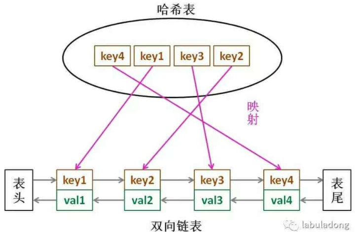

# [LC146. LRU 缓存机制](https://leetcode-cn.com/problems/lru-cache/)

运用你所掌握的数据结构，设计和实现一个 [LRU (最近最少使用) 缓存机制](https://baike.baidu.com/item/LRU) 。

LRU，Least Recently Used，也就是说我们认为最近使用过的数据应该是是「有用的」，很久都没用过的数据应该是无用的，内存满了就优先删那些很久没用过的数据。

实现 `LRUCache` 类：

- `LRUCache(int capacity)` 以正整数作为容量 `capacity` 初始化 LRU 缓存
- `int get(int key)` 如果关键字 `key` 存在于缓存中，则返回关键字的值，否则返回 `-1` 。
- `void put(int key, int value)` 如果关键字已经存在，则变更其数据值；如果关键字不存在，则插入该组「关键字-值」。**当缓存容量达到上限时，它应该在写入新数据之前删除最久未使用的数据值，从而为新的数据值留出空间。**

**进阶**：你是否可以在 `O(1)` 时间复杂度内完成这两种操作？

**示例：**

```java
输入
["LRUCache", "put", "put", "get", "put", "get", "put", "get", "get", "get"]
[[2], [1, 1], [2, 2], [1], [3, 3], [2], [4, 4], [1], [3], [4]]
输出
[null, null, null, 1, null, -1, null, -1, 3, 4]

解释
LRUCache lRUCache = new LRUCache(2);
lRUCache.put(1, 1); // 缓存是 {1=1}
lRUCache.put(2, 2); // 缓存是 {1=1, 2=2}
lRUCache.get(1);    // 返回 1
lRUCache.put(3, 3); // 该操作会使得关键字 2 作废，缓存是 {1=1, 3=3}
lRUCache.get(2);    // 返回 -1 (未找到)
lRUCache.put(4, 4); // 该操作会使得关键字 1 作废，缓存是 {4=4, 3=3}
lRUCache.get(1);    // 返回 -1 (未找到)
lRUCache.get(3);    // 返回 3
lRUCache.get(4);    // 返回 4
```

**提示：**

- `1 <= capacity <= 3000`
- `0 <= key <= 10000`
- `0 <= value <= 105`
- 最多调用 `2 * 105` 次 `get` 和 `put`

函数签名：

```java
class LRUCache {

    public LRUCache(int capacity) {

    }
    
    public int get(int key) {

    }
    
    public void put(int key, int value) {

    }
}

/**
 * Your LRUCache object will be instantiated and called as such:
 * LRUCache obj = new LRUCache(capacity);
 * int param_1 = obj.get(key);
 * obj.put(key,value);
 */
```

## 思路

要让 `put` 和 `get` 方法的时间复杂度为 O(1)，我们可以总结出 `cache` 这个数据结构必要的条件：

1、显然 `cache` 中的元素必须有时序，以区分最近使用的和久未使用的数据，当容量满了之后要删除最久未使用的那个元素腾位置。

2、我们要在 `cache` 中快速找某个 `key` 是否已存在并得到对应的 `val`；

3、每次访问 `cache` 中的某个 `key`，需要将这个元素变为最近使用的，也就是说 `cache` 要支持在任意位置快速插入和删除元素。

数据结构同时符合上述条件呢？哈希表查找快，但是数据无固定顺序；链表有顺序之分，插入删除快，但是查找慢。所以结合一下，形成一种新的数据结构：**哈希链表 `LinkedHashMap`**。



1、如果我们每次默认从链表尾部添加元素，那么显然越靠尾部的元素就是最近使用的，越靠头部的元素就是最久未使用的。

2、对于某一个 `key`，我们可以通过哈希表快速定位到链表中的节点，从而取得对应 `val`。

3、链表显然是支持在任意位置快速插入和删除的，改改指针就行。只不过传统的链表无法按照索引快速访问某一个位置的元素，而这里借助哈希表，可以通过 `key` 快速映射到任意一个链表节点，然后进行插入和删除。

**为什么必须要用双向链表**？因为我们需要删除操作。删除一个节点不光要得到该节点本身的指针，也需要操作其前驱节点的指针，而双向链表才能支持直接查找前驱，保证操作的时间复杂度 O(1)。

## Solution：LinkedHashMap（不推荐）

LinkedHashMap使用：队首为最久未使用元素，队尾为最近使用元素

插入元素至队尾: put(key, val);

获取队首元素：map.entrySet().iterator().next();

```java
class LRUCache {
    int capacity;
    LinkedHashMap<Integer, Integer> cache;
    public LRUCache(int capacity) {
        this.capacity = capacity;
        cache = new LinkedHashMap<>();
    }
    
    public int get(int key) {
        if(!cache.containsKey(key))
            return -1;
        makeRecentlyUsed(key);
        return cache.get(key);
    }
    
    public void put(int key, int value) {
        if(cache.containsKey(key)){//已存在，覆盖同key的value
            cache.put(key, value);//还是原先key所在的位置
            makeRecentlyUsed(key);//移动到队尾
        } else {//不存在，需要添加
            if(cache.size()==capacity){
                int oldestKey = cache.keySet().iterator().next();
                cache.remove(oldestKey);//删除队首元素
            }
            cache.put(key, value);//放入队尾
        }
    }

    // 将 key 变为最近使用
    private void makeRecentlyUsed(int key){
        int value = cache.get(key);
        cache.remove(key);
        cache.put(key, value);//放入队尾
    }
}
```

## Solution：手撸双向链表+哈希表

LRU 缓存机制可以通过哈希表辅以双向链表实现，我们用一个哈希表和一个双向链表维护所有在缓存中的键值对。

- 双向链表按照被使用的顺序存储了这些键值对，靠近尾部部的键值对是最近使用的，而靠近头部的键值对是最久未使用的。


- 哈希表即为普通的哈希映射（HashMap），通过缓存数据的键映射到其在双向链表中的位置。


```java
class LRUCache {
    class DoubleNode{
        int key, val;
        DoubleNode prev, next;
        public DoubleNode(){}
        public DoubleNode(int key, int val){
            this.key = key;
            this.val = val;
        }
    }
    private void remove(DoubleNode node){
        node.prev.next = node.next;
        node.next.prev = node.prev;
        //node.next = null;
        //node.prev = null;
    }
    private void addToLast(DoubleNode node){
        node.next = dummyLast;
        node.prev = dummyLast.prev;
        dummyLast.prev.next = node;
        dummyLast.prev = node;
    }

    DoubleNode dummyHead, dummyLast;//虚假的队首(最久未使用)及队尾（最近使用）
    Map<Integer, DoubleNode> cache;
    int capacity;
    public LRUCache(int capacity) {
        this.capacity = capacity;
        cache = new HashMap<>();
        dummyHead = new DoubleNode();
        dummyLast = new DoubleNode();
        dummyHead.next = dummyLast;
        dummyLast.prev = dummyHead;
    }
    
    public int get(int key) {
        if(!cache.containsKey(key)){
            return -1;
        }
        DoubleNode node = cache.get(key);
        //下面两步等于makeRecentlyUsed更新时序
        remove(node);//从双向链表中删除
        addToLast(node);//重新加入双向链表的队尾表示最近使用过
        return node.val;
    }
    
    public void put(int key, int value) {
        if(cache.containsKey(key)){//替换
            DoubleNode oldNode = cache.get(key);
            //makeRecentlyUsed更新时序
            remove(oldNode);
            addToLast(oldNode);
            oldNode.val = value;//替换值
        } else {//加入
            if(cache.size()==capacity){
                //删除
                DoubleNode delNode = dummyHead.next;
                remove(delNode);
                cache.remove(delNode.key);
            }
            //新增
            DoubleNode newNode = new DoubleNode(key, value);
            addToLast(newNode);
            cache.put(key, newNode);
        }
    }
}
```

put、get时间复杂度均为O(1);

# [LC460. LFU 缓存](https://leetcode-cn.com/problems/lfu-cache/)

请你为 [最不经常使用（LFU）](https://baike.baidu.com/item/缓存算法)缓存算法设计并实现数据结构。

实现 `LFUCache` 类：

- `LFUCache(int capacity)` - 用数据结构的容量 `capacity` 初始化对象
- `int get(int key)` - 如果键存在于缓存中，则获取键的值，否则返回 -1。
- `void put(int key, int value)` - 如果键已存在，则变更其值；如果键不存在，请插入键值对。当缓存达到其容量时，则应该在插入新项之前，使最不经常使用的项无效。在此问题中，当存在平局（即两个或更多个键具有相同使用频率）时，应该去除 **最近最久未使用** 的键。

**注意**「项的使用次数」就是自插入该项以来对其调用 `get` 和 `put` 函数的次数之和。使用次数会在对应项被移除后置为 0 。

为了确定最不常使用的键，可以为缓存中的每个键维护一个 **使用计数器** 。使用计数最小的键是最久未使用的键。

当一个键首次插入到缓存中时，它的使用计数器被设置为 `1` (由于 put 操作)。对缓存中的键执行 `get` 或 `put` 操作，使用计数器的值将会递增。

**示例：**

```java
输入：
["LFUCache", "put", "put", "get", "put", "get", "get", "put", "get", "get", "get"]
[[2], [1, 1], [2, 2], [1], [3, 3], [2], [3], [4, 4], [1], [3], [4]]
输出：
[null, null, null, 1, null, -1, 3, null, -1, 3, 4]

解释：
// cnt(x) = 键 x 的使用计数
// cache=[] 将显示最后一次使用的顺序（最左边的元素是最近的）
LFUCache lFUCache = new LFUCache(2);
lFUCache.put(1, 1);   // cache=[1,_], cnt(1)=1
lFUCache.put(2, 2);   // cache=[2,1], cnt(2)=1, cnt(1)=1
lFUCache.get(1);      // 返回 1
                      // cache=[1,2], cnt(2)=1, cnt(1)=2
lFUCache.put(3, 3);   // 去除键 2 ，因为 cnt(2)=1 ，使用计数最小
                      // cache=[3,1], cnt(3)=1, cnt(1)=2
lFUCache.get(2);      // 返回 -1（未找到）
lFUCache.get(3);      // 返回 3
                      // cache=[3,1], cnt(3)=2, cnt(1)=2
lFUCache.put(4, 4);   // 去除键 1 ，1 和 3 的 cnt 相同，但 1 最久未使用
                      // cache=[4,3], cnt(4)=1, cnt(3)=2
lFUCache.get(1);      // 返回 -1（未找到）
lFUCache.get(3);      // 返回 3
                      // cache=[3,4], cnt(4)=1, cnt(3)=3
lFUCache.get(4);      // 返回 4
                      // cache=[3,4], cnt(4)=2, cnt(3)=3
```

get、put方法使用O(1)时间