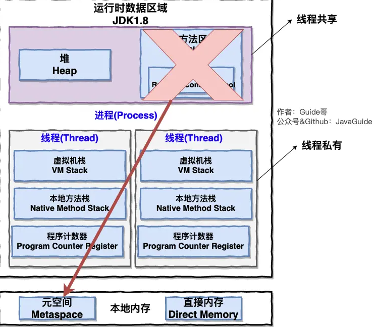

# 操作系统

------

## 操作系统基础

### 定义

1. **操作系统本质上是一个运行在计算机上的软件程序 ，用于管理计算机硬件和软件资源。** 运行在电脑上的所有应用程序都通过操作系统来调用系统内存以及磁盘等等硬件。
2. 操作系统的存在**屏蔽了硬件层的复杂性**。
3. **操作系统的内核（Kernel）是操作系统的核心部分，它负责系统的内存管理，硬件设备的管理，文件系统的管理以及应用程序的管理**。 内核是连接应用程序和硬件的桥梁，决定着系统的性能和稳定性。

### CPU vs Kernel(内核)

很多人容易无法区分操作系统的内核（Kernel）和中央处理器（CPU），你可以简单从下面两点来区别：

1. 操作系统的内核（Kernel）属于操作系统层面，而 CPU 属于硬件。
2. CPU 主要提供运算，处理各种指令的能力。内核（Kernel）主要负责系统管理比如内存管理，它屏蔽了对硬件的操作。

### 系统调用

根据**进程访问资源**的特点，我们可以把进程在系统上的运行分为两个级别：

1. **用户态 user mode**: 用户态运行的**进程**可以直接**读取用户程序的数据**。

2. **系统态(内核态) kernel mode**: 系统态运行的**进程或程序**几乎可以访问计算机的**任何资源**，不受限制。

    

**什么是系统调用呢？**

我们的**程序**基本都是**运行在用户态**，我们调用**操作系统提供的系统态级别的子功能**就需要**系统调用**了。凡是与**系统态级别的资源有关的操作**（如**文件管理、进程控制、内存管理**等)，都必须**通过系统调用方式向操作系统提出服务请求**，并由操作系统代为完成。

这些系统调用按功能大致可分为如下几类：

- **设备管理**。完成设备的请求或释放，以及设备启动等功能。
- **文件管理**。完成文件的读、写、创建及删除等功能。
- **进程控制**。完成**进程的创建、撤销、阻塞及唤醒**等功能。
- **进程间通信**。完成进程之间的消息传递或信号传递等功能。
- **内存管理**。完成内存的分配、回收以及获取作业占用内存区大小及地址等功能。

## 进程和线程

### 进程与线程的区别

一个**进程**在其执行的过程中**可以产生多个线程**。

线程和进程最大的不同在于基本上**各进程是独立的**，而**各线程则不一定是独立**的，因为**同一进程中的线程极有可能会相互影响**。

**线程**执行**开销小**，但**不利于资源的管理和保护**；而进程正相反。

> 如果你对 Java 内存区域 (运行时数据区) 这部分知识不太了解的话可以阅读一下这篇文章：[《可能是把 Java 内存区域讲的最清楚的一篇文章》](https://snailclimb.gitee.io/javaguide/#/docs/java/jvm/Java内存区域)

以JVM为例**一个进程有多个线程**，多个线程**共享进程**的**堆**和**方法区 (JDK1.8 之后的元空间)**资源，但是每个线程有自己的**程序计数器**、**虚拟机栈** 和 **本地方法栈**。

### 进程有哪几种状态?

我们一般把进程大致分为 5 种状态，这一点和[线程](https://github.com/Snailclimb/JavaGuide/blob/master/docs/java/Multithread/JavaConcurrencyBasicsCommonInterviewQuestionsSummary.md#6-说说线程的生命周期和状态)很像！

- **创建状态(new)** ：进程**正在被创建**，**尚未到就绪状态**。
- **就绪状态(ready)** ：进程已处于**准备运行状态**，即进程**获得了除了处理器之外**的**一切所需资源**，一旦得到处理器资源(处理器分配的时间片)即可运行。
- **运行状态(running)** ：进程**正在处理器(内核)上运行**(单核 CPU 下任意时刻只有一个进程处于运行状态)。
- **阻塞状态(waiting)** ：又称为等待状态，**进程正在等待某一事件而暂停运行**，如等待某资源为可用或等待 IO 操作完成。即使处理器空闲，该进程也不能运行。
- **结束状态(terminated)** ：进程正在从系统中消失。可能是进程正常结束或其他原因中断退出运行。

> 订正：下图中 running 状态被 interrupt 向 ready 状态转换的箭头方向反了。

### 线程间同步的方式

当两个或多个**共享关键资源的线程的并发**执行，同步线程以**避免关键的资源使用冲突**。操作系统一般有下面三种线程同步的方式：

1. **互斥量(Mutex)**：采用**互斥对象机制**，只有拥有互斥对象的线程才有访问公共资源的权限。因为互斥对象只有一个，所以可以保证公共资源不会被多个线程同时访问。比如 Java 中的 **synchronized** 关键词和各种 **Lock** 都是这种机制。
2. **信号量(Semphares)** ：它**允许同一时刻多个线程访问同一资源**，但是需要控制同一时刻访问此资源的**最大线程数量**
3. **事件(Event)** :**Wait/Notify**：通过通知操作的方式来保持多线程同步，还可以方便的实现多线程优先级的比较操作

### 进程间通信的方式

参考：https://www.jianshu.com/p/c1015f5ffa74

1. **管道/匿名管道(Pipes)** ：用于具有亲缘关系的**父子进程间**或者**兄弟进程间**的通信，存在于**内存中**的文件。

2. **有名管道(Names Pipes)** : 匿名管道由于**没有名字**，只能用于亲缘关系的进程间通信。为了克服这个缺点，提出了有名管道。有名管道严格遵循**先进先出(FIFO)**。有名管道存在于**磁盘介质或者文件系统**中，可以实现本机任意两个进程通信。

3. **信号(Signal)** ：信号是一种比较复杂的通信方式，用于**通知接收进程某个事件已经发生**；

4. **消息队列(Message Queuing)** ：

    消息队列是**消息的链表**(先进先出FIFO), 消息队列可以实现消息的**随机查询**,消息不一定要以先进先出的次序读取, 也可以按**消息的类型读取**, 比 FIFO 更有优势。

    存放在**内核中**并由消息队列标识符标识, 只有在**内核重启**(即**操作系统重启**)或者**显示地删除一个消息队列时**，该消息队列才会被真正的删除。

    **消息队列克服了信号承载信息量少，管道只能承载无格式字 节流以及缓冲区大小受限等缺。**

5. **信号量(Semaphores)** ：信号量是一个**计数器**，用于**多进程对共享数据的访问**，信号量的意图在于**进程间同步**。这种通信方式主要用于解决与同步并发相关的问题并避免竞争条件。

6. **共享内存(Shared memory)** ：使得**多个进程可以访问的同一块内存空间**，不同进程可以及时看到对方进程中对共享内存中数据的更新。这种方式需要**依靠某种同步操作**，如**互斥锁**和**信号量**等。可以说这是**最有用的进程间通信方式**。

7. **套接字(Sockets)** : 此方法主要用于在**客户端和服务器之间**通过网络进行通信。套接字是支持 TCP/IP 的网络通信的基本操作单元，可以看做是**不同主机之间的进程进行双向通信的端点**，简单的说就是通信的两方的一种约定，用套接字中的相关函数来完成通信过程。

### 进程的调度算法

为了确定**进程的执行顺序**以实现**最大 CPU 利用率**，可以采用一些算法：

- **先到先服务(FCFS)调度算法** : 从就绪队列中选择一个**最先进入该队列的进程**为之分配资源，使它立即执行并一直执行到完成或发生某事件而被阻塞放弃占用 CPU 时再重新调度。

- **短作业优先(SJF)的调度算法** : 从就绪队列中选出一个**估计运行时间最短的进程**为之分配资源，使它立即执行并一直执行到完成或发生某事件而被阻塞放弃占用 CPU 时再重新调度。

    缺点：仅照顾了**短进程**而**忽略了优先级**。

- **时间片轮转调度算法** : **每个进程被分配一个时间段**，称作它的时间片，即**该进程允许运行的时间**。

- **优先级调度** ： 为每个流程分配优先级，首先执行具有最高优先级的进程，依此类推。具有相同优先级的进程以 FCFS 方式执行。可以根据内存要求，时间要求或任何其他资源要求来确定优先级。

    缺点：仅照顾了优先级而短进程会被滞后完成

- **多级反馈队列调度算法** ：多级反馈队列调度算法既能使**高优先级**的**进程得到响应**又能使**短作业（进程）迅速完成**。因而它是目前**被公认的一种较好的进程调度算法**，UNIX 操作系统采取的便是这种调度算法。

    

    **1、**设有N个队列（Q1,Q2....QN），其中各个队列对于[处理机](https://baike.baidu.com/item/处理机)的[优先级](https://baike.baidu.com/item/优先级/5643121)是不一样的，也就是说位于各个队列中的作业(进程)的优先级也是不一样的。一般来说，优先级Priority(Q1) > Priority(Q2) > ... > Priority(QN)。怎么讲，位于Q1中的任何一个作业(进程)都要比Q2中的任何一个作业(进程)相对于CPU的优先级要高（也就是说，Q1中的作业一定要比Q2中的作业先被[处理机调度](https://baike.baidu.com/item/处理机调度)），依次类推其它的队列。

    **2、**对于优先级最低的队列来说，里面是遵循[时间片轮转](https://baike.baidu.com/item/时间片轮转)法。也就是说，位于队列QN中有M个作业，它们的运行时间是通过QN这个队列所设定的[时间片](https://baike.baidu.com/item/时间片/6525414)来确定的；对于其他队列，遵循的是先来先服务算法，每一进程分配一定的时间片，若时间片运行完时进程未结束，则进入下一优先级队列的末尾。

    **3、**各个队列的时间片是一样的吗？不一样，这就是该算法设计的精妙之处。**优先级越高的队列中它的时间片就越短**。同时，为了便于那些超大作业的完成，最后一个队列QN(优先级最低的队列)的时间片一般很大(不需要考虑这个问题)。

### 什么是死锁

如果系统中以下**四个条件同时成立**，那么就能引起死锁：

- **互斥**：资源必须处于**非共享模式**，即**一次只有一个进程可以使用**。如果另一进程申请该资源，那么必须等待直到该资源被释放为止。
- **占有并等待**：一个进程至少应该占有一个资源，并等待另一资源，而**该资源被其他进程所占有。**
- **非抢占**：资源不能被抢占。**只能在持有资源的进程完成任务后，该资源才会被释放。**
- **循环等待**：有一组等待进程 `{P0, P1,..., Pn}`， `P0` 等待的资源被 `P1` 占有，`P1` 等待的资源被 `P2` 占有，......，`Pn-1` 等待的资源被 `Pn` 占有，`Pn` 等待的资源被 `P0` 占有。

## 内存管理

### 操作系统的内存管理是什么

操作系统的内存管理主要负责1⃣️**内存的分配与回收**（**malloc 函数：申请内存，free 函数：释放内存**）；2⃣️**地址转换**(将**逻辑地址**转换成相应的**物理地址**)等功能也是操作系统内存管理做的事情。

### 逻辑(虚拟)地址和物理地址

在Java语言中，指针指向的就是一个**逻辑地址**，它会被映射到**物理地址**，即**内存地址寄存器中的地址**。

### 常见的几种内存管理机制

简单分为**连续分配管理方式**和**非连续分配管理方式**这两种。

**连续分配管理**方式是指为一个用户**程序**分配一个**连续的内存空间**，常见的如 **块式管理** 。**非连续分配管理**方式允许一个**程序**使用的内存**分布在离散的内存中**，常见的如**页式管理** 和 **段式管理**。

1. **块式管理** ：远古时代的计算机操系统的内存管理方式。**将内存分为几个固定大小的块，每个块中只包含一个<u>进程</u>**。如果程序运行需要内存的话，操作系统就分配给它一块，**如果程序运行只需要很小的空间的话，分配的这块内存很大一部分几乎被浪费了**。在每个块中**未被利用的空间**称为**碎片**。

2. **页式管理** ：把主存分为大小**相等且固定的一页一页的形式**，相比于块式管理的**划分力度更大**，**提高了内存利用率，减少了碎片**。页式管理通过**页表对应逻辑地址和物理地址**。

    **缺点**：页式管理虽然提高了内存利用率，但是**页式管理其中的页实际并无任何实际意义**。

3. **段式管理** ：段式管理把主存分为一段段的，**段的大小不固定**，取决于我们当前运行的程序。但是，**段是有实际意义的**，**每个段定义了一组逻辑信息**，例如,有主程序段 MAIN、子程序段 X、数据段 D 及栈段 S 等。 段式管理通过**段表对应逻辑地址和物理地址**。

4. **段页式管理机制** ：结合了段式管理和页式管理的优点。简单来说段页式管理机制就是把**主存先分成若干段，每个段又分成若干页**，也就是说**段与段之间**以及**段的内部**的都是**离散**的。

### 页式管理中的快表和多级页表

为了提高内存的空间性能，提出了多级页表的概念；但是提高空间性能是以浪费时间性能为基础的，因此为了补充损失的时间性能，提出了快表（即 TLB）的概念。 不论是快表还是多级页表实际上都利用到了程序的局部性原理，局部性原理在后面的虚拟内存这部分会介绍到。

#### 快表 - cache

操作系统在 **页表方案** 基础之上引入了 **快表** 来<u>**加速虚拟地址到物理地址的转换**</u>。我们可以把快表理解为一种特殊的**高速缓冲存储器**（**Cache**），其中的**内容是页表的一部分或者全部内容**。作为页表的 Cache，它的作用与页表相似，但是**提高了访问速率**。由于**采用页表做地址转换**，**读写内存数据时 CPU 要访问两次主存**；有了**快表**，有时只要**访问一次高速缓冲存储器，一次主存**，这样可加速查找并提高指令执行速度。

使用快表之后的地址转换流程是这样的：（与缓存的机制相同）

1. 根据虚拟地址中的页号查快表；

    - 如果该页在快表中，直接从快表中读取相应的物理地址；

    - 如果该页不在快表中，就访问内存中的页表，再从页表中得到物理地址，同时将页表中的该映射表项添加到快表中；

2. 当快表填满后，又要登记新页时，就按照一定的淘汰策略淘汰掉快表中的一个页。

#### 多级页表

引入多级页表的主要目的是为了**避免把全部页表一直放在内存中**占用过多空间，特别是那些根本就不需要的页表就不保留在内存中。

如果**某个一级页表的页表项没有被用到**，也就不需要创建这个页表项对应的二级页表了，即可以在**需要时才创建二级页表**。

虚拟内存地址存在着局部性，那么负责映射虚拟内存地址的页表项当然也存在着**局部性**。根据局部性原理，如果第二级页表中，只有很少的一部分在某一时刻正在使用，那么就可以把二级页表都放在磁盘中，在**需要时才调入到内存**

多级页表就是典型的**时间换空间**的例子了，**动态创建二级页表、调入和调出二级页表**都是需要花费额外时间的，远没有不分级的页表来的直接；而我们也仅仅是利用**局部性原理**让这个额外时间开销降得比较低了而已。

> 参考：[多级页表如何节约内存](https://www.polarxiong.com/archives/多级页表如何节约内存.html)

### 分页机制vs分段机制的共同点和区别

1. 共同点：
    - 分页机制和分段机制都是为了**提高内存利用率，减少内存碎片**。
    - 页和段都是**离散存储**的，所以两者都是**离散分配内存**的方式。但是，**每个页和段中的内存是连续的**。
2. 区别：
    - 页的大小是固定的，由操作系统决定；而**段的大小不固定，取决于我们当前运行的程序**。
    - 分页仅仅是为了满足操作系统内存管理的需求，**页没有实际意义**，而**段是逻辑信息的单位**，在程序中可以体现为代码段，数据段，能够更好满足用户的需要。

### CPU 寻址了解吗?为什么需要虚拟地址空间?

> 参考：[虚拟寻址](https://docs.microsoft.com/zh-cn/windows-hardware/drivers/gettingstarted/virtual-address-spaces?redirectedfrom=MSDN)

没有虚拟地址空间的时候，**程序都是直接访问和操作的都是物理内存** 。会造成一些**问题**：

1. 用户程序可以访问任意内存，寻址内存的每个字节，这样就很容易（有意或者无意）破坏操作系统，造成操作系统崩溃。
2. 无法做到良好的内存管理，同时运行的两个程序可能会对同一块内存进行操作造成冲突。

现代处理器使用的是一种称为 **虚拟寻址(Virtual Addressing)** 的寻址方式。**使用虚拟寻址，CPU 需要将虚拟地址翻译成物理地址，这样才能访问到真实的物理内存。** 实际上完成虚拟地址转换为物理地址转换的硬件是 CPU 中含有一个被称为 **内存管理单元（Memory Management Unit, MMU）** 的硬件。如下图所示：

通过虚拟地址访问内存有以下优势：

- 程序可以使用一系列**相邻的虚拟地址来访问物理内存中不相邻的大内存缓冲区**。
- 程序可以使用一系列虚拟地址来**访问大于可用物理内存的内存缓冲区**。当物理内存的供应量变小时，内存管理器会将物理内存页（通常大小为 4 KB）保存到磁盘文件。数据或代码页会根据需要在物理内存与磁盘之间移动。
- **不同进程使用的虚拟地址彼此隔离**。一个进程中的代码无法更改正在由另一进程或操作系统使用的物理内存。

## 虚拟内存 - 时间换空间

**把硬盘的空间映射到内存的逻辑地址上，当内存来使用。**在程序执行过程中，当所访问的信息不在内存时，由操作系统将所需要的部分调入内存，然后继续执行程序。另一方面，操作系统将内存中暂时不使用的内容换到外存上，从而腾出空间存放将要调入内存的信息。这样，计算机好像为用户提供了一个比实际内存大的多的存储器——**虚拟内存**。

> 参考：[虚拟内存](https://juejin.cn/post/6844903507594575886)

通过 **虚拟内存** 可以让程序可以拥有超过系统物理内存大小的可用内存空间。另外，**虚拟内存为每个进程提供了一个一致的、私有的地址空间，它让每个进程产生了一种自己在独享主存的错觉（每个进程拥有一片连续完整的内存空间）**。这样会更加有效地管理内存并减少出错。**虚拟内存的重要意义是它定义了一个连续的虚拟地址空间**，并且 **把内存扩展到硬盘空间**，并且会被内存缓存（按需），有的操作系统还会在内存不够的情况下，将某一进程的内存全部放入硬盘空间中，并在切换到该进程时再从硬盘读取**

### 局部性原理

我们的程序在执行的时候往往呈现局部性规律，也就是说**在某个较短的时间段内，程序执行局限于某一小部分，程序访问的存储空间也局限于某个区域。**产生时间局部性的典型原因，是由于在**程序中存在着大量的循环操作**。

1. **时间局部性**是通过将近来使用的**指令和数据**保存到**高速缓存存储器中**，并使用高速缓存的层次结构实现。
2. **空间局部性** ：一旦程序访问了某个存储单元，在不久之后，其**附近的存储单元**也将被访问，即程序在**一段时间内所访问的地址**，可能**集中在一定的范围之内**，这是因为指令通常是顺序存放、顺序执行的，数据也一般是以向量、数组、表等形式簇聚存储的。**空间局部性**通常是使用较大的高速缓存，并将**预取机制集成到高速缓存控制逻辑中实现**。

局部性原理既适用于程序结构，也适用于数据结构。局部性原理是虚拟内存技术的基础，虚拟内存技术实际上就是建立了 “内存一外存”的两级存储器的结构，利用局部性原理实现髙速缓存。正是因为程序运行具有局部性原理，才可以只**装入部分程序到内存就开始运行**。

### 虚拟内存的技术实现

虚拟内存的实现需要建立在**离散分配的内存管理方式**的基础上。 虚拟内存的实现有以下三种方式：

1. **请求分页存储管理** ：建立在**分页管理**之上，为了支持虚拟存储器功能而增加了**<u>请求调页</u>**功能和**<u>页面置换</u>**功能。请求分页是目前最常用的一种实现虚拟存储器的方法。**在作业开始运行之前，仅装入当前要执行的部分段即可运行**。假如在作业运行的过程中发现**要访问的页面不在内存**，则**由处理器通知操作系统**按照对应的**<u>页面置换</u>算法将相应的页面调入到主存**，同时操作系统也可以将暂时不用的页面置换到外存中。
2. **请求分段存储管理** ：建立在**分段存储**管理之上，增加了**<u>请求调段功能、分段置换功能</u>**。请求分段储存管理方式就如同请求分页储存管理方式**一样**，在作业开始运行之前，仅装入当前要执行的部分段即可运行；在执行过程中，可使用**请求调段功能动态装入要访问但又不在内存的程序段**；当内存空间已满，而**又需要装入新的段时，根据置换功能适当调出某个段，以便腾出空间而装入新的段**。
3. **请求段页式存储管理**

#### **<u>请求分页</u>vs<u>分页存储管理</u>有何不同呢？**

**<u>请求分页存储管理</u>建立在<u>分页存储管理</u>之上**。他们的根本区别是**是否将程序全部所需的全部地址空间都装入主存**。

<u>**请求分页存储管理**</u>不要求将作业全部地址空间同时装入主存。基于这一点，请求分页存储管理可以提供虚存，而分页存储管理却不能提供虚存。

<u>**分页存储管理**</u>要求将作业全部地址空间同时装入主存。

### 页面置换算法

地址映射过程中，若在页面中发现**所要访问的页面不在内存中**，则发生**缺页中断** 。在这个时候，被内存映射的文件实际上成了一个**分页交换文件**。如果当前内存中并**没有空闲的页面**，操作系统就必须在内存**选择一个页面将其移出内存**，以便为即将调入的页面让出空间。用来选择淘汰哪一页的规则叫做页面置换算法，我们可以把页面置换算法看成是**淘汰页面的规则**。

- **OPT 页面置换算法（最佳页面置换算法）** ：最佳(Optimal, OPT)置换算法所选择的被淘汰页面将是**以后永不使用的**，或者是在**最长时间内不再被访问的页面**,这样可以保证获得最低的缺页率。但由于人们目前无法预知进程在内存下的若千页面中哪个是未来最长时间内不再被访问的，因而该算法无法实现。一般作为衡量其他置换算法的方法。
- **FIFO（First In First Out） 页面置换算法** : 总是**淘汰最先进入内存的页面**，即选择在**内存中驻留时间最久的页面进行淘汰**。
- **LRU （Least Recently Used）页面置换算法（最近最久未使用页面置换算法）** ：LRU算法赋予每个页面一个**访问字段**，用来**记录一个页面自上次被访问以来所经历的时间 T**，当须淘汰一个页面时，选择现有页面中其 **T 值最大**的，即**最久未使用**的页面予以淘汰。
- **LFU （Least Frequently Used）页面置换算法** : 该置换算法选择**使用最少的页面**作为淘汰页。

## I/0

### I/O多路复用: select, poll, epoll

https://www.cnblogs.com/aspirant/p/9166944.html

select，poll，epoll都是IO多路复用的机制。I/O多路复用就通过一种机制，可以**监视多个描述符fd**，一旦某个描述符fd就绪（一般是读就绪或者写就绪），能够通知程序进行相应的读写操作。**但select，poll，epoll本质上都是同步I/O，因为他们都需要在读写事件就绪后自己负责进行读写，也就是说这个<u>读写过程是阻塞</u>的**，而异步I/O则无需自己负责进行读写，异步I/O的实现会负责把数据从内核拷贝到用户空间。 

#### select==>时间复杂度O(n)

可监视的fd**数量被限制**，即能监听端口的大小有限。

**每次调用select，都需要把fd集合从用户态拷贝到内核态，同时每次调用select都需要在内核遍历传递进来的所有fd, 有I/O事件发生时,  把fd集合从内核态拷贝回用户态**

它仅仅知道了，**有I/O事件发生**了，却并**不知道是哪那几个流**（可能有一个，多个，甚至全部），我们只能**无差别轮询所有流**，找出能读出数据，或者写入数据的流，对他们进行操作。所以**select具有O(n)的无差别轮询复杂度**，同时处理的流越多，无差别轮询时间就越长。

#### poll==>时间复杂度O(n)

**poll的实现和select非常相似**，只是描述fd集合的方式不同, **它没有最大连接数的限制**，原因是它是基于**链表来存储的.**

poll本质上和select没有区别，它将用户传入的**数组**拷贝到内核空间，然后**遍历查询每个描述符fd对应的设备状态**，如果**设备就绪**则在设备等待队列中加入一项并继续遍历，如果遍历完所有fd后没有发现就绪设备，则挂起当前进程，直到设备就绪或者主动超时，被唤醒后它又要**再次遍历fd**。这个过程经历了多次无谓的遍历。

#### epoll==>时间复杂度O(1)

**epoll可以理解为event poll**，不同于忙轮询和无差别轮询，epoll会把哪个流发生了怎样的I/O事件通知我们。

epoll提供了三个函数，epoll_create,epoll_ctl和epoll_wait，epoll_create是创建一个epoll句柄；epoll_ctl是注册要监听的事件类型；epoll_wait则是等待事件的产生。epoll使用**“事件”的就绪通知**方式，通过epoll_ctl注册fd，**一旦该fd就绪**，内核就会采用类似**callback的回调机制来激活该fd**，**epoll_wait便可以收到通知**。所以我们说epoll实际上是**事件驱动（每个事件关联上fd）**的，此时我们对这些流的操作都是有意义的。**（复杂度降低到了O(1)）**

每次注册新的事件到epoll句柄中时（在epoll_ctl中指定EPOLL_CTL_ADD），会把所有的fd拷贝进内核，而不是在epoll_wait的时候重复拷贝。epoll保证了每个fd在整个过程中只会拷贝一次。epoll的解决方案不像select或poll一样每次都把current轮流加入fd对应的设备等待队列中，而只在epoll_ctl时把current挂一遍（这一遍必不可少）并为每个fd指定一个回调函数，当设备就绪，唤醒等待队列上的等待者时，就会调用这个回调函数，而这个回调函数会把就绪的fd加入一个就绪链表）。epoll_wait的工作实际上就是在这个就绪链表中查看有没有就绪的fd

epoll有EPOLLLT和EPOLLET两种触发模式，LT是默认的模式，ET是“高速”模式:

- LT模式下，只要这个fd还有数据可读，每次 epoll_wait都会返回它的事件，提醒用户程序去操作

- 而在ET（边缘触发）模式中，它只会提示一次，直到下次再有数据流入之前都不会再提示了，无 论fd中是否还有数据可读。所以在ET模式下，read一个fd的时候一定要把它的buffer读光，也就是说一直读到read的返回值小于请求值

#### 三者比较:

**综上，在选择select，poll，epoll时要根据具体的使用场合以及这三种方式的自身特点。**

**表面上看epoll的性能最好，但是在<u>连接数少</u>并且连接都十分<u>活跃</u>的情况下，select和poll的性能可能比epoll好，毕竟epoll的<u>通知机制</u>需要很多<u>函数回调</u>。**

