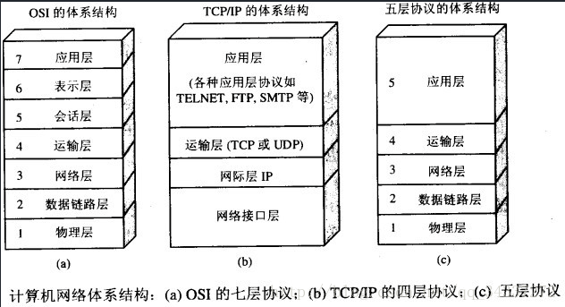
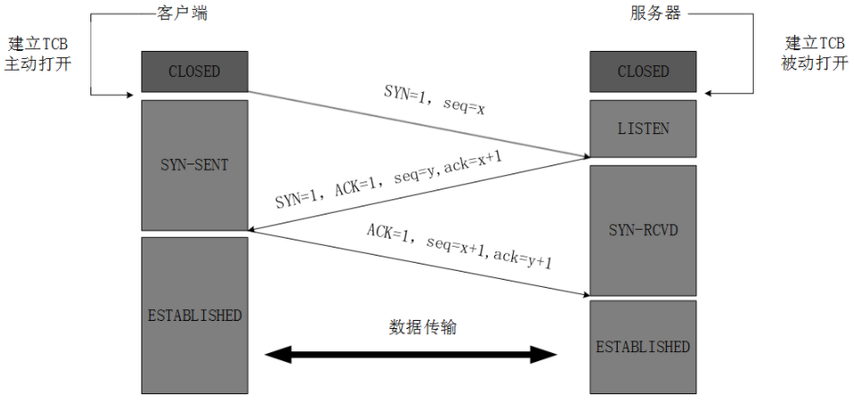
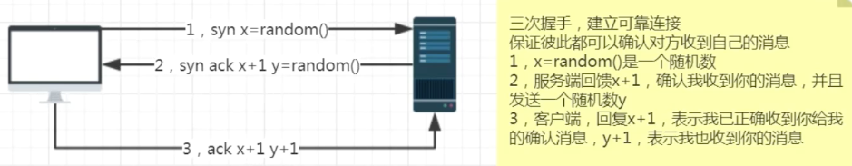
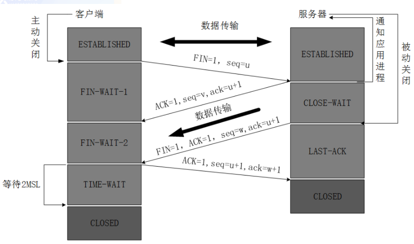
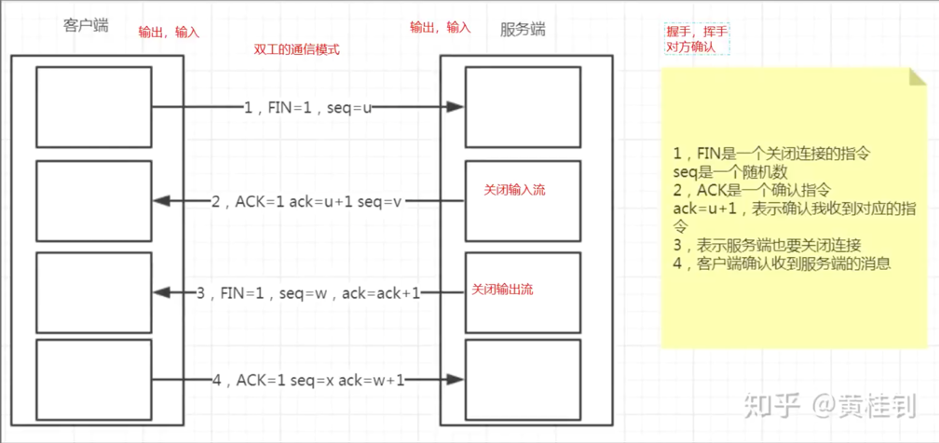
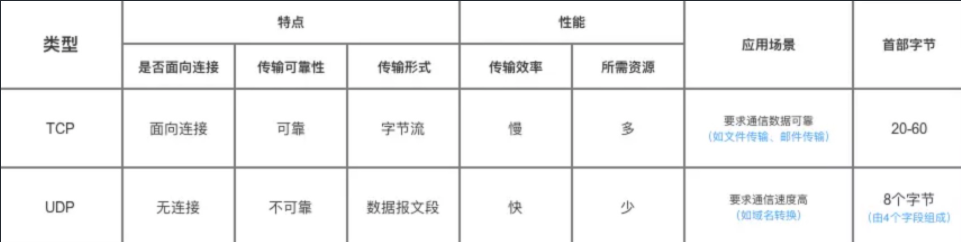
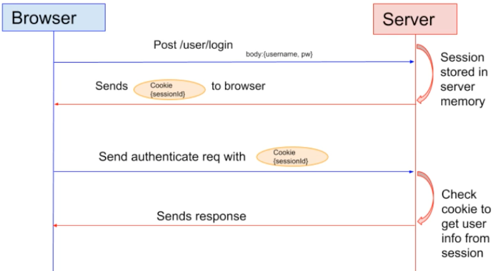
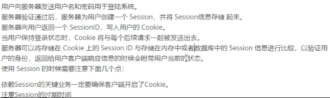
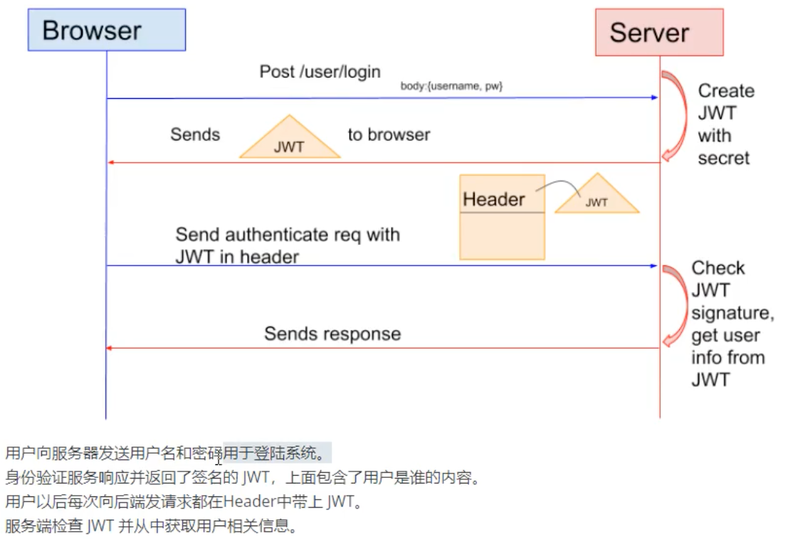
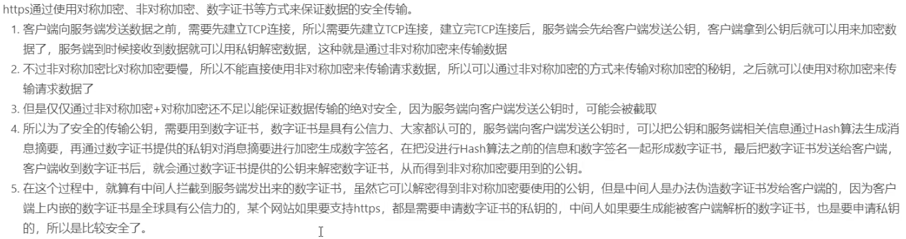

# 计算机网络

[toc]

------

## OSI与TCP/IP各层的结构与功能,都有哪些协议?

学习计算机网络时我们一般采用折中的办法，也就是中和 OSI 和 TCP/IP 的优点，采用一种只有**五层协议**的体系结构，这样既简洁又能将概念阐述清楚。



七层体系结构图


### 应用层 Application Layer

**应用层的任务是通过应用进程process间的交互来完成特定网络应用。**应用层协议定义的是应用**进程间**（进程：主机中正在运行的程序）的通信和交互的规则。对于不同的网络应用需要不同的应用层协议。在互联网中应用层协议很多，如**域名系统DNS(将域名和IP地址相互映射的一个分布式数据库)**，支持万维网应用的 **HTTP协议**，支持电子邮件的 **SMTP协议**等等。我们把应用层交互的数据单元称为**报文**。

### 运输层 Transport Layer

**运输层的主要任务就是负责向两台主机进程之间的通信提供通用的数据传输服务**。应用进程利用该服务传送应用层报文。“通用的”是指并不针对某一个特定的网络应用，而是多种应用可以使用同一个运输层服务。由于一台主机可同时运行多个**线程**，因此运输层有**复用和分用**的功能。所谓**复用**就是指多个应用层进程可同时使用下面运输层的服务; **分用**和复用相反，是运输层把收到的信息分别交付上面应用层中的相应进程。

**运输层主要使用以下两种协议:**

1. **传输控制协议 TCP**（Transmission Control Protocol）--提供**面向连接**的，**可靠的**数据传输服务。
2. **用户数据协议 UDP**（User Datagram Protocol）--提供**无连接**的，尽最大努力的数据传输服务（**不保证数据传输的可靠性**）。

### 网络层 Network Layer

**在计算机网络中进行通信的两个计算机之间可能会经过很多个数据链路Data Link，也可能还要经过很多通信子网。网络层的任务就是选择合适的网间路由和交换结点， 确保数据及时传送。** 在发送数据时，网络层把运输层产生的报文段或用户数据报封装成分组和包进行传送。在 TCP/IP 体系结构中，由于网络层使用 **IP 协议**，因此分组也叫 **IP 数据报** ，简称 **数据报**。

这里要注意：**不要把运输层的“用户数据报 UDP ”和网络层的“ IP 数据报”弄混**。另外，无论是哪一层的数据单元，都可笼统地用“分组”来表示。

### 数据链路层 Data Link Layer

**数据链路层(data link layer)通常简称为链路层。两台主机之间的数据传输，总是在一段一段的链路上传送的，这就需要使用专门的链路层的协议。** 在两个相邻节点之间传送数据时，**数据链路层将网络层交下来的 IP 数据报组装成帧**，在两个相邻节点间的链路上**传送帧**。每一帧包括数据和必要的控制信息（如同步信息，地址信息，差错控制等）。

在接收数据时，控制信息使接收端能够知道一个帧从哪个比特开始和到哪个比特结束。这样，数据链路层在收到一个帧后，就可从中提出数据部分，上交给网络层。 控制信息还使接收端能够检测到所收到的帧中有无差错。如果发现差错，数据链路层就简单地丢弃这个出了差错的帧，以避免继续在网络中传送下去白白浪费网络资源。如果需要改正数据在链路层传输时出现差错（这就是说，数据链路层不仅要检错，而且还要纠错），那么就要采用可靠性传输协议来纠正出现的差错。这种方法会使链路层的协议复杂些。

### 物理层 Physical Layer

在物理层上所传送的数据单位是**比特**。

**物理层(physical layer)的作用是实现相邻计算机节点之间比特流的透明传送，尽可能屏蔽掉具体传输介质和物理设备的差异，** 使其上面的数据链路层不必考虑网络的具体传输介质是什么。“透明传送比特流”表示经实际电路传送后的比特流没有发生变化，对传送的比特流来说，这个电路好像是看不见的。

## TCP - 传输控制协议

参考资料：https://blog.csdn.net/qzcsu/article/details/72861891

https://github.com/Snailclimb/JavaGuide/blob/master/docs/network/%E8%AE%A1%E7%AE%97%E6%9C%BA%E7%BD%91%E7%BB%9C.md#%E4%BA%8C-tcp-%E4%B8%89%E6%AC%A1%E6%8F%A1%E6%89%8B%E5%92%8C%E5%9B%9B%E6%AC%A1%E6%8C%A5%E6%89%8B%E9%9D%A2%E8%AF%95%E5%B8%B8%E5%AE%A2

### 三次握手 - 建立连接





**三次握手的目的是建立可<u>靠的通信信道</u>，双方确认自己与对方的<u>发送与接收</u>是正常的。**

第一次握手：**Server** 确认了：**Server接收**正常，**Client发送**正常；

第二次握手：**Client** 确认了：**Client发送、接收**正常，**Server发送、接收**正常；

第三次握手：**Server** 确认了：**Server发送**正常，**Client接收**正常

#### 不要第三次握手会怎么样  

 答：如果是两次握手，假设服务器给[客户端]()在第二次握手时发送(回传)据，数据从服务器发出，服务器认为连接已经建立，但在发送数据的过程中数据丢失，[客户端]()认为连接没有建立，会进行重传。假设每次发送的数据(服务器回传给客户端的)一直在丢失，[客户端]()一直SYN，服务器就会产生多个无效连接，占用资源，这个时候服务器可能会挂掉。这个现象就是我们听过的“SYN的洪水攻击”。 

#### 第2次握手传回了ACK，为什么还要传回SYN？

Server传回ACK是为了告诉Client，我接收到的信息确实就是你所发送的信号了，这表明从Client端到Server端的通信是正常的（确认了**client发送**，**server接收**）；

Server回传SYN则是为了建立并确认从Server端到Client端的通信（为了确认**server发送**，**client接收正常**）。

#### 为什么Client最后还要发送一次ACK呢？

一句话，主要防止已经失效的连接请求报文突然又传送到了服务器，从而产生错误。

如果使用的是两次握手建立连接，假设有这样一种场景，**客户端发送了第一个请求连接并且没有丢失，只是因为在网络结点中滞留的时间太长了**，由于TCP的客户端迟迟没有收到确认报文，以为服务器没有收到，此时重新向服务器发送这条报文，此后客户端和服务器经过两次握手完成连接，传输数据，然后关闭连接。此时此前滞留的那一次请求连接，网络通畅了到达了服务器，这个报文本该是失效的，但是，两次握手的机制将会让客户端和服务器再次建立连接，这将导致不必要的错误和资源的浪费。

如果采用的是三次握手，就算是那一次失效的报文传送过来了，服务端接受到了那条失效报文并且回复了确认报文，但是客户端不会再次发出确认。由于服务器收不到确认，就知道客户端并没有请求连接。


### 四次挥手 - 断开连接





任何一方都可以在数据传送结束后发出连接释放的通知，待对方确认后进入半关闭状态。当另一方也没有数据再发送的时候，则发出连接释放通知，对方确认后就完全关闭了TCP连接，例如：

- Client：发送一个 FIN，用来关闭Client到Server的连接
- Server：收到这个 FIN，它发回一 个 ACK，确认序号为收到的序号加1 。和 SYN 一样，一个 FIN 将占用一个序号
- Server：关闭与客户端的连接，发送一个FIN给Client
- Client：发回 ACK 报文确认，并将确认序号设置为收到序号加1

#### 为什么Client最后还要等待2MSL？

MSL（Maximum Segment Lifetime），TCP允许不同的实现可以设置不同的MSL值。

第一，保证客户端发送的最后一个ACK报文能够到达服务器，因为这个ACK报文可能丢失，站在服务器的角度看来，我已经发送了FIN+ACK报文请求断开了，客户端还没有给我回应，应该是我发送的请求断开报文它没有收到，于是服务器又会重新发送一次，而**客户端就能在这个2MSL时间段内收到这个重传的报文**，接着给出回应报文，并且会重启2MSL计时器。

第二，防止类似与“三次握手”中提到了的“已经失效的连接请求报文段”出现在本连接中。客户端发送完最后一个确认报文后，在这个2MSL时间中，就可以使本连接持续的时间内所产生的所有报文段都从网络中消失。这样新的连接中不会出现旧连接的请求报文。

### 为什么建立连接是三次握手，关闭连接确是四次挥手呢？

建立连接的时候， 服务器在LISTEN状态下，收到建立连接请求的SYN报文后，把ACK和SYN放在一个报文里发送给客户端。
而关闭连接时，服务器收到对方的FIN报文时，仅仅表示对方不再发送数据了但是还能接收数据，而自己也未必全部数据都发送给对方了，所以己方可以立即关闭，也可以发送一些数据给对方后，再发送FIN报文给对方来表示同意现在关闭连接，因此，己方ACK和FIN一般都会分开发送，从而导致多了一次。

### 如果已经建立了连接，但是客户端突然出现故障了怎么办？

TCP还设有一个保活计时器，显然，客户端如果出现故障，服务器不能一直等下去，白白浪费资源。服务器每收到一次客户端的请求后都会重新复位这个计时器，时间通常是设置为2小时，若两小时还没有收到客户端的任何数据，服务器就会发送一个探测报文段，以后每隔75秒发送一次。若一连发送10个探测报文仍然没反应，服务器就认为客户端出了故障，接着就关闭连接。

### TCP协议如何保证可靠传输

#### 1. 校验和：

 TCP 将保持它首部和数据的检验和。这是一个端到端的检验和，目的是**检测数据在传输过程中的任何变化**。如果收到段的检验和有差错，TCP 将丢弃这个报文段和不确认收到此报文段。

#### 2, 点对点通信量：**滑动窗口**实现**流量控制**

**TCP 利用滑动窗口实现流量控制。** 接收方发送的确认报文中的窗口字段可以用来控制发送方窗口大小，从而影响发送方的发送速率。将窗口字段设置为 0，则发送方不能发送数据。**流量控制是为了控制发送方发送速率，保证接收方来得及接收。**

流量控制往往是**点对点通信量**的控制，是个端到端的问题。流量控制所要做到的就是抑制发送端发送数据的速率，以便使接收端来得及接收。

#### 3. 全局性：拥塞控制 - 当网络拥塞时，减少数据的发送。

拥塞控制是一个**全局性**的过程，涉及到所有的主机，所有的路由器，以及与降低网络传输性能有关的所有因素。

在某段时间，若**对网络中某一资源的需求超过了该资源所能提供的可用部分**，网络的性能就要变坏。这种情况就叫**拥塞**。拥塞控制就是为了防止过多的数据注入到网络中，这样就可以使网络中的路由器或链路不致过载。拥塞控制所要做的都有一个前提，就是网络能够承受现有的网络负荷。

为了进行拥塞控制，TCP 发送方要维持一个 **拥塞窗口(cwnd)** 的状态变量。拥塞控制窗口的大小取决于网络的拥塞程度，并且动态变化。发送方让自己的发送窗口取为拥塞窗口和接收方的接受窗口中较小的一个。

TCP的拥塞控制采用了四种算法，即 **慢开始** 、 **拥塞避免** 、**快重传** 和 **快恢复**。在网络层也可以使路由器采用适当的分组丢弃策略（如主动队列管理 AQM），以减少网络拥塞的发生。

- **慢开始：** 慢开始算法的思路是当主机开始发送数据时，如果立即把大量数据字节注入到网络，那么可能会引起网络阻塞，因为现在还不知道网络的符合情况。经验表明，较好的方法是**先探测一下，即由小到大逐渐增大发送窗口**，也就是由小到大逐渐增大拥塞窗口数值。**cwnd初始值为1，每经过一个传播轮次，cwnd加倍。**

- **拥塞避免：** 拥塞避免算法的思路是让**拥塞窗口cwnd缓慢增大，即每经过一个往返时间RTT就把发送放的cwnd加1.**

- **快重传与快恢复：** 在 TCP/IP 中，快速重传和恢复（fast retransmit and recovery，FRR）是一种拥塞控制算法，它能**快速恢复丢失的数据包**。没有 FRR，如果数据包丢失了，TCP 将会使用定时器来要求传输暂停。在暂停的这段时间内，没有新的或复制的数据包被发送。有了 FRR，如果接收机接收到一个**不按顺序的数据段**，它会立即给发送机发送一个**重复确认**。如果发送机接收到**三个重复确认**，它会假定确认件指出的**数据段丢失**了，并立即**重传这些丢失的数据段**。有了 FRR，就不会因为重传时要求的暂停被耽误。 

    当有单独的数据包丢失时，快速重传和恢复（FRR）能最有效地工作。当有多个数据信息包在某一段很短的时间内丢失时，它则不能很有效地工作。

#### 4. ARQ**自动重传请求**协议

**自动重传请求**（Automatic Repeat-reQuest，ARQ）是OSI模型中**数据链路层和传输层**的错误纠正协议之一。它通过使用**确认和超时**这两个机制，在不可靠服务的基础上实现可靠的信息传输。如果发送方在**发送后一段时间之内没有收到确认帧，它通常会重新发送**。ARQ包括停止等待ARQ协议和连续ARQ协议。

- #### 停止等待ARQ协议

    停止等待协议的基本原理就是**每发完一个分组就停止发送，等待对方确认**（回复ACK）。如果过了一段时间（**超时**时间后），还是**没有收到 ACK 确认**，说明没有发送成功，需要**重新发送**，直到收到确认后再发下一个分组。

    在停止等待协议中，若接收方收到重复分组，就丢弃该分组，但同时还要发送确认。

    **优缺点：**

    - **优点：** 简单
    - **缺点：** **信道利用率低**，等待时间长

- #### 连续ARQ协议

    连续 ARQ 协议可**提高信道利用率**。发送方维持一个发送窗口，凡位于发送窗口内的分组可以**连续发送出去**，而不**需要等待对方确认**。接收方一般采用**累计确认**，**对按序到达的最后一个分组发送确认，表明到这个分组为止的所有分组都已经正确收到了。**

    **优缺点：**

    - **优点：** 信道利用率高，容易实现，即使确认丢失，也不必重传。
    - **缺点：** 不能向发送方反映出接收方已经正确收到的所有分组的信息。 比如：发送方发送了 5条 消息，中间第三条丢失（3号），这时接收方只能对前两个发送确认。发送方无法知道后三个分组的下落，而只好把后三个全部重传一次。这也叫 Go-Back-N（回退 N），表示需要退回来重传已经发送过的 N 个消息。

## TCP、UDP区别



UDP 在传送数据之前不需要先建立连接，远地主机在收到 UDP 报文后，不需要给出任何确认。虽然 UDP 不提供可靠交付，但在某些情况下 UDP 却是一种最有效的工作方式（一般用于**即时通信**），比如： QQ 语音、 QQ 视频 、直播等等

TCP 提供面向连接的服务。在传送数据之前必须先建立连接，数据传送结束后要释放连接。 TCP 不提供广播或多播服务。由于 TCP 要提供可靠的，面向连接的传输服务（TCP的可靠体现在TCP在传递数据之前，会有三次握手来建立连接，而且在数据传递时，有确认、窗口、重传、拥塞控制机制，在数据传完后，还会断开连接用来节约系统资源），这一难以避免增加了许多开销，如确认，流量控制，计时器以及连接管理等。这不仅使协议数据单元的首部增大很多，还要占用许多处理机资源。TCP 一般用于**文件传输**、发送和接收邮件、远程登录等场景。

## HTTP协议

### HTTP 1.0和HTTP 1.1的主要区别是什么?

> 这部分回答引用这篇文章 https://mp.weixin.qq.com/s/GICbiyJpINrHZ41u_4zT-A? 的一些内容。

1. **在HTTP/1.0中默认使用短连接**。也就是说，客户端和服务器每进行一次HTTP操作，就建立一次连接，任务结束就中断连接。当客户端浏览器访问的某个HTML或其他类型的Web页中包含有其他的Web资源（如JavaScript文件、图像文件、CSS文件等），每遇到这样一个Web资源，浏览器就会重新建立一个HTTP会话。

    **而从HTTP/1.1起，默认使用长连接**，用以保持连接特性。使用长连接的HTTP协议，会在响应头加入这行代码：

    ```
    Connection:keep-alive
    ```

    在使用长连接的情况下，当一个网页打开完成后，客户端和服务器之间用于传输HTTP数据的TCP连接不会关闭，客户端再次访问这个服务器时，会继续使用这一条已经建立的连接。Keep-Alive不会永久保持连接，它有一个保持时间，可以在不同的服务器软件（如Apache）中设定这个时间。实现长连接需要客户端和服务端都支持长连接。

    <u>**HTTP协议的长连接和短连接，实质上是TCP协议的长连接和短连接。**</u>

2. **错误状态响应码** :在**HTTP1.1中新增了24个错误状态响应码**，如409（Conflict）表示请求的资源与资源的当前状态发生冲突；410（Gone）表示服务器上的某个资源被永久性的删除。

3. **缓存处理** :

    **HTTP1.0**中主要使用header里的If-Modified-Since,Expires来做为缓存判断的标准，

    **HTTP1.1**则引入了更多的缓存控制策略例如Entity tag，If-Unmodified-Since, If-Match, If-None-Match等更多可供选择的缓存头来控制缓存策略。

4. **带宽优化及网络连接的使用**: 

    **HTTP1.0**中，存在一些浪费带宽的现象，例如客户端只是需要某个对象的一部分，而服务器却将整个对象送过来了，并且**不支持断点续传功能**

    **HTTP1.1**则在请求头引入了range头域，它**允许只请求资源的某个部分**，即返回码是206（Partial Content），这样就方便了开发者自由的选择以便于充分利用带宽和连接。

### HTTP是不保存状态的协议,如何保存用户状态? - session和cookie

https://www.bilibili.com/video/BV1AP4y1W7un?p=70&spm_id_from=pageDriver





HTTP 是一种不保存状态，即**无状态（stateless）协议**。也就是说 HTTP 协议自身不对请求和响应之间的通信状态进行保存。

那么我们保存用户状态呢？Session 机制的存在就是为了解决这个问题，**Session 机制**的主要作用就是**通过服务端记录用户的状态**。典型的场景是购物车，当你要添加商品到购物车的时候，系统不知道是哪个用户操作的，因为 HTTP 协议是无状态的。**服务端给特定的用户创建特定的 Session 之后就可以标识这个用户**并且跟踪这个用户了（一般情况下，**服务器会在一定时间内保存这个 Session，过了时间限制，就会销毁这个Session**）。

在服务端保存 Session 的方法很多，最常用的就是**内存和数据库**(比如是使用内存数据库**redis**保存)。**既然 Session 存放在服务器端，那么我们如何实现 Session 跟踪呢？大部分情况下，我们都是通过在 Cookie 中附加一个 Session ID 来方式来跟踪。**

**Cookie 被禁用怎么办?** 最常用的就是利用 **URL 重写**把 Session ID 直接附加在URL路径的后面。

### Cookie的作用是什么?和Session有什么区别？

**Cookie** 和 **Session**都是用来**跟踪浏览器用户身份的会话方式**，但是两者的应用场景不太一样。**Cookie 数据保存在客户端(浏览器端)，Session 数据保存在服务器端。**

**Cookie** 一般用来**保存用户信息**。 比如①我们在 Cookie 中保存**已经登录过得用户信息**，下次访问网站的时候页面可以**自动帮你登录的一些基本信息**给填了；②一般的网站都会有**保持登录**，这是因为用户登录的时候我们可以存放了一个 **Token 在 Cookie 中**，下次登录的时候只需要根据 **Token 值来查找用户**即可(为了安全考虑，**重新登录一般要将 Token 重写**)；③登录一次网站后**访问网站其他页面不需要重新登录**。

**Session 的主要作用就是通过服务端记录用户的状态。** 典型的场景是购物车，当你要添加商品到购物车的时候，系统不知道是哪个用户操作的，因为 HTTP 协议是无状态的。**服务端给特定的用户创建特定的 Session 之后就可以标识这个用户并且跟踪这个用户了。**

### JWT



防止jwt token被窃取

采用https 或者 代码层面也可以做安全检测，比如ip地址发生变化，MAC地址发生变化等等，可以要求重新登录

### Session、Cookie、Token和CSRF

还是有疑问 token不能从header中被解析出来 进而盗用吗??????

三、如何防御CSRF
           

         1、提交验证码
    
      在表单中添加一个随机的数字或字母验证码。通过强制用户和应用进行交互。来有效地遏制CSRF攻击。
        2、Referer Check
    
                检查假设是非正常页面过来的请求，则极有可能是CSRF攻击。
    
        3、token验证
    
                （1）在 HTTP 请求中以參数的形式添加一个随机产生的 token，并在服务器端建立一个拦截器来验证这个 token，假设请求中没有 token 或者 token 内容不对，则觉得可能是 CSRF 攻击而拒绝该请求。
    
                （2）token必须足够随机
    
                （3）敏感的操作应该使用POST，而不是GET。比如表单提交。
    
        4、在HTTP头中自己定义属性并验证
    
                这样的方法也是使用 token 并进行验证。这里并非把 token 以參数的形式置于 HTTP 请求之中，而是把它放到 HTTP 头中自己    定义的属性里。通过 XMLHttpRequest 这个类，能够一次性给全部该类请求加上 csrftoken 这个 HTTP 头属性。并把 token 值放入当中。这样攻克了上种方法在请求中添加 token 的不便。同一时候，通过 XMLHttpRequest 请求的地址不会被记录到浏览器的地址栏，也不用操心 token 会透过 Referer 泄露到其它站点中去。       


CSRF是当A网站的cookie依然有效的时候，用户访问了恶意网站B，客户端就加载了网站B的恶意代码，这个代码使你的浏览器偷偷访问A网站并借用你的身份执行恶意操作。为什么能借用你的身份呢？因为浏览器在访问对应的网站的时候会找对应网站的Cookie发送过去，Cookie里藏着你在对应网站的身份信息，没防备的话，你有这个Cookie，那你就是这个人。就和现在用会员卡验证身份一样，我搞到了你的会员卡，我就可以去那家店用你的账户花你的钱了。

​    **Cookie这张会员卡里藏着用户的各种信息**，我偷摸搞到了这卡，虽然我不知道里面的有没用，但我依然可以用它，这就是CSRF

​    Session也是张会员卡，不过比起Cookie来说，它只有卡号(SessionID)，所有信息存储在服务器里，SessionID一般放在Cookie或URL中，如果放Cookie里嘛，依然可以被CSRF(可以防的哈)。

​    用户不满了:不去你这店了，怎么我账户老少钱，我什么都没买啊钱就没了。于是，会员卡升级了，你拿卡过来，还要说密码(Token令牌)。**Token是防csrf的，我们知道csrf是借用了用户的cookie，而且攻击者不知道cookie的内容，而Token不在Cookie里, (token在header里, 相应的转账请求需要从header里拿出token, 而盗用者并拿不到token, 他只能拿到cookie)**它由对应网站的js文件生成，结合了用户的个人信息和时间戳等加密生成，攻击者的网站不知道到底是多少，即使有js源码也不能得到对应的Token。我拿到了会员卡，但不知道密码，那还怎么用？Token对应的字符串也不简单，靠猜就算了。

​    有的博客说Token放在cookie中，发送到服务器进行验证。嗯⊙∀⊙！？？？在cookie中还怎么防csrf？有些cookie中的确也放了token,但它同时在cookie外也有一份，到了网站以后，两个一比较，一样就通过测试。我们知道，攻击者不能通过csrf得知用户cookie具体内容，也就是说，即使我拿到了会员卡，即使卡里存着密码，我也不知道密码是多少，输密码的时候我依然不知道是啥。相比起存在服务器，这样做还节约了服务器资源，反正存哪都不知道内容是什么。

### HTTPS是如何保证安全传输的



### HTTP 和 HTTPS 的区别？

1. **URL头及端口** ：

    **HTTP**的URL由“**http://**”起始且默认使用端口**80**，

    **HTTPS**的URL由“**https://**”起始且默认使用端口**443**。

2. **安全性和资源消耗**：

    **HTTP 安全性没有 HTTPS高，但是 HTTPS 比HTTP耗费更多服务器资源。**

    - **HTTP**协议运行在**TCP之上**，所有**传输的内容**都是**明文**，**客户端和服务器端都无法验证对方的身份。**

    - **HTTPS**是运行在**SSL/TLS之上**的HTTP协议，**SSL/TLS 运行在TCP之上**。所有**传输的内容都**经过**加密**，加密采用**对称加密(AES, DES)**，但**对称加密**的**密钥**用**服务器方的数字证书CA**进行了**非对称加密(RSA, DSA)**。服务期方私钥是**CA数字证书**颁发的, 这样客户端就可以通过CA提供的的公钥来解密服务器方用私钥加密过的内容. 因为私钥只有服务期方有, 那么客户端就可以通过CA数字证书相信这是服务期方发送的信息.

### URI、URL、URN的区别是什么?

<u>**举个例子：去村子找个具体的人（URI），如果用地址：某村多少号房子第几间房的主人 就是URL， 如果用身份证号+名字 去找就是URN了。**</u>

- **URI**是统一资源**标示符**，可以**唯一标识一个资源**，是一个抽象的概念。

- **URL**是统一资源**定位符**，URL用**地址定位**，可以提供找到该资源的路径，比如http://www.zhihu.com/question/21950864，但URL又是URI，因为它可以标识一个资源，所以URL又是URI的子集。

- **URN**是统一资源**名称**，URN 用**名称定位**

## 在浏览器中输入URL地址 -> 显示主页的过程

参考：https://segmentfault.com/a/1190000006879700

1. **DNS(利用udp协议)解析URL获取域名对应IP地址**

    先去**缓存**查找：浏览器缓存，路由器缓存，DNS缓存

    缓存中找不到，去**域名服务器**查找：首先在**本地域名服务器**中查询IP地址，如果没有找到的情况下，本地域名服务器会向**根域名服务器**发送一个请求，如果根域名服务器也不存在该域名时，本地域名会向**com顶级域名服务器**发送一个请求，依次类推下去。

2. 通过IP地址与服务器建立**TCP连接**

3. 在**TCP连接建立后，**通过HTTP协议发送**HTTP请求**

    **HTTP请求报文**包括**请求行**, **请求报头**和**请求正文**

    - **请求行**

        格式如下:
        `Method Request-URL HTTP-Version CRLF`

        ```
        eg: GET index.html HTTP/1.1
        ```

        常用的方法有: GET, POST, PUT, DELETE, OPTIONS, HEAD。

    - **请求报头**

        请求报头允许客户端向服务器传递请求的附加信息和客户端自身的信息。
        PS: 客户端不一定特指浏览器，有时候也可使用Linux下的CURL命令以及HTTP客户端测试工具等。
        常见的请求报头有: Accept, Accept-Charset, Accept-Encoding, Accept-Language, Content-Type, Authorization, Cookie, User-Agent等。

    - **请求正文**

        当使用POST, PUT等方法时，通常需要客户端向服务器传递数据。这些数据就储存在请求正文中。在请求包头中有一些与请求正文相关的信息，例如: 现在的Web应用通常采用Rest架构，请求的数据格式一般为json。这时就需要设置Content-Type: application/json。

    **cookies**会随着请求发给服务器

4. 服务器**处理请求并返回HTTP报文**

    **HTTP响应报文**包括: **状态码**, **响应报头**和**响应报文**。

    - **状态码**

        状态码是由3位数组成，第一个数字定义了响应的类别，且有五种可能取值:

        - 1xx：指示信息–表示请求已接收，继续处理。
        - 2xx：成功–表示请求已被成功接收、理解、接受。
        - 3xx：重定向–要完成请求必须进行更进一步的操作。
        - 4xx：客户端错误–请求有语法错误或请求无法实现。
        - 5xx：服务器端错误–服务器未能实现合法的请求。

        平时遇到比较常见的状态码有:200, 204, 301, 302, 304, 400, 401, 403, 404, 422, 500(分别表示什么请自行查找)。

    - **响应报头**

        常见的响应报头字段有: Server, Connection...。

    - **响应报文**

        服务器返回给浏览器的文本信息，通常HTML, CSS, JS, 图片等文件就放在这一部分。

5. 浏览器**解析并渲染页面**

6. TCP连接结束


