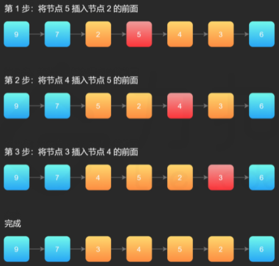

```java
// 单链表节点的结构
public class ListNode {
    int val;
    ListNode next;
    ListNode(int x) { val = x; }
}
```

**注意这里的索引是从 1 开始的**

# 反转链表

## [LC206. 反转整个链表](https://leetcode-cn.com/problems/reverse-linked-list/)

给你单链表的头节点 `head` ，请你反转链表，并返回反转后的链表头节点。

**示例 1：**


```
输入：head = [1,2,3,4,5]
输出：[5,4,3,2,1]
```

**示例 2：**


```
输入：head = [1,2]
输出：[2,1]
```

**示例 3：**

```
输入：head = []
输出：[]
```

函数签名：

```java
public ListNode reverseList(ListNode head);
```

### 思路：迭代

在遍历链表时，将**当前节点的 next 指针指向前一个节点**，由于节点没有引用其前一个节点，因此必须事**先存储其前一个节点**。在**更改引用之前，还需要存储后一个节点**。最后返回新的头引用。

### Solution：迭代

```java
public ListNode reverseList(ListNode head) {
        ListNode prev = null, curr = head;
        while(curr!=null){
            ListNode next = curr.next;
            curr.next = prev;
            prev = curr;
            curr = next;
        }
        return prev;
    }
```

- 时间复杂度：O(n)，其中 n 是链表的长度。需要遍历链表一次。
- 空间复杂度：O(1)。

### 思路：递归

原始链表


执行递归

```java
ListNode last = reverseList(head.next);
```


不要跳进递归（**<u>你的脑袋能压几个栈呀？</u>**），而是要根据刚才的函数定义，来弄清楚这段代码会产生什么结果：


想把当前的链表**反转**，需要做什么？--> **让2指向1，1变成最后一个节点，1指向null**：

```java
head.next.next = head;
head.next = null;
```


最后，两个地方需要注意：

1、 **base case**：

```java
if (head.next == null) return head;
```

意思是如果链表只有一个节点的时候反转也是它自己，直接返回即可；

2、当链表递归反转之后，新的头结点是 `last`，返回新的头节点last

```java
return last;
```

3、特例：空链表

```java
if (head == null) return head;
```

意思是如果链表为空，返回null也就是自己；

### Solution：递归

```java
public ListNode reverseList(ListNode head) {
        //空链表 || base case:遍历到最后一个元素
        if(head==null || head.next==null)
            return head;
        ListNode last = reverseList(head.next);
        head.next.next = head;//2->1
        head.next = null;//1->null
        return last;
    }
```

时间复杂度：O(n)，其中 n 是链表的长度。需要对链表的每个节点进行反转操作。

空间复杂度：O(n)，其中 n 是链表的长度。空间复杂度主要取决于**递归调用的栈空间**，最多为 n 层。

## [labuladong反转链表前 N 个节点](https://labuladong.gitbook.io/algo/mu-lu-ye-1/mu-lu-ye/di-gui-fan-zhuan-lian-biao-de-yi-bu-fen#er-fan-zhuan-lian-biao-qian-n-ge-jie-dian)


函数签名：

```java
// 将链表的前 n 个节点反转（n <= 链表长度）
ListNode reverseN(ListNode head, int n)
```

### 思路：

解决思路和反转整个链表差不多，只要稍加修改即可：

1、base case 变为 `n == 1`，反转一个元素，就是它本身，同时**要记录后驱节点successor**。

2、刚才我们直接把 `head.next` 设置为 null，因为整个链表反转后原来的 `head` 变成了整个链表的最后一个节点。但现在 `head` 节点在递归反转之后不一定是最后一个节点了，所以要记录后驱 `successor`（第 n + 1 个节点），反转之后将 `head` 连接上。


```java
ListNode succ = null;// 后驱节点

// 反转以 head 为起点的 n 个节点，返回新的头结点
public ListNode reverseN(ListNode head, int n){
  	if(n==1){
      	succ = head.next;// 记录第 n + 1 个节点
      	return head;
    }
  	
  	ListNode last = reverseN(head.next, n-1);// 以 head.next 为起点，需要反转前 n - 1 个节点
  	head.next.next = head;
  	head.next = succ;// 让反转之后的 head 节点和后面的节点连起来
  	return last;
}
```

## [LC92. 反转链表的一部分](https://leetcode-cn.com/problems/reverse-linked-list-ii/)

给你单链表的头指针 `head` 和两个整数 `left` 和 `right` ，其中 `left <= right` 。请你反转从位置 `left` 到位置 `right` 的链表节点，返回 **反转后的链表表头** 。

索引从1开始。

**示例 1：**


```
输入：head = [1,2,3,4,5], left = 2, right = 4
输出：[1,4,3,2,5]
```

**示例 2：**

```
输入：head = [5], left = 1, right = 1
输出：[5]
```

函数签名：

```java
public ListNode reverseBetween(ListNode head, int left, int right);
```

### 思路：递归

如果 `m == 1`，就相当于反转链表开头的 `n` 个元素嘛，也就是我们刚才实现的功能，我们可以理解为base case，：

```
ListNode reverseBetween(ListNode head, int m, int n) {
    // base case
    if (m == 1) {
        // 相当于反转前 n 个元素
        return reverseN(head, n);
    }
    // ...
}
```

如果 `m != 1` 我们可以前进到反转的起点出发base case：
我们把 `head` 的索引视为 1，那么我们是想从第 `m` 个元素开始反转对吧；
把 `head.next` 的索引视为 1 ，相对于 `head.next`，反转的区间应该是从第 `m - 1` 个元素开始的；
把 `head.next.next` 的索引视为1……

### Solution：递归

```java
public ListNode reverseBetween(ListNode head, int m, int n) {
        // base case
        if(m==1){
            return reverseN(head, n);
        }
        // 前进到反转的起点触发 base case
        head.next = reverseBetween(head.next, m-1, n-1);//头尾都要减一因为指针向后移动
        return head;
    }
    ListNode succ = null;
    public ListNode reverseN(ListNode head, int n){
        if(n==1){
            succ = head.next;
            return head;
        }
        ListNode last = reverseN(head.next, n-1);
        head.next.next = head;
        head.next = succ;
        return last;
    }
```

### 思路：迭代（头插法）

在需要反转的区间里，每遍历到一个节点，让这个新节点来到反转部分的起始位置。下面的图展示了整个流程。




使用三个指针变量 pre、curr、next 来记录反转的过程中需要的变量，它们的意义如下：

- pre：永远指向待反转区域的第一个节点 left 的前一个节点，在循环过程中不变。
- curr：指向待反转区域待反转的节点；
- next：永远指向 curr 的下一个节点，循环过程中，curr 变化以后 next 会变化。(**next是实际被头插的节点**)

决定赋值顺序：

- next = curr.next：先确定要被头插的节点
- curr.next = **next.next**：curr的下一个节点，只能通过next获取，所以要最先赋值
- next.next = **pre.next**：被头插的节点(next)的下一个节点, 只能通过pre.next来获得
- pre.next = next：最后，pre.next指向next


### Solution：迭代（头插法）

```java
public ListNode reverseBetween(ListNode head, int m, int n) {
        ListNode dummyNode = new ListNode();
        dummyNode.next = head;
        ListNode pre = dummyNode;
        for(int i=0; i<m-1; i++){//找到left的前一位
            pre = pre.next;
        }
        ListNode curr = pre.next;
        for(int i=0; i<n-m; i++){//curr.next被头插，因为是闭区间（e.g.[4，7]总共4个数字，但只用头插3次），所以总共头插right-left次
            ListNode next = curr.next;//实际被头插的元素
            curr.next = next.next;//curr的下一个节点，只能通过next获取，所以要最先赋值
            next.next = pre.next;//被头插的节点(next)的下一个节点, 只能通过pre.next来获得
            pre.next = next;//最后，pre指向被头插的节点
        }
        //m>1时，可以直接返回head，因为head并不会被交换；
        //但m=1时，pre=dummyNode, 即dummyNode永远是head的前一位；
        return dummyNode.next;
    }
```

递归操作链表并不高效。和迭代解法相比，虽然时间复杂度都是 O(N)，但是迭代解法的空间复杂度是 O(1)，而递归解法需要堆栈，空间复杂度是 O(N)。