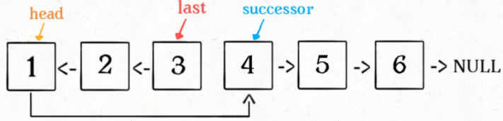

```java
// 单链表节点的结构
public class ListNode {
    int val;
    ListNode next;
    ListNode(int x) { val = x; }
}
```

# Hints

1. **注意这里的索引是从 1 开始的**

2. 链表的操作需要维护后继关系，例如在某个节点 node1 之后插入一个节点 node2，我们可以通过修改**后继关系**来实现，所以要记住后继节点（这里为3）：

    ```java
    node3 = node1.next;
    node2.next = node3;
    node1.next = node2;
    ```


# 链表

## [剑指 Offer 06. 从尾到头打印链表](https://leetcode-cn.com/problems/cong-wei-dao-tou-da-yin-lian-biao-lcof/)

输入一个链表的头节点，从尾到头反过来返回每个节点的值（用数组返回）。 

**示例 1：**

```Java
输入：head = [1,3,2]
输出：[2,3,1]
```

 函数签名：

```java
public int[] reversePrint(ListNode head);
```

### Solution 1：递归，链表的后序遍历

```java
public int[] reversePrint(ListNode head) {
        //先数一下链表长度，建立数组
        int count = 0;
        ListNode countNode = head;
        while(countNode!=null){
            count++;
            countNode = countNode.next;
        }
        int[] res = new int[count];
        return recurPrint(head, res, count-1);//注意进入递归的idx
    }

    public int[] recurPrint(ListNode head, int[] res, int idx){
        if(head==null){//base case，或者用idx==-1
            return res;
        }
        res = recurPrint(head.next, res, idx-1);
        //后序遍历位置
        res[idx] = head.val;
        return res;
    }
```

- **时间复杂度 O(N)：** 遍历链表，递归 N次。
- **空间复杂度 O(N)：** 系统递归需要使用 O(N)的栈空间。

### Solution2：头插法

**在遍历原始链表时，将当前节点插入新链表的头部，使其成为第一个节点，顺序自然就是逆序。**


为了能将一个节点插入头部，我们引入了一个叫dummy的辅助头节点，该节点不存储值，只是为了方便进行插入操作。


```java
public int[] reversePrint(ListNode head) {
        ListNode dummy = new ListNode();//伪头节点
        int count = 0;
        while(head!=null){
            count++;
            ListNode next = head.next;
            head.next = dummy.next;
            dummy.next = head;
            head = next;
        }

        int[] res = new int[count];
        int i = 0;
        while(i<count && dummy.next!=null){
            res[i] = dummy.next.val;
            
            dummy = dummy.next;
            i++;
        }
        return res;
    }
```

- **时间复杂度 O(N)：** 遍历链表，递归 N次。
- **空间复杂度 O(N)：** 新链表需要使用N的空间。

### Solution3：栈

栈具有后进先出的特点，在遍历链表时将值按顺序放入栈中，最后出栈的顺序即为逆序。


```java
public int[] reversePrint(ListNode head) {
        Stack<Integer> stack = new Stack<>();
        int count = 0;
        while(head!=null){
            stack.push(head.val);
            count++;
            head = head.next;
        }
        
        int[] res = new int[count];
        int i = 0;
        while(!stack.isEmpty()){
            res[i++] = stack.pop();//算完res[i]的结果才+1
        }
        return res;
    }
```

- **时间复杂度 O(N)：** 遍历链表，递归 N次。

- **空间复杂度 O(N)：** 辅助栈需要使用N的空间。

    

## [LC237. 删除链表中的(非末尾)节点](https://leetcode-cn.com/problems/delete-node-in-a-linked-list/)

请编写一个函数，使其可以删除某个链表中给定的（非末尾）节点。传入函数的唯一参数为 **要被删除的节点** 。

现有一个链表 -- head = [4,5,1,9]，它可以表示为:


 

**示例 1：**

```
输入：head = [4,5,1,9], node = 5
输出：[4,1,9]
解释：给定你链表中值为 5 的第二个节点，那么在调用了你的函数之后，该链表应变为 4 -> 1 -> 9.
```

**示例 2：**

```
输入：head = [4,5,1,9], node = 1
输出：[4,5,9]
解释：给定你链表中值为 1 的第三个节点，那么在调用了你的函数之后，该链表应变为 4 -> 5 -> 9.
```

###  Solution：

直接将下一个节点的值赋给该节点，然后令该节点指向下下个节点，再删除下一个节点，时间复杂度为 O(1)。


```java
public void deleteNode(ListNode tobeDeleted) {
        tobeDeleted.val = tobeDeleted.next.val;
        tobeDeleted.next = tobeDeleted.next.next;
    }
```

时间复杂度为 O(1)。

## [剑指 Offer 18. 删除链表的某个节点](https://leetcode-cn.com/problems/shan-chu-lian-biao-de-jie-dian-lcof/)

给定单向链表的头指针和一个要删除的节点的值，定义一个函数删除该节点。

返回删除后的链表的头节点。

**注意：**此题对比原题有改动

**示例 1:**

```
输入: head = [4,5,1,9], val = 5
输出: [4,1,9]
解释: 给定你链表中值为 5 的第二个节点，那么在调用了你的函数之后，该链表应变为 4 -> 1 -> 9.
```

**示例 2:**

```
输入: head = [4,5,1,9], val = 1
输出: [4,5,9]
解释: 给定你链表中值为 1 的第三个节点，那么在调用了你的函数之后，该链表应变为 4 -> 5 -> 9.
```

函数签名：

```java
public ListNode deleteNode(ListNode head, int val);
```

### 思路

要删除某个节点，只需将该节点的前序节点和后继节点相连

### Solution

```java
public ListNode deleteNode(ListNode head, int val) {
        //删除头节点
        if(head.val==val)
            return head.next;

        //删除非头节点，需要记住前置节点
        ListNode pre = head;
        ListNode curr = head.next;
        while(curr!=null){
            if(curr.val==val){
                pre.next = curr.next;//将要删除的节点的前序节点和后继节点相连
                return head;
            }
            pre = curr;
            curr = curr.next;
        }
        return head;
    }
```

时间复杂度O(n)

空间复杂度O(1)

## [LC83. 删除排序链表中的重复元素：保留一个重复的元素](https://leetcode-cn.com/problems/remove-duplicates-from-sorted-list/)

存在一个按**升序**排列的链表，给你这个链表的头节点 `head` ，请你删除所有重复的元素，使每个元素 **只出现一次** 。

返回同样按升序排列的结果链表。

**示例 1：**


```
输入：head = [1,1,2]
输出：[1,2]
```

**示例 2：**


```
输入：head = [1,1,2,3,3]
输出：[1,2,3]
```

 函数签名：

```java
public ListNode deleteDuplicates(ListNode head);
```

### Solution

已经是升序，因此**重复的元素在链表中出现的位置是连续的**，只需根据pre 和 curr的关系来判断：

- pre==curr: 删除curr，即pre.next=curr.next, curr=curr.next
- pre!=curr: 将pre和curr都向后移一位，即pre=curr，curr=curr.next

```java
public ListNode deleteDuplicates(ListNode head) {
        if(head==null)
            return head;

        ListNode pre = head;
        ListNode curr = head.next;
        while(curr!=null){
            if(pre.val==curr.val){
                pre.next = curr.next;
            } else {
                pre = curr;
            }
            curr = curr.next;
        }

        return head;
    }
```

- 时间复杂度：O(n)，其中 n是链表的长度。
- 空间复杂度：O(1)。

## [LC82. 删除排序链表中的重复元素 II：不保留重复元素](https://leetcode-cn.com/problems/remove-duplicates-from-sorted-list-ii/)

存在一个按**升序**排列的链表，给你这个链表的头节点 `head` ，请你删除链表中所有存在数字重复情况的节点，只保留原始链表中 **没有重复出现** 的数字。

返回同样按升序排列的结果链表。

**示例 1：**


```
输入：head = [1,2,3,3,4,4,5]
输出：[1,2,5]
```

**示例 2：**


```
输入：head = [1,1,1,2,3]
输出：[2,3]
```

函数签名：

```java
public ListNode deleteDuplicates(ListNode head);
```

### 思路：迭代遍历

由于链表的头节点可能会被删除，因此我们需要额外使用一个哑节点（dummy node）指向链表的头节点。

具体地，我们从指针 cur 指向链表的哑节点，随后开始对链表进行遍历。

如果当前 cur.next 与 cur.next.next 对应的元素相同，那么我们就需要将 cur.next 以及所有后面拥有相同元素值的链表节点全部删除。我们记下这个元素值 x，随后不断将 cur.next 从链表中移除，直到 cur.next 为空节点或者其元素值不等于 x 为止。此时，我们将链表中所有元素值为 x 的节点全部删除。

如果当前 cur.next 与 cur.next.next 对应的元素不相同，那么说明链表中只有一个元素值为 cur.next 的节点，那么我们就可以将 cur 指向 cur.next。

当遍历完整个链表之后，我们返回链表的的哑节点的下一个节点 dummy.next 即可。

细节：

需要注意 cur.next 以及 cur.next.next 可能为空节点，如果不加以判断，可能会产生运行错误。

### Solution

```java
public ListNode deleteDuplicates(ListNode head) {
        if(head==null)
            return head;
        ListNode dummy = new ListNode(6666);
        dummy.next = head;
        
        ListNode curr = dummy;//从head的前一位开始判断head和head.next的关系（从当前节点向后判断两位）
        while(curr.next!=null && curr.next.next!=null){
            if(curr.next.val!=curr.next.next.val){
                curr = curr.next;
            } else {
                int repeatVal = curr.next.val;
                while(curr.next!=null && curr.next.val==repeatVal){
                    curr.next = curr.next.next;//示例1中: 当curr为2时，curr.next=4即可跳出循环（跳过两个3）
                }
            }
        }
        return dummy.next;
    }
```

- 时间复杂度：O(n)，其中 n*n* 是链表的长度。
- 空间复杂度：O(1)。

## [剑指 Offer 22. 链表中倒数第k个节点](https://leetcode-cn.com/problems/lian-biao-zhong-dao-shu-di-kge-jie-dian-lcof/)

输入一个链表，输出该链表中倒数第k个节点。为了符合大多数人的习惯，本题从1开始计数，即链表的尾节点是倒数第1个节点。

例如，一个链表有 `6` 个节点，从头节点开始，它们的值依次是 `1、2、3、4、5、6`。这个链表的倒数第 `3` 个节点是值为 `4` 的节点。

**示例：**

```
给定一个链表: 1->2->3->4->5, 和 k = 2.

返回链表 4->5.
```

函数签名：

```java
public ListNode getKthFromEnd(ListNode head, int k);
```

### 思路：双指针

设链表的长度为 N。设置两个指针 P1 和 P2，先让 P1 移动 K 个节点，则还有 N - K 个节点可以移动。此时让 P1 和 P2 同时移动，可以知道当 P1 移动到链表结尾时，P2 移动到第 N - K 个节点处，该位置就是倒数第 K 个节点。


### Solution:

```java
public ListNode getKthFromEnd(ListNode head, int k) {
        ListNode p1 = head, p2 = head;
        for(int i=0; i<k; i++){//p1先走k位
            p1 = p1.next;
        }
        while(p1!=null){//p1、p2同时开始走
            p1 = p1.next;
            p2 = p2.next;
        }
        return p2;
    }
```

## [LC19. 删除链表的倒数第 N 个结点](https://leetcode-cn.com/problems/remove-nth-node-from-end-of-list/)

给你一个链表，删除链表的倒数第 n 个结点，并且返回链表的头结点。

进阶：你能尝试使用一趟扫描实现吗？

 示例 1：


输入：head = [1,2,3,4,5], n = 2
输出：[1,2,3,5]

示例 2：

输入：head = [1], n = 1
输出：[]

示例 3：

输入：head = [1,2], n = 1
输出：[1]

函数签名：

```java
public ListNode removeNthFromEnd(ListNode head, int n);
```


### 思路

让快指针先走 `n` 步：

如果n步后走到null，说明倒数第 n 个节点就是第一个节点；

如果n步后快指针没走到头，快慢指针开始同速前进。这样当快指针走到链表末尾 `null` 时，慢指针所在的位置就是倒数第 `n` 个链表节点（`n` 不会超过链表长度）。

### Solution

```java
		public ListNode removeNthFromEnd(ListNode head, int n) {
        ListNode fast = head, slow = head;
        while(n>0){
            fast = fast.next;
            n--;
        }

        // 如果此时快指针走到头了，说明倒数第 n 个节点就是第一个节点
        if(fast==null)
            return head.next;
        
        // 让慢指针和快指针同步向前
        while(fast!=null && fast.next!=null){//fast.next!=null是为了防止slow多走一位
            slow = slow.next;
            fast = fast.next;
        }
        // slow.next 就是倒数第 n 个节点，删除它
        slow.next = slow.next.next;
        return head;
    }
```


## [LC141. 环形链表: 判断链表中是否有环](https://leetcode-cn.com/problems/linked-list-cycle/)

给定一个链表，判断链表中是否有环。

如果链表中有某个节点，可以通过连续跟踪 next 指针再次到达，则链表中存在环。 为了表示给定链表中的环，我们使用整数 pos 来表示链表尾连接到链表中的位置（索引从 0 开始）。 如果 pos 是 -1，则在该链表中没有环。注意：pos 不作为参数进行传递，仅仅是为了标识链表的实际情况。

如果链表中存在环，则返回 true 。 否则，返回 false 。


示例 1：


输入：head = [3,2,0,-4], pos = 1
输出：true
解释：链表中有一个环，其尾部连接到第二个节点。

示例 2：


输入：head = [1,2], pos = 0
输出：true
解释：链表中有一个环，其尾部连接到第一个节点。

示例 3：


输入：head = [1], pos = -1
输出：false
解释：链表中没有环。

提示：**pos可忽略，按照链表的特性去做题即可**

函数签名：

```java
public boolean hasCycle(ListNode head);
```


### **思路**

用两个指针，一个跑得快，一个跑得慢。

​		如果不含有环，跑得快的那个指针最终会遇到 `null`，说明链表不含环；

​		如果含有环，快指针最终会超慢指针一圈，和慢指针相遇，说明链表含有环。

### <u>**Solution**</u>

```java
		public boolean hasCycle(ListNode head) {
        ListNode slow = head, fast = head;
        //fast.next!=null是为了防止NullPointerException
      	//要确保fast、fast.next都不为null才能访问fast.next.next
        while(fast!=null && fast.next!=null){
            slow = slow.next;
            fast = fast.next.next;
            if(fast==slow)
                return true;
        }
        return false;
    }
```

## [LC142. 环形链表 II: 返回链表开始入环的第一个节点；如果链表无环，则返回 null](https://leetcode-cn.com/problems/linked-list-cycle-ii/)

函数签名：

```java
public ListNode detectCycle(ListNode head);
```

**`当快慢指针相遇时，让其中任一个指针指向头节点，然后让它俩以相同速度前进，再次相遇时所在的节点位置就是环开始的位置。`**（下面的解释看不懂就记结论！）

第一次相遇时，假设慢指针 `slow` 走了 `k` 步，那么快指针 `fast` 一定走了 `2k` 步。**这多走的** **`k`** **步其实就是** **`fast`** **指针在环里转圈圈，所以** **`k`** **的值就是环长度的「整数倍」**。

设**相遇点距环的起点的距离**为 `m`，那么**环的起点距头结点 `head` 的距离**为 `k - m`，也就是说如果从 `head` 前进 `k - m` 步就能到达环起点。

巧的是，如果从相遇点继续前进 `k - m` 步，也恰好到达环起点。你甭管 `fast` 在环里到底转了几圈，反正走 `k` 步可以到相遇点，那走 `k - m` 步一定就是走到环起点了：


所以，只要我们把快慢指针中的任一个重新指向 `head`，然后两个指针同速前进，`k - m` 步后就会相遇，相遇之处就是环的起点了。

### <u>**Solution**</u>

```java
		public ListNode detectCycle(ListNode head) {
        ListNode slow = head, fast = head;
      	//fast.next!=null是为了防止NullPointerException
      	//要确保fast、fast.next都不为null才能访问fast.next.next
        while(fast!=null && fast.next!=null){
            slow = slow.next;
            fast = fast.next.next;
            if(fast==slow)
                break;
        }
        
        if(fast==null || fast.next==null)
        // fast 遇到空指针说明没有环
            return null;

        slow = head;
        while(slow!=fast){
            slow = slow.next;
            fast = fast.next;
        }
        return slow;
    }
```

## [LC876. 链表的中间结点](https://leetcode-cn.com/problems/middle-of-the-linked-list/)

给定一个头结点为 head 的非空单链表，返回链表的中间结点。

如果有两个中间结点，则返回**第二个中间结点**。

示例 1：

输入：[1,2,3,4,5]
输出：此列表中的结点 3 (序列化形式：[3,4,5])
返回的结点值为 3 。 (测评系统对该结点序列化表述是 [3,4,5])。
注意，我们返回了一个 ListNode 类型的对象 ans，这样：
ans.val = 3, ans.next.val = 4, ans.next.next.val = 5, 以及 ans.next.next.next = NULL.
示例 2：

输入：[1,2,3,4,5,6]
输出：此列表中的结点 4 (序列化形式：[4,5,6])
由于该列表有两个中间结点，值分别为 3 和 4，我们返回第二个结点。

函数签名：

```java
public ListNode middleNode(ListNode head);
```


#### <u>**Solution**</u>

如果链表无环（非空单链表即表示无环），则可用快慢指针的方法，快指针速度是慢指针的2倍；

快指针走完时，慢指针正好走到链表的中间位置（node总数为奇数）；

如果长度是偶数，`slow` 最终的位置是中间偏右，因为null也占一位，slow会多走一位


图中left即为slow

```java
		public ListNode middleNode(ListNode head) {
        ListNode fast, slow;
        fast = slow = head;
        while (fast != null && fast.next != null) {
            fast = fast.next.next;
            slow = slow.next;
        }
    // slow 就在中间位置
    return slow;
    }
```

## [剑指 Offer 25. 合并两个排序的链表](https://leetcode-cn.com/problems/he-bing-liang-ge-pai-xu-de-lian-biao-lcof/)

输入两个递增排序的链表，合并这两个链表并使新链表中的节点仍然是递增排序的。

**示例1：**

```
输入：1->2->4, 1->3->4
输出：1->1->2->3->4->4
```

函数签名：

```java
public ListNode mergeTwoLists(ListNode l1, ListNode l2);
```

### Solution1：递归

```java
public ListNode mergeTwoLists(ListNode l1, ListNode l2) {
        if(l1==null)
            return l2;
        if(l2==null)
            return l1;
        if(l1.val>l2.val){
            l2.next = mergeTwoLists(l1, l2.next);
            return l2;
        } else {
            l1.next = mergeTwoLists(l1.next, l2);
            return l1;
        }
    }
```

### Solution2：迭代

```java
public ListNode mergeTwoLists(ListNode l1, ListNode l2) {
        ListNode dummy = new ListNode(-1);
        ListNode curr = dummy;
        while(l1!=null && l2!=null){
            if(l1.val>l2.val){
                curr.next = l2;
                l2 = l2.next;
            } else {
                curr.next = l1;
                l1 = l1.next;
            }
            curr = curr.next;
        }
        if(l1==null)
            curr.next = l2;
        
        if(l2==null)
            curr.next = l1;

        return dummy.next;
    }
```

## [剑指 Offer 52. 两个链表的第一个公共节点](https://leetcode-cn.com/problems/liang-ge-lian-biao-de-di-yi-ge-gong-gong-jie-dian-lcof/)

输入两个链表，找出它们的第一个公共节点。

如下面的两个链表**：**

[](https://assets.leetcode-cn.com/aliyun-lc-upload/uploads/2018/12/14/160_statement.png)

在节点 c1 开始相交。

 

**示例 1：**

[](https://assets.leetcode.com/uploads/2018/12/13/160_example_1.png)

```
输入：intersectVal = 8, listA = [4,1,8,4,5], listB = [5,0,1,8,4,5], skipA = 2, skipB = 3
输出：Reference of the node with value = 8
输入解释：相交节点的值为 8 （注意，如果两个列表相交则不能为 0）。从各自的表头开始算起，链表 A 为 [4,1,8,4,5]，链表 B 为 [5,0,1,8,4,5]。在 A 中，相交节点前有 2 个节点；在 B 中，相交节点前有 3 个节点。
```

 

**示例 2：**

[](https://assets.leetcode.com/uploads/2018/12/13/160_example_2.png)

```
输入：intersectVal = 2, listA = [0,9,1,2,4], listB = [3,2,4], skipA = 3, skipB = 1
输出：Reference of the node with value = 2
输入解释：相交节点的值为 2 （注意，如果两个列表相交则不能为 0）。从各自的表头开始算起，链表 A 为 [0,9,1,2,4]，链表 B 为 [3,2,4]。在 A 中，相交节点前有 3 个节点；在 B 中，相交节点前有 1 个节点。
```

 

**示例 3：**

[](https://assets.leetcode.com/uploads/2018/12/13/160_example_3.png)

```
输入：intersectVal = 0, listA = [2,6,4], listB = [1,5], skipA = 3, skipB = 2
输出：null
输入解释：从各自的表头开始算起，链表 A 为 [2,6,4]，链表 B 为 [1,5]。由于这两个链表不相交，所以 intersectVal 必须为 0，而 skipA 和 skipB 可以是任意值。
解释：这两个链表不相交，因此返回 null。
```

 

**注意：**

- 如果两个链表没有交点，返回 `null`.
- 在返回结果后，两个链表仍须保持原有的结构。
- 可假定整个链表结构中没有循环。
- 程序尽量满足 O(*n*) 时间复杂度，且仅用 O(*1*) 内存。

函数签名：

```java
public ListNode getIntersectionNode(ListNode a, ListNode b);
```

**<u>注意：这题是比较a是否等于b，而不是比较a.val是否等于b.val;</u>**

### 思路1: 哈希表

- 遍历a，将a存入哈希表
- 遍历b，如果哈希表contains(b)，则返回b
- 遍历完b没找到，就返回null。

### Solution1：哈希表

```java
public ListNode getIntersectionNode(ListNode a, ListNode b) {
        Set<ListNode> set = new HashSet<>();
        while (a != null) {
            set.add(a);
            a = a.next;
        }
        while (b != null && !set.contains(b)) b = b.next;
        return b;//b此时为null
    }

```

- 时间复杂度：O(n + m)
- 空间复杂度：O(n)

### 思路2：差值法

由于两条链表在相交节点后面的部分完全相同，因此我们可以先对两条链表进行遍历，分别得到两条链表的长度，并计算差值 d。

让长度较长的链表先走 d 步，然后两条链表同时走，第一个相同的节点即是节点。

### Solution2：差值法

```java
public ListNode getIntersectionNode(ListNode a, ListNode b) {
        int lenA = 0, lenB = 0;
        ListNode dummyA = a, dummyB = b;
        //计算a、b的长度
        while(dummyA!=null){
            lenA++;
            dummyA = dummyA.next;
        }
        while(dummyB!=null){
            lenB++;
            dummyB = dummyB.next;
        }
        //让长度较长的链表先走 ｜lenA-lenB| 步
        if(lenA-lenB>0){
            for(int i=0; i<lenA-lenB; i++){
                a = a.next;
            }
        } else {
            for(int i=0; i<lenB-lenA; i++){
                b = b.next;
            }
        }
        //两条链表同时走，第一个相同的节点即是节点。
        while(a!=b){
            a = a.next;
            b = b.next;
        }
        return a;//如果没有交点，这里会返回null
    }
```

- 时间复杂度：O(n + m)
- 空间复杂度：O(1)

## [剑指 Offer 35. 复杂链表的复制](https://leetcode-cn.com/problems/fu-za-lian-biao-de-fu-zhi-lcof/)

难度中等249

请实现 `copyRandomList` 函数，复制一个复杂链表。在复杂链表中，每个节点除了有一个 `next` 指针指向下一个节点，还有一个 `random` 指针指向链表中的任意节点或者 `null`。

 

**示例 1：**


```
输入：head = [[7,null],[13,0],[11,4],[10,2],[1,0]]
输出：[[7,null],[13,0],[11,4],[10,2],[1,0]]
```

**示例 2：**


```
输入：head = [[1,1],[2,1]]
输出：[[1,1],[2,1]]
```

**示例 3：**

****

```
输入：head = [[3,null],[3,0],[3,null]]
输出：[[3,null],[3,0],[3,null]]
```

**示例 4：**

```
输入：head = []
输出：[]
解释：给定的链表为空（空指针），因此返回 null。
```

 函数签名：

```java
public Node copyRandomList(Node head)
```

### 思路：

第一步，在每个节点的后面插入复制的节点。


第二步，对复制节点的 random 链接进行赋值。


第三步，拆分。


### Solution：

```java
public Node copyRandomList(Node head) {
        if(head==null)
            return head;

        Node curr = head;

        //复制
        while(curr!=null){
            Node clone = new Node(curr.val);
            clone.next = curr.next;
            curr.next = clone;
            curr = clone.next;
        }

        //给clone.random赋值
        curr = head;
        while(curr!=null){
            Node clone = curr.next;
            if(curr.random!=null)
                clone.random = curr.random.next;
            curr = clone.next;
        }

        //拆分
        curr = head;
        Node dummyClone = head.next;
        while(curr.next!=null){
            Node next = curr.next;
            curr.next = next.next;
            curr = next;
        }
        
        return dummyClone;
    }
```


- **时间复杂度 O(N) ：** 三轮遍历链表，使用 O(N)时间。
- **空间复杂度 O(1)：** 节点引用变量使用常数大小的额外空间。


# 反转链表

## [LC206. 反转整个链表](https://leetcode-cn.com/problems/reverse-linked-list/)

给你单链表的头节点 `head` ，请你反转链表，并返回反转后的链表头节点。

**示例 1：**


```
输入：head = [1,2,3,4,5]
输出：[5,4,3,2,1]
```

**示例 2：**


```
输入：head = [1,2]
输出：[2,1]
```

**示例 3：**

```
输入：head = []
输出：[]
```

函数签名：

```java
public ListNode reverseList(ListNode head);
```

### 思路：迭代

在遍历链表时，将**当前节点的 next 指针指向前一个节点**，由于节点没有引用其前一个节点，因此必须事**先存储其前一个节点**。在**更改引用之前，还需要存储后一个节点**。最后返回新的头引用。

### Solution：迭代

```java
public ListNode reverseList(ListNode head) {
        ListNode prev = null, curr = head;
        while(curr!=null){
            ListNode next = curr.next;
            curr.next = prev;
            prev = curr;
            curr = next;
        }
        return prev;
    }
```

- 时间复杂度：O(n)，其中 n 是链表的长度。需要遍历链表一次。
- 空间复杂度：O(1)。

### 思路：递归

原始链表


执行递归

```java
ListNode last = reverseList(head.next);
```


不要跳进递归（**<u>你的脑袋能压几个栈呀？</u>**），而是要根据刚才的函数定义，来弄清楚这段代码会产生什么结果：


想把当前的链表**反转**，需要做什么？--> **让2指向1，1变成最后一个节点，1指向null**：

```java
head.next.next = head;
head.next = null;
```


最后，两个地方需要注意：

1、 **base case**：

```java
if (head.next == null) return head;
```

意思是如果链表只有一个节点的时候反转也是它自己，直接返回即可；

2、当链表递归反转之后，新的头结点是 `last`，返回新的头节点last

```java
return last;
```

3、特例：空链表

```java
if (head == null) return head;
```

意思是如果链表为空，返回null也就是自己；

### Solution：递归

```java
public ListNode reverseList(ListNode head) {
        //空链表 || base case:遍历到最后一个元素
        if(head==null || head.next==null)
            return head;
        ListNode last = reverseList(head.next);
        head.next.next = head;//2->1
        head.next = null;//1->null
        return last;
    }
```

时间复杂度：O(n)，其中 n 是链表的长度。需要对链表的每个节点进行反转操作。

空间复杂度：O(n)，其中 n 是链表的长度。空间复杂度主要取决于**递归调用的栈空间**，最多为 n 层。

## [labuladong反转链表前 N 个节点](https://labuladong.gitbook.io/algo/mu-lu-ye-1/mu-lu-ye/di-gui-fan-zhuan-lian-biao-de-yi-bu-fen#er-fan-zhuan-lian-biao-qian-n-ge-jie-dian)


函数签名：

```java
// 将链表的前 n 个节点反转（n <= 链表长度）
ListNode reverseN(ListNode head, int n)
```

### 思路：

解决思路和反转整个链表差不多，只要稍加修改即可：

1、base case 变为 `n == 1`，反转一个元素，就是它本身，同时**要记录后驱节点successor**。

2、刚才我们直接把 `head.next` 设置为 null，因为整个链表反转后原来的 `head` 变成了整个链表的最后一个节点。但现在 `head` 节点在递归反转之后不一定是最后一个节点了，所以要记录后驱 `successor`（第 n + 1 个节点），反转之后将 `head` 连接上。



```java
ListNode succ = null;// 后驱节点

// 反转以 head 为起点的 n 个节点，返回新的头结点
public ListNode reverseN(ListNode head, int n){
  	if(n==1){
      	succ = head.next;// 记录第 n + 1 个节点
      	return head;
    }
  	
  	ListNode last = reverseN(head.next, n-1);// 以 head.next 为起点，需要反转前 n - 1 个节点
  	head.next.next = head;
  	head.next = succ;// 让反转之后的 head 节点和后面的节点连起来
  	return last;
}
```

## [LC92. 反转链表的一部分](https://leetcode-cn.com/problems/reverse-linked-list-ii/)

给你单链表的头指针 `head` 和两个整数 `left` 和 `right` ，其中 `left <= right` 。请你反转从位置 `left` 到位置 `right` 的链表节点，返回 **反转后的链表表头** 。

索引从1开始。

**示例 1：**


```
输入：head = [1,2,3,4,5], left = 2, right = 4
输出：[1,4,3,2,5]
```

**示例 2：**

```
输入：head = [5], left = 1, right = 1
输出：[5]
```

函数签名：

```java
public ListNode reverseBetween(ListNode head, int left, int right);
```

### 思路：递归

如果 `m == 1`，就相当于反转链表开头的 `n` 个元素嘛，也就是我们刚才实现的功能，我们可以理解为base case，：

```java
ListNode reverseBetween(ListNode head, int m, int n) {
    // base case
    if (m == 1) {
        // 相当于反转前 n 个元素
        return reverseN(head, n);
    }
    // ...
}
```

如果 `m != 1` 我们可以前进到反转的起点出发base case：
我们把 `head` 的索引视为 1，那么我们是想从第 `m` 个元素开始反转对吧；
把 `head.next` 的索引视为 1 ，相对于 `head.next`，反转的区间应该是从第 `m - 1` 个元素开始的；
把 `head.next.next` 的索引视为1……

### Solution：递归

```java
public ListNode reverseBetween(ListNode head, int m, int n) {
        // base case
        if(m==1){
            return reverseN(head, n);
        }
        // 前进到反转的起点触发 base case
        head.next = reverseBetween(head.next, m-1, n-1);//头尾都要减一因为指针向后移动
        return head;
    }
    ListNode succ = null;
    public ListNode reverseN(ListNode head, int n){
        if(n==1){
            succ = head.next;
            return head;
        }
        ListNode last = reverseN(head.next, n-1);
        head.next.next = head;
        head.next = succ;
        return last;
    }
```

### 思路：迭代（头插法）

在需要反转的区间里，每遍历到一个节点，让这个新节点来到反转部分的起始位置。下面的图展示了整个流程。


使用三个指针变量 pre、curr、next 来记录反转的过程中需要的变量，它们的意义如下：

- pre：永远指向待反转区域的第一个节点 left 的前一个节点，在循环过程中不变。
- curr：指向待反转区域待反转的节点；
- next：永远指向 curr 的下一个节点，循环过程中，curr 变化以后 next 会变化。(**next是实际被头插的节点**)

决定赋值顺序：

- next = curr.next：先确定要被头插的节点
- curr.next = **next.next**：curr的下一个节点，只能通过next获取，所以要最先赋值
- next.next = **pre.next**：被头插的节点(next)的下一个节点, 只能通过pre.next来获得
- pre.next = next：最后，pre.next指向next


### Solution：迭代（头插法）

```java
public ListNode reverseBetween(ListNode head, int m, int n) {
        ListNode dummyNode = new ListNode();
        dummyNode.next = head;
        ListNode pre = dummyNode;
        for(int i=0; i<m-1; i++){//找到left的前一位
            pre = pre.next;
        }
        ListNode curr = pre.next;
        for(int i=0; i<n-m; i++){//curr.next被头插，因为是闭区间（e.g.[4，7]总共4个数字，但只用头插3次），所以总共头插right-left次
            ListNode next = curr.next;//实际被头插的元素
            curr.next = next.next;//curr的下一个节点，只能通过next获取，所以要最先赋值
            next.next = pre.next;//被头插的节点(next)的下一个节点, 只能通过pre.next来获得
            pre.next = next;//最后，pre指向被头插的节点
        }
        //m>1时，可以直接返回head，因为head并不会被交换；
        //但m=1时，pre=dummyNode, 即dummyNode永远是head的前一位；
        return dummyNode.next;
    }
```

递归操作链表并不高效。和迭代解法相比，虽然时间复杂度都是 O(N)，但是迭代解法的空间复杂度是 O(1)，而递归解法需要堆栈，空间复杂度是 O(N)。

## [！LC25. K 个一组反转链表！](https://leetcode-cn.com/problems/reverse-nodes-in-k-group/)

给你一个链表，每 *k* 个节点一组进行翻转，请你返回翻转后的链表。

*k* 是一个正整数，它的值小于或等于链表的长度。

如果节点总数不是 *k* 的整数倍，那么请将最后剩余的节点保持原有顺序。

**进阶：**

- 你可以设计一个只使用常数额外空间的算法来解决此问题吗？
- **你不能只是单纯的改变节点内部的值**，而是需要实际进行节点交换。

**示例 1：**


```
输入：head = [1,2,3,4,5], k = 2
输出：[2,1,4,3,5]
```

**示例 2：**


```
输入：head = [1,2,3,4,5], k = 3
输出：[3,2,1,4,5]
```

**示例 3：**

```
输入：head = [1,2,3,4,5], k = 1
输出：[1,2,3,4,5]
```

**示例 4：**

```
输入：head = [1], k = 1
输出：[1]
```

函数签名：

```java
public ListNode reverseKGroup(ListNode head, int k);
```

### 思路：递归

对这个链表调用 `reverseKGroup(head, 2)`：


**1、先反转以** **`head`** **开头的** **`k`** **个元素**:


**2、将第** **`k + 1`** **个元素作为** **`head`** **递归调用** **`reverseKGroup`** **函数**:


**3、将上述两个过程的结果连接起来**:


最后，base case：如果最后的元素**不足 `k` 个，就保持不变**

最终结果就会是这样：


### Solution：递归

```java
public ListNode reverseKGroup(ListNode head, int k) {
        ListNode a = head;
        ListNode b = head;
        // 区间[a, b)包含k个待反转元素
        for(int i=0; i<k; i++){
            if(b==null)// base case：不足k个，不需要反转
                return head;
            b = b.next;
        }
        ListNode newHead = reverseAtoB(a, b);// 反转前 k 个元素
        // 递归反转后续链表并连接起来
        a.next = reverseKGroup(b, k);
        return newHead;
    }
    /** 反转区间 [a, b) 的元素，注意是左闭右开 */
    public ListNode reverseAtoB(ListNode a, ListNode b){
        ListNode pre = null;
        ListNode curr = a;
        while(curr!=b){// while 终止的条件从null改成b
            ListNode next = curr.next;
            curr.next = pre;
            pre = curr;
            curr = next;
        }
        return pre;// 返回反转后的头结点
    }
```

时间复杂度O(n)

空间复杂度O(n)???

### 思路：迭代

1、**函数返回的表头应为dummy.next**, 前一个表的表尾**pre**的初始值应为dummy

2、与递归相比，区别在于：


- 前一个表的表尾**pre**，应**连接**反转后的表头：

    ```java
    pre.next = reverseAtoB(a,b);
    ```

- 反转前的表头**a**，反转后变成了表尾，那么此次反转完成后pre应被**赋值**成a

    ```java
    pre = a;
    ```

- 反转前的表头**a**，反转后变成了表尾，表尾**连接**待反转的表的表头b

    ```
    a.next = b;
    ```

- 待反转的表头应为b：

    ```java
    a = b;
    ```

### Solution：迭代

```java
public ListNode reverseKGroup(ListNode head, int k) {
        ListNode dummy = new ListNode();
        dummy.next = head;//记录head前面的node用于返回head
        ListNode pre = dummy;//记录a前面的node，用于连接newHead
        //反转区间 [a, b) 的元素，注意是左闭右开
        ListNode a = head;
        ListNode b = head;
        while(b!=null){
            for(int i=0; i<k; i++){
                if(b==null)
                    return dummy.next;
                b = b.next;
            }
            pre.next = reverseAtoB(a,b);//前一个表的表尾pre，应连接反转后的表头
            a.next = b;//a原先是表头，反转后是表尾，表尾应连接待反转的表的表头
            pre = a;//待反转的表头的pre应是此次反转后的表尾a
            a = b;//下一次反转区间从b开始（a=b, b=b+k)
        }
        return dummy.next;
    }
    /** 反转区间 [a, b) 的元素，注意是左闭右开 */
    public ListNode reverseAtoB(ListNode a, ListNode b){
        ListNode pre = null;
        ListNode curr = a;
        while(curr!=b){// while 终止的条件从null改成b
            ListNode next = curr.next;
            curr.next = pre;
            pre = curr;
            curr = next;
        }
        return pre;// 返回反转后的头结点
    }
```

时间复杂度：O(n)，其中 n 为链表的长度。

空间复杂度：O(1)，我们只需要建立常数个变量。

## [LC234. 回文链表](https://leetcode-cn.com/problems/palindrome-linked-list/)

请判断一个链表是否为回文链表。

**示例 1:**

```
输入: 1->2
输出: false
```

**示例 2:**

```
输入: 1->2->2->1
输出: true
```

函数签名：

```java
public boolean isPalindrome(ListNode head);
```

### 思路：递归后序遍历（类似双指针比较）

这道题的关键在于，单链表无法倒着遍历，无法使用双指针技巧。那么最简单的办法就是，把原始链表反转存入一条新的链表，然后比较这两条链表是否相同。

其实，**借助二叉树后序遍历的思路，不需要显式反转原始链表也可以倒序遍历链表**。

**链表其实也可以有前序遍历和后序遍历**：

```java
void traverse(ListNode head) {
    // 前序遍历代码
    traverse(head.next);
    // 后序遍历代码
}
```

如果我想正序打印链表中的`val`值，可以在前序遍历位置写代码；反之，如果想倒序遍历链表，就可以在后序遍历位置操作：

```java
/* 倒序打印单链表中的元素值 */
void traverse(ListNode head) {
    if (head == null) return;
    traverse(head.next);
    // 后序遍历代码
    print(head.val);
}
```

稍作修改，模仿双指针实现回文判断的功能：**把链表节点放入一个栈，然后再拿出来，这时候元素顺序就是反的**，只不过我们利用的是递归函数的堆栈而已。

### Solution：递归后序遍历（类似双指针比较）

```java
// 左侧指针
ListNode left;


boolean isPalindrome(ListNode head) {
    left = head;
    return traverse(head);
}


boolean traverse(ListNode right) {
    if (right == null) return true;
    boolean res = traverse(right.next);
    // 后序遍历代码
    res = res && (right.val == left.val);
    left = left.next;
    return res;
}
```


时间和空间复杂度都是 O(N), 无论造一条反转链表还是利用后序遍历，

### 思路：快慢指针+反转后半部分的链表

**1、先通过「双指针技巧」中的快慢指针来找到链表的中点**：

```java
ListNode slow, fast;
slow = fast = head;
while (fast != null && fast.next != null) {
    slow = slow.next;
    fast = fast.next.next;
}
// slow 指针现在指向链表中点
```


**如果`fast`指针没有指向`null`，说明链表长度为奇数，`slow`还要再前进一步**：

```java
if (fast != null)
    slow = slow.next;
```


**2、从`slow`开始反转后面的链表，现在就可以开始比较回文串了**：

```java
ListNode left = head;
ListNode right = reverse(slow);//reverse函数略

while (right != null) {
    if (left.val != right.val)
        return false;
    left = left.next;
    right = right.next;
}
return true;
```


题外话：这种解法虽然高效，但**破坏了输入链表的原始结构**，能不能避免这个瑕疵呢？

其实这个问题很好解决，关键在于得到`p, q`这两个指针位置：


只要在函数 return 之前加一段代码即可恢复原先链表顺序：

```Java
p.next = reverse(q);
```

### Solution: 反转后半部分的链表

```java
public boolean isPalindrome(ListNode head) {
        ListNode slow = head;//慢指针
        ListNode fast = head;//快指针
        while(fast!=null && fast.next!=null){
            slow = slow.next;
            fast = fast.next.next;
        }
        //偶数[1,2,2,1]快指针走到null，慢指针走到后面的2；2参与比较，不用加一
        //奇数[1,2,3,2,1]快指针走到后面的1，慢指针走到3；3不参与比较，要加一
        if(fast!=null){
            slow = slow.next;
        }
        
        ListNode right = reverseAllFrom(slow);//[1,2,3,]
        ListNode startOfRight = right;//right的头节点，用于将链表恢复原序
        ListNode left = head;
        ListNode lastOfLeft = null;//slow的前一个节点,即中位节点，用于将链表恢复原序
        while(right!=null){//不能用left!=slow来判断，因为slow是中位节点+1
            if(left.val!=right.val){
                return false; 
            }
            lastOfLeft = left;
            left = left.next;
            right = right.next;
        }
        lastOfLeft.next = reverseAllFrom(startOfRight);//中位节点连接到反转前的头节点ß
        while(head!=null){
            System.out.print(head.val+", ");
            head = head.next;
        }
            
        return true;
    }
    //翻转slow到end(null)的链表，新的表头为pre
    public ListNode reverseAllFrom(ListNode head){
        ListNode pre = null;
        ListNode curr = head;
        while(curr!=null){
            ListNode next = curr.next;
            curr.next = pre;
            pre = curr;
            curr = next;
        }
        return pre;//返回表头
    }
```

时间复杂度还是O(n);

空间复杂度降到 O(1): 由于回文的特殊性，可以不完全反转链表，而是仅仅反转部分链表

# 